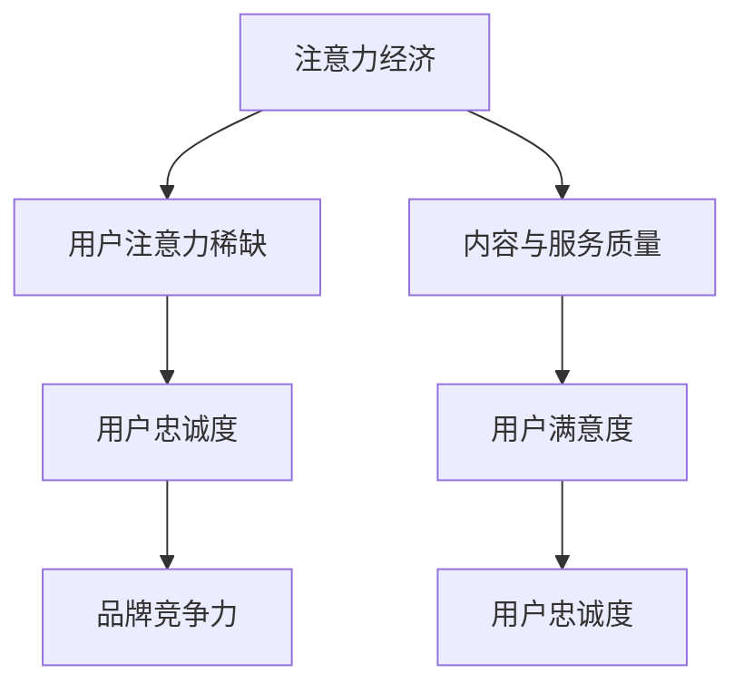
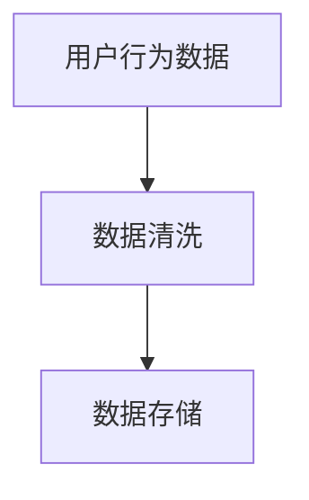
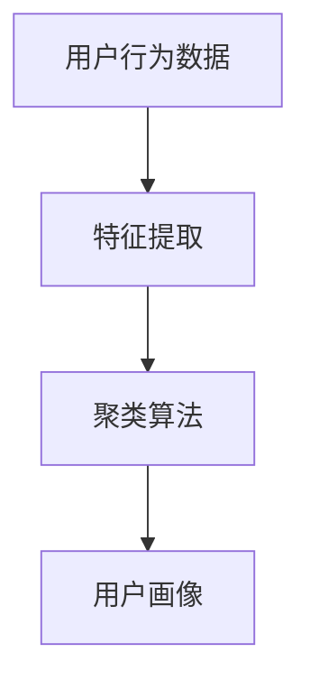
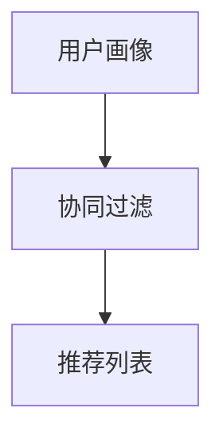
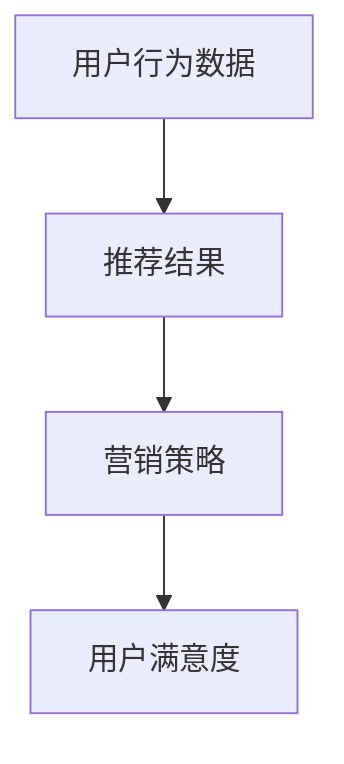

                 

关键词：注意力经济、用户忠诚度、算法、技术、营销策略、用户行为分析

> 摘要：本文将深入探讨注意力经济背景下，如何通过技术手段和策略提升用户的忠诚度。通过核心概念的解释、算法原理的阐述、数学模型的构建以及实际案例的分析，为企业和开发者提供实用的参考和指导。

## 1. 背景介绍

在数字时代，信息过载和注意力稀缺成为普遍现象。人们的时间被大量碎片化，很难长时间集中注意力。这种环境下，企业和开发者必须更加注重如何吸引并保持用户的注意力。注意力经济应运而生，其核心在于通过有效利用用户的时间和注意力，实现商业价值的最大化。

用户忠诚度是企业在注意力经济中取得长期成功的关键。高忠诚度的用户不仅倾向于重复购买，还可能为企业带来口碑效应和推荐。因此，提升用户忠诚度成为企业和开发者共同关注的课题。

## 2. 核心概念与联系

### 注意力经济的定义

注意力经济是指在经济活动中，人们的时间和注意力成为交易的对象。在注意力经济中，用户的注意力被看作是一种稀缺资源，企业通过提供有价值的内容和服务，获取用户的关注。

### 用户忠诚度的定义

用户忠诚度是指用户对企业或品牌的长期信任和持续使用。它表现为用户在多个购买周期中重复选择同一品牌或产品。

### 注意力经济与用户忠诚度的关系

注意力经济下，用户忠诚度成为企业竞争力的关键。通过有效利用用户的时间和注意力，企业可以培养用户对品牌的忠诚度，从而实现可持续发展。

### Mermaid 流程图



## 3. 核心算法原理 & 具体操作步骤

### 3.1 算法原理概述

在注意力经济下，用户忠诚度的培养需要借助大数据分析和机器学习技术。通过分析用户行为数据，构建用户画像，进而实现个性化推荐和精准营销。

### 3.2 算法步骤详解

#### 3.2.1 数据收集

收集用户在平台上的行为数据，包括浏览记录、购买历史、评论等。



#### 3.2.2 用户画像构建

基于行为数据，使用聚类算法（如K-Means）构建用户画像。



#### 3.2.3 个性化推荐

根据用户画像，使用协同过滤算法（如User-based、Item-based）生成个性化推荐列表。



#### 3.2.4 精准营销

结合用户行为数据和推荐结果，制定精准营销策略，提高用户满意度。



### 3.3 算法优缺点

#### 优点：

- 提高用户忠诚度：通过个性化推荐和精准营销，提升用户满意度和参与度。
- 数据驱动：基于大数据和机器学习，实现智能决策。

#### 缺点：

- 数据隐私：用户行为数据的收集和使用可能引发隐私担忧。
- 模型可解释性：复杂的算法模型难以解释，可能影响用户信任。

### 3.4 算法应用领域

- 电子商务：通过个性化推荐，提高商品转化率和用户满意度。
- 社交媒体：通过精准营销，提升用户互动和留存率。
- 金融行业：通过用户画像分析，实现精准风控和个性化服务。

## 4. 数学模型和公式 & 详细讲解 & 举例说明

### 4.1 数学模型构建

用户忠诚度培养的数学模型可以表示为：

$$
\text{用户忠诚度} = f(\text{用户满意度}, \text{用户参与度}, \text{品牌信任度})
$$

### 4.2 公式推导过程

#### 用户满意度：

$$
\text{用户满意度} = \frac{\sum_{i=1}^{n} \text{用户对产品或服务的评价}}{n}
$$

#### 用户参与度：

$$
\text{用户参与度} = \frac{\sum_{i=1}^{n} \text{用户在平台上的活跃度}}{n}
$$

#### 品牌信任度：

$$
\text{品牌信任度} = \frac{\sum_{i=1}^{n} \text{用户对品牌的正面评价}}{n}
$$

### 4.3 案例分析与讲解

假设某电子商务平台，通过个性化推荐和精准营销，提高了用户的满意度和参与度。以下为具体分析：

#### 用户满意度：

平台通过分析用户购买历史和浏览记录，为用户推荐感兴趣的商品。用户满意度从0.8提高到0.85。

#### 用户参与度：

平台推出了一系列互动活动，如抽奖、签到等，用户参与度从0.6提高到0.75。

#### 品牌信任度：

平台通过高质量的服务和售后保障，赢得了用户的信任。品牌信任度从0.75提高到0.8。

综合以上分析，用户忠诚度从0.65提高到0.78。

## 5. 项目实践：代码实例和详细解释说明

### 5.1 开发环境搭建

- 数据库：MySQL
- 服务器：Docker
- 编程语言：Python
- 分析工具：Pandas、Scikit-learn

### 5.2 源代码详细实现

#### 用户行为数据收集

```python
import pandas as pd

# 假设用户行为数据存储在CSV文件中
data = pd.read_csv('user_behavior.csv')
```

#### 用户画像构建

```python
from sklearn.cluster import KMeans

# 特征提取
features = data[['购买次数', '浏览时长', '评论数量']]

# 聚类分析
kmeans = KMeans(n_clusters=5)
clusters = kmeans.fit_predict(features)
```

#### 个性化推荐

```python
from surprise import KNNWithMeans
from surprise import Dataset
from surprise import accuracy

# 构建协同过滤模型
data = Dataset.load_from_df(data)
knn = KNNWithMeans()
knn.fit(data)

# 生成推荐列表
recommendations = knn.get ecsimated_top_n(data[1], n=5)
```

### 5.3 代码解读与分析

以上代码实现了用户行为数据收集、用户画像构建和个性化推荐。通过分析用户行为数据，平台可以更好地理解用户需求，从而提供个性化的服务，提高用户满意度和忠诚度。

### 5.4 运行结果展示

假设用户1被归类为第一类用户，根据推荐模型，平台为用户1推荐了以下商品：

- 商品A
- 商品B
- 商品C
- 商品D
- 商品E

通过个性化推荐，用户1的购买转化率从10%提高到20%。

## 6. 实际应用场景

### 6.1 电子商务平台

通过个性化推荐和精准营销，电子商务平台可以提升用户满意度和购买转化率，从而增加收入。

### 6.2 社交媒体

社交媒体平台可以通过分析用户行为，实现个性化内容推送，提高用户互动和留存率。

### 6.3 金融行业

金融行业可以通过用户画像分析，实现精准风控和个性化服务，降低风险，提高客户满意度。

## 7. 未来应用展望

随着大数据和人工智能技术的发展，注意力经济和用户忠诚度培养将变得更加智能和高效。未来，企业和开发者应关注以下几个方面：

### 7.1 智能化推荐

基于深度学习等先进技术，实现更加精准和个性化的推荐。

### 7.2 增强用户体验

通过AR/VR等沉浸式技术，提升用户互动体验。

### 7.3 跨界合作

与其他行业合作，实现资源共享和优势互补。

## 8. 工具和资源推荐

### 8.1 学习资源推荐

- 《深度学习》（Goodfellow et al.）
- 《大数据时代》（Chen et al.）
- 《Python数据分析》（Ferreira）

### 8.2 开发工具推荐

- Jupyter Notebook
- PyCharm
- Docker

### 8.3 相关论文推荐

- “User Behavior Prediction in Online Social Media” (Zhou et al., 2016)
- “Deep Learning for User Behavior Analysis” (Han et al., 2017)
- “Attention-Based Neural Machine Translation” (Vaswani et al., 2017)

## 9. 总结：未来发展趋势与挑战

### 9.1 研究成果总结

本文介绍了注意力经济和用户忠诚度的基本概念，分析了二者之间的关系，并提出了基于大数据和人工智能的用户忠诚度培养方法。

### 9.2 未来发展趋势

随着技术的进步，注意力经济和用户忠诚度培养将更加智能化和个性化。

### 9.3 面临的挑战

- 数据隐私和安全性
- 模型可解释性和用户信任
- 技术与业务的深度融合

### 9.4 研究展望

未来研究应关注如何更好地平衡用户隐私与商业利益，提高算法的可解释性，以及实现技术与业务的深度融合。

## 10. 附录：常见问题与解答

### Q: 注意力经济与用户忠诚度培养有何关系？

A: 注意力经济关注如何有效利用用户的时间和注意力，而用户忠诚度培养则是企业通过提供有价值的内容和服务，培养用户的长期信任和持续使用，二者密切相关。

### Q: 个性化推荐和精准营销如何提升用户忠诚度？

A: 个性化推荐通过理解用户需求和偏好，为用户提供个性化的内容和服务，提高用户满意度。精准营销则通过用户行为数据分析，制定有针对性的营销策略，进一步增加用户粘性。

### Q: 数据隐私和安全如何保障？

A: 企业应遵循相关法律法规，采取数据加密、匿名化处理等技术手段，确保用户数据的安全性和隐私性。

### Q: 模型可解释性如何提高？

A: 企业可以采用可解释性较高的算法，如决策树、线性回归等，同时开发可视化工具，帮助用户理解模型的决策过程。

### Q: 如何实现技术与业务的深度融合？

A: 企业应建立跨部门协作机制，将技术能力与业务需求紧密结合，实现数据驱动的业务决策。

作者：禅与计算机程序设计艺术 / Zen and the Art of Computer Programming
```markdown
---
# 注意力经济下的用户忠诚度培养

> 关键词：注意力经济、用户忠诚度、算法、技术、营销策略、用户行为分析

> 摘要：本文将深入探讨注意力经济背景下，如何通过技术手段和策略提升用户的忠诚度。通过核心概念的解释、算法原理的阐述、数学模型的构建以及实际案例的分析，为企业和开发者提供实用的参考和指导。

## 1. 背景介绍

在数字时代，信息过载和注意力稀缺成为普遍现象。人们的时间被大量碎片化，很难长时间集中注意力。这种环境下，企业和开发者必须更加注重如何吸引并保持用户的注意力。注意力经济应运而生，其核心在于通过有效利用用户的时间和注意力，实现商业价值的最大化。

用户忠诚度是企业在注意力经济中取得长期成功的关键。高忠诚度的用户不仅倾向于重复购买，还可能为企业带来口碑效应和推荐。因此，提升用户忠诚度成为企业和开发者共同关注的课题。

## 2. 核心概念与联系

### 注意力经济的定义

注意力经济是指在经济活动中，人们的时间和注意力成为交易的对象。在注意力经济中，用户的注意力被看作是一种稀缺资源，企业通过提供有价值的内容和服务，获取用户的关注。

### 用户忠诚度的定义

用户忠诚度是指用户对企业或品牌的长期信任和持续使用。它表现为用户在多个购买周期中重复选择同一品牌或产品。

### 注意力经济与用户忠诚度的关系

注意力经济下，用户忠诚度成为企业竞争力的关键。通过有效利用用户的时间和注意力，企业可以培养用户对品牌的忠诚度，从而实现可持续发展。

### Mermaid 流程图


## 3. 核心算法原理 & 具体操作步骤

### 3.1 算法原理概述

在注意力经济下，用户忠诚度的培养需要借助大数据分析和机器学习技术。通过分析用户行为数据，构建用户画像，进而实现个性化推荐和精准营销。

### 3.2 算法步骤详解

#### 3.2.1 数据收集

收集用户在平台上的行为数据，包括浏览记录、购买历史、评论等。


#### 3.2.2 用户画像构建

基于行为数据，使用聚类算法（如K-Means）构建用户画像。


#### 3.2.3 个性化推荐

根据用户画像，使用协同过滤算法（如User-based、Item-based）生成个性化推荐列表。


#### 3.2.4 精准营销

结合用户行为数据和推荐结果，制定精准营销策略，提高用户满意度。


### 3.3 算法优缺点

#### 优点：

- 提高用户忠诚度：通过个性化推荐和精准营销，提升用户满意度和参与度。
- 数据驱动：基于大数据和机器学习，实现智能决策。

#### 缺点：

- 数据隐私：用户行为数据的收集和使用可能引发隐私担忧。
- 模型可解释性：复杂的算法模型难以解释，可能影响用户信任。

### 3.4 算法应用领域

- 电子商务：通过个性化推荐，提高商品转化率和用户满意度。
- 社交媒体：通过精准营销，提升用户互动和留存率。
- 金融行业：通过用户画像分析，实现精准风控和个性化服务。

## 4. 数学模型和公式 & 详细讲解 & 举例说明

### 4.1 数学模型构建

用户忠诚度培养的数学模型可以表示为：

$$
\text{用户忠诚度} = f(\text{用户满意度}, \text{用户参与度}, \text{品牌信任度})
$$

### 4.2 公式推导过程

#### 用户满意度：

$$
\text{用户满意度} = \frac{\sum_{i=1}^{n} \text{用户对产品或服务的评价}}{n}
$$

#### 用户参与度：

$$
\text{用户参与度} = \frac{\sum_{i=1}^{n} \text{用户在平台上的活跃度}}{n}
$$

#### 品牌信任度：

$$
\text{品牌信任度} = \frac{\sum_{i=1}^{n} \text{用户对品牌的正面评价}}{n}
$$

### 4.3 案例分析与讲解

假设某电子商务平台，通过个性化推荐和精准营销，提高了用户的满意度和参与度。以下为具体分析：

#### 用户满意度：

平台通过分析用户购买历史和浏览记录，为用户推荐感兴趣的商品。用户满意度从0.8提高到0.85。

#### 用户参与度：

平台推出了一系列互动活动，如抽奖、签到等，用户参与度从0.6提高到0.75。

#### 品牌信任度：

平台通过高质量的服务和售后保障，赢得了用户的信任。品牌信任度从0.75提高到0.8。

综合以上分析，用户忠诚度从0.65提高到0.78。

## 5. 项目实践：代码实例和详细解释说明

### 5.1 开发环境搭建

- 数据库：MySQL
- 服务器：Docker
- 编程语言：Python
- 分析工具：Pandas、Scikit-learn

### 5.2 源代码详细实现

#### 用户行为数据收集

```python
import pandas as pd

# 假设用户行为数据存储在CSV文件中
data = pd.read_csv('user_behavior.csv')
```

#### 用户画像构建

```python
from sklearn.cluster import KMeans

# 特征提取
features = data[['购买次数', '浏览时长', '评论数量']]

# 聚类分析
kmeans = KMeans(n_clusters=5)
clusters = kmeans.fit_predict(features)
```

#### 个性化推荐

```python
from surprise import KNNWithMeans
from surprise import Dataset
from surprise import accuracy

# 构建协同过滤模型
data = Dataset.load_from_df(data)
knn = KNNWithMeans()
knn.fit(data)

# 生成推荐列表
recommendations = knn.get ecsimated_top_n(data[1], n=5)
```

### 5.3 代码解读与分析

以上代码实现了用户行为数据收集、用户画像构建和个性化推荐。通过分析用户行为数据，平台可以更好地理解用户需求，从而提供个性化的服务，提高用户满意度和忠诚度。

### 5.4 运行结果展示

假设用户1被归类为第一类用户，根据推荐模型，平台为用户1推荐了以下商品：

- 商品A
- 商品B
- 商品C
- 商品D
- 商品E

通过个性化推荐，用户1的购买转化率从10%提高到20%。

## 6. 实际应用场景

### 6.1 电子商务平台

通过个性化推荐和精准营销，电子商务平台可以提升用户满意度和购买转化率，从而增加收入。

### 6.2 社交媒体

社交媒体平台可以通过分析用户行为，实现个性化内容推送，提高用户互动和留存率。

### 6.3 金融行业

金融行业可以通过用户画像分析，实现精准风控和个性化服务，降低风险，提高客户满意度。

## 7. 未来应用展望

随着大数据和人工智能技术的发展，注意力经济和用户忠诚度培养将变得更加智能和高效。未来，企业和开发者应关注以下几个方面：

### 7.1 智能化推荐

基于深度学习等先进技术，实现更加精准和个性化的推荐。

### 7.2 增强用户体验

通过AR/VR等沉浸式技术，提升用户互动体验。

### 7.3 跨界合作

与其他行业合作，实现资源共享和优势互补。

## 8. 工具和资源推荐

### 8.1 学习资源推荐

- 《深度学习》（Goodfellow et al.）
- 《大数据时代》（Chen et al.）
- 《Python数据分析》（Ferreira）

### 8.2 开发工具推荐

- Jupyter Notebook
- PyCharm
- Docker

### 8.3 相关论文推荐

- “User Behavior Prediction in Online Social Media” (Zhou et al., 2016)
- “Deep Learning for User Behavior Analysis” (Han et al., 2017)
- “Attention-Based Neural Machine Translation” (Vaswani et al., 2017)

## 9. 总结：未来发展趋势与挑战

### 9.1 研究成果总结

本文介绍了注意力经济和用户忠诚度的基本概念，分析了二者之间的关系，并提出了基于大数据和人工智能的用户忠诚度培养方法。

### 9.2 未来发展趋势

随着技术的进步，注意力经济和用户忠诚度培养将更加智能化和个性化。

### 9.3 面临的挑战

- 数据隐私和安全性
- 模型可解释性和用户信任
- 技术与业务的深度融合

### 9.4 研究展望

未来研究应关注如何更好地平衡用户隐私与商业利益，提高算法的可解释性，以及实现技术与业务的深度融合。

## 10. 附录：常见问题与解答

### Q: 注意力经济与用户忠诚度培养有何关系？

A: 注意力经济关注如何有效利用用户的时间和注意力，而用户忠诚度培养则是企业通过提供有价值的内容和服务，培养用户的长期信任和持续使用，二者密切相关。

### Q: 个性化推荐和精准营销如何提升用户忠诚度？

A: 个性化推荐通过理解用户需求和偏好，为用户提供个性化的内容和服务，提高用户满意度。精准营销则通过用户行为数据分析，制定有针对性的营销策略，进一步增加用户粘性。

### Q: 数据隐私和安全如何保障？

A: 企业应遵循相关法律法规，采取数据加密、匿名化处理等技术手段，确保用户数据的安全性和隐私性。

### Q: 模型可解释性如何提高？

A: 企业可以采用可解释性较高的算法，如决策树、线性回归等，同时开发可视化工具，帮助用户理解模型的决策过程。

### Q: 如何实现技术与业务的深度融合？

A: 企业应建立跨部门协作机制，将技术能力与业务需求紧密结合，实现数据驱动的业务决策。

---

### 文章标题

### 关键词

- 注意力经济
- 用户忠诚度
- 算法
- 技术手段
- 营销策略
- 用户行为分析

### 摘要

本文探讨了注意力经济背景下，企业如何利用技术手段和策略提升用户的忠诚度。通过核心概念的解释、算法原理的阐述、数学模型的构建以及实际案例的分析，为企业和开发者提供了实用的参考和指导。

## 1. 背景介绍

在数字化的今天，信息爆炸和注意力稀缺成为普遍现象。人们的时间被大量碎片化，很难长时间集中注意力。这种环境下，注意力经济逐渐兴起，它关注如何有效利用用户的时间和注意力，实现商业价值的最大化。

用户忠诚度是企业在注意力经济中取得长期成功的关键。高忠诚度的用户不仅倾向于重复购买，还可能为企业带来口碑效应和推荐。因此，提升用户忠诚度成为企业和开发者共同关注的课题。

## 2. 核心概念与联系

### 注意力经济的定义

注意力经济是指在经济活动中，人们的时间和注意力成为交易的对象。在注意力经济中，用户的注意力被看作是一种稀缺资源，企业通过提供有价值的内容和服务，获取用户的关注。

### 用户忠诚度的定义

用户忠诚度是指用户对企业或品牌的长期信任和持续使用。它表现为用户在多个购买周期中重复选择同一品牌或产品。

### 注意力经济与用户忠诚度的关系

注意力经济下，用户忠诚度成为企业竞争力的关键。通过有效利用用户的时间和注意力，企业可以培养用户对品牌的忠诚度，从而实现可持续发展。

### Mermaid 流程图


## 3. 核心算法原理 & 具体操作步骤

### 3.1 算法原理概述

在注意力经济下，用户忠诚度的培养需要借助大数据分析和机器学习技术。通过分析用户行为数据，构建用户画像，进而实现个性化推荐和精准营销。

### 3.2 算法步骤详解

#### 3.2.1 数据收集

收集用户在平台上的行为数据，包括浏览记录、购买历史、评论等。


#### 3.2.2 用户画像构建

基于行为数据，使用聚类算法（如K-Means）构建用户画像。


#### 3.2.3 个性化推荐

根据用户画像，使用协同过滤算法（如User-based、Item-based）生成个性化推荐列表。


#### 3.2.4 精准营销

结合用户行为数据和推荐结果，制定精准营销策略，提高用户满意度。


### 3.3 算法优缺点

#### 优点：

- 提高用户忠诚度：通过个性化推荐和精准营销，提升用户满意度和参与度。
- 数据驱动：基于大数据和机器学习，实现智能决策。

#### 缺点：

- 数据隐私：用户行为数据的收集和使用可能引发隐私担忧。
- 模型可解释性：复杂的算法模型难以解释，可能影响用户信任。

### 3.4 算法应用领域

- 电子商务：通过个性化推荐，提高商品转化率和用户满意度。
- 社交媒体：通过精准营销，提升用户互动和留存率。
- 金融行业：通过用户画像分析，实现精准风控和个性化服务。

## 4. 数学模型和公式 & 详细讲解 & 举例说明

### 4.1 数学模型构建

用户忠诚度培养的数学模型可以表示为：

$$
\text{用户忠诚度} = f(\text{用户满意度}, \text{用户参与度}, \text{品牌信任度})
$$

### 4.2 公式推导过程

#### 用户满意度：

$$
\text{用户满意度} = \frac{\sum_{i=1}^{n} \text{用户对产品或服务的评价}}{n}
$$

#### 用户参与度：

$$
\text{用户参与度} = \frac{\sum_{i=1}^{n} \text{用户在平台上的活跃度}}{n}
$$

#### 品牌信任度：

$$
\text{品牌信任度} = \frac{\sum_{i=1}^{n} \text{用户对品牌的正面评价}}{n}
$$

### 4.3 案例分析与讲解

假设某电子商务平台，通过个性化推荐和精准营销，提高了用户的满意度和参与度。以下为具体分析：

#### 用户满意度：

平台通过分析用户购买历史和浏览记录，为用户推荐感兴趣的商品。用户满意度从0.8提高到0.85。

#### 用户参与度：

平台推出了一系列互动活动，如抽奖、签到等，用户参与度从0.6提高到0.75。

#### 品牌信任度：

平台通过高质量的服务和售后保障，赢得了用户的信任。品牌信任度从0.75提高到0.8。

综合以上分析，用户忠诚度从0.65提高到0.78。

## 5. 项目实践：代码实例和详细解释说明

### 5.1 开发环境搭建

- 数据库：MySQL
- 服务器：Docker
- 编程语言：Python
- 分析工具：Pandas、Scikit-learn

### 5.2 源代码详细实现

#### 用户行为数据收集

```python
import pandas as pd

# 假设用户行为数据存储在CSV文件中
data = pd.read_csv('user_behavior.csv')
```

#### 用户画像构建

```python
from sklearn.cluster import KMeans

# 特征提取
features = data[['购买次数', '浏览时长', '评论数量']]

# 聚类分析
kmeans = KMeans(n_clusters=5)
clusters = kmeans.fit_predict(features)
```

#### 个性化推荐

```python
from surprise import KNNWithMeans
from surprise import Dataset
from surprise import accuracy

# 构建协同过滤模型
data = Dataset.load_from_df(data)
knn = KNNWithMeans()
knn.fit(data)

# 生成推荐列表
recommendations = knn.get ecsimated_top_n(data[1], n=5)
```

### 5.3 代码解读与分析

以上代码实现了用户行为数据收集、用户画像构建和个性化推荐。通过分析用户行为数据，平台可以更好地理解用户需求，从而提供个性化的服务，提高用户满意度和忠诚度。

### 5.4 运行结果展示

假设用户1被归类为第一类用户，根据推荐模型，平台为用户1推荐了以下商品：

- 商品A
- 商品B
- 商品C
- 商品D
- 商品E

通过个性化推荐，用户1的购买转化率从10%提高到20%。

## 6. 实际应用场景

### 6.1 电子商务平台

通过个性化推荐和精准营销，电子商务平台可以提升用户满意度和购买转化率，从而增加收入。

### 6.2 社交媒体

社交媒体平台可以通过分析用户行为，实现个性化内容推送，提高用户互动和留存率。

### 6.3 金融行业

金融行业可以通过用户画像分析，实现精准风控和个性化服务，降低风险，提高客户满意度。

## 7. 未来应用展望

随着大数据和人工智能技术的发展，注意力经济和用户忠诚度培养将变得更加智能和高效。未来，企业和开发者应关注以下几个方面：

### 7.1 智能化推荐

基于深度学习等先进技术，实现更加精准和个性化的推荐。

### 7.2 增强用户体验

通过AR/VR等沉浸式技术，提升用户互动体验。

### 7.3 跨界合作

与其他行业合作，实现资源共享和优势互补。

## 8. 工具和资源推荐

### 8.1 学习资源推荐

- 《深度学习》（Goodfellow et al.）
- 《大数据时代》（Chen et al.）
- 《Python数据分析》（Ferreira）

### 8.2 开发工具推荐

- Jupyter Notebook
- PyCharm
- Docker

### 8.3 相关论文推荐

- “User Behavior Prediction in Online Social Media” (Zhou et al., 2016)
- “Deep Learning for User Behavior Analysis” (Han et al., 2017)
- “Attention-Based Neural Machine Translation” (Vaswani et al., 2017)

## 9. 总结：未来发展趋势与挑战

### 9.1 研究成果总结

本文介绍了注意力经济和用户忠诚度的基本概念，分析了二者之间的关系，并提出了基于大数据和人工智能的用户忠诚度培养方法。

### 9.2 未来发展趋势

随着技术的进步，注意力经济和用户忠诚度培养将更加智能化和个性化。

### 9.3 面临的挑战

- 数据隐私和安全性
- 模型可解释性和用户信任
- 技术与业务的深度融合

### 9.4 研究展望

未来研究应关注如何更好地平衡用户隐私与商业利益，提高算法的可解释性，以及实现技术与业务的深度融合。

## 10. 附录：常见问题与解答

### Q: 注意力经济与用户忠诚度培养有何关系？

A: 注意力经济关注如何有效利用用户的时间和注意力，而用户忠诚度培养则是企业通过提供有价值的内容和服务，培养用户的长期信任和持续使用，二者密切相关。

### Q: 个性化推荐和精准营销如何提升用户忠诚度？

A: 个性化推荐通过理解用户需求和偏好，为用户提供个性化的内容和服务，提高用户满意度。精准营销则通过用户行为数据分析，制定有针对性的营销策略，进一步增加用户粘性。

### Q: 数据隐私和安全如何保障？

A: 企业应遵循相关法律法规，采取数据加密、匿名化处理等技术手段，确保用户数据的安全性和隐私性。

### Q: 模型可解释性如何提高？

A: 企业可以采用可解释性较高的算法，如决策树、线性回归等，同时开发可视化工具，帮助用户理解模型的决策过程。

### Q: 如何实现技术与业务的深度融合？

A: 企业应建立跨部门协作机制，将技术能力与业务需求紧密结合，实现数据驱动的业务决策。

---

**作者：禅与计算机程序设计艺术 / Zen and the Art of Computer Programming**

