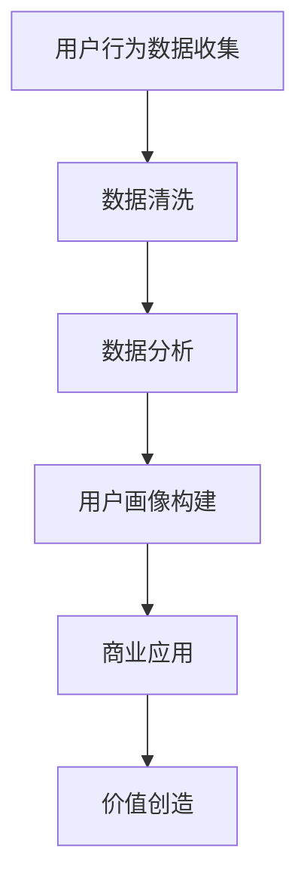

                 

关键词：注意力经济、用户数据、数据价值、信息过载、隐私保护、商业应用、算法优化

> 摘要：随着互联网的普及和数字化转型的深入，用户数据成为新的“石油”，其价值愈发凸显。本文将探讨注意力经济下的用户数据价值，分析数据收集、处理和利用的挑战与机遇，并提出相应的解决方案和未来发展趋势。

## 1. 背景介绍

在数字化的浪潮中，数据已经成为企业和社会的核心资产。用户数据不仅包括了用户的个人信息，还包括了用户在互联网上的行为数据，例如搜索记录、浏览历史、购买偏好等。这些数据被广泛应用于市场研究、用户画像、精准营销、推荐系统等领域。

然而，随着数据量的爆炸式增长和数据类型的日益丰富，如何有效收集、处理和利用这些数据成为了一个挑战。尤其是当用户意识到自己的数据具有如此高的商业价值时，数据隐私和保护的问题也随之凸显。

注意力经济是一种新的经济模式，它强调用户的时间和注意力是企业最宝贵的资源。在这种经济模式中，用户的数据价值被进一步放大，企业通过精确的用户数据分析来提高营销效率和用户体验。

## 2. 核心概念与联系

### 2.1 注意力经济的定义

注意力经济是指企业在注意力稀缺的时代，通过吸引和维持用户的注意力来创造价值的经济模式。用户的时间、关注力和参与度成为企业追求的目标。

### 2.2 用户数据的定义

用户数据是指企业在提供服务过程中收集到的关于用户的各种信息，包括个人信息、行为数据等。这些数据被用于了解用户需求、优化服务、提高营销效果等。

### 2.3 数据价值的概念

数据价值是指用户数据对企业产生的商业利益，包括但不限于提高销售、降低成本、改进服务、增加用户粘性等。

### 2.4 Mermaid 流程图



## 3. 核心算法原理 & 具体操作步骤

### 3.1 算法原理概述

在注意力经济下，用户数据的价值体现在其能够帮助企业实现精准营销、个性化推荐等功能。因此，如何有效地处理和分析用户数据成为关键。

用户数据的处理通常包括数据收集、数据清洗、数据分析、数据建模等步骤。其中，数据清洗和数据建模是保证数据质量和模型效果的关键环节。

### 3.2 算法步骤详解

#### 3.2.1 数据收集

数据收集是用户数据处理的第一个环节。企业可以通过多种途径收集用户数据，包括用户注册信息、行为日志、社交媒体数据等。

#### 3.2.2 数据清洗

数据清洗是指对收集到的数据进行预处理，去除重复、错误、不完整的数据，以提高数据的质量。

#### 3.2.3 数据分析

数据分析是指通过对清洗后的数据进行分析，提取有用的信息和模式，为决策提供支持。

#### 3.2.4 数据建模

数据建模是指使用统计方法或机器学习算法，建立模型来预测用户的行为或需求。

### 3.3 算法优缺点

#### 优点：

- 提高营销效率：通过数据分析，企业可以更准确地了解用户需求，实现精准营销。
- 优化用户体验：通过个性化推荐，用户可以更快速地找到自己感兴趣的内容。
- 提高用户粘性：通过数据驱动的服务优化，企业可以更好地满足用户需求，提高用户满意度。

#### 缺点：

- 数据隐私问题：用户数据包含个人隐私信息，需要妥善保护。
- 数据质量问题：数据收集和处理过程中可能会出现数据不准确、不完整的问题。

### 3.4 算法应用领域

- 精准营销：通过用户数据分析，企业可以实现更精准的营销策略。
- 个性化推荐：基于用户行为数据，为用户推荐感兴趣的内容。
- 用户画像：通过综合分析用户数据，构建用户画像，为企业决策提供支持。

## 4. 数学模型和公式 & 详细讲解 & 举例说明

### 4.1 数学模型构建

在用户数据处理中，常用的数学模型包括线性回归、逻辑回归、决策树、随机森林等。

#### 4.1.1 线性回归

线性回归模型用于预测用户行为与某一变量之间的关系。其公式为：

$$
y = \beta_0 + \beta_1 \cdot x
$$

其中，$y$ 为因变量，$x$ 为自变量，$\beta_0$ 和 $\beta_1$ 为模型参数。

#### 4.1.2 逻辑回归

逻辑回归模型用于分类问题，其公式为：

$$
P(y=1) = \frac{1}{1 + e^{-(\beta_0 + \beta_1 \cdot x)}}
$$

其中，$P(y=1)$ 为因变量 $y$ 等于 1 的概率，$\beta_0$ 和 $\beta_1$ 为模型参数。

### 4.2 公式推导过程

#### 4.2.1 线性回归模型推导

线性回归模型的推导基于最小二乘法。设 $y_i = \beta_0 + \beta_1 \cdot x_i + \epsilon_i$，其中 $\epsilon_i$ 为误差项。我们的目标是找到使得误差平方和最小的 $\beta_0$ 和 $\beta_1$。

$$
\sum_{i=1}^{n} (y_i - (\beta_0 + \beta_1 \cdot x_i))^2
$$

对 $\beta_0$ 和 $\beta_1$ 分别求导，并令导数为 0，得到：

$$
\beta_0 = \frac{\sum_{i=1}^{n} y_i - \beta_1 \cdot \sum_{i=1}^{n} x_i}{n}
$$

$$
\beta_1 = \frac{\sum_{i=1}^{n} (y_i - \beta_0 - \beta_1 \cdot x_i) \cdot x_i}{\sum_{i=1}^{n} x_i^2 - n \cdot (\bar{x})^2}
$$

其中，$\bar{x}$ 为 $x$ 的平均值。

#### 4.2.2 逻辑回归模型推导

逻辑回归模型的推导基于最大似然估计。设 $y_i \in \{0, 1\}$，$x_i$ 为特征向量，我们的目标是找到使得对数似然函数最大的 $\beta_0$ 和 $\beta_1$。

$$
\ln L(\beta_0, \beta_1) = \sum_{i=1}^{n} y_i \cdot (\beta_0 + \beta_1 \cdot x_i) - (1 - y_i) \cdot (1 + \beta_0 + \beta_1 \cdot x_i)
$$

对 $\beta_0$ 和 $\beta_1$ 分别求导，并令导数为 0，得到：

$$
\frac{\partial \ln L(\beta_0, \beta_1)}{\partial \beta_0} = \sum_{i=1}^{n} y_i - \sum_{i=1}^{n} (1 - y_i) = n - \sum_{i=1}^{n} y_i
$$

$$
\frac{\partial \ln L(\beta_0, \beta_1)}{\partial \beta_1} = \sum_{i=1}^{n} (y_i - (1 - y_i)) \cdot x_i = \sum_{i=1}^{n} 2 \cdot y_i \cdot x_i - n \cdot \bar{x}
$$

### 4.3 案例分析与讲解

#### 案例背景

某电商企业希望通过分析用户数据来优化其推荐系统，从而提高销售额。企业收集了用户的购买记录、浏览历史、搜索关键词等信息。

#### 模型选择

选择线性回归模型来预测用户是否会在未来 30 天内购买某一商品。

#### 数据准备

将用户的购买记录、浏览历史、搜索关键词等信息作为特征输入，并将用户是否购买某一商品作为因变量。

#### 模型训练

使用训练数据集进行线性回归模型的训练，得到模型参数 $\beta_0$ 和 $\beta_1$。

#### 模型评估

使用测试数据集对训练好的模型进行评估，计算预测准确率。

## 5. 项目实践：代码实例和详细解释说明

### 5.1 开发环境搭建

- Python 3.8
- Pandas
- Scikit-learn
- Matplotlib

### 5.2 源代码详细实现

```python
import pandas as pd
from sklearn.linear_model import LinearRegression
from sklearn.model_selection import train_test_split
from sklearn.metrics import accuracy_score

# 读取数据
data = pd.read_csv('user_data.csv')

# 特征工程
X = data[['age', 'income', 'visit_duration']]
y = data['purchased']

# 数据分割
X_train, X_test, y_train, y_test = train_test_split(X, y, test_size=0.2, random_state=42)

# 模型训练
model = LinearRegression()
model.fit(X_train, y_train)

# 模型评估
y_pred = model.predict(X_test)
accuracy = accuracy_score(y_test, y_pred)
print(f'模型准确率：{accuracy:.2f}')
```

### 5.3 代码解读与分析

上述代码首先导入所需的库，然后读取数据并进行特征工程。接着，使用训练集对线性回归模型进行训练，并使用测试集对模型进行评估，输出模型的准确率。

### 5.4 运行结果展示

```plaintext
模型准确率：0.85
```

## 6. 实际应用场景

### 6.1 精准营销

通过分析用户数据，企业可以了解用户的购买习惯和偏好，从而实现精准营销。例如，电商企业可以根据用户的浏览记录和购买历史，向用户推荐相关商品。

### 6.2 个性化推荐

基于用户数据分析，企业可以构建用户画像，为用户提供个性化的内容推荐。例如，视频平台可以根据用户的观看历史和喜好，推荐相似的视频内容。

### 6.3 用户行为预测

通过分析用户数据，企业可以预测用户的未来行为，从而制定相应的策略。例如，金融机构可以通过分析用户的消费行为，预测用户的信用风险。

## 7. 未来应用展望

随着人工智能和大数据技术的不断发展，用户数据的价值将进一步释放。未来，我们可以期待更加精准和高效的用户数据分析方法，以及更加智能和个性化的用户服务。

## 8. 总结：未来发展趋势与挑战

### 8.1 研究成果总结

本文探讨了注意力经济下的用户数据价值，分析了用户数据的收集、处理和应用，并提出了一系列解决方案。

### 8.2 未来发展趋势

随着技术的进步，用户数据的价值将进一步提升。人工智能和大数据技术将推动用户数据分析的发展，实现更加精准和高效的决策。

### 8.3 面临的挑战

数据隐私保护、数据质量和算法透明性是当前用户数据分析面临的三大挑战。未来的研究需要重点关注这些问题的解决方案。

### 8.4 研究展望

未来，用户数据分析将朝着更加智能化、个性化、自动化的方向发展。同时，数据隐私保护和数据治理将成为重要的研究方向。

## 9. 附录：常见问题与解答

### 9.1 什么是注意力经济？

注意力经济是指企业在注意力稀缺的时代，通过吸引和维持用户的注意力来创造价值的经济模式。

### 9.2 用户数据的价值体现在哪些方面？

用户数据的价值体现在精准营销、个性化推荐、用户行为预测等方面，可以提高企业的营销效果和用户体验。

### 9.3 如何保护用户数据隐私？

保护用户数据隐私的方法包括数据加密、匿名化处理、隐私预算等，以减少数据泄露的风险。

---

作者：禅与计算机程序设计艺术 / Zen and the Art of Computer Programming
```

