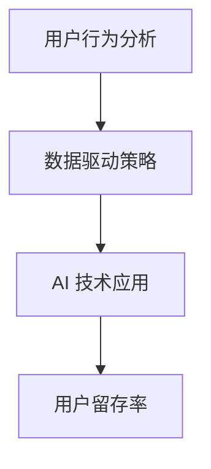

                 

关键词：注意力经济、用户留存、用户行为分析、AI 技术应用、数据驱动策略

> 摘要：随着互联网经济的快速发展，用户注意力成为了一种稀缺资源。本文将探讨注意力经济下的用户留存策略，通过分析用户行为，结合 AI 技术应用，构建数据驱动策略，以提高用户留存率，实现商业价值的最大化。

## 1. 背景介绍

随着互联网的普及和移动设备的广泛使用，用户的生活习惯和行为模式发生了深刻变化。在这个信息爆炸的时代，用户的注意力成为了一种稀缺资源。企业之间的竞争愈发激烈，用户留存率成为衡量企业成功与否的关键指标。如何有效地吸引用户注意力，提高用户留存率，成为企业亟待解决的问题。

### 注意力经济

注意力经济是指在经济活动中，用户的注意力作为一种稀缺资源，具有巨大的商业价值。用户在互联网上的行为，如点击、浏览、点赞、分享等，都体现了他们对特定内容或服务的关注程度。注意力经济揭示了用户行为背后的价值规律，为企业提供了一种新的盈利模式。

### 用户留存率

用户留存率是指一段时间内，持续使用某一应用或服务的用户占该应用或服务总用户数的比例。用户留存率越高，说明用户对该应用或服务的依赖程度越高，商业价值也越大。因此，提高用户留存率成为企业的重要目标。

## 2. 核心概念与联系

为了实现用户留存策略，我们需要了解以下几个核心概念，并掌握它们之间的联系。

### 用户行为分析

用户行为分析是指通过收集和分析用户在互联网上的行为数据，了解用户的兴趣、需求和偏好。用户行为分析是构建用户留存策略的基础，可以帮助企业更好地了解用户，提供个性化的服务。

### 数据驱动策略

数据驱动策略是指基于数据分析，制定和优化决策的过程。在用户留存策略中，数据驱动策略可以帮助企业识别潜在的用户流失风险，及时采取措施，提高用户留存率。

### AI 技术应用

AI 技术在用户留存策略中具有重要作用，可以用于用户行为分析、个性化推荐、智能客服等场景。AI 技术的应用可以提高用户留存策略的精准度和有效性。

### Mermaid 流程图

下面是用户留存策略的 Mermaid 流程图：



## 3. 核心算法原理 & 具体操作步骤

### 3.1 算法原理概述

用户留存策略的核心算法是基于用户行为分析，利用机器学习和数据挖掘技术，构建用户流失预测模型。通过预测用户流失风险，企业可以提前采取针对性措施，降低用户流失率。

### 3.2 算法步骤详解

1. 数据收集与预处理
2. 特征工程
3. 模型选择与训练
4. 预测与评估
5. 策略优化与实施

### 3.3 算法优缺点

优点：

- 精准预测用户流失风险
- 提高用户留存率
- 降低企业运营成本

缺点：

- 数据质量对算法效果影响较大
- 需要较高的技术水平和数据处理能力

### 3.4 算法应用领域

用户留存策略在各个领域都有广泛的应用，如电商、互联网金融、在线教育等。以下是一些具体的案例：

- 电商行业：通过用户行为分析，预测用户流失风险，提前采取优惠活动、个性化推荐等策略，降低用户流失率。
- 互联网金融：利用用户行为数据，预测用户是否会取消订阅、退出服务等，提前采取措施，提高用户留存率。
- 在线教育：通过用户学习行为分析，预测用户是否会产生学习疲劳，及时调整课程内容和教学方式，提高用户满意度。

## 4. 数学模型和公式 & 详细讲解 & 举例说明

### 4.1 数学模型构建

用户留存率的数学模型可以表示为：

$$
留存率 = \frac{持续使用用户数}{总用户数}
$$

其中，持续使用用户数是指在一段时间内，连续使用应用或服务的用户数。

### 4.2 公式推导过程

用户留存率可以进一步分解为：

$$
留存率 = \frac{首次使用用户数 + 持续使用用户数}{总用户数}
$$

其中，首次使用用户数是指在一段时间内，首次使用应用或服务的用户数。

### 4.3 案例分析与讲解

假设某电商平台的用户留存率为 20%，在一个月内，首次使用用户数为 1000 人，持续使用用户数为 200 人。我们需要计算该平台一个月内的总用户数。

根据公式：

$$
留存率 = \frac{首次使用用户数 + 持续使用用户数}{总用户数}
$$

可得：

$$
20\% = \frac{1000 + 200}{总用户数}
$$

解得总用户数为 1500 人。

## 5. 项目实践：代码实例和详细解释说明

### 5.1 开发环境搭建

为了实现用户留存策略，我们需要搭建一个合适的开发环境。以下是一个简单的 Python 开发环境搭建过程：

1. 安装 Python 3.8 版本
2. 安装 Pandas、NumPy、Scikit-learn 等库
3. 配置 Jupyter Notebook

### 5.2 源代码详细实现

以下是一个简单的用户留存预测代码实例：

```python
import pandas as pd
from sklearn.model_selection import train_test_split
from sklearn.ensemble import RandomForestClassifier
from sklearn.metrics import accuracy_score

# 数据收集与预处理
data = pd.read_csv('user_data.csv')
data['留存'] = data['使用次数'].apply(lambda x: 1 if x > 1 else 0)

# 特征工程
X = data[['年龄', '性别', '使用次数']]
y = data['留存']

# 模型选择与训练
X_train, X_test, y_train, y_test = train_test_split(X, y, test_size=0.2, random_state=42)
model = RandomForestClassifier(n_estimators=100, random_state=42)
model.fit(X_train, y_train)

# 预测与评估
y_pred = model.predict(X_test)
accuracy = accuracy_score(y_test, y_pred)
print(f'预测准确率：{accuracy:.2f}')

# 策略优化与实施
# 根据预测结果，对潜在流失用户进行针对性营销，提高留存率
```

### 5.3 代码解读与分析

1. 数据收集与预处理：从 CSV 文件中读取用户数据，并根据使用次数判断用户是否留存。
2. 特征工程：提取与留存相关的特征，如年龄、性别、使用次数等。
3. 模型选择与训练：选择随机森林分类器，对用户数据进行训练。
4. 预测与评估：对测试集进行预测，并计算预测准确率。
5. 策略优化与实施：根据预测结果，对潜在流失用户进行针对性营销，提高留存率。

## 6. 实际应用场景

用户留存策略在各个行业都有广泛的应用。以下是一些典型的应用场景：

1. 电商行业：通过用户行为分析，预测用户是否会取消订单、退换货等，提前采取措施，提高用户满意度。
2. 在线教育：通过用户学习行为分析，预测用户是否会放弃学习、产生学习疲劳等，及时调整课程内容和教学方式，提高用户留存率。
3. 金融行业：通过用户行为分析，预测用户是否会取消订阅、退出服务等，提前采取措施，降低用户流失率。

## 7. 工具和资源推荐

### 7.1 学习资源推荐

1. 《Python 数据科学手册》
2. 《机器学习实战》
3. 《数据挖掘：实用工具与技术》

### 7.2 开发工具推荐

1. Jupyter Notebook
2. PyCharm
3. Visual Studio Code

### 7.3 相关论文推荐

1. "User Behavior Analysis for Personalized Recommendation Systems"
2. "Predicting User Churn in Mobile Applications Using Machine Learning"
3. "A Survey on User Behavior Analysis in Mobile Computing"

## 8. 总结：未来发展趋势与挑战

### 8.1 研究成果总结

用户留存策略在近年来取得了显著的成果，通过用户行为分析、数据驱动策略和 AI 技术应用，企业可以更精准地预测用户流失风险，提高用户留存率。

### 8.2 未来发展趋势

随着技术的不断进步，用户留存策略将向以下方向发展：

1. 多模态用户行为分析：结合文本、图像、声音等多种数据类型，更全面地了解用户需求。
2. 智能化策略优化：利用深度学习等技术，实现更智能化的策略优化。
3. 个性化服务：基于用户行为数据，提供个性化的服务，提高用户满意度。

### 8.3 面临的挑战

用户留存策略在实施过程中面临以下挑战：

1. 数据质量：数据质量对算法效果有重要影响，企业需要确保数据质量。
2. 技术门槛：用户留存策略的实施需要较高的技术水平和数据处理能力。
3. 用户隐私：用户行为数据涉及到用户隐私，企业需要保护用户隐私。

### 8.4 研究展望

未来，用户留存策略研究将继续关注以下方向：

1. 新技术的应用：探索深度学习、自然语言处理等新技术在用户留存策略中的应用。
2. 跨领域研究：研究用户留存策略在不同领域的应用，提高用户留存策略的普适性。

## 9. 附录：常见问题与解答

### 9.1  用户留存策略有哪些优点？

用户留存策略的优点包括：

1. 精准预测用户流失风险，提高用户留存率。
2. 降低企业运营成本，提高商业价值。
3. 提高用户满意度，增强用户黏性。

### 9.2  用户留存策略有哪些缺点？

用户留存策略的缺点包括：

1. 数据质量对算法效果影响较大。
2. 需要较高的技术水平和数据处理能力。
3. 用户隐私保护问题。

### 9.3  用户留存策略有哪些应用场景？

用户留存策略在以下领域有广泛应用：

1. 电商行业：预测用户取消订单、退换货等。
2. 在线教育：预测用户放弃学习、产生学习疲劳等。
3. 金融行业：预测用户取消订阅、退出服务等。

作者：禅与计算机程序设计艺术 / Zen and the Art of Computer Programming
```

