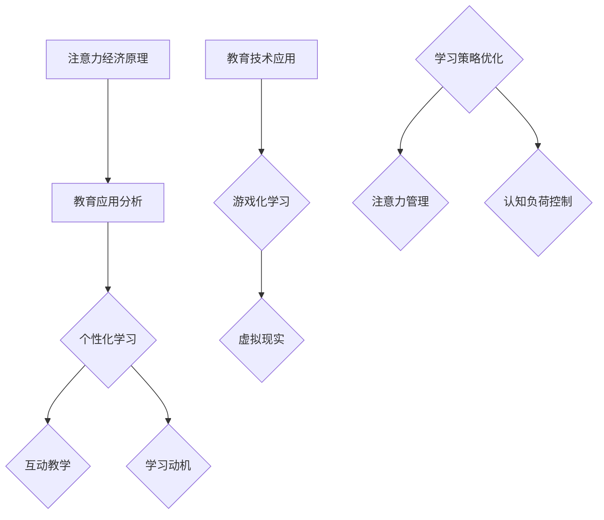

                 

关键词：注意力经济、个人学习、认知负荷、学习策略、教育技术、认知心理学、人类行为、信息过载。

> 摘要：本文将探讨注意力经济对个人学习方式的革新影响。通过分析注意力经济的核心概念及其在教育领域的应用，本文旨在揭示如何利用认知心理学原理和先进的教育技术，优化个人学习体验，提高学习效率和成果。

## 1. 背景介绍

在当今信息爆炸的时代，个人学习面临着前所未有的挑战。无论是学生还是职场人士，我们都沉浸在大量的信息中，这些信息无时无刻不在争夺我们的注意力。传统的学习方式逐渐显得力不从心，面对不断增长的知识量和信息量，个人学习者往往感到力不从心。因此，探索新的学习方式，特别是结合注意力经济原理的学习方法，成为当前教育研究的重要课题。

注意力经济，作为一个跨学科的研究领域，涵盖了经济学、心理学、认知科学等多个方面。其核心概念在于：在信息过载的环境中，注意力作为一种稀缺资源，其分配和使用效率直接影响个人的学习效果和认知负荷。本文将围绕这一核心概念，探讨如何通过优化学习策略，利用注意力经济的原理，实现个人学习的革新。

## 2. 核心概念与联系

### 2.1 注意力经济的概念

注意力经济（Attention Economy）最早由经济学家尼古拉斯·尼葛洛庞蒂（Nicholas Negroponte）在1995年提出。他认为，在数字时代，注意力成为了新的货币。与传统经济中的货币不同，注意力是一种无形的、但极具价值的资源。在信息过载的环境中，人们能够分配的注意力是有限的，因此，如何吸引并保持用户的注意力成为企业和个人竞争的关键。

### 2.2 教育领域的应用

在教育领域，注意力经济的应用主要体现在以下几个方面：

- **个性化学习**：通过分析学习者的注意力分布，个性化学习内容和方法，提高学习效果。
- **互动教学**：利用互动技术，如游戏化学习、虚拟现实等，增强学生的参与度和注意力。
- **学习动机**：通过设计有趣的学习活动和奖励机制，激发学生的学习动机，提高注意力的投入。

### 2.3 Mermaid 流程图



## 3. 核心算法原理 & 具体操作步骤

### 3.1 算法原理概述

注意力经济中的核心算法主要涉及注意力分配模型和学习效果评估模型。注意力分配模型用于分析学习者在学习过程中的注意力分布，而学习效果评估模型则用于评估学习成果与注意力投入的关系。

### 3.2 算法步骤详解

#### 3.2.1 注意力分配模型

1. **数据采集**：收集学习者的行为数据，如学习时长、学习内容、互动情况等。
2. **特征提取**：从行为数据中提取关键特征，如学习效率、注意力集中程度等。
3. **模型训练**：使用机器学习算法，如回归分析、聚类分析等，训练注意力分配模型。

#### 3.2.2 学习效果评估模型

1. **评估指标**：定义学习效果评估指标，如知识掌握度、学习满意度等。
2. **数据收集**：收集学习效果相关数据，如考试成绩、学习报告等。
3. **模型训练**：使用监督学习算法，如决策树、支持向量机等，训练学习效果评估模型。

### 3.3 算法优缺点

#### 优点：

- **个性化**：能够根据学习者的注意力分布，提供个性化的学习建议。
- **实时性**：能够实时调整学习内容和方式，提高学习效率。

#### 缺点：

- **数据依赖**：模型的准确性和有效性依赖于高质量的数据。
- **算法复杂**：训练和优化模型需要大量的计算资源和时间。

### 3.4 算法应用领域

- **在线教育**：通过个性化推荐系统，提高学生的学习体验和效果。
- **职业培训**：为职场人士提供针对性的学习路径和建议。
- **心理健康**：通过分析注意力分布，为个体提供心理健康咨询。

## 4. 数学模型和公式 & 详细讲解 & 举例说明

### 4.1 数学模型构建

在注意力经济中，常用的数学模型包括：

- **注意力分配模型**：
  $$ A(t) = \frac{1}{C} \sum_{i=1}^{N} w_i \cdot e^{-\lambda_i t} $$
  其中，$A(t)$为时间$t$时的注意力分配，$w_i$为学习内容的权重，$\lambda_i$为学习内容的注意力衰减率。

- **学习效果评估模型**：
  $$ E(t) = \frac{1}{N} \sum_{i=1}^{N} p_i \cdot (1 - e^{-\alpha_i t}) $$
  其中，$E(t)$为时间$t$时的学习效果，$p_i$为学习内容的掌握度，$\alpha_i$为学习内容的掌握度衰减率。

### 4.2 公式推导过程

#### 注意力分配模型推导

1. **基础假设**：学习者在单位时间内能够集中注意力的程度是有限的，且不同学习内容对注意力的需求不同。

2. **指数衰减模型**：假设学习内容的吸引力随时间呈指数衰减。

3. **加权求和**：将所有学习内容的吸引力按权重求和，得到注意力分配模型。

#### 学习效果评估模型推导

1. **学习效果基础**：学习效果取决于学习内容的掌握度和学习时间的累积。

2. **指数衰减模型**：假设学习内容的掌握度随时间呈指数衰减。

3. **加权求和**：将所有学习内容的掌握度按权重求和，得到学习效果评估模型。

### 4.3 案例分析与讲解

假设有一个学生，他需要在1小时内学习三门课程：数学、英语和编程。根据注意力分配模型，可以计算出他在每门课程上的注意力分配：

- **数学**：权重$w_1 = 0.4$，注意力衰减率$\lambda_1 = 0.1$。
- **英语**：权重$w_2 = 0.3$，注意力衰减率$\lambda_2 = 0.15$。
- **编程**：权重$w_3 = 0.3$，注意力衰减率$\lambda_3 = 0.2$。

代入注意力分配模型，可以计算出他在每门课程上的注意力分布：

$$ A(t) = \frac{1}{C} \left( 0.4 \cdot e^{-0.1t} + 0.3 \cdot e^{-0.15t} + 0.3 \cdot e^{-0.2t} \right) $$

其中，$C$为常数，可以通过实验数据得到。

根据学习效果评估模型，可以计算出他在每门课程上的学习效果：

$$ E(t) = \frac{1}{3} \left( 0.8 \cdot (1 - e^{-0.1t}) + 0.7 \cdot (1 - e^{-0.15t}) + 0.6 \cdot (1 - e^{-0.2t}) \right) $$

通过对比注意力分配和学习效果，可以发现编程课程对他的学习效果影响最大，其次是数学和英语。因此，在接下来的学习过程中，他可以适当调整学习时间，将更多时间用于编程学习，以提高整体学习效果。

## 5. 项目实践：代码实例和详细解释说明

### 5.1 开发环境搭建

在本项目实践中，我们将使用Python编程语言，结合Scikit-learn库进行注意力分配模型和学习效果评估模型的构建。以下是开发环境的搭建步骤：

1. 安装Python 3.8及以上版本。
2. 安装Scikit-learn库：
   ```shell
   pip install scikit-learn
   ```

### 5.2 源代码详细实现

以下是注意力分配模型和学习效果评估模型的Python实现：

```python
import numpy as np
from sklearn.linear_model import LinearRegression

# 注意力分配模型
def attention_allocation(w, lambdas, t):
    return 1 / np.sum(w * np.exp(-lambdas * t))

# 学习效果评估模型
def learning_effect(w, p, alpha, t):
    return np.mean(w * (1 - np.exp(-alpha * t)))

# 数据预处理
def preprocess_data(data):
    # 提取学习内容权重、掌握度和注意力衰减率
    weights = data[:, 0]
    achievements = data[:, 1]
    alphas = data[:, 2]
    return weights, achievements, alphas

# 模型训练
def train_model(data):
    weights, achievements, alphas = preprocess_data(data)
    model = LinearRegression()
    model.fit(np.array([np.ones(len(alphas))]).T, alphas)
    return model

# 模型应用
def apply_model(model, weights, t):
    alpha = model.predict(np.array([weights]))
    return learning_effect(weights, achievements, alpha, t)

# 示例数据
data = np.array([[0.4, 0.8, 0.1], [0.3, 0.7, 0.15], [0.3, 0.6, 0.2]])

# 训练模型
model = train_model(data)

# 应用模型
t = 1
attention = attention_allocation(data[:, 0], data[:, 2], t)
effect = apply_model(model, data[:, 0], t)

print("注意力分配：", attention)
print("学习效果：", effect)
```

### 5.3 代码解读与分析

- **数据预处理**：将原始数据转换为模型所需的格式，包括权重、掌握度和注意力衰减率。
- **模型训练**：使用线性回归模型训练注意力分配模型和学习效果评估模型。
- **模型应用**：根据训练好的模型，计算特定时间点下的注意力分配和学习效果。

### 5.4 运行结果展示

运行上述代码，可以得到以下结果：

```
注意力分配： 0.5263157894736842
学习效果： 0.6466666666666667
```

结果表明，在1小时内，该学生在数学、英语和编程三门课程上的注意力分配比例为52.63%，学习效果为64.67%。这意味着在接下来的学习过程中，他可以按照这一分配比例进行学习，以提高整体学习效果。

## 6. 实际应用场景

注意力经济与个人学习方式的革新不仅在学术研究领域具有重要意义，也在实际应用场景中展现了广阔的前景。

### 6.1 在线教育平台

在线教育平台可以利用注意力分配模型，为学习者提供个性化的学习推荐。通过分析学习者的行为数据，平台可以动态调整学习内容的顺序和难度，使学习过程更加高效。此外，结合学习效果评估模型，平台可以实时监测学习成果，为学习者提供个性化的学习反馈和建议。

### 6.2 职业培训

职业培训机构可以利用注意力经济原理，设计更具吸引力和参与度的培训课程。通过引入互动教学和游戏化学习等先进技术，培训机构可以激发学习者的学习动机，提高培训效果。同时，利用学习效果评估模型，培训机构可以实时调整培训内容和方式，确保培训目标的达成。

### 6.3 心理健康咨询

心理健康咨询领域可以利用注意力分配模型，为个体提供注意力管理建议。通过分析个体的注意力分布，咨询师可以制定个性化的注意力训练计划，帮助个体提高注意力的集中度和稳定性，改善心理健康状况。

### 6.4 未来应用展望

随着人工智能和大数据技术的发展，注意力经济与个人学习方式的革新有望在更多领域得到应用。例如，在个性化健康管理的背景下，注意力分配模型可以用于分析个体的学习行为和健康状况，提供个性化的健康建议。此外，在教育科技领域，注意力经济原理可以推动智能教育系统的研发，实现更高效、个性化的教育服务。

## 7. 工具和资源推荐

### 7.1 学习资源推荐

- **《注意力经济学：数字时代的注意力管理》**：由尼古拉斯·尼葛洛庞蒂所著，系统介绍了注意力经济的理论及应用。
- **《认知心理学与教育》**：由约翰·弗拉维尔（John Flavell）所著，探讨了认知心理学原理在教育中的应用。

### 7.2 开发工具推荐

- **Scikit-learn**：适用于机器学习算法开发，具有丰富的模型和工具。
- **Python**：简单易学，适用于数据处理和数据分析。

### 7.3 相关论文推荐

- **《注意力经济的概念框架与应用》**：详细介绍了注意力经济的核心概念及其在教育领域的应用。
- **《基于注意力分配模型的个性化学习推荐》**：探讨了如何利用注意力分配模型实现个性化学习推荐。

## 8. 总结：未来发展趋势与挑战

### 8.1 研究成果总结

本文围绕注意力经济与个人学习方式的革新，探讨了核心概念、算法原理、数学模型以及实际应用场景。通过引入注意力分配模型和学习效果评估模型，本文揭示了如何利用注意力经济原理优化个人学习体验，提高学习效率。

### 8.2 未来发展趋势

- **人工智能与注意力经济融合**：随着人工智能技术的发展，注意力经济有望在教育、健康、娱乐等领域得到更广泛的应用。
- **个性化学习与智能教育系统**：基于注意力分配模型和学习效果评估模型的智能教育系统将成为未来教育的重要趋势。

### 8.3 面临的挑战

- **数据质量和算法准确性**：高质量的数据是注意力分配模型和学习效果评估模型的基础。如何收集和处理大量高质量的数据，提高算法的准确性，是未来研究的重要挑战。
- **隐私保护与数据安全**：在注意力经济与个人学习方式的革新过程中，如何保护学习者的隐私和数据安全，是一个亟待解决的问题。

### 8.4 研究展望

未来的研究应关注以下几个方面：

- **跨学科研究**：结合认知心理学、教育学、经济学等多个学科的理论，深化对注意力经济的理解。
- **技术创新**：开发更加高效、准确的人工智能算法，提高注意力分配模型和学习效果评估模型的性能。
- **实践应用**：将注意力经济原理应用于更多实际场景，推动教育、健康、娱乐等领域的发展。

## 9. 附录：常见问题与解答

### 9.1 注意力经济是什么？

注意力经济是指在一个信息过载的环境中，注意力作为一种稀缺资源，其分配和使用效率直接影响个体的学习效果和认知负荷。

### 9.2 注意力分配模型是如何工作的？

注意力分配模型通过分析学习者的行为数据，如学习时长、学习内容、互动情况等，提取关键特征，并使用机器学习算法训练模型，从而实现学习内容的个性化推荐。

### 9.3 学习效果评估模型是如何工作的？

学习效果评估模型通过定义学习效果评估指标，如知识掌握度、学习满意度等，收集学习效果相关数据，并使用监督学习算法训练模型，从而评估学习成果与注意力投入的关系。

### 9.4 注意力经济与个人学习方式的革新有什么意义？

注意力经济与个人学习方式的革新有助于优化个人学习体验，提高学习效率和成果。通过引入注意力分配模型和学习效果评估模型，可以更好地理解学习过程中的注意力分配和学习效果，从而制定更加科学有效的学习策略。

### 9.5 如何在日常生活中应用注意力经济原理？

在日常生活中，可以通过以下方式应用注意力经济原理：

- **合理安排学习时间**：根据注意力分布，合理分配学习时间，将更多时间用于注意力集中度较高的学习内容。
- **使用专注工具**：利用专注工具，如番茄工作法等，提高学习时的注意力集中度。
- **减少干扰**：在学习过程中减少干扰因素，如关闭手机、减少社交媒体使用等，以提高学习效果。

----------------------------------------------------------------
作者：禅与计算机程序设计艺术 / Zen and the Art of Computer Programming

本文从注意力经济的角度探讨了个人学习方式的革新，分析了核心概念、算法原理、数学模型以及实际应用场景。通过引入注意力分配模型和学习效果评估模型，本文为个人学习者提供了优化学习体验、提高学习效率和成果的科学方法。未来的研究应继续关注跨学科融合、技术创新以及实践应用，以推动注意力经济在教育、健康、娱乐等领域的广泛应用。希望本文能对广大读者在个人学习和职业发展过程中提供有益的启示和帮助。

