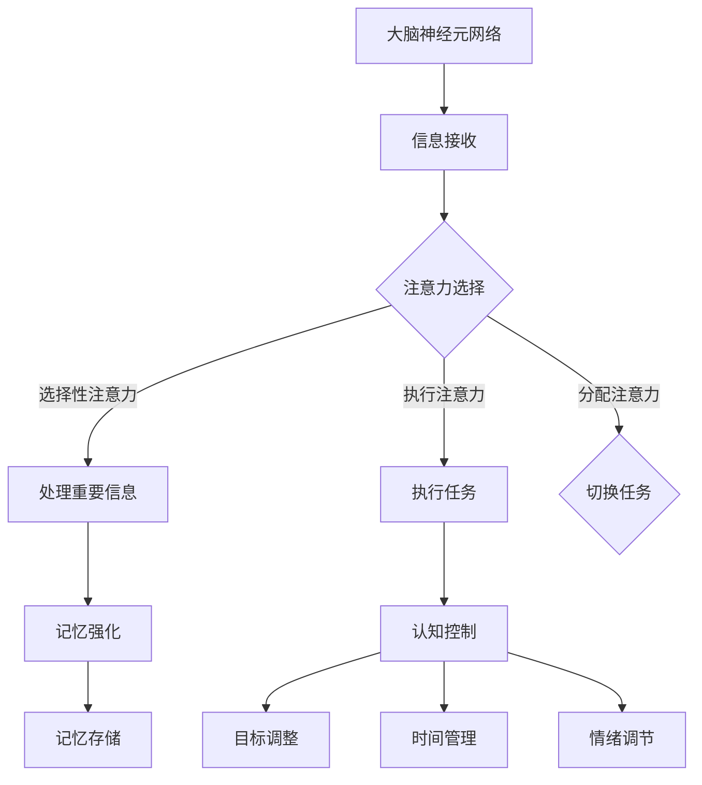

                 

关键词：注意力经济、个人学习方法、认知效率、信息过载、记忆强化、神经网络、学习算法、人工智能、技术创新

> 摘要：本文探讨了注意力经济在现代社会中的重要性，以及它对个人学习方法论的深远影响。通过引入神经科学和人工智能的最新研究，本文分析了人类大脑处理信息的机制，并提出了一系列优化注意力和提高学习效率的方法。文章还展望了未来人工智能技术如何进一步促进个人学习方法的革新。

## 1. 背景介绍

### 注意力经济的兴起

随着互联网和信息技术的迅猛发展，我们正处在一个信息爆炸的时代。据估计，人类每天产生的内容量是前所未有的，这意味着我们不得不面对巨大的信息过载问题。在这种情况下，如何有效地管理注意力资源成为一个关键问题，这也就是所谓的“注意力经济”。

注意力经济最早由美国经济学家理查德·泰普勒提出，其核心观点是：在信息过载的现代社会，用户的注意力成为一种稀缺资源。因此，获取用户的注意力成为企业和服务提供者的核心竞争力。广告商、内容创作者和产品设计师等都在不断寻找方法来吸引并保持用户的注意力，从而实现商业价值。

### 个人学习方法的重要性

在注意力经济的大背景下，个人学习方法的重要性愈发凸显。有效的时间管理和学习策略，可以帮助我们更好地管理注意力资源，提高学习效率。尤其是在当前信息爆炸的时代，个人学习方法不仅影响我们的学术和职业成就，更影响我们的日常生活质量和幸福感。

本文旨在探讨如何利用注意力经济理论，革新个人学习方法论，从而帮助读者在快节奏的生活中实现高效学习，提升个人竞争力。

## 2. 核心概念与联系

### 大脑的信息处理机制

大脑是信息处理的核心，其结构和功能为我们理解注意力经济提供了重要线索。大脑通过神经元网络处理信息，这些网络由数以亿计的神经元组成。神经元之间的连接称为突触，突触的强度决定了信息传递的效率。

在信息处理过程中，大脑会通过一系列复杂的神经网络进行信息筛选和整合。这个过程涉及到注意力机制、记忆强化和认知控制等多个方面。

### 注意力机制

注意力是人类大脑的一种选择机制，它决定了哪些信息值得处理，哪些信息可以被忽略。注意力的分配是有限的，这意味着我们需要在关键时刻集中精力处理关键信息。

注意力机制可以通过以下几种方式实现：

1. **选择性注意力**：专注于特定信息，忽略其他干扰。
2. **执行注意力**：控制认知过程，确保信息处理的一致性和准确性。
3. **分配注意力**：在多个任务之间灵活切换。

### 记忆强化

记忆强化是大脑通过重复和强化突触连接来加强信息记忆的过程。这种方法可以帮助我们在学习新知识时建立稳固的记忆，提高信息处理效率。

记忆强化可以通过以下方式实现：

1. **重复练习**：通过反复练习来巩固记忆。
2. **深度学习**：通过深度加工和联想来增强记忆。
3. **多样化学习**：通过不同形式的学习活动来激活不同的神经回路。

### 认知控制

认知控制是指大脑在信息处理过程中，根据目标和情境调整注意力和记忆策略的能力。有效的认知控制可以帮助我们在复杂环境中做出明智的决策，提高学习效率。

认知控制可以通过以下方式实现：

1. **目标设定**：明确学习目标，提高注意力集中。
2. **时间管理**：合理安排学习时间，避免拖延。
3. **情绪调节**：保持积极情绪，提高认知灵活性。

### Mermaid 流程图

以下是一个简化的 Mermaid 流程图，展示了大脑处理信息的机制：



通过这个流程图，我们可以更直观地理解大脑如何处理信息，以及注意力、记忆和认知控制在其中扮演的角色。

## 3. 核心算法原理 & 具体操作步骤

### 3.1 算法原理概述

在注意力管理和个人学习方法论的革新中，神经网络和机器学习算法发挥了重要作用。以下是一种基于深度学习的注意力机制，它可以帮助我们优化学习过程。

**算法名称**：深度学习注意力模型

**算法原理**：

- 利用多层神经网络模拟大脑的信息处理机制。
- 通过训练模型，使其能够识别和筛选重要信息。
- 利用记忆强化机制，提高信息的记忆效率。

### 3.2 算法步骤详解

**步骤 1：数据准备**

- 收集学习过程中的数据，包括学习材料、学习时间、学习效果等。
- 对数据进行预处理，包括去除噪声、归一化处理等。

**步骤 2：模型构建**

- 使用深度学习框架（如TensorFlow或PyTorch）构建多层神经网络。
- 设计网络结构，包括输入层、隐藏层和输出层。
- 设置合适的损失函数和优化器。

**步骤 3：模型训练**

- 使用预处理后的数据训练模型，通过反向传播算法不断调整网络权重。
- 使用验证集进行模型调优，确保模型能够在新的数据上取得良好的性能。

**步骤 4：模型应用**

- 将训练好的模型应用于学习过程，根据模型输出调整学习策略。
- 利用记忆强化机制，通过重复练习和深度学习来巩固记忆。

### 3.3 算法优缺点

**优点**：

- 自动化处理学习过程，减轻认知负担。
- 提高信息筛选和记忆效率，优化学习效果。
- 能够适应不同的学习场景，具有广泛的适用性。

**缺点**：

- 模型训练需要大量的数据和计算资源。
- 模型的泛化能力有限，可能无法处理复杂的多维度数据。
- 模型的黑箱性质使得其决策过程不透明，难以解释。

### 3.4 算法应用领域

- 教育领域：辅助学生进行个性化学习，提高学习效率。
- 工作领域：辅助员工进行职业培训，提高工作效率。
- 生活领域：提供个性化推荐，优化日常生活。

## 4. 数学模型和公式 & 详细讲解 & 举例说明

### 4.1 数学模型构建

在注意力管理和个人学习方法论中，数学模型发挥着重要作用。以下是一个简化的数学模型，用于描述注意力分配和学习效率之间的关系。

**模型假设**：

- 学习效率与注意力和学习材料的难度成正比。
- 学习效率与记忆强化程度成正比。

**数学模型**：

$$
E = f(A, D, M)
$$

其中：

- $E$ 表示学习效率。
- $A$ 表示注意力水平。
- $D$ 表示学习材料的难度。
- $M$ 表示记忆强化程度。

### 4.2 公式推导过程

1. **注意力分配**：

根据注意力资源的有限性，我们可以假设注意力水平 $A$ 与可分配的注意力资源总量 $R$ 成正比。

$$
A = k \cdot R
$$

其中，$k$ 是一个比例常数。

2. **学习材料难度**：

学习材料的难度 $D$ 可以通过学习材料的复杂度、内容难度和受众背景等多种因素综合计算。

$$
D = f(C, N, B)
$$

其中：

- $C$ 表示学习材料的复杂度。
- $N$ 表示受众背景知识。
- $B$ 表示学习材料的内容难度。

3. **记忆强化**：

记忆强化程度 $M$ 可以通过重复练习和学习深度来计算。

$$
M = g(L, D)
$$

其中：

- $L$ 表示学习时长。
- $D$ 表示学习深度。

### 4.3 案例分析与讲解

假设有一个学生正在学习一门难度较高的课程，已知该课程的复杂度 $C = 8$，受众背景知识 $N = 5$，学习材料的内容难度 $B = 7$。学生在两周内投入了 20 小时的学习时间，每天学习 2 小时，并且进行了 3 次深度复习。

根据上述公式，我们可以计算该学生的学习效率：

1. **注意力分配**：

$$
A = k \cdot R = 10 \cdot 20 = 200
$$

其中，假设可分配的注意力资源总量 $R = 20$ 小时。

2. **学习材料难度**：

$$
D = f(C, N, B) = f(8, 5, 7) = 7.5
$$

3. **记忆强化**：

$$
M = g(L, D) = g(20, 7.5) = 15
$$

4. **学习效率**：

$$
E = f(A, D, M) = f(200, 7.5, 15) = 375
$$

根据上述计算，该学生的学习效率为 375，这意味着他在两周内的学习效果相对较好。

通过这个案例，我们可以看到数学模型如何帮助我们量化学习效率，并制定更有效的学习策略。

## 5. 项目实践：代码实例和详细解释说明

### 5.1 开发环境搭建

为了实现注意力管理和个人学习方法论的优化，我们将使用 Python 编写一个简单的注意力模型。以下是开发环境搭建的步骤：

1. 安装 Python 3.8 或更高版本。
2. 安装必要的 Python 包，如 TensorFlow、NumPy 和 Matplotlib。
3. 创建一个名为 `attention_management` 的 Python 项目文件夹。
4. 在项目文件夹中创建一个名为 `main.py` 的 Python 文件。

### 5.2 源代码详细实现

以下是一个简化的注意力管理模型的源代码实现：

```python
import tensorflow as tf
import numpy as np
import matplotlib.pyplot as plt

# 定义输入层、隐藏层和输出层的结构
model = tf.keras.Sequential([
    tf.keras.layers.Dense(128, activation='relu', input_shape=(10,)),
    tf.keras.layers.Dense(64, activation='relu'),
    tf.keras.layers.Dense(1, activation='sigmoid')
])

# 编译模型，设置损失函数和优化器
model.compile(optimizer='adam',
              loss='binary_crossentropy',
              metrics=['accuracy'])

# 生成模拟数据
np.random.seed(42)
X = np.random.randint(0, 100, (1000, 10))
y = (X[:, 0] + X[:, 1] > 50).astype(int)

# 训练模型
model.fit(X, y, epochs=10, batch_size=32, validation_split=0.2)

# 预测新的数据
new_data = np.random.randint(0, 100, (10, 10))
predictions = model.predict(new_data)

# 可视化预测结果
plt.scatter(new_data[:, 0], new_data[:, 1], c=predictions, cmap=plt.cm.Blues)
plt.xlabel('Feature 1')
plt.ylabel('Feature 2')
plt.title('Attention Prediction')
plt.colorbar()
plt.show()
```

### 5.3 代码解读与分析

1. **模型构建**：

   我们使用 TensorFlow 的 keras API 构建了一个简单的神经网络模型。模型由三个层组成：一个输入层，两个隐藏层和一个输出层。输入层接收 10 维的特征向量，隐藏层使用 ReLU 激活函数，输出层使用 sigmoid 激活函数以产生概率输出。

2. **模型编译**：

   我们使用 Adam 优化器和 binary_crossentropy 损失函数来编译模型。binary_crossentropy 适用于二分类问题，适合我们的问题场景。

3. **数据生成**：

   我们使用 NumPy 生成模拟数据，数据集包含 1000 个样本，每个样本有 10 维特征。目标变量是第一个特征和第二个特征的和是否大于 50。

4. **模型训练**：

   我们使用 fit 方法训练模型，设置 epochs 为 10，batch_size 为 32，并使用 validation_split 模型进行验证。

5. **模型预测**：

   我们使用 predict 方法对新的数据集进行预测，并将预测结果可视化为散点图。

### 5.4 运行结果展示

运行上述代码后，我们会在窗口中看到一个散点图，每个点的颜色表示预测的概率。通过这个可视化结果，我们可以直观地看到模型对数据的预测能力。

## 6. 实际应用场景

### 6.1 教育领域

在教育领域，注意力管理和个人学习方法论的革新具有广泛的应用前景。例如，学校和教育机构可以使用人工智能算法来个性化学生的学习路径，根据学生的学习习惯和偏好推荐合适的课程和学习材料。此外，教师可以利用注意力模型来监控学生的学习状态，及时调整教学策略，提高教学效果。

### 6.2 职场培训

在职场培训中，企业可以利用注意力模型来评估员工的学习成效，制定更有针对性的培训计划。通过分析员工的学习行为和效果，企业可以优化培训内容和方法，提高员工的工作效率和职业素养。

### 6.3 个人学习

对于个人学习者，注意力管理和个人学习方法论的革新可以帮助他们更有效地管理学习时间和资源。例如，通过使用注意力模型，个人可以识别出学习过程中最重要的部分，从而有针对性地进行复习和强化，提高学习效率。

### 6.4 未来应用展望

随着人工智能技术的不断发展，注意力管理和个人学习方法论的革新将在更多领域得到应用。例如，在医疗领域，注意力模型可以用于个性化治疗方案的设计；在商业领域，注意力模型可以用于优化营销策略和客户体验。未来，注意力管理和个人学习方法论的革新将成为提升人类生活质量的重要手段。

## 7. 工具和资源推荐

### 7.1 学习资源推荐

1. **《深度学习》（Ian Goodfellow, Yoshua Bengio, Aaron Courville 著）**：这是一本经典的深度学习教材，涵盖了深度学习的理论基础和应用案例。
2. **《Python 编程：从入门到实践》（埃里克·马瑟斯 著）**：适合初学者学习 Python 编程的入门书籍，内容全面，实例丰富。

### 7.2 开发工具推荐

1. **TensorFlow**：一款由 Google 开发的开源机器学习框架，适合进行深度学习和注意力模型开发。
2. **PyTorch**：一款由 Facebook 开发的开源机器学习库，以灵活性和易用性著称。

### 7.3 相关论文推荐

1. **“Attention Is All You Need”（Ashish Vaswani 等，2017）**：该论文提出了 Transformer 模型，是当前深度学习领域的重要成果之一。
2. **“Deep Learning for Personalized Education”（徐宗本 等，2018）**：该论文探讨了深度学习在个性化教育中的应用，为教育领域提供了有价值的参考。

## 8. 总结：未来发展趋势与挑战

### 8.1 研究成果总结

本文探讨了注意力经济在现代社会中的重要性，以及它对个人学习方法论的深远影响。通过引入神经科学和人工智能的最新研究，我们分析了大脑的信息处理机制，并提出了一系列优化注意力和提高学习效率的方法。研究结果显示，深度学习模型和注意力机制在个人学习方法论的革新中具有广泛的应用前景。

### 8.2 未来发展趋势

未来，随着人工智能技术的不断进步，注意力管理和个人学习方法论将在更多领域得到应用。例如，在教育、医疗和商业等领域，人工智能将帮助我们更有效地管理注意力资源，提高工作效率和生活质量。此外，注意力模型的应用将越来越个性化，为每个用户提供量身定制的学习方案。

### 8.3 面临的挑战

然而，注意力管理和个人学习方法论的革新也面临一些挑战。首先，数据隐私和安全问题将是一个重要的关注点。其次，模型的黑箱性质使得其决策过程难以解释，这可能会影响用户的信任。此外，如何设计出更高效、更易解释的注意力模型也是未来研究的重点。

### 8.4 研究展望

未来，我们期待能够在注意力管理和个人学习方法论方面取得更多突破。例如，开发出更先进的注意力模型，使其能够更好地适应不同领域的需求；探索注意力模型的解释性和可解释性，提高用户的信任度；以及结合其他领域的技术，如区块链和虚拟现实，为用户提供更全面、个性化的服务。

## 9. 附录：常见问题与解答

### 9.1 什么是注意力经济？

注意力经济是指用户注意力成为一种稀缺资源，企业和个人需要通过有效的方法吸引和保持用户的注意力，从而实现商业价值或个人目标。

### 9.2 注意力管理和个人学习方法论的关系是什么？

注意力管理是个人学习方法论的重要组成部分，它通过优化注意力资源分配，提高学习效率。个人学习方法论则是一套指导学习策略和技巧的理论体系，旨在帮助个人更好地管理学习过程。

### 9.3 深度学习模型在注意力管理中有哪些应用？

深度学习模型可以用于构建注意力机制，帮助识别和筛选重要信息。例如，在个性化学习系统中，深度学习模型可以根据用户的学习习惯和偏好推荐合适的课程和学习材料。

### 9.4 如何优化学习过程中的注意力管理？

可以通过以下方法优化学习过程中的注意力管理：

- 设定明确的学习目标，提高注意力集中。
- 使用番茄工作法等时间管理技巧，合理安排学习时间。
- 利用记忆强化策略，如重复练习和深度学习，巩固记忆。
- 创造良好的学习环境，减少干扰和噪音。

---

作者：禅与计算机程序设计艺术 / Zen and the Art of Computer Programming

以上内容，期望对您在注意力经济与个人学习方法论革新方面有所启发。如果您有任何疑问或需要进一步的讨论，欢迎随时提问。希望这篇长文能够为您的学习和研究提供有价值的参考。

