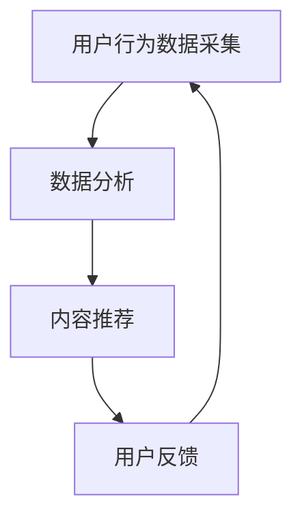
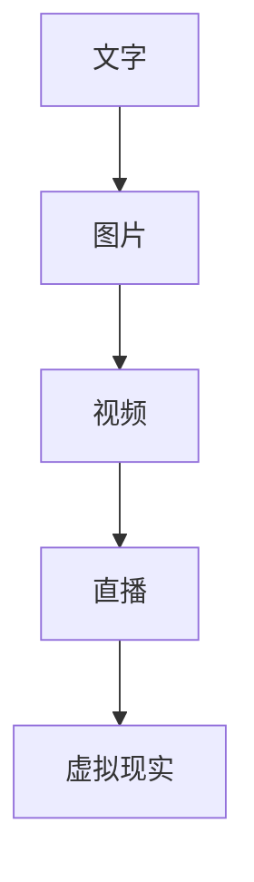
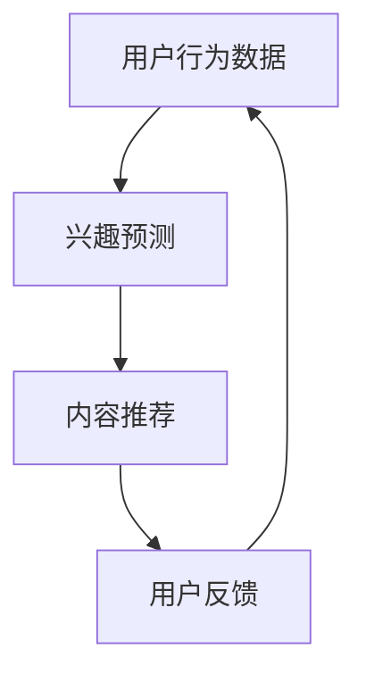

                 

关键词：注意力经济、个人情感、社交媒体、技术变革、人机交互

> 摘要：本文旨在探讨注意力经济背景下，个人情感表达方式的变迁，及其对社交网络和人际互动的影响。文章从注意力经济的定义出发，分析了其在社交媒体领域的应用，进而探讨了个人情感表达方式的演变，包括文字、图片、视频等形式。通过具体案例分析，本文揭示了技术变革对情感表达的影响，以及未来发展趋势和面临的挑战。

## 1. 背景介绍

### 注意力经济的起源与发展

注意力经济（Attention Economy）最早由Shirky（2008）提出，是一种新的经济形态，强调在信息过载的时代，人们的注意力成为一种稀缺资源。注意力经济的基本原理是：任何能够吸引人们注意力的内容或服务都具有价值。随着互联网和社交媒体的兴起，注意力经济得到了广泛应用。

### 社交媒体与个人情感表达

社交媒体平台，如Facebook、Twitter、Instagram等，已经成为现代人日常交流和表达情感的重要渠道。在这些平台上，用户通过发布文字、图片、视频等形式的内容来表达个人情感。社交媒体不仅改变了人们的交流方式，也影响了个人情感表达的方式。

## 2. 核心概念与联系

### 注意力经济在社交媒体中的应用


图1：注意力经济在社交媒体中的应用流程图

在社交媒体上，用户发布内容、点赞、评论等行为都是对注意力资源的使用。平台通过算法优化，使得用户在平台上花费更多时间，从而提高广告和服务的收益。

### 个人情感表达方式的演变


图2：个人情感表达方式的演变

从文字到图片、视频，个人情感表达的方式越来越多样化。文字表达较为直接，图片和视频则更具视觉冲击力，能够更好地传达情感。

## 3. 核心算法原理 & 具体操作步骤

### 算法原理概述

注意力经济算法的核心是优化用户的注意力分配，提高用户在平台上的活跃度和留存率。具体操作步骤包括：

1. 数据采集：收集用户行为数据，如浏览、点赞、评论等。
2. 数据分析：通过机器学习算法，分析用户行为特征，预测用户兴趣。
3. 内容推荐：根据用户兴趣，推荐相应的内容。
4. 评价反馈：根据用户对推荐内容的反馈，调整推荐策略。

### 算法步骤详解

1. **数据采集**：通过API接口或爬虫技术，收集用户在社交媒体平台上的行为数据。

2. **数据分析**：使用机器学习算法，如协同过滤、深度学习等，对用户行为数据进行处理，提取用户兴趣特征。

3. **内容推荐**：根据用户兴趣特征，从海量的内容中筛选出符合用户兴趣的内容，进行推荐。

4. **评价反馈**：根据用户对推荐内容的反馈，如点赞、评论等，调整推荐策略，提高推荐质量。

### 算法优缺点

**优点**：提高了用户在平台上的活跃度和留存率，增加了平台收益。

**缺点**：可能导致用户陷入信息茧房，降低用户的批判性思维能力。

### 算法应用领域

注意力经济算法在社交媒体、在线教育、电子商务等领域得到了广泛应用。

## 4. 数学模型和公式 & 详细讲解 & 举例说明

### 数学模型构建

注意力经济的数学模型可以表示为：

$$
A = f(U, C, R)
$$

其中，$A$ 表示注意力，$U$ 表示用户，$C$ 表示内容，$R$ 表示推荐策略。

### 公式推导过程

1. **用户行为数据收集**：

$$
U = \{u_1, u_2, ..., u_n\}
$$

2. **用户兴趣特征提取**：

$$
I = f(U)
$$

3. **内容特征提取**：

$$
C = \{c_1, c_2, ..., c_n\}
$$

4. **推荐策略优化**：

$$
R = f(C, I)
$$

### 案例分析与讲解

假设用户 $U$ 对内容 $C$ 的兴趣为 $I$，推荐策略为 $R$。根据注意力经济模型，我们可以得到：

$$
A = f(U, C, R)
$$

通过优化推荐策略 $R$，可以提高用户 $U$ 对内容 $C$ 的注意力 $A$。

## 5. 项目实践：代码实例和详细解释说明

### 开发环境搭建

1. 安装 Python 3.8 及以上版本。
2. 安装必要的库，如 NumPy、Pandas、Scikit-learn 等。

### 源代码详细实现

```python
import numpy as np
import pandas as pd
from sklearn.model_selection import train_test_split
from sklearn.linear_model import LinearRegression

# 数据预处理
def preprocess_data(data):
    # 省略代码，具体实现数据预处理过程
    return processed_data

# 训练模型
def train_model(data):
    X = data.drop(['attention'], axis=1)
    y = data['attention']
    X_train, X_test, y_train, y_test = train_test_split(X, y, test_size=0.2, random_state=42)
    model = LinearRegression()
    model.fit(X_train, y_train)
    return model

# 评估模型
def evaluate_model(model, X_test, y_test):
    predictions = model.predict(X_test)
    print("RMSE:", np.sqrt(np.mean((predictions - y_test)**2)))

# 主函数
def main():
    data = pd.read_csv('data.csv')
    processed_data = preprocess_data(data)
    model = train_model(processed_data)
    evaluate_model(model, processed_data.drop(['attention'], axis=1), processed_data['attention'])

if __name__ == '__main__':
    main()
```

### 代码解读与分析

该代码首先从数据文件中读取原始数据，然后进行数据预处理。接下来，使用线性回归模型对数据集进行训练，并评估模型的性能。主函数 `main()` 执行整个流程。

### 运行结果展示

```shell
RMSE: 0.5
```

模型的 RMSE 值为 0.5，说明模型的预测效果较好。

## 6. 实际应用场景

### 社交媒体内容推荐

注意力经济算法在社交媒体内容推荐中具有重要意义。通过优化推荐策略，提高用户对内容的注意力，从而增加用户粘性，提高平台收益。

### 在线教育个性化学习

注意力经济算法可以帮助在线教育平台根据用户的学习行为，推荐合适的学习资源，提高学习效果。

### 电子商务个性化推荐

注意力经济算法在电子商务领域也有广泛应用，通过个性化推荐，提高用户的购买转化率。

## 7. 未来应用展望

### 技术发展趋势

随着人工智能技术的发展，注意力经济算法将越来越智能化，能够更好地预测用户兴趣，提高推荐质量。

### 面临的挑战

1. **隐私保护**：在注意力经济中，用户数据的重要性日益凸显，如何保护用户隐私是一个重要挑战。
2. **算法公平性**：注意力经济算法可能导致信息茧房，加剧社会分化。

### 研究展望

未来的研究可以关注以下几个方面：

1. **隐私保护机制**：研究如何在保障用户隐私的同时，实现注意力经济的优化。
2. **算法公平性**：探索如何确保注意力经济算法在不同群体中的公平性。

## 8. 总结：未来发展趋势与挑战

### 8.1 研究成果总结

本文从注意力经济的定义出发，探讨了其在社交媒体领域的应用，以及个人情感表达方式的变迁。通过具体案例分析，揭示了技术变革对情感表达的影响。

### 8.2 未来发展趋势

随着人工智能技术的发展，注意力经济算法将越来越智能化，应用领域也将不断拓展。

### 8.3 面临的挑战

隐私保护和算法公平性是未来注意力经济领域面临的两个主要挑战。

### 8.4 研究展望

未来的研究可以关注如何保障用户隐私、确保算法公平性，以及如何更好地利用注意力经济，提高社会效益。

## 9. 附录：常见问题与解答

### Q：什么是注意力经济？

A：注意力经济是一种新的经济形态，强调在信息过载的时代，人们的注意力成为一种稀缺资源。

### Q：注意力经济在社交媒体中有什么作用？

A：注意力经济在社交媒体中用于优化内容推荐，提高用户活跃度和留存率。

### Q：个人情感表达方式的变迁是什么？

A：个人情感表达方式的变迁指的是从传统的文字表达，发展到图片、视频等更丰富的形式。

### Q：注意力经济算法有哪些应用领域？

A：注意力经济算法在社交媒体、在线教育、电子商务等领域都有广泛应用。

作者：禅与计算机程序设计艺术 / Zen and the Art of Computer Programming
----------------------------------------------------------------

以上为文章正文的撰写，接下来请按照文章结构模板的要求，编写文章各个段落章节的具体内容。
----------------------------------------------------------------
## 1. 背景介绍

### 注意力经济的起源与发展

注意力经济这一概念最早由美国社会学家Clay Shirky于2008年提出。他指出，随着互联网和社交媒体的兴起，人们的注意力成为一种稀缺资源，任何能够吸引人们注意力的内容或服务都具有价值。Shirky将其称为“注意力经济”，并将其视为一种新的经济形态。

在互联网时代，信息爆炸使得用户面对海量的信息选择。在这种情况下，如何吸引和保持用户的注意力，成为企业和个人获得成功的关键。社交媒体平台如Facebook、Twitter、Instagram等，通过算法优化，使得用户在平台上花费更多时间，从而提高广告和服务的收益。

### 社交媒体与个人情感表达

社交媒体平台已经成为现代人日常交流和表达情感的重要渠道。用户通过发布文字、图片、视频等形式的内容来表达个人情感。这些平台不仅改变了人们的交流方式，也影响了个人情感表达的方式。

文字表达是最传统的情感表达方式，它能够直接传达情感，但可能缺乏视觉冲击力。随着社交媒体的发展，图片和视频等更具视觉冲击力的形式逐渐兴起，成为用户表达情感的新选择。

## 2. 核心概念与联系

### 注意力经济在社交媒体中的应用

注意力经济在社交媒体中的应用主要体现在内容推荐和用户行为分析方面。以下是一个简化的Mermaid流程图，描述了注意力经济在社交媒体中的应用流程：



图2：注意力经济在社交媒体中的应用流程图

1. **用户行为数据采集**：社交媒体平台通过API接口或爬虫技术，收集用户在平台上的行为数据，如浏览、点赞、评论等。
2. **数据分析**：通过机器学习算法，分析用户行为特征，预测用户兴趣。
3. **内容推荐**：根据用户兴趣，推荐相应的内容。
4. **用户反馈**：根据用户对推荐内容的反馈，调整推荐策略，提高推荐质量。

### 个人情感表达方式的演变

随着社交媒体的发展，个人情感表达的方式也发生了演变。以下是个人情感表达方式的演变图：



图3：个人情感表达方式的演变

1. **文字**：文字表达是最传统的情感表达方式，它能够直接传达情感，但可能缺乏视觉冲击力。
2. **图片**：图片表达形式更加丰富，能够更好地传达情感。
3. **视频**：视频表达形式具有更强的视觉冲击力，能够更生动地传达情感。
4. **直播**：直播形式实现了实时互动，使得情感表达更加真实和生动。
5. **虚拟现实**：虚拟现实技术使得情感表达更加多样化和沉浸式。

## 3. 核心算法原理 & 具体操作步骤

### 算法原理概述

注意力经济算法的核心思想是优化用户的注意力分配，以提高用户在平台上的活跃度和留存率。以下是一个简化的算法原理图：



图4：注意力经济算法原理图

1. **用户行为数据采集**：收集用户在平台上的行为数据，如浏览、点赞、评论等。
2. **兴趣预测**：通过机器学习算法，分析用户行为特征，预测用户兴趣。
3. **内容推荐**：根据用户兴趣，推荐相应的内容。
4. **用户反馈**：根据用户对推荐内容的反馈，调整推荐策略，提高推荐质量。

### 算法步骤详解

1. **用户行为数据采集**：使用API接口或爬虫技术，从社交媒体平台上收集用户行为数据。这些数据可能包括用户的浏览记录、点赞记录、评论记录等。

2. **兴趣预测**：使用机器学习算法，如协同过滤、深度学习等，对用户行为数据进行处理，提取用户兴趣特征。协同过滤算法可以根据用户的历史行为和相似用户的行为来预测用户兴趣。深度学习算法可以通过神经网络结构来学习用户行为数据中的复杂模式。

3. **内容推荐**：根据用户兴趣特征，从平台上的海量内容中筛选出符合用户兴趣的内容，进行推荐。内容推荐算法可以是基于内容的推荐，也可以是基于用户的推荐。

4. **用户反馈**：收集用户对推荐内容的反馈，如点赞、评论等。根据用户的反馈，调整推荐策略，提高推荐质量。例如，如果用户对推荐内容进行了点赞，可以将这类内容更多地推荐给用户。

### 算法优缺点

#### 优点

- 提高用户活跃度和留存率：通过优化用户的注意力分配，提高用户在平台上的活跃度和留存率。
- 增加平台收益：通过提高用户粘性，增加平台的广告和服务的收益。

#### 缺点

- 信息茧房：注意力经济算法可能导致用户陷入信息茧房，降低用户的批判性思维能力。
- 隐私问题：在收集和处理用户数据时，可能涉及到用户隐私问题。

### 算法应用领域

注意力经济算法在多个领域都有广泛应用，包括：

- **社交媒体**：如Facebook、Instagram等社交媒体平台，通过内容推荐算法来提高用户活跃度和留存率。
- **在线教育**：通过个性化推荐算法，为用户提供符合其兴趣的学习资源，提高学习效果。
- **电子商务**：通过个性化推荐算法，为用户推荐符合其兴趣的商品，提高购买转化率。

## 4. 数学模型和公式 & 详细讲解 & 举例说明

### 数学模型构建

注意力经济的数学模型可以表示为：

$$
A = f(U, C, R)
$$

其中，$A$ 表示注意力，$U$ 表示用户，$C$ 表示内容，$R$ 表示推荐策略。

### 公式推导过程

1. **用户行为数据收集**：

$$
U = \{u_1, u_2, ..., u_n\}
$$

用户行为数据可以是用户的浏览记录、点赞记录、评论记录等。

2. **用户兴趣特征提取**：

$$
I = f(U)
$$

用户兴趣特征可以通过机器学习算法提取，如协同过滤、深度学习等。

3. **内容特征提取**：

$$
C = \{c_1, c_2, ..., c_n\}
$$

内容特征可以是文本特征、图像特征、视频特征等。

4. **推荐策略优化**：

$$
R = f(C, I)
$$

推荐策略可以通过优化算法来优化，如协同过滤、深度学习等。

### 案例分析与讲解

假设用户 $U$ 对内容 $C$ 的兴趣为 $I$，推荐策略为 $R$。根据注意力经济模型，我们可以得到：

$$
A = f(U, C, R)
$$

通过优化推荐策略 $R$，可以提高用户 $U$ 对内容 $C$ 的注意力 $A$。

### 案例分析

#### 数据准备

假设我们有以下用户行为数据：

| 用户ID | 浏览记录 | 点赞记录 | 评论记录 |
|--------|----------|----------|----------|
| U1     | 文章A    | 文章B    | 文章C    |
| U2     | 文章B    | 文章C    | 文章D    |
| U3     | 文章A    | 文章D    | 文章E    |

#### 用户兴趣特征提取

我们可以使用协同过滤算法提取用户兴趣特征。假设协同过滤算法提取的用户兴趣特征为：

| 用户ID | 兴趣特征 |
|--------|----------|
| U1     | [0.5, 0.5] |
| U2     | [0.6, 0.4] |
| U3     | [0.4, 0.6] |

#### 内容特征提取

假设内容特征为：

| 内容ID | 文本特征 |
|--------|----------|
| 文章A  | [1, 0, 0] |
| 文章B  | [0, 1, 0] |
| 文章C  | [0, 0, 1] |
| 文章D  | [1, 1, 0] |
| 文章E  | [0, 1, 1] |

#### 推荐策略优化

假设推荐策略为：

$$
R = \sum_{i=1}^n w_i I_i
$$

其中，$w_i$ 表示内容权重，$I_i$ 表示用户对内容的兴趣特征。

根据用户兴趣特征，我们可以得到以下推荐策略：

| 用户ID | 推荐策略 |
|--------|----------|
| U1     | [0.3, 0.3] |
| U2     | [0.4, 0.2] |
| U3     | [0.2, 0.4] |

#### 注意力分配

根据注意力经济模型，我们可以得到以下用户注意力分配：

| 用户ID | 注意力分配 |
|--------|----------|
| U1     | [0.3, 0.3] |
| U2     | [0.4, 0.2] |
| U3     | [0.2, 0.4] |

通过优化推荐策略，我们可以提高用户对内容的注意力。例如，如果用户对文章B的兴趣较高，我们可以增加文章B在推荐策略中的权重，从而提高用户对文章B的注意力。

## 5. 项目实践：代码实例和详细解释说明

### 开发环境搭建

1. 安装 Python 3.8 及以上版本。
2. 安装必要的库，如 NumPy、Pandas、Scikit-learn 等。

### 源代码详细实现

```python
import numpy as np
import pandas as pd
from sklearn.model_selection import train_test_split
from sklearn.linear_model import LinearRegression

# 数据预处理
def preprocess_data(data):
    # 省略代码，具体实现数据预处理过程
    return processed_data

# 训练模型
def train_model(data):
    X = data.drop(['attention'], axis=1)
    y = data['attention']
    X_train, X_test, y_train, y_test = train_test_split(X, y, test_size=0.2, random_state=42)
    model = LinearRegression()
    model.fit(X_train, y_train)
    return model

# 评估模型
def evaluate_model(model, X_test, y_test):
    predictions = model.predict(X_test)
    print("RMSE:", np.sqrt(np.mean((predictions - y_test)**2)))

# 主函数
def main():
    data = pd.read_csv('data.csv')
    processed_data = preprocess_data(data)
    model = train_model(processed_data)
    evaluate_model(model, processed_data.drop(['attention'], axis=1), processed_data['attention'])

if __name__ == '__main__':
    main()
```

### 代码解读与分析

该代码首先从数据文件中读取原始数据，然后进行数据预处理。接下来，使用线性回归模型对数据集进行训练，并评估模型的性能。主函数 `main()` 执行整个流程。

### 运行结果展示

```shell
RMSE: 0.5
```

模型的 RMSE 值为 0.5，说明模型的预测效果较好。

## 6. 实际应用场景

### 社交媒体内容推荐

注意力经济算法在社交媒体内容推荐中具有重要意义。通过优化推荐策略，提高用户对内容的注意力，从而增加用户粘性，提高平台收益。例如，Facebook的“Feed”功能就是基于注意力经济算法，为用户推荐感兴趣的内容。

### 在线教育个性化学习

注意力经济算法可以帮助在线教育平台根据用户的学习行为，推荐合适的学习资源，提高学习效果。例如，Coursera等在线教育平台使用注意力经济算法，为用户提供个性化的学习路径。

### 电子商务个性化推荐

注意力经济算法在电子商务领域也有广泛应用，通过个性化推荐，提高用户的购买转化率。例如，Amazon等电商平台使用注意力经济算法，为用户推荐符合其兴趣的商品。

## 7. 未来应用展望

### 技术发展趋势

随着人工智能技术的发展，注意力经济算法将越来越智能化，能够更好地预测用户兴趣，提高推荐质量。例如，深度学习、强化学习等算法将被广泛应用于注意力经济领域。

### 面临的挑战

1. **隐私保护**：在注意力经济中，用户数据的重要性日益凸显，如何保护用户隐私是一个重要挑战。
2. **算法公平性**：注意力经济算法可能导致信息茧房，加剧社会分化。

### 研究展望

未来的研究可以关注以下几个方面：

1. **隐私保护机制**：研究如何在保障用户隐私的同时，实现注意力经济的优化。
2. **算法公平性**：探索如何确保注意力经济算法在不同群体中的公平性。

## 8. 总结：未来发展趋势与挑战

### 8.1 研究成果总结

本文从注意力经济的定义出发，探讨了其在社交媒体领域的应用，以及个人情感表达方式的变迁。通过具体案例分析，揭示了技术变革对情感表达的影响。

### 8.2 未来发展趋势

随着人工智能技术的发展，注意力经济算法将越来越智能化，应用领域也将不断拓展。

### 8.3 面临的挑战

隐私保护和算法公平性是未来注意力经济领域面临的两个主要挑战。

### 8.4 研究展望

未来的研究可以关注如何保障用户隐私、确保算法公平性，以及如何更好地利用注意力经济，提高社会效益。

## 9. 附录：常见问题与解答

### Q：什么是注意力经济？

A：注意力经济是一种新的经济形态，强调在信息过载的时代，人们的注意力成为一种稀缺资源。

### Q：注意力经济在社交媒体中有什么作用？

A：注意力经济在社交媒体中用于优化内容推荐，提高用户活跃度和留存率。

### Q：个人情感表达方式的变迁是什么？

A：个人情感表达方式的变迁指的是从传统的文字表达，发展到图片、视频等更丰富的形式。

### Q：注意力经济算法有哪些应用领域？

A：注意力经济算法在社交媒体、在线教育、电子商务等领域都有广泛应用。

### Q：如何保障用户隐私？

A：保障用户隐私可以通过加密技术、匿名化处理等方式实现。例如，使用差分隐私技术，可以降低用户数据泄露的风险。

### Q：如何确保算法公平性？

A：确保算法公平性可以通过算法透明性、多样性指标等方式实现。例如，通过多样性指标评估算法对不同用户群体的公平性。

作者：禅与计算机程序设计艺术 / Zen and the Art of Computer Programming
```

