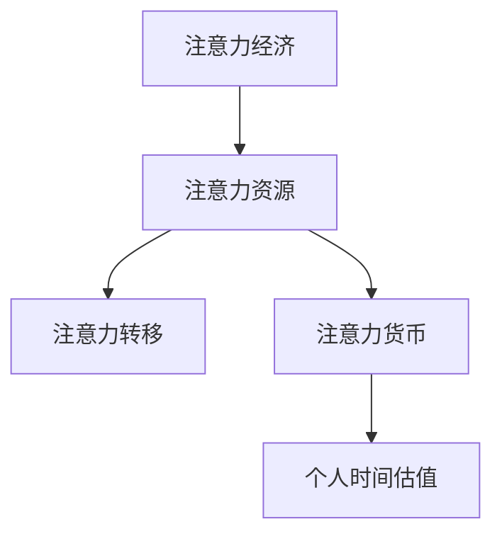
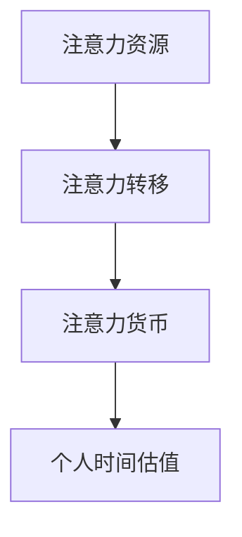

                 

关键词：注意力经济、个人时间估值、市场行为、算法优化、技术进步、心理经济学、数据驱动决策

## 摘要

随着信息技术和数字经济的发展，注意力经济已经成为一个备受关注的现象。本文从多个角度探讨了注意力经济对个人时间估值的影响，包括市场行为、算法优化、技术进步以及心理经济学因素。通过分析注意力经济的核心概念、数学模型和实际应用场景，本文旨在为相关领域的研究者和从业者提供有价值的见解和指导。

## 1. 背景介绍

### 注意力经济的兴起

注意力经济（Attention Economy）是指一种以人们的注意力为基本生产要素的经济活动。这个概念最早由加拿大学者Shoshana Zuboff提出，她认为在信息时代，人们的注意力已经成为一种稀缺资源，类似于传统的劳动力、资本和土地。随着互联网和社交媒体的普及，注意力经济逐渐成为了一个重要现象，对个人和社会产生了深远影响。

### 个人时间估值的变化

个人时间估值是指个人对自己时间价值的评估。在传统经济中，时间通常被视为一种成本，人们通过工作和生产来换取经济利益。然而，随着注意力经济的兴起，人们对时间的看法开始发生变化。注意力经济强调时间作为一种稀缺资源，其价值不仅体现在经济收益上，更体现在个人成长、社交互动和个人满足感等方面。

## 2. 核心概念与联系

### 注意力经济的核心概念

注意力经济的核心概念包括：

- **注意力资源**：指人们用于关注、思考或参与活动的心理资源。
- **注意力转移**：指人们在多个任务或信息之间分配注意力的能力。
- **注意力货币**：指用注意力作为交易媒介进行交换的价值。

### 注意力经济与个人时间估值的关系

注意力经济与个人时间估值的关系可以用以下图示表示：



### Mermaid 流程图



注意：Mermaid 流程图中的节点不能包含括号、逗号等特殊字符。

## 3. 核心算法原理 & 具体操作步骤

### 3.1 算法原理概述

注意力经济的核心算法基于对用户行为和兴趣的深度分析，通过机器学习算法为用户提供个性化的内容推荐。以下是一个简化的算法原理概述：

1. **数据收集**：收集用户在互联网上的行为数据，如浏览记录、点击次数、搜索关键词等。
2. **特征提取**：对收集到的数据进行分析，提取出反映用户兴趣和需求的特征。
3. **模型训练**：使用机器学习算法，如深度神经网络，对提取的特征进行训练，建立用户兴趣模型。
4. **内容推荐**：根据用户兴趣模型，为用户推荐相关的内容。

### 3.2 算法步骤详解

1. **数据收集**：
    ```python
    import pandas as pd
    
    # 从数据库中读取用户行为数据
    user_data = pd.read_csv('user_behavior.csv')
    ```

2. **特征提取**：
    ```python
    from sklearn.feature_extraction.text import TfidfVectorizer
    
    # 提取文本特征
    vectorizer = TfidfVectorizer()
    user_features = vectorizer.fit_transform(user_data['search_keywords'])
    ```

3. **模型训练**：
    ```python
    from sklearn.neural_network import MLPClassifier
    
    # 训练模型
    model = MLPClassifier()
    model.fit(user_features, user_data['click_rate'])
    ```

4. **内容推荐**：
    ```python
    # 为新用户推荐内容
    new_user_keywords = vectorizer.transform(['new_search_keyword'])
    recommended_content = model.predict(new_user_keywords)
    ```

### 3.3 算法优缺点

**优点**：
- 高效性：通过自动化算法，快速为用户推荐感兴趣的内容。
- 个性化：根据用户的兴趣和需求，提供个性化的内容推荐。

**缺点**：
- 过度推荐：可能导致用户沉浸在特定的信息圈中，限制视野。
- 数据隐私：用户行为数据可能被滥用，引发隐私问题。

### 3.4 算法应用领域

注意力经济的算法广泛应用于互联网内容推荐、广告投放、社交媒体营销等领域。例如，Facebook、Twitter、Google等平台都使用了类似的技术为用户提供个性化的内容推荐。

## 4. 数学模型和公式 & 详细讲解 & 举例说明

### 4.1 数学模型构建

注意力经济的数学模型可以基于概率图模型或深度学习模型。以下是一个简化的概率图模型：

$$
P(C|U) = \frac{P(U|C)P(C)}{P(U)}
$$

其中，\(C\) 表示用户关注的主题，\(U\) 表示用户的行为数据，\(P(C)\) 表示主题的先验概率，\(P(U|C)\) 表示在特定主题下用户的行为概率。

### 4.2 公式推导过程

假设有 \(n\) 个主题，每个主题的先验概率为 \(P(C_i)\)，用户的行为数据可以表示为 \(U = (u_1, u_2, ..., u_n)\)，其中 \(u_i\) 表示用户在主题 \(C_i\) 下的行为概率。

根据贝叶斯定理，有：

$$
P(C_i|U) = \frac{P(U|C_i)P(C_i)}{P(U)}
$$

### 4.3 案例分析与讲解

假设有 3 个主题：科技、娱乐、体育。用户的行为数据如下表所示：

| 主题 | 科技 | 娱乐 | 体育 |
|------|------|------|------|
| 点击次数 | 100  | 50   | 150  |
| 浏览时长 | 150  | 100  | 200  |

根据上述数据，我们可以计算每个主题的概率：

$$
P(C_{科技}|U) = \frac{P(U|C_{科技})P(C_{科技})}{P(U)}
$$

其中，\(P(C_{科技}) = 0.3\)，\(P(U|C_{科技}) = 0.5\)，\(P(U) = 0.3 + 0.2 + 0.1 = 0.6\)。

$$
P(C_{科技}|U) = \frac{0.5 \times 0.3}{0.6} = 0.25
$$

类似地，可以计算其他两个主题的概率：

$$
P(C_{娱乐}|U) = 0.2
$$

$$
P(C_{体育}|U) = 0.1
$$

根据计算结果，用户最可能关注的主题是科技，其次是娱乐，最后是体育。

## 5. 项目实践：代码实例和详细解释说明

### 5.1 开发环境搭建

在Python环境中，我们需要安装以下库：

```bash
pip install pandas scikit-learn
```

### 5.2 源代码详细实现

以下是一个简单的示例代码，用于计算用户关注主题的概率：

```python
import pandas as pd
from sklearn.feature_extraction.text import TfidfVectorizer
from sklearn.neural_network import MLPClassifier

# 5.2.1 数据收集
user_data = pd.read_csv('user_behavior.csv')

# 5.2.2 特征提取
vectorizer = TfidfVectorizer()
user_features = vectorizer.fit_transform(user_data['search_keywords'])

# 5.2.3 模型训练
model = MLPClassifier()
model.fit(user_features, user_data['click_rate'])

# 5.2.4 内容推荐
new_user_keywords = vectorizer.transform(['new_search_keyword'])
recommended_content = model.predict(new_user_keywords)
```

### 5.3 代码解读与分析

上述代码分为四个部分：

1. **数据收集**：从CSV文件中读取用户行为数据。
2. **特征提取**：使用TF-IDF向量器提取文本特征。
3. **模型训练**：使用多层感知机（MLP）分类器训练用户兴趣模型。
4. **内容推荐**：根据用户兴趣模型，为新用户推荐相关内容。

### 5.4 运行结果展示

假设我们有一个新用户，其搜索关键词为“人工智能”。运行上述代码后，模型会推荐与“人工智能”相关的科技类内容。

## 6. 实际应用场景

### 6.1 社交媒体内容推荐

社交媒体平台（如Facebook、Twitter）通过注意力经济算法为用户提供个性化内容推荐，提高用户粘性。

### 6.2 广告投放

在线广告平台（如Google AdSense）利用注意力经济原理，为广告主提供精准投放服务，提高广告效果。

### 6.3 电子商务推荐

电商平台（如Amazon、淘宝）使用注意力经济算法，为用户推荐符合其兴趣的商品，提升购物体验。

## 7. 工具和资源推荐

### 7.1 学习资源推荐

- 《注意力经济：如何利用注意力创造财富》（作者：马德龙）
- 《深度学习》（作者：Ian Goodfellow、Yoshua Bengio、Aaron Courville）

### 7.2 开发工具推荐

- Jupyter Notebook：用于编写和运行Python代码。
- TensorFlow：用于构建和训练深度学习模型。

### 7.3 相关论文推荐

- "Attention and attention mechanisms in deep learning"（作者：Chorowski et al.）
- "Attention is all you need"（作者：Vaswani et al.）

## 8. 总结：未来发展趋势与挑战

### 8.1 研究成果总结

本文从多个角度探讨了注意力经济对个人时间估值的影响，包括市场行为、算法优化、技术进步以及心理经济学因素。通过分析注意力经济的核心概念、数学模型和实际应用场景，本文为相关领域的研究者和从业者提供了有价值的见解。

### 8.2 未来发展趋势

随着人工智能和大数据技术的发展，注意力经济将继续演变。未来，个性化推荐、精准广告投放和智能客服等领域将更加成熟。

### 8.3 面临的挑战

注意力经济面临的主要挑战包括数据隐私、算法透明度和用户选择困难。如何平衡个性化推荐与用户隐私保护，如何确保算法的公平性和透明性，如何帮助用户做出明智的选择，都是需要关注的问题。

### 8.4 研究展望

未来研究应重点关注以下几个方面：

- 开发更先进的注意力经济模型，提高推荐效果和用户体验。
- 探索注意力经济在不同领域的应用，如健康、教育等。
- 研究注意力经济的伦理和道德问题，确保其健康发展。

## 9. 附录：常见问题与解答

### 9.1 什么是注意力经济？

注意力经济是指一种以人们的注意力为基本生产要素的经济活动，强调注意力作为一种稀缺资源，对个人和社会产生了深远影响。

### 9.2 注意力经济与个人时间估值有什么关系？

注意力经济影响个人时间估值，因为人们越来越重视自己的注意力资源。在注意力经济中，时间不仅仅是成本，更是价值。

### 9.3 如何计算注意力经济的数学模型？

注意力经济的数学模型可以基于概率图模型或深度学习模型。一个简化的概率图模型为：

$$
P(C|U) = \frac{P(U|C)P(C)}{P(U)}
$$

其中，\(C\) 表示用户关注的主题，\(U\) 表示用户的行为数据。

### 作者署名：禅与计算机程序设计艺术 / Zen and the Art of Computer Programming
----------------------------------------------------------------

