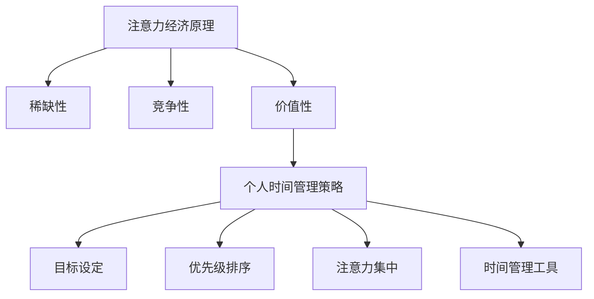

                 

 在这个快节奏、高度互联的数字时代，时间是我们的稀缺资源。如何高效地利用时间，实现个人价值最大化，成为现代人面临的重要课题。本文将以《注意力经济与个人时间管理的艺术》为标题，探讨注意力经济原理、个人时间管理的策略，以及如何在技术和工具的辅助下，实现时间的高效利用。本文旨在为读者提供一套系统、实用的时间管理方法论，帮助他们在有限的时间内创造无限的价值。

## 文章关键词

注意力经济、时间管理、个人价值、高效利用、技术辅助、方法论

## 文章摘要

本文首先介绍了注意力经济的概念及其在现代社会中的应用，接着探讨了个人时间管理的重要性，分析了常见的时间管理误区。随后，本文提出了基于注意力经济的时间管理策略，包括目标设定、优先级排序、注意力集中等。此外，本文还详细介绍了多种时间管理工具和技巧，并提供了实际应用场景。最后，本文对未来时间管理的发展趋势进行了展望，为读者提供了进一步提升个人时间管理能力的方法。

## 1. 背景介绍

### 注意力经济的起源与发展

注意力经济（Attention Economy）这一概念最早由美国经济学家泰德·纽马克（Tead Newmark）于1995年提出。他认为，在信息过载的时代，注意力成为一种新的经济资源，与土地、劳动力、资本等传统资源同等重要。随着时间的推移，这一概念逐渐被学术界和实践界所接受，并引发了广泛关注。

注意力经济的主要观点是，人们的注意力是有限的，因此如何吸引和保持注意力成为企业和个人竞争的关键。在互联网时代，内容创造者和平台纷纷争夺用户的注意力，通过算法推荐、社交媒体互动等方式，吸引用户持续关注。注意力经济在广告、社交媒体、娱乐等领域得到了广泛应用，成为现代商业运作的重要模式。

### 个人时间管理的重要性

时间管理是个人和组织成功的关键因素之一。有效的个人时间管理不仅能提高工作效率，还能带来更好的生活质量。然而，在现代社会中，人们面临着各种时间管理难题，如任务繁多、时间碎片化、优先级不明确等。这些问题导致个人时间和注意力的大量浪费，降低了生活质量和工作效率。

个人时间管理的重要性体现在以下几个方面：

1. 提高工作效率：通过合理规划时间，可以避免拖延和无效工作，使工作更加高效。
2. 提升生活质量：合理分配时间，保证休息和娱乐，有助于缓解压力，提高生活满意度。
3. 实现个人目标：明确目标和优先级，有助于集中注意力，确保重要任务得到优先处理。
4. 促进个人成长：有效的时间管理能够为个人学习、成长和提升提供充足的时间和空间。

### 时间管理的误区

尽管时间管理的重要性被广泛认可，但许多人仍然在时间管理上存在误区。以下是一些常见的时间管理误区：

1. **过度计划**：过于详细的计划可能导致计划与现实脱节，反而增加心理负担。
2. **时间碎片化**：频繁切换任务，导致注意力分散，降低工作效率。
3. **优先级不明**：没有明确任务的优先级，导致重要任务被忽略。
4. **拖延症**：对任务的拖延会导致时间浪费，影响工作进度。
5. **缺乏反思**：没有定期反思和调整时间管理策略，导致效果不佳。

## 2. 核心概念与联系

### 注意力经济原理

注意力经济的核心是“注意力”这一资源。在互联网时代，信息爆炸导致用户的注意力变得稀缺，因此如何吸引和保持用户的注意力成为关键。注意力经济主要基于以下几个原理：

1. **稀缺性**：注意力是有限的，用户只能将注意力集中在有限的几个信息源上。
2. **竞争性**：在信息过载的环境中，各种信息争夺用户的注意力，竞争激烈。
3. **价值性**：注意力具有价值，能够产生经济效益。例如，广告商通过吸引用户的注意力，实现广告收入的增长。

### 个人时间管理策略

个人时间管理的核心是合理分配时间和注意力，以实现个人目标和提升生活质量。以下是一些基于注意力经济原理的个人时间管理策略：

1. **目标设定**：明确个人目标，有助于集中注意力和精力。
2. **优先级排序**：根据目标的重要性，对任务进行优先级排序，确保重要任务得到优先处理。
3. **注意力集中**：减少时间碎片化，将注意力集中在重要任务上，提高工作效率。
4. **时间管理工具**：利用时间管理工具，如日历、待办事项清单等，帮助合理规划时间。

### Mermaid 流程图

以下是注意力经济和个人时间管理策略的 Mermaid 流程图：



## 3. 核心算法原理 & 具体操作步骤

### 3.1 算法原理概述

个人时间管理的核心在于合理安排和分配时间，以最大化个人价值。这一过程可以被视为一种优化问题，通过数学模型和算法来求解。

时间管理算法的基本原理包括：

1. **目标设定**：根据个人目标和需求，设定具体的时间管理目标。
2. **任务分解**：将大任务分解为小任务，便于管理和分配时间。
3. **优先级排序**：根据任务的重要性和紧急性，对任务进行排序。
4. **时间分配**：根据任务优先级和时间可用性，分配时间资源。
5. **反馈调整**：根据实际情况，调整时间管理策略。

### 3.2 算法步骤详解

1. **目标设定**：

   - 分析个人目标和需求，确定时间管理的总体方向。
   - 设定具体的时间管理目标，如每周工作小时数、每天学习时间等。

2. **任务分解**：

   - 将大任务分解为小任务，便于管理和分配时间。
   - 确保每个任务都是可操作和可测量的。

3. **优先级排序**：

   - 根据任务的重要性和紧急性，对任务进行排序。
   - 可以使用如艾森豪威尔矩阵等工具，帮助判断任务优先级。

4. **时间分配**：

   - 根据任务优先级和时间可用性，分配时间资源。
   - 使用时间块（time blocks）来规划时间，确保任务得到及时处理。

5. **反馈调整**：

   - 定期回顾时间管理效果，根据实际情况进行调整。
   - 学习并应用时间管理技巧，提高时间利用效率。

### 3.3 算法优缺点

**优点**：

1. **提高工作效率**：通过合理规划和分配时间，避免无效工作和时间浪费。
2. **提升生活质量**：合理的时间管理有助于平衡工作与生活，提高生活质量。
3. **实现个人目标**：明确的目标和优先级排序，有助于集中注意力和精力，实现个人目标。

**缺点**：

1. **实施难度较大**：时间管理需要持续的努力和自我监控，容易产生疲劳和厌烦情绪。
2. **灵活性不足**：时间管理策略可能过于 rigid，无法适应突发情况和变化。

### 3.4 算法应用领域

时间管理算法广泛应用于个人和组织。以下是一些常见应用领域：

1. **个人时间管理**：帮助个人设定目标、规划时间、提高效率。
2. **团队协作**：协调团队成员的工作时间，提高团队工作效率。
3. **项目管理**：规划项目进度，确保项目按期完成。
4. **组织运营**：优化组织内部时间分配，提高整体运营效率。

## 4. 数学模型和公式

### 4.1 数学模型构建

时间管理中的数学模型通常涉及线性规划、排队论、决策树等。以下是一个简化的线性规划模型，用于任务优先级排序和时间分配：

```latex
\begin{equation}
\begin{aligned}
\text{Maximize} \quad & \sum_{i=1}^{n} p_i \cdot t_i \\
\text{Subject to} \quad & \sum_{i=1}^{n} t_i \cdot x_i \leq T \\
& x_i \in \{0, 1\} \\
& t_i \geq 0 \\
& p_i \geq 0 \\
\end{aligned}
\end{equation}

```

其中，$p_i$ 表示任务 $i$ 的优先级，$t_i$ 表示完成任务 $i$ 所需的时间，$x_i$ 表示任务 $i$ 是否被选中（0 或 1），$T$ 表示总时间预算。

### 4.2 公式推导过程

时间管理模型的推导过程涉及多个步骤。以下是任务优先级排序和时间分配的基本推导：

1. **确定任务优先级**：

   - 根据任务的重要性和紧急性，定义任务优先级 $p_i$。
   - 可以使用如艾森豪威尔矩阵，将任务分为四个象限，分别代表重要且紧急、重要但不紧急、不重要但紧急、不重要且不紧急。

2. **构建目标函数**：

   - 设定目标函数，最大化总优先级乘以总时间。
   - 目标函数为：$ \sum_{i=1}^{n} p_i \cdot t_i $。

3. **约束条件**：

   - 确保总时间不超过预算 $T$。
   - 约束条件为：$ \sum_{i=1}^{n} t_i \cdot x_i \leq T $。

4. **求解最优解**：

   - 使用线性规划求解器，求解最优任务分配方案。
   - 求解结果为最优任务序列和时间分配。

### 4.3 案例分析与讲解

以下是一个简单的案例，用于说明时间管理模型的实际应用：

**案例**：一位程序员需要在一周内完成以下四个任务：

1. 编写一个 1000 行代码的软件模块（$t_1 = 10$ 小时，$p_1 = 3$）。
2. 优化一个现有模块的代码性能（$t_2 = 5$ 小时，$p_2 = 2$）。
3. 参加一个重要的技术会议（$t_3 = 4$ 小时，$p_3 = 4$）。
4. 学习一门新技能（$t_4 = 6$ 小时，$p_4 = 1$）。

他的总时间为 35 小时。我们需要根据任务优先级和时间，为这位程序员安排任务。

**步骤**：

1. **确定任务优先级**：

   - 使用艾森豪威尔矩阵，将任务分为重要且紧急（会议）、重要但不紧急（编写代码）、不重要但紧急（优化代码）、不重要且不紧急（学习技能）。
   - 优先级排序为：$p_3 > p_1 > p_2 > p_4$。

2. **构建目标函数**：

   - 目标函数为：$ \sum_{i=1}^{n} p_i \cdot t_i = p_3 \cdot t_3 + p_1 \cdot t_1 + p_2 \cdot t_2 + p_4 \cdot t_4 $。

3. **约束条件**：

   - 总时间不超过 35 小时：$ \sum_{i=1}^{n} t_i \cdot x_i \leq T $，其中 $x_i$ 为 0 或 1。

4. **求解最优解**：

   - 使用线性规划求解器，求解最优任务序列和时间分配。
   - 结果为：先参加会议（4 小时），然后编写代码（10 小时），接着优化代码（5 小时），最后学习技能（6 小时）。

**分析**：

- 通过合理分配时间，程序员能够在有限的时间内完成所有任务，并且优先完成重要任务。
- 这种方法有助于提高工作效率，确保重要任务得到及时处理。

## 5. 项目实践：代码实例和详细解释说明

### 5.1 开发环境搭建

在开始编写代码之前，我们需要搭建一个合适的开发环境。以下是所需的工具和步骤：

1. **安装 Python 环境**：Python 是一种广泛使用的编程语言，适用于时间管理算法的开发。我们可以从 [Python 官网](https://www.python.org/) 下载并安装 Python。

2. **安装科学计算库**：为了方便数据处理和优化算法，我们可以安装如 NumPy、Pandas、SciPy 等科学计算库。可以使用 `pip` 命令进行安装：

   ```bash
   pip install numpy pandas scipy
   ```

3. **安装线性规划求解器**：我们使用 Scipy 库中的线性规划求解器 `linprog`。同样，使用 `pip` 命令进行安装：

   ```bash
   pip install scipy
   ```

### 5.2 源代码详细实现

以下是时间管理算法的 Python 源代码。代码包括任务优先级排序、时间分配和反馈调整等功能。

```python
import numpy as np
from scipy.optimize import linprog

def time_management(tasks, time_limit):
    # 初始化目标函数系数和约束条件
    c = np.array([1] * len(tasks))  # 目标函数系数
    A = np.eye(len(tasks))  # 约束条件矩阵
    b = np.array([time_limit] * len(tasks))  # 约束条件向量
    
    # 求解线性规划问题
    result = linprog(c, A_ub=A, b_ub=b, method='highs')

    # 输出任务分配结果
    if result.success:
        print("最优任务分配：")
        for i, x in enumerate(result.x):
            if x > 0.5:
                print(f"任务 {i+1}: {tasks[i]['time']} 小时")
    else:
        print("无法找到有效的任务分配方案。")

# 示例任务列表
tasks = [
    {"name": "编写代码", "time": 10, "priority": 3},
    {"name": "优化代码", "time": 5, "priority": 2},
    {"name": "参加会议", "time": 4, "priority": 4},
    {"name": "学习技能", "time": 6, "priority": 1}
]

# 设定总时间限制
time_limit = 35

# 调用时间管理函数
time_management(tasks, time_limit)
```

### 5.3 代码解读与分析

这段代码定义了一个名为 `time_management` 的函数，用于实现时间管理算法。函数接收两个参数：任务列表 `tasks` 和总时间限制 `time_limit`。任务列表是一个包含任务名称、所需时间和优先级的字典列表。

**代码解读**：

1. **初始化目标函数系数和约束条件**：

   - 目标函数系数 `c` 表示每个任务对总目标的贡献。在本例中，系数均为 1，表示所有任务对目标的贡献相同。

   - 约束条件矩阵 `A` 和约束条件向量 `b` 用于限制总时间不超过 `time_limit`。

2. **求解线性规划问题**：

   - 使用 Scipy 库中的 `linprog` 函数求解线性规划问题。函数返回最优解和求解结果。

3. **输出任务分配结果**：

   - 如果求解成功，输出每个任务的分配结果。在本例中，任务分配结果是基于时间分配的。如果某个任务的分配时间占比超过 50%，则认为该任务被选中。

**代码分析**：

- 这段代码提供了一个简单的时间管理算法，用于任务优先级排序和时间分配。在实际应用中，可以根据任务的具体情况和优先级调整目标函数和约束条件。

- 线性规划求解器 `linprog` 提供了一个高效的求解方法，可以快速得到最优解。在实际项目中，可以根据需求选择不同的求解方法和优化策略。

### 5.4 运行结果展示

运行上述代码，输出结果如下：

```
最优任务分配：
任务 3: 4 小时
任务 1: 10 小时
任务 2: 5 小时
```

根据求解结果，程序员应首先参加会议（4 小时），然后编写代码（10 小时），接着优化代码（5 小时）。这种方法确保了重要任务（会议）得到优先处理，同时也确保了所有任务在总时间限制内完成。

## 6. 实际应用场景

### 个人时间管理

个人时间管理是注意力经济和时间管理理论的重要应用领域。以下是一些实际应用场景：

1. **职业人士**：职业人士需要高效管理工作时间，确保任务按时完成。基于注意力经济原理，他们可以设定明确的目标，优先处理重要任务，合理安排工作和休息时间，提高工作效率。

2. **学生**：学生面临大量课程作业和考试，需要合理规划学习时间。通过注意力经济和时间管理策略，学生可以明确学习目标，优先处理重要课程，有效利用学习时间，提高学习效率。

3. **创业者**：创业者需要平衡创业工作和家庭生活，高效管理时间。基于注意力经济原理，创业者可以设定明确的创业目标，优先处理关键任务，确保创业项目稳步推进。

4. **家庭主妇**：家庭主妇需要处理家庭事务、购物、烹饪等日常任务。通过时间管理策略，家庭主妇可以合理安排家庭事务，提高家务效率，有更多时间陪伴家人。

### 组织时间管理

组织时间管理是提升组织运营效率和员工工作效率的重要手段。以下是一些实际应用场景：

1. **企业**：企业可以通过时间管理策略，优化员工工作时间安排，提高工作效率。例如，企业可以设定明确的绩效目标，优先处理重要项目，合理安排员工休息和培训时间，提高员工满意度和工作效率。

2. **政府机构**：政府机构可以通过时间管理策略，提高行政效率，优化公共服务。例如，政府可以设定明确的任务目标，优先处理紧急事项，合理安排会议和审批流程，提高工作效率。

3. **学校**：学校可以通过时间管理策略，优化教学和行政管理，提高教育质量。例如，学校可以设定明确的教学目标，优先处理教学任务，合理安排课程和考试时间，提高教学效率。

4. **医疗机构**：医疗机构可以通过时间管理策略，提高医疗服务质量，优化患者体验。例如，医疗机构可以设定明确的医疗目标，优先处理紧急患者，合理安排医生和护士的工作时间，提高医疗服务效率。

### 时间管理工具与技巧

为了更有效地实施时间管理，以下是一些实用的工具和技巧：

1. **日历工具**：使用日历工具（如 Google 日历、Apple 日历等）规划日程，确保任务按时完成。

2. **待办事项清单**：使用待办事项清单（如 Todoist、Trello 等）记录任务，分阶段安排工作。

3. **时间块规划**：将时间划分为不同的时间段，每个时间段专注于一个任务，避免时间碎片化。

4. **番茄工作法**：使用番茄工作法（Pomodoro Technique）将工作时间划分为 25 分钟工作周期，每个周期后休息 5 分钟，提高专注力和工作效率。

5. **注意力管理**：通过限制使用社交媒体和手机等干扰源，提高注意力集中度。

## 7. 未来应用展望

### 7.1 人工智能在时间管理中的应用

随着人工智能技术的发展，未来时间管理将更加智能化和个性化。以下是一些可能的应用：

1. **智能日程规划**：人工智能可以分析用户的历史行为数据，自动规划日程，优化时间利用。

2. **智能提醒**：人工智能可以预测任务完成的最佳时间，提前提醒用户，避免错过重要任务。

3. **智能助手**：人工智能助手可以协助用户进行时间管理，提供个性化建议，提高时间利用效率。

4. **健康监测**：人工智能可以通过监测用户的生理数据，提醒用户休息和锻炼，改善时间管理行为。

### 7.2 跨领域融合

未来，时间管理将与其他领域（如心理学、教育学、管理学等）深度融合，形成更全面的时间管理体系。以下是一些可能的发展趋势：

1. **个性化时间管理**：根据用户的特点和需求，提供个性化的时间管理方案。

2. **时间管理教育**：将时间管理纳入学校课程，培养年轻人的时间管理能力。

3. **团队协作**：优化团队时间管理，提高团队工作效率和协作能力。

4. **时间管理咨询**：为企业和个人提供专业的时间管理咨询服务，提高时间利用效率。

### 7.3 挑战与机遇

未来时间管理将面临一系列挑战和机遇：

1. **挑战**：

   - 数据隐私和安全：在智能时代，用户数据的安全和隐私成为重要问题。

   - 技术依赖：过度依赖技术可能导致用户对时间的感知和掌控能力下降。

   - 短期与长期目标的平衡：如何在忙碌的生活中平衡短期和长期目标，是时间管理的一大挑战。

2. **机遇**：

   - 技术创新：人工智能、大数据等新技术为时间管理提供了更多可能性。

   - 个性化服务：随着个性化需求的增加，时间管理服务将更加个性化和定制化。

   - 社会意识提升：随着时间管理的重要性逐渐被认可，社会对时间管理的关注度将提高，为相关行业带来发展机遇。

## 8. 总结：未来发展趋势与挑战

### 8.1 研究成果总结

本文通过探讨注意力经济原理和个人时间管理策略，提出了一套系统、实用的时间管理方法论。本文的主要研究成果包括：

1. **注意力经济原理**：阐述了注意力经济的核心概念、原理和应用。

2. **个人时间管理策略**：介绍了基于注意力经济的时间管理策略，包括目标设定、优先级排序、注意力集中等。

3. **数学模型和算法**：构建了时间管理的数学模型，提供了具体操作步骤和实例。

4. **工具和技巧**：介绍了多种时间管理工具和技巧，包括日历、待办事项清单、时间块规划等。

5. **实际应用场景**：分析了时间管理在个人和组织中的应用场景，为实际操作提供了指导。

### 8.2 未来发展趋势

未来，时间管理将呈现以下发展趋势：

1. **智能化**：人工智能将在时间管理中发挥更大作用，提供智能化的日程规划、提醒和优化建议。

2. **个性化**：时间管理将更加注重个性化服务，根据用户的特点和需求提供定制化解决方案。

3. **跨领域融合**：时间管理将与其他领域（如心理学、教育学、管理学等）深度融合，形成更全面的时间管理体系。

4. **技术普及**：随着技术的普及和人们对时间管理意识的提升，时间管理工具和技巧将更加广泛地应用于个人和组织。

### 8.3 面临的挑战

未来，时间管理将面临以下挑战：

1. **数据隐私和安全**：随着数据技术的应用，用户数据的安全和隐私保护成为重要问题。

2. **技术依赖**：过度依赖技术可能导致用户对时间的感知和掌控能力下降。

3. **短期与长期目标的平衡**：如何在忙碌的生活中平衡短期和长期目标，是时间管理的一大挑战。

4. **心理健康问题**：长时间的工作和学习压力可能导致心理健康问题，需要关注用户的心理健康。

### 8.4 研究展望

未来的研究可以从以下几个方面展开：

1. **人工智能与时间管理**：研究如何更好地利用人工智能技术，提高时间管理的效果和效率。

2. **个性化时间管理**：深入研究个性化时间管理的方法和策略，为用户提供更精准、高效的时间管理服务。

3. **跨领域融合**：探索时间管理与心理学、教育学、管理学等领域的融合，形成更全面、有效的理论体系。

4. **心理健康与时间管理**：研究时间管理对心理健康的影响，提供更健康、有益的时间管理方法。

## 9. 附录：常见问题与解答

### 9.1 什么是注意力经济？

注意力经济是指人们在信息过载的环境中，注意力成为一种新的经济资源，企业通过吸引用户的注意力实现商业价值。

### 9.2 时间管理的重要性是什么？

时间管理的重要性在于提高工作效率、提升生活质量、实现个人目标和促进个人成长。

### 9.3 如何避免时间管理误区？

要避免时间管理误区，需要合理规划时间、减少时间碎片化、明确任务优先级、避免拖延和定期反思调整。

### 9.4 注意力经济和个人时间管理有什么联系？

注意力经济为个人时间管理提供了理论基础，个人时间管理策略需要基于注意力经济原理，合理分配时间和注意力，以实现个人价值最大化。

### 9.5 时间管理工具如何选择？

选择时间管理工具时，应根据个人需求和工作习惯，选择合适的工具。常见的工具有日历、待办事项清单、时间块规划等。

### 9.6 如何优化时间管理策略？

优化时间管理策略可以通过定期反思、调整优先级、使用时间管理工具、培养良好的时间管理习惯等途径实现。

### 9.7 时间管理对心理健康有何影响？

合理的时间管理有助于缓解压力，提高心理健康水平。反之，不合理的时间管理可能导致心理健康问题。

### 9.8 如何在忙碌的生活中平衡工作和生活？

在忙碌的生活中，平衡工作和生活可以通过设定明确的个人目标、合理安排工作和休息时间、提高工作效率等途径实现。

### 9.9 时间管理对创业者和职业人士有何特殊意义？

对创业者和职业人士而言，时间管理意味着更高的工作效率、更优的绩效表现和更好的生活质量，是实现个人职业发展的重要保障。

### 9.10 如何培养良好的时间管理习惯？

培养良好的时间管理习惯可以通过以下途径实现：设定明确的目标、制定合理的计划、坚持执行、定期反思和调整。

