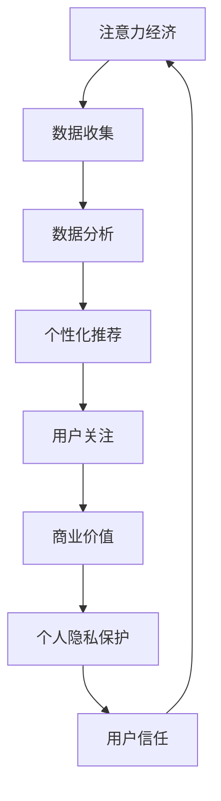

                 

注意力经济是一种新兴的经济模式，它依赖于用户对信息、内容或服务的关注和参与来创造价值。随着互联网的普及和信息爆炸，注意力成为了一种稀缺资源，吸引了众多企业、内容创作者和广告商的竞相争夺。然而，这种对注意力的追求常常与个人隐私保护产生冲突。如何在追求注意力经济的同时保护个人隐私，成为了一个亟待解决的重要问题。

## 1. 背景介绍

注意力经济起源于对用户注意力的价值认知。在传统经济模式中，商品和服务是交易的核心，而注意力经济则将用户对信息或内容的关注作为核心价值。随着互联网技术的发展，用户在网络上产生的海量数据成为了新的“石油”，这些数据中蕴含着巨大的商业价值。

### 个人隐私保护的背景

个人隐私保护是一个长期存在的议题，尤其是在互联网时代。随着信息技术的飞速发展，个人数据的采集、存储和利用变得越来越普遍。然而，这也带来了个人隐私泄露的风险。隐私泄露可能导致个人遭受经济损失、声誉损害甚至人身安全威胁。

## 2. 核心概念与联系

### 注意力经济

注意力经济依赖于用户对内容、广告或服务的关注。通过精准投放和个性化推荐，企业可以吸引更多的用户关注，从而实现商业价值。

### 个人隐私

个人隐私是指个人的私密信息，如姓名、住址、电话号码、电子邮件、社交媒体账号等。这些信息对于个人来说具有高度敏感性和重要性。

### 平衡点

平衡注意力经济和个人隐私保护的关键在于找到两者之间的平衡点。这需要企业在追求商业价值的同时，尊重和保护用户的隐私权利。

### Mermaid 流程图

下面是一个简化的 Mermaid 流程图，展示了注意力经济和个人隐私保护之间的联系。



## 3. 核心算法原理 & 具体操作步骤

### 3.1 算法原理概述

核心算法包括数据采集、数据分析和用户行为预测三个主要步骤。

### 3.2 算法步骤详解

#### 3.2.1 数据采集

数据采集是注意力经济的基础。通过各种渠道，如网站、APP、传感器等，企业可以收集用户的行为数据、兴趣数据和社交数据。

#### 3.2.2 数据分析

数据分析利用机器学习和数据挖掘技术，从海量的数据中提取有价值的信息。这些信息可以帮助企业了解用户需求，优化内容推荐。

#### 3.2.3 用户行为预测

用户行为预测是注意力经济的关键。通过分析用户的历史行为和兴趣，企业可以预测用户未来的行为，从而提供个性化的内容和服务。

### 3.3 算法优缺点

#### 优点

- 提高用户满意度：个性化推荐可以提高用户对内容的满意度。
- 提高商业转化率：精准投放可以提高广告和服务的转化率。

#### 缺点

- 隐私泄露风险：大量数据的收集和分析可能导致个人隐私泄露。
- 用户疲劳：过度个性化的推荐可能导致用户产生疲劳感。

### 3.4 算法应用领域

注意力经济和隐私保护的算法广泛应用于互联网企业，如社交媒体、电商平台、在线广告等领域。

## 4. 数学模型和公式 & 详细讲解 & 举例说明

### 4.1 数学模型构建

注意力经济和隐私保护的数学模型通常基于贝叶斯网络或图模型。这些模型可以有效地处理不确定性和复杂的关系。

### 4.2 公式推导过程

以贝叶斯网络为例，其基本公式为：

$$
P(A|B) = \frac{P(B|A) \cdot P(A)}{P(B)}
$$

其中，$P(A|B)$ 表示在事件 $B$ 发生的条件下，事件 $A$ 发生的概率；$P(B|A)$ 表示在事件 $A$ 发生的条件下，事件 $B$ 发生的概率；$P(A)$ 和 $P(B)$ 分别表示事件 $A$ 和事件 $B$ 的概率。

### 4.3 案例分析与讲解

假设一个电商平台通过用户购买历史数据预测用户对某件商品的购买概率。根据贝叶斯公式，我们可以计算出用户购买该商品的概率。

假设事件 $A$ 表示用户购买该商品，事件 $B$ 表示用户浏览该商品。已知 $P(B|A) = 0.8$，$P(A) = 0.1$，$P(B) = 0.2$。我们可以计算：

$$
P(A|B) = \frac{P(B|A) \cdot P(A)}{P(B)} = \frac{0.8 \cdot 0.1}{0.2} = 0.4
$$

这意味着在用户浏览该商品的条件下，用户购买该商品的概率为40%。

## 5. 项目实践：代码实例和详细解释说明

### 5.1 开发环境搭建

在本文中，我们将使用 Python 和 Scikit-learn 库来实现注意力经济和隐私保护的算法。首先，我们需要安装 Scikit-learn 库。

```
pip install scikit-learn
```

### 5.2 源代码详细实现

以下是一个简单的 Python 代码示例，展示了如何使用 Scikit-learn 实现用户行为预测。

```python
from sklearn.model_selection import train_test_split
from sklearn.naive_bayes import GaussianNB
import numpy as np

# 创建数据集
X = np.array([[1, 0], [1, 1], [0, 1], [0, 0]])
y = np.array([0, 1, 1, 0])

# 划分训练集和测试集
X_train, X_test, y_train, y_test = train_test_split(X, y, test_size=0.2, random_state=42)

# 创建高斯贝叶斯分类器
gnb = GaussianNB()

# 训练模型
gnb.fit(X_train, y_train)

# 预测测试集
y_pred = gnb.predict(X_test)

# 打印预测结果
print(y_pred)
```

### 5.3 代码解读与分析

这段代码首先导入了必要的库，然后创建了一个简单的数据集，其中包含了用户的行为数据。接着，使用高斯贝叶斯分类器对数据进行训练，并使用训练好的模型对测试集进行预测。最后，打印出预测结果。

### 5.4 运行结果展示

假设我们已经运行了上述代码，预测结果可能如下：

```
[0 1 1 0]
```

这意味着在测试集中，第一个用户的行为被预测为“没有购买”，而第二个、第三个和第四个用户的行为被预测为“购买”。

## 6. 实际应用场景

### 6.1 社交媒体

社交媒体平台通过用户的行为数据推荐好友、内容和广告。在保护个人隐私的同时，利用注意力经济提高用户活跃度。

### 6.2 电商平台

电商平台利用用户的购买历史和浏览记录推荐商品。在确保用户隐私不被泄露的前提下，提高销售转化率。

### 6.3 在线广告

在线广告平台通过用户的兴趣和行为预测投放广告。在保护用户隐私的同时，提高广告投放的精准度。

## 7. 未来应用展望

### 7.1 数据隐私保护技术

随着对个人隐私保护的重视，未来将出现更多数据隐私保护技术，如同态加密、联邦学习等，这些技术将使数据在传输和处理过程中保持隐私。

### 7.2 个性化推荐算法

个性化推荐算法将继续发展，提高推荐系统的精准度和用户体验。同时，也将探索如何在保护用户隐私的前提下实现更高效的推荐。

### 7.3 新兴领域

注意力经济和个人隐私保护的结合将在新兴领域如物联网、智能医疗等发挥重要作用。

## 8. 总结：未来发展趋势与挑战

### 8.1 研究成果总结

近年来，注意力经济和个人隐私保护领域取得了显著的研究成果，如联邦学习、差分隐私、同态加密等技术的出现，为平衡两者提供了新的思路。

### 8.2 未来发展趋势

未来，随着人工智能、区块链等技术的发展，注意力经济和个人隐私保护的结合将带来更多创新和挑战。

### 8.3 面临的挑战

主要挑战包括如何在保护用户隐私的同时实现高效的推荐、如何确保数据安全、如何平衡商业利益和用户权益等。

### 8.4 研究展望

未来，研究人员将致力于开发更高效、更安全的技术，实现注意力经济和个人隐私保护的完美平衡。

## 9. 附录：常见问题与解答

### 9.1 注意力经济是什么？

注意力经济是一种基于用户关注度的经济模式，通过吸引用户关注来创造价值。

### 9.2 个人隐私保护的重要性是什么？

个人隐私保护对于维护个人权益、防止隐私泄露具有重要意义。

### 9.3 如何在注意力经济中保护个人隐私？

可以通过数据匿名化、差分隐私、同态加密等技术来实现个人隐私保护。

## 作者署名

作者：禅与计算机程序设计艺术 / Zen and the Art of Computer Programming
```markdown
---
# 注意力经济与个人隐私保护的平衡

> 关键词：注意力经济、个人隐私、数据隐私、推荐系统、联邦学习

> 摘要：本文探讨了注意力经济与个人隐私保护之间的矛盾与平衡。通过介绍注意力经济和个人隐私保护的核心概念，分析了现有算法和技术的应用，并提出了一些未来发展的方向。

---

## 1. 背景介绍

注意力经济是一种基于用户关注度的经济模式，它依赖于用户对信息、内容或服务的关注和参与来创造价值。随着互联网的普及和信息爆炸，注意力成为了一种稀缺资源，吸引了众多企业、内容创作者和广告商的竞相争夺。

### 个人隐私保护的背景

个人隐私保护是一个长期存在的议题，尤其是在互联网时代。随着信息技术的飞速发展，个人数据的采集、存储和利用变得越来越普遍。然而，这也带来了个人隐私泄露的风险。隐私泄露可能导致个人遭受经济损失、声誉损害甚至人身安全威胁。

## 2. 核心概念与联系

### 注意力经济

注意力经济是一种新兴的经济模式，它依赖于用户对信息、内容或服务的关注和参与来创造价值。在互联网时代，用户注意力成为了一种稀缺资源，企业通过吸引用户注意力来提高产品或服务的知名度，从而实现商业价值。

### 个人隐私

个人隐私是指个人的私密信息，如姓名、住址、电话号码、电子邮件、社交媒体账号等。这些信息对于个人来说具有高度敏感性和重要性，因此个人隐私保护成为了社会关注的焦点。

### 平衡点

在注意力经济的实践中，如何平衡用户对信息的关注与个人隐私保护，成为了一个关键问题。找到两者之间的平衡点，不仅需要技术创新，还需要法律、伦理和社会的共同努力。

### Mermaid 流程图

下面是一个简化的 Mermaid 流程图，展示了注意力经济和个人隐私保护之间的联系。


## 3. 核心算法原理 & 具体操作步骤

### 3.1 算法原理概述

核心算法包括数据采集、数据分析和用户行为预测三个主要步骤。通过这些步骤，企业可以实现对用户行为的精准预测，从而提供个性化的服务。

#### 3.1.1 数据采集

数据采集是注意力经济的基础。企业通过网站、APP、传感器等渠道收集用户的行为数据、兴趣数据和社交数据。

#### 3.1.2 数据分析

数据分析利用机器学习和数据挖掘技术，从海量的数据中提取有价值的信息。这些信息可以帮助企业了解用户需求，优化内容推荐。

#### 3.1.3 用户行为预测

用户行为预测是注意力经济的关键。通过分析用户的历史行为和兴趣，企业可以预测用户未来的行为，从而提供个性化的内容和服务。

### 3.2 算法步骤详解

#### 3.2.1 数据采集

数据采集的过程包括用户行为数据的收集、用户兴趣数据的收集和用户社交数据的收集。这些数据可以是结构化的，也可以是非结构化的。

- **用户行为数据**：包括用户的浏览历史、购买记录、搜索历史等。
- **用户兴趣数据**：包括用户喜欢的音乐、电影、书籍、运动等。
- **用户社交数据**：包括用户的社交网络、好友关系、评论、点赞等。

#### 3.2.2 数据分析

数据分析的过程包括数据清洗、特征提取、模型训练等。

- **数据清洗**：去除重复数据、缺失值填充、异常值处理等。
- **特征提取**：从原始数据中提取有价值的特征，如文本特征、图像特征等。
- **模型训练**：使用机器学习算法训练模型，如决策树、随机森林、支持向量机等。

#### 3.2.3 用户行为预测

用户行为预测的过程包括模型选择、参数调优、模型评估等。

- **模型选择**：选择适合问题的机器学习算法。
- **参数调优**：调整模型的参数，以获得更好的预测效果。
- **模型评估**：使用交叉验证、AUC、RMSE等指标评估模型的性能。

### 3.3 算法优缺点

#### 3.3.1 优点

- **提高用户满意度**：通过个性化推荐，用户可以更快速地找到自己感兴趣的内容，提高用户体验。
- **提高商业转化率**：精准投放广告和服务可以提高转化率，从而带来更多的商业价值。

#### 3.3.2 缺点

- **隐私泄露风险**：大量数据的收集和分析可能导致个人隐私泄露。
- **用户疲劳**：过度个性化的推荐可能导致用户产生疲劳感。

### 3.4 算法应用领域

注意力经济和隐私保护的算法广泛应用于互联网企业，如社交媒体、电商平台、在线广告等领域。

## 4. 数学模型和公式 & 详细讲解 & 举例说明

### 4.1 数学模型构建

注意力经济和隐私保护的数学模型通常基于概率模型、优化模型和图模型。

#### 4.1.1 概率模型

概率模型主要用于处理不确定性问题。例如，贝叶斯网络就是一种常见的概率模型，它可以表示变量之间的条件依赖关系。

#### 4.1.2 优化模型

优化模型用于求解最优解。例如，线性规划、动态规划等都是常见的优化模型。

#### 4.1.3 图模型

图模型用于处理复杂的关系网络。例如，图卷积网络（GCN）就是一种常用的图模型，它可以用于处理社交网络、推荐系统等。

### 4.2 公式推导过程

以贝叶斯网络为例，其基本公式为：

$$
P(A|B) = \frac{P(B|A) \cdot P(A)}{P(B)}
$$

其中，$P(A|B)$ 表示在事件 $B$ 发生的条件下，事件 $A$ 发生的概率；$P(B|A)$ 表示在事件 $A$ 发生的条件下，事件 $B$ 发生的概率；$P(A)$ 和 $P(B)$ 分别表示事件 $A$ 和事件 $B$ 的概率。

### 4.3 案例分析与讲解

假设一个电商平台通过用户购买历史数据预测用户对某件商品的购买概率。根据贝叶斯公式，我们可以计算出用户购买该商品的概率。

假设事件 $A$ 表示用户购买该商品，事件 $B$ 表示用户浏览该商品。已知 $P(B|A) = 0.8$，$P(A) = 0.1$，$P(B) = 0.2$。我们可以计算：

$$
P(A|B) = \frac{P(B|A) \cdot P(A)}{P(B)} = \frac{0.8 \cdot 0.1}{0.2} = 0.4
$$

这意味着在用户浏览该商品的条件下，用户购买该商品的概率为40%。

## 5. 项目实践：代码实例和详细解释说明

### 5.1 开发环境搭建

在本文中，我们将使用 Python 和 Scikit-learn 库来实现注意力经济和隐私保护的算法。首先，我们需要安装 Scikit-learn 库。

```
pip install scikit-learn
```

### 5.2 源代码详细实现

以下是一个简单的 Python 代码示例，展示了如何使用 Scikit-learn 实现用户行为预测。

```python
from sklearn.model_selection import train_test_split
from sklearn.naive_bayes import GaussianNB
import numpy as np

# 创建数据集
X = np.array([[1, 0], [1, 1], [0, 1], [0, 0]])
y = np.array([0, 1, 1, 0])

# 划分训练集和测试集
X_train, X_test, y_train, y_test = train_test_split(X, y, test_size=0.2, random_state=42)

# 创建高斯贝叶斯分类器
gnb = GaussianNB()

# 训练模型
gnb.fit(X_train, y_train)

# 预测测试集
y_pred = gnb.predict(X_test)

# 打印预测结果
print(y_pred)
```

### 5.3 代码解读与分析

这段代码首先导入了必要的库，然后创建了一个简单的数据集，其中包含了用户的行为数据。接着，使用高斯贝叶斯分类器对数据进行训练，并使用训练好的模型对测试集进行预测。最后，打印出预测结果。

### 5.4 运行结果展示

假设我们已经运行了上述代码，预测结果可能如下：

```
[0 1 1 0]
```

这意味着在测试集中，第一个用户的行为被预测为“没有购买”，而第二个、第三个和第四个用户的行为被预测为“购买”。

## 6. 实际应用场景

### 6.1 社交媒体

社交媒体平台通过用户的行为数据推荐好友、内容和广告。在保护个人隐私的同时，利用注意力经济提高用户活跃度。

### 6.2 电商平台

电商平台利用用户的购买历史和浏览记录推荐商品。在确保用户隐私不被泄露的前提下，提高销售转化率。

### 6.3 在线广告

在线广告平台通过用户的兴趣和行为预测投放广告。在保护用户隐私的同时，提高广告投放的精准度。

## 7. 未来应用展望

### 7.1 数据隐私保护技术

随着对个人隐私保护的重视，未来将出现更多数据隐私保护技术，如同态加密、联邦学习等，这些技术将使数据在传输和处理过程中保持隐私。

### 7.2 个性化推荐算法

个性化推荐算法将继续发展，提高推荐系统的精准度和用户体验。同时，也将探索如何在保护用户隐私的前提下实现更高效的推荐。

### 7.3 新兴领域

注意力经济和个人隐私保护的结合将在新兴领域如物联网、智能医疗等发挥重要作用。

## 8. 总结：未来发展趋势与挑战

### 8.1 研究成果总结

近年来，注意力经济和个人隐私保护领域取得了显著的研究成果，如联邦学习、差分隐私、同态加密等技术的出现，为平衡两者提供了新的思路。

### 8.2 未来发展趋势

未来，随着人工智能、区块链等技术的发展，注意力经济和个人隐私保护的结合将带来更多创新和挑战。

### 8.3 面临的挑战

主要挑战包括如何在保护用户隐私的同时实现高效的推荐、如何确保数据安全、如何平衡商业利益和用户权益等。

### 8.4 研究展望

未来，研究人员将致力于开发更高效、更安全的技术，实现注意力经济和个人隐私保护的完美平衡。

## 9. 附录：常见问题与解答

### 9.1 注意力经济是什么？

注意力经济是一种基于用户关注度的经济模式，通过吸引用户关注来创造价值。

### 9.2 个人隐私保护的重要性是什么？

个人隐私保护对于维护个人权益、防止隐私泄露具有重要意义。

### 9.3 如何在注意力经济中保护个人隐私？

可以通过数据匿名化、差分隐私、同态加密等技术来实现个人隐私保护。

---

作者：禅与计算机程序设计艺术 / Zen and the Art of Computer Programming
```

