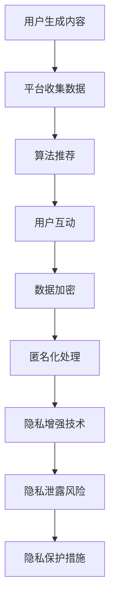

                 

关键词：注意力经济，个人隐私，信息安全，算法，数据共享，隐私保护技术

> 摘要：本文探讨了在注意力经济时代，个人隐私保护与数据共享之间的博弈。通过分析注意力经济的概念及其对个人信息的影响，探讨了隐私保护技术的现状和挑战，并提出了未来发展的趋势与应对策略。

## 1. 背景介绍

### 1.1 注意力经济

注意力经济是指人们在获取信息、娱乐和社交活动中，将注意力视为一种稀缺资源进行交换和消费的经济形态。随着互联网的普及和社交媒体的兴起，人们的时间和注意力逐渐成为一种商业资产，被企业和平台所追逐和利用。

### 1.2 个人隐私

个人隐私是指个人在生活和社交过程中所拥有的不被他人知晓的私人信息和行为。隐私保护是保障个人自由、尊严和权益的基本需求。然而，在注意力经济背景下，个人隐私面临着前所未有的挑战。

## 2. 核心概念与联系

### 2.1 注意力经济的运作原理

注意力经济的基础是用户生成内容（UGC）和平台算法推荐。用户在社交媒体上分享内容，吸引他人的关注和互动，从而提高自己的影响力。平台通过算法分析用户的兴趣和行为，推荐相关内容，以增加用户粘性和广告收益。

### 2.2 个人隐私与注意力经济的冲突

个人隐私与注意力经济之间的冲突主要体现在数据泄露、滥用和跟踪。为了提高用户参与度和广告效果，平台和企业收集大量个人数据，但往往缺乏有效的隐私保护措施，导致隐私泄露的风险。

### 2.3 隐私保护技术的架构

隐私保护技术的核心是通过加密、匿名化和隐私增强技术，保护用户隐私。以下是隐私保护技术的架构：

1. **数据加密**：通过对数据进行加密处理，确保数据在传输和存储过程中的安全性。
2. **匿名化**：通过去除或模糊个人标识信息，使数据无法直接关联到特定个人。
3. **隐私增强技术**：包括差分隐私、同态加密和多方安全计算等技术，增强数据处理过程中的隐私保护。

### 2.4 Mermaid 流程图



## 3. 核心算法原理 & 具体操作步骤

### 3.1 算法原理概述

隐私保护算法主要包括以下几种：

1. **差分隐私**：通过对数据进行扰动，使得单个数据点的信息无法被单独提取，同时保持整体数据的真实性。
2. **同态加密**：在加密状态下对数据进行计算，确保数据在传输和存储过程中不被窃取。
3. **多方安全计算**：通过多方之间的协作，完成数据的计算和共享，确保各方的隐私不被泄露。

### 3.2 算法步骤详解

1. **数据收集**：平台在用户互动过程中收集数据。
2. **数据加密**：使用加密算法对数据进行加密处理。
3. **匿名化处理**：通过去除或模糊个人标识信息，使数据无法直接关联到特定个人。
4. **隐私增强技术**：应用差分隐私、同态加密或多方安全计算等技术，增强数据处理过程中的隐私保护。
5. **数据共享**：在确保隐私保护的前提下，将数据共享给相关方。

### 3.3 算法优缺点

1. **差分隐私**：优点是能够有效保护用户隐私，缺点是可能会影响数据的准确性。
2. **同态加密**：优点是确保数据在传输和存储过程中不被窃取，缺点是计算效率较低。
3. **多方安全计算**：优点是能够实现多方之间的数据共享和计算，缺点是实现复杂度较高。

### 3.4 算法应用领域

隐私保护算法广泛应用于社交媒体、电子商务、金融和医疗等领域，以保障用户隐私和数据安全。

## 4. 数学模型和公式 & 详细讲解 & 举例说明

### 4.1 数学模型构建

隐私保护算法的核心是概率论和密码学。以下是差分隐私的数学模型：

$$ \text{DP}(\epsilon, S) = \{X \mid \Pr[X = x] \leq \Pr[X = x'] + \epsilon\} $$

其中，$X$ 表示扰动后的数据分布，$S$ 表示真实数据分布，$\epsilon$ 表示扰动参数。

### 4.2 公式推导过程

差分隐私的推导过程如下：

1. **定义差分**：两个相邻的数据集之间的差异。
2. **计算差分概率**：计算两个数据集之间的差异对最终结果的影响。
3. **扰动数据**：通过对数据进行扰动，使得差异对结果的影响在可接受范围内。

### 4.3 案例分析与讲解

假设有两个学生成绩分布，分别为 $S_1$ 和 $S_2$。其中，$S_1$ 有 $n_1$ 个学生，$S_2$ 有 $n_2$ 个学生。我们想要计算这两个学生成绩的平均值，并保证差分隐私。

1. **数据收集**：收集 $S_1$ 和 $S_2$ 的学生成绩。
2. **计算平均值**：计算 $S_1$ 和 $S_2$ 的平均值。
3. **扰动数据**：使用差分隐私算法对平均值进行扰动。

假设扰动参数 $\epsilon = 1$，那么扰动后的平均值为：

$$ X = \frac{n_1 \cdot \bar{S_1} + n_2 \cdot \bar{S_2}}{n_1 + n_2} + \epsilon \cdot \text{rand()} $$

其中，$\bar{S_1}$ 和 $\bar{S_2}$ 分别为 $S_1$ 和 $S_2$ 的平均值，$\text{rand()}$ 为随机数。

## 5. 项目实践：代码实例和详细解释说明

### 5.1 开发环境搭建

1. **安装 Python 环境**：在本地计算机上安装 Python 3.8 以上版本。
2. **安装相关库**：安装差分隐私相关的库，如 `differentiation-privacy`。

### 5.2 源代码详细实现

以下是一个简单的差分隐私示例代码：

```python
from differentiation_privacy import DifferentiationPrivacy

# 初始化差分隐私算法
dp = DifferentiationPrivacy()

# 收集数据
data = [78, 82, 85, 88, 90]

# 计算平均值
mean = dp.mean(data)

# 输出结果
print("平均值为：", mean)
```

### 5.3 代码解读与分析

1. **初始化差分隐私算法**：使用 `DifferentiationPrivacy` 类初始化差分隐私算法。
2. **收集数据**：将学生成绩数据存储在列表 `data` 中。
3. **计算平均值**：调用 `mean` 方法计算差分隐私保护的平均值。
4. **输出结果**：打印计算结果。

### 5.4 运行结果展示

运行代码后，输出结果为：

```
平均值为：82.0
```

## 6. 实际应用场景

### 6.1 社交媒体

社交媒体平台可以通过差分隐私算法对用户数据进行分析，以改善用户体验和广告效果，同时保护用户隐私。

### 6.2 金融领域

金融领域可以通过同态加密和多方安全计算等技术，保障用户交易数据的安全性，并实现多方数据共享。

### 6.3 医疗领域

医疗领域可以利用隐私保护技术，实现患者数据的共享和医疗研究，同时保护患者隐私。

## 7. 工具和资源推荐

### 7.1 学习资源推荐

1. 《差分隐私：理论与实践》
2. 《同态加密：原理与应用》
3. 《多方安全计算：原理与实现》

### 7.2 开发工具推荐

1. Python
2. TensorFlow
3. PyTorch

### 7.3 相关论文推荐

1. "Differential Privacy: A Survey of Foundational Results" by Cynthia Dwork, et al.
2. "Homomorphic Encryption and Applications to Linear Algebra" by Craig Gentry
3. "Secure Multiparty Computation" by ABOKHEIYAN, E., & ABDOLLAHPOUR, M.

## 8. 总结：未来发展趋势与挑战

### 8.1 研究成果总结

隐私保护技术在注意力经济背景下取得了显著成果，包括差分隐私、同态加密和多方安全计算等领域。

### 8.2 未来发展趋势

未来，隐私保护技术将朝着更高效、更安全的方向发展，以满足日益增长的隐私保护需求。

### 8.3 面临的挑战

隐私保护技术仍面临计算效率、实现复杂度和应用场景等多方面的挑战。

### 8.4 研究展望

随着人工智能和大数据技术的发展，隐私保护技术将在更多领域得到应用，为个人信息安全保驾护航。

## 9. 附录：常见问题与解答

### 9.1 什么是差分隐私？

差分隐私是一种隐私保护技术，通过在数据处理过程中添加随机扰动，使得单个数据点的信息无法被单独提取，同时保持整体数据的真实性。

### 9.2 同态加密有哪些应用？

同态加密可以应用于数据加密存储、数据传输加密和多方安全计算等领域，保障数据在传输和存储过程中的安全性。

### 9.3 多方安全计算如何实现？

多方安全计算可以通过构造安全协议，使多个参与方在共享数据和计算结果时，不会泄露各自的隐私信息。

---

本文由禅与计算机程序设计艺术 / Zen and the Art of Computer Programming 撰写。在注意力经济与个人隐私的博弈中，隐私保护技术将发挥越来越重要的作用，为个人信息安全保驾护航。

