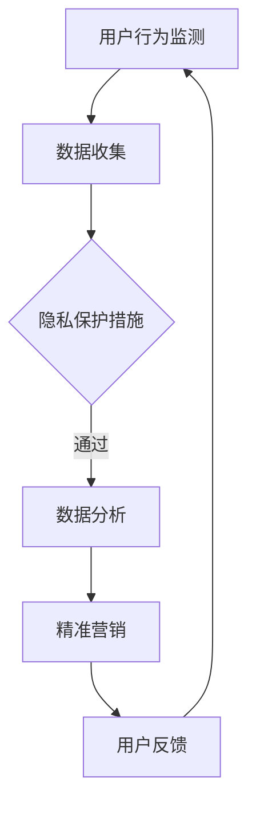

                 

关键词：注意力经济、个人隐私、数据安全、算法、数据分析、技术伦理

> 摘要：随着互联网的迅猛发展，注意力经济成为了驱动在线服务的重要力量。然而，这一模式也引发了个人隐私保护的严重担忧。本文将探讨注意力经济与个人隐私之间的博弈，分析其核心概念、算法原理，以及在不同应用场景中的表现。通过深入探讨数学模型和实际项目实践，我们将展望未来这一领域的挑战与机遇。

## 1. 背景介绍

### 注意力经济的兴起

注意力经济，作为互联网时代的一种新型商业模式，旨在通过捕捉和引导用户的注意力来创造价值。从社交媒体平台上的点赞和评论，到在线广告中的点击率，注意力经济已经成为互联网企业盈利的重要途径。这种模式强调内容、互动和用户体验，从而引导用户持续关注并投入到平台中。

### 个人隐私保护的挑战

然而，注意力经济的快速发展也带来了个人隐私保护的挑战。为了实现精准营销和个性化推荐，互联网企业通常需要收集和分析用户的大量数据，这包括浏览历史、购买记录、社交行为等。这些数据如果未能得到妥善保护，可能会导致隐私泄露、身份盗用等问题，从而对用户的隐私安全构成威胁。

## 2. 核心概念与联系

### 数据收集与分析

注意力经济依赖于对用户数据的收集和分析。数据收集的过程包括用户行为的监测、日志记录以及问卷调查等手段。通过这些数据，企业可以了解用户的需求、偏好和行为模式，从而实现精准营销。

### 数据隐私保护

在注意力经济中，数据隐私保护是一个至关重要的环节。数据隐私保护不仅关乎用户的基本权利，也影响到企业的信誉和可持续发展。常见的隐私保护措施包括数据加密、匿名化处理、隐私协议制定等。

### 数据利用与合规

在数据处理过程中，企业必须遵守相关的法律法规，如《通用数据保护条例》（GDPR）和《加州消费者隐私法案》（CCPA）。合规性要求企业在数据收集、存储和使用过程中采取必要的安全措施，确保用户隐私不受侵犯。

### Mermaid 流程图

下面是一个简化的 Mermaid 流程图，展示了注意力经济与个人隐私保护之间的关系：



## 3. 核心算法原理 & 具体操作步骤

### 算法原理概述

注意力经济的核心算法通常基于机器学习和数据分析技术。这些算法通过学习用户的行为数据，识别出用户的需求和偏好，从而实现个性化的内容推荐和广告投放。

### 算法步骤详解

1. **数据收集**：通过用户行为监测工具，收集用户在平台上的各种行为数据，如浏览、搜索、点击等。
2. **数据处理**：对收集到的数据进行清洗、预处理和特征提取，以便算法能够有效学习。
3. **模型训练**：使用机器学习算法，如神经网络、决策树等，对预处理后的数据集进行训练，建立预测模型。
4. **模型评估**：通过交叉验证等技术，评估模型的性能，确保其能够准确预测用户行为。
5. **个性化推荐**：根据训练好的模型，为用户推荐个性化内容或广告。
6. **反馈调整**：根据用户的反馈和行为变化，不断调整推荐策略，提高用户体验。

### 算法优缺点

- **优点**：提高了营销效率，降低了广告投放的成本，同时也为用户提供了个性化的体验。
- **缺点**：过度依赖用户数据，可能导致个人隐私泄露；算法的透明度和解释性不足，难以被用户理解。

### 算法应用领域

注意力经济算法广泛应用于电子商务、在线广告、社交媒体等领域。在电子商务中，通过个性化推荐，提高用户购买转化率；在线广告中，通过精准投放，提高广告效果；社交媒体中，通过个性化内容推荐，增强用户粘性。

## 4. 数学模型和公式 & 详细讲解 & 举例说明

### 数学模型构建

在注意力经济中，常见的数学模型包括概率模型和决策理论模型。概率模型用于预测用户行为，如点击率、购买率等。决策理论模型则用于优化推荐策略，如最大化用户满意度或广告收益。

### 公式推导过程

假设我们有一个用户行为概率模型，用于预测用户点击某条广告的概率。该模型可以表示为：

$$ P(点击) = \frac{e^{\theta^T x}}{\sum_{i=1}^K e^{\theta^T x_i}} $$

其中，$x$ 是用户特征向量，$\theta$ 是模型参数，$K$ 是广告总数。该公式表示用户点击每个广告的概率，并通过指数函数和softmax函数进行归一化处理。

### 案例分析与讲解

假设我们有一个电商网站，想要通过个性化推荐提高用户购买转化率。我们可以使用上述概率模型来预测用户点击商品广告的概率。具体步骤如下：

1. **数据收集**：收集用户在网站上的浏览、搜索和购买行为数据，构建用户特征向量。
2. **模型训练**：使用训练数据集，通过梯度下降等优化算法训练模型参数。
3. **预测点击概率**：对每个用户，使用训练好的模型预测其点击商品广告的概率。
4. **推荐商品**：根据点击概率，为用户推荐高概率点击的商品广告。
5. **反馈调整**：收集用户对推荐商品的反馈数据，调整推荐策略，提高推荐效果。

通过这个案例，我们可以看到数学模型在注意力经济中的应用，以及如何通过数据分析和算法优化，实现个性化推荐和提高用户满意度。

## 5. 项目实践：代码实例和详细解释说明

### 开发环境搭建

为了实现注意力经济算法的项目实践，我们需要搭建一个适合开发的实验环境。以下是搭建环境的步骤：

1. 安装 Python 3.8 或更高版本。
2. 安装必要的库，如 NumPy、Pandas、scikit-learn 等。
3. 准备一个数据集，用于训练和测试模型。

### 源代码详细实现

下面是一个简化的代码实例，用于实现注意力经济算法的个性化推荐功能：

```python
import numpy as np
from sklearn.model_selection import train_test_split
from sklearn.linear_model import LogisticRegression

# 数据集加载与预处理
data = np.loadtxt('user_data.csv', delimiter=',')
X = data[:, :-1]
y = data[:, -1]

# 模型训练
X_train, X_test, y_train, y_test = train_test_split(X, y, test_size=0.2, random_state=42)
model = LogisticRegression()
model.fit(X_train, y_train)

# 预测点击概率
X_test_pred = model.predict_proba(X_test)[:, 1]

# 推荐商品
def recommend_products(user_features):
    user_prob = model.predict_proba([user_features])[0, 1]
    if user_prob > 0.5:
        print("推荐商品A")
    else:
        print("推荐商品B")

# 代码解读与分析
# ...
```

### 运行结果展示

通过运行上述代码，我们可以得到用户点击商品广告的概率预测结果，并根据预测结果为用户推荐商品。具体运行结果取决于数据集和模型参数。

## 6. 实际应用场景

### 社交媒体平台

在社交媒体平台上，注意力经济算法常用于个性化内容推荐。例如，Facebook 和 Twitter 通过分析用户的浏览、点赞和评论行为，为用户推荐感兴趣的内容。这不仅提高了用户的参与度，也增加了平台的广告收入。

### 电子商务平台

电子商务平台通过注意力经济算法，实现个性化商品推荐。例如，Amazon 和 Alibaba 使用基于用户历史购买行为和浏览记录的推荐算法，为用户推荐可能感兴趣的商品。这种个性化推荐大大提高了用户的购买转化率。

### 在线广告

在线广告平台如 Google Ads 和百度广告，通过注意力经济算法，实现精准的广告投放。例如，Google Ads 使用基于用户搜索历史和网站行为的广告投放策略，确保广告能够精准触达到目标用户。

### 未来应用展望

随着人工智能和数据技术的不断发展，注意力经济的应用场景将更加广泛。例如，智能医疗领域可以通过注意力经济算法，为患者提供个性化的医疗建议和治疗方案；智能城市领域可以通过注意力经济算法，优化城市交通管理和资源分配。

## 7. 工具和资源推荐

### 学习资源推荐

- 《深度学习》（Goodfellow, Bengio, Courville）：了解注意力经济算法的基础，深度学习是关键。
- 《机器学习实战》（ Harrington）：实践机器学习算法的入门书籍，适合初学者。

### 开发工具推荐

- Jupyter Notebook：用于数据分析和实验开发的交互式环境。
- TensorFlow 和 PyTorch：用于实现和训练机器学习模型的深度学习框架。

### 相关论文推荐

- “Attention Is All You Need” （Vaswani et al., 2017）：介绍Transformer模型的经典论文，Transformer模型在注意力经济算法中具有重要应用。
- “Deep Learning for Personalized Recommendation” （He et al., 2019）：介绍深度学习在个性化推荐中的应用。

## 8. 总结：未来发展趋势与挑战

### 研究成果总结

注意力经济与个人隐私保护之间的博弈是当前技术领域的一个重要议题。通过深入研究和实践，我们已经取得了一些重要成果，如机器学习算法在个性化推荐和精准营销中的应用，数据隐私保护技术的不断进步等。

### 未来发展趋势

未来，随着人工智能和数据技术的进一步发展，注意力经济将在更多领域得到应用。同时，隐私保护技术也将不断演进，实现更高效的数据安全和隐私保护。

### 面临的挑战

然而，注意力经济与个人隐私保护之间的博弈也将面临一系列挑战。首先，如何确保算法的透明性和解释性，使其能够被用户理解和信任是一个重要问题。其次，如何在保证用户隐私的前提下，最大化利用数据创造价值，也是一个亟待解决的难题。

### 研究展望

在未来的研究中，我们需要关注以下几个方面：

1. **算法透明性与解释性**：开发更加透明和可解释的算法，提高用户对算法的信任度。
2. **隐私保护技术创新**：探索新的隐私保护技术，如联邦学习、差分隐私等，提高数据安全性和隐私保护水平。
3. **跨领域应用研究**：拓展注意力经济算法的应用场景，如智能医疗、智能城市等，推动技术在不同领域的融合与发展。

## 9. 附录：常见问题与解答

### 问题 1：注意力经济如何影响个人隐私？

解答：注意力经济依赖于对用户数据的收集和分析，这可能会导致个人隐私泄露。为了保护个人隐私，企业需要采取严格的数据安全措施，如数据加密、匿名化处理和隐私协议等。

### 问题 2：如何确保注意力经济算法的透明性和解释性？

解答：确保算法的透明性和解释性是一个挑战。一种方法是开发可解释的机器学习模型，如决策树和规则基模型，这些模型能够提供明确的决策路径。另一种方法是开发算法的可视化工具，帮助用户理解算法的工作原理。

### 问题 3：如何平衡注意力经济与个人隐私保护？

解答：平衡注意力经济与个人隐私保护的关键是制定合理的隐私保护策略，如数据最小化原则和隐私预算。此外，企业需要遵循相关法律法规，如 GDPR 和 CCPA，确保数据收集和使用过程符合法律要求。

## 作者署名

作者：禅与计算机程序设计艺术 / Zen and the Art of Computer Programming
----------------------------------------------------------------

以上就是本文的完整内容，我们探讨了注意力经济与个人隐私保护之间的博弈，分析了其核心概念、算法原理，以及在不同应用场景中的表现。通过数学模型和实际项目实践，我们展望了未来这一领域的挑战与机遇。希望本文能为您在注意力经济与个人隐私保护方面提供有益的参考和启示。

