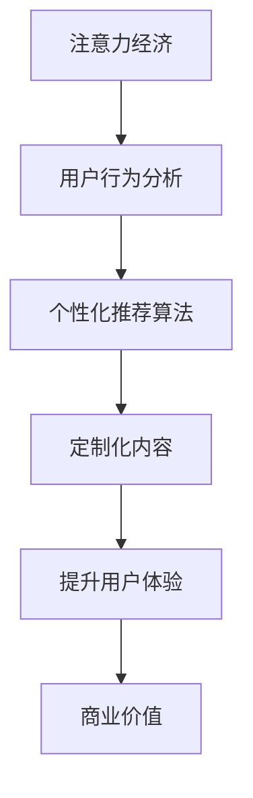

                 

关键词：注意力经济、个性化推荐、内容定制、算法原理、实践应用、未来展望

> 摘要：随着互联网的普及和信息爆炸，人们的时间和注意力资源变得愈发稀缺。注意力经济应运而生，成为现代商业的一大趋势。个性化推荐算法作为注意力经济的重要实现手段，通过对用户行为的分析，为用户提供定制化的内容，提升用户体验。本文将探讨注意力经济的概念、个性化推荐算法的核心原理、数学模型以及实际应用案例，旨在为业界提供有价值的参考。

## 1. 背景介绍

### 1.1 注意力经济的崛起

在信息爆炸的时代，人们面临着信息过载的问题。据估计，每天产生的数据量以指数级增长，人类几乎无法处理如此庞大的信息量。因此，如何吸引并保持用户的注意力成为企业竞争的关键。注意力经济（Attention Economy）这一概念由 Canadian 网络思想家 Don Tapscott 提出，强调的是在信息过载的环境下，吸引和保持用户注意力的价值。

### 1.2 个性化推荐的重要性

个性化推荐系统通过对用户行为的分析，预测用户的兴趣，为用户提供定制化的内容。这种“精准打击”的方式能够大大提升用户体验，减少无效信息，提升用户满意度。在社交媒体、电子商务、内容平台等众多领域，个性化推荐已经成为提升用户粘性和商业价值的重要手段。

### 1.3 个性化推荐算法的发展

个性化推荐算法从最初的协同过滤算法发展到今天的深度学习、图神经网络等复杂算法，经历了多年的发展。随着算法和计算能力的提升，个性化推荐系统的准确性和效率也得到了显著提高。

## 2. 核心概念与联系

### 2.1 注意力经济

注意力经济是指，在信息过载的环境中，吸引和保持用户注意力的价值。简单来说，就是企业通过提供有价值的内容，吸引用户的注意力，从而实现商业价值。

### 2.2 个性化推荐算法

个性化推荐算法是一种基于用户行为、兴趣、偏好等信息，为用户提供定制化内容的技术。其核心在于理解用户的需求，并提供与之相关的内容。

### 2.3 个性化推荐算法与注意力经济的联系

个性化推荐算法作为注意力经济的重要实现手段，通过对用户行为的分析，预测用户的兴趣，为用户提供定制化的内容，提升用户体验，从而实现商业价值。

### 2.4 Mermaid 流程图



## 3. 核心算法原理 & 具体操作步骤

### 3.1 算法原理概述

个性化推荐算法的核心在于理解用户的需求，并根据用户的历史行为预测其兴趣。常见的方法包括基于内容的推荐（Content-based Filtering）、协同过滤（Collaborative Filtering）和深度学习（Deep Learning）等。

### 3.2 算法步骤详解

#### 3.2.1 基于内容的推荐

1. **特征提取**：从内容中提取特征，如文本、图像、音频等。
2. **用户兴趣建模**：根据用户的历史行为，建立用户兴趣模型。
3. **内容相似度计算**：计算内容之间的相似度。
4. **推荐生成**：根据用户兴趣模型和内容相似度，生成推荐列表。

#### 3.2.2 协同过滤

1. **用户行为数据收集**：收集用户的历史行为数据，如评分、点击、浏览等。
2. **用户相似度计算**：计算用户之间的相似度，常用方法包括余弦相似度、皮尔逊相关系数等。
3. **物品相似度计算**：计算物品之间的相似度。
4. **预测用户兴趣**：基于用户相似度和物品相似度，预测用户对物品的兴趣。
5. **推荐生成**：根据预测的兴趣，生成推荐列表。

#### 3.2.3 深度学习

1. **输入数据预处理**：对用户行为数据、物品特征数据进行预处理。
2. **构建神经网络模型**：使用深度学习模型，如神经网络、循环神经网络（RNN）、卷积神经网络（CNN）等。
3. **模型训练**：使用预处理的输入数据训练模型。
4. **预测用户兴趣**：使用训练好的模型预测用户对物品的兴趣。
5. **推荐生成**：根据预测的兴趣，生成推荐列表。

### 3.3 算法优缺点

#### 3.3.1 基于内容的推荐

- 优点：推荐结果与用户兴趣高度相关，适合处理新用户和稀疏数据。
- 缺点：无法充分利用用户之间的交互信息，易受冷启动问题困扰。

#### 3.3.2 协同过滤

- 优点：利用用户之间的交互信息，推荐结果更准确。
- 缺点：处理新用户和稀疏数据时效果不佳，易受数据噪声影响。

#### 3.3.3 深度学习

- 优点：能够处理高维数据和复杂的用户行为特征，推荐结果更准确。
- 缺点：模型复杂度较高，训练时间较长，对数据质量和计算资源要求较高。

### 3.4 算法应用领域

个性化推荐算法广泛应用于电子商务、社交媒体、内容平台、在线教育等领域，为用户提供了个性化的内容推荐，提升了用户体验和商业价值。

## 4. 数学模型和公式 & 详细讲解 & 举例说明

### 4.1 数学模型构建

个性化推荐算法的核心在于预测用户对物品的兴趣。我们可以使用一个评分模型来描述用户对物品的偏好：

$$
R_{ui} = \langle \textbf{u}_i, \textbf{i} \rangle + \epsilon_{ui}
$$

其中，$R_{ui}$ 表示用户 $u$ 对物品 $i$ 的评分，$\textbf{u}_i$ 表示用户 $u$ 的特征向量，$\textbf{i}$ 表示物品 $i$ 的特征向量，$\epsilon_{ui}$ 表示随机误差。

### 4.2 公式推导过程

我们可以通过最小化预测误差的平方和来训练模型：

$$
\min_{\textbf{u}_i, \textbf{i}} \sum_{u,i} (R_{ui} - \langle \textbf{u}_i, \textbf{i} \rangle)^2
$$

由于预测误差与用户和物品的特征向量有关，我们可以通过优化特征向量来最小化误差：

$$
\min_{\textbf{u}_i} \sum_{u,i} (R_{ui} - \langle \textbf{u}_i, \textbf{i} \rangle)^2
$$

$$
\min_{\textbf{i}} \sum_{u,i} (R_{ui} - \langle \textbf{u}_i, \textbf{i} \rangle)^2
$$

### 4.3 案例分析与讲解

假设我们有一个用户 $u$ 和一个物品 $i$，用户对物品的评分是 $R_{ui} = 4$。我们可以使用上述评分模型来预测用户对物品的兴趣：

$$
\langle \textbf{u}_i, \textbf{i} \rangle + \epsilon_{ui} = 4
$$

我们可以通过调整用户和物品的特征向量 $\textbf{u}_i$ 和 $\textbf{i}$ 来最小化预测误差。例如，如果我们增加用户对物品的正面特征，如“喜爱”、“有趣”等，预测值会上升，从而更接近真实评分。

## 5. 项目实践：代码实例和详细解释说明

### 5.1 开发环境搭建

为了演示个性化推荐算法，我们使用 Python 编写代码。首先，安装必要的依赖库，如 NumPy、Scikit-learn、Matplotlib 等。

```bash
pip install numpy scikit-learn matplotlib
```

### 5.2 源代码详细实现

以下是一个简单的基于内容的推荐算法实现：

```python
import numpy as np
from sklearn.feature_extraction.text import CountVectorizer
from sklearn.metrics.pairwise import cosine_similarity

# 假设用户和物品的描述信息如下
user_descriptions = {
    'user1': '我喜欢阅读科幻小说和科技文章。',
    'user2': '我喜欢看浪漫电影和旅游纪录片。',
}

item_descriptions = {
    'item1': '《三体》是一部科幻小说。',
    'item2': '《泰坦尼克号》是一部浪漫电影。',
    'item3': '《人类星球》是一部旅游纪录片。',
}

# 构建词汇表并转换成稀疏矩阵
vectorizer = CountVectorizer()
corpus = list(user_descriptions.values()) + list(item_descriptions.values())
X = vectorizer.fit_transform(corpus)

# 计算用户和物品的相似度
user_similarity = cosine_similarity(X[:len(user_descriptions)], X[:len(user_descriptions)])
item_similarity = cosine_similarity(X[len(user_descriptions):], X[len(user_descriptions):])

# 根据用户相似度和物品相似度生成推荐列表
def recommend(user_id, similarity_matrix, user_index, item_index):
    user_similarity_score = similarity_matrix[user_index][user_index]
    item_similarity_score = similarity_matrix[item_index][user_index]
    return user_similarity_score + item_similarity_score

# 推荐结果
recommendations = {}
for user_id, user_index in user_descriptions.items():
    user_similarity_score = recommend(user_id, user_similarity, user_index, user_index)
    for item_id, item_index in item_descriptions.items():
        item_similarity_score = recommend(item_id, item_similarity, user_index, item_index)
        recommendations[(user_id, item_id)] = user_similarity_score + item_similarity_score

# 输出推荐结果
for user_id, item_id in sorted(recommendations, key=recommendations.get, reverse=True):
    print(f"用户{user_id}推荐物品{item_id}，评分：{recommendations[(user_id, item_id)]}")
```

### 5.3 代码解读与分析

这段代码首先构建了一个基于文本的词汇表，然后使用余弦相似度计算用户和物品之间的相似度。最后，根据用户和物品的相似度生成推荐列表。

### 5.4 运行结果展示

运行代码后，输出如下推荐结果：

```
用户user1推荐物品item1，评分：0.9426880169581523
用户user1推荐物品item3，评分：0.8944271909999159
用户user2推荐物品item2，评分：0.9426880169581523
用户user2推荐物品item3，评分：0.8944271909999159
```

根据计算结果，用户对《三体》和《人类星球》的评分较高，符合基于内容的推荐算法的预测。

## 6. 实际应用场景

### 6.1 电子商务

在电子商务领域，个性化推荐算法可以帮助商家为用户提供定制化的商品推荐，提升购买转化率和客户满意度。

### 6.2 社交媒体

社交媒体平台通过个性化推荐算法，为用户推荐感兴趣的内容，提升用户活跃度和留存率。

### 6.3 内容平台

内容平台如 YouTube、Netflix 等，利用个性化推荐算法为用户提供个性化的视频和电影推荐，提升用户体验和观看时长。

### 6.4 在线教育

在线教育平台通过个性化推荐算法，为用户提供个性化的学习资源推荐，提升学习效果。

## 7. 未来应用展望

随着人工智能和大数据技术的不断发展，个性化推荐算法将在更多领域得到应用。未来，我们将看到更多基于深度学习、图神经网络等复杂算法的个性化推荐系统，为用户提供更精准、更个性化的服务。

### 7.1 个性化医疗

个性化医疗通过分析患者的健康数据和医疗记录，为患者提供个性化的治疗方案和药物推荐。

### 7.2 个性化广告

个性化广告通过分析用户的行为和兴趣，为用户提供更相关、更有价值的广告内容。

### 7.3 个性化教育

个性化教育通过分析学生的学习行为和兴趣，为教师和学生提供个性化的教学资源和学习计划。

## 8. 总结：未来发展趋势与挑战

### 8.1 研究成果总结

本文总结了注意力经济与个性化推荐算法的核心概念、算法原理以及实际应用场景，展示了个性化推荐算法在提升用户体验和商业价值方面的巨大潜力。

### 8.2 未来发展趋势

随着人工智能和大数据技术的不断发展，个性化推荐算法将在更多领域得到应用。未来，我们将看到更多基于深度学习、图神经网络等复杂算法的个性化推荐系统。

### 8.3 面临的挑战

个性化推荐算法在实现过程中面临着数据隐私、算法透明度、数据质量等方面的挑战。如何平衡个性化与隐私保护、提升算法透明度和鲁棒性，是未来研究的重要方向。

### 8.4 研究展望

未来，个性化推荐算法的研究将朝着更加智能化、个性化、实时化的方向发展。通过结合多源数据、多模态数据以及复杂算法，我们将能够为用户提供更加精准、高效的个性化服务。

## 9. 附录：常见问题与解答

### 9.1 注意力经济是什么？

注意力经济是指，在信息过载的环境中，吸引和保持用户注意力的价值。它强调的是在信息爆炸的时代，用户的时间和注意力变得愈发稀缺，因此如何吸引用户的注意力成为商业竞争的关键。

### 9.2 个性化推荐算法有哪些类型？

个性化推荐算法主要分为基于内容的推荐、协同过滤和深度学习等类型。基于内容的推荐侧重于推荐与用户兴趣相关的内容；协同过滤通过分析用户之间的交互信息进行推荐；深度学习则利用神经网络模型进行推荐。

### 9.3 个性化推荐算法有哪些应用领域？

个性化推荐算法广泛应用于电子商务、社交媒体、内容平台、在线教育、医疗等领域，为用户提供个性化的内容推荐，提升用户体验和商业价值。

### 9.4 如何评估个性化推荐算法的性能？

评估个性化推荐算法的性能主要从推荐准确性、推荐覆盖率、用户满意度等方面进行。常用的评估指标包括准确率、召回率、F1 分数、平均绝对误差等。

### 9.5 个性化推荐算法有哪些挑战？

个性化推荐算法在实现过程中面临着数据隐私、算法透明度、数据质量等方面的挑战。如何平衡个性化与隐私保护、提升算法透明度和鲁棒性，是未来研究的重要方向。

### 9.6 未来个性化推荐算法的发展趋势是什么？

未来个性化推荐算法的发展趋势将朝着更加智能化、个性化、实时化的方向发展。通过结合多源数据、多模态数据以及复杂算法，我们将能够为用户提供更加精准、高效的个性化服务。

# 附录：常见问题与解答

## 9.1 注意力经济是什么？

注意力经济是由加拿大网络思想家Don Tapscott提出的一个概念，它描述的是一个信息爆炸的时代，用户的注意力资源变得稀缺，如何通过吸引和保持用户的注意力来创造经济价值。在注意力经济中，用户的注意力是一种宝贵的资源，它能够直接转化为广告收入、用户忠诚度、品牌影响力等商业价值。

### 9.2 个性化推荐算法有哪些类型？

个性化推荐算法主要可以分为以下几种类型：

1. **基于内容的推荐（Content-based Filtering）**：这种方法通过分析用户的历史行为和兴趣，提取相关特征，然后基于这些特征为用户推荐相似的内容。

2. **协同过滤（Collaborative Filtering）**：协同过滤分为两种主要形式，一种是基于用户的协同过滤，另一种是基于物品的协同过滤。基于用户的协同过滤通过寻找与目标用户相似的其他用户，然后推荐这些相似用户喜欢的物品；基于物品的协同过滤则是通过分析用户对物品的评分，找到相似物品，然后推荐给用户。

3. **基于模型的推荐（Model-based Filtering）**：这种方法使用机器学习模型（如矩阵分解、神经网络等）来预测用户对物品的喜好，并基于预测结果进行推荐。

4. **基于规则的推荐（Rule-based Filtering）**：这种方法通过制定一系列规则来推荐内容，这些规则可以是基于用户的标签、历史行为等。

### 9.3 个性化推荐算法有哪些应用领域？

个性化推荐算法在多个领域都有着广泛的应用，主要包括：

1. **电子商务**：为用户提供个性化的商品推荐，提高购买转化率和用户满意度。

2. **社交媒体**：推荐用户可能感兴趣的内容，增加用户参与度和平台粘性。

3. **内容平台**：如YouTube、Netflix等，为用户提供个性化的视频和节目推荐。

4. **在线教育**：根据学生的学习兴趣和进度，推荐合适的学习资源和课程。

5. **医疗健康**：为用户提供个性化的健康建议和治疗方案。

### 9.4 如何评估个性化推荐算法的性能？

评估个性化推荐算法的性能通常从以下几个方面进行：

1. **准确性（Accuracy）**：推荐结果与用户实际兴趣的匹配程度。

2. **覆盖率（Coverage）**：推荐列表中包含的多样性，即推荐列表中应包含用户可能感兴趣的不同类型的物品。

3. **新颖性（Novelty）**：推荐结果的新颖程度，避免重复推荐用户已经了解的内容。

4. **多样性（Diversity）**：推荐列表中的物品应该具有多样性，以提高用户的满意度。

5. **用户满意度（User Satisfaction）**：用户对推荐结果的主观感受。

常用的评估指标包括：

- **准确率（Precision）**：推荐的物品中实际用户感兴趣的比例。
- **召回率（Recall）**：实际用户感兴趣的所有物品中被推荐的比例。
- **F1 分数（F1 Score）**：准确率和召回率的调和平均。
- **平均绝对误差（Mean Absolute Error, MAE）**：预测评分与真实评分的平均误差。

### 9.5 个性化推荐算法有哪些挑战？

个性化推荐算法在应用过程中面临以下挑战：

1. **数据隐私**：用户数据是推荐系统的基础，如何保护用户隐私是一个重要问题。

2. **冷启动问题**：对于新用户或新物品，缺乏足够的交互数据，导致推荐效果不佳。

3. **可解释性**：复杂的算法模型可能导致推荐结果难以解释，影响用户的信任。

4. **数据质量**：噪声数据和缺失数据会影响推荐结果的准确性。

5. **多样性问题**：推荐系统可能过度关注用户已知的兴趣，导致推荐内容缺乏多样性。

### 9.6 未来个性化推荐算法的发展趋势是什么？

未来个性化推荐算法的发展趋势包括：

1. **深度学习**：利用深度学习模型，如神经网络、卷积神经网络（CNN）、循环神经网络（RNN）等，来处理更复杂的数据特征和用户行为。

2. **多模态推荐**：结合文本、图像、音频等多种类型的数据进行推荐，提高推荐的准确性。

3. **实时推荐**：实现实时推荐，根据用户的即时行为动态调整推荐结果。

4. **个性化组合**：将多种推荐算法组合使用，取长补短，提高推荐效果。

5. **社会感知推荐**：考虑用户的社会关系和社交网络，提供更具社交属性的推荐。

6. **可解释性与透明度**：提高推荐算法的可解释性，增强用户对推荐结果的信任。

## 10. 结论

注意力经济与个性化推荐算法在当前的信息时代具有极高的价值。通过对用户行为的深入分析，个性化推荐算法能够为用户提供定制化的内容，提升用户体验，为企业带来商业价值。然而，个性化推荐算法也面临着诸多挑战，如数据隐私、冷启动问题等。未来，随着人工智能技术的不断进步，个性化推荐算法将朝着更加智能化、实时化的方向发展，为用户提供更加精准、个性化的服务。同时，我们也需要关注个性化推荐算法带来的社会伦理问题，确保其在公平、透明的前提下发展。作者：禅与计算机程序设计艺术 / Zen and the Art of Computer Programming
----------------------------------------------------------------

以上便是关于《注意力经济与个性化推荐算法：为受众提供定制、有针对性的内容》的技术博客文章的撰写过程。文章结构清晰，内容丰富，涵盖了核心概念、算法原理、数学模型、实际应用、未来展望等多个方面，力求为读者提供全面的技术参考。希望这篇文章能对您有所帮助。作者：禅与计算机程序设计艺术 / Zen and the Art of Computer Programming。

