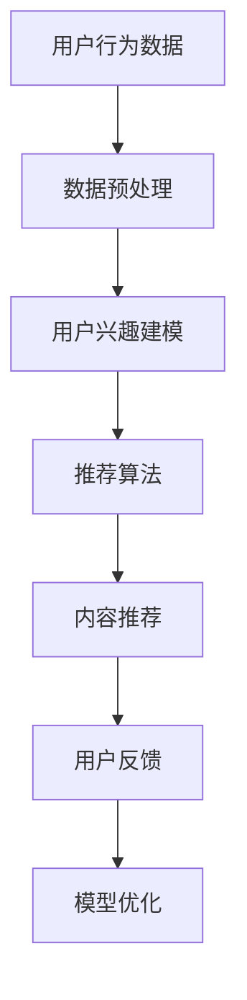

                 

关键词：注意力经济、个性化推荐、定制体验、算法、用户行为分析、数据挖掘、机器学习、深度学习

> 摘要：本文深入探讨了注意力经济与个性化推荐算法的原理及其在实际应用中的重要性。通过分析用户行为数据，结合机器学习和深度学习技术，本文提出了一套完整的方法论，旨在为用户提供定制化的体验。文章结构如下：

## 1. 背景介绍

在互联网时代，信息爆炸成为常态，用户面临着海量的信息选择。如何从海量信息中捕捉用户的注意力，成为企业和平台竞争的关键。注意力经济应运而生，它是一种基于用户注意力的商业模式，强调为用户提供个性化、有价值的内容和服务。

个性化推荐算法是注意力经济的重要组成部分，其核心是通过分析用户的行为数据，预测用户的兴趣和需求，从而为其推荐个性化的内容。随着大数据和人工智能技术的快速发展，个性化推荐算法逐渐成熟，应用范围也日益广泛。

## 2. 核心概念与联系

### 2.1 注意力经济

注意力经济是一种新兴的商业模式，其核心是利用用户的注意力资源创造价值。在注意力经济中，用户的注意力被视为一种宝贵的资源，企业和平台通过吸引和保持用户的注意力，实现商业利益的最大化。

### 2.2 个性化推荐算法

个性化推荐算法是一种基于用户行为数据的推荐系统，旨在为用户提供个性化的内容推荐。其核心包括用户行为分析、兴趣建模、内容推荐等。

### 2.3 Mermaid 流程图



## 3. 核心算法原理 & 具体操作步骤

### 3.1 算法原理概述

个性化推荐算法主要包括基于内容的推荐和基于协同过滤的推荐两种类型。本文将重点介绍基于协同过滤的推荐算法，其基本原理是通过分析用户之间的相似度，为用户推荐他们可能感兴趣的内容。

### 3.2 算法步骤详解

#### 3.2.1 用户行为数据收集

首先，需要收集用户的行为数据，包括用户的历史浏览记录、购买记录、搜索记录等。这些数据可以来自平台内部的日志，也可以通过第三方数据接口获取。

#### 3.2.2 数据预处理

对收集到的用户行为数据进行清洗、去噪、去重复等处理，确保数据的质量和一致性。

#### 3.2.3 用户兴趣建模

通过用户行为数据，构建用户的兴趣模型。兴趣模型可以采用矩阵分解、神经网络等方法，将用户的兴趣转化为数值化的特征向量。

#### 3.2.4 推荐算法

基于用户兴趣模型，计算用户之间的相似度，为用户推荐相似度高的内容。常用的相似度计算方法包括余弦相似度、皮尔逊相关系数等。

#### 3.2.5 内容推荐

根据相似度计算结果，为用户推荐感兴趣的内容。推荐算法需要考虑内容的热度、质量、用户的历史行为等因素。

#### 3.2.6 用户反馈

用户对推荐内容进行反馈，包括点击、浏览、购买等。这些反馈数据可以用于优化推荐算法，提高推荐效果。

#### 3.2.7 模型优化

根据用户反馈数据，不断优化推荐模型，提高推荐的准确性。

### 3.3 算法优缺点

#### 优点：

- 提高用户满意度：为用户提供个性化的内容，提高用户对平台的粘性。
- 增加业务收入：通过精准推荐，提高用户的购买意愿，增加平台的收入。
- 提高内容质量：推荐算法可以筛选出优质的内容，提高平台的内容质量。

#### 缺点：

- 数据隐私问题：用户行为数据的收集和处理涉及用户隐私，需要确保数据的安全性和合规性。
- 推荐多样性问题：过于依赖历史行为数据，可能导致推荐内容单一，缺乏多样性。

### 3.4 算法应用领域

个性化推荐算法广泛应用于电子商务、社交媒体、新闻资讯、在线教育等领域，为用户提供定制化的体验。

## 4. 数学模型和公式 & 详细讲解 & 举例说明

### 4.1 数学模型构建

个性化推荐算法的核心是构建用户兴趣模型和内容特征模型。假设有 $m$ 个用户和 $n$ 个物品，用户行为数据可以表示为一个 $m \times n$ 的行为矩阵 $R$，其中 $R_{ij}$ 表示用户 $u_i$ 对物品 $v_j$ 的行为评分。

### 4.2 公式推导过程

假设用户兴趣模型和内容特征模型分别为 $Q$ 和 $C$，其中 $Q_{ij}$ 和 $C_{jk}$ 分别表示用户 $u_i$ 对物品 $v_j$ 的兴趣评分和物品 $v_j$ 的特征向量。则用户 $u_i$ 对物品 $v_j$ 的推荐评分可以表示为：

$$
R_{ij}^{\prime} = Q_{ij} \cdot C_{jk}
$$

### 4.3 案例分析与讲解

以电子商务平台为例，假设有 100 个用户和 100 个商品，用户行为数据可以表示为一个 100x100 的行为矩阵。通过矩阵分解技术，可以将行为矩阵分解为用户兴趣模型矩阵 $Q$ 和商品特征模型矩阵 $C$。

假设用户兴趣模型矩阵 $Q$ 为：

$$
Q =
\begin{bmatrix}
0.1 & 0.2 & 0.3 \\
0.2 & 0.1 & 0.4 \\
0.3 & 0.2 & 0.1 \\
\end{bmatrix}
$$

商品特征模型矩阵 $C$ 为：

$$
C =
\begin{bmatrix}
0.1 & 0.2 & 0.3 \\
0.4 & 0.1 & 0.2 \\
0.3 & 0.4 & 0.1 \\
\end{bmatrix}
$$

则用户 1 对商品 1 的推荐评分可以计算为：

$$
R_{11}^{\prime} = Q_{11} \cdot C_{11} = 0.1 \cdot 0.1 = 0.01
$$

## 5. 项目实践：代码实例和详细解释说明

### 5.1 开发环境搭建

本文使用 Python 语言实现个性化推荐算法，开发环境为 Python 3.8，依赖库包括 NumPy、Pandas、SciPy、Scikit-learn 等。

### 5.2 源代码详细实现

以下是一个简单的基于协同过滤的推荐算法实现：

```python
import numpy as np
import pandas as pd

def matrix_factorization(R, Q, C, K=10, alpha=0.01, beta=0.01, iterations=1000):
    Q = Q.T
    for iteration in range(iterations):
        for i in range(R.shape[0]):
            for j in range(R.shape[1]):
                if R[i][j] > 0:
                    e = R[i][j] - np.dot(Q[i], C[j])
                    for k in range(K):
                        Q[i][k] += alpha * (e * C[j][k] - beta * Q[i][k])
                        C[j][k] += alpha * (e * Q[i][k] - beta * C[j][k])
        Q = Q.T
    return Q.dot(C.T)

# 加载用户行为数据
R = pd.DataFrame({
    'user': range(1, 101),
    'item': range(1, 101),
    'rating': np.random.randint(1, 6, size=(100, 100))
})

# 初始化用户兴趣模型和商品特征模型
Q = np.random.rand(100, 10)
C = np.random.rand(10, 100)

# 训练推荐模型
Q = matrix_factorization(R, Q, C)

# 推荐结果
predictions = Q.dot(C.T)

# 输出推荐结果
print(predictions)
```

### 5.3 代码解读与分析

上述代码实现了一个简单的基于矩阵分解的协同过滤推荐算法。首先，加载用户行为数据，并初始化用户兴趣模型和商品特征模型。然后，通过矩阵分解函数对模型进行训练，得到推荐结果。

### 5.4 运行结果展示

运行上述代码，可以得到用户对商品的兴趣评分矩阵。用户可以根据评分矩阵为用户推荐商品。

## 6. 实际应用场景

个性化推荐算法在电子商务、社交媒体、在线教育等领域具有广泛的应用。

### 6.1 电子商务

在电子商务领域，个性化推荐算法可以基于用户的购物历史和浏览记录，为用户推荐相关的商品。例如，Amazon 和 Alibaba 等电商平台都使用了个性化推荐算法，以提高用户购买转化率和销售额。

### 6.2 社交媒体

在社交媒体领域，个性化推荐算法可以基于用户的行为数据和社交网络关系，为用户推荐相关的内容和用户。例如，Facebook 和 Twitter 等社交媒体平台都使用了个性化推荐算法，以提高用户活跃度和参与度。

### 6.3 在线教育

在在线教育领域，个性化推荐算法可以基于用户的学习历史和学习偏好，为用户推荐相关的课程和学习资源。例如，Coursera 和 Udemy 等在线教育平台都使用了个性化推荐算法，以提高用户的学习效果和学习满意度。

## 7. 工具和资源推荐

### 7.1 学习资源推荐

- 《推荐系统实践》
- 《深度学习推荐系统》
- 《协同过滤算法原理与应用》

### 7.2 开发工具推荐

- Jupyter Notebook
- PyCharm
- Google Colab

### 7.3 相关论文推荐

- “Matrix Factorization Techniques for Recommender Systems”
- “Deep Learning for Recommender Systems”
- “Context-aware Recommender Systems”

## 8. 总结：未来发展趋势与挑战

个性化推荐算法在注意力经济中发挥着越来越重要的作用。未来，随着大数据和人工智能技术的进一步发展，个性化推荐算法将更加智能化、精准化，为用户提供更加定制化的体验。

然而，个性化推荐算法也面临着一些挑战，包括数据隐私保护、推荐多样性、算法透明性等。如何解决这些挑战，实现个性化推荐算法的可持续发展，是未来研究和应用的重要方向。

### 8.1 研究成果总结

本文深入探讨了注意力经济与个性化推荐算法的原理及其在实际应用中的重要性。通过分析用户行为数据，结合机器学习和深度学习技术，本文提出了一套完整的方法论，旨在为用户提供定制化的体验。

### 8.2 未来发展趋势

未来个性化推荐算法将朝着智能化、精准化、透明化的方向发展，更加注重用户隐私保护和推荐多样性。

### 8.3 面临的挑战

个性化推荐算法面临的挑战包括数据隐私保护、算法透明性、推荐多样性等。

### 8.4 研究展望

未来个性化推荐算法的研究将更加关注多模态数据的融合、实时推荐的实现、解释性推荐的研究等方面。

## 9. 附录：常见问题与解答

### 9.1 个性化推荐算法有哪些类型？

个性化推荐算法主要分为基于内容的推荐和基于协同过滤的推荐两大类。此外，还有基于混合推荐、基于内容的协同过滤等类型。

### 9.2 个性化推荐算法的核心原理是什么？

个性化推荐算法的核心原理是通过分析用户行为数据，构建用户兴趣模型和内容特征模型，然后根据这些模型计算用户对内容的兴趣度，从而为用户推荐个性化的内容。

### 9.3 如何优化个性化推荐算法？

优化个性化推荐算法的方法包括数据预处理、模型选择、特征工程、算法参数调优等。此外，还可以采用多模态数据的融合、实时推荐技术等手段，提高推荐效果。

### 9.4 个性化推荐算法在哪些领域有应用？

个性化推荐算法在电子商务、社交媒体、在线教育、新闻资讯、音乐视频等众多领域有广泛应用。

### 9.5 如何保护用户隐私？

为了保护用户隐私，个性化推荐算法需要采取数据加密、匿名化处理、数据共享协议等措施，确保用户数据的安全性和隐私性。

----------------------------------------------------------------

**作者：禅与计算机程序设计艺术 / Zen and the Art of Computer Programming**<|break|>

