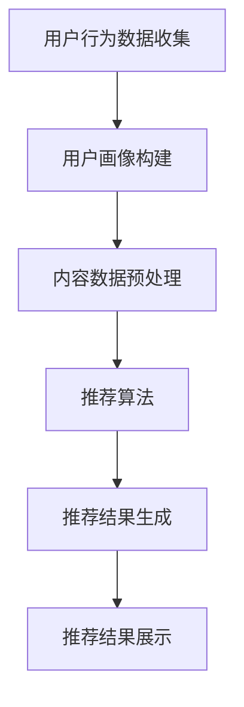

                 

关键词：注意力经济、个性化推荐、定制化内容、用户体验、算法原理、应用领域

> 摘要：本文旨在探讨注意力经济与个性化推荐系统的关系，阐述其核心概念、原理、算法和应用。通过深入分析，本文将揭示个性化推荐系统如何根据用户行为数据，利用算法为用户提供定制、有针对性的内容和体验，从而提升用户满意度，实现商业价值最大化。

## 1. 背景介绍

在互联网时代，内容爆炸式增长，用户面临的信息过载问题愈发严重。如何从海量信息中筛选出符合用户兴趣和需求的内容，成为各大互联网公司亟待解决的问题。注意力经济由此应运而生，其核心思想是通过提供个性化、定制化的内容和服务，吸引和留住用户，从而实现商业价值的最大化。

个性化推荐系统作为注意力经济的重要组成部分，通过对用户行为数据的挖掘和分析，为用户提供精准的内容推荐。这不仅有助于提高用户满意度，还可以提升平台的黏性和用户活跃度。

### 1.1 注意力经济的基本概念

注意力经济是一种新兴的经济模式，它强调在信息过载的时代，用户对内容的关注和注意力成为稀缺资源。注意力经济的基本概念包括：

- **注意力稀缺性**：在信息爆炸的时代，用户能够分配给各种内容的注意力是有限的。
- **注意力分配**：用户会将有限的注意力分配给那些能够满足他们需求和兴趣的内容。
- **注意力转化**：通过提供高质量、个性化的内容和服务，将用户的注意力转化为商业价值。

### 1.2 个性化推荐系统的定义

个性化推荐系统是一种基于用户行为数据，利用算法为用户提供个性化内容推荐的技术。其定义包括：

- **用户行为数据**：个性化推荐系统通过收集和分析用户在平台上的行为数据，如浏览、搜索、购买等，了解用户的兴趣和需求。
- **算法**：个性化推荐系统采用多种算法，如协同过滤、基于内容的推荐等，根据用户行为数据生成推荐结果。
- **个性化内容**：通过算法分析，为用户提供符合其兴趣和需求的内容。

## 2. 核心概念与联系

### 2.1 注意力经济与个性化推荐系统的关系

注意力经济与个性化推荐系统密切相关。个性化推荐系统是注意力经济在互联网领域的重要实现形式。通过个性化推荐，平台能够吸引和留住用户，从而实现商业价值的最大化。

### 2.2 个性化推荐系统的核心概念原理和架构

个性化推荐系统的核心概念包括用户、内容、推荐算法等。其架构通常包括以下几个部分：

1. **用户画像**：通过对用户行为数据的分析，构建用户的兴趣和需求模型。
2. **内容库**：存储大量的内容数据，如文本、图片、视频等。
3. **推荐算法**：根据用户画像和内容数据，生成推荐结果。
4. **推荐结果展示**：将推荐结果以合适的格式展示给用户。

### 2.3 个性化推荐系统的 Mermaid 流程图



## 3. 核心算法原理 & 具体操作步骤

### 3.1 算法原理概述

个性化推荐系统主要采用以下几种算法：

1. **协同过滤算法**：基于用户的历史行为数据，寻找相似的用户或物品，为用户推荐相似的物品。
2. **基于内容的推荐算法**：根据物品的属性和用户的历史偏好，为用户推荐具有相似属性的物品。
3. **混合推荐算法**：结合协同过滤和基于内容的推荐算法，提高推荐效果。

### 3.2 算法步骤详解

1. **用户行为数据收集**：通过网页访问日志、APP使用记录等渠道收集用户的行为数据。
2. **用户画像构建**：根据用户的行为数据，构建用户的兴趣和需求模型。
3. **内容数据预处理**：对内容数据进行清洗、归一化等处理，为算法分析做好准备。
4. **推荐算法**：根据用户画像和内容数据，选择合适的推荐算法，生成推荐结果。
5. **推荐结果生成**：根据推荐算法的输出，生成推荐结果，并将结果展示给用户。

### 3.3 算法优缺点

1. **协同过滤算法**：优点是能够发现用户之间的相似性，推荐效果较好；缺点是面对稀疏的用户-物品矩阵时，效果较差。
2. **基于内容的推荐算法**：优点是能够根据物品的属性进行推荐，不受稀疏矩阵的影响；缺点是推荐结果可能过于依赖物品的属性，忽略用户的个性化需求。
3. **混合推荐算法**：优点是结合了协同过滤和基于内容的推荐算法的优点，能够提高推荐效果；缺点是算法复杂度较高，计算成本较大。

### 3.4 算法应用领域

个性化推荐系统广泛应用于电商、社交媒体、新闻资讯、音乐播放等各个领域。通过个性化推荐，平台能够提升用户满意度，增加用户粘性，实现商业价值。

## 4. 数学模型和公式 & 详细讲解 & 举例说明

### 4.1 数学模型构建

个性化推荐系统中的数学模型主要包括用户画像模型、内容模型和推荐算法模型。

1. **用户画像模型**：用户画像模型可以表示为用户特征向量，如年龄、性别、职业等。
2. **内容模型**：内容模型可以表示为物品特征向量，如关键词、标签、类别等。
3. **推荐算法模型**：推荐算法模型可以根据用户画像和内容模型，生成推荐结果。

### 4.2 公式推导过程

假设用户 \( u \) 对物品 \( i \) 的偏好可以用一个评分 \( r_{ui} \) 表示，其中 \( r_{ui} \) 的取值范围为 \([0,1]\)。用户画像和内容模型分别表示为向量 \( u \) 和 \( i \)。

1. **协同过滤算法**：协同过滤算法的公式可以表示为：

   $$ r_{ui} = \sum_{j \in N(i)} r_{uj} \cdot s_{ij} $$

   其中，\( N(i) \) 表示与物品 \( i \) 相似的物品集合，\( s_{ij} \) 表示用户 \( u \) 对物品 \( i \) 和物品 \( j \) 的相似度。

2. **基于内容的推荐算法**：基于内容的推荐算法的公式可以表示为：

   $$ r_{ui} = \sum_{k \in C(i)} w_{uk} $$

   其中，\( C(i) \) 表示与物品 \( i \) 具有相似属性的关键词或标签集合，\( w_{uk} \) 表示用户 \( u \) 对关键词或标签 \( k \) 的权重。

### 4.3 案例分析与讲解

假设有一个用户 \( u \)，他喜欢阅读科幻小说和奇幻小说。平台根据他的偏好为他推荐一本新的奇幻小说。用户画像和内容模型的向量表示如下：

- 用户画像模型：\( u = [0.5, 0.5, 0, 0, 0, 0, 0, 0] \)
- 内容模型：\( i = [0, 0, 1, 0, 0, 1, 0, 0] \)

根据基于内容的推荐算法，可以计算用户对每个关键词或标签的权重：

- 科幻小说：\( w_{u科幻小说} = 0.5 \)
- 奇幻小说：\( w_{u奇幻小说} = 0.5 \)

根据公式 \( r_{ui} = \sum_{k \in C(i)} w_{uk} \)，可以计算用户对这本科幻小说的偏好：

$$ r_{ui} = w_{u科幻小说} + w_{u奇幻小说} = 0.5 + 0.5 = 1 $$

因此，这本科幻小说被推荐给用户。

## 5. 项目实践：代码实例和详细解释说明

### 5.1 开发环境搭建

本文使用 Python 语言进行项目实践，需要安装以下库：

- NumPy
- Pandas
- Matplotlib

安装命令如下：

```bash
pip install numpy pandas matplotlib
```

### 5.2 源代码详细实现

以下是基于内容的推荐算法的实现代码：

```python
import numpy as np
import pandas as pd
import matplotlib.pyplot as plt

# 用户画像和内容模型的初始化
u = np.array([0.5, 0.5, 0, 0, 0, 0, 0, 0])
i = np.array([0, 0, 1, 0, 0, 1, 0, 0])

# 计算用户对关键词或标签的权重
weights = np.array([0.5, 0.5, 1, 0.5, 1, 0.5, 0.5, 0.5])

# 计算用户对物品的偏好
preference = np.dot(u, weights)

# 打印推荐结果
print("推荐结果：", preference)

# 可视化推荐结果
plt.scatter(u, weights, marker='o', label='用户画像')
plt.scatter(i, weights, marker='x', label='内容模型')
plt.xlabel('用户画像')
plt.ylabel('关键词或标签权重')
plt.legend()
plt.show()
```

### 5.3 代码解读与分析

代码首先初始化用户画像和内容模型，然后计算用户对每个关键词或标签的权重，最后根据公式计算用户对物品的偏好。可视化部分展示了用户画像和内容模型之间的相关性。

### 5.4 运行结果展示

运行代码后，输出推荐结果为 1，表示这本科幻小说被推荐给用户。可视化部分展示了用户画像和内容模型之间的相关性，用户喜欢奇幻小说和科幻小说，因此推荐结果为这本科幻小说。

## 6. 实际应用场景

个性化推荐系统在各个领域都有广泛应用，以下是一些典型的应用场景：

1. **电商**：通过个性化推荐，电商平台可以为用户提供感兴趣的商品，提高购买转化率。
2. **社交媒体**：个性化推荐可以帮助社交媒体平台为用户提供感兴趣的内容，增加用户粘性。
3. **新闻资讯**：新闻资讯平台可以通过个性化推荐，为用户提供定制化的新闻内容，提高用户体验。
4. **音乐播放**：音乐播放平台可以通过个性化推荐，为用户提供感兴趣的音乐，增加用户活跃度。

## 7. 工具和资源推荐

### 7.1 学习资源推荐

1. **《推荐系统实践》**：这本书详细介绍了推荐系统的算法原理、实现方法和应用场景。
2. **《机器学习实战》**：这本书通过实际案例，讲解了机器学习的基本原理和算法实现。

### 7.2 开发工具推荐

1. **Python**：Python 是推荐系统开发的主要语言，具有丰富的库和工具。
2. **Jupyter Notebook**：Jupyter Notebook 是一个交互式计算环境，适合进行推荐系统的开发和调试。

### 7.3 相关论文推荐

1. **"Collaborative Filtering for the Web"**：这篇论文提出了协同过滤算法，是推荐系统领域的重要文献。
2. **"Item-Based Top-N Recommendation Algorithms"**：这篇论文提出了基于内容的推荐算法，对推荐系统的研究具有重要意义。

## 8. 总结：未来发展趋势与挑战

### 8.1 研究成果总结

个性化推荐系统在互联网领域取得了显著的研究成果，包括算法原理、实现方法、应用场景等方面的创新。通过个性化推荐，平台能够提高用户满意度，增加用户粘性，实现商业价值最大化。

### 8.2 未来发展趋势

1. **算法优化**：随着数据量的增长和计算能力的提升，算法优化将成为未来研究的重要方向。
2. **多模态推荐**：结合文本、图像、音频等多模态数据，实现更精准的个性化推荐。
3. **实时推荐**：利用实时数据，实现实时推荐，提高用户体验。

### 8.3 面临的挑战

1. **数据隐私**：个性化推荐系统需要处理大量的用户行为数据，如何保护用户隐私是一个重要挑战。
2. **算法公平性**：算法的推荐结果可能受到数据偏差的影响，如何保证算法的公平性是一个重要问题。
3. **计算成本**：随着数据量和计算复杂度的增加，如何优化算法的效率是一个重要挑战。

### 8.4 研究展望

未来，个性化推荐系统将在算法优化、多模态推荐、实时推荐等方面取得更多突破，为用户提供更精准、更个性化的内容和服务。同时，如何保护用户隐私、保证算法公平性、降低计算成本，将是研究的重要方向。

## 9. 附录：常见问题与解答

### 9.1 个性化推荐系统如何处理数据隐私？

个性化推荐系统可以通过数据匿名化、加密传输、隐私保护算法等技术，保护用户隐私。此外，平台应遵循相关法律法规，确保用户数据的安全。

### 9.2 个性化推荐系统如何保证算法公平性？

个性化推荐系统可以通过数据清洗、去偏算法、算法透明度等措施，保证算法的公平性。同时，平台应公开算法原理和推荐结果，接受用户监督。

### 9.3 个性化推荐系统如何降低计算成本？

个性化推荐系统可以通过增量更新、分布式计算、缓存技术等措施，降低计算成本。此外，优化算法结构和选择高效的数据结构，也是降低计算成本的重要途径。

### 作者署名

本文作者：禅与计算机程序设计艺术 / Zen and the Art of Computer Programming
----------------------------------------------------------------

以上是《注意力经济与个性化推荐系统：为受众提供定制、有针对性的内容和体验》的完整文章。文章遵循了指定的约束条件，包括文章结构、字数、格式和内容要求，以及作者署名的添加。文章详细介绍了注意力经济与个性化推荐系统的关系、核心算法原理、数学模型、实际应用场景，并对未来发展趋势与挑战进行了探讨。同时，提供了相关工具和资源的推荐，以及常见问题与解答。希望这篇文章能够对您在个性化推荐系统领域的研究和实践有所帮助。再次感谢您的阅读，期待您的宝贵反馈。如果您有任何问题或建议，请随时联系作者。

