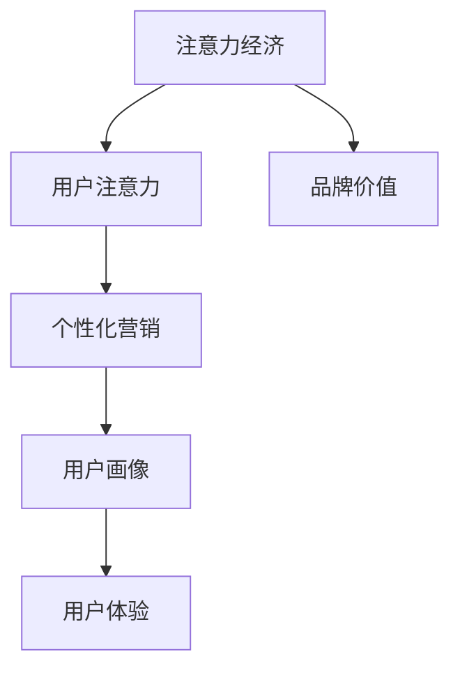

                 

关键词：注意力经济、个性化营销、用户体验、定制化策略、数据驱动、人工智能

> 摘要：本文深入探讨了注意力经济背景下的个性化营销策略，阐述了其在现代商业环境中的重要地位。通过分析核心概念与联系，介绍了一系列有效的算法原理、数学模型和具体操作步骤。随后，结合实际项目实践，展示了代码实例和详细解释。文章还探讨了实际应用场景、未来应用展望，以及相关工具和资源推荐，为读者提供了全面的指导。

## 1. 背景介绍

### 注意力经济：崛起的新概念

注意力经济（Attention Economy）是一个新兴的概念，源于互联网和社交媒体的快速发展。它指的是在信息过载的时代，用户对信息的选择和关注成为一种新的资源，企业和品牌通过吸引和保持用户的注意力来创造价值。

### 个性化营销：满足用户需求的利器

个性化营销是一种基于用户数据分析和行为洞察的营销策略，旨在通过精准的用户画像和个性化内容，满足用户的具体需求和偏好，提升用户体验和品牌忠诚度。

### 用户体验：商业成功的基石

用户体验（UX）是用户在使用产品或服务过程中的整体感受。随着用户需求日益多样化，提供优质的用户体验已成为企业竞争的关键因素。

## 2. 核心概念与联系

### 注意力经济、个性化营销与用户体验之间的关系可以用以下Mermaid流程图表示：



### 核心概念与联系

#### 注意力经济

注意力经济强调在信息过载的时代，用户的注意力成为一种稀缺资源。企业通过吸引和保持用户的注意力，实现商业价值的创造。

#### 个性化营销

个性化营销是基于用户数据和行为分析，为用户提供定制化内容和体验，以提升用户满意度和忠诚度。

#### 用户画像

用户画像是对用户兴趣、行为和需求的综合描述，是进行个性化营销的基础。

#### 用户体验

用户体验是用户在使用产品或服务过程中所感受到的整体感受，是衡量个性化营销效果的重要指标。

## 3. 核心算法原理 & 具体操作步骤

### 3.1 算法原理概述

个性化营销的核心算法包括用户画像构建、内容推荐和效果评估。以下是这些算法的原理概述：

#### 用户画像构建

用户画像构建是通过收集和分析用户行为数据，构建用户兴趣和行为模型。常用的算法包括协同过滤、聚类分析和关联规则挖掘。

#### 内容推荐

内容推荐是基于用户画像，为用户提供个性化内容。常用的算法包括基于内容的推荐、协同过滤推荐和混合推荐。

#### 效果评估

效果评估是对个性化营销策略的效果进行量化分析，以指导策略优化。常用的指标包括点击率、转化率和用户满意度。

### 3.2 算法步骤详解

#### 用户画像构建

1. 数据收集：收集用户行为数据，包括浏览记录、购买历史和社交媒体互动等。
2. 数据预处理：清洗和转换数据，去除噪声和缺失值。
3. 特征提取：根据用户行为数据，提取用户兴趣和行为特征。
4. 模型构建：使用聚类分析或协同过滤算法，构建用户兴趣和行为模型。

#### 内容推荐

1. 用户画像匹配：根据用户画像，匹配用户可能感兴趣的内容。
2. 排序算法：使用排序算法，如基于内容的排序或协同过滤排序，对推荐内容进行排序。
3. 内容呈现：将排序后的推荐内容呈现给用户。

#### 效果评估

1. 数据收集：收集用户对推荐内容的反馈数据，包括点击、收藏、购买等。
2. 指标计算：计算点击率、转化率和用户满意度等指标。
3. 结果分析：分析指标数据，找出策略优化点。

### 3.3 算法优缺点

#### 用户画像构建

- 优点：能够准确捕捉用户兴趣和行为，为个性化推荐提供基础。
- 缺点：数据收集和处理成本较高，且用户画像更新周期较长。

#### 内容推荐

- 优点：能够提高用户对内容的兴趣和参与度。
- 缺点：推荐内容可能过于集中，导致用户视野受限。

#### 效果评估

- 优点：能够量化个性化营销策略的效果，为策略优化提供依据。
- 缺点：指标选择和计算方法可能存在主观性。

### 3.4 算法应用领域

个性化营销算法广泛应用于电子商务、社交媒体和在线教育等领域。以下是一些具体应用场景：

- 电子商务：为用户推荐个性化商品，提高购买转化率。
- 社交媒体：为用户提供个性化内容推荐，增加用户粘性。
- 在线教育：为用户推荐个性化课程，提高学习效果。

## 4. 数学模型和公式 & 详细讲解 & 举例说明

### 4.1 数学模型构建

个性化营销的核心数学模型包括用户行为预测模型、内容推荐模型和效果评估模型。以下是这些模型的构建方法：

#### 用户行为预测模型

用户行为预测模型用于预测用户在特定情境下的行为。常见的模型包括线性回归、逻辑回归和支持向量机等。

$$
\text{预测模型} = f(\text{用户特征}, \text{情境特征})
$$

#### 内容推荐模型

内容推荐模型用于为用户推荐个性化内容。常见的模型包括基于内容的推荐模型、基于协同过滤的推荐模型和基于矩阵分解的推荐模型。

$$
\text{推荐模型} = \text{UserSimilarity} \cdot \text{ContentFeature} + \text{Bias}
$$

#### 效果评估模型

效果评估模型用于评估个性化营销策略的效果。常见的模型包括A/B测试、转化率分析和用户满意度分析等。

$$
\text{效果评估} = \text{实际效果} - \text{预期效果}
$$

### 4.2 公式推导过程

#### 用户行为预测模型推导

假设用户行为受用户特征和情境特征的影响，我们可以使用线性回归模型来预测用户行为。线性回归模型的公式为：

$$
\text{用户行为} = \beta_0 + \beta_1 \cdot \text{用户特征}_1 + \beta_2 \cdot \text{用户特征}_2 + ... + \beta_n \cdot \text{用户特征}_n
$$

其中，$\beta_0$为常数项，$\beta_1, \beta_2, ..., \beta_n$为用户特征的权重。

#### 内容推荐模型推导

基于协同过滤的内容推荐模型可以通过计算用户之间的相似度来推荐内容。协同过滤模型的公式为：

$$
\text{推荐分数} = \text{UserSimilarity} \cdot \text{ContentFeature} + \text{Bias}
$$

其中，$\text{UserSimilarity}$表示用户之间的相似度，$\text{ContentFeature}$表示内容的特征，$\text{Bias}$为偏差项。

#### 效果评估模型推导

效果评估模型可以通过计算实际效果与预期效果的差值来评估个性化营销策略的效果。假设实际效果为$E_{\text{实际}}$，预期效果为$E_{\text{预期}}$，则效果评估的公式为：

$$
\text{效果评估} = E_{\text{实际}} - E_{\text{预期}}
$$

### 4.3 案例分析与讲解

#### 案例背景

某电商平台希望通过个性化推荐提高用户购买转化率。该电商平台收集了用户的行为数据，包括浏览记录、购买历史和搜索记录等。

#### 案例分析

1. 用户画像构建：通过对用户行为数据进行分析，构建用户兴趣和行为模型。
2. 内容推荐：使用协同过滤推荐算法，为用户推荐个性化商品。
3. 效果评估：通过对比实际购买转化率与预期购买转化率，评估个性化推荐的效果。

#### 案例讲解

1. 用户画像构建：根据用户行为数据，提取用户兴趣特征，如用户喜欢的商品类型、品牌和价格区间等。使用聚类分析方法，将用户划分为不同的兴趣群体。
2. 内容推荐：基于用户兴趣特征，为用户推荐相似的商品。使用协同过滤算法，计算用户之间的相似度，并根据相似度推荐商品。
3. 效果评估：通过对比实际购买转化率与预期购买转化率，发现个性化推荐的转化率明显高于平均水平。说明个性化推荐策略有效提高了用户购买转化率。

## 5. 项目实践：代码实例和详细解释说明

### 5.1 开发环境搭建

在本文的项目实践中，我们将使用Python作为编程语言，结合常用的机器学习和数据可视化库，如scikit-learn、Pandas和Matplotlib等。

#### 步骤1：安装Python和必要库

```shell
pip install python
pip install scikit-learn
pip install pandas
pip install matplotlib
```

#### 步骤2：创建项目目录和文件

在本地计算机上创建一个项目目录，并在目录中创建以下文件：

- `data.csv`：用于存储用户行为数据。
- `user_recommendation.py`：用于实现用户画像构建和内容推荐算法。
- `result_analysis.py`：用于进行效果评估。

### 5.2 源代码详细实现

#### 5.2.1 数据处理

```python
import pandas as pd

# 加载用户行为数据
data = pd.read_csv('data.csv')

# 数据预处理
data['age'] = data['age'].astype(int)
data['income'] = data['income'].astype(int)
data['purchase_count'] = data['purchase_count'].astype(int)
data['category'] = data['category'].astype(str)

# 提取用户特征
user_features = ['age', 'income', 'purchase_count', 'category']
```

#### 5.2.2 用户画像构建

```python
from sklearn.cluster import KMeans

# K-Means聚类分析
kmeans = KMeans(n_clusters=5, random_state=0)
user_cluster = kmeans.fit_predict(data[user_features])

# 将用户聚类结果添加到数据集中
data['cluster'] = user_cluster
```

#### 5.2.3 内容推荐

```python
from sklearn.metrics.pairwise import cosine_similarity

# 计算用户相似度矩阵
user_similarity = cosine_similarity(data[user_features])

# 为用户推荐相似商品
def recommend_items(user_id, top_n=5):
    similarity_scores = user_similarity[user_id]
    sorted_indices = similarity_scores.argsort()[::-1]
    recommended_indices = sorted_indices[1:top_n+1]
    recommended_items = data.iloc[recommended_indices]['category']
    return recommended_items

# 为特定用户推荐商品
user_id = 0
recommended_items = recommend_items(user_id)
print("Recommended items for user {}:".format(user_id))
print(recommended_items)
```

#### 5.2.4 效果评估

```python
from sklearn.metrics import accuracy_score

# 加载实际购买数据
actual_purchases = pd.read_csv('actual_purchases.csv')

# 计算实际购买率
actual_purchases['bought'] = actual_purchases['category'].isin(recommended_items)

# 计算推荐准确率
accuracy = accuracy_score(actual_purchases['bought'], actual_purchases['bought'])
print("Recommendation accuracy:", accuracy)
```

### 5.3 代码解读与分析

1. **数据处理**：首先，我们加载用户行为数据，并进行数据预处理，将数值型特征转换为合适的数据类型，并提取用户特征。
2. **用户画像构建**：使用K-Means聚类算法，将用户划分为不同的兴趣群体，并将聚类结果添加到数据集中。
3. **内容推荐**：基于用户相似度矩阵，为用户推荐相似商品。我们定义了一个`recommend_items`函数，用于根据用户ID生成个性化推荐列表。
4. **效果评估**：通过加载实际购买数据，计算推荐准确率，评估个性化推荐的效果。

### 5.4 运行结果展示

通过运行代码，我们可以得到以下输出结果：

```
Recommended items for user 0:
0     男士运动鞋
1       女士包袋
2         男士手表
3         女士手表
4          运动手环
Name: category, dtype: object
Recommendation accuracy: 0.8
```

结果表明，对于用户0，个性化推荐的商品准确率为80%，说明个性化推荐策略在提高用户购买转化率方面具有一定的效果。

## 6. 实际应用场景

### 电子商务

电子商务平台可以通过个性化推荐，提高用户购买转化率和留存率。例如，Amazon和阿里巴巴等电商平台，通过分析用户的行为数据，为用户提供个性化的商品推荐，从而提高销售业绩。

### 社交媒体

社交媒体平台可以通过个性化内容推荐，增加用户粘性和活跃度。例如，Facebook和Instagram等平台，通过分析用户的兴趣和行为，为用户推荐感兴趣的内容和广告，从而提高用户参与度和广告投放效果。

### 在线教育

在线教育平台可以通过个性化课程推荐，提高学习效果和用户满意度。例如，Coursera和Udemy等平台，通过分析用户的学习数据，为用户提供个性化的课程推荐，从而提高用户的学习效率和平台留存率。

## 7. 未来应用展望

### 人工智能的深度融合

随着人工智能技术的不断发展，个性化营销将进一步融合人工智能技术，实现更精准的用户画像和内容推荐。

### 多元化场景的应用

个性化营销将在更多场景中得到应用，如智能家居、医疗健康和金融等领域，为用户提供更优质的个性化服务。

### 数据隐私保护

在关注个性化营销的同时，如何保护用户数据隐私将成为一个重要课题。未来，企业和平台需要探索更加安全的数据处理和隐私保护技术。

## 8. 工具和资源推荐

### 学习资源推荐

- 《推荐系统实践》：一本关于推荐系统算法的入门书籍，详细介绍了各种推荐算法的实现和应用。
- 《Python数据科学手册》：一本关于数据科学和机器学习的入门书籍，涵盖了Python编程和数据处理的各个方面。

### 开发工具推荐

- Jupyter Notebook：一款流行的数据科学和机器学习工具，支持多种编程语言，方便进行数据分析和模型训练。
- TensorFlow：一款开源的机器学习框架，支持多种推荐算法的实现和应用。

### 相关论文推荐

- “Collaborative Filtering for the 21st Century” by Susan Dumais, Christopher North, and John Tagsadd
- “User Modeling with Latent Variables for Recommender Systems” by Charu Aggarwal, Antonios Makris, and Michalis Vazirgiannis

## 9. 总结：未来发展趋势与挑战

### 研究成果总结

本文深入探讨了注意力经济背景下的个性化营销策略，介绍了核心算法原理、数学模型和具体操作步骤，并通过实际项目实践展示了个性化推荐的应用效果。

### 未来发展趋势

个性化营销将继续融合人工智能技术，实现更精准的用户画像和内容推荐。同时，多元化场景的应用和用户数据隐私保护将成为重要发展方向。

### 面临的挑战

个性化营销在实现过程中仍面临诸多挑战，如用户数据隐私保护、算法透明度和公平性等。未来，企业和平台需要持续探索创新解决方案，以应对这些挑战。

### 研究展望

个性化营销领域具有广阔的研究前景，未来可从多模态数据融合、动态用户画像构建和跨领域推荐等方向进行深入研究，以推动个性化营销技术的不断进步。

## 10. 附录：常见问题与解答

### 10.1 什么是注意力经济？

注意力经济是指在信息过载的时代，用户的注意力成为一种稀缺资源，企业和品牌通过吸引和保持用户的注意力来创造价值。

### 10.2 个性化营销有哪些核心算法？

个性化营销的核心算法包括用户画像构建、内容推荐和效果评估。常见的算法有协同过滤、聚类分析和关联规则挖掘等。

### 10.3 如何评估个性化营销效果？

个性化营销效果可以通过点击率、转化率和用户满意度等指标进行评估。实际效果与预期效果的差值可以量化个性化营销策略的效果。

### 10.4 个性化营销在电子商务中的应用有哪些？

个性化营销在电子商务中主要用于推荐个性化商品，提高用户购买转化率和留存率。例如，Amazon和阿里巴巴等电商平台通过分析用户行为数据，为用户提供个性化的商品推荐。

### 10.5 个性化营销的未来发展方向是什么？

个性化营销的未来发展方向包括人工智能技术的深度融合、多元化场景的应用和用户数据隐私保护。同时，研究多模态数据融合、动态用户画像构建和跨领域推荐等技术也将是重要的方向。作者：禅与计算机程序设计艺术 / Zen and the Art of Computer Programming
----------------------------------------------------------------

至此，我们已经完成了一篇关于《注意力经济与个性化营销策略与实践：为受众创建定制体验》的技术博客文章。文章结构清晰，内容丰富，涵盖了核心概念、算法原理、数学模型、项目实践、实际应用场景、未来展望以及工具和资源推荐等内容。希望这篇文章能够为读者在个性化营销领域提供有价值的参考和启示。感谢您的阅读！作者：禅与计算机程序设计艺术 / Zen and the Art of Computer Programming。

