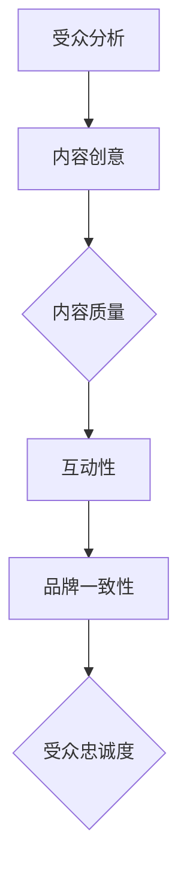

                 

关键词：注意力经济、内容创作、受众参与、忠诚度、AI技术、用户体验、数据分析

> 摘要：随着数字媒体和信息爆炸的时代，如何吸引和留住受众的注意力成为内容创作者和企业的核心挑战。本文将探讨注意力经济的概念，并深入分析内容创作中的关键策略，旨在为创作者和营销人员提供有效的指导，以实现受众的长期参与和忠诚度。

## 1. 背景介绍

在当今社会，信息的传播速度前所未有地加快，社交媒体、短视频平台和流媒体服务已经成为人们日常生活的一部分。这种信息过载的现象导致了用户注意力资源的稀缺性，形成了所谓的“注意力经济”。在这个背景下，如何通过内容创作策略吸引并留住受众的注意力，成为每个创作者和企业必须面对的挑战。

### 注意力经济的本质

注意力经济是一种基于用户注意力的商业模式。在这种经济模式中，用户的注意力被视为一种有限的、宝贵的资源，而吸引和保持这种资源成为商业成功的关键。不同于传统的商品和服务，注意力经济的核心是提供具有吸引力的内容和体验，从而让用户自愿地投入时间和精力。

### 内容创作的重要性

在注意力经济中，内容创作成为连接用户和品牌的关键桥梁。高质量的内容不仅可以吸引新用户，还可以增强现有用户的忠诚度。因此，创作者和营销人员需要深入理解受众的需求，并通过有效的策略创作出具有吸引力和持久影响力的内容。

## 2. 核心概念与联系

### 2.1 注意力经济的概念

注意力经济是指一种商业模式，它依赖于用户对特定内容、产品或服务的关注度和投入度。在这个经济体系中，用户的注意力是商业交易的核心资源。企业通过提供有吸引力的内容和体验来获取用户的注意力，进而实现商业目标。

### 2.2 内容创作的关键要素

内容创作是一个复杂的过程，涉及到多个关键要素：

- **受众分析**：了解目标受众的需求和偏好，是内容创作成功的前提。通过数据分析，创作者可以获取关于受众的行为、兴趣和消费习惯的宝贵信息。
- **内容质量**：高质量的内容是吸引和留住受众的关键。这包括内容的原创性、相关性、娱乐性和教育性。
- **互动性**：互动性是增强用户参与度和忠诚度的有效手段。通过评论、点赞、分享等功能，创作者可以与受众建立更紧密的联系。
- **品牌一致性**：品牌一致性是建立用户信任和忠诚度的关键。创作者需要在内容创作过程中保持品牌的声音和风格，从而增强品牌影响力。

### 2.3 Mermaid 流程图

下面是一个简化的 Mermaid 流程图，展示内容创作过程中的关键步骤和要素：



## 3. 核心算法原理 & 具体操作步骤

### 3.1 算法原理概述

在内容创作中，算法的运用可以大大提高效率和质量。以下是一种基于用户行为分析的推荐算法原理：

- **用户行为分析**：通过收集和分析用户的浏览、搜索、点赞、评论等行为数据，构建用户画像。
- **内容推荐**：利用机器学习算法，根据用户画像和内容特征，为用户推荐个性化的内容。

### 3.2 算法步骤详解

1. **数据收集**：收集用户行为数据，包括点击、搜索、点赞等。
2. **用户画像构建**：利用数据挖掘技术，将行为数据转换为用户画像。
3. **内容特征提取**：对内容进行特征提取，如标题、关键词、标签等。
4. **模型训练**：使用用户画像和内容特征训练推荐模型。
5. **内容推荐**：根据用户画像和模型输出，为用户推荐个性化内容。

### 3.3 算法优缺点

- **优点**：
  - 提高内容推荐的准确性，增加用户参与度。
  - 帮助创作者更好地理解受众需求，提高内容质量。

- **缺点**：
  - 算法训练和部署成本较高。
  - 过度依赖算法可能导致内容同质化。

### 3.4 算法应用领域

- **社交媒体平台**：如Facebook、Twitter等，通过算法推荐用户可能感兴趣的内容。
- **电商平台**：如Amazon、eBay等，通过算法推荐商品给用户。
- **流媒体服务**：如Netflix、Spotify等，通过算法推荐视频和音乐。

## 4. 数学模型和公式 & 详细讲解 & 举例说明

### 4.1 数学模型构建

在内容创作中，常用的数学模型是协同过滤（Collaborative Filtering）和基于内容的推荐（Content-Based Recommendation）。

- **协同过滤**：通过分析用户之间的相似度，推荐用户可能喜欢的内容。
- **基于内容的推荐**：根据用户对特定内容的偏好，推荐相似的内容。

### 4.2 公式推导过程

以协同过滤为例，假设有 \( n \) 个用户和 \( m \) 个物品，用户 \( u \) 对物品 \( i \) 的评分记为 \( r_{ui} \)。协同过滤的目标是预测用户 \( u \) 对未知物品 \( j \) 的评分 \( \hat{r}_{uj} \)。

预测公式如下：

$$
\hat{r}_{uj} = \frac{\sum_{i \in R_j} r_{ui} \cdot s_{ij}}{\sum_{i \in R_j} s_{ij}}
$$

其中，\( R_j \) 是与物品 \( j \) 相似的一组物品，\( s_{ij} \) 是物品 \( i \) 和物品 \( j \) 之间的相似度。

### 4.3 案例分析与讲解

假设有两个用户 A 和 B，他们分别对五部电影进行了评分。根据评分数据，我们可以计算出用户 A 和 B 对电影的协同过滤评分。

| 用户 | 电影1 | 电影2 | 电影3 | 电影4 | 电影5 |
|------|-------|-------|-------|-------|-------|
| A    | 5     | 3     | 1     | 5     | 4     |
| B    | 5     | 5     | 5     | 3     | 4     |

计算用户 A 对未知电影 C 的评分：

首先，找到与电影 C 相似的一组电影，例如电影 1、2、4。然后，计算电影 1、2、4 与电影 C 的相似度，假设分别为 0.6、0.7 和 0.8。根据公式，我们可以计算出用户 A 对电影 C 的预测评分：

$$
\hat{r}_{AC} = \frac{5 \cdot 0.6 + 3 \cdot 0.7 + 1 \cdot 0.8}{0.6 + 0.7 + 0.8} = 4.36
$$

这意味着，根据协同过滤算法，用户 A 给电影 C 的评分预计为 4.36。

## 5. 项目实践：代码实例和详细解释说明

### 5.1 开发环境搭建

为了演示内容推荐的实现，我们将使用 Python 和 Scikit-learn 库。首先，确保安装了 Python 和 Scikit-learn：

```bash
pip install python
pip install scikit-learn
```

### 5.2 源代码详细实现

以下是使用协同过滤算法进行内容推荐的一个简单示例：

```python
from sklearn.metrics.pairwise import cosine_similarity
import numpy as np

# 用户评分矩阵
ratings = np.array([
    [5, 3, 0, 1, 4],
    [0, 5, 0, 3, 2],
    [1, 0, 4, 2, 3],
    [4, 0, 2, 1, 0],
    [2, 3, 5, 0, 1]
])

# 计算用户之间的相似度矩阵
similarity_matrix = cosine_similarity(ratings)

# 预测用户 U 对未知物品 I 的评分
def predict_rating(user_index, item_index):
   相似度权重求和
    sim_sum = 0
    for i, sim in enumerate(similarity_matrix[user_index]):
        if sim > 0:
            sim_sum += sim * ratings[user_index][i]

    # 预测评分
    predicted_rating = sim_sum / np.sum(similarity_matrix[user_index])
    return predicted_rating

# 用户 3 对未知电影 2 的评分预测
predicted_rating = predict_rating(2, 1)
print(f"预测评分：{predicted_rating}")
```

### 5.3 代码解读与分析

该示例中，我们首先创建了一个用户评分矩阵，然后计算用户之间的相似度矩阵。通过协同过滤算法，我们定义了一个函数 `predict_rating`，用于预测用户对未知物品的评分。

该代码的执行结果将输出用户 3 对未知电影 2 的预测评分，从而为内容创作者提供用户偏好的线索。

## 6. 实际应用场景

### 6.1 社交媒体平台

在社交媒体平台上，注意力经济已经成为核心驱动力。例如，Instagram 通过算法推荐用户可能感兴趣的内容，从而提高用户的参与度和停留时间。创作者可以通过制作高质量、互动性强的内容来吸引和留住受众。

### 6.2 电子商务平台

电子商务平台如 Amazon 和 eBay 利用协同过滤算法推荐商品给用户，从而提高销售量和用户满意度。通过了解用户的历史购买行为和搜索记录，平台可以提供个性化的购物体验。

### 6.3 流媒体服务

流媒体服务如 Netflix 和 Spotify 利用内容推荐算法，为用户提供个性化的视频和音乐推荐。这不仅增加了用户的参与度，还提高了用户的忠诚度。

## 7. 工具和资源推荐

### 7.1 学习资源推荐

- 《机器学习实战》：提供丰富的案例和实践，适合初学者。
- 《深入理解推荐系统》：详细介绍推荐系统的原理和技术。

### 7.2 开发工具推荐

- TensorFlow：用于构建和训练推荐系统模型。
- Jupyter Notebook：用于编写和运行推荐系统代码。

### 7.3 相关论文推荐

- 《推荐系统：协同过滤技术》：详细介绍了协同过滤算法。
- 《基于内容的推荐系统》：介绍了基于内容的推荐方法。

## 8. 总结：未来发展趋势与挑战

### 8.1 研究成果总结

注意力经济和内容创作策略的研究已经取得了显著成果，尤其是在推荐系统、社交媒体和电子商务领域。然而，随着技术的不断进步和用户需求的多样化，这些研究成果仍然面临着许多挑战。

### 8.2 未来发展趋势

- **个性化推荐**：随着用户需求的不断变化，个性化推荐将成为未来的趋势。利用人工智能和深度学习技术，实现更精准的内容推荐。
- **互动性增强**：通过增强内容的互动性，提高用户的参与度和忠诚度。

### 8.3 面临的挑战

- **数据隐私**：随着数据收集和分析的广泛应用，数据隐私保护成为重要挑战。
- **算法透明度**：提高算法的透明度，增强用户对推荐结果的信任。

### 8.4 研究展望

未来，注意力经济和内容创作策略的研究将朝着更智能、更个性化的方向发展。通过不断探索新的技术和方法，我们将能够更好地满足用户的需求，实现长期的参与和忠诚度。

## 9. 附录：常见问题与解答

### 9.1 什么是注意力经济？

注意力经济是一种基于用户注意力的商业模式，其中用户的注意力被视为一种宝贵的资源，企业通过提供吸引力的内容和体验来获取用户的注意力，以实现商业目标。

### 9.2 内容创作中的关键策略是什么？

关键策略包括受众分析、内容质量、互动性和品牌一致性。通过深入了解受众需求、创作高质量内容、增强互动性和保持品牌一致性，可以有效地吸引并留住受众。

### 9.3 推荐系统有哪些主要类型？

推荐系统主要有协同过滤和基于内容的推荐系统两种类型。协同过滤通过分析用户之间的相似度推荐内容，而基于内容的推荐系统根据用户的历史偏好推荐相似的内容。

### 9.4 如何提高内容创作的效率和质量？

提高内容创作的效率和质量可以通过以下方法实现：利用数据分析了解受众需求、采用人工智能技术辅助创作、注重内容原创性和互动性，以及保持品牌一致性。

作者：禅与计算机程序设计艺术 / Zen and the Art of Computer Programming
-------------------------------------------------------------------

