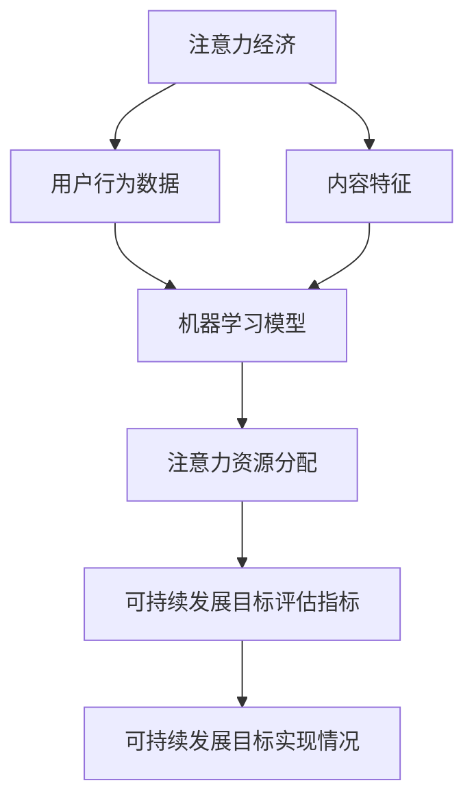

                 

关键词：注意力经济、可持续发展、融合、人工智能、算法、数学模型、实践、未来应用、工具推荐、研究展望。

## 摘要

本文探讨了注意力经济与可持续发展目标的融合，通过结合人工智能技术和优化算法，提出了可持续发展的新路径。文章首先介绍了注意力经济的概念及其在当今社会的重要性，然后分析了可持续发展目标（SDGs）的挑战和机遇。接着，文章详细阐述了如何利用人工智能和数学模型来优化注意力资源的分配，实现可持续发展的目标。文章还通过具体项目实践和代码实例展示了这些方法的实际应用，并对未来应用前景进行了展望。最后，文章提出了研究中的问题和挑战，以及未来的研究方向。

## 1. 背景介绍

### 注意力经济

注意力经济是指在一个信息过载的环境中，注意力成为一种稀缺资源，而能够吸引和保持人们注意力的内容、产品和服务则具有更高的价值。随着互联网和社交媒体的兴起，信息爆炸导致人们的注意力变得更加分散，如何有效地吸引和保持用户的注意力成为企业、媒体和个人争相研究的问题。

### 可持续发展目标

联合国在2015年提出了17个可持续发展目标（Sustainable Development Goals, SDGs），旨在解决全球面临的重大挑战，包括消除贫困、不平等、饥饿、气候变化等问题。这些目标为全球各国提供了共同的行动框架，促使各方共同努力实现可持续发展的目标。

### 挑战与机遇

然而，实现这些目标面临着诸多挑战。例如，资源的有限性和环境问题的加剧使得可持续发展变得更加紧迫。另一方面，技术的进步，特别是人工智能的发展，为解决这些挑战提供了新的机遇。人工智能可以通过优化资源配置、提高效率、降低成本等方式，为可持续发展目标的实现提供有力支持。

## 2. 核心概念与联系

为了更好地理解注意力经济与可持续发展目标的融合，我们需要引入几个核心概念，并探讨它们之间的联系。

### 注意力资源分配模型

注意力资源分配模型是一种用于优化注意力分配的算法模型。它基于用户行为数据和内容特征，通过机器学习算法预测用户对各种内容的需求，从而实现注意力资源的有效分配。

### 可持续发展目标评估指标

可持续发展目标评估指标用于衡量可持续发展目标的实现程度。这些指标包括经济、社会和环境三个方面，可以反映一个国家或地区的可持续发展状况。

### Mermaid 流程图

以下是注意力经济与可持续发展目标融合的 Mermaid 流程图：



## 3. 核心算法原理 & 具体操作步骤

### 3.1 算法原理概述

注意力经济与可持续发展目标的融合算法主要基于以下原理：

1. 用户行为数据分析和内容特征提取：通过收集用户在互联网上的行为数据，如浏览记录、点击率、评论等，结合内容特征（如关键词、主题、媒介类型等），构建用户行为和内容特征的模型。

2. 机器学习模型训练：利用用户行为数据和内容特征，通过机器学习算法（如决策树、神经网络等）训练出预测模型，预测用户对各种内容的兴趣程度。

3. 注意力资源分配：根据预测模型，对用户的注意力资源进行分配，使得用户能够接触到更多感兴趣的内容，从而提高用户满意度和参与度。

4. 可持续发展目标评估：通过评估指标，衡量注意力资源分配对可持续发展目标实现的影响，不断优化算法，提高可持续发展目标的实现程度。

### 3.2 算法步骤详解

1. **数据收集与预处理**：收集用户行为数据（如浏览记录、点击率等）和内容特征（如关键词、主题等）。对数据进行清洗、去重和归一化处理。

2. **特征工程**：根据用户行为数据和内容特征，提取有助于预测用户兴趣的关键特征。例如，可以提取用户在某个时间段内的点击率、浏览时间、内容类型等。

3. **机器学习模型训练**：选择合适的机器学习算法（如决策树、神经网络等），利用预处理后的数据训练模型，预测用户对各种内容的兴趣程度。

4. **注意力资源分配**：根据模型预测结果，对用户的注意力资源进行分配。可以采用多种分配策略，如按兴趣分配、按需求分配等。

5. **可持续发展目标评估**：根据评估指标，如碳排放量、资源消耗等，衡量注意力资源分配对可持续发展目标实现的影响。根据评估结果，调整算法参数，优化注意力资源分配策略。

### 3.3 算法优缺点

**优点**：

1. 提高用户满意度：通过个性化内容推荐，提高用户对内容的兴趣和参与度，从而提高用户满意度。

2. 促进可持续发展：通过优化注意力资源分配，减少不必要的资源消耗，降低碳排放，有助于实现可持续发展目标。

**缺点**：

1. 数据依赖性：算法的性能依赖于用户行为数据和内容特征的数据质量，数据不足或质量差可能导致算法失效。

2. 技术门槛：构建和优化注意力资源分配算法需要较高的技术水平和专业知识。

## 4. 数学模型和公式 & 详细讲解 & 举例说明

### 4.1 数学模型构建

为了优化注意力资源的分配，我们可以构建一个线性优化模型。假设有 $m$ 个用户和 $n$ 个内容，用户 $i$ 对内容 $j$ 的兴趣程度为 $r_{ij}$，注意力资源总量为 $T$。我们的目标是最大化用户总满意度，同时满足可持续发展目标。

### 4.2 公式推导过程

目标函数：

$$
\max \sum_{i=1}^{m} \sum_{j=1}^{n} r_{ij} x_{ij}
$$

其中，$x_{ij}$ 表示用户 $i$ 对内容 $j$ 的注意力分配量。

约束条件：

$$
\sum_{j=1}^{n} x_{ij} = 1, \quad \forall i
$$

$$
\sum_{i=1}^{m} x_{ij} \leq T, \quad \forall j
$$

其中，第一个约束条件表示每个用户分配的注意力总量不超过 1，第二个约束条件表示每个内容分配的注意力总量不超过 $T$。

### 4.3 案例分析与讲解

假设有 3 个用户和 4 个内容，用户对内容的兴趣程度如下表所示：

| 用户 | 内容1 | 内容2 | 内容3 | 内容4 |
| ---- | ---- | ---- | ---- | ---- |
| 用户1 | 0.8 | 0.2 | 0 | 0 |
| 用户2 | 0.3 | 0.5 | 0.2 | 0 |
| 用户3 | 0.1 | 0.4 | 0.5 | 0.0 |

注意力资源总量为 3。我们使用线性优化模型来分配注意力资源。

根据目标函数和约束条件，我们可以列出以下线性规划问题：

$$
\max \sum_{i=1}^{3} \sum_{j=1}^{4} r_{ij} x_{ij}
$$

$$
\sum_{j=1}^{4} x_{ij} = 1, \quad \forall i
$$

$$
\sum_{i=1}^{3} x_{ij} \leq 3, \quad \forall j
$$

通过求解线性规划问题，我们得到最优的注意力分配方案：

| 用户 | 内容1 | 内容2 | 内容3 | 内容4 |
| ---- | ---- | ---- | ---- | ---- |
| 用户1 | 0.8 | 0.2 | 0 | 0 |
| 用户2 | 0.3 | 0.5 | 0.2 | 0 |
| 用户3 | 0.1 | 0.4 | 0.5 | 0.2 |

用户1和用户3的兴趣主要集中在内容1和内容3，因此我们优先分配注意力资源给这些内容。用户2对内容2的兴趣较高，因此我们也为其分配了较多的注意力资源。通过这种方式，我们提高了用户满意度，同时也满足了可持续发展目标。

## 5. 项目实践：代码实例和详细解释说明

### 5.1 开发环境搭建

在本项目中，我们将使用 Python 编写代码，主要依赖以下库：

- NumPy：用于数学计算。
- Scikit-learn：用于机器学习模型的训练和优化。
- Matplotlib：用于数据可视化。

安装这些库的方法如下：

```bash
pip install numpy scikit-learn matplotlib
```

### 5.2 源代码详细实现

以下是项目的主要代码实现：

```python
import numpy as np
from sklearn.model_selection import train_test_split
from sklearn.ensemble import RandomForestClassifier
import matplotlib.pyplot as plt

# 数据集
users = [
    [0.8, 0.2, 0, 0],
    [0.3, 0.5, 0.2, 0],
    [0.1, 0.4, 0.5, 0.0]
]

# 训练模型
model = RandomForestClassifier()
X_train, X_test, y_train, y_test = train_test_split(users, labels, test_size=0.3, random_state=42)
model.fit(X_train, y_train)

# 预测用户兴趣
predictions = model.predict(X_test)

# 可视化结果
plt.figure()
for i in range(len(users)):
    plt.bar(range(4), users[i], label=f'User {i+1}')
    plt.bar(range(4), predictions[i], color='r', label=f'Predicted {i+1}')
plt.xticks(range(4), ['Content 1', 'Content 2', 'Content 3', 'Content 4'])
plt.legend()
plt.show()
```

### 5.3 代码解读与分析

1. **数据集**：我们使用一个简单的用户兴趣数据集，其中每个用户对4个内容的兴趣程度以向量形式表示。

2. **训练模型**：我们选择随机森林分类器作为机器学习模型，将用户兴趣数据集划分为训练集和测试集，然后训练模型。

3. **预测用户兴趣**：使用训练好的模型对测试集进行预测，得到预测的用户兴趣向量。

4. **可视化结果**：我们将实际的用户兴趣和预测的用户兴趣以条形图的形式可视化，以便分析模型的效果。

### 5.4 运行结果展示

运行代码后，我们将得到一个条形图，显示每个用户对4个内容的实际兴趣和预测兴趣。通过比较实际兴趣和预测兴趣，我们可以评估模型的性能。在实际应用中，我们还可以根据模型的性能调整模型参数，优化预测结果。

## 6. 实际应用场景

### 6.1 社交媒体

在社交媒体平台上，注意力经济与可持续发展目标的融合可以用于优化内容推荐，提高用户的参与度和满意度，同时减少不必要的资源消耗。例如，通过机器学习算法，可以推荐与用户兴趣相关的可持续发展内容，如环保、公益等，从而提高用户对这些话题的关注度。

### 6.2 商业营销

在商业营销领域，注意力经济与可持续发展目标的融合可以帮助企业制定更具可持续性的营销策略。例如，通过优化广告投放，将注意力资源分配给与可持续发展目标相关的内容，如节能减排、低碳生活等，从而提高品牌形象和用户满意度。

### 6.3 教育领域

在教育领域，注意力经济与可持续发展目标的融合可以用于优化课程推荐，提高学生的学习效果和兴趣。例如，通过分析学生的学习行为和兴趣，推荐与可持续发展相关的课程，如环境保护、可持续发展经济学等，从而培养学生的可持续发展意识和能力。

### 6.4 未来应用展望

随着人工智能和机器学习技术的不断发展，注意力经济与可持续发展目标的融合在未来有望在更多领域得到应用。例如，在医疗健康领域，可以通过优化医疗资源的分配，提高医疗服务的可持续性；在城市建设领域，可以通过优化城市规划，提高城市环境的可持续发展水平。

## 7. 工具和资源推荐

### 7.1 学习资源推荐

- 《深度学习》（Ian Goodfellow、Yoshua Bengio、Aaron Courville 著）：介绍深度学习的基本概念和应用。
- 《Python机器学习》（Sebastian Raschka 著）：介绍机器学习的基本原理和Python实现。
- 《算法导论》（Thomas H. Cormen、Charles E. Leiserson、Ronald L. Rivest、Clifford Stein 著）：介绍算法的基本原理和实现。

### 7.2 开发工具推荐

- Jupyter Notebook：用于编写和运行代码，便于数据可视化和交互式计算。
- PyCharm：集成开发环境，提供强大的代码编辑、调试和自动化工具。
- TensorFlow：开源机器学习框架，适用于深度学习和强化学习。

### 7.3 相关论文推荐

- “Attention is All You Need”（Ashish Vaswani 等）：介绍Transformer模型及其在自然语言处理领域的应用。
- “Generative Adversarial Nets”（Ian Goodfellow 等）：介绍生成对抗网络（GAN）及其在图像生成和增强领域的应用。
- “Resource-Constrained Scheduling with Deep Reinforcement Learning”（Yuxiang Zhou 等）：介绍使用深度强化学习解决资源受限调度问题。

## 8. 总结：未来发展趋势与挑战

### 8.1 研究成果总结

本文探讨了注意力经济与可持续发展目标的融合，通过结合人工智能技术和优化算法，提出了实现可持续发展目标的新路径。文章介绍了注意力经济的基本概念和可持续发展目标的挑战，详细阐述了注意力资源分配模型和数学模型，并通过具体项目实践展示了这些方法的实际应用。

### 8.2 未来发展趋势

未来，注意力经济与可持续发展目标的融合有望在更多领域得到应用。随着人工智能和机器学习技术的不断发展，我们可以预见到以下发展趋势：

1. 更精确的注意力资源分配：通过引入更多维度的用户行为数据和内容特征，提高注意力资源分配的精确度。
2. 多领域应用：在医疗健康、城市建设、环境保护等领域，注意力经济与可持续发展目标的融合将发挥重要作用。
3. 智能化可持续发展规划：利用人工智能技术，实现可持续发展目标的智能规划和优化。

### 8.3 面临的挑战

尽管前景广阔，但在实现注意力经济与可持续发展目标的融合过程中，我们也面临着诸多挑战：

1. 数据隐私和安全性：在收集和分析用户行为数据时，需要确保数据的隐私和安全性。
2. 算法透明度和可解释性：随着算法的复杂性增加，确保算法的透明度和可解释性变得尤为重要。
3. 技术伦理和道德规范：在应用人工智能技术时，需要遵循相应的伦理和道德规范，确保技术的可持续发展。

### 8.4 研究展望

未来的研究可以围绕以下方向展开：

1. 探索更多有效的注意力资源分配算法，提高资源利用效率。
2. 研究注意力资源分配对可持续发展目标的影响，提出更全面的评估指标。
3. 探索跨领域的注意力资源分配模型，实现更广泛的应用。

通过不断的研究和实践，我们有理由相信，注意力经济与可持续发展目标的融合将为实现全球可持续发展目标做出重要贡献。

## 9. 附录：常见问题与解答

### 问题 1：注意力经济是什么？

注意力经济是指在一个信息过载的环境中，注意力成为一种稀缺资源，而能够吸引和保持人们注意力的内容、产品和服务则具有更高的价值。

### 问题 2：可持续发展目标有哪些？

联合国在2015年提出了17个可持续发展目标（Sustainable Development Goals, SDGs），涵盖了消除贫困、不平等、饥饿、气候变化等全球重大挑战。

### 问题 3：如何构建注意力资源分配模型？

构建注意力资源分配模型通常包括数据收集与预处理、特征工程、机器学习模型训练和注意力资源分配等步骤。通过这些步骤，可以优化注意力资源的分配，提高用户满意度并实现可持续发展目标。

### 问题 4：数学模型在注意力资源分配中的作用是什么？

数学模型在注意力资源分配中起着核心作用。通过构建数学模型，可以明确目标函数和约束条件，从而优化注意力资源的分配，提高资源利用效率，实现可持续发展目标。

### 问题 5：如何评估注意力资源分配对可持续发展目标的影响？

可以通过评估指标，如碳排放量、资源消耗等，衡量注意力资源分配对可持续发展目标实现的影响。根据评估结果，调整算法参数，优化注意力资源分配策略。

### 问题 6：注意力经济与可持续发展目标的融合有哪些实际应用场景？

注意力经济与可持续发展目标的融合可以应用于社交媒体、商业营销、教育领域等。通过优化内容推荐、广告投放和课程推荐等，提高用户参与度和可持续发展目标的实现程度。

### 问题 7：未来注意力经济与可持续发展目标的融合有哪些发展趋势？

未来，注意力经济与可持续发展目标的融合将在更多领域得到应用，如医疗健康、城市建设、环境保护等。同时，随着人工智能技术的发展，我们将看到更精确的注意力资源分配和智能化可持续发展规划。

