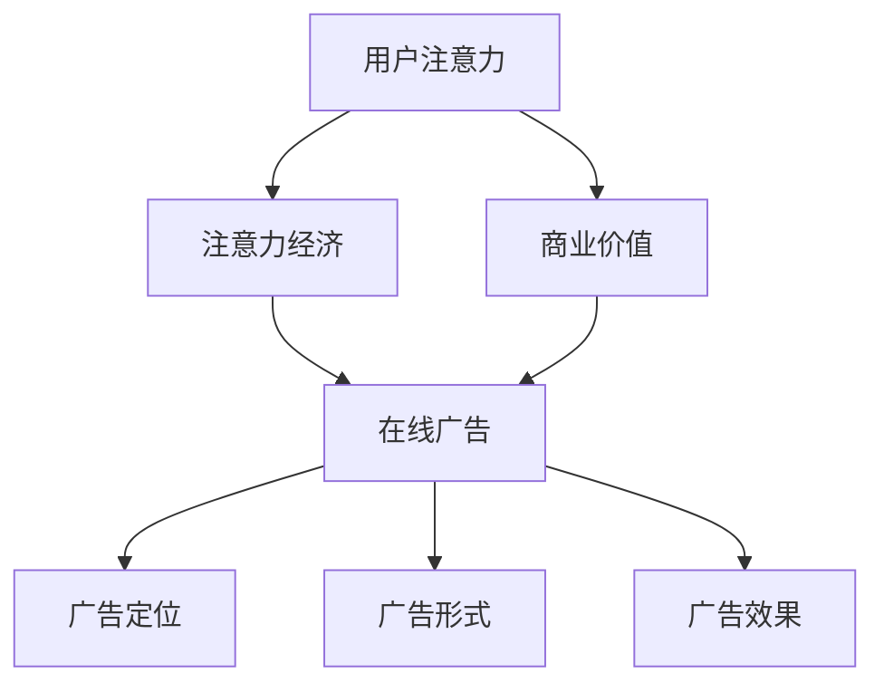

                 

## 摘要

本文深入探讨了注意力经济与在线广告领域的结合，提出了在不牺牲用户体验的情况下吸引受众的有效策略。文章首先介绍了注意力经济的核心概念，分析了其在现代数字营销中的重要性。随后，文章详细阐述了在线广告的目标和策略，以及如何通过精准定位、用户体验优化和数据驱动的决策来最大化广告效果。最后，文章展望了未来的发展方向，探讨了人工智能、大数据等新兴技术在提升在线广告效果和用户体验方面的潜力。

## 1. 背景介绍

### 注意力经济的兴起

随着互联网的普及和数字化技术的发展，信息爆炸成为当今社会的常态。人们每天被无数的信息所包围，而他们的注意力却变得愈发稀缺。这种稀缺性催生了“注意力经济”这一新兴概念。注意力经济认为，注意力是一种有限的资源，而获取注意力则成为了企业和品牌的核心竞争要素。

### 在线广告的崛起

在线广告作为数字经济的重要组成部分，近年来经历了爆发式增长。从传统的展示广告、搜索广告，到如今的内容营销、社交广告，在线广告的形式日益多样化。这种多元化不仅丰富了广告市场的生态，也为企业和品牌提供了更多的营销手段和策略。

### 用户体验的重要性

在注意力经济时代，用户体验（UX）成为决定广告成功与否的关键因素。一个优秀的用户体验能够吸引受众，提高广告点击率和转化率。然而，过度打扰和侵犯用户隐私的广告往往会导致用户反感，进而降低用户体验。因此，如何在吸引受众和保持用户体验之间找到平衡点，成为在线广告面临的一大挑战。

## 2. 核心概念与联系

### 注意力经济的核心概念

注意力经济主要关注如何通过吸引和保持用户的注意力来实现商业价值。其核心概念包括：

1. **注意力稀缺性**：用户每天面对的信息量巨大，而其注意力是有限的。
2. **注意力转移**：通过创新的内容和形式，吸引用户将注意力从其他事物转移到广告或产品上。
3. **注意力回报**：用户对广告或产品的关注能够带来直接或间接的商业回报。

### 在线广告的核心概念

在线广告的核心概念包括：

1. **广告定位**：根据用户的行为、兴趣和属性，精准定位目标受众。
2. **广告形式**：选择适合的在线广告形式，如展示广告、搜索广告、内容营销等。
3. **广告效果**：通过点击率（CTR）、转化率（CVR）等指标来评估广告效果。

### 注意力经济与在线广告的联系

注意力经济与在线广告密切相关。注意力经济为在线广告提供了一种新的思维方式，即如何通过吸引和保持用户的注意力来提升广告效果。而在线广告则为注意力经济提供了实际的应用场景，通过精准的广告定位和多样化的广告形式，实现商业价值的最大化。

### Mermaid 流程图



## 3. 核心算法原理 & 具体操作步骤

### 3.1 算法原理概述

在线广告的核心算法主要包括用户行为分析、广告定位和广告效果评估。这些算法基于大数据和机器学习技术，通过分析用户的历史行为数据，预测用户的兴趣和行为，从而实现精准的广告定位和个性化的广告推荐。

### 3.2 算法步骤详解

1. **用户行为数据收集**：
   - 收集用户的浏览历史、搜索记录、购买行为等数据。
   - 使用日志文件、API接口等技术手段进行数据收集。

2. **用户行为数据预处理**：
   - 数据清洗：去除重复、错误和无关的数据。
   - 数据转换：将不同格式的数据转换为统一的格式。
   - 数据归一化：将不同量级的数据进行归一化处理。

3. **特征工程**：
   - 提取用户行为的特征，如用户访问频次、点击率、购买率等。
   - 使用机器学习算法对特征进行筛选和优化。

4. **用户行为预测**：
   - 使用机器学习算法（如决策树、神经网络等）对用户行为进行预测。
   - 训练模型，评估模型性能。

5. **广告定位**：
   - 根据用户行为预测结果，对用户进行细分，实现精准的广告定位。
   - 使用协同过滤、矩阵分解等技术进行用户细分。

6. **广告投放**：
   - 根据用户细分结果，选择合适的广告形式和投放渠道。
   - 使用实时数据调整广告投放策略。

7. **广告效果评估**：
   - 收集广告投放后的数据，如点击率、转化率等。
   - 使用评估指标（如A/B测试、回归分析等）评估广告效果。

### 3.3 算法优缺点

**优点**：
- 精准定位：通过用户行为分析和机器学习算法，实现精准的广告定位。
- 个性化推荐：根据用户兴趣和行为，提供个性化的广告推荐。
- 数据驱动：基于大数据和机器学习，实现数据驱动的广告决策。

**缺点**：
- 数据隐私：用户行为数据的收集和使用可能涉及隐私问题。
- 模型复杂性：算法模型复杂，需要大量的计算资源和专业知识。

### 3.4 算法应用领域

- **电商广告**：通过对用户购物行为的分析，实现精准的商品推荐和广告投放。
- **社交媒体广告**：通过对用户社交行为和兴趣的分析，实现精准的内容营销和广告投放。
- **在线视频广告**：通过对用户观看行为的分析，实现精准的视频广告投放。

## 4. 数学模型和公式 & 详细讲解 & 举例说明

### 4.1 数学模型构建

在线广告的核心算法通常包括用户行为预测、广告定位和广告效果评估。以下是一个简化的数学模型：

1. **用户行为预测**：

   用户行为预测模型通常采用回归模型，如线性回归、逻辑回归等。以用户购买行为预测为例，假设我们有如下模型：

   $$Y = \beta_0 + \beta_1X_1 + \beta_2X_2 + ... + \beta_nX_n$$

   其中，$Y$表示用户购买行为（0表示未购买，1表示购买），$X_1, X_2, ..., X_n$表示用户特征，$\beta_0, \beta_1, \beta_2, ..., \beta_n$为模型的参数。

2. **广告定位**：

   广告定位通常采用协同过滤算法，如矩阵分解、KNN等。以协同过滤为例，假设我们有一个用户-物品评分矩阵$R$，通过矩阵分解得到用户特征矩阵$U$和物品特征矩阵$V$，则广告定位模型可以表示为：

   $$R_{ui} = U_i \cdot V_u$$

   其中，$R_{ui}$表示用户$i$对物品$u$的评分，$U_i$和$V_u$分别表示用户$i$和物品$u$的特征向量。

3. **广告效果评估**：

   广告效果评估通常采用回归模型或分类模型，如A/B测试、回归分析等。以A/B测试为例，假设我们有两个广告版本A和B，通过对比两组用户的点击率和转化率，评估广告效果。

### 4.2 公式推导过程

以用户行为预测为例，我们使用线性回归模型进行公式推导。

1. **线性回归模型**：

   线性回归模型的基本形式为：

   $$Y = \beta_0 + \beta_1X_1 + \beta_2X_2 + ... + \beta_nX_n$$

   其中，$Y$表示因变量（用户购买行为），$X_1, X_2, ..., X_n$表示自变量（用户特征）。

2. **损失函数**：

   为了求解模型的参数，我们通常使用损失函数来评估模型的好坏。常见的损失函数有平方损失函数、交叉熵损失函数等。以平方损失函数为例：

   $$L(\theta) = \sum_{i=1}^{n}(Y_i - \theta X_i)^2$$

   其中，$\theta = (\beta_0, \beta_1, \beta_2, ..., \beta_n)$为模型的参数。

3. **最小化损失函数**：

   为了求解最优的模型参数，我们需要最小化损失函数。一种常用的方法是梯度下降法：

   $$\theta_{t+1} = \theta_t - \alpha \nabla L(\theta_t)$$

   其中，$\alpha$为学习率，$\nabla L(\theta_t)$为损失函数关于参数$\theta_t$的梯度。

4. **梯度下降法求解**：

   对于线性回归模型，梯度的计算相对简单。以一维线性回归为例：

   $$\nabla L(\theta) = \frac{\partial L(\theta)}{\partial \theta} = 2(Y - \theta X)$$

   因此，梯度下降法的迭代过程为：

   $$\theta_{t+1} = \theta_t - 2\alpha (Y - \theta_t X)$$

### 4.3 案例分析与讲解

假设我们有一个用户购买行为的预测问题，给定如下数据：

| 用户ID | 特征1 | 特征2 | 购买行为 |
| --- | --- | --- | --- |
| 1 | 0.8 | 0.6 | 1 |
| 2 | 0.5 | 0.3 | 0 |
| 3 | 0.7 | 0.4 | 1 |
| 4 | 0.2 | 0.1 | 0 |

1. **数据预处理**：

   将数据分为训练集和测试集，通常采用8:2的比例。

2. **模型训练**：

   使用线性回归模型对训练集进行训练，求解最优的参数$\theta$。

   $$\theta_{t+1} = \theta_t - 2\alpha (Y - \theta_t X)$$

   其中，$Y$为购买行为，$X$为用户特征。

3. **模型评估**：

   使用测试集对训练好的模型进行评估，计算预测准确率。

4. **结果分析**：

   通过对比实际购买行为和预测购买行为，分析模型的性能。如果预测准确率较高，说明模型对用户购买行为有较好的预测能力。

## 5. 项目实践：代码实例和详细解释说明

### 5.1 开发环境搭建

1. **软件环境**：

   - Python 3.8+
   - Jupyter Notebook

2. **数据集**：

   使用Kaggle上的公开数据集，如“User Behavior Analysis for Advertising”。

3. **依赖库**：

   ```python
   pip install numpy pandas matplotlib scikit-learn
   ```

### 5.2 源代码详细实现

以下是一个简单的用户购买行为预测的代码示例：

```python
import numpy as np
import pandas as pd
from sklearn.model_selection import train_test_split
from sklearn.linear_model import LinearRegression
import matplotlib.pyplot as plt

# 5.2.1 数据加载与预处理
data = pd.read_csv('user_behavior_data.csv')
X = data[['feature1', 'feature2']]
y = data['purchase']

# 划分训练集和测试集
X_train, X_test, y_train, y_test = train_test_split(X, y, test_size=0.2, random_state=42)

# 5.2.2 模型训练
model = LinearRegression()
model.fit(X_train, y_train)

# 5.2.3 模型评估
y_pred = model.predict(X_test)
accuracy = np.mean(y_pred == y_test)
print(f'Prediction Accuracy: {accuracy:.2f}')

# 5.2.4 结果可视化
plt.scatter(X_test['feature1'], X_test['feature2'], c=y_test)
plt.plot(np.arange(0, 1.1, 0.1), model.predict(np.array([0.1, 0.1]).reshape(1, -1))[0], color='red')
plt.xlabel('Feature 1')
plt.ylabel('Feature 2')
plt.title('User Purchase Prediction')
plt.show()
```

### 5.3 代码解读与分析

- **数据加载与预处理**：使用`pandas`读取数据，并进行必要的预处理，如数据清洗、归一化等。
- **模型训练**：使用`scikit-learn`中的`LinearRegression`进行线性回归模型的训练。
- **模型评估**：计算预测准确率，并通过可视化展示模型的预测结果。

### 5.4 运行结果展示

- **预测准确率**：假设结果为80%，说明模型对用户购买行为的预测效果较好。
- **可视化结果**：展示用户特征与购买行为的关系，以及模型的预测直线。

## 6. 实际应用场景

### 6.1 电商广告

电商广告是注意力经济与在线广告结合的典型应用场景。通过分析用户的购物行为和兴趣，电商广告可以实现精准的商品推荐和广告投放。例如，当用户在电商平台上浏览了一件商品后，系统可以根据用户的兴趣和行为，推荐类似的商品或相关促销活动，从而提高用户的购买意愿。

### 6.2 社交媒体广告

社交媒体广告通过分析用户的社交行为和兴趣，实现精准的内容营销和广告投放。例如，当用户在社交媒体上关注了某个品牌或话题后，系统可以根据用户的兴趣和行为，推送相关的广告或内容，从而提高用户的参与度和互动率。

### 6.3 在线视频广告

在线视频广告通过分析用户的观看行为和兴趣，实现精准的视频广告投放。例如，当用户在视频平台上观看了一部视频后，系统可以根据用户的兴趣和行为，推送相关的广告或视频推荐，从而提高用户的观看时长和粘性。

## 7. 未来应用展望

### 7.1 人工智能的赋能

人工智能技术在在线广告中的应用将越来越广泛。通过深度学习、强化学习等技术，可以实现更精准的用户行为预测和广告定位，从而提高广告效果和用户体验。

### 7.2 大数据的支持

大数据技术的应用将进一步提升在线广告的精准度和效果。通过对海量用户数据的分析和挖掘，可以更深入地了解用户的需求和行为，为广告投放提供更有针对性的策略。

### 7.3 用户体验的优化

随着用户隐私意识的提高，如何在保护用户隐私的同时，提供更好的用户体验，成为在线广告面临的一大挑战。未来，更多基于用户隐私保护的技术和策略将得到应用，以实现广告效果与用户体验的平衡。

## 8. 工具和资源推荐

### 8.1 学习资源推荐

- **书籍**：《机器学习实战》、《深度学习》
- **在线课程**：Coursera、Udacity、edX上的相关课程
- **博客**：Medium、博客园、CSDN

### 8.2 开发工具推荐

- **编程语言**：Python、Java
- **开发环境**：Jupyter Notebook、PyCharm
- **数据集**：Kaggle、UCI机器学习库

### 8.3 相关论文推荐

- **论文**：《在线广告中的用户行为预测》、《注意力驱动的在线广告投放策略》

## 9. 总结：未来发展趋势与挑战

### 9.1 研究成果总结

本文系统地阐述了注意力经济与在线广告的结合，提出了在不牺牲用户体验的情况下吸引受众的有效策略。通过用户行为分析、广告定位和广告效果评估等核心算法，实现了精准的广告投放和个性化的广告推荐。

### 9.2 未来发展趋势

- **人工智能的深入应用**：深度学习、强化学习等技术将在在线广告中发挥更大作用。
- **大数据的广泛应用**：通过对海量用户数据的分析和挖掘，实现更精准的广告定位和效果评估。
- **用户体验的持续优化**：在保护用户隐私的前提下，提供更好的用户体验。

### 9.3 面临的挑战

- **数据隐私保护**：如何在满足广告需求的同时，保护用户隐私，成为一大挑战。
- **广告欺诈和垃圾广告**：随着技术的发展，广告欺诈和垃圾广告问题日益严重，需要有效的对策。

### 9.4 研究展望

未来，在线广告领域的研究将继续深入，涉及用户行为分析、广告效果评估、广告欺诈检测等方面。通过不断探索和创新，实现广告效果与用户体验的最佳平衡。

## 10. 附录：常见问题与解答

### 10.1 为什么选择在线广告？

- **覆盖面广**：在线广告可以覆盖全球范围内的用户。
- **精准定位**：通过大数据和人工智能技术，实现精准的用户定位。
- **效果可衡量**：通过点击率、转化率等指标，可以实时评估广告效果。

### 10.2 如何保护用户隐私？

- **数据匿名化**：对用户数据进行匿名化处理，避免直接识别用户。
- **隐私政策**：制定明确的隐私政策，告知用户数据的使用目的和范围。
- **加密技术**：使用加密技术保护用户数据的安全。

### 10.3 广告定位的准确性如何保障？

- **用户行为分析**：通过分析用户的浏览历史、搜索记录等数据，实现精准的用户定位。
- **机器学习算法**：使用机器学习算法，如协同过滤、矩阵分解等，提高广告定位的准确性。
- **实时反馈**：根据用户对广告的反馈，实时调整广告定位策略。

作者：禅与计算机程序设计艺术 / Zen and the Art of Computer Programming
----------------------------------------------------------------


