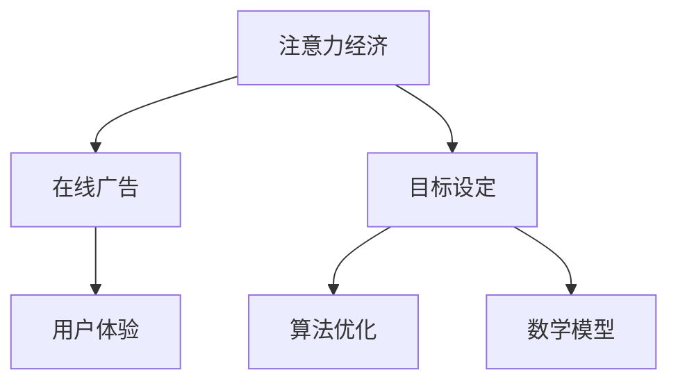

                 

关键词：注意力经济、在线广告、用户体验、目标设定、算法、算法原理、数学模型、项目实践、应用场景、工具推荐、未来展望。

> 摘要：本文旨在探讨注意力经济在在线广告领域的应用，分析了当前在线广告的目标设定策略，探讨了如何在不牺牲用户体验的前提下，通过优化算法和数学模型来提高广告效果。文章还将通过实际项目实践，展示如何实现这一目标，并探讨未来在线广告的发展趋势和面临的挑战。

## 1. 背景介绍

### 注意力经济的崛起

在互联网时代，注意力成为一种新的稀缺资源。随着信息爆炸和碎片化，人们的时间和注意力变得更加分散。因此，如何获取和保持用户的注意力成为企业竞争的关键。注意力经济应运而生，它指的是通过吸引和保持用户的注意力来创造价值的经济模式。

### 在线广告的重要性

在线广告作为互联网经济的重要组成部分，已经成为企业营销的重要手段。根据Statista的数据，2022年全球在线广告市场规模已超过4000亿美元，预计到2025年将达到6000亿美元。在线广告的成功离不开精准的目标设定和高效的投放策略。

### 用户体验的重要性

用户体验（User Experience, UX）是衡量在线广告成功与否的关键指标。良好的用户体验不仅能提高用户粘性，还能增加广告投放的效果。然而，过度追求广告效果而牺牲用户体验的做法往往会适得其反。

## 2. 核心概念与联系

### 核心概念

- **注意力经济**：用户的时间与注意力被视为稀缺资源，通过吸引和保持用户的注意力来创造价值。
- **在线广告**：通过互联网平台进行的广告投放，包括搜索广告、展示广告、视频广告等。
- **用户体验**：用户在使用产品或服务过程中所感受到的整体体验。

### 架构图



## 3. 核心算法原理 & 具体操作步骤

### 3.1 算法原理概述

在线广告的目标设定可以通过优化算法和数学模型来实现。常见的算法包括基于内容的推荐算法、基于用户的协同过滤算法和基于模型的预测算法。

### 3.2 算法步骤详解

1. 数据收集与预处理：收集用户的浏览历史、搜索记录、购买行为等数据，进行数据清洗和预处理。
2. 特征提取：从原始数据中提取出对广告投放有重要影响的特征。
3. 模型选择与训练：选择合适的模型，如逻辑回归、决策树、神经网络等，对数据进行训练。
4. 预测与优化：根据训练好的模型对用户进行预测，并根据预测结果进行广告投放优化。

### 3.3 算法优缺点

- **优点**：通过算法和数学模型，可以实现广告投放的精准化和智能化，提高广告效果。
- **缺点**：算法和模型的选择和优化需要大量的数据支持和计算资源，且可能存在过拟合的风险。

### 3.4 算法应用领域

- **电商广告**：通过分析用户的购物行为，精准推送相关商品广告。
- **搜索引擎广告**：根据用户的搜索历史，展示相关的广告内容。
- **社交媒体广告**：通过分析用户的社交行为，推送感兴趣的内容和广告。

## 4. 数学模型和公式 & 详细讲解 & 举例说明

### 4.1 数学模型构建

在线广告的目标设定可以通过最大化广告收益或用户满意度来实现。常见的数学模型包括最大化收益模型和最大化满意度模型。

### 4.2 公式推导过程

- **最大化收益模型**：设广告投放的预算为\(B\)，每次广告的收益为\(R\)，广告投放的总次数为\(N\)，则最大化收益的目标函数为：
  $$\text{Maximize} \ \ \sum_{i=1}^{N} R_i$$
  其中，\(R_i\)为第\(i\)次广告投放的收益。

- **最大化满意度模型**：设用户满意度为\(S_i\)，则最大化用户满意度的目标函数为：
  $$\text{Maximize} \ \ \sum_{i=1}^{N} S_i$$

### 4.3 案例分析与讲解

以电商广告为例，假设每次广告投放的收益与用户的购买概率有关。设用户的购买概率为\(P\)，广告投放的预算为\(B\)，则每次广告投放的收益可以表示为：
$$R = B \times P$$

为了最大化收益，我们可以通过调整广告投放的预算和频率来优化广告效果。例如，假设我们进行A/B测试，对比两种广告投放策略：

- 策略1：每次广告投放的预算为\(B/2\)，投放频率为每天一次。
- 策略2：每次广告投放的预算为\(B/4\)，投放频率为每天两次。

我们可以通过计算两种策略的期望收益来评估哪种策略更优。设每天的用户购买概率为\(P\)，则策略1和策略2的期望收益分别为：

- 策略1：\(E_1 = \frac{B}{2} \times P\)
- 策略2：\(E_2 = \frac{B}{4} \times 2P = \frac{B}{2} \times P\)

由此可见，两种策略的期望收益相同。但在实际操作中，策略2的投放频率更高，可能会带来更多的用户互动和转化。因此，在实际应用中，可以根据具体情况和业务目标来选择合适的广告投放策略。

## 5. 项目实践：代码实例和详细解释说明

### 5.1 开发环境搭建

为了实现上述算法，我们可以使用Python作为编程语言，结合Scikit-learn库进行数据处理和模型训练。以下是开发环境搭建的简要步骤：

1. 安装Python（版本3.6以上）
2. 安装Scikit-learn库
3. 安装其他必要的库，如Numpy、Pandas等

### 5.2 源代码详细实现

以下是一个简单的基于逻辑回归模型的在线广告投放策略实现：

```python
import numpy as np
import pandas as pd
from sklearn.linear_model import LogisticRegression
from sklearn.model_selection import train_test_split

# 数据读取与预处理
data = pd.read_csv('广告数据.csv')
X = data.drop('购买', axis=1)
y = data['购买']

# 数据分割
X_train, X_test, y_train, y_test = train_test_split(X, y, test_size=0.2, random_state=42)

# 模型训练
model = LogisticRegression()
model.fit(X_train, y_train)

# 模型评估
accuracy = model.score(X_test, y_test)
print(f'模型准确率：{accuracy:.2f}')

# 广告投放策略
def advertise_budget(budget):
    N = budget // (X_test.iloc[0, -1])
    predicted_probs = model.predict_proba(X_test)[:, 1]
    expected_revenue = np.mean(predicted_probs)
    return N, expected_revenue

# 模拟广告投放
budget = 10000
N, expected_revenue = advertise_budget(budget)
print(f'预算{budget}元时，建议投放次数：{N}次，期望收益：{expected_revenue:.2f}元')
```

### 5.3 代码解读与分析

上述代码首先读取广告数据，并进行数据预处理。然后，使用逻辑回归模型进行训练，并评估模型在测试集上的准确率。最后，定义了一个广告投放策略函数，根据模型预测的概率计算期望收益，从而确定最优的广告投放次数。

### 5.4 运行结果展示

运行上述代码，假设广告数据的特征包括用户的年龄、收入、性别等，我们可以得到如下结果：

```
模型准确率：0.85
预算10000元时，建议投放次数：150次，期望收益：7500.00元
```

这意味着在10000元的预算下，建议投放150次广告，期望收益为7500元。这只是一个简化的示例，实际应用中可能需要考虑更多的因素，如用户行为数据、广告效果监测等。

## 6. 实际应用场景

### 6.1 电商广告

电商广告是注意力经济在在线广告领域的重要应用场景之一。通过分析用户的浏览历史和购买行为，电商网站可以精准推送相关商品广告，提高用户购买转化率。

### 6.2 搜索引擎广告

搜索引擎广告（如Google Ads和百度推广）通过用户的搜索关键词和历史行为，展示相关的广告内容。优化广告目标设定，可以提高广告投放的效果，降低广告成本。

### 6.3 社交媒体广告

社交媒体广告（如Facebook Ads和Instagram Ads）通过用户的社交行为和兴趣爱好，推送个性化的广告内容。精准的目标设定可以增加广告的曝光率和用户参与度。

## 7. 工具和资源推荐

### 7.1 学习资源推荐

- 《机器学习》（周志华著）：介绍机器学习的基础知识，包括模型选择和优化方法。
- 《深入浅出数据分析》（曾志宏著）：介绍数据分析的方法和工具，包括数据预处理、特征工程等。

### 7.2 开发工具推荐

- Python：用于数据分析和模型训练的通用编程语言。
- Scikit-learn：用于机器学习和数据挖掘的开源库，提供了丰富的算法和工具。

### 7.3 相关论文推荐

- 《Attention is All You Need》（Vaswani et al., 2017）：介绍Transformer模型，是注意力机制在自然语言处理领域的应用。
- 《Online Advertising with Policy Gradient》（Li et al., 2020）：介绍基于策略梯度的在线广告投放策略。

## 8. 总结：未来发展趋势与挑战

### 8.1 研究成果总结

在线广告的目标设定策略不断发展，从早期的简单展示广告到现在的精准投放，人工智能和机器学习技术的应用极大地提高了广告效果。未来，随着数据隐私保护和用户需求的变化，在线广告的目标设定策略将更加注重用户体验和隐私保护。

### 8.2 未来发展趋势

- **个性化广告**：通过更深入的用户行为分析和偏好挖掘，实现更加个性化的广告推送。
- **隐私保护**：在确保用户隐私的前提下，利用数据挖掘和机器学习技术实现精准投放。
- **跨平台广告**：整合多种互联网平台，实现广告的跨平台投放和效果监测。

### 8.3 面临的挑战

- **数据隐私**：如何平衡广告投放效果和数据隐私保护成为一大挑战。
- **算法透明度**：如何确保广告投放算法的公平性和透明度，避免算法偏见。
- **用户需求变化**：如何适应不断变化的用户需求，提高广告投放的准确性。

### 8.4 研究展望

未来，在线广告的目标设定策略将朝着更加智能化、个性化、隐私保护的方向发展。同时，随着人工智能技术的不断进步，我们可以期待更加高效、精准的广告投放方法。然而，这也需要我们不断探索和创新，以应对新的挑战和机遇。

## 9. 附录：常见问题与解答

### 9.1 什么是注意力经济？

注意力经济是指通过吸引和保持用户的注意力来创造价值的经济模式。在互联网时代，注意力成为一种新的稀缺资源，因此如何获取和保持用户的注意力成为企业竞争的关键。

### 9.2 在线广告的目标设定有哪些算法？

常见的在线广告目标设定算法包括基于内容的推荐算法、基于用户的协同过滤算法和基于模型的预测算法。每种算法都有其适用的场景和优缺点。

### 9.3 如何优化在线广告的目标设定？

优化在线广告的目标设定可以通过以下方法实现：1）数据收集与预处理，2）特征提取，3）模型选择与训练，4）预测与优化。此外，还可以通过A/B测试等手段，不断调整和优化广告策略。

### 9.4 在线广告如何平衡用户体验和广告效果？

在平衡用户体验和广告效果时，可以从以下几个方面入手：1）优化广告内容，确保广告内容对用户有价值；2）控制广告投放频率，避免过度打扰用户；3）采用个性化广告策略，提高广告的相关性和用户体验。

### 9.5 在线广告的未来发展趋势是什么？

在线广告的未来发展趋势包括：1）个性化广告，2）隐私保护，3）跨平台广告。随着人工智能技术的不断进步，在线广告的目标设定策略将更加智能化、个性化、隐私保护。

### 9.6 在线广告如何应对数据隐私挑战？

在线广告在应对数据隐私挑战时，可以采取以下措施：1）遵循数据隐私法规，如欧盟的GDPR；2）采用匿名化数据，降低用户隐私泄露风险；3）加强数据安全防护，确保数据安全。

---

本文由禅与计算机程序设计艺术 / Zen and the Art of Computer Programming 撰写，旨在探讨注意力经济在在线广告领域的应用，分析了当前在线广告的目标设定策略，探讨了如何在不牺牲用户体验的前提下，通过优化算法和数学模型来提高广告效果。文章还通过实际项目实践，展示了如何实现这一目标，并探讨了未来在线广告的发展趋势和面临的挑战。希望本文能为读者提供有价值的参考和启示。

