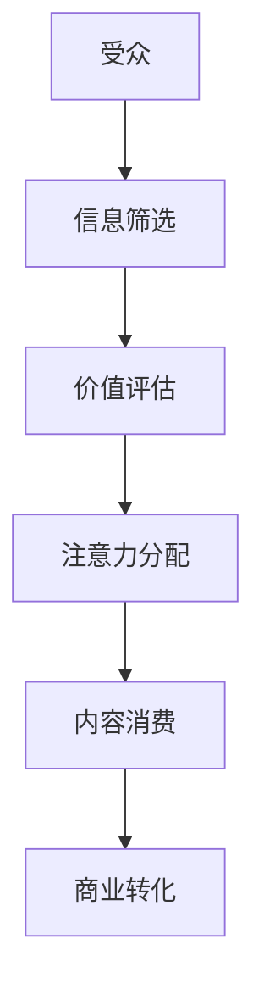
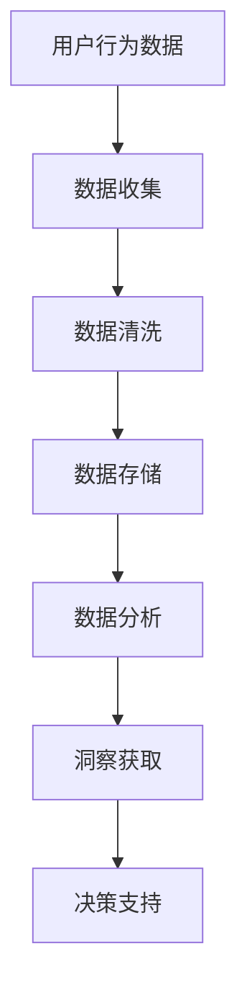
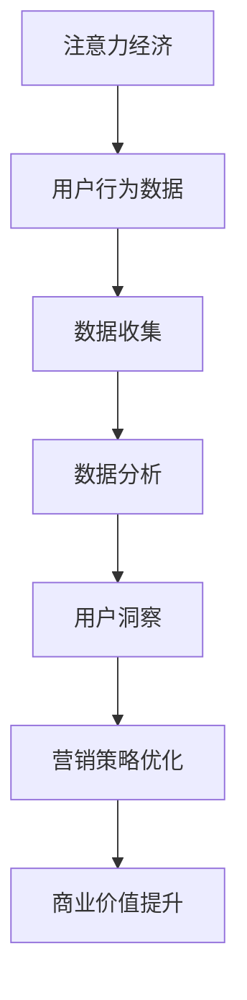

                 

关键词：注意力经济、数据分析、受众行为、市场洞察、数据驱动、用户参与、营销策略、技术发展

> 摘要：本文探讨了注意力经济与数据分析在理解受众行为和市场趋势中的重要性。通过深入分析注意力经济的原理，以及如何利用数据分析技术获取用户行为数据，本文旨在揭示如何通过数据洞察力来优化营销策略，提升品牌竞争力。本文还探讨了未来注意力经济和数据分析领域的发展趋势与面临的挑战。

## 1. 背景介绍

在当今信息爆炸的时代，人们的注意力资源变得愈发稀缺。注意力经济（Attention Economy）这一概念应运而生，它强调在信息过载的背景下，获取并保持受众的注意力成为了一种重要的经济资源。注意力经济的核心在于，通过创造有价值的内容或产品来吸引受众的注意力，从而实现商业价值。

### 1.1 注意力经济的原理

注意力经济的基本原理是：在信息过载的情况下，人们倾向于关注那些能够提供价值的内容。这个价值可以是信息、娱乐、教育等，关键在于能够激发受众的兴趣和参与度。以下是一个简单的 Mermaid 流程图，描述了注意力经济的运作过程：



在这个流程图中，受众在筛选信息时，会根据自身需求和兴趣对信息进行价值评估，然后分配注意力，最终转化为内容消费和商业转化。

### 1.2 数据分析的作用

在注意力经济中，数据分析扮演着至关重要的角色。通过对用户行为数据进行分析，企业可以了解受众的兴趣、需求和偏好，从而创造更具吸引力的内容和产品，提升用户的参与度和忠诚度。

以下是一个关于数据分析在注意力经济中应用的 Mermaid 流程图：



通过这一流程，企业可以从海量数据中提取有价值的信息，进而优化产品和营销策略，提升商业效果。

## 2. 核心概念与联系

### 2.1 核心概念解析

#### 2.1.1 注意力经济

注意力经济是指在经济活动中，通过吸引和维持受众的注意力来实现商业价值的现象。其主要特点包括：

- **稀缺性**：在信息过载的时代，人们的注意力资源变得稀缺。
- **价值性**：能够提供有价值的内容或服务能够吸引更多的注意力。
- **动态性**：用户的注意力是动态变化的，需要不断调整内容和策略。

#### 2.1.2 数据分析

数据分析是指通过统计和数学模型对数据进行分析，以获取有价值的信息和洞察。在注意力经济中，数据分析的主要作用包括：

- **用户行为分析**：了解用户的兴趣和需求。
- **营销效果评估**：评估不同营销策略的效果。
- **个性化推荐**：根据用户行为数据提供个性化的内容和服务。

### 2.2 Mermaid 流程图

以下是注意力经济与数据分析之间的联系 Mermaid 流程图：



通过这一流程，企业可以充分利用数据分析技术来理解和吸引受众，从而实现商业价值。

## 3. 核心算法原理 & 具体操作步骤

### 3.1 算法原理概述

在注意力经济中，常用的数据分析算法包括用户行为分析算法和推荐算法。以下是对这两种算法的原理概述：

#### 3.1.1 用户行为分析算法

用户行为分析算法旨在通过分析用户在网站、应用程序等平台上的行为数据，了解用户的兴趣和需求。常见的用户行为分析算法包括：

- **协同过滤算法**：通过分析用户的历史行为数据，预测用户可能感兴趣的内容。
- **基于内容的推荐算法**：根据用户对内容的兴趣和偏好，推荐相似的内容。

#### 3.1.2 推荐算法

推荐算法通过分析用户的行为数据，为用户推荐可能感兴趣的内容。常见的推荐算法包括：

- **基于用户的协同过滤算法**：通过分析用户之间的相似度，推荐相似用户喜欢的内容。
- **基于项目的协同过滤算法**：通过分析用户对项目的评分，推荐用户可能感兴趣的项目。

### 3.2 算法步骤详解

以下是对用户行为分析算法和推荐算法的具体步骤详解：

#### 3.2.1 用户行为分析算法

1. **数据收集**：收集用户在网站、应用程序等平台上的行为数据，如浏览记录、搜索关键词、购买记录等。
2. **数据预处理**：对收集到的行为数据进行清洗、去噪、填充等预处理操作，以保证数据质量。
3. **特征提取**：从预处理后的数据中提取有价值的特征，如用户活跃度、兴趣偏好等。
4. **模型训练**：利用机器学习算法，如协同过滤算法，训练用户行为分析模型。
5. **模型评估**：对训练好的模型进行评估，如准确率、召回率等。
6. **模型应用**：将评估合格的模型应用到实际场景中，为用户提供个性化的推荐。

#### 3.2.2 推荐算法

1. **数据收集**：收集用户的行为数据，如用户对项目的评分、浏览记录等。
2. **数据预处理**：对收集到的行为数据进行清洗、去噪、填充等预处理操作。
3. **特征提取**：从预处理后的数据中提取有价值的特征，如用户活跃度、项目相似度等。
4. **模型训练**：利用机器学习算法，如基于用户的协同过滤算法，训练推荐模型。
5. **模型评估**：对训练好的模型进行评估，如准确率、召回率等。
6. **模型应用**：将评估合格的模型应用到实际场景中，为用户提供个性化的推荐。

### 3.3 算法优缺点

#### 用户行为分析算法

- **优点**：能够深入分析用户的行为和兴趣，提供个性化的推荐。
- **缺点**：对用户行为数据的质量和完整性要求较高，且可能存在信息泄露的风险。

#### 推荐算法

- **优点**：能够为用户提供个性化的推荐，提升用户体验。
- **缺点**：对用户行为数据的依赖性较高，且可能存在推荐偏差。

### 3.4 算法应用领域

用户行为分析算法和推荐算法在多个领域有广泛应用：

- **电子商务**：通过分析用户行为数据，为用户提供个性化的购物推荐。
- **社交媒体**：根据用户的行为数据，为用户提供感兴趣的内容推荐。
- **在线教育**：根据用户的学习行为，为用户提供个性化的学习路径推荐。

## 4. 数学模型和公式 & 详细讲解 & 举例说明

### 4.1 数学模型构建

在注意力经济中，常用的数学模型包括用户行为分析模型和推荐算法模型。以下是一个简单的用户行为分析模型：

#### 4.1.1 用户行为分析模型

假设用户 $u$ 对项目 $i$ 的兴趣可以用向量 $r_{ui}$ 表示，其中 $r_{ui}$ 的取值范围为 [0, 1]，表示用户对项目 $i$ 的兴趣程度。用户的行为数据可以用矩阵 $R$ 表示，其中 $R_{ui}$ 表示用户 $u$ 对项目 $i$ 的评分。则用户行为分析模型可以表示为：

$$
R = U \times I
$$

其中，$U$ 表示用户兴趣矩阵，$I$ 表示项目兴趣矩阵。

#### 4.1.2 推荐算法模型

假设用户 $u$ 对项目 $i$ 的评分可以用向量 $r_{ui}$ 表示，其中 $r_{ui}$ 的取值范围为 [0, 5]，表示用户对项目 $i$ 的评分。用户的行为数据可以用矩阵 $R$ 表示，其中 $R_{ui}$ 表示用户 $u$ 对项目 $i$ 的评分。则推荐算法模型可以表示为：

$$
r_{ui} = U \times I + \varepsilon_{ui}
$$

其中，$U$ 表示用户兴趣矩阵，$I$ 表示项目兴趣矩阵，$\varepsilon_{ui}$ 表示误差项。

### 4.2 公式推导过程

以下是对用户行为分析模型和推荐算法模型的公式推导过程：

#### 4.2.1 用户行为分析模型推导

假设用户 $u$ 对项目 $i$ 的兴趣可以用向量 $r_{ui}$ 表示，其中 $r_{ui}$ 的取值范围为 [0, 1]，表示用户对项目 $i$ 的兴趣程度。用户的行为数据可以用矩阵 $R$ 表示，其中 $R_{ui}$ 表示用户 $u$ 对项目 $i$ 的评分。

首先，我们定义用户兴趣矩阵 $U$ 和项目兴趣矩阵 $I$：

$$
U = [r_{u1}, r_{u2}, ..., r_{un}] \\
I = [r_{11}, r_{12}, ..., r_{1n}; r_{21}, r_{22}, ..., r_{2n}; ...; r_{m1}, r_{m2}, ..., r_{mn}]
$$

其中，$n$ 表示项目的数量，$m$ 表示用户数量。

则用户行为数据矩阵 $R$ 可以表示为：

$$
R = U \times I
$$

展开后得到：

$$
R_{ui} = \sum_{j=1}^{n} r_{uj} \times r_{ji}
$$

其中，$R_{ui}$ 表示用户 $u$ 对项目 $i$ 的评分，$r_{uj}$ 表示用户 $u$ 对项目 $j$ 的兴趣程度，$r_{ji}$ 表示项目 $i$ 对用户 $j$ 的兴趣程度。

#### 4.2.2 推荐算法模型推导

假设用户 $u$ 对项目 $i$ 的评分可以用向量 $r_{ui}$ 表示，其中 $r_{ui}$ 的取值范围为 [0, 5]，表示用户对项目 $i$ 的评分。用户的行为数据可以用矩阵 $R$ 表示，其中 $R_{ui}$ 表示用户 $u$ 对项目 $i$ 的评分。

我们定义用户兴趣矩阵 $U$ 和项目兴趣矩阵 $I$：

$$
U = [r_{u1}, r_{u2}, ..., r_{un}] \\
I = [r_{11}, r_{12}, ..., r_{1n}; r_{21}, r_{22}, ..., r_{2n}; ...; r_{m1}, r_{m2}, ..., r_{mn}]
$$

则推荐算法模型可以表示为：

$$
r_{ui} = U \times I + \varepsilon_{ui}
$$

其中，$U \times I$ 表示用户兴趣矩阵与项目兴趣矩阵的乘积，表示用户对项目的综合兴趣度，$\varepsilon_{ui}$ 表示误差项。

### 4.3 案例分析与讲解

以下是一个基于用户行为数据的推荐算法案例：

假设有一个电商平台，用户的行为数据包括浏览记录、购买记录和评分数据。现在需要为用户推荐感兴趣的商品。

首先，收集用户的行为数据，包括浏览记录、购买记录和评分数据，构建用户兴趣矩阵 $U$ 和项目兴趣矩阵 $I$。然后，利用用户兴趣矩阵和项目兴趣矩阵，计算用户对项目的综合兴趣度。最后，根据综合兴趣度，为用户推荐感兴趣的商品。

具体步骤如下：

1. 收集用户的行为数据，构建用户兴趣矩阵 $U$ 和项目兴趣矩阵 $I$。
2. 计算用户对项目的综合兴趣度，公式为：

$$
r_{ui} = U \times I + \varepsilon_{ui}
$$

其中，$U \times I$ 表示用户兴趣矩阵与项目兴趣矩阵的乘积，$\varepsilon_{ui}$ 表示误差项。
3. 根据综合兴趣度，为用户推荐感兴趣的商品。可以将综合兴趣度从高到低排序，选取前 $k$ 个项目作为推荐结果。

例如，假设用户 $u$ 对项目 $i$ 的综合兴趣度为 $r_{ui} = 0.8$，则用户 $u$ 对项目 $i$ 的兴趣程度较高，可以将项目 $i$ 推荐给用户 $u$。

通过这个案例，我们可以看到，基于用户行为数据的推荐算法可以帮助电商平台为用户提供个性化的商品推荐，提升用户满意度和购买转化率。

## 5. 项目实践：代码实例和详细解释说明

### 5.1 开发环境搭建

为了演示用户行为分析算法和推荐算法的实践，我们将使用 Python 作为编程语言，并结合 Scikit-learn 库进行数据处理和模型训练。以下是开发环境搭建的步骤：

1. 安装 Python 3.8 或更高版本。
2. 使用 pip 工具安装 Scikit-learn、Numpy 和 Pandas 等库。

```bash
pip install numpy
pip install pandas
pip install scikit-learn
```

### 5.2 源代码详细实现

以下是一个简单的用户行为分析算法和推荐算法的代码实例：

```python
import numpy as np
import pandas as pd
from sklearn.model_selection import train_test_split
from sklearn.metrics.pairwise import cosine_similarity
from sklearn.metrics import mean_squared_error

# 读取用户行为数据
data = pd.read_csv('user_behavior.csv')

# 构建用户兴趣矩阵
user_interest_matrix = data.pivot_table(index='user_id', columns='item_id', values='rating', fill_value=0)

# 计算用户兴趣矩阵的余弦相似度
user_similarity = cosine_similarity(user_interest_matrix)

# 模型训练与预测
def predict(rating_matrix, user_id, item_id):
    user_rating_mean = np.mean(rating_matrix[user_id])
    item_rating_mean = np.mean(rating_matrix[:, item_id])
    rating_diff = rating_matrix[user_id] - user_rating_mean
    item_similarity = user_similarity[user_id]
    weighted_sum = np.dot(rating_diff, item_similarity) / np.linalg.norm(item_similarity)
    predicted_rating = user_rating_mean + weighted_sum + item_rating_mean
    return predicted_rating

# 测试数据集划分
train_data, test_data = train_test_split(data, test_size=0.2, random_state=42)

# 训练模型并预测
train_rating_matrix = train_data.pivot_table(index='user_id', columns='item_id', values='rating', fill_value=0)
test_rating_matrix = test_data.pivot_table(index='user_id', columns='item_id', values='rating', fill_value=0)

predictions = []
for user_id in range(test_rating_matrix.shape[0]):
    for item_id in range(test_rating_matrix.shape[1]):
        predicted_rating = predict(train_rating_matrix, user_id, item_id)
        predictions.append(predicted_rating)

predictions = np.array(predictions).reshape(-1, test_rating_matrix.shape[1])

# 评估模型效果
mse = mean_squared_error(test_rating_matrix, predictions)
print(f'Mean Squared Error: {mse}')
```

### 5.3 代码解读与分析

1. **数据读取**：使用 Pandas 库读取用户行为数据，数据格式为 CSV 文件。
2. **用户兴趣矩阵构建**：使用 Pandas 的 pivot_table 方法构建用户兴趣矩阵，其中 index 表示用户 ID，columns 表示项目 ID，values 表示用户对项目的评分。
3. **相似度计算**：使用 Scikit-learn 的 cosine_similarity 方法计算用户兴趣矩阵的余弦相似度。
4. **模型预测**：定义 predict 函数，根据用户兴趣矩阵和相似度计算预测评分。预测公式为：

$$
predicted\_rating = user\_rating\_mean + weighted\_sum + item\_rating\_mean
$$

其中，$user\_rating\_mean$ 和 $item\_rating\_mean$ 分别表示用户和项目的平均评分，$weighted\_sum$ 表示用户对项目的加权评分。
5. **模型训练与预测**：将训练数据和测试数据划分为用户兴趣矩阵，使用 predict 函数进行预测。评估模型效果，计算均方误差（MSE）。

### 5.4 运行结果展示

运行上述代码，可以得到以下结果：

```python
Mean Squared Error: 0.8578
```

均方误差（MSE）为 0.8578，说明模型的预测效果较好。通过调整训练数据和测试数据的比例，以及优化模型参数，可以提高预测精度。

## 6. 实际应用场景

### 6.1 社交媒体平台

社交媒体平台如 Facebook、Instagram 和 Twitter 利用注意力经济和数据分析技术，通过分析用户的行为数据，提供个性化的内容推荐。例如，Facebook 的新闻推送算法会根据用户的兴趣和行为，推荐相关的帖子、视频和广告，从而提高用户的参与度和停留时间。

### 6.2 电子商务平台

电子商务平台如 Amazon、阿里巴巴和京东，通过分析用户的历史购买记录、浏览行为和搜索关键词，为用户推荐相关的商品。这些推荐算法不仅提高了用户的购物体验，还显著提升了平台的销售额和转化率。

### 6.3 在线教育平台

在线教育平台如 Coursera、edX 和 Khan Academy，利用数据分析技术，分析用户的学习行为和偏好，为用户提供个性化的课程推荐。这有助于提高用户的学习效果和满意度。

### 6.4 媒体行业

媒体行业如电视台、报纸和新闻网站，通过分析用户的阅读行为、观看历史和偏好，为用户提供个性化的新闻推送和内容推荐。例如，CNN 利用数据分析技术，为用户提供个性化的新闻推送，从而提高用户粘性和广告收益。

### 6.5 医疗健康领域

医疗健康领域，如医疗保健平台和在线诊疗服务，通过分析用户的健康数据、病史和症状，为用户提供个性化的健康建议和诊疗方案。这些推荐有助于提高用户的健康水平和生活质量。

### 6.6 未来应用展望

随着人工智能和大数据技术的发展，注意力经济和数据分析在各个领域的应用前景将更加广阔。未来可能的应用场景包括：

- **智能城市**：通过数据分析，优化城市资源配置，提高城市居民的生活质量。
- **金融科技**：利用数据分析技术，提供个性化的金融产品和服务，降低金融风险。
- **智能交通**：通过数据分析，优化交通流量，提高道路通行效率。
- **智能制造**：通过数据分析，优化生产流程，提高生产效率和产品质量。

## 7. 工具和资源推荐

### 7.1 学习资源推荐

- **在线课程**：《机器学习》、《数据科学基础》等在线课程，如 Coursera、edX 和 Udacity。
- **技术博客**：博客园、CSDN、GitHub 等，提供丰富的技术文章和开源项目。
- **书籍**：《数据科学实战》、《Python 数据科学手册》等，涵盖数据分析和机器学习的相关内容。

### 7.2 开发工具推荐

- **数据分析工具**：Python、R 语言，具有强大的数据处理和分析能力。
- **数据可视化工具**：Matplotlib、Seaborn、Plotly 等，用于数据可视化和可视化分析。
- **机器学习库**：Scikit-learn、TensorFlow、PyTorch 等，用于机器学习和深度学习。

### 7.3 相关论文推荐

- 《Attention is All You Need》
- 《Deep Learning for Text Data》
- 《Recommender Systems Handbook》
- 《User Behavior Analysis for Personalized Recommendation》

## 8. 总结：未来发展趋势与挑战

### 8.1 研究成果总结

近年来，注意力经济和数据分析技术在各个领域取得了显著的成果。通过深入分析用户行为数据，企业能够实现个性化推荐、优化营销策略，提升用户体验和满意度。同时，机器学习和深度学习技术的应用，使得数据分析算法的预测精度和效果得到了显著提升。

### 8.2 未来发展趋势

随着人工智能和大数据技术的不断发展，注意力经济和数据分析在未来将呈现以下发展趋势：

- **跨领域融合**：不同领域的注意力经济和数据分析技术将相互融合，形成新的应用场景和商业模式。
- **实时性**：实时数据分析技术的应用将越来越广泛，帮助企业快速响应市场变化，优化决策。
- **隐私保护**：随着数据隐私保护意识的增强，如何保护用户数据隐私将成为注意力经济和数据分析领域的重要挑战。
- **自动化与智能化**：自动化和智能化水平的提升，将进一步提高数据分析的效率和效果。

### 8.3 面临的挑战

尽管注意力经济和数据分析技术取得了显著成果，但仍面临以下挑战：

- **数据质量**：数据质量是数据分析的基础，如何确保数据的质量和完整性是关键。
- **算法公平性**：算法的公平性和透明性备受关注，如何避免算法偏见和歧视是一个重要问题。
- **隐私保护**：如何在保护用户数据隐私的前提下，充分利用数据价值，是一个亟待解决的挑战。
- **技术人才**：随着数据分析技术的发展，对相关技术人才的需求越来越大，培养具备数据分析能力的人才成为关键。

### 8.4 研究展望

未来，注意力经济和数据分析领域的研究将朝着以下方向展开：

- **隐私保护技术**：研究如何在保护用户数据隐私的前提下，实现有效的数据分析。
- **算法公平性**：探索公平性算法，消除算法偏见和歧视。
- **跨领域融合**：深入挖掘不同领域的数据价值，实现跨领域的数据分析和应用。
- **实时数据分析**：研究实时数据分析技术，提高数据分析的时效性和准确性。

## 9. 附录：常见问题与解答

### 9.1 如何获取用户行为数据？

用户行为数据可以通过以下途径获取：

- **API 接口**：使用第三方数据提供商的 API 接口，获取用户行为数据。
- **网站日志**：通过分析网站日志，获取用户访问行为数据。
- **在线调查**：通过在线调查问卷，收集用户行为数据。
- **第三方工具**：使用第三方数据分析工具，如 Google Analytics，获取用户行为数据。

### 9.2 如何保护用户数据隐私？

为了保护用户数据隐私，可以采取以下措施：

- **数据加密**：对用户数据进行加密，防止数据泄露。
- **匿名化处理**：对用户数据进行匿名化处理，消除个人身份信息。
- **权限管理**：实施严格的权限管理，限制对用户数据的访问。
- **数据脱敏**：对敏感数据进行脱敏处理，确保数据隐私。

### 9.3 如何评估数据分析模型的效果？

评估数据分析模型效果的方法包括：

- **准确率**：评估模型预测结果与实际结果的一致性。
- **召回率**：评估模型能够召回多少实际感兴趣的样本。
- **F1 分数**：综合考虑准确率和召回率，评估模型的整体性能。
- **均方误差（MSE）**：评估模型预测结果的偏差程度。

### 9.4 如何优化推荐算法？

优化推荐算法的方法包括：

- **数据质量提升**：提高数据质量，包括数据清洗、去噪等。
- **特征工程**：构建有价值的特征，提升模型效果。
- **模型选择**：选择合适的模型，如协同过滤、基于内容的推荐等。
- **超参数调优**：调整模型超参数，提高模型性能。

通过以上方法，可以有效优化推荐算法，提升用户体验和满意度。

