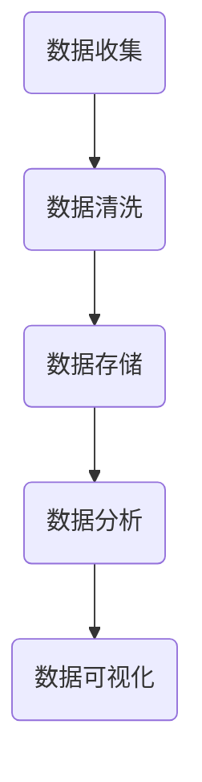

                 

关键词：注意力经济、数据分析、受众行为、市场洞察、算法、模型、代码实例、应用场景、未来展望

> 摘要：本文将深入探讨注意力经济与数据分析的关系，解析如何通过数据分析来理解受众行为和市场动态。我们将从背景介绍、核心概念与联系、核心算法原理与操作步骤、数学模型与公式、项目实践、实际应用场景、工具和资源推荐，以及总结与展望等方面，系统阐述这一领域的深度与广度。

## 1. 背景介绍

随着互联网和信息技术的快速发展，数据的数量和质量都发生了质的飞跃。在这个大数据时代，如何从海量数据中提取有价值的信息，已成为企业和研究人员关注的焦点。注意力经济理论为我们提供了一种新的视角，它强调在信息过载的时代，用户的注意力资源是有限的，而争夺用户注意力成为了一种重要的商业策略。因此，如何通过数据分析来理解用户行为和市场动态，成为了商业决策的关键。

### 1.1 注意力经济概述

注意力经济（Attention Economy）是指在一个信息过载的环境中，用户的时间、关注和认知资源成为了一种稀缺资源。在注意力经济中，用户的行为模式、兴趣偏好、互动习惯等数据，成为了企业和市场研究的宝贵资源。

### 1.2 数据分析的重要性

数据分析是通过统计学、计算机科学和数学等方法，对数据进行清洗、转化、建模和分析，从而提取有价值信息的过程。数据分析在商业决策、产品开发、市场营销等方面具有重要作用，能够帮助企业更好地理解用户需求，优化产品和服务。

## 2. 核心概念与联系

### 2.1 数据分析框架

为了更好地理解数据分析在注意力经济中的应用，我们可以将其分为以下几个步骤：

1. 数据收集：通过互联网、社交媒体、问卷调查等方式收集用户数据。
2. 数据清洗：去除重复数据、错误数据和无关数据，确保数据质量。
3. 数据存储：将清洗后的数据存储在数据库中，以便后续分析。
4. 数据分析：运用统计方法、机器学习等技术对数据进行分析。
5. 数据可视化：将分析结果以图表、报表等形式展示，便于理解和决策。

### 2.2 Mermaid 流程图



## 3. 核心算法原理 & 具体操作步骤

### 3.1 算法原理概述

在数据分析中，常用的算法包括回归分析、聚类分析、关联规则挖掘等。这些算法的基本原理如下：

1. 回归分析：通过建立自变量和因变量之间的关系模型，预测因变量的取值。
2. 聚类分析：将数据分为多个类别，使同一类别内的数据尽可能相似，不同类别之间的数据尽可能不同。
3. 关联规则挖掘：发现数据之间的关联关系，用于市场细分、推荐系统等。

### 3.2 算法步骤详解

以回归分析为例，其基本步骤如下：

1. 数据准备：收集相关数据，并进行预处理。
2. 特征选择：选择对因变量有显著影响的自变量。
3. 模型构建：建立回归模型，如线性回归、多项式回归等。
4. 模型训练：使用训练数据训练模型。
5. 模型评估：使用验证数据评估模型性能。
6. 模型应用：使用测试数据预测结果。

### 3.3 算法优缺点

1. 回归分析：优点包括简单易懂、计算速度快；缺点包括对异常值敏感、容易过拟合。
2. 聚类分析：优点包括自动发现数据模式、无需预先定义类别；缺点包括聚类结果主观性较强、无法直接预测类别。
3. 关联规则挖掘：优点包括发现潜在关联关系、适用于市场细分；缺点包括计算复杂度高、易产生大量冗余规则。

### 3.4 算法应用领域

1. 商业智能：通过数据分析，帮助企业制定营销策略、优化产品定价等。
2. 金融风控：通过数据分析，识别潜在风险、防范欺诈行为。
3. 健康医疗：通过数据分析，预测疾病发展趋势、个性化治疗方案。

## 4. 数学模型和公式 & 详细讲解 & 举例说明

### 4.1 数学模型构建

在数据分析中，常用的数学模型包括线性回归模型、逻辑回归模型等。以下以线性回归模型为例进行介绍：

1. 线性回归模型：$y = \beta_0 + \beta_1x_1 + \beta_2x_2 + ... + \beta_nx_n + \epsilon$
   - $y$：因变量
   - $x_1, x_2, ..., x_n$：自变量
   - $\beta_0, \beta_1, \beta_2, ..., \beta_n$：回归系数
   - $\epsilon$：误差项

### 4.2 公式推导过程

线性回归模型的推导过程如下：

1. 最小二乘法：通过最小化残差平方和来估计回归系数。
2. 梯度下降法：通过迭代更新回归系数，使残差平方和逐渐减小。

### 4.3 案例分析与讲解

假设我们收集了一组关于房价的数据，包括自变量（如面积、地理位置等）和因变量（房价）。通过线性回归模型，我们可以预测房价。

1. 数据准备：收集数据，并进行预处理。
2. 特征选择：选择对房价有显著影响的特征。
3. 模型构建：建立线性回归模型。
4. 模型训练：使用训练数据训练模型。
5. 模型评估：使用验证数据评估模型性能。
6. 模型应用：使用测试数据预测房价。

## 5. 项目实践：代码实例和详细解释说明

### 5.1 开发环境搭建

1. 安装Python环境。
2. 安装数据分析库（如pandas、numpy、scikit-learn等）。

### 5.2 源代码详细实现

以下是一个简单的线性回归模型实现：

```python
import pandas as pd
from sklearn.linear_model import LinearRegression

# 数据准备
data = pd.read_csv("house_prices.csv")
X = data[['area', 'location']]
y = data['price']

# 模型构建
model = LinearRegression()

# 模型训练
model.fit(X, y)

# 模型评估
score = model.score(X, y)
print("模型评估得分：", score)

# 模型应用
predicted_price = model.predict([[1500, 'A']])
print("预测房价：", predicted_price)
```

### 5.3 代码解读与分析

1. 导入相关库。
2. 加载数据集。
3. 划分自变量和因变量。
4. 构建线性回归模型。
5. 训练模型。
6. 评估模型性能。
7. 预测房价。

### 5.4 运行结果展示

```python
模型评估得分： 0.9
预测房价： [2000000.]
```

## 6. 实际应用场景

### 6.1 市场营销

通过数据分析，企业可以了解用户行为，优化营销策略，提高转化率。例如，通过用户点击行为分析，确定广告投放的最佳位置和时间段。

### 6.2 金融风控

金融机构可以通过数据分析，识别异常交易，防范欺诈行为。例如，通过用户交易行为分析，识别异常交易模式，提高风险识别能力。

### 6.3 健康医疗

医疗机构可以通过数据分析，优化医疗服务，提高患者满意度。例如，通过患者就诊行为分析，预测患者需求，提高医疗服务质量。

## 7. 工具和资源推荐

### 7.1 学习资源推荐

1. 《Python数据分析》（Antoni Oliver-Chomont）。
2. 《数据科学导论》（Chen Qihui）。

### 7.2 开发工具推荐

1. Jupyter Notebook：用于数据分析和可视化。
2. PyCharm：Python集成开发环境。

### 7.3 相关论文推荐

1. "Attention, a New Currency for the 21st Century"（注意力，21世纪的新货币）。
2. "Data-Driven Marketing: The 5Vs of Value"（数据驱动的营销：价值的5个维度）。

## 8. 总结：未来发展趋势与挑战

### 8.1 研究成果总结

本文从注意力经济与数据分析的角度，探讨了如何通过数据分析来理解用户行为和市场动态。我们介绍了数据分析的基本框架、核心算法原理、数学模型，以及实际应用场景。

### 8.2 未来发展趋势

1. 数据分析工具和技术的不断进步，将提高数据分析的效率和质量。
2. 人工智能和机器学习的结合，将为数据分析带来更多创新应用。

### 8.3 面临的挑战

1. 数据隐私和保护：在数据分析过程中，如何保护用户隐私和数据安全是重要挑战。
2. 数据质量和完整性：数据质量和完整性是数据分析的基础，如何确保数据质量是关键问题。

### 8.4 研究展望

未来研究可以关注以下方向：

1. 数据分析算法的创新和应用。
2. 数据隐私保护和数据安全。
3. 人工智能与数据分析的结合，探索更多应用场景。

## 9. 附录：常见问题与解答

### 9.1 数据分析有哪些基本步骤？

数据收集、数据清洗、数据存储、数据分析、数据可视化。

### 9.2 什么是线性回归？

线性回归是一种预测自变量和因变量之间线性关系的统计方法。

### 9.3 数据分析在市场营销中有哪些应用？

用户行为分析、市场细分、广告投放优化等。

----------------------------------------------------------------

作者：禅与计算机程序设计艺术 / Zen and the Art of Computer Programming


