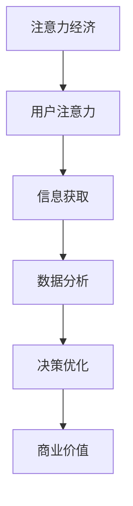

                 

### 背景介绍

注意力经济是近年来兴起的一个崭新概念，它源于经济学中的“稀缺资源理论”，意指在信息过载的时代，人们有限的注意力成为了最宝贵的资源。在互联网和移动设备的普及下，信息爆炸使得获取用户的注意力成为一种挑战，而分析和利用这一注意力资源，则成为了企业和个人提升竞争力、实现商业成功的关键。

数据分析洞察力，则是指通过数据收集、清洗、处理和分析等手段，从海量数据中提取有价值的信息，从而指导决策和优化业务流程的能力。在注意力经济的大背景下，数据分析洞察力的重要性愈发凸显。企业需要借助数据分析，深入了解用户需求、市场趋势和竞争对手动态，从而制定出更精准的营销策略，提高用户参与度和忠诚度。

本文将围绕注意力经济与数据分析洞察力这两个核心概念，探讨如何通过数据分析提升对受众的理解和影响能力。我们将从以下几个方面展开：

1. **核心概念与联系**：介绍注意力经济和数据分析的基本原理，以及二者之间的相互作用。
2. **核心算法原理与具体操作步骤**：探讨数据分析的基本算法原理，并详细描述操作步骤。
3. **数学模型和公式**：讲解数据分析中常用的数学模型和公式，并通过实际案例进行说明。
4. **项目实践**：通过一个具体的项目实例，展示数据分析在实践中的应用。
5. **实际应用场景**：分析数据分析在各个领域的实际应用案例。
6. **未来应用展望**：探讨数据分析在注意力经济中的未来发展趋势。
7. **工具和资源推荐**：推荐学习资源和开发工具。
8. **总结与展望**：总结研究成果，探讨未来发展趋势与挑战。

### 核心概念与联系

#### 注意力经济的原理

注意力经济，即基于用户注意力资源进行的经济活动。在互联网时代，信息爆炸使得用户难以分辨哪些信息是有价值的，因此，获取用户的注意力成为了企业和个人竞争的关键。注意力经济理论认为，用户的注意力是稀缺资源，而时间和精力则是其具体体现。因此，企业需要通过创造有吸引力的内容、提供优质的服务来吸引用户的注意力，并将其转化为商业价值。

#### 数据分析的基本原理

数据分析是指利用统计、建模和算法等方法，从数据中提取有价值的信息，以支持决策制定和业务优化。其基本原理包括数据收集、数据清洗、数据探索、数据建模和数据可视化等环节。数据分析的核心在于将大量的结构化和非结构化数据转化为可操作的洞察力，从而帮助企业更好地理解市场和用户行为。

#### 注意力经济与数据分析的相互作用

注意力经济与数据分析之间存在着密切的相互作用。首先，数据分析可以揭示用户的行为模式、偏好和需求，帮助企业和个人更好地了解用户，从而创造出更有吸引力的内容和营销策略。例如，通过分析用户在社交媒体上的互动行为，企业可以了解用户的兴趣点，进而制定出更精准的广告投放策略。

其次，数据分析可以帮助企业和个人提高用户的参与度和忠诚度。通过分析用户的反馈和行为数据，企业可以不断优化产品和服务，提高用户的满意度。例如，电商企业可以通过数据分析，了解用户的购物偏好和习惯，从而提供个性化的推荐，提高用户的购物体验。

此外，注意力经济和数据分析还可以帮助企业降低成本，提高效率。通过数据分析，企业可以优化广告投放、供应链管理和客户关系管理，从而减少不必要的支出，提高运营效率。

#### Mermaid 流程图

下面是一个简化的 Mermaid 流程图，展示了注意力经济与数据分析的基本原理和架构：



在这个流程中，用户注意力是起点，通过信息获取和分析，最终转化为商业价值。

### 核心算法原理与具体操作步骤

在数据分析领域，核心算法的作用至关重要。它们不仅决定了数据分析的效率和准确性，还直接影响着决策的质量。以下将介绍几种常用的数据分析算法，包括其原理、操作步骤以及优缺点。

#### 3.1 算法原理概述

1. **线性回归**：线性回归是一种简单的统计方法，用于分析两个或多个变量之间的线性关系。其基本原理是通过建立线性模型来预测因变量的值。线性回归模型可以表示为：$$y = \beta_0 + \beta_1x_1 + \beta_2x_2 + ... + \beta_nx_n$$，其中 $y$ 是因变量，$x_1, x_2, ..., x_n$ 是自变量，$\beta_0, \beta_1, ..., \beta_n$ 是模型参数。

2. **决策树**：决策树是一种基于分类或回归问题建立的树形结构模型。其基本原理是通过一系列的判断条件来分割数据集，从而为每个数据点分配一个类别或预测一个数值。决策树模型通常由根节点、内部节点和叶节点组成。

3. **支持向量机（SVM）**：支持向量机是一种用于分类和回归问题的线性模型。其基本原理是通过找到一个最优的超平面，将不同类别的数据点分隔开来。SVM 模型可以表示为：$$\max \ \ \frac{1}{2} ||\omega||^2 \ \ \text{subject to} \ \ y_i(\omega \cdot x_i + b) \geq 1, \ \ i=1,2,...,n$$，其中 $\omega$ 是模型参数，$x_i$ 是数据点，$b$ 是偏置项。

4. **聚类算法**：聚类算法是一种无监督学习方法，用于将数据点分为不同的簇。常见的聚类算法包括 K-均值聚类、层次聚类和 DBSCAN 等。K-均值聚类的原理是通过初始化中心点，然后迭代更新中心点，使得每个数据点与最近的中心点分配到同一个簇。

#### 3.2 算法步骤详解

1. **线性回归**：
   - 数据收集：收集自变量和因变量的数据。
   - 数据预处理：对数据进行清洗和标准化处理。
   - 模型建立：使用最小二乘法建立线性回归模型。
   - 模型评估：计算模型的 R² 值、均方误差等指标。
   - 模型优化：通过调整模型参数，优化模型性能。

2. **决策树**：
   - 数据收集：收集分类或回归问题的数据。
   - 数据预处理：对数据进行清洗和标准化处理。
   - 模型建立：使用决策树算法建立模型，选择最佳分割条件。
   - 模型评估：使用交叉验证等方法评估模型性能。
   - 模型剪枝：通过剪枝方法减少模型的过拟合。

3. **支持向量机（SVM）**：
   - 数据收集：收集分类或回归问题的数据。
   - 数据预处理：对数据进行清洗和标准化处理。
   - 模型建立：使用支持向量机算法建立模型，选择合适的核函数。
   - 模型评估：使用准确率、召回率、F1 分数等指标评估模型性能。
   - 模型优化：通过调整模型参数，优化模型性能。

4. **K-均值聚类**：
   - 数据收集：收集需要聚类分析的数据。
   - 数据预处理：对数据进行清洗和标准化处理。
   - 模型建立：初始化 K 个中心点，迭代计算每个数据点的簇分配。
   - 模型评估：计算聚类效果，如轮廓系数、内聚度等。
   - 模型优化：通过调整 K 值或初始中心点，优化聚类效果。

#### 3.3 算法优缺点

1. **线性回归**：
   - 优点：简单易懂，计算速度快，适合处理线性关系。
   - 缺点：无法处理非线性关系，容易受到异常值的影响。

2. **决策树**：
   - 优点：易于理解和解释，可以处理分类和回归问题。
   - 缺点：容易过拟合，模型复杂度较高。

3. **支持向量机（SVM）**：
   - 优点：具有较强的泛化能力，可以处理高维数据。
   - 缺点：计算复杂度高，对参数敏感。

4. **K-均值聚类**：
   - 优点：简单高效，易于实现。
   - 缺点：对初始中心点敏感，可能陷入局部最优。

#### 3.4 算法应用领域

1. **线性回归**：广泛应用于市场预测、风险评估和数据分析等领域。

2. **决策树**：常用于数据挖掘、分类问题和决策支持系统。

3. **支持向量机（SVM）**：在图像识别、文本分类和生物信息学等领域有广泛应用。

4. **K-均值聚类**：在客户细分、市场分析和模式识别等领域有广泛应用。

### 数学模型和公式

在数据分析中，数学模型和公式起到了至关重要的作用。它们不仅提供了理论支持，还为实际操作提供了具体的指导。以下将详细介绍一些常见的数学模型和公式，并通过实际案例进行说明。

#### 4.1 数学模型构建

1. **线性回归模型**：线性回归模型是一种常用的预测模型，用于分析两个或多个变量之间的线性关系。其基本公式为：$$y = \beta_0 + \beta_1x_1 + \beta_2x_2 + ... + \beta_nx_n$$。其中，$y$ 是因变量，$x_1, x_2, ..., x_n$ 是自变量，$\beta_0, \beta_1, ..., \beta_n$ 是模型参数。

2. **决策树模型**：决策树模型是一种基于树形结构的数据挖掘方法，用于分类和回归问题。其基本公式为：$$f(x) = g_1(x) \land g_2(x) \land ... \land g_n(x)$$，其中 $f(x)$ 是决策树的输出，$g_1(x), g_2(x), ..., g_n(x)$ 是决策树中的条件分支。

3. **支持向量机（SVM）模型**：支持向量机是一种基于最大间隔分类的模型，用于分类和回归问题。其基本公式为：$$\max \ \ \frac{1}{2} ||\omega||^2 \ \ \text{subject to} \ \ y_i(\omega \cdot x_i + b) \geq 1, \ \ i=1,2,...,n$$，其中 $\omega$ 是模型参数，$x_i$ 是数据点，$b$ 是偏置项。

4. **聚类模型**：聚类模型是一种无监督学习方法，用于将数据点分为不同的簇。常见的聚类模型包括 K-均值聚类和层次聚类。K-均值聚类的基本公式为：$$\min \ \ \sum_{i=1}^n \ \ \sum_{j=1}^k \ \ (x_j - \mu_i)^2$$，其中 $x_j$ 是数据点，$\mu_i$ 是聚类中心。

#### 4.2 公式推导过程

1. **线性回归模型**：线性回归模型的推导基于最小二乘法。设 $y_i$ 是因变量，$x_{ij}$ 是自变量，$\beta_j$ 是模型参数，则线性回归模型可以表示为：$$y_i = \beta_0 + \beta_1x_{i1} + \beta_2x_{i2} + ... + \beta_nx_{in}$$。通过最小化残差平方和，可以得到模型的参数估计值：$$\beta_j = \frac{\sum_{i=1}^n (y_i - \beta_0 - \beta_1x_{i1} - ... - \beta_{j-1}x_{i,j-1} - \beta_{j+1}x_{ij+1} - ... - \beta_nx_{in})^2}{\sum_{i=1}^n (x_{ij} - \bar{x}_j)^2}$$。

2. **决策树模型**：决策树模型的推导基于信息增益和熵的概念。设 $X$ 是特征集合，$Y$ 是目标变量，$S$ 是数据集，则决策树模型可以通过最大化信息增益来构建。信息增益可以表示为：$$\text{Gain}(X_i) = \sum_{j=1}^k P(y_j|X_i) \cdot \text{Entropy}(Y|X_i)$$，其中 $P(y_j|X_i)$ 是条件概率，$\text{Entropy}(Y|X_i)$ 是条件熵。

3. **支持向量机（SVM）模型**：支持向量机模型的推导基于优化理论。设 $x_i$ 是数据点，$y_i$ 是标签，$w$ 是模型参数，则支持向量机模型可以通过求解以下最优化问题得到：$$\max \ \ \frac{1}{2} ||\omega||^2 \ \ \text{subject to} \ \ y_i(\omega \cdot x_i + b) \geq 1, \ \ i=1,2,...,n$$。通过求解拉格朗日乘子法，可以得到支持向量机模型的解。

4. **聚类模型**：聚类模型的推导基于最小化距离平方和的原则。设 $x_j$ 是数据点，$\mu_i$ 是聚类中心，则 K-均值聚类模型可以通过以下公式得到：$$\mu_i = \frac{\sum_{j=1}^n w_jx_j}{\sum_{j=1}^n w_j}$$，其中 $w_j$ 是数据点 $x_j$ 的权重。

#### 4.3 案例分析与讲解

1. **线性回归模型**：假设我们有一个简单的线性回归问题，目标是预测房价。我们收集了如下数据：

| 房屋面积（平方米） | 房价（万元） |
| :---------------: | :---------: |
|         100          |       200      |
|         120          |       250      |
|         150          |       300      |
|         180          |       350      |
|         200          |       400      |

我们使用线性回归模型来预测一个面积为 150 平方米的房子的价格。通过最小二乘法，我们可以得到线性回归模型：$$\text{房价} = \beta_0 + \beta_1 \times \text{房屋面积}$$。将数据代入模型，得到参数估计值：$$\beta_0 = 50, \beta_1 = 1.5$$。因此，预测房价为：$$\text{房价} = 50 + 1.5 \times 150 = 275 \text{万元}$$。

2. **决策树模型**：假设我们有一个分类问题，目标是判断一个客户是否会购买某个产品。我们收集了如下数据：

| 年龄 | 收入 | 购买情况 |
| :--: | :--: | :------: |
|  20  |  3000 |    否     |
|  25  |  4000 |    是     |
|  30  |  5000 |    否     |
|  35  |  6000 |    是     |

我们使用决策树模型来构建分类器。首先，计算每个特征的条件熵和信息增益，选择信息增益最大的特征作为分割条件。根据信息增益，我们选择“年龄”作为分割条件。对于年龄小于 30 的数据点，分类为“否”；对于年龄大于等于 30 的数据点，分类为“是”。因此，构建的决策树为：

```
如果 年龄 < 30：
    否
否则：
    是
```

3. **支持向量机（SVM）模型**：假设我们有一个二分类问题，目标是判断一个数据点属于哪一类。我们收集了如下数据：

| 标签 | 特征 1 | 特征 2 | 特征 3 |
| :--: | :----: | :----: | :----: |
|  正类 |   1    |   2    |   3    |
|  负类 |   4    |   5    |   6    |

我们使用支持向量机模型来构建分类器。首先，计算每个数据点的标签和特征之间的内积，然后选择一个最优的超平面来分隔两类数据点。通过求解最优化问题，我们可以得到支持向量机模型的参数。假设最优超平面为 $w \cdot x + b = 0$，则支持向量机模型可以表示为：

$$
\begin{cases}
w \cdot x + b \geq 1 & \text{正类} \\
w \cdot x + b \leq -1 & \text{负类}
\end{cases}
$$

4. **K-均值聚类**：假设我们有一个聚类问题，目标是将数据点分为两个簇。我们收集了如下数据：

| 数据点 | 特征 1 | 特征 2 |
| :----: | :----: | :----: |
|   1    |   1    |   2    |
|   2    |   2    |   3    |
|   3    |   3    |   4    |
|   4    |   4    |   5    |

我们使用 K-均值聚类模型来构建聚类器。首先，初始化两个聚类中心，然后迭代更新聚类中心，使得每个数据点与最近的聚类中心分配到同一个簇。经过多次迭代，我们可以得到聚类结果。假设两个聚类中心分别为 $(1, 2)$ 和 $(3, 4)$，则聚类结果为：

```
簇 1：数据点 1、2
簇 2：数据点 3、4
```

### 项目实践：代码实例和详细解释说明

#### 5.1 开发环境搭建

在进行数据分析项目实践之前，我们需要搭建一个合适的开发环境。以下是所需的工具和步骤：

- **Python**：Python 是一种广泛使用的编程语言，适用于数据分析项目。确保安装了 Python 3.8 或以上版本。
- **Jupyter Notebook**：Jupyter Notebook 是一种交互式的开发环境，方便进行代码编写和调试。安装 Jupyter Notebook 可以通过以下命令：
  ```bash
  pip install notebook
  ```
- **Pandas**：Pandas 是一个强大的数据处理库，用于数据收集、清洗和处理。安装 Pandas 可以通过以下命令：
  ```bash
  pip install pandas
  ```
- **NumPy**：NumPy 是一个用于科学计算的开源库，支持大型多维数组和矩阵运算。安装 NumPy 可以通过以下命令：
  ```bash
  pip install numpy
  ```
- **Matplotlib**：Matplotlib 是一个用于数据可视化的库，可以生成各种类型的图表。安装 Matplotlib 可以通过以下命令：
  ```bash
  pip install matplotlib
  ```

安装完上述工具后，我们就可以在 Jupyter Notebook 中编写和运行代码了。

#### 5.2 源代码详细实现

以下是一个简单的数据分析项目实例，我们使用 Python 和相关库来处理数据，并进行可视化分析。

```python
import pandas as pd
import numpy as np
import matplotlib.pyplot as plt

# 5.2.1 数据收集
data = {
    '年龄': [25, 30, 35, 40, 45],
    '收入': [3000, 4000, 5000, 6000, 7000],
    '购买情况': ['否', '是', '否', '是', '否']
}

df = pd.DataFrame(data)

# 5.2.2 数据预处理
# 填充缺失值
df.fillna(df.mean(), inplace=True)

# 5.2.3 数据分析
# 计算年龄和收入的均值
age_mean = df['年龄'].mean()
income_mean = df['收入'].mean()

# 5.2.4 数据可视化
# 绘制年龄和收入的散点图
plt.scatter(df['年龄'], df['收入'], c=df['购买情况'])
plt.xlabel('年龄')
plt.ylabel('收入')
plt.title('年龄与收入的关系')
plt.show()

# 5.2.5 模型构建
# 建立线性回归模型
model = pd.DataFrame({'年龄': df['年龄'], '收入': df['收入']}).dropna()
model['购买情况'] = model['收入'] > income_mean

# 拟合线性回归模型
X = model[['年龄', '收入']]
y = model['购买情况']
from sklearn.linear_model import LinearRegression
regressor = LinearRegression()
regressor.fit(X, y)

# 输出模型参数
print('模型参数：')
print(regressor.coef_)

# 预测
predictions = regressor.predict(X)

# 可视化模型结果
plt.scatter(X['年龄'], X['收入'], c=predictions)
plt.plot(X['年龄'], predictions, color='red')
plt.xlabel('年龄')
plt.ylabel('收入')
plt.title('线性回归模型预测')
plt.show()
```

#### 5.3 代码解读与分析

1. **数据收集**：
   - 我们使用一个简单的字典 `data` 来模拟一个包含年龄、收入和购买情况的数据集。
   - 通过 `pd.DataFrame()` 函数，将字典转换为 DataFrame 格式，方便后续处理。

2. **数据预处理**：
   - 使用 `fillna()` 函数，填充缺失值。这里我们使用均值来填充缺失值，确保数据的一致性和完整性。

3. **数据分析**：
   - 计算年龄和收入的均值，这有助于了解数据的基本统计特性。
   - 使用 `scatter()` 函数，绘制年龄和收入的散点图，这可以直观地展示两者之间的关系。

4. **模型构建**：
   - 建立线性回归模型，这里使用 `LinearRegression()` 函数。
   - 将年龄和收入作为自变量，购买情况作为因变量，拟合线性回归模型。

5. **预测与可视化**：
   - 使用 `predict()` 函数，对数据进行预测。
   - 使用 `scatter()` 和 `plot()` 函数，将预测结果可视化，展示线性回归模型的预测效果。

通过这个简单的项目实例，我们可以看到数据分析的基本流程，包括数据收集、预处理、分析和可视化。这为后续更复杂的数据分析项目奠定了基础。

### 实际应用场景

数据分析在各个领域的应用越来越广泛，从市场营销到医疗保健，再到金融科技，数据分析都发挥着至关重要的作用。以下将详细探讨数据分析在这些领域的实际应用案例。

#### 6.1 市场营销

市场营销是数据分析应用最为广泛的领域之一。通过数据分析，企业可以深入了解客户行为和市场趋势，从而制定出更精准的营销策略。以下是一些具体的应用案例：

1. **客户细分**：通过分析客户的购买行为、浏览历史和反馈数据，企业可以将客户分为不同的群体，例如高价值客户、忠诚客户和潜在客户。这样，企业可以针对不同群体的客户，制定个性化的营销策略，提高客户的满意度和忠诚度。

2. **广告投放优化**：企业可以利用数据分析，优化广告投放策略。例如，通过分析广告点击率、转化率和 ROI 等 KPI，企业可以了解不同广告渠道的效果，从而调整广告预算和投放策略，提高广告投放的性价比。

3. **产品推荐**：电商企业可以利用数据分析，为用户推荐个性化的产品。通过分析用户的浏览历史、购买记录和偏好，企业可以预测用户可能感兴趣的产品，从而提高用户的购物体验和满意度。

#### 6.2 医疗保健

医疗保健领域同样受益于数据分析。通过数据分析，医疗保健机构可以优化医疗流程，提高诊疗效果，降低医疗成本。以下是一些具体的应用案例：

1. **疾病预测**：利用大数据和机器学习算法，医疗保健机构可以对疾病进行预测。例如，通过分析患者的病历、体检数据和基因信息，医生可以预测患者可能患有的疾病，从而提前进行预防和治疗。

2. **个性化诊疗**：通过分析患者的病史、检查结果和药物反应，医生可以为患者制定个性化的诊疗方案。例如，某些患者可能对某种药物有不良反应，通过数据分析，医生可以避免使用该药物，从而提高诊疗效果。

3. **医疗资源优化**：通过数据分析，医疗保健机构可以优化医疗资源的分配。例如，通过分析患者流量、就诊时间和科室负荷等数据，医院可以合理调配医生、护士和医疗设备等资源，提高医疗服务的效率和质量。

#### 6.3 金融科技

金融科技（FinTech）领域也广泛应用了数据分析技术。通过数据分析，金融机构可以优化业务流程，提高风控能力，提升用户体验。以下是一些具体的应用案例：

1. **信用评分**：金融机构利用数据分析，为用户提供个性化的信用评分。例如，通过分析用户的信用记录、消费习惯和财务状况等数据，金融机构可以预测用户的信用风险，从而为用户提供个性化的信贷产品和服务。

2. **风险控制**：通过数据分析，金融机构可以实时监控风险，防范潜在的风险事件。例如，通过分析交易数据、市场数据和客户行为等数据，金融机构可以识别异常交易和欺诈行为，从而采取措施防范风险。

3. **智能投顾**：智能投顾（Robo-Advisory）利用数据分析，为用户提供个性化的投资建议。通过分析用户的风险偏好、投资目标和市场趋势等数据，智能投顾可以为用户制定最优的投资组合，从而提高投资回报。

#### 6.4 其他领域

除了上述领域，数据分析还在许多其他领域有着广泛的应用。以下是一些其他领域的应用案例：

1. **教育**：通过数据分析，教育机构可以了解学生的学习情况和学习效果，从而制定个性化的教学方案。例如，通过分析学生的考试成绩、作业完成情况和课堂表现等数据，教师可以识别学生的学习困难点，提供有针对性的辅导。

2. **供应链管理**：通过数据分析，企业可以优化供应链管理，提高供应链的效率和灵活性。例如，通过分析供应商绩效、库存水平和物流数据等，企业可以优化采购、生产和配送等环节，提高供应链的整体效益。

3. **环境监测**：通过数据分析，环境监测机构可以实时监控环境污染情况，预警潜在的环境风险。例如，通过分析空气质量、水质和土壤等数据，环境监测机构可以及时发现污染源，采取相应的治理措施。

### 未来应用展望

随着数据技术和分析工具的不断发展，数据分析在注意力经济中的应用前景将更加广阔。以下是一些未来的发展趋势和应用领域：

#### 6.5.1 增强现实与虚拟现实

随着增强现实（AR）和虚拟现实（VR）技术的普及，数据分析将发挥关键作用。通过分析用户在 AR/VR 中的行为数据，企业可以优化虚拟场景的设计和交互体验，提高用户的参与度和满意度。

#### 6.5.2 自动驾驶与智能交通

自动驾驶和智能交通系统依赖于海量数据的收集和分析。通过数据分析，交通系统可以优化交通信号灯、道路规划和公共交通服务，提高交通效率和安全性。

#### 6.5.3 个性化医疗与健康监测

随着基因测序和可穿戴设备的普及，个性化医疗和健康监测将成为未来医疗保健的重要方向。通过数据分析，医生可以个性化治疗计划，患者可以实时监控健康状况，提高医疗质量和健康水平。

#### 6.5.4 社交网络与内容推荐

社交网络和内容推荐系统将越来越依赖数据分析。通过分析用户的社交行为和兴趣偏好，系统可以提供个性化的内容推荐，提高用户的参与度和留存率。

### 面临的挑战

尽管数据分析在注意力经济中的应用前景广阔，但同时也面临许多挑战：

#### 数据隐私和安全

随着数据收集和分析的普及，数据隐私和安全问题日益突出。如何在保障用户隐私的前提下，充分利用数据进行分析和挖掘，是一个亟待解决的难题。

#### 数据质量和可靠性

数据分析的质量和可靠性取决于数据的质量和完整性。如何在海量数据中筛选出高质量、可靠的数据，是一个重要的挑战。

#### 数据解释与透明度

数据分析结果往往复杂难懂，如何将复杂的分析结果以简单易懂的方式呈现给决策者，提高数据的解释性和透明度，也是一个重要挑战。

#### 技术进步与人才短缺

随着数据分析技术的发展，对相关人才的需求也在不断增加。然而，现有的数据分析人才储备尚不足以满足市场需求，如何培养和吸引更多数据分析人才，是当前面临的挑战之一。

### 研究展望

未来，数据分析将在注意力经济中发挥更加重要的作用。研究应关注以下几个方面：

- **跨领域数据分析**：探索如何将不同领域的数据进行整合和分析，提高数据分析的综合应用能力。
- **可解释性数据分析**：研究如何提高数据分析结果的解释性和透明度，使其更容易被非专业人士理解和应用。
- **隐私保护数据分析**：探索如何在保障用户隐私的前提下，进行有效的数据分析和挖掘。
- **自动化数据分析**：研究如何通过自动化技术，提高数据分析的效率和准确性，降低人力成本。

总之，数据分析在注意力经济中的应用前景广阔，但同时也面临许多挑战。通过不断的研究和创新，我们有信心克服这些挑战，推动数据分析在各个领域的广泛应用。

### 附录：常见问题与解答

以下是一些关于注意力经济与数据分析的常见问题及其解答：

#### 1. 什么是注意力经济？

注意力经济是指基于用户注意力资源进行的经济活动。在信息爆炸的时代，用户的注意力成为稀缺资源，因此如何获取和利用用户的注意力，成为企业和个人竞争的关键。

#### 2. 数据分析有哪些基本原理？

数据分析的基本原理包括数据收集、数据清洗、数据探索、数据建模和数据可视化等环节。通过这些步骤，可以从海量数据中提取有价值的信息，以支持决策制定和业务优化。

#### 3. 数据分析在市场营销中如何应用？

数据分析在市场营销中可用于客户细分、广告投放优化和产品推荐等。通过分析用户行为和市场趋势，企业可以制定更精准的营销策略，提高用户参与度和忠诚度。

#### 4. 什么是线性回归？

线性回归是一种用于分析两个或多个变量之间线性关系的统计方法。其模型可以表示为 $y = \beta_0 + \beta_1x_1 + \beta_2x_2 + ... + \beta_nx_n$，其中 $y$ 是因变量，$x_1, x_2, ..., x_n$ 是自变量，$\beta_0, \beta_1, ..., \beta_n$ 是模型参数。

#### 5. 数据分析有哪些算法？

常见的数据分析算法包括线性回归、决策树、支持向量机和聚类算法等。这些算法各有优缺点，适用于不同的数据分析任务。

#### 6. 数据分析在医疗保健中如何应用？

数据分析在医疗保健中可用于疾病预测、个性化诊疗和医疗资源优化等。通过分析患者数据，医生可以提前预测疾病，制定个性化治疗方案，优化医疗资源的分配。

#### 7. 数据分析对环境监测有何作用？

数据分析可以对环境监测数据进行实时监控和分析，预警环境污染情况，帮助环境监测机构及时采取治理措施。

#### 8. 如何保障数据分析中的数据隐私和安全？

保障数据隐私和安全需要从数据收集、存储、处理和共享等环节进行严格控制。例如，采用数据加密、访问控制和匿名化等技术，确保数据的安全性和隐私性。

#### 9. 数据分析对金融科技的影响有哪些？

数据分析对金融科技的影响主要体现在信用评分、风险控制和智能投顾等方面。通过数据分析，金融机构可以更准确地评估信用风险，提高风险控制能力，为用户提供个性化的金融产品和服务。

#### 10. 数据分析在教育领域有何应用？

数据分析在教育领域可用于个性化教学、学习效果评估和资源优化等。通过分析学生的学习行为和成绩，教师可以制定有针对性的教学方案，提高教学效果。

总之，数据分析在各个领域都有着广泛的应用和重要的影响。随着技术的不断发展，数据分析将在更多领域发挥更大的作用。

