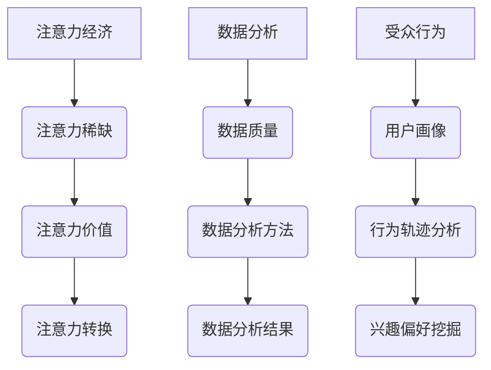

                 

在这个数字化时代，数据已经成为企业和个人不可或缺的重要资源。从大数据、人工智能到机器学习，数据分析已经广泛应用于各个领域。然而，如何从海量数据中提取有价值的信息，如何理解受众的行为，以及如何将这些洞察转化为实际的商业价值，成为了当今企业面临的重要挑战。本文将探讨注意力经济与数据分析的深度融合，旨在帮助读者理解受众行为背后的逻辑，并为其提供实用的方法和工具。

## 关键词

- 注意力经济
- 数据分析
- 受众行为
- 数据洞见
- 商业价值

## 摘要

本文首先介绍了注意力经济的概念及其在当今社会中的重要性，随后探讨了数据分析的基本原理和常用工具。接着，文章详细分析了如何通过数据分析来理解受众行为，包括用户画像、行为轨迹分析、兴趣偏好挖掘等。随后，文章提出了利用数据分析提升企业营销策略的方法，并通过实际案例进行了说明。最后，文章对未来的发展趋势和挑战进行了展望，为读者提供了有益的参考。

## 1. 背景介绍

### 注意力经济的崛起

随着互联网的普及和智能手机的广泛应用，人们的注意力变得越来越稀缺。在这个信息过载的时代，如何吸引并保持用户的注意力，成为了企业竞争的关键。注意力经济应运而生，它指的是通过创造有价值的内容和体验，吸引并保持用户的注意力，从而实现商业价值的增长。

### 数据分析的重要性

数据分析作为数据科学的核心，已经广泛应用于商业、医疗、金融、教育等领域。通过分析海量数据，企业可以深入了解用户需求，优化产品设计，提升服务质量，实现精细化运营。特别是在市场营销领域，数据分析已经成为提升营销效果、降低营销成本的重要工具。

### 受众行为的理解

理解受众行为对于企业来说至关重要。只有深入了解用户的行为习惯、兴趣偏好和需求，企业才能制定出精准的营销策略，实现用户转化和留存。然而，受众行为具有复杂性和多变性，如何从海量数据中提取有价值的信息，成为了企业面临的一大挑战。

## 2. 核心概念与联系

### 注意力经济

注意力经济是指通过创造有价值的内容和体验，吸引并保持用户的注意力，从而实现商业价值的增长。它基于以下几个核心概念：

1. **注意力稀缺**：在信息爆炸的时代，用户的注意力变得稀缺。企业需要通过有价值的内容和体验来吸引并保持用户的注意力。
2. **注意力价值**：用户的注意力是有价值的。企业通过吸引并保持用户的注意力，可以提升品牌知名度、用户黏性和销售额。
3. **注意力转换**：将用户的注意力转化为实际的商业价值，如广告收入、产品销售额、用户忠诚度等。

### 数据分析

数据分析是指通过统计、建模、挖掘等方法，从海量数据中提取有价值的信息。在数据分析中，以下几个核心概念至关重要：

1. **数据质量**：高质量的数据是数据分析的基础。数据质量包括完整性、准确性、一致性、时效性等方面。
2. **数据分析方法**：包括统计分析、机器学习、数据挖掘等方法。不同的分析方法适用于不同类型的数据和业务场景。
3. **数据分析结果**：数据分析结果包括数据可视化、报告、预测等。通过数据分析结果，企业可以做出更明智的决策。

### 受众行为

受众行为是指用户在接触和使用产品或服务过程中所表现出的行为模式。理解受众行为对于企业来说至关重要，以下是一些核心概念：

1. **用户画像**：用户画像是对用户的基本属性和行为特征进行描述，用于精准营销和用户细分。
2. **行为轨迹分析**：行为轨迹分析是对用户在产品或服务中的行为路径进行分析，用于优化用户体验。
3. **兴趣偏好挖掘**：兴趣偏好挖掘是从用户行为数据中挖掘出用户感兴趣的内容和产品，用于个性化推荐。

### 核心概念原理和架构的 Mermaid 流程图



## 3. 核心算法原理 & 具体操作步骤

### 3.1 算法原理概述

在本文中，我们将介绍几种常用的数据分析算法，包括用户画像算法、行为轨迹分析算法和兴趣偏好挖掘算法。这些算法的基本原理如下：

1. **用户画像算法**：基于用户的属性和行为数据，构建用户的基本属性和行为特征模型，用于精准营销和用户细分。
2. **行为轨迹分析算法**：通过分析用户在产品或服务中的行为路径，挖掘用户的行为模式，用于优化用户体验。
3. **兴趣偏好挖掘算法**：从用户行为数据中挖掘出用户感兴趣的内容和产品，用于个性化推荐。

### 3.2 算法步骤详解

1. **用户画像算法**
   - 数据收集：收集用户的属性和行为数据，如年龄、性别、兴趣标签、购买记录等。
   - 数据清洗：对数据进行去重、缺失值填充、异常值处理等，确保数据质量。
   - 特征工程：对原始数据进行处理和转换，提取有价值的特征，如词频、主题模型等。
   - 模型构建：使用机器学习算法，如聚类、决策树、神经网络等，对特征进行建模，构建用户画像。
   - 结果评估：对模型进行评估，如准确率、召回率、F1值等。

2. **行为轨迹分析算法**
   - 数据收集：收集用户在产品或服务中的行为数据，如点击、浏览、购买等。
   - 数据预处理：对行为数据进行去重、排序、窗口划分等处理，确保数据质量。
   - 路径分析：通过分析用户的行为路径，挖掘用户的行为模式，如高频路径、低频路径等。
   - 结果可视化：使用数据可视化工具，如 Matplotlib、Plotly 等，将分析结果呈现出来。

3. **兴趣偏好挖掘算法**
   - 数据收集：收集用户的行为数据，如浏览记录、购买记录等。
   - 数据预处理：对行为数据进行去重、缺失值填充、时间窗口划分等处理。
   - 相似度计算：计算用户之间的相似度，如余弦相似度、Jaccard 相似度等。
   - 个性化推荐：根据用户的行为数据和相似度计算，为用户推荐感兴趣的内容和产品。

### 3.3 算法优缺点

1. **用户画像算法**
   - 优点：能够对用户进行精准画像，用于个性化推荐和精准营销。
   - 缺点：构建用户画像需要大量数据，且数据处理和特征工程过程复杂。

2. **行为轨迹分析算法**
   - 优点：能够挖掘用户的行为模式，用于优化用户体验。
   - 缺点：对数据量要求较高，且分析过程复杂。

3. **兴趣偏好挖掘算法**
   - 优点：能够为用户推荐感兴趣的内容和产品，提升用户满意度。
   - 缺点：推荐结果可能存在偏差，且需要大量计算资源。

### 3.4 算法应用领域

1. **用户画像算法**
   - 应用领域：电子商务、在线广告、金融风控、社交网络等。

2. **行为轨迹分析算法**
   - 应用领域：电子商务、在线教育、智能医疗等。

3. **兴趣偏好挖掘算法**
   - 应用领域：推荐系统、内容分发、智能广告等。

## 4. 数学模型和公式 & 详细讲解 & 举例说明

### 4.1 数学模型构建

在数据分析中，常用的数学模型包括聚类模型、决策树模型、神经网络模型等。以下是一个简单的聚类模型——K-means算法的数学模型构建：

1. **目标函数**：最小化各个簇内样本的平方误差和。
   $$J(\theta) = \sum_{i=1}^{k} \sum_{x \in S_i} ||x - \mu_i||^2$$
   其中，$k$为簇的个数，$S_i$为第$i$个簇的样本集合，$\mu_i$为第$i$个簇的中心。

2. **优化方法**：梯度下降法。
   $$\mu_i^{t+1} = \frac{1}{|S_i|} \sum_{x \in S_i} x$$
   其中，$t$为迭代次数。

3. **初始化**：随机选择$k$个初始中心点。

### 4.2 公式推导过程

以K-means算法为例，说明公式的推导过程：

1. **目标函数**：平方误差和
   $$J(\theta) = \sum_{i=1}^{k} \sum_{x \in S_i} ||x - \mu_i||^2$$
   其中，$||x - \mu_i||^2$为样本$x$与簇中心$\mu_i$之间的欧氏距离。

2. **优化方法**：梯度下降法
   $$\mu_i^{t+1} = \frac{1}{|S_i|} \sum_{x \in S_i} x$$
   其中，$|S_i|$为簇$S_i$中样本的数量。

3. **初始化**：随机选择$k$个初始中心点

### 4.3 案例分析与讲解

假设我们有以下5个数据点：

$$
\begin{aligned}
x_1 &= (1, 2), \\
x_2 &= (2, 3), \\
x_3 &= (4, 5), \\
x_4 &= (5, 6), \\
x_5 &= (9, 10).
\end{aligned}
$$

我们选择K-means算法对其进行聚类，设簇的个数为2。

1. **初始化**：随机选择2个初始中心点，如$(1, 4)$和$(5, 7)$。
2. **迭代过程**：
   - 第一次迭代：
     - 计算每个数据点与两个中心点的距离，选择距离较近的中心点作为簇中心。
     - 计算新的簇中心。
   - 重复迭代，直到满足停止条件（如收敛条件或最大迭代次数）。

经过几次迭代后，我们得到最终的簇中心和聚类结果。

### 4.4 结果展示

- 簇中心：
  $$
  \begin{aligned}
  \mu_1 &= (2.5, 5.5), \\
  \mu_2 &= (7.5, 8.5).
  \end{aligned}
  $$
- 聚类结果：
  - 簇1：$(1, 2), (2, 3)$
  - 簇2：$(4, 5), (5, 6), (9, 10)$

通过这个简单的案例，我们可以看到K-means算法的基本原理和操作步骤。在实际应用中，我们可以根据具体问题和数据特点，选择合适的聚类算法和参数设置，以获得更好的聚类效果。

## 5. 项目实践：代码实例和详细解释说明

### 5.1 开发环境搭建

在本节中，我们将使用Python语言和相关的数据科学库（如NumPy、Pandas、Matplotlib等）来实现K-means聚类算法。首先，确保你已经安装了Python环境和相关库。

```shell
pip install numpy pandas matplotlib scikit-learn
```

### 5.2 源代码详细实现

以下是K-means聚类算法的Python代码实现：

```python
import numpy as np
import matplotlib.pyplot as plt
from sklearn.cluster import KMeans

# 数据集
X = np.array([[1, 2], [2, 3], [4, 5], [5, 6], [9, 10]])

# 初始化KMeans模型，设置聚类个数k=2
kmeans = KMeans(n_clusters=2, random_state=0)

# 模型拟合
kmeans.fit(X)

# 获取聚类结果
labels = kmeans.predict(X)
centers = kmeans.cluster_centers_

# 可视化
plt.scatter(X[:, 0], X[:, 1], c=labels, s=100, cmap='viridis')
plt.scatter(centers[:, 0], centers[:, 1], s=300, c='red', label='Centroids')
plt.title('K-means Clustering')
plt.xlabel('Feature 1')
plt.ylabel('Feature 2')
plt.legend()
plt.show()
```

### 5.3 代码解读与分析

- **数据集**：我们使用了一个简单的二维数据集，包含5个样本。
- **KMeans模型初始化**：我们初始化了一个KMeans模型，并设置了聚类个数k=2。
- **模型拟合**：使用`fit()`方法对数据进行聚类。
- **获取聚类结果**：使用`predict()`方法获取每个样本的聚类标签。
- **可视化**：使用Matplotlib库将聚类结果可视化。

### 5.4 运行结果展示

运行上述代码后，你将看到一个散点图，其中每个样本的颜色表示其所属的簇，红色的点是簇中心。通过可视化结果，我们可以直观地看到K-means算法对数据的聚类效果。


## 6. 实际应用场景

### 6.1 用户行为分析

在电子商务领域，用户行为分析是企业提升用户体验和销售额的关键。通过分析用户在网站上的浏览、点击、购买等行为，企业可以了解用户的兴趣偏好，优化产品推荐和营销策略。例如，使用K-means算法对用户行为数据进行聚类，可以识别出不同类型的用户群体，从而针对性地推送个性化的产品推荐和促销活动。

### 6.2 广告投放优化

在线广告投放是互联网公司重要的收入来源。通过数据分析，企业可以识别出高价值的用户群体，并针对性地进行广告投放。例如，使用用户画像算法对用户进行细分，可以识别出对某一广告感兴趣的用户群体，从而提高广告的点击率和转化率。

### 6.3 健康数据分析

在医疗领域，健康数据分析可以帮助医疗机构了解患者的健康状况，优化诊疗方案。例如，通过对患者的历史数据进行分析，可以发现高风险人群，提前进行预防和干预。此外，行为轨迹分析可以用于患者康复期间的跟踪和管理，提高康复效果。

### 6.4 教育数据分析

在教育领域，数据分析可以帮助学校了解学生的学习情况，优化课程设置和教育资源分配。例如，通过对学生考试成绩和行为数据进行分析，可以发现学生的学习难点和兴趣点，从而针对性地调整教学策略。此外，兴趣偏好挖掘算法可以用于为学生推荐感兴趣的课程和资源。

## 7. 工具和资源推荐

### 7.1 学习资源推荐

1. **《Python数据分析基础教程：NumPy学习指南》**：适合初学者，系统介绍了NumPy库的基本用法。
2. **《数据科学入门》**：涵盖数据科学的基本概念、方法和工具，适合初学者和进阶者。
3. **《Python数据科学手册》**：详细介绍了Python在数据科学领域的应用，包括数据分析、数据可视化、机器学习等。

### 7.2 开发工具推荐

1. **Jupyter Notebook**：方便编写和运行Python代码，支持多种编程语言和扩展库。
2. **PyCharm**：强大的Python集成开发环境，支持代码调试、性能分析和自动化测试。
3. **Spyder**：适用于科学计算和数据分析的IDE，内置了多种数据分析库。

### 7.3 相关论文推荐

1. **"K-Means Clustering: A Review"**：系统总结了K-means聚类算法的基本原理和应用场景。
2. **"User Behavior Analysis in E-commerce: A Data-Driven Approach"**：讨论了用户行为分析在电子商务中的应用。
3. **"Attention Economics: Capturing the Value of Attention in the Age of Overabundance"**：探讨了注意力经济的概念和实际应用。

## 8. 总结：未来发展趋势与挑战

### 8.1 研究成果总结

本文系统地介绍了注意力经济、数据分析以及受众行为理解的相关概念和算法。通过实践案例，我们展示了如何利用K-means聚类算法进行用户行为分析，并探讨了数据分析在实际应用中的重要性。

### 8.2 未来发展趋势

1. **数据分析算法的优化**：随着数据量的增长和算法的进步，未来的数据分析算法将更加高效和准确。
2. **跨领域融合**：数据分析将在更多领域（如医疗、教育、金融等）得到广泛应用，实现跨领域的融合和创新。
3. **实时数据分析**：实时数据分析将成为重要趋势，为企业提供更及时的数据洞察和决策支持。

### 8.3 面临的挑战

1. **数据质量和隐私保护**：如何保证数据质量，同时保护用户隐私，是一个重要挑战。
2. **算法透明度和可解释性**：如何提高算法的透明度和可解释性，让用户理解和信任数据分析结果，是一个重要课题。
3. **数据安全和法律合规**：如何在保障数据安全的前提下，遵守相关法律法规，是一个需要关注的问题。

### 8.4 研究展望

未来的研究可以关注以下几个方向：

1. **多模态数据分析**：结合不同类型的数据（如文本、图像、音频等），实现更全面的数据分析。
2. **自适应数据分析**：根据用户需求和环境变化，自适应调整数据分析策略和模型。
3. **区块链技术**：利用区块链技术，实现数据的安全共享和隐私保护。

## 9. 附录：常见问题与解答

### 问题1：什么是注意力经济？

注意力经济是指通过创造有价值的内容和体验，吸引并保持用户的注意力，从而实现商业价值的增长。

### 问题2：数据分析有哪些常用的算法？

常用的数据分析算法包括聚类算法（如K-means、DBSCAN）、分类算法（如决策树、支持向量机）、回归算法（如线性回归、逻辑回归）等。

### 问题3：如何保障数据质量？

保障数据质量的方法包括数据清洗、数据去重、异常值处理、缺失值填充等。

### 问题4：数据分析在哪些领域有广泛应用？

数据分析在电子商务、金融、医疗、教育、广告等领域有广泛应用。

### 问题5：如何利用数据分析优化营销策略？

可以通过用户画像、行为轨迹分析、兴趣偏好挖掘等方法，了解用户需求和行为，从而优化营销策略。

### 问题6：如何保障数据分析的透明度和可解释性？

可以通过模型解释性技术（如LIME、SHAP）提高算法的透明度和可解释性。

### 问题7：数据分析中的数据安全和隐私保护问题如何解决？

可以通过数据加密、数据脱敏、隐私保护算法（如差分隐私）等方法解决数据安全和隐私保护问题。

### 问题8：如何进行实时数据分析？

可以通过流数据处理技术（如Apache Kafka、Apache Flink）进行实时数据分析。

### 问题9：什么是用户画像？

用户画像是对用户的基本属性和行为特征进行描述，用于精准营销和用户细分。

### 问题10：什么是行为轨迹分析？

行为轨迹分析是对用户在产品或服务中的行为路径进行分析，用于优化用户体验。

### 问题11：什么是兴趣偏好挖掘？

兴趣偏好挖掘是从用户行为数据中挖掘出用户感兴趣的内容和产品，用于个性化推荐。

### 问题12：什么是多模态数据分析？

多模态数据分析是指结合不同类型的数据（如文本、图像、音频等）进行分析。

### 问题13：什么是自适应数据分析？

自适应数据分析是指根据用户需求和环境变化，自适应调整数据分析策略和模型。

### 问题14：什么是区块链技术？

区块链技术是一种分布式数据库技术，通过密码学保证数据的安全性和不可篡改性。

### 问题15：什么是数据脱敏？

数据脱敏是一种数据保护技术，通过对敏感数据进行加密、掩码等处理，以保护用户隐私。

### 问题16：什么是差分隐私？

差分隐私是一种隐私保护算法，通过引入噪声，使得数据隐私泄露的风险降到最低。

### 问题17：什么是模型解释性技术？

模型解释性技术是指通过解释模型内部的运算过程和决策逻辑，提高算法的透明度和可解释性。

### 问题18：什么是数据可视化？

数据可视化是将数据以图形、图表等形式展示出来，帮助用户直观地理解数据。

### 问题19：什么是流数据处理技术？

流数据处理技术是指对实时数据流进行处理和分析的技术，如Apache Kafka、Apache Flink等。

### 问题20：什么是用户行为分析？

用户行为分析是对用户在产品或服务中的行为模式进行分析，用于优化用户体验和产品设计。

