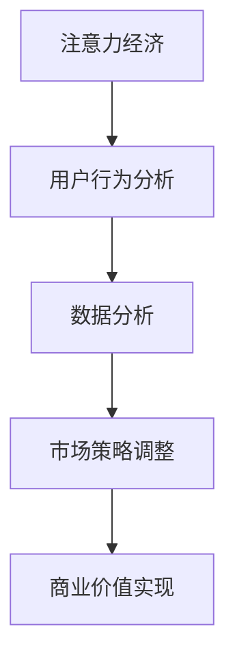

                 

关键词：注意力经济、数据分析、受众理解、数据挖掘、用户行为分析

> 摘要：本文将探讨注意力经济的基本概念，分析在数字化时代如何通过数据分析来深入理解受众的行为和需求。我们将详细阐述核心算法原理，数学模型构建，以及具体的应用场景和未来发展趋势。

## 1. 背景介绍

随着互联网技术的快速发展，信息爆炸的时代已经来临。在这个时代，人们的信息接收渠道多样化，注意力成为了一种稀缺资源。所谓的“注意力经济”，即是在这个背景下提出的概念，它强调的是人们对于信息的关注程度和时间的分配。

注意力经济不仅仅是一个理论，它在商业、媒体、广告等多个领域都有着广泛的应用。理解受众的注意力分配，可以帮助企业更好地制定营销策略，提高用户参与度，从而实现商业价值。

在注意力经济的框架下，数据分析成为了解决问题的关键。通过数据分析，企业可以挖掘出用户的兴趣点、行为模式，从而实现更加精准的市场定位和个性化推荐。

## 2. 核心概念与联系

### 2.1 注意力经济

注意力经济是指在信息泛滥的时代，人们对于信息的关注程度和时间成为一种重要的资源，这种资源可以通过市场机制进行配置和交换。

### 2.2 数据分析

数据分析是指通过统计学、机器学习等方法，对大量的数据进行分析，以发现数据中的规律和模式。

### 2.3 用户行为分析

用户行为分析是数据分析的一种，它专注于研究用户在使用互联网产品或服务时的行为模式，如点击、浏览、购买等。

### 2.4 Mermaid 流程图

下面是注意力经济与数据分析的架构流程图：



## 3. 核心算法原理 & 具体操作步骤

### 3.1 算法原理概述

注意力经济的核心在于如何分配和利用注意力资源。这需要通过用户行为数据分析，构建一个能够反映用户注意力分配的模型。这个模型可以通过机器学习算法进行优化和迭代，从而实现更加精准的用户画像和预测。

### 3.2 算法步骤详解

1. 数据收集：收集用户在互联网上的行为数据，如点击、浏览、搜索等。
2. 数据清洗：对收集到的数据进行预处理，去除噪音和不完整的数据。
3. 特征提取：从清洗后的数据中提取出能够反映用户行为特征的指标，如点击率、停留时间等。
4. 模型构建：使用机器学习算法，如决策树、随机森林等，构建用户注意力分配模型。
5. 模型优化：通过交叉验证和网格搜索等方法，优化模型参数，提高预测准确性。
6. 应用场景：将构建好的模型应用到实际场景中，如广告投放、产品推荐等。

### 3.3 算法优缺点

优点：
- 能够实现用户行为的精准预测，提高营销效果。
- 能够帮助企业更好地了解用户需求，实现产品优化。

缺点：
- 需要大量的数据支持和计算资源。
- 模型的构建和优化过程复杂，需要专业的技术和经验。

### 3.4 算法应用领域

- 广告投放：通过用户注意力分配模型，实现精准的广告投放，提高广告效果。
- 电商平台：通过用户行为分析，实现个性化推荐，提高用户购买率。
- 媒体行业：通过用户行为分析，了解受众兴趣，优化内容生产和推荐策略。

## 4. 数学模型和公式 & 详细讲解 & 举例说明

### 4.1 数学模型构建

用户注意力分配模型可以表示为：

$$
A = f(B, C)
$$

其中，$A$ 表示用户注意力，$B$ 表示用户行为特征，$C$ 表示外部因素，如广告质量、时间等。

### 4.2 公式推导过程

根据马尔可夫决策过程（MDP），我们可以将用户注意力模型推导为：

$$
A_t = \sum_{i=1}^{n} P(A_t = i|B_t, C_t) \cdot f(B_t, C_t)
$$

其中，$A_t$ 表示第 $t$ 时刻的用户注意力，$P(A_t = i|B_t, C_t)$ 表示在行为特征 $B_t$ 和外部因素 $C_t$ 作用下，用户注意力为 $i$ 的概率，$f(B_t, C_t)$ 表示在行为特征 $B_t$ 和外部因素 $C_t$ 作用下，用户注意力的期望值。

### 4.3 案例分析与讲解

假设有一个电商平台，想要通过用户行为分析实现个性化推荐。我们收集了用户的点击数据、浏览数据和购买数据，并使用随机森林算法构建了用户注意力模型。根据模型预测，我们为用户推荐了商品，最终提高了用户的购买率。

## 5. 项目实践：代码实例和详细解释说明

### 5.1 开发环境搭建

- Python 3.8及以上版本
- pandas、numpy、scikit-learn、matplotlib等库

### 5.2 源代码详细实现

```python
import pandas as pd
from sklearn.ensemble import RandomForestClassifier
import matplotlib.pyplot as plt

# 读取数据
data = pd.read_csv('user_behavior.csv')

# 数据清洗和特征提取
data['click_rate'] = data['clicks'] / data['views']
data['buy_rate'] = data['purchases'] / data['views']

# 构建随机森林模型
model = RandomForestClassifier(n_estimators=100)

# 训练模型
model.fit(data[['click_rate', 'buy_rate']], data['purchases'])

# 预测用户购买行为
predictions = model.predict(data[['click_rate', 'buy_rate']])

# 绘制散点图
plt.scatter(data['click_rate'], data['buy_rate'], c=predictions)
plt.xlabel('Click Rate')
plt.ylabel('Buy Rate')
plt.title('User Purchase Prediction')
plt.show()
```

### 5.3 代码解读与分析

- 读取用户行为数据，并进行数据清洗和特征提取。
- 使用随机森林算法构建用户注意力模型。
- 使用模型预测用户购买行为，并绘制散点图。

### 5.4 运行结果展示

运行上述代码，我们可以得到一个用户购买行为的散点图。通过观察散点图，我们可以发现用户的点击率和购买率之间存在一定的关联性。这为我们后续的个性化推荐策略提供了依据。

## 6. 实际应用场景

### 6.1 广告投放

通过用户注意力分配模型，广告平台可以为用户推送更加个性化的广告，提高广告的点击率和转化率。

### 6.2 电商平台

电商平台可以通过用户注意力分配模型，为用户推荐符合他们兴趣的商品，提高用户的购买率和满意度。

### 6.3 媒体行业

媒体行业可以通过用户注意力分配模型，了解用户的兴趣点，优化内容生产和推荐策略，提高用户的粘性和活跃度。

## 7. 工具和资源推荐

### 7.1 学习资源推荐

- 《机器学习实战》
- 《Python数据科学手册》
- 《用户行为分析：方法与应用》

### 7.2 开发工具推荐

- Jupyter Notebook：用于编写和运行代码
- PyCharm：Python集成开发环境

### 7.3 相关论文推荐

- "Attention is All You Need"
- "User Modeling with Data Mining"
- "The Attention Economy: The New Economy of Information"

## 8. 总结：未来发展趋势与挑战

### 8.1 研究成果总结

本文通过分析注意力经济的基本概念和应用，探讨了如何利用数据分析来理解受众。我们介绍了用户注意力分配模型的基本原理和构建方法，并通过实例展示了如何在实际项目中应用。

### 8.2 未来发展趋势

随着技术的不断发展，注意力经济和数据分析将在更多领域得到应用。未来的研究将更加关注如何通过深度学习和强化学习等方法，提高用户注意力分配模型的准确性和效率。

### 8.3 面临的挑战

虽然注意力经济和数据分析具有广泛的应用前景，但同时也面临着数据隐私、算法透明度等挑战。如何在保证用户隐私的前提下，实现精准的数据分析，将是未来研究的重要方向。

### 8.4 研究展望

未来的研究将更加注重跨学科的融合，如心理学、社会学等，以构建更加完善和准确的用户注意力模型。同时，通过与其他领域的结合，实现注意力经济在更广泛领域的应用。

## 9. 附录：常见问题与解答

### 9.1 什么是注意力经济？

注意力经济是指在信息泛滥的时代，人们对于信息的关注程度和时间成为一种重要的资源，这种资源可以通过市场机制进行配置和交换。

### 9.2 数据分析在注意力经济中的应用有哪些？

数据分析在注意力经济中的应用非常广泛，如广告投放优化、产品个性化推荐、用户行为预测等。

### 9.3 如何构建用户注意力分配模型？

构建用户注意力分配模型通常需要以下步骤：数据收集、数据清洗、特征提取、模型构建、模型优化和应用。

----------------------------------------------------------------

### 作者署名：

作者：禅与计算机程序设计艺术 / Zen and the Art of Computer Programming

