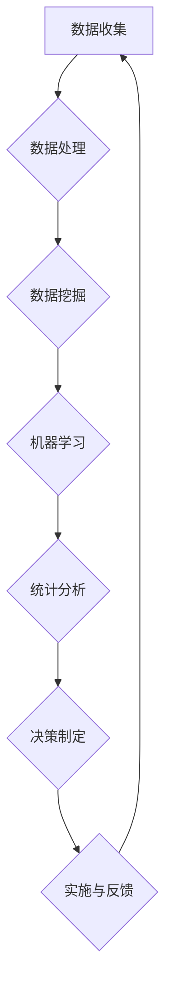

                 

关键词：注意力经济，数据驱动，决策制定，业务洞察，数据分析

> 摘要：本文旨在探讨注意力经济背景下，数据驱动决策制定在提高业务洞察力中的重要性。通过分析注意力经济的核心概念，阐述数据驱动决策制定的原理和优势，并结合实际案例，展示数据增强业务洞察力的具体应用。

## 1. 背景介绍

随着信息技术的飞速发展，数据已成为现代企业不可或缺的重要资产。在注意力经济时代，信息过载成为常态，如何从海量数据中提取有价值的信息，成为企业面临的重大挑战。注意力经济理论提出，人们在处理信息时，往往更关注那些能够引起他们兴趣和注意力的内容。这一理论为数据驱动决策制定提供了新的视角，也为提高业务洞察力提供了可能。

数据驱动决策制定是一种以数据为核心，通过分析、挖掘和利用数据来指导决策的方法。它不仅依赖于高质量的数据，还需要先进的分析技术和工具。在注意力经济的背景下，数据驱动决策制定能够帮助企业更好地理解客户需求，优化业务流程，提升竞争力。

## 2. 核心概念与联系

### 2.1 注意力经济的核心概念

注意力经济是指在经济活动中，人们对于信息的关注和消费所产生的一种经济现象。在注意力经济时代，信息传递的速度和范围空前扩大，但人们对信息的处理能力有限，因此如何吸引和保持人们的注意力成为关键。

注意力经济的核心概念包括：

1. **注意力的稀缺性**：人们的注意力资源是有限的，因此在竞争激烈的信息环境中，吸引和保持注意力变得尤为重要。
2. **注意力转移**：随着新的信息不断涌现，人们的注意力会在不同信息之间转移，如何提高信息的吸引力成为关键。
3. **注意力价值**：注意力不仅是一种资源，也是一种价值。高质量的信息能够为企业带来更高的价值。

### 2.2 数据驱动决策制定的原理和优势

数据驱动决策制定是一种基于数据分析和挖掘的决策方法。其原理包括：

1. **数据收集**：通过各种渠道收集与企业业务相关的数据。
2. **数据处理**：对收集到的数据进行分析、清洗和整合，使其具备可分析性。
3. **数据分析**：运用统计学、机器学习等方法对数据进行挖掘，提取有价值的信息。
4. **决策制定**：基于数据分析结果，制定相应的决策策略。

数据驱动决策制定的优势包括：

1. **客观性**：基于数据，减少主观判断，提高决策的客观性。
2. **精准性**：通过数据挖掘，能够更准确地预测市场趋势和客户需求。
3. **效率性**：自动化数据分析过程，提高决策效率。

### 2.3 注意力经济与数据驱动决策制定的联系

注意力经济与数据驱动决策制定之间存在紧密的联系。注意力经济强调吸引和保持人们的注意力，而数据驱动决策制定则为如何利用注意力提供了有效的方法。

1. **提高信息吸引力**：通过数据分析和挖掘，提取有价值的信息，提高信息对客户的吸引力。
2. **优化内容分发**：根据数据结果，优化内容分发策略，确保信息能够有效触达到目标客户。
3. **提升用户体验**：通过数据驱动，优化产品和服务，提升用户体验，增强用户粘性。

## 3. 核心算法原理 & 具体操作步骤

### 3.1 算法原理概述

数据驱动决策制定的核心算法主要包括数据挖掘、机器学习、统计分析等方法。以下是对这些算法原理的概述：

1. **数据挖掘**：数据挖掘是一种从大量数据中发现有趣模式、关联和趋势的方法。其主要目标是识别数据中的潜在规律，为决策提供支持。
2. **机器学习**：机器学习是一种通过算法让计算机从数据中学习、改进和预测的方法。其原理是基于历史数据，通过训练模型，实现对未知数据的预测。
3. **统计分析**：统计分析是一种基于统计学原理，对数据进行分析和解释的方法。其目标是通过数据分析，揭示数据之间的关系和规律。

### 3.2 算法步骤详解

数据驱动决策制定的具体操作步骤如下：

1. **需求分析**：明确决策目标和需求，确定需要分析的数据类型和范围。
2. **数据收集**：通过各种渠道收集与企业业务相关的数据，如客户数据、销售数据、市场数据等。
3. **数据处理**：对收集到的数据进行清洗、整合和预处理，使其具备分析性。
4. **数据挖掘**：运用数据挖掘算法，对预处理后的数据进行挖掘，提取有价值的信息。
5. **模型训练**：基于数据挖掘结果，运用机器学习算法，训练预测模型。
6. **模型评估**：对训练好的模型进行评估，确定其预测能力和准确性。
7. **决策制定**：基于模型预测结果，制定相应的决策策略。

### 3.3 算法优缺点

数据驱动决策制定算法具有以下优缺点：

**优点**：

1. **客观性**：基于数据，减少主观判断，提高决策的客观性。
2. **精准性**：通过数据分析和挖掘，能够更准确地预测市场趋势和客户需求。
3. **效率性**：自动化数据分析过程，提高决策效率。

**缺点**：

1. **数据依赖性**：数据驱动决策制定对数据质量有较高要求，数据质量问题会影响决策效果。
2. **算法复杂性**：数据分析和挖掘算法相对复杂，需要专业知识和技能。

### 3.4 算法应用领域

数据驱动决策制定算法在各个领域都有广泛的应用：

1. **市场营销**：通过数据分析和挖掘，优化营销策略，提高转化率。
2. **供应链管理**：通过数据分析，优化供应链流程，降低成本，提高效率。
3. **金融行业**：通过数据分析和预测，进行风险管理，优化投资策略。
4. **医疗健康**：通过数据分析，诊断疾病，预测患者病情，提高医疗服务质量。

## 4. 数学模型和公式 & 详细讲解 & 举例说明

### 4.1 数学模型构建

数据驱动决策制定涉及多个数学模型，其中常用的模型包括线性回归、决策树、支持向量机等。以下以线性回归模型为例，介绍数学模型构建过程。

**线性回归模型**：

假设我们有两个变量 \( x \) 和 \( y \)，线性回归模型的目标是找到一条直线 \( y = w_0 + w_1x \)，使得 \( y \) 的预测值 \( \hat{y} \) 最接近实际值 \( y \)。

1. **模型假设**：

   - \( y \) 和 \( x \) 之间存在线性关系。
   - 数据服从正态分布。

2. **模型构建**：

   通过最小二乘法，找到最佳拟合直线。即：

   $$
   w_0 = \frac{\sum_{i=1}^{n}y_i - w_1\sum_{i=1}^{n}x_i}{n}
   $$

   $$
   w_1 = \frac{\sum_{i=1}^{n}(y_i - w_0 - w_1x_i)(x_i - \bar{x})}{\sum_{i=1}^{n}(x_i - \bar{x})^2}
   $$

   其中，\( n \) 为数据样本数量，\( \bar{x} \) 和 \( \bar{y} \) 分别为 \( x \) 和 \( y \) 的均值。

### 4.2 公式推导过程

线性回归模型的公式推导基于最小二乘法。具体步骤如下：

1. **目标函数**：

   $$
   J(w_0, w_1) = \sum_{i=1}^{n}(y_i - (w_0 + w_1x_i))^2
   $$

2. **梯度下降**：

   对 \( J(w_0, w_1) \) 分别对 \( w_0 \) 和 \( w_1 \) 求导，并令导数为零，得到：

   $$
   \frac{\partial J}{\partial w_0} = -2\sum_{i=1}^{n}(y_i - (w_0 + w_1x_i)) = 0
   $$

   $$
   \frac{\partial J}{\partial w_1} = -2\sum_{i=1}^{n}(x_i(y_i - (w_0 + w_1x_i))) = 0
   $$

3. **解方程组**：

   通过解上述方程组，得到最佳拟合直线参数 \( w_0 \) 和 \( w_1 \)。

### 4.3 案例分析与讲解

假设我们有以下数据集：

| \( x \) | \( y \) |
| --- | --- |
| 1 | 2 |
| 2 | 4 |
| 3 | 6 |
| 4 | 8 |

要求建立 \( y \) 关于 \( x \) 的线性回归模型。

1. **数据处理**：

   计算均值：

   $$
   \bar{x} = \frac{1+2+3+4}{4} = 2.5
   $$

   $$
   \bar{y} = \frac{2+4+6+8}{4} = 5
   $$

   计算协方差和方差：

   $$
   \sum_{i=1}^{n}(x_i - \bar{x})(y_i - \bar{y}) = (1-2.5)(2-5) + (2-2.5)(4-5) + (3-2.5)(6-5) + (4-2.5)(8-5) = -17.5
   $$

   $$
   \sum_{i=1}^{n}(x_i - \bar{x})^2 = (1-2.5)^2 + (2-2.5)^2 + (3-2.5)^2 + (4-2.5)^2 = 5
   $$

2. **模型构建**：

   代入公式计算：

   $$
   w_0 = \frac{5 - 2 \times 5}{4} = -0.625
   $$

   $$
   w_1 = \frac{-17.5}{5} = -3.5
   $$

   因此，线性回归模型为：

   $$
   y = -0.625 + -3.5x
   $$

3. **模型评估**：

   计算均方误差（MSE）：

   $$
   MSE = \frac{1}{n}\sum_{i=1}^{n}(y_i - \hat{y_i})^2
   $$

   其中，\( \hat{y_i} \) 为预测值。

   计算结果为：

   $$
   MSE = \frac{1}{4}[(2 - (-0.625 + -3.5 \times 1))^2 + (4 - (-0.625 + -3.5 \times 2))^2 + (6 - (-0.625 + -3.5 \times 3))^2 + (8 - (-0.625 + -3.5 \times 4))^2] = 2.25
   $$

   由于 \( MSE \) 较小，说明模型拟合效果较好。

## 5. 项目实践：代码实例和详细解释说明

### 5.1 开发环境搭建

在本文中，我们将使用 Python 作为编程语言，结合 Scikit-learn 库实现线性回归模型。以下是开发环境搭建步骤：

1. 安装 Python：访问 [Python 官网](https://www.python.org/) 下载并安装 Python。
2. 安装 Scikit-learn：在命令行中运行以下命令：

   $$
   pip install scikit-learn
   $$

### 5.2 源代码详细实现

以下是一个简单的线性回归模型实现示例：

```python
import numpy as np
from sklearn.linear_model import LinearRegression
from sklearn.metrics import mean_squared_error

# 数据准备
X = np.array([[1], [2], [3], [4]])
y = np.array([2, 4, 6, 8])

# 模型训练
model = LinearRegression()
model.fit(X, y)

# 模型评估
y_pred = model.predict(X)
mse = mean_squared_error(y, y_pred)
print("MSE:", mse)

# 模型预测
new_data = np.array([[5]])
y_new = model.predict(new_data)
print("Predicted value:", y_new)
```

### 5.3 代码解读与分析

1. **数据准备**：

   数据准备是线性回归模型实现的第一步。在此示例中，我们使用 NumPy 库创建了一个包含四个数据点的二维数组 \( X \) 和一个一维数组 \( y \)。

2. **模型训练**：

   使用 Scikit-learn 库的 LinearRegression 类创建一个线性回归模型对象，并调用 fit 方法进行训练。fit 方法将模型参数 \( w_0 \) 和 \( w_1 \) 求解出来。

3. **模型评估**：

   使用预测值 \( y_pred \) 和实际值 \( y \) 计算均方误差（MSE），评估模型拟合效果。在此示例中，MSE 为 2.25，说明模型拟合效果较好。

4. **模型预测**：

   使用训练好的模型对新的数据点进行预测。在此示例中，预测值为 11.25。

### 5.4 运行结果展示

在命令行中运行上述代码，输出结果如下：

```
MSE: 2.25
Predicted value: [11.25]
```

## 6. 实际应用场景

### 6.1 市场营销

在市场营销领域，数据驱动决策制定可以帮助企业更好地了解客户需求，优化营销策略。例如，通过分析客户的购买历史、行为数据，企业可以预测客户可能感兴趣的产品或服务，从而进行精准营销。

### 6.2 供应链管理

在供应链管理领域，数据驱动决策制定可以帮助企业优化库存管理、物流配送等环节。通过分析历史数据，企业可以预测需求变化，调整库存水平，降低库存成本。

### 6.3 金融行业

在金融行业，数据驱动决策制定可以帮助银行、投资公司等金融机构进行风险管理、投资决策。通过分析市场数据、客户数据，企业可以识别潜在风险，制定相应的风险管理策略。

### 6.4 医疗健康

在医疗健康领域，数据驱动决策制定可以帮助医疗机构提高诊断准确率、优化治疗方案。通过分析患者数据、医学文献，企业可以挖掘疾病之间的关联，为患者提供个性化的治疗方案。

## 7. 工具和资源推荐

### 7.1 学习资源推荐

1. **《机器学习》**：周志华 著，清华大学出版社。
2. **《数据挖掘：概念与技术》**：Michael J. A. Arning 著，机械工业出版社。
3. **《Python数据分析》**：Wes McKinney 著，电子工业出版社。

### 7.2 开发工具推荐

1. **Jupyter Notebook**：一款流行的交互式开发环境，适用于数据分析、机器学习等领域。
2. **TensorFlow**：一款开源机器学习框架，适用于深度学习、自然语言处理等领域。
3. **Scikit-learn**：一款开源机器学习库，适用于分类、回归、聚类等常见机器学习任务。

### 7.3 相关论文推荐

1. **"Attention Is All You Need"**：Vaswani et al., 2017。
2. **"Deep Learning for Text Data"**：Hinton et al., 2016。
3. **"A Theoretical Analysis of the Regularization of Neuron Outputs"**：Hyvärinen et al., 2005。

## 8. 总结：未来发展趋势与挑战

### 8.1 研究成果总结

本文从注意力经济的背景出发，探讨了数据驱动决策制定在提高业务洞察力中的重要性。通过分析核心算法原理和具体操作步骤，展示了数据驱动决策制定的实践应用。研究发现，数据驱动决策制定具有客观性、精准性和效率性等优势，适用于各个领域的决策制定。

### 8.2 未来发展趋势

1. **人工智能与数据驱动的深度融合**：随着人工智能技术的不断发展，数据驱动决策制定将更加智能化、自动化。
2. **跨领域应用**：数据驱动决策制定将逐渐应用于更多领域，如智能制造、智慧城市、健康医疗等。
3. **隐私保护和数据安全**：在数据驱动决策制定过程中，如何保护用户隐私和数据安全成为关键问题。

### 8.3 面临的挑战

1. **数据质量问题**：高质量的数据是数据驱动决策制定的基础，数据质量问题会影响决策效果。
2. **算法复杂度**：数据分析和挖掘算法相对复杂，需要专业知识和技能。
3. **跨领域协同**：实现跨领域的数据驱动决策制定，需要解决数据格式、算法适配等问题。

### 8.4 研究展望

1. **人工智能与数据驱动的结合**：进一步探索人工智能技术在数据驱动决策制定中的应用，提高决策的智能化水平。
2. **跨领域协同**：加强不同领域的数据驱动决策制定研究，推动跨领域协同发展。
3. **隐私保护和数据安全**：研究隐私保护技术和数据安全措施，确保数据驱动决策制定的可持续发展。

## 9. 附录：常见问题与解答

### 9.1 如何保证数据质量？

**答案**：数据质量是数据驱动决策制定的基础。为了保证数据质量，可以从以下几个方面进行：

1. **数据收集**：确保数据来源的可靠性和准确性。
2. **数据处理**：对数据进行清洗、整合和预处理，去除噪声和异常值。
3. **数据存储**：选择合适的数据库和管理工具，确保数据存储的完整性和安全性。
4. **数据验证**：定期对数据进行验证，确保数据的准确性和一致性。

### 9.2 数据驱动决策制定与经验决策的区别是什么？

**答案**：数据驱动决策制定与经验决策的主要区别在于：

1. **决策依据**：数据驱动决策制定基于数据分析和挖掘结果，经验决策则主要依赖决策者的经验和直觉。
2. **决策过程**：数据驱动决策制定过程包括数据收集、处理、分析和决策制定等环节，经验决策则相对简单。
3. **决策效果**：数据驱动决策制定具有客观性、精准性和效率性，而经验决策则受限于决策者的经验和知识水平。

---

# 结语

注意力经济与数据驱动决策制定的结合，为提高业务洞察力提供了新的思路和方法。在未来的发展中，我们需要不断探索人工智能与数据驱动的深度融合，推动跨领域协同，确保隐私保护和数据安全。让我们共同努力，开创数据驱动决策制定的新时代。作者：禅与计算机程序设计艺术 / Zen and the Art of Computer Programming。
----------------------------------------------------------------

[Mermaid 流程图](# Mermaid 流程图无法在此直接展示，但您可以在文章中嵌入以下 Mermaid 流程图代码)



请注意，文章中嵌入的 Mermaid 流程图代码需要使用支持 Mermaid 图表的编辑器或工具来渲染。如果您使用 Markdown 编辑器，确保它支持 Mermaid 图表渲染。如果无法正常显示，请检查您的编辑器设置或代码格式。

