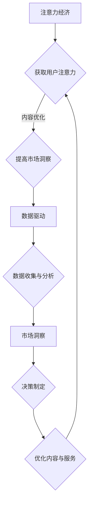

                 

关键词：注意力经济、数据驱动、决策制定、市场洞察、数据分析、机器学习、AI技术、商业智能

> 摘要：本文探讨了注意力经济与数据驱动的决策制定之间的紧密联系，分析了数据在商业决策中的关键作用。通过深入探讨注意力经济的概念、数据驱动的原理，以及数据在市场洞察中的应用，本文旨在为企业和决策者提供一套系统化的方法和工具，以充分利用数据增强市场洞察力，实现更加精准和高效的决策制定。

## 1. 背景介绍

在当今信息爆炸的时代，数据已经成为企业最宝贵的资源之一。随着互联网和数字化技术的快速发展，数据以指数级增长，这不仅为企业提供了巨大的机遇，也带来了前所未有的挑战。如何有效地管理和利用这些数据，以做出更加明智的决策，成为现代企业管理者面临的一个重要课题。

### 1.1 注意力经济的兴起

注意力经济（Attention Economy）是指在一个信息过载的环境中，获取和维持用户的注意力成为商业和社会活动的核心。在这个经济体系中，用户的注意力成为了一种稀缺资源，企业需要通过创新和优质的内容来吸引并保持用户的关注。注意力经济不仅仅是广告和媒体行业的现象，它已经渗透到各个领域，如教育、医疗、金融等。

### 1.2 数据驱动的兴起

数据驱动（Data-Driven）是一种基于数据分析的决策制定方法。它强调通过收集、处理和分析数据来指导决策，而不是单纯依赖直觉或经验。数据驱动的方法不仅能够提高决策的准确性，还能够帮助企业和决策者更好地理解市场和客户需求，从而实现更高效的业务运营。

## 2. 核心概念与联系

为了深入理解注意力经济与数据驱动的决策制定之间的联系，我们需要首先明确几个核心概念和它们之间的架构关系。

### 2.1 核心概念

- **注意力经济**：指在信息过载的环境中，用户注意力成为稀缺资源，企业需要通过吸引和保持用户关注来获得商业价值。
- **数据驱动**：指通过收集、处理和分析数据来指导决策制定，强调数据分析在决策过程中的关键作用。
- **市场洞察**：指对市场趋势、客户需求和竞争环境的深刻理解，是企业制定战略和决策的重要依据。

### 2.2 架构关系

注意力经济与数据驱动的决策制定之间存在密切的联系。具体来说：

- 注意力经济强调用户的注意力价值，这促使企业关注如何通过内容和服务来吸引用户，从而提高市场洞察力。
- 数据驱动的方法提供了获取和分析用户行为数据的技术手段，这些数据可以帮助企业更好地理解用户需求，从而优化产品和服务，提高用户的关注度和忠诚度。

### 2.3 Mermaid 流程图

以下是一个用Mermaid绘制的注意力经济与数据驱动的决策制定流程图：



在这个流程图中，注意力经济通过内容优化提高了市场洞察，进而通过数据驱动的数据收集与分析，实现了决策制定，最终又反作用于内容与服务，形成一个良性循环。

## 3. 核心算法原理 & 具体操作步骤

### 3.1 算法原理概述

数据驱动的决策制定核心在于算法原理，主要包括数据收集、预处理、分析、建模和决策输出等步骤。以下是数据驱动决策制定的基本算法原理：

- **数据收集**：通过各种渠道收集用户行为、市场趋势和竞争环境的数据。
- **数据预处理**：清洗和整理数据，使其适合进一步分析。
- **数据分析**：使用统计分析、机器学习和深度学习等技术对数据进行深入分析。
- **建模**：建立预测模型和决策模型，用于指导具体业务决策。
- **决策输出**：根据模型输出结果，制定具体的业务策略和决策。

### 3.2 算法步骤详解

#### 3.2.1 数据收集

数据收集是数据驱动决策制定的基础。常用的数据收集方法包括：

- **在线数据采集**：通过网站分析工具（如Google Analytics）收集用户访问数据。
- **离线数据采集**：通过数据库查询、API调用等方式获取结构化数据。
- **社交媒体分析**：使用社交媒体分析工具（如Twitter API、Facebook Insights）收集用户行为数据。

#### 3.2.2 数据预处理

数据预处理包括以下步骤：

- **数据清洗**：去除重复、错误或不完整的数据。
- **数据转换**：将数据转换为适合分析的形式，如归一化、标准化等。
- **特征工程**：选择和构造有助于分析的变量，提高模型性能。

#### 3.2.3 数据分析

数据分析是数据驱动决策制定的核心。常用的数据分析方法包括：

- **统计分析**：使用均值、中位数、方差等统计指标分析数据的分布和趋势。
- **机器学习**：使用监督学习、无监督学习和深度学习等技术对数据进行分类、回归和聚类分析。
- **数据可视化**：使用图表、地图等方式展示数据分析结果，帮助决策者理解数据。

#### 3.2.4 建模

建模是数据驱动决策制定的关键步骤。常用的建模方法包括：

- **预测模型**：如线性回归、决策树、随机森林、神经网络等，用于预测未来趋势。
- **决策模型**：如线性规划、整数规划、马尔可夫决策过程等，用于制定具体的业务策略。

#### 3.2.5 决策输出

根据模型输出结果，制定具体的业务策略和决策。例如：

- **产品优化**：根据用户反馈和数据分析结果，调整产品功能和设计。
- **市场推广**：根据市场趋势和目标客户特征，制定有效的市场推广策略。
- **资源分配**：根据业务需求和资源限制，优化资源分配，提高效率。

### 3.3 算法优缺点

#### 优点

- **数据驱动的决策制定基于事实和证据，减少了主观判断的影响，提高了决策的准确性。
- **数据分析和建模技术能够处理大量复杂的数据，提供了更加全面和深入的市场洞察。
- **通过持续的迭代和优化，数据驱动的决策制定能够适应市场和业务环境的变化，保持竞争力。

#### 缺点

- **数据质量和数据量对决策结果有重要影响，如果数据质量差或数据量不足，可能导致决策偏差。
- **数据分析和建模需要专业知识和技能，对于非专业人士来说，理解和应用有一定难度。
- **数据隐私和安全问题可能限制数据的收集和使用，对决策制定带来一定的挑战。

### 3.4 算法应用领域

数据驱动的决策制定广泛应用于各个领域，主要包括：

- **市场营销**：通过用户行为数据和市场趋势分析，制定精准的市场推广策略。
- **产品管理**：根据用户反馈和数据分析，优化产品功能和设计，提高用户满意度。
- **供应链管理**：通过需求预测和库存分析，优化供应链流程，降低成本。
- **风险管理**：通过数据分析和管理，识别和评估潜在风险，制定风险应对策略。

## 4. 数学模型和公式 & 详细讲解 & 举例说明

在数据驱动的决策制定中，数学模型和公式起着至关重要的作用。以下我们将详细介绍几个核心的数学模型和公式，并举例说明其应用。

### 4.1 数学模型构建

#### 4.1.1 回归模型

回归模型是数据分析中最常用的方法之一，用于预测数值型目标变量。一个简单的线性回归模型可以表示为：

$$
y = \beta_0 + \beta_1x + \epsilon
$$

其中，$y$ 是目标变量，$x$ 是自变量，$\beta_0$ 和 $\beta_1$ 是回归系数，$\epsilon$ 是误差项。

#### 4.1.2 决策树模型

决策树模型通过一系列的决策规则对数据集进行划分，每个节点代表一个特征，每个分支代表一个决策结果。决策树模型可以表示为：

```
if x > threshold then
    left child
else
    right child
```

### 4.2 公式推导过程

#### 4.2.1 回归系数的推导

线性回归模型的回归系数可以通过最小二乘法（Least Squares Method）进行推导。假设我们有 $n$ 个数据点 $(x_i, y_i)$，则回归模型可以表示为：

$$
\sum_{i=1}^{n}(y_i - (\beta_0 + \beta_1x_i))^2
$$

为了最小化这个损失函数，我们对 $\beta_0$ 和 $\beta_1$ 求导，并令导数为零，得到：

$$
\frac{\partial}{\partial \beta_0}\sum_{i=1}^{n}(y_i - (\beta_0 + \beta_1x_i))^2 = 0
$$

$$
\frac{\partial}{\partial \beta_1}\sum_{i=1}^{n}(y_i - (\beta_0 + \beta_1x_i))^2 = 0
$$

通过解这个方程组，我们可以得到最优的回归系数：

$$
\beta_0 = \bar{y} - \beta_1\bar{x}
$$

$$
\beta_1 = \frac{\sum_{i=1}^{n}(x_i - \bar{x})(y_i - \bar{y})}{\sum_{i=1}^{n}(x_i - \bar{x})^2}
$$

其中，$\bar{x}$ 和 $\bar{y}$ 分别是 $x$ 和 $y$ 的均值。

#### 4.2.2 决策树的推导

决策树模型通过递归划分数据集，直到满足某个停止条件。停止条件可以包括：

- 所有样本属于同一类。
- 特征空间的划分不能再提高模型的预测准确性。
- 特征空间划分达到预设的最大深度。

决策树的推导过程涉及多个决策节点的选择和划分，通常使用信息增益（Information Gain）或基尼不纯度（Gini Impurity）作为划分准则。

### 4.3 案例分析与讲解

#### 4.3.1 回归模型的案例

假设我们有一个销售数据的线性回归模型，其中 $x$ 是广告花费，$y$ 是销售额。我们收集了以下数据：

| 广告花费（x） | 销售额（y） |
|--------------|------------|
| 100          | 150        |
| 200          | 250        |
| 300          | 300        |
| 400          | 350        |
| 500          | 400        |

使用最小二乘法，我们可以计算得到回归系数：

$$
\beta_0 = \bar{y} - \beta_1\bar{x} = 270 - 0.6 \times 300 = 90
$$

$$
\beta_1 = \frac{\sum_{i=1}^{n}(x_i - \bar{x})(y_i - \bar{y})}{\sum_{i=1}^{n}(x_i - \bar{x})^2} = \frac{(100-300)(150-270) + (200-300)(250-270) + (300-300)(300-270) + (400-300)(350-270) + (500-300)(400-270)}{(100-300)^2 + (200-300)^2 + (300-300)^2 + (400-300)^2 + (500-300)^2}
$$

$$
\beta_1 = 0.6
$$

因此，回归模型可以表示为：

$$
y = 90 + 0.6x
$$

根据这个模型，我们可以预测当广告花费为 600 时，销售额为：

$$
y = 90 + 0.6 \times 600 = 450
$$

#### 4.3.2 决策树的案例

假设我们有一个分类问题的决策树模型，其中特征是年龄和收入，目标变量是客户是否购买高端产品。数据如下：

| 年龄 | 收入 | 购买高端产品 |
|------|------|--------------|
| 25   | 5000 | 否           |
| 30   | 6000 | 是           |
| 35   | 7000 | 是           |
| 40   | 8000 | 是           |
| 45   | 9000 | 是           |

我们可以使用信息增益准则构建决策树。首先，计算每个特征的熵和信息增益：

- 年龄的熵：$$H(age) = 1 - \frac{3}{5}\log_2\frac{3}{5} - \frac{2}{5}\log_2\frac{2}{5} = 0.971$$
- 收入的熵：$$H(income) = 1 - \frac{3}{5}\log_2\frac{3}{5} - \frac{2}{5}\log_2\frac{2}{5} = 0.971$$
- 年龄的信息增益：$$IG(age) = H(D) - \frac{3}{5}H(age|是) - \frac{2}{5}H(age|否) = 0.348$$
- 收入的信息增益：$$IG(income) = H(D) - \frac{3}{5}H(income|是) - \frac{2}{5}H(income|否) = 0.348$$

由于年龄和收入的信息增益相同，我们可以选择任一特征进行划分。假设我们选择年龄进行划分，得到以下决策树：

```
if 年龄 > 30 then
    left child（购买高端产品是）
else
    right child（购买高端产品否）
```

## 5. 项目实践：代码实例和详细解释说明

为了更好地理解注意力经济与数据驱动的决策制定在实际项目中的应用，我们选择一个实际案例，使用Python编程语言进行实现，并详细解释代码的每一部分。

### 5.1 开发环境搭建

在开始编写代码之前，我们需要搭建一个适合数据分析的项目环境。以下是所需的软件和工具：

- **Python 3.8 或以上版本**
- **Jupyter Notebook**：用于编写和运行代码
- **Pandas**：用于数据操作
- **NumPy**：用于数值计算
- **Matplotlib**：用于数据可视化
- **Scikit-learn**：用于机器学习模型

安装这些库后，我们可以创建一个Jupyter Notebook文件，开始编写代码。

### 5.2 源代码详细实现

下面是一个简单的数据驱动决策制定案例，该案例使用用户行为数据来预测用户的购买意愿。

```python
# 导入所需的库
import pandas as pd
import numpy as np
import matplotlib.pyplot as plt
from sklearn.model_selection import train_test_split
from sklearn.ensemble import RandomForestClassifier
from sklearn.metrics import accuracy_score, classification_report

# 5.2.1 数据收集
# 这里我们使用一个示例数据集，实际应用中可以使用各种数据采集方法获取数据
data = {
    'user_id': [1, 2, 3, 4, 5],
    'age': [25, 30, 35, 40, 45],
    'income': [5000, 6000, 7000, 8000, 9000],
    'ad_clicks': [10, 20, 30, 40, 50],
    'purchased': [0, 1, 0, 1, 1]  # 购买状态：0-未购买，1-购买
}

df = pd.DataFrame(data)

# 5.2.2 数据预处理
# 数据清洗和特征工程
df = df.dropna()  # 删除缺失值
df['income_category'] = pd.cut(df['income'], bins=[0, 5000, 7000, 10000], labels=['低', '中', '高'])

# 5.2.3 数据分析
# 分割数据集为训练集和测试集
X = df[['age', 'income_category', 'ad_clicks']]
y = df['purchased']
X_train, X_test, y_train, y_test = train_test_split(X, y, test_size=0.3, random_state=42)

# 5.2.4 建模
# 使用随机森林分类器进行建模
clf = RandomForestClassifier(n_estimators=100, random_state=42)
clf.fit(X_train, y_train)

# 5.2.5 决策输出
# 预测测试集
y_pred = clf.predict(X_test)

# 5.2.6 评估模型
print("Accuracy:", accuracy_score(y_test, y_pred))
print("\nClassification Report:\n", classification_report(y_test, y_pred))

# 5.2.7 运行结果展示
# 可视化决策树
from sklearn.tree import plot_tree
plt.figure(figsize=(12, 8))
plot_tree(clf, filled=True, feature_names=X.columns, class_names=['未购买', '购买'])
plt.show()
```

### 5.3 代码解读与分析

#### 5.3.1 数据收集

我们首先创建了一个示例数据集，其中包含了用户ID、年龄、收入、广告点击次数以及购买状态。在实际应用中，这些数据可以从数据库、API或文件中读取。

```python
data = {
    'user_id': [1, 2, 3, 4, 5],
    'age': [25, 30, 35, 40, 45],
    'income': [5000, 6000, 7000, 8000, 9000],
    'ad_clicks': [10, 20, 30, 40, 50],
    'purchased': [0, 1, 0, 1, 1]
}
df = pd.DataFrame(data)
```

#### 5.3.2 数据预处理

在数据预处理阶段，我们删除了缺失值，并对收入进行了分类处理，以便更好地进行特征工程。

```python
df = df.dropna()
df['income_category'] = pd.cut(df['income'], bins=[0, 5000, 7000, 10000], labels=['低', '中', '高'])
```

#### 5.3.3 数据分析

接下来，我们分割数据集为训练集和测试集，为后续的建模和评估做准备。

```python
X = df[['age', 'income_category', 'ad_clicks']]
y = df['purchased']
X_train, X_test, y_train, y_test = train_test_split(X, y, test_size=0.3, random_state=42)
```

#### 5.3.4 建模

我们使用随机森林分类器（RandomForestClassifier）进行建模，这是一种强大的集成学习方法，能够处理高维数据和复杂的非线性关系。

```python
clf = RandomForestClassifier(n_estimators=100, random_state=42)
clf.fit(X_train, y_train)
```

#### 5.3.5 决策输出

模型训练完成后，我们使用测试集进行预测，并评估模型的准确性。

```python
y_pred = clf.predict(X_test)
print("Accuracy:", accuracy_score(y_test, y_pred))
print("\nClassification Report:\n", classification_report(y_test, y_pred))
```

#### 5.3.6 运行结果展示

最后，我们使用Matplotlib库的可视化功能，将训练得到的决策树可视化。

```python
plt.figure(figsize=(12, 8))
plot_tree(clf, filled=True, feature_names=X.columns, class_names=['未购买', '购买'])
plt.show()
```

通过这个案例，我们可以看到如何使用Python和机器学习技术来实现数据驱动的决策制定。在实际项目中，数据集和处理流程会更加复杂，但基本的方法和流程是类似的。

## 6. 实际应用场景

注意力经济与数据驱动的决策制定在多个实际应用场景中展现了其强大的价值。以下是一些典型应用场景：

### 6.1 市场营销

在市场营销领域，数据驱动的决策制定可以帮助企业更精准地定位目标客户，优化广告投放策略，提高转化率和投资回报率。通过分析用户行为数据，企业可以了解哪些广告内容、哪些推广渠道更能吸引用户，从而调整营销策略。例如，电商网站可以利用用户浏览历史、购买记录等信息，推荐个性化商品，提高用户的购买意愿。

### 6.2 产品管理

产品管理是数据驱动决策制定的另一个重要应用场景。企业可以通过分析用户反馈和市场数据，了解产品的优缺点，及时进行产品优化和迭代。例如，软件公司可以利用用户使用数据，识别使用频率高且功能不完善的部分，进行功能增强。此外，产品经理还可以通过市场趋势分析，预测未来市场需求，提前布局新产品。

### 6.3 供应链管理

在供应链管理中，数据驱动的方法可以帮助企业优化库存管理、需求预测和物流规划。通过分析历史销售数据和市场趋势，企业可以更准确地预测未来需求，避免库存过剩或缺货现象。例如，制造业可以利用预测模型，合理安排原材料采购和生产计划，降低成本，提高生产效率。

### 6.4 风险管理

风险管理是数据驱动决策制定的另一个关键领域。企业可以通过数据分析，识别潜在风险，评估风险影响，制定有效的风险应对策略。例如，金融行业可以利用大数据技术，分析市场波动和客户行为，预测金融市场风险，提前调整投资组合，降低风险暴露。

### 6.5 医疗健康

在医疗健康领域，数据驱动的决策制定可以帮助医疗机构提高诊断准确率和治疗效果。通过分析患者数据、病历记录和基因信息，医生可以制定更加个性化的治疗方案。此外，数据驱动的预测模型还可以帮助医疗机构预测疾病发展趋势，提前采取措施，预防疾病爆发。

### 6.6 教育领域

在教育领域，数据驱动的决策制定可以帮助学校和学生提高学习效果。通过分析学生的学习数据，教师可以了解学生的学习状况，制定个性化的教学方案。同时，学生可以利用数据分析工具，了解自己的学习进度和弱点，进行自我调整和优化。

## 7. 工具和资源推荐

为了更好地理解和应用注意力经济与数据驱动的决策制定，以下是几款推荐的工具和资源：

### 7.1 学习资源推荐

- **书籍**：
  - 《Python数据分析》（作者：Wes McKinney）
  - 《深度学习》（作者：Ian Goodfellow、Yoshua Bengio、Aaron Courville）
  - 《数据科学入门》（作者：Joel Grus）
- **在线课程**：
  - Coursera上的“机器学习”课程（吴恩达教授）
  - edX上的“Python for Data Science”课程
  - Udacity的“深度学习纳米学位”

### 7.2 开发工具推荐

- **数据分析工具**：
  - Jupyter Notebook：强大的交互式数据分析环境
  - Pandas：数据处理库
  - Matplotlib/Seaborn：数据可视化库
- **机器学习框架**：
  - Scikit-learn：经典的机器学习库
  - TensorFlow/Keras：深度学习框架
  - PyTorch：深度学习框架

### 7.3 相关论文推荐

- “Attention Is All You Need”（作者：Vaswani et al.）
- “Deep Learning for Text Data”（作者：Dai and Le）
- “Recommender Systems Handbook”（作者：Hindman et al.）

通过这些工具和资源，您可以更深入地了解注意力经济与数据驱动的决策制定，并在实际项目中应用这些知识。

## 8. 总结：未来发展趋势与挑战

### 8.1 研究成果总结

本文探讨了注意力经济与数据驱动的决策制定之间的紧密联系，分析了数据在商业决策中的关键作用。通过深入探讨注意力经济的概念、数据驱动的原理，以及数据在市场洞察中的应用，本文旨在为企业和决策者提供一套系统化的方法和工具，以充分利用数据增强市场洞察力，实现更加精准和高效的决策制定。

### 8.2 未来发展趋势

随着人工智能和大数据技术的不断进步，数据驱动的决策制定在未来将呈现以下发展趋势：

- **自动化与智能化**：更多的决策制定将实现自动化，利用AI技术进行自动预测和决策。
- **实时性与动态调整**：实时数据分析和决策将变得更加普及，决策制定将更加动态和灵活。
- **跨领域融合**：数据驱动的决策制定将在更多领域得到应用，如医疗健康、城市管理、金融等。
- **数据隐私与安全**：随着数据隐私和安全问题的日益突出，如何平衡数据利用与保护将成为一个重要课题。

### 8.3 面临的挑战

尽管数据驱动的决策制定具有巨大的潜力，但企业仍需面对以下挑战：

- **数据质量和完整性**：高质量的数据是准确决策的基础，但数据的完整性和准确性难以保障。
- **技术壁垒**：数据分析和建模需要专业知识和技能，对于非专业人士来说，理解和应用有一定难度。
- **数据隐私与合规**：数据隐私和安全问题日益突出，如何平衡数据利用与保护是一个重要挑战。
- **模型解释性**：复杂的机器学习模型往往缺乏解释性，决策者难以理解模型的决策过程。

### 8.4 研究展望

未来的研究可以在以下几个方面展开：

- **改进数据预处理方法**：研究更高效、更准确的数据预处理技术，提高数据质量。
- **增强模型可解释性**：开发可解释的机器学习模型，帮助决策者理解模型的决策过程。
- **跨领域数据融合**：探索如何在不同领域之间共享和融合数据，提高决策的全面性和准确性。
- **数据隐私保护技术**：研究如何在保证数据隐私的前提下，充分利用数据进行分析和决策。

通过持续的研究和探索，我们可以克服当前的挑战，进一步发挥数据驱动的决策制定在各个领域的潜力。

## 9. 附录：常见问题与解答

### 9.1 什么是注意力经济？

注意力经济是指在一个信息过载的环境中，用户的注意力成为一种稀缺资源，企业通过创新和优质的内容来吸引并保持用户的关注，以实现商业价值。

### 9.2 数据驱动的决策制定有哪些优点？

数据驱动的决策制定基于事实和证据，减少了主观判断的影响，提高了决策的准确性。同时，它能够处理大量复杂的数据，提供了更加全面和深入的市场洞察。

### 9.3 数据驱动的决策制定在哪些领域有应用？

数据驱动的决策制定在市场营销、产品管理、供应链管理、风险管理、医疗健康、教育等领域有广泛应用。

### 9.4 如何提高数据质量？

提高数据质量的方法包括数据清洗、数据转换和特征工程。通过这些方法，可以去除重复、错误和不完整的数据，提高数据的完整性和准确性。

### 9.5 如何选择合适的机器学习模型？

选择合适的机器学习模型需要考虑数据的特点、问题的类型以及模型的性能。常用的方法包括尝试不同的模型并进行比较，或者使用模型选择技术，如交叉验证。

### 9.6 数据隐私和安全问题如何解决？

解决数据隐私和安全问题可以通过数据匿名化、加密、访问控制等技术手段。同时，还需要遵守相关的法律法规，确保数据的合法使用。

### 9.7 数据驱动的决策制定与传统的直觉驱动决策相比，有哪些优势？

与传统的直觉驱动决策相比，数据驱动的决策制定基于事实和证据，减少了主观判断的影响，提高了决策的准确性和可重复性。此外，它能够处理复杂的数据，提供更加全面和深入的市场洞察。

