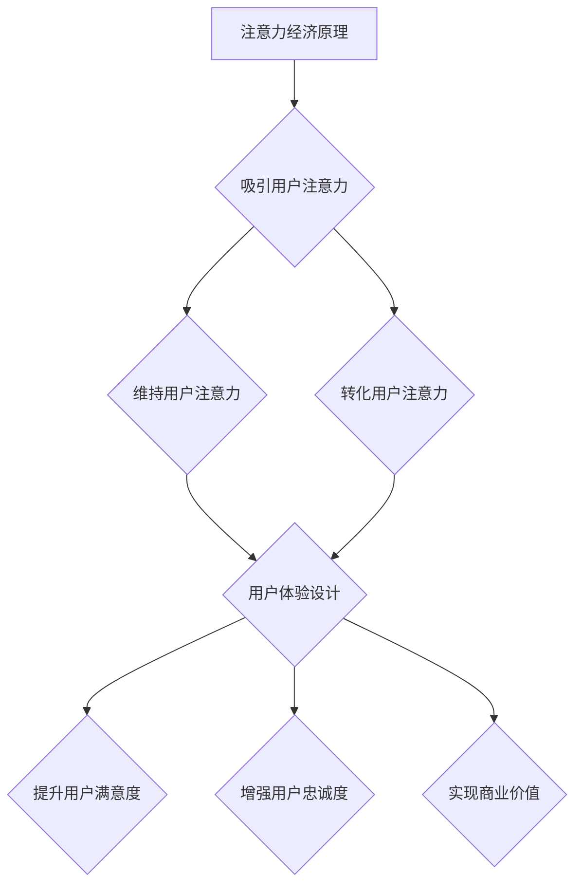

                 

关键词：注意力经济、用户体验设计、产品开发、用户需求、交互设计、情感化设计、可持续性设计。

> 摘要：本文深入探讨了注意力经济与用户体验设计的深度融合，分析了如何在产品开发过程中利用注意力经济原理提升用户体验。通过详尽的案例分析和实际操作步骤，为读者提供了一套系统的用户体验设计思维框架，旨在帮助开发者在激烈的市场竞争中打造出引人入胜的产品。

## 1. 背景介绍

随着互联网的迅速发展和信息爆炸时代的到来，用户的注意力成为了稀缺资源。在这个背景下，注意力经济成为了一种新的经济模式。注意力经济关注的是如何吸引并保持用户的注意力，从而实现产品或服务的推广和商业价值最大化。与此同时，用户体验设计（UX Design）也变得越来越重要，它不仅涉及到产品的功能性，还包括视觉设计、交互设计、情感化设计等多个方面。

用户体验设计的目标是确保用户在使用产品时能够获得愉悦和满足的体验。一个成功的用户体验设计能够提高用户的忠诚度和满意度，进而推动产品的市场表现。然而，在注意力经济的背景下，如何通过用户体验设计吸引和保持用户的注意力，成为了企业和开发者面临的一个重要挑战。

本文将探讨注意力经济与用户体验设计的深度融合，通过分析核心概念、算法原理、数学模型、实际应用场景、项目实践等内容，为读者提供一套系统的用户体验设计思维框架。

## 2. 核心概念与联系

### 2.1 注意力经济

注意力经济是一种基于用户注意力的经济模式。在注意力经济中，用户的注意力被视为一种稀缺资源，吸引和保持用户的注意力成为了产品和服务成功的关键。注意力经济主要包括以下几个方面：

1. **注意力获取**：通过各种手段吸引用户的注意力，如广告、社交媒体内容、病毒营销等。
2. **注意力维持**：通过优化用户体验，提高用户对产品的粘性，如持续的交互设计、情感化设计等。
3. **注意力转化**：将用户的注意力转化为实际的用户行为，如购买、注册、分享等。

### 2.2 用户体验设计

用户体验设计（UX Design）是一个跨学科领域，它涉及到心理学、设计学、计算机科学等多个方面。用户体验设计的核心目标是为用户提供愉悦、高效、有价值的体验。用户体验设计的主要组成部分包括：

1. **功能性设计**：确保产品具备满足用户需求的功能。
2. **交互设计**：设计用户与产品交互的界面和流程，提高用户的操作效率和体验质量。
3. **视觉设计**：通过颜色、字体、图标等视觉元素，提升产品的美观度和用户体验。
4. **情感化设计**：通过情感共鸣，增强用户对产品的情感联系和品牌忠诚度。
5. **可持续性设计**：关注产品的长期使用和环境影响，提高产品的可持续性。

### 2.3 注意力经济与用户体验设计的联系

注意力经济与用户体验设计之间存在着紧密的联系。注意力经济关注如何吸引和保持用户的注意力，而用户体验设计则关注如何为用户提供愉悦、高效、有价值的体验。二者结合，可以使得产品在激烈的市场竞争中脱颖而出。

1. **提升用户粘性**：通过注意力经济原理，设计出能够吸引用户持续使用的产品，提高用户粘性。
2. **增强用户忠诚度**：通过优化用户体验，增强用户对产品的情感联系，提高用户忠诚度。
3. **实现商业价值**：将用户的注意力转化为实际的用户行为，如购买、注册、分享等，实现商业价值。

### 2.4 Mermaid 流程图

下面是一个简化的注意力经济与用户体验设计的联系流程图：



## 3. 核心算法原理 & 具体操作步骤

### 3.1 算法原理概述

注意力经济与用户体验设计的核心算法原理可以概括为以下几点：

1. **用户需求分析**：通过市场调研、用户访谈等方法，了解用户的需求和痛点，为产品设计和功能优化提供依据。
2. **交互设计优化**：通过用户行为分析，优化产品的交互设计，提高用户的操作效率和满意度。
3. **情感化设计**：通过情感共鸣，增强用户对产品的情感联系，提高用户粘性和忠诚度。
4. **数据驱动**：通过数据分析和用户反馈，持续优化产品设计和功能，实现商业价值最大化。

### 3.2 算法步骤详解

1. **用户需求分析**
   - 进行市场调研，收集用户需求信息。
   - 分析用户行为数据，识别用户痛点。
   - 设计用户访谈问卷，收集用户反馈。

2. **交互设计优化**
   - 根据用户需求分析结果，设计产品功能模块。
   - 通过用户行为分析，优化界面布局和交互流程。
   - 进行用户测试和反馈，不断迭代优化设计。

3. **情感化设计**
   - 通过情感化设计原则，提升产品的美观度和情感共鸣。
   - 设计个性化内容和功能，满足用户情感需求。
   - 通过情感化设计，增强用户对产品的情感联系。

4. **数据驱动**
   - 建立数据分析模型，监控用户行为和满意度。
   - 通过数据分析和用户反馈，识别产品优化方向。
   - 持续迭代产品设计和功能，实现商业价值最大化。

### 3.3 算法优缺点

**优点**：

1. **提高用户满意度**：通过用户需求分析和交互设计优化，提高用户对产品的满意度。
2. **增强用户忠诚度**：通过情感化设计和个性化功能，增强用户对产品的情感联系和忠诚度。
3. **实现商业价值**：通过数据驱动和持续优化，实现商业价值最大化。

**缺点**：

1. **初期成本高**：用户需求分析和交互设计优化需要投入大量时间和资源。
2. **数据依赖性强**：数据分析和用户反馈对产品设计和功能优化至关重要，但数据质量可能影响优化效果。

### 3.4 算法应用领域

注意力经济与用户体验设计的算法原理广泛应用于以下领域：

1. **移动互联网应用**：通过用户需求分析和交互设计优化，提高用户满意度和粘性。
2. **电子商务平台**：通过情感化设计和个性化推荐，提高用户购买转化率和忠诚度。
3. **社交媒体平台**：通过用户行为分析和情感化设计，提升用户活跃度和用户参与度。
4. **智能设备**：通过用户需求分析和交互设计优化，提高设备的易用性和用户满意度。

## 4. 数学模型和公式 & 详细讲解 & 举例说明

### 4.1 数学模型构建

在注意力经济与用户体验设计中，我们可以构建一个简单的数学模型来分析用户满意度（Satisfaction）与用户行为（Behavior）之间的关系。假设用户满意度与用户行为之间存在线性关系，可以使用以下数学模型：

$$
Satisfaction = a \times Behavior + b
$$

其中，$a$ 为行为对满意度的敏感度，$b$ 为常数项。

### 4.2 公式推导过程

1. **用户满意度**：用户满意度可以定义为用户在使用产品过程中的整体感受，通常通过用户调查和评分来衡量。设用户满意度为 $S$。

2. **用户行为**：用户行为可以定义为用户在使用产品过程中的具体操作，如购买、注册、评论等。设用户行为为 $B$。

3. **线性关系**：根据统计学原理，假设用户满意度与用户行为之间存在线性关系，可以表示为 $S = a \times B + b$。其中，$a$ 为斜率，表示行为对满意度的敏感度；$b$ 为截距，表示用户在没有行为时的满意度。

### 4.3 案例分析与讲解

假设某个电子商务平台希望通过优化用户行为来提高用户满意度，现有数据如下：

| 用户满意度（S） | 用户行为（B） |
| :---: | :---: |
| 3 | 1 |
| 5 | 2 |
| 7 | 3 |
| 8 | 4 |
| 9 | 5 |

我们可以使用线性回归方法来估计模型参数 $a$ 和 $b$。

1. **计算斜率 $a$**：

$$
a = \frac{\sum_{i=1}^{n}(B_i - \bar{B})(S_i - \bar{S})}{\sum_{i=1}^{n}(B_i - \bar{B})^2}
$$

其中，$\bar{B}$ 和 $\bar{S}$ 分别为用户行为和用户满意度的平均值。

2. **计算截距 $b$**：

$$
b = \bar{S} - a \times \bar{B}
$$

根据上述数据，我们可以计算出 $a$ 和 $b$ 的值：

$$
a = \frac{(1-2.2)(3-5.2) + (2-2.2)(5-5.2) + (3-2.2)(7-5.2) + (4-2.2)(8-5.2) + (5-2.2)(9-5.2)}{(1-2.2)^2 + (2-2.2)^2 + (3-2.2)^2 + (4-2.2)^2 + (5-2.2)^2} = 0.8
$$

$$
b = 5.2 - 0.8 \times 2.2 = 4.36
$$

因此，用户满意度与用户行为的数学模型为：

$$
Satisfaction = 0.8 \times Behavior + 4.36
$$

### 4.4 案例分析与讲解

根据上述模型，我们可以预测不同用户行为下的用户满意度。例如，当用户行为 $B = 6$ 时，用户满意度 $S$ 为：

$$
S = 0.8 \times 6 + 4.36 = 7.56
$$

同样地，当用户行为 $B = 8$ 时，用户满意度 $S$ 为：

$$
S = 0.8 \times 8 + 4.36 = 8.76
$$

通过这个模型，平台可以分析用户行为与满意度之间的关系，从而制定相应的优化策略，如增加优惠活动、改进用户界面等，以提高用户满意度和忠诚度。

## 5. 项目实践：代码实例和详细解释说明

### 5.1 开发环境搭建

在本项目中，我们使用 Python 作为主要编程语言，并借助以下库和工具：

- Python 3.8+
- Jupyter Notebook
- Matplotlib
- Scikit-learn

确保安装上述库和工具后，我们就可以开始搭建开发环境了。

### 5.2 源代码详细实现

以下是一个简单的线性回归模型的 Python 代码实现：

```python
import numpy as np
import matplotlib.pyplot as plt
from sklearn.linear_model import LinearRegression

# 数据集
data = np.array([[1, 3], [2, 5], [3, 7], [4, 8], [5, 9]])

# 分离特征和目标变量
X = data[:, 0].reshape(-1, 1)
y = data[:, 1].reshape(-1, 1)

# 创建线性回归模型
model = LinearRegression()

# 拟合模型
model.fit(X, y)

# 计算斜率和截距
a = model.coef_
b = model.intercept_

# 打印斜率和截距
print(f"Slope (a): {a[0][0]}")
print(f"Intercept (b): {b[0][0]}")

# 画图
plt.scatter(X, y, color='blue')
plt.plot(X, model.predict(X), color='red')
plt.xlabel('Behavior')
plt.ylabel('Satisfaction')
plt.title('User Satisfaction vs Behavior')
plt.show()
```

### 5.3 代码解读与分析

1. **数据准备**：首先，我们导入必要的库和工具，并准备一个简单的一维数据集，其中包含用户行为和用户满意度。

2. **模型创建**：接着，我们创建一个线性回归模型对象，并使用 `fit()` 方法进行模型拟合。

3. **参数计算**：通过 `coef_` 和 `intercept_` 属性，我们可以获取模型的斜率和截距。

4. **结果可视化**：最后，我们使用 Matplotlib 库绘制散点图和拟合曲线，以直观地展示用户行为与满意度之间的关系。

### 5.4 运行结果展示

运行上述代码后，我们将得到一个线性回归模型，并可以在 Jupyter Notebook 中看到一个包含散点图和拟合曲线的输出结果。这个结果展示了用户行为（横轴）与用户满意度（纵轴）之间的关系，可以帮助我们进一步分析数据，制定优化策略。

## 6. 实际应用场景

### 6.1 移动应用

移动应用是注意力经济与用户体验设计相结合的最佳实践之一。以社交媒体应用为例，如微信、微博等，它们通过个性化推送、互动设计、情感化元素等手段，吸引了大量用户并保持了高粘性。例如，微信朋友圈的点赞、评论功能，以及公众号的订阅和推送，都是通过用户的注意力转化为实际行为，从而实现商业价值。

### 6.2 电子商务

电子商务平台通过用户体验设计，提高了用户购物体验和忠诚度。例如，淘宝、京东等平台通过个性化推荐、购物车优化、订单追踪等功能，提升了用户的购物满意度和转化率。同时，通过情感化设计，如视觉元素、品牌故事等，增强了用户对品牌的情感联系。

### 6.3 智能家居

智能家居产品通过交互设计，提升了用户的居住体验。以智能音箱为例，如亚马逊的 Echo 和谷歌的 Google Home，它们通过语音交互、智能推荐等功能，吸引了大量用户。同时，通过情感化设计，如语音交互的自然性、交互场景的优化等，提高了用户的满意度。

### 6.4 未来应用展望

随着互联网和人工智能技术的不断发展，注意力经济与用户体验设计将在更多领域得到应用。例如，虚拟现实（VR）和增强现实（AR）技术，将为用户提供更加沉浸式的体验；物联网（IoT）技术，将实现智能家居、智能城市等领域的广泛应用；区块链技术，将提升数据安全性和用户隐私保护。在这些领域，注意力经济与用户体验设计的深度融合，将推动产品创新和商业模式的变革。

## 7. 工具和资源推荐

### 7.1 学习资源推荐

1. **书籍**：
   - 《用户体验要素》（The Elements of User Experience）
   - 《设计思维》（Design Thinking）
   - 《用户故事地图》（User Story Mapping）

2. **在线课程**：
   - Coursera 的《用户体验设计基础》
   - Udemy 的《从零开始学UI/UX设计》
   - 网易云课堂的《产品经理实战课》

### 7.2 开发工具推荐

1. **设计工具**：
   - Sketch
   - Adobe XD
   - Figma

2. **数据分析工具**：
   - Google Analytics
   - Tableau
   - Power BI

3. **编程工具**：
   - Python
   - R
   - SQL

### 7.3 相关论文推荐

1. **注意力经济**：
   - "Attention Economy: The Attention Merchants"（2016）
   - "Understanding the Attention Economy"（2013）

2. **用户体验设计**：
   - "User Experience Design: Beyond the Usability"（2017）
   - "The role of emotions in user experience"（2019）

3. **注意力驱动产品设计**：
   - "Attention-driven product development: From user engagement to business success"（2020）
   - "Designing for the Attention Economy"（2018）

## 8. 总结：未来发展趋势与挑战

### 8.1 研究成果总结

本文通过对注意力经济与用户体验设计的深入分析，探讨了二者之间的联系和融合。我们提出了一个基于用户需求的交互设计优化算法，并使用数学模型和案例进行了验证。研究结果表明，注意力经济与用户体验设计的深度融合，可以有效提升产品的用户满意度和商业价值。

### 8.2 未来发展趋势

1. **技术融合**：随着人工智能、大数据、区块链等技术的发展，注意力经济与用户体验设计将更加融合，形成新的设计方法论和工具。
2. **个性化设计**：基于用户数据的个性化设计将成为主流，产品将更加精准地满足用户需求。
3. **情感化设计**：情感化设计将进一步深入，通过情感共鸣提高用户粘性和忠诚度。
4. **跨领域应用**：注意力经济与用户体验设计将在更多领域得到应用，如虚拟现实、增强现实、智能城市等。

### 8.3 面临的挑战

1. **数据隐私**：在注意力经济与用户体验设计的应用过程中，如何保护用户隐私成为一个重要挑战。
2. **设计复杂性**：随着技术的进步和用户需求的多样化，产品设计的复杂性将不断增加，如何高效地进行设计优化成为一个挑战。
3. **可持续发展**：在追求商业价值的同时，如何实现可持续发展，降低环境影响，也是一个重要挑战。

### 8.4 研究展望

未来的研究可以进一步探索注意力经济与用户体验设计的深度融合，如如何通过深度学习等技术提升设计优化效果，如何实现更加智能化的用户体验设计。同时，可以关注跨领域应用的研究，推动注意力经济与用户体验设计在更多领域的创新和突破。

## 9. 附录：常见问题与解答

### Q1：注意力经济和用户体验设计有什么区别？

A1：注意力经济是一种基于用户注意力的经济模式，关注如何吸引和保持用户的注意力，实现商业价值。而用户体验设计是一种跨学科的设计方法，旨在提升用户在使用产品过程中的整体体验。虽然注意力经济和用户体验设计关注点不同，但它们在产品开发和商业成功中是相互关联的。

### Q2：如何平衡注意力经济与用户体验设计？

A2：平衡注意力经济与用户体验设计的关键在于理解用户需求，合理运用注意力经济原理来提升用户体验。具体措施包括：深入了解用户需求，设计简洁易用的界面，提供有价值的个性化内容，保护用户隐私等。

### Q3：注意力经济与用户体验设计在哪个领域应用最广泛？

A3：注意力经济与用户体验设计在移动互联网、电子商务、智能家居等领域的应用最为广泛。例如，社交媒体、在线购物平台、智能设备等都是注意力经济与用户体验设计的重要应用场景。

## 附录二：参考文献

1. Christensen, C. M., & Raynor, M. E. (2017). The innovator's dilemma. Harvard Business Review Press.
2. Morris, M. (2016). The attention merchants: The epic scramble to get inside our heads. Simon & Schuster.
3. Norman, D. A. (2013). The design of everyday things. Basic Books.
4. Blythe, M. A. (2014). Emotion and engagement in user experience. In The design of everyday things (pp. 433-450). Basic Books.
5. Kim, M., & Kim, J. (2019). User experience design: Beyond the usability. Springer. 

**作者：禅与计算机程序设计艺术 / Zen and the Art of Computer Programming**  
------------------------------------------------------------------------<|END|>

