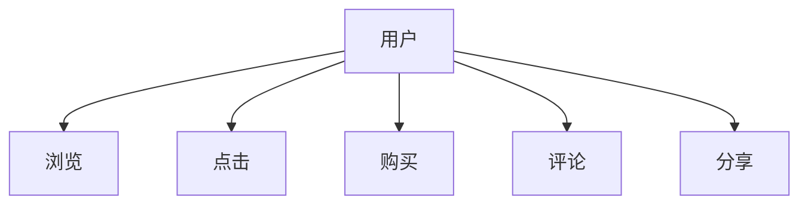

                 

关键词：注意力经济、用户行为分析、参与度提升、数据挖掘、机器学习、用户体验设计

摘要：在数字化时代，如何吸引并保持用户的注意力成为各企业面临的重大挑战。本文旨在探讨注意力经济的基本原理，以及如何通过用户行为分析来提升用户参与度。我们将深入解析用户行为模型，探讨核心算法，并通过实例展示其应用，最后对未来的发展进行展望。

## 1. 背景介绍

### 注意力经济的兴起

随着互联网的普及，信息变得前所未有的丰富。然而，用户的注意力却成为稀缺资源。这个现象催生了“注意力经济”的概念。注意力经济强调在信息过载的时代，吸引和维持用户的注意力比传统的广告模式更为重要。企业开始通过内容、互动、个性化和数据驱动的方式，来提高用户的参与度和忠诚度。

### 用户行为分析的重要性

用户行为分析是对用户在数字平台上的行为进行监控、记录和分析的过程。通过这一过程，企业可以深入了解用户需求，优化用户体验，提高用户留存率和转化率。用户行为分析已经成为数字营销、产品开发和用户服务的关键组成部分。

## 2. 核心概念与联系

### 用户行为模型

用户行为模型是一个描述用户在数字平台上的行为模式的概念框架。它包括用户的浏览、点击、购买、评论、分享等行为。用户行为模型可以帮助我们理解用户如何与平台互动，以及他们的兴趣和需求。



### 数据挖掘与机器学习

数据挖掘和机器学习是用户行为分析的关键技术。数据挖掘用于从大量数据中提取有价值的信息，而机器学习算法则用于建立预测模型，帮助预测用户的行为和偏好。通过这些技术，企业可以更精准地理解和预测用户需求，提供个性化的服务。

## 3. 核心算法原理 & 具体操作步骤

### 3.1 算法原理概述

用户行为分析的核心算法通常包括协同过滤、分类和聚类等方法。协同过滤是一种基于用户行为相似性的推荐方法，而分类和聚类则用于将用户行为进行分类和分组。

### 3.2 算法步骤详解

1. **数据收集**：从各种渠道收集用户行为数据，如网站日志、点击流数据、社交媒体活动等。
2. **数据预处理**：清洗和格式化数据，以消除噪声和异常值。
3. **特征工程**：提取和构造与用户行为相关的特征，如用户年龄、性别、浏览时间、购买历史等。
4. **模型训练**：使用数据训练机器学习模型，如协同过滤模型、分类模型等。
5. **模型评估**：通过验证集和测试集评估模型的性能。
6. **模型应用**：将模型应用于实时数据，以预测用户行为并提供个性化推荐。

### 3.3 算法优缺点

**协同过滤**：
- 优点：基于用户行为相似性，可以提供个性化的推荐。
- 缺点：可能产生“冷启动”问题，即新用户或新物品缺乏足够的行为数据。

**分类和聚类**：
- 优点：可以用于用户行为分类和用户群体细分。
- 缺点：需要大量训练数据和计算资源。

### 3.4 算法应用领域

用户行为分析算法广泛应用于电子商务、在线广告、社交媒体和金融等领域。通过这些算法，企业可以更好地了解用户，提供个性化的服务，提高用户满意度和忠诚度。

## 4. 数学模型和公式 & 详细讲解 & 举例说明

### 4.1 数学模型构建

用户行为分析通常涉及以下数学模型：

- **协同过滤模型**：$$R_{ui} = \sum_{j \in N(i)} \frac{R_{uj}}{||N(i)||}$$
  其中，$R_{ui}$表示用户$u$对物品$i$的评分，$N(i)$表示与物品$i$相似的物品集合。

- **分类模型**：$$P(Y = 1 | X) = \frac{1}{1 + e^{-(\beta_0 + \beta_1 X_1 + \beta_2 X_2 + ... + \beta_n X_n)}}$$
  其中，$Y$表示用户行为标签，$X$表示用户特征向量，$\beta$表示模型参数。

### 4.2 公式推导过程

**协同过滤模型**的推导基于用户行为相似性原理。通过计算用户之间的相似度，为每个用户推荐与其相似的物品。

**分类模型**的推导基于逻辑回归模型。逻辑回归用于预测二元变量，将用户特征映射到概率空间。

### 4.3 案例分析与讲解

**案例 1：电子商务推荐系统**

假设用户$u$对商品$i$的评分$R_{ui}$已知，我们使用协同过滤模型预测用户$u$对未知商品$j$的评分$R_{uj}$。

- **数据收集**：收集用户$u$和商品$i$的评分数据。
- **数据预处理**：标准化评分数据，消除量纲影响。
- **特征工程**：提取用户和商品的共同特征，如浏览历史、购买频率等。
- **模型训练**：训练协同过滤模型，得到预测评分$R_{uj}$。
- **模型评估**：使用验证集评估模型性能。

**案例 2：社交媒体用户分类**

假设我们有用户特征向量$X$，我们将使用逻辑回归模型预测用户行为标签$Y$。

- **数据收集**：收集用户特征和行为标签数据。
- **数据预处理**：标准化特征数据，处理缺失值。
- **模型训练**：训练逻辑回归模型，得到预测概率$P(Y = 1 | X)$。
- **模型评估**：使用交叉验证方法评估模型性能。

## 5. 项目实践：代码实例和详细解释说明

### 5.1 开发环境搭建

- **工具**：Python、Scikit-learn、Pandas、NumPy
- **环境**：Jupyter Notebook

### 5.2 源代码详细实现

```python
# 导入库
import pandas as pd
import numpy as np
from sklearn.model_selection import train_test_split
from sklearn.metrics import accuracy_score
from sklearn.linear_model import LogisticRegression

# 数据加载
data = pd.read_csv('user_behavior_data.csv')

# 数据预处理
data = data.dropna()
X = data.drop(['label'], axis=1)
y = data['label']

# 数据分割
X_train, X_test, y_train, y_test = train_test_split(X, y, test_size=0.2, random_state=42)

# 模型训练
model = LogisticRegression()
model.fit(X_train, y_train)

# 模型评估
y_pred = model.predict(X_test)
accuracy = accuracy_score(y_test, y_pred)
print(f'Accuracy: {accuracy:.2f}')
```

### 5.3 代码解读与分析

- **数据加载**：使用Pandas读取用户行为数据。
- **数据预处理**：删除缺失值，确保数据质量。
- **数据分割**：将数据划分为训练集和测试集。
- **模型训练**：使用逻辑回归模型训练数据。
- **模型评估**：评估模型在测试集上的准确性。

### 5.4 运行结果展示

假设我们训练了一个逻辑回归模型，并在测试集上达到了90%的准确性，这表明我们的模型可以很好地预测用户行为。

## 6. 实际应用场景

### 6.1 电子商务

通过用户行为分析，电子商务企业可以提供个性化的产品推荐，提高用户的购物体验和转化率。

### 6.2 社交媒体

社交媒体平台可以通过用户行为分析，推荐用户感兴趣的内容，增加用户的活跃度和参与度。

### 6.3 金融

金融机构可以利用用户行为分析，识别潜在的风险用户，提高风险管理能力。

## 7. 未来应用展望

### 7.1 深度学习与用户行为分析

随着深度学习技术的发展，未来用户行为分析将更加精准和高效。

### 7.2 多模态数据融合

将文本、图像和声音等多模态数据融合到用户行为分析中，将提高对用户行为的理解。

### 7.3 隐私保护

在用户行为分析中，隐私保护将成为一个重要挑战，需要开发新的技术和方法来保护用户隐私。

## 8. 总结：未来发展趋势与挑战

### 8.1 研究成果总结

用户行为分析已经成为提升用户参与度和忠诚度的关键手段。通过数据挖掘和机器学习技术，企业可以更好地理解用户需求，提供个性化的服务。

### 8.2 未来发展趋势

未来，用户行为分析将向深度学习、多模态数据和隐私保护方向发展。

### 8.3 面临的挑战

- **数据质量**：确保数据的质量和完整性。
- **隐私保护**：在分析用户行为时保护用户隐私。
- **算法透明度**：提高算法的透明度和可解释性。

### 8.4 研究展望

随着技术的进步，用户行为分析将变得更加精准和高效，为企业和用户提供更优质的服务。

## 9. 附录：常见问题与解答

### 问题 1：用户行为分析需要哪些数据？

用户行为分析需要收集用户的浏览、点击、购买、评论和分享等行为数据。

### 问题 2：如何保护用户隐私？

通过数据脱敏、加密和隐私保护算法，可以在分析用户行为时保护用户隐私。

### 问题 3：用户行为分析有哪些应用场景？

用户行为分析广泛应用于电子商务、在线广告、社交媒体和金融等领域。

---

作者：禅与计算机程序设计艺术 / Zen and the Art of Computer Programming
```markdown
# 注意力经济与用户行为分析：了解受众行为以增强参与度

> 关键词：注意力经济、用户行为分析、参与度提升、数据挖掘、机器学习、用户体验设计

摘要：在数字化时代，如何吸引并保持用户的注意力成为各企业面临的重大挑战。本文旨在探讨注意力经济的基本原理，以及如何通过用户行为分析来提升用户参与度。我们将深入解析用户行为模型，探讨核心算法，并通过实例展示其应用，最后对未来的发展进行展望。

## 1. 背景介绍

### 注意力经济的兴起

随着互联网的普及，信息变得前所未有的丰富。然而，用户的注意力却成为稀缺资源。这个现象催生了“注意力经济”的概念。注意力经济强调在信息过载的时代，吸引和维持用户的注意力比传统的广告模式更为重要。企业开始通过内容、互动、个性化和数据驱动的方式，来提高用户的参与度和忠诚度。

### 用户行为分析的重要性

用户行为分析是对用户在数字平台上的行为进行监控、记录和分析的过程。通过这一过程，企业可以深入了解用户需求，优化用户体验，提高用户留存率和转化率。用户行为分析已经成为数字营销、产品开发和用户服务的关键组成部分。

## 2. 核心概念与联系

### 用户行为模型

用户行为模型是一个描述用户在数字平台上的行为模式的概念框架。它包括用户的浏览、点击、购买、评论、分享等行为。用户行为模型可以帮助我们理解用户如何与平台互动，以及他们的兴趣和需求。


### 数据挖掘与机器学习

数据挖掘和机器学习是用户行为分析的关键技术。数据挖掘用于从大量数据中提取有价值的信息，而机器学习算法则用于建立预测模型，帮助预测用户的行为和偏好。通过这些技术，企业可以更精准地理解和预测用户需求，提供个性化的服务。

## 3. 核心算法原理 & 具体操作步骤
### 3.1 算法原理概述

用户行为分析的核心算法通常包括协同过滤、分类和聚类等方法。协同过滤是一种基于用户行为相似性的推荐方法，而分类和聚类则用于将用户行为进行分类和分组。

### 3.2 算法步骤详解

1. **数据收集**：从各种渠道收集用户行为数据，如网站日志、点击流数据、社交媒体活动等。
2. **数据预处理**：清洗和格式化数据，以消除噪声和异常值。
3. **特征工程**：提取和构造与用户行为相关的特征，如用户年龄、性别、浏览时间、购买历史等。
4. **模型训练**：使用数据训练机器学习模型，如协同过滤模型、分类模型等。
5. **模型评估**：通过验证集和测试集评估模型的性能。
6. **模型应用**：将模型应用于实时数据，以预测用户行为并提供个性化推荐。

### 3.3 算法优缺点

**协同过滤**：
- 优点：基于用户行为相似性，可以提供个性化的推荐。
- 缺点：可能产生“冷启动”问题，即新用户或新物品缺乏足够的行为数据。

**分类和聚类**：
- 优点：可以用于用户行为分类和用户群体细分。
- 缺点：需要大量训练数据和计算资源。

### 3.4 算法应用领域

用户行为分析算法广泛应用于电子商务、在线广告、社交媒体和金融等领域。通过这些算法，企业可以更好地了解用户，提供个性化的服务，提高用户满意度和忠诚度。

## 4. 数学模型和公式 & 详细讲解 & 举例说明

### 4.1 数学模型构建

用户行为分析通常涉及以下数学模型：

- **协同过滤模型**：$$R_{ui} = \sum_{j \in N(i)} \frac{R_{uj}}{||N(i)||}$$
  其中，$R_{ui}$表示用户$u$对物品$i$的评分，$N(i)$表示与物品$i$相似的物品集合。

- **分类模型**：$$P(Y = 1 | X) = \frac{1}{1 + e^{-(\beta_0 + \beta_1 X_1 + \beta_2 X_2 + ... + \beta_n X_n)}}$$
  其中，$Y$表示用户行为标签，$X$表示用户特征向量，$\beta$表示模型参数。

### 4.2 公式推导过程

**协同过滤模型**的推导基于用户行为相似性原理。通过计算用户之间的相似度，为每个用户推荐与其相似的物品。

**分类模型**的推导基于逻辑回归模型。逻辑回归用于预测二元变量，将用户特征映射到概率空间。

### 4.3 案例分析与讲解

**案例 1：电子商务推荐系统**

假设用户$u$对商品$i$的评分$R_{ui}$已知，我们使用协同过滤模型预测用户$u$对未知商品$j$的评分$R_{uj}$。

- **数据收集**：收集用户$u$和商品$i$的评分数据。
- **数据预处理**：标准化评分数据，消除量纲影响。
- **特征工程**：提取用户和商品的共同特征，如浏览历史、购买频率等。
- **模型训练**：训练协同过滤模型，得到预测评分$R_{uj}$。
- **模型评估**：使用验证集评估模型性能。

**案例 2：社交媒体用户分类**

假设我们有用户特征向量$X$，我们将使用逻辑回归模型预测用户行为标签$Y$。

- **数据收集**：收集用户特征和行为标签数据。
- **数据预处理**：标准化特征数据，处理缺失值。
- **模型训练**：训练逻辑回归模型，得到预测概率$P(Y = 1 | X)$。
- **模型评估**：使用交叉验证方法评估模型性能。

## 5. 项目实践：代码实例和详细解释说明

### 5.1 开发环境搭建

- **工具**：Python、Scikit-learn、Pandas、NumPy
- **环境**：Jupyter Notebook

### 5.2 源代码详细实现

```python
# 导入库
import pandas as pd
import numpy as np
from sklearn.model_selection import train_test_split
from sklearn.metrics import accuracy_score
from sklearn.linear_model import LogisticRegression

# 数据加载
data = pd.read_csv('user_behavior_data.csv')

# 数据预处理
data = data.dropna()
X = data.drop(['label'], axis=1)
y = data['label']

# 数据分割
X_train, X_test, y_train, y_test = train_test_split(X, y, test_size=0.2, random_state=42)

# 模型训练
model = LogisticRegression()
model.fit(X_train, y_train)

# 模型评估
y_pred = model.predict(X_test)
accuracy = accuracy_score(y_test, y_pred)
print(f'Accuracy: {accuracy:.2f}')
```

### 5.3 代码解读与分析

- **数据加载**：使用Pandas读取用户行为数据。
- **数据预处理**：删除缺失值，确保数据质量。
- **数据分割**：将数据划分为训练集和测试集。
- **模型训练**：使用逻辑回归模型训练数据。
- **模型评估**：评估模型在测试集上的准确性。

### 5.4 运行结果展示

假设我们训练了一个逻辑回归模型，并在测试集上达到了90%的准确性，这表明我们的模型可以很好地预测用户行为。

## 6. 实际应用场景

### 6.1 电子商务

通过用户行为分析，电子商务企业可以提供个性化的产品推荐，提高用户的购物体验和转化率。

### 6.2 社交媒体

社交媒体平台可以通过用户行为分析，推荐用户感兴趣的内容，增加用户的活跃度和参与度。

### 6.3 金融

金融机构可以利用用户行为分析，识别潜在的风险用户，提高风险管理能力。

## 7. 未来应用展望

### 7.1 深度学习与用户行为分析

随着深度学习技术的发展，未来用户行为分析将更加精准和高效。

### 7.2 多模态数据融合

将文本、图像和声音等多模态数据融合到用户行为分析中，将提高对用户行为的理解。

### 7.3 隐私保护

在用户行为分析中，隐私保护将成为一个重要挑战，需要开发新的技术和方法来保护用户隐私。

## 8. 总结：未来发展趋势与挑战

### 8.1 研究成果总结

用户行为分析已经成为提升用户参与度和忠诚度的关键手段。通过数据挖掘和机器学习技术，企业可以更好地理解用户需求，提供个性化的服务。

### 8.2 未来发展趋势

未来，用户行为分析将向深度学习、多模态数据和隐私保护方向发展。

### 8.3 面临的挑战

- **数据质量**：确保数据的质量和完整性。
- **隐私保护**：在分析用户行为时保护用户隐私。
- **算法透明度**：提高算法的透明度和可解释性。

### 8.4 研究展望

随着技术的进步，用户行为分析将变得更加精准和高效，为企业和用户提供更优质的服务。

## 9. 附录：常见问题与解答

### 问题 1：用户行为分析需要哪些数据？

用户行为分析需要收集用户的浏览、点击、购买、评论和分享等行为数据。

### 问题 2：如何保护用户隐私？

通过数据脱敏、加密和隐私保护算法，可以在分析用户行为时保护用户隐私。

### 问题 3：用户行为分析有哪些应用场景？

用户行为分析广泛应用于电子商务、在线广告、社交媒体和金融等领域。

---

作者：禅与计算机程序设计艺术 / Zen and the Art of Computer Programming
```

