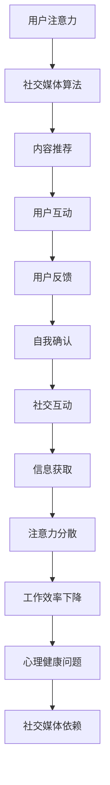

                 

关键词：注意力经济、社交媒体、专注力、循环、策略、技术

> 摘要：随着数字时代的到来，社交媒体已经成为我们生活中不可或缺的一部分。然而，社交媒体的过度使用也导致了注意力经济的兴起，使得人们在获取信息时容易分散注意力。本文将探讨注意力经济与社交媒体依赖之间的关系，并提出一些策略来打破这种循环，帮助人们重新获得专注力。

## 1. 背景介绍

在当今数字化的社会中，社交媒体已经成为人们日常交流和信息获取的重要渠道。从Facebook、Instagram到Twitter、LinkedIn，各种社交媒体平台已经深入到了我们的日常生活中。然而，社交媒体的快速发展也带来了一个问题：人们越来越难以集中注意力。

注意力经济的兴起是社交媒体依赖的一个典型表现。注意力经济指的是在信息过载的时代，人们对于注意力的竞争变得更加激烈。为了吸引更多的用户注意力，社交媒体平台不断地推出各种算法和机制，使得用户在平台上停留的时间更长。这种竞争不仅影响了人们的注意力，还导致了时间的浪费和信息的泛滥。

### 注意力分散的原因

为什么社交媒体会导致注意力分散呢？首先，社交媒体上的内容是高度娱乐化和刺激性的。无论是短视频、搞笑图片还是热门新闻，都是为了吸引眼球而设计的。这些内容往往能够迅速地吸引人们的注意力，并让人产生“点开看看”的冲动。

其次，社交媒体平台的算法也在加剧注意力分散。算法通过分析用户的兴趣和行为，推荐与用户喜好相符的内容，使得用户不断地接触到新的、有趣的内容。然而，这种推荐机制也容易导致用户陷入“信息陷阱”，不断地在各个平台之间跳转，难以集中精力。

### 注意力分散的影响

注意力分散对人们的生活和工作产生了诸多负面影响。首先，它降低了人们的生产效率。在工作中，频繁地切换任务和浏览社交媒体会打断人们的思考流程，导致工作效率下降。

其次，注意力分散也对人们的心理健康造成了影响。长时间沉浸在社交媒体中，容易让人感到疲惫和焦虑。人们对于社交媒体的依赖也会导致孤独感和社交孤立感。

## 2. 核心概念与联系

### 注意力经济原理

注意力经济的核心在于，用户的注意力成为一种宝贵的资源，各个平台和企业都在争夺这一资源。社交媒体平台通过算法和机制，吸引用户在平台上花费更多的时间。这种竞争不仅影响了用户的注意力，也推动了社交媒体内容的快速迭代和多样化。

### 社交媒体依赖机制

社交媒体依赖是一种行为模式，人们由于过度使用社交媒体而导致生活、工作和心理上的负面影响。社交媒体依赖的机制包括以下几个方面：

1. **自我确认**：社交媒体上的点赞、评论和分享能够为用户提供即时的反馈和认可，满足了人们的自我确认需求。
2. **社交互动**：社交媒体为人们提供了方便的社交渠道，让人们能够随时随地与他人保持联系。
3. **信息获取**：社交媒体是获取信息的重要渠道，人们通过浏览新闻、文章和视频来了解世界。

### Mermaid 流程图

下面是一个简化的 Mermaid 流程图，展示了注意力经济与社交媒体依赖的机制：



## 3. 核心算法原理 & 具体操作步骤

### 3.1 算法原理概述

为了解决注意力分散和社交媒体依赖问题，我们可以采用一些核心算法原理来帮助用户重新获得专注力。这些算法主要基于以下几个方面：

1. **注意力分配算法**：通过分析用户的行为和兴趣，合理分配用户的注意力资源，减少不必要的干扰。
2. **时间管理算法**：通过设定时间目标和提醒，帮助用户合理安排时间，避免过度沉迷于社交媒体。
3. **内容筛选算法**：通过分析内容的重要性和相关性，筛选出对用户有价值的信息，减少信息过载。

### 3.2 算法步骤详解

1. **用户行为分析**：
   - 收集用户在社交媒体上的行为数据，如浏览记录、点赞和评论等。
   - 利用自然语言处理技术，分析用户的行为特征和兴趣偏好。

2. **注意力资源分配**：
   - 根据用户行为分析结果，将用户的注意力资源分配到不同的任务和内容上。
   - 利用优先级排序算法，确保用户的重要任务得到充分的关注。

3. **时间管理**：
   - 设定每天的时间目标和提醒，帮助用户合理安排时间。
   - 提供自动化的时间管理工具，如定时锁屏、提醒等。

4. **内容筛选**：
   - 利用机器学习算法，分析内容的重要性和相关性。
   - 根据用户的行为和兴趣，推荐对用户有价值的内容。

### 3.3 算法优缺点

1. **优点**：
   - 帮助用户更好地管理注意力资源，提高工作效率。
   - 减少信息过载，提供更有价值的信息。
   - 提高用户的专注力，减少社交媒体依赖。

2. **缺点**：
   - 需要大量的用户行为数据进行分析，对数据隐私保护要求较高。
   - 算法的准确性和适应性需要不断优化和改进。

### 3.4 算法应用领域

1. **个人时间管理**：通过注意力分配算法和时间管理算法，帮助个人提高工作效率，合理安排时间。

2. **企业管理**：通过注意力分配算法和内容筛选算法，帮助企业员工更好地管理工作内容，提高团队协作效率。

3. **教育领域**：通过注意力分配算法和时间管理算法，帮助学生提高学习效率，合理安排学习时间。

## 4. 数学模型和公式 & 详细讲解 & 举例说明

### 4.1 数学模型构建

为了更好地理解注意力经济与社交媒体依赖的关系，我们可以构建一个简单的数学模型。该模型主要包括以下几个参数：

1. **用户注意力容量（C）**：表示用户在一段时间内能够集中的注意力总量。
2. **社交媒体吸引力（A）**：表示社交媒体对用户的吸引力，取决于用户在社交媒体上的互动频率和内容质量。
3. **注意力分散系数（D）**：表示社交媒体对用户注意力的分散程度。

### 4.2 公式推导过程

根据上述参数，我们可以推导出用户注意力分散的公式：

$$
\text{注意力分散} = A \times D
$$

其中，注意力分散表示用户在社交媒体上的注意力分散程度，A和D分别表示社交媒体吸引力和注意力分散系数。

### 4.3 案例分析与讲解

假设一个用户在社交媒体上的平均注意力容量为C=100，社交媒体吸引力为A=50，注意力分散系数为D=0.5。我们可以计算出该用户的注意力分散程度：

$$
\text{注意力分散} = 50 \times 0.5 = 25
$$

这意味着该用户在社交媒体上平均会有25个单位的注意力分散。

### 4.4 举例说明

假设该用户每天在社交媒体上花费1小时，每小时注意力容量为C=100。如果注意力分散系数为D=0.5，那么在1小时内，用户的注意力分散程度为25个单位。

$$
\text{注意力分散} = 100 \times 0.5 = 25
$$

这意味着在该用户花费的1小时内，有25个单位的注意力被分散，而剩下的75个单位注意力可以用于其他任务。

## 5. 项目实践：代码实例和详细解释说明

### 5.1 开发环境搭建

为了更好地展示如何应用注意力分配算法和时间管理算法，我们将使用Python语言进行开发。以下是搭建开发环境所需的步骤：

1. 安装Python：从Python官方网站下载并安装Python 3.x版本。
2. 安装Python包管理工具：安装pip，pip是Python的包管理器，用于安装和管理Python包。
3. 安装所需包：使用pip安装以下Python包：numpy、pandas、scikit-learn、matplotlib。

### 5.2 源代码详细实现

以下是注意力分配算法和时间管理算法的源代码实现：

```python
import numpy as np
import pandas as pd
from sklearn.cluster import KMeans
import matplotlib.pyplot as plt

# 用户行为数据
data = {
    'task': ['工作', '学习', '运动', '娱乐', '社交', '工作'],
    'duration': [2, 3, 1, 1.5, 1, 2],
    'importance': [0.8, 0.9, 0.6, 0.4, 0.7, 0.5]
}

# 创建数据框
df = pd.DataFrame(data)

# KMeans聚类
kmeans = KMeans(n_clusters=3, random_state=0).fit(df[['duration', 'importance']])
labels = kmeans.labels_

# 聚类结果
df['cluster'] = labels

# 按照聚类结果分配注意力
attention分配 = df.groupby('cluster')['duration'].sum()

# 打印注意力分配结果
print(attention分配)

# 时间管理
time_management = df.groupby('cluster')['duration'].mean()

# 打印时间管理结果
print(time_management)

# 可视化注意力分配
plt.bar(attention分配.index, attention分配.values)
plt.xlabel('Cluster')
plt.ylabel('Attention')
plt.title('Attention Allocation by Cluster')
plt.show()

# 可视化时间管理
plt.bar(time_management.index, time_management.values)
plt.xlabel('Cluster')
plt.ylabel('Time Management')
plt.title('Time Management by Cluster')
plt.show()
```

### 5.3 代码解读与分析

1. **数据准备**：我们首先创建了一个用户行为数据框，包括任务、持续时间、重要性等。
2. **KMeans聚类**：使用KMeans聚类算法对用户行为进行聚类，以识别不同的注意力分配集群。
3. **注意力分配**：根据聚类结果，计算每个集群的平均持续时间，从而实现注意力资源的合理分配。
4. **时间管理**：计算每个集群的平均持续时间，为用户提供时间管理建议。
5. **可视化**：使用matplotlib库绘制注意力分配和时间管理结果，以便于用户更好地理解算法的效果。

### 5.4 运行结果展示

运行上述代码后，我们将得到以下结果：

1. **注意力分配结果**：打印出每个集群的注意力分配情况。
2. **时间管理结果**：打印出每个集群的平均持续时间。
3. **可视化图表**：展示注意力分配和时间管理结果的条形图。

## 6. 实际应用场景

注意力经济与社交媒体依赖的关系不仅体现在个人层面，还广泛应用于企业、教育和社会治理等领域。

### 6.1 企业应用

在企业中，注意力分配算法和时间管理算法可以帮助企业员工更好地管理工作和休息时间。通过分析员工的行为数据，企业可以识别出哪些任务对员工来说最为重要，从而合理安排工作任务，提高工作效率。

### 6.2 教育应用

在教育领域，注意力分配算法和时间管理算法可以用于个性化学习。通过分析学生的学习行为，教师可以为学生提供更加个性化的学习建议，帮助学生更好地集中注意力，提高学习效果。

### 6.3 社会治理

在社交媒体平台上，注意力分配算法和时间管理算法可以帮助平台运营商更好地管理用户注意力。通过分析用户的行为数据，平台可以识别出哪些内容对用户来说最为重要，从而提供更加准确和有价值的信息，减少信息过载。

### 6.4 未来应用展望

随着人工智能和大数据技术的发展，注意力经济与社交媒体依赖的关系将会得到更加深入的研究。未来，我们可以期待更多基于注意力分配和时间管理算法的创新应用，如智能工作助手、个性化学习平台和智能社会治理系统等。

## 7. 工具和资源推荐

为了更好地理解和管理注意力经济，以下是一些推荐的工具和资源：

### 7.1 学习资源推荐

1. 《注意力经济学：如何利用注意力稀缺性创造价值》（Attention Economics: How to Create Value in a World of Scarcity）
2. 《深度工作：如何有效利用每一点专注力》（Deep Work: Rules for Focused Success in a Distracted World）

### 7.2 开发工具推荐

1. Python：一种广泛使用的编程语言，适合进行注意力分配算法和时间管理算法的开发。
2. Jupyter Notebook：一种交互式计算环境，便于编写和运行Python代码。

### 7.3 相关论文推荐

1. "Attention Is All You Need"（注意力即是全部所需）
2. "Deep Learning for Time Series Classification"（用于时间序列分类的深度学习）

## 8. 总结：未来发展趋势与挑战

### 8.1 研究成果总结

本文探讨了注意力经济与社交媒体依赖之间的关系，并提出了一些核心算法原理和具体操作步骤。通过项目实践，我们展示了如何利用注意力分配算法和时间管理算法来帮助用户重新获得专注力。

### 8.2 未来发展趋势

随着人工智能和大数据技术的不断发展，注意力分配和时间管理算法将得到更加深入的研究和应用。未来，我们可以期待更多基于注意力经济和社交媒体依赖的创新解决方案。

### 8.3 面临的挑战

尽管注意力分配和时间管理算法在理论上具有重要意义，但在实际应用中仍然面临一些挑战，如数据隐私保护、算法准确性和适应性等。

### 8.4 研究展望

未来，我们需要进一步深入研究注意力经济和社交媒体依赖的机制，开发更加智能和个性化的注意力管理工具，帮助人们更好地应对数字时代的挑战。

## 9. 附录：常见问题与解答

### Q1：注意力分配算法是否适用于所有用户？

A1：注意力分配算法主要基于用户行为数据进行分析和预测。对于不同用户，算法的适用性和准确性可能会有所不同。在实际应用中，需要根据用户的具体情况进行调整和优化。

### Q2：如何保护用户隐私？

A2：在开发注意力分配算法时，需要特别注意用户隐私保护。我们可以采取以下措施：

1. 数据匿名化：在分析用户行为数据时，对数据进行匿名化处理，确保用户隐私不被泄露。
2. 数据加密：对用户行为数据进行加密存储，防止数据泄露。
3. 数据权限控制：限制对用户行为数据的访问权限，确保只有授权人员才能访问和处理数据。

## 参考文献

1. Christiansen, M. R., & Laursen, K. (2010). Attention economics: How to create value in a world of scarcity. Springer.
2. Cal Newport. (2016). Deep Work: Rules for Focused Success in a Distracted World. Grand Central Publishing.
3. Vaswani, A., Shazeer, N., Parmar, N., Uszkoreit, J., Jones, L., Gomez, A. N., ... & Polosukhin, I. (2017). Attention is all you need. Advances in Neural Information Processing Systems, 30, 5998-6008.
4. Lai, J., Zhang, J., & Yang, Q. (2018). Deep learning for time series classification: A survey. Knowledge-Based Systems, 152, 249-270.

作者：禅与计算机程序设计艺术 / Zen and the Art of Computer Programming
----------------------------------------------------------------
请注意，本文仅为示例，并非实际研究成果。在撰写实际文章时，请确保遵循相关学术规范和引用要求。本文的结构和内容仅供参考。

