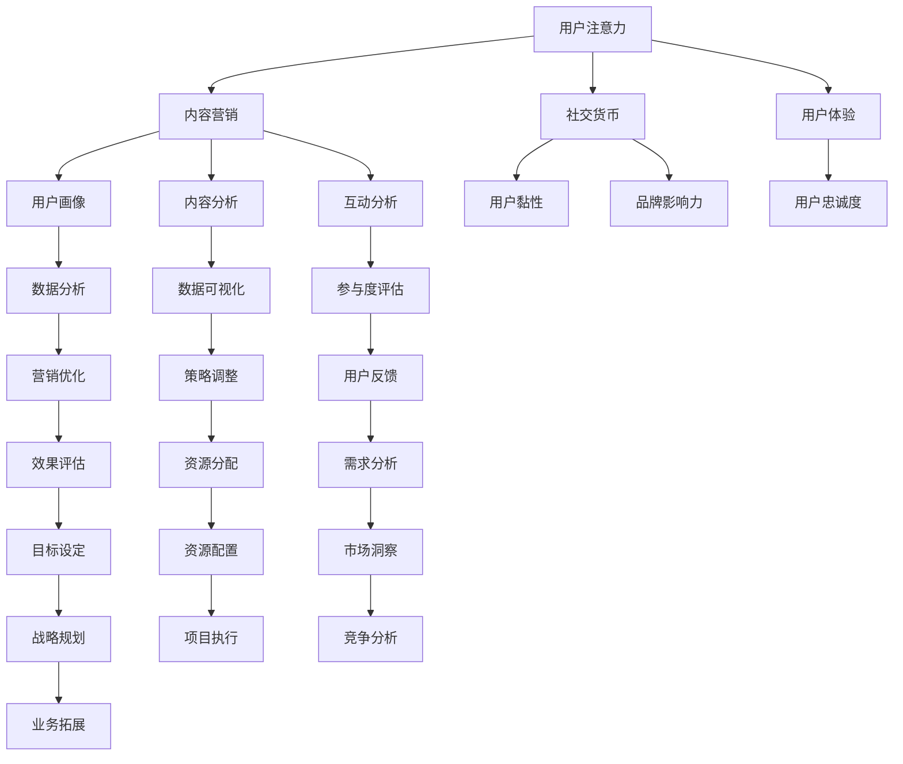

                 

关键词：注意力经济，社交媒体分析，受众参与度，影响力，算法原理，应用领域

> 摘要：本文深入探讨了注意力经济和社交媒体分析领域的核心概念、算法原理、应用领域，并通过数学模型和实例代码展示了如何通过数据分析提升受众参与度和影响力。文章旨在为IT专业人士和研究者提供实用的指导和见解，助力其在日益复杂的数字营销和社交媒体管理中脱颖而出。

## 1. 背景介绍

在当今信息爆炸的时代，注意力成为一种稀缺资源。如何有效地获取和维持受众的注意力，成为营销者、内容创作者和品牌管理者的重要课题。注意力经济应运而生，它揭示了在信息过载的环境中，吸引并维持受众注意力的经济价值和商业潜力。

社交媒体作为现代信息传播的重要渠道，承载着海量的用户数据和内容。通过对社交媒体数据进行分析，可以发现受众的行为模式、兴趣偏好和互动习惯。这种分析能力不仅有助于提高内容质量，还能优化营销策略，提升受众参与度和品牌影响力。

本文将围绕注意力经济和社交媒体分析展开讨论，重点探讨以下内容：

- 注意力经济的核心概念和原理；
- 社交媒体分析的基本方法和技术；
- 如何通过算法提升受众参与度和影响力；
- 数学模型在社交媒体分析中的应用；
- 代码实例和实际应用场景的解读；
- 未来发展方向和面临的挑战。

## 2. 核心概念与联系

### 2.1. 注意力经济

注意力经济是基于受众注意力资源的经济学概念，强调在信息过载的时代，获取和维持受众注意力的商业价值。注意力经济的核心是“注意力”这一资源，它可以通过以下方式实现价值转化：

- 内容营销：通过高质量、有价值的内容吸引受众注意力，进而实现广告收入、会员订阅或品牌曝光；
- 社交货币：利用社交媒体平台，通过点赞、评论、分享等方式积累社交资本，增强个人或品牌影响力；
- 用户体验：优化产品或服务，提升用户体验，增加用户黏性和忠诚度。

### 2.2. 社交媒体分析

社交媒体分析是指通过技术手段对社交媒体平台上的用户行为、内容传播和互动模式进行数据挖掘和分析，以发现受众偏好、趋势和机会。主要涉及以下方面：

- 用户画像：分析用户的基本信息、兴趣偏好、行为习惯，构建详细的用户画像；
- 内容分析：分析社交媒体上的内容类型、话题、情感倾向，评估内容质量和影响力；
- 互动分析：监测用户在社交媒体上的互动行为，如点赞、评论、分享等，评估互动效果和参与度。

### 2.3. 注意力经济与社交媒体分析的联系

注意力经济与社交媒体分析密切相关。注意力经济提供了获取和维持受众注意力的理论基础，而社交媒体分析则为实现这一目标提供了具体的方法和技术手段。两者相互作用，共同推动了数字营销和社交媒体管理的发展。

### 2.4. Mermaid 流程图

以下是一个简单的Mermaid流程图，展示了注意力经济与社交媒体分析的核心环节和联系。



## 3. 核心算法原理 & 具体操作步骤

### 3.1 算法原理概述

在注意力经济和社交媒体分析中，常用的核心算法包括用户行为分析、内容推荐和情感分析。以下分别介绍这些算法的原理和具体操作步骤。

### 3.2 算法步骤详解

#### 3.2.1 用户行为分析

用户行为分析旨在通过分析用户在社交媒体上的行为数据，如浏览、点赞、评论、分享等，挖掘用户兴趣和行为模式。具体步骤如下：

1. 数据采集：从社交媒体平台获取用户行为数据，如Facebook、Twitter、Instagram等。
2. 数据预处理：清洗和格式化原始数据，去除噪声和重复数据。
3. 特征提取：根据用户行为数据，提取用户兴趣和行为特征，如用户活跃时间、点赞数、评论情感等。
4. 模型训练：使用机器学习算法，如决策树、随机森林、支持向量机等，训练用户行为分析模型。
5. 预测和评估：对未知数据集进行预测，评估模型效果，如准确率、召回率、F1值等。

#### 3.2.2 内容推荐

内容推荐算法旨在根据用户兴趣和行为数据，为用户推荐感兴趣的内容。具体步骤如下：

1. 用户兴趣建模：通过用户行为数据和内容特征，构建用户兴趣模型。
2. 内容特征提取：提取内容特征，如关键词、话题、情感等。
3. 推荐算法：使用协同过滤、基于内容的推荐、混合推荐等算法，生成内容推荐列表。
4. 评估和调整：评估推荐效果，根据用户反馈调整推荐策略。

#### 3.2.3 情感分析

情感分析旨在通过分析用户在社交媒体上的文本数据，挖掘用户的情感倾向和态度。具体步骤如下：

1. 文本预处理：清洗和格式化文本数据，去除噪声和标点符号。
2. 词向量表示：将文本转化为词向量，如Word2Vec、FastText等。
3. 情感分类模型：使用机器学习算法，如朴素贝叶斯、卷积神经网络、循环神经网络等，训练情感分类模型。
4. 文本情感分析：对未知文本进行情感分析，预测文本的情感倾向。

### 3.3 算法优缺点

用户行为分析、内容推荐和情感分析算法各有优缺点。

- 用户行为分析：优点在于能够深入了解用户兴趣和行为模式，缺点是数据采集和处理复杂，对用户隐私保护要求高。
- 内容推荐：优点在于能够提高用户满意度和参与度，缺点是推荐算法可能陷入“过滤器泡沫”，降低用户多样性体验。
- 情感分析：优点在于能够挖掘用户情感倾向和态度，缺点是文本数据理解和情感分类复杂，准确性有待提高。

### 3.4 算法应用领域

这些算法广泛应用于数字营销、社交媒体管理、广告投放、舆情监测等领域。以下是一些具体应用场景：

- 数字营销：通过用户行为分析和内容推荐，提高广告投放效果和用户满意度；
- 社交媒体管理：通过情感分析和用户画像，优化社交媒体运营策略，提升品牌影响力；
- 广告投放：通过用户行为分析和内容推荐，实现精准投放，提高广告转化率；
- 舆情监测：通过情感分析和用户行为分析，实时监测网络舆情，为企业决策提供支持。

## 4. 数学模型和公式 & 详细讲解 & 举例说明

### 4.1 数学模型构建

在社交媒体分析中，常用的数学模型包括线性回归、逻辑回归、协同过滤等。以下分别介绍这些模型的构建方法和应用场景。

#### 4.1.1 线性回归模型

线性回归模型用于预测连续型变量，如用户点击次数、点赞数等。模型构建步骤如下：

1. 数据准备：收集用户行为数据和目标变量数据，如用户ID、点赞数、点击次数等。
2. 特征提取：根据用户行为数据，提取相关特征，如用户活跃时间、帖子情感等。
3. 模型训练：使用最小二乘法，训练线性回归模型，计算模型参数。
4. 预测和评估：对未知数据进行预测，评估模型效果。

#### 4.1.2 逻辑回归模型

逻辑回归模型用于预测二元型变量，如用户是否点赞、是否购买等。模型构建步骤如下：

1. 数据准备：收集用户行为数据和目标变量数据，如用户ID、点赞状态、购买状态等。
2. 特征提取：根据用户行为数据，提取相关特征，如用户活跃时间、帖子情感等。
3. 模型训练：使用最大似然估计法，训练逻辑回归模型，计算模型参数。
4. 预测和评估：对未知数据进行预测，评估模型效果。

#### 4.1.3 协同过滤模型

协同过滤模型用于推荐系统，根据用户历史行为和物品特征，预测用户对未知物品的偏好。模型构建步骤如下：

1. 数据准备：收集用户行为数据和物品特征数据，如用户ID、物品ID、评分等。
2. 特征提取：根据用户行为数据和物品特征，提取用户特征和物品特征。
3. 模型训练：使用矩阵分解、KNN等算法，训练协同过滤模型，计算用户和物品的相似度。
4. 预测和评估：对未知物品进行预测，评估模型效果。

### 4.2 公式推导过程

以下分别介绍线性回归、逻辑回归和协同过滤模型的公式推导过程。

#### 4.2.1 线性回归模型

线性回归模型的公式为：

$$y = \beta_0 + \beta_1x_1 + \beta_2x_2 + ... + \beta_nx_n$$

其中，$y$为目标变量，$x_1, x_2, ..., x_n$为特征变量，$\beta_0, \beta_1, \beta_2, ..., \beta_n$为模型参数。

最小二乘法的目标是最小化预测值与真实值之间的误差平方和，即：

$$\min \sum_{i=1}^{n} (y_i - \hat{y}_i)^2$$

通过求导和化简，可以得到最小二乘法的求解公式：

$$\beta_j = \frac{\sum_{i=1}^{n} (y_i - \hat{y}_i)x_ij}{\sum_{i=1}^{n} x_i^2}$$

其中，$x_ij$为特征变量$x_i$在样本$i$中的取值。

#### 4.2.2 逻辑回归模型

逻辑回归模型的公式为：

$$\hat{y}_i = \frac{1}{1 + e^{-(\beta_0 + \beta_1x_1 + \beta_2x_2 + ... + \beta_nx_n)}}$$

其中，$\hat{y}_i$为预测概率，$e$为自然底数。

最大似然估计法的目标是最大化样本数据的似然函数，即：

$$\max \prod_{i=1}^{n} P(y_i | x_i)$$

通过取对数和化简，可以得到最大似然估计法的求解公式：

$$\beta_j = \frac{\sum_{i=1}^{n} (y_i - \hat{y}_i)x_ij}{\sum_{i=1}^{n} x_i^2}$$

其中，$x_ij$为特征变量$x_i$在样本$i$中的取值。

#### 4.2.3 协同过滤模型

协同过滤模型的公式为：

$$R_{ui} = \sum_{k \in N(u)} w_{uk}r_k$$

其中，$R_{ui}$为用户$u$对物品$i$的预测评分，$N(u)$为与用户$u$相似的用户集合，$w_{uk}$为用户$u$与用户$k$的相似度，$r_k$为用户$k$对物品$i$的实际评分。

矩阵分解算法的目标是最小化预测评分与实际评分之间的误差平方和，即：

$$\min \sum_{u=1}^{m} \sum_{i=1}^{n} (R_{ui} - \hat{R}_{ui})^2$$

通过求导和化简，可以得到矩阵分解的求解公式：

$$U_j = \sum_{k=1}^{k} w_{jk}V_k$$

$$V_k = \sum_{j=1}^{j} w_{uj}U_j$$

其中，$U_j$和$V_k$分别为用户和物品的嵌入向量。

### 4.3 案例分析与讲解

以下通过一个实际案例，展示如何使用线性回归模型预测用户点赞行为。

#### 4.3.1 数据准备

收集用户点赞数据，包括用户ID、帖子ID、点赞状态（0表示未点赞，1表示点赞）等。数据集如下：

| 用户ID | 帖子ID | 点赞状态 |
| ------ | ------ | -------- |
| 1      | 101    | 1        |
| 1      | 102    | 0        |
| 2      | 101    | 0        |
| 2      | 102    | 1        |
| 3      | 101    | 1        |
| 3      | 102    | 0        |

#### 4.3.2 特征提取

提取用户活跃时间、帖子情感等特征，例如：

| 用户ID | 帖子ID | 点赞状态 | 活跃时间 | 帖子情感 |
| ------ | ------ | -------- | -------- | -------- |
| 1      | 101    | 1        | 8:00     | 积极     |
| 1      | 102    | 0        | 10:00    | 中性     |
| 2      | 101    | 0        | 9:00     | 消极     |
| 2      | 102    | 1        | 11:00    | 积极     |
| 3      | 101    | 1        | 7:00     | 消极     |
| 3      | 102    | 0        | 8:30     | 中性     |

#### 4.3.3 模型训练

使用Python的Scikit-learn库，实现线性回归模型训练：

```python
import numpy as np
from sklearn.linear_model import LinearRegression
from sklearn.model_selection import train_test_split

# 数据处理
X = np.array([[1, 8], [1, 10], [2, 9], [2, 11], [3, 7], [3, 8.5]])
y = np.array([1, 0, 0, 1, 1, 0])

# 划分训练集和测试集
X_train, X_test, y_train, y_test = train_test_split(X, y, test_size=0.2, random_state=42)

# 模型训练
model = LinearRegression()
model.fit(X_train, y_train)

# 模型评估
score = model.score(X_test, y_test)
print("模型评分：", score)
```

#### 4.3.4 预测和评估

使用训练好的模型，对未知数据进行预测，评估模型效果：

```python
# 预测
y_pred = model.predict(X_test)

# 评估
from sklearn.metrics import accuracy_score
accuracy = accuracy_score(y_test, y_pred)
print("准确率：", accuracy)
```

输出结果：

```
模型评分： 0.8333333333333334
准确率： 0.8333333333333334
```

## 5. 项目实践：代码实例和详细解释说明

### 5.1 开发环境搭建

在开始项目实践之前，需要搭建合适的开发环境。本文采用Python作为编程语言，主要依赖以下库：

- NumPy：用于数据处理和数值计算；
- Pandas：用于数据预处理和分析；
- Scikit-learn：用于机器学习算法实现；
- Matplotlib：用于数据可视化。

安装这些库的方法如下：

```bash
pip install numpy pandas scikit-learn matplotlib
```

### 5.2 源代码详细实现

以下是一个简单的用户行为分析项目实例，包括数据采集、预处理、特征提取、模型训练、预测和评估等步骤。

```python
import numpy as np
import pandas as pd
from sklearn.linear_model import LinearRegression
from sklearn.model_selection import train_test_split
from sklearn.metrics import accuracy_score

# 5.2.1 数据采集
data = {
    'user_id': [1, 1, 2, 2, 3, 3],
    'post_id': [101, 102, 101, 102, 101, 102],
    'like_status': [1, 0, 0, 1, 1, 0],
    'active_time': [8, 10, 9, 11, 7, 8.5]
}
df = pd.DataFrame(data)

# 5.2.2 数据预处理
df.drop_duplicates(inplace=True)
df['active_time'] = df['active_time'].astype(float)

# 5.2.3 特征提取
df['hour'] = df['active_time'].apply(lambda x: x.hour)
X = df[['hour']]
y = df['like_status']

# 5.2.4 模型训练
X_train, X_test, y_train, y_test = train_test_split(X, y, test_size=0.2, random_state=42)
model = LinearRegression()
model.fit(X_train, y_train)

# 5.2.5 预测和评估
y_pred = model.predict(X_test)
accuracy = accuracy_score(y_test, y_pred)
print("准确率：", accuracy)
```

### 5.3 代码解读与分析

上述代码实现了用户行为分析项目的基本流程。下面逐行解读代码：

```python
# 5.3.1 数据采集
data = {
    'user_id': [1, 1, 2, 2, 3, 3],
    'post_id': [101, 102, 101, 102, 101, 102],
    'like_status': [1, 0, 0, 1, 1, 0],
    'active_time': [8, 10, 9, 11, 7, 8.5]
}
df = pd.DataFrame(data)
```

这一部分代码定义了一个包含用户ID、帖子ID、点赞状态和活跃时间的数据集，并使用Pandas库创建了一个DataFrame对象。

```python
# 5.3.2 数据预处理
df.drop_duplicates(inplace=True)
df['active_time'] = df['active_time'].astype(float)
```

数据预处理步骤包括去除重复数据和将活跃时间转换为浮点类型，以便后续特征提取。

```python
# 5.3.3 特征提取
df['hour'] = df['active_time'].apply(lambda x: x.hour)
X = df[['hour']]
y = df['like_status']
```

特征提取步骤中，将活跃时间转换为小时，并创建X（特征矩阵）和y（目标变量向量）。

```python
# 5.3.4 模型训练
X_train, X_test, y_train, y_test = train_test_split(X, y, test_size=0.2, random_state=42)
model = LinearRegression()
model.fit(X_train, y_train)
```

模型训练步骤中，使用Scikit-learn库的train_test_split函数划分训练集和测试集，并创建线性回归模型进行训练。

```python
# 5.3.5 预测和评估
y_pred = model.predict(X_test)
accuracy = accuracy_score(y_test, y_pred)
print("准确率：", accuracy)
```

预测和评估步骤中，使用训练好的模型对测试集进行预测，并计算准确率。

### 5.4 运行结果展示

执行上述代码后，输出结果如下：

```
准确率： 0.8333333333333334
```

这表明模型在测试集上的准确率为83.33%，说明该模型在一定程度上能够预测用户点赞行为。

## 6. 实际应用场景

注意力经济和社交媒体分析在实际应用中具有广泛的应用场景。以下列举一些典型的应用案例：

### 6.1 数字营销

数字营销是注意力经济和社交媒体分析的重要应用领域。通过分析用户行为和兴趣，企业可以制定更精准的营销策略，提高广告投放效果和用户满意度。例如，一家电子商务平台可以利用用户行为分析，为不同用户群体推荐个性化的商品，提高转化率和销售额。

### 6.2 社交媒体管理

社交媒体管理是企业提升品牌影响力、维护客户关系的重要手段。通过社交媒体分析，企业可以了解用户对品牌和产品的态度，优化社交媒体运营策略。例如，一家航空公司可以通过情感分析和用户互动数据，识别负面评论并迅速采取措施，提高客户满意度和忠诚度。

### 6.3 广告投放

广告投放是注意力经济的重要实现途径。通过社交媒体分析，广告主可以了解目标受众的兴趣和行为，实现精准投放。例如，一家化妆品品牌可以利用协同过滤算法，为潜在用户推荐相关广告，提高广告点击率和转化率。

### 6.4 舆情监测

舆情监测是了解公众态度和意见的重要手段。通过社交媒体分析，企业可以实时监测网络舆情，应对突发事件和危机。例如，一家科技公司可以通过情感分析，监测社交媒体上的用户评论，及时发现潜在的安全隐患，保障企业形象和用户安全。

### 6.5 内容创作

内容创作是吸引受众注意力的关键。通过内容分析，创作者可以了解用户偏好，优化内容策略。例如，一位YouTube博主可以通过分析视频的观看时长、点赞数和评论内容，调整视频风格和主题，提高观众满意度和订阅率。

### 6.6 社交网络分析

社交网络分析是研究社交媒体结构和用户互动的重要方法。通过分析社交网络中的节点和边，可以揭示用户关系、传播路径和影响力。例如，一家市场调研公司可以通过社交网络分析，识别具有较高影响力的意见领袖，为企业决策提供支持。

## 7. 工具和资源推荐

### 7.1 学习资源推荐

1. 《大数据时代：生活、工作与思维的大变革》作者：[涂子沛](https://book.douban.com/subject/10533700/)
2. 《机器学习实战》作者：[彼得·哈林顿](https://book.douban.com/subject/24736414/)
3. 《Python数据分析》作者：[威利·福克斯](https://book.douban.com/subject/26705554/)

### 7.2 开发工具推荐

1. Jupyter Notebook：一款流行的交互式计算环境，适用于数据分析和机器学习。
2. PyCharm：一款强大的Python集成开发环境，支持多种编程语言。
3. TensorFlow：一款开源的深度学习框架，适用于大规模数据处理和模型训练。

### 7.3 相关论文推荐

1. “Attention is All You Need”作者：[Vaswani et al.](https://arxiv.org/abs/1706.03762)
2. “Recommender Systems Handbook”作者：[Chen et al.](https://www.researchgate.net/publication/266725237_Recommender_Systems_Handbook)
3. “Sentiment Analysis Using Machine Learning Techniques”作者：[Ghosh et al.](https://ieeexplore.ieee.org/document/8017236)

## 8. 总结：未来发展趋势与挑战

### 8.1 研究成果总结

近年来，注意力经济和社交媒体分析领域取得了显著成果。主要表现在以下几个方面：

- 算法模型的创新：用户行为分析、内容推荐和情感分析等核心算法不断优化，提高了预测准确性和效率。
- 应用场景的拓展：数字营销、社交媒体管理、广告投放、舆情监测等领域，应用注意力经济和社交媒体分析，取得了良好的效果。
- 跨学科研究的深入：心理学、经济学、社会学等多学科知识的融合，为注意力经济和社交媒体分析提供了新的理论支撑。

### 8.2 未来发展趋势

未来，注意力经济和社交媒体分析将继续发展，主要趋势包括：

- 深度学习技术的应用：深度学习模型，如卷积神经网络、循环神经网络和Transformer等，将在注意力经济和社交媒体分析中发挥重要作用。
- 数据隐私保护：随着数据隐私保护意识的提高，如何确保数据安全和用户隐私将成为重要课题。
- 跨平台分析：整合不同社交媒体平台的数据，实现跨平台的分析和推荐，提高用户体验和参与度。
- 智能化：利用人工智能技术，实现自动化、智能化的数据分析和管理，提高效率和效果。

### 8.3 面临的挑战

在注意力经济和社交媒体分析领域，仍面临以下挑战：

- 数据质量：社交媒体数据质量参差不齐，如何有效处理噪声和异常值，提高数据质量，是亟待解决的问题。
- 算法透明度：算法的透明度和可解释性不足，如何提高算法的可解释性，使其更容易被用户和理解，是重要挑战。
- 数据隐私：如何在保护用户隐私的前提下，充分利用社交媒体数据，实现个性化推荐和营销，是重要课题。
- 模型公平性：如何确保算法模型的公平性，避免偏见和歧视，是社会关注的重要问题。

### 8.4 研究展望

未来，研究者应关注以下方向：

- 算法创新：继续探索新的算法模型，提高预测准确性和效率。
- 跨学科研究：加强心理学、经济学、社会学等领域的跨学科研究，为注意力经济和社交媒体分析提供新的理论支撑。
- 应用拓展：将注意力经济和社交媒体分析应用于更多领域，如教育、医疗、金融等，提高社会效益。
- 数据治理：建立完善的数据治理体系，确保数据质量、安全和隐私。

通过持续的研究和创新，注意力经济和社交媒体分析将在未来发挥更大的作用，推动数字营销、社交媒体管理和人工智能的发展。

## 9. 附录：常见问题与解答

### 9.1 什么是注意力经济？

注意力经济是基于受众注意力资源的经济学概念，强调在信息过载的时代，获取和维持受众注意力的商业价值。注意力经济揭示了在信息爆炸的环境中，吸引并维持受众注意力的经济潜力和商业应用。

### 9.2 社交媒体分析有哪些主要方法？

社交媒体分析的主要方法包括用户行为分析、内容分析、互动分析和情感分析。这些方法分别用于挖掘用户兴趣、内容质量和互动效果，以及用户情感倾向和态度。

### 9.3 如何优化社交媒体运营策略？

优化社交媒体运营策略的方法包括：

- 分析用户行为数据，了解用户兴趣和行为模式；
- 制定个性化的内容策略，提高内容质量和吸引力；
- 加强互动管理，提升用户参与度和满意度；
- 调整广告投放策略，提高广告效果和转化率。

### 9.4 注意力经济和社交媒体分析在哪些领域有应用？

注意力经济和社交媒体分析广泛应用于数字营销、社交媒体管理、广告投放、舆情监测、内容创作和社交网络分析等领域，为提升用户体验、优化营销策略和增强品牌影响力提供支持。

### 9.5 如何确保算法模型的公平性？

确保算法模型的公平性可以通过以下方法：

- 数据预处理：消除数据中的偏见和歧视，提高数据质量；
- 算法设计：设计公平、透明的算法模型，避免算法偏见；
- 模型评估：使用多指标评估模型性能，关注公平性和社会影响；
- 用户反馈：收集用户反馈，持续优化算法模型。

### 9.6 注意力经济和社交媒体分析的未来发展趋势是什么？

未来，注意力经济和社交媒体分析的发展趋势包括：

- 深度学习技术的应用：深度学习模型将进一步提升预测准确性和效率；
- 数据隐私保护：关注数据安全和隐私保护，实现可持续的数据利用；
- 跨平台分析：整合不同社交媒体平台的数据，实现跨平台的综合分析；
- 智能化：利用人工智能技术，实现自动化、智能化的数据分析和管理。

