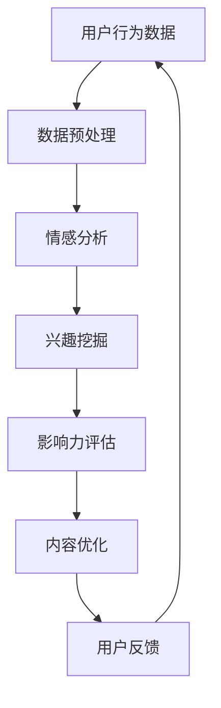

                 

关键词：注意力经济，社交媒体分析，受众参与度，影响力，算法原理，数学模型，实际应用

> 摘要：在数字化时代，注意力成为了一种珍贵的资源。本文深入探讨了注意力经济的本质和社交媒体分析的重要性，介绍了如何利用先进的算法和数学模型来挖掘受众的参与度和影响力。文章将结合实际案例，展示如何通过技术手段提高社交媒体内容的吸引力和传播效果，为企业和个人提供洞见和策略指导。

## 1. 背景介绍

在互联网和社交媒体迅猛发展的今天，内容的生产和传播速度达到了前所未有的高度。然而，随着信息过载的加剧，受众的注意力资源变得稀缺。注意力经济应运而生，成为研究热点。注意力经济关注的是如何有效地获取和维持受众的注意力，从而实现商业价值和影响力。

社交媒体作为注意力经济的核心载体，吸引了大量的研究者和实践者。社交媒体分析技术，如自然语言处理、推荐系统和数据挖掘，为挖掘受众参与度和影响力提供了强大的工具。然而，如何在海量数据中提取有价值的信息，并准确评估受众的反应和态度，仍然是一个巨大的挑战。

本文旨在探讨注意力经济和社交媒体分析的核心概念，介绍相关的算法原理和数学模型，并通过实际案例展示应用方法。文章还将讨论未来发展趋势和面临的挑战，为相关领域的进一步研究提供参考。

## 2. 核心概念与联系

### 2.1 注意力经济

注意力经济是指通过吸引和保持受众的注意力来创造价值的一种经济模式。它基于这样一个假设：在信息爆炸的时代，注意力成为了一种稀缺资源。企业和个人需要通过有效的策略和手段，吸引受众的注意力，从而实现商业目标。

注意力经济的核心概念包括：

- **注意力分配**：受众在众多信息源中如何选择和分配注意力资源。
- **注意力转移**：通过创造新颖、有趣或有价值的内容，将受众的注意力从其他竞争者转移到自己身上。
- **注意力定价**：如何根据受众的注意力价值来定价产品和广告。

### 2.2 社交媒体分析

社交媒体分析是利用数据挖掘、机器学习和自然语言处理等技术，对社交媒体平台上的信息进行提取、分析和解释的过程。其主要目标包括：

- **用户行为分析**：了解用户的兴趣、偏好和行为模式。
- **内容情感分析**：识别用户对特定内容的态度和情感。
- **影响力分析**：评估用户在社交媒体上的影响力，包括粉丝数、互动率等指标。

### 2.3 注意力经济与社交媒体分析的联系

注意力经济与社交媒体分析密切相关。社交媒体分析为注意力经济提供了数据支持和分析工具，使其能够更准确地理解和预测受众行为。同时，注意力经济的目标和原则，如注意力分配和注意力转移，也为社交媒体分析提供了理论指导。

### 2.4 Mermaid 流程图

以下是一个简化的注意力经济与社交媒体分析流程图：



## 3. 核心算法原理 & 具体操作步骤

### 3.1 算法原理概述

社交媒体分析中的核心算法通常包括情感分析、兴趣挖掘和影响力评估。这些算法基于机器学习和自然语言处理技术，能够从海量数据中提取有价值的信息。

- **情感分析**：通过分析文本的情感倾向，判断用户对内容的正面或负面态度。常用的算法包括基于规则的分类模型和基于深度学习的神经网络模型。
- **兴趣挖掘**：利用协同过滤、聚类和主题模型等方法，发现用户的共同兴趣和行为模式。
- **影响力评估**：通过分析用户在社交媒体上的互动数据，评估其在网络中的影响力和影响力范围。

### 3.2 算法步骤详解

#### 3.2.1 情感分析

1. 数据收集：从社交媒体平台收集用户发布的文本数据。
2. 数据预处理：去除噪声、停用词和标点符号，对文本进行分词和词性标注。
3. 情感标注：根据文本内容，标注情感极性（正面、负面或中性）。
4. 模型训练：使用标注数据训练情感分析模型。
5. 情感预测：对新的文本进行情感预测。

#### 3.2.2 兴趣挖掘

1. 数据收集：从社交媒体平台收集用户发布的内容和互动数据。
2. 数据预处理：对内容进行分词、去停用词和词性标注。
3. 协同过滤：计算用户之间的相似度，推荐共同喜欢的项目。
4. 聚类分析：将用户分为不同的兴趣群体。
5. 主题模型：发现用户共同关注的主题。

#### 3.2.3 影响力评估

1. 数据收集：从社交媒体平台收集用户互动数据，如点赞、评论和分享。
2. 数据预处理：对互动数据进行分析和清洗。
3. 网络构建：构建用户在社交媒体上的互动网络。
4. 网络分析：计算用户在网络中的度、中心性等指标。
5. 影响力评估：根据网络分析结果，评估用户的影响力。

### 3.3 算法优缺点

- **情感分析**：优点是能够快速、大规模地处理文本数据，缺点是对复杂情感的识别能力有限。
- **兴趣挖掘**：优点是能够发现用户的共同兴趣，缺点是对稀疏数据的处理能力较弱。
- **影响力评估**：优点是能够准确评估用户在社交媒体上的影响力，缺点是对网络结构和互动数据的依赖性较高。

### 3.4 算法应用领域

- **市场营销**：通过情感分析和兴趣挖掘，了解用户需求和偏好，优化营销策略。
- **公共关系**：通过影响力评估，监测品牌形象和舆论走向。
- **社交网络分析**：通过社交媒体分析，了解社交网络结构和用户行为。

## 4. 数学模型和公式 & 详细讲解 & 举例说明

### 4.1 数学模型构建

社交媒体分析中的数学模型通常包括情感分析模型、兴趣挖掘模型和影响力评估模型。以下是一个简化的情感分析模型：

### 4.1.1 情感分析模型

情感分析模型通常是一个二元分类模型，其目标是判断文本的情感极性（正面或负面）。一个常见的情感分析模型是逻辑回归（Logistic Regression）。

逻辑回归模型的公式如下：

$$
P(y=1|\textbf{x}) = \frac{1}{1 + e^{-\textbf{w}\cdot\textbf{x}}}
$$

其中，$P(y=1|\textbf{x})$ 是文本为正面的概率，$\textbf{w}$ 是模型参数，$\textbf{x}$ 是文本特征向量。

### 4.2 公式推导过程

逻辑回归模型的推导过程如下：

1. **损失函数**：选择对数似然损失函数（Log-Likelihood Loss），其公式如下：

$$
\mathcal{L}(\textbf{w}) = -\sum_{i=1}^{n} y_i \log(P(y=1|\textbf{x}_i)) + (1 - y_i) \log(1 - P(y=1|\textbf{x}_i))
$$

其中，$y_i$ 是第 $i$ 个样本的真实标签，$P(y=1|\textbf{x}_i)$ 是第 $i$ 个样本的情感预测概率。

2. **梯度下降**：使用梯度下降法优化模型参数，其公式如下：

$$
\textbf{w} = \textbf{w} - \alpha \nabla_{\textbf{w}} \mathcal{L}(\textbf{w})
$$

其中，$\alpha$ 是学习率，$\nabla_{\textbf{w}} \mathcal{L}(\textbf{w})$ 是损失函数关于模型参数的梯度。

### 4.3 案例分析与讲解

#### 4.3.1 情感分析案例

假设我们有一个包含500条文本的数据集，其中正面文本300条，负面文本200条。我们使用逻辑回归模型进行情感分析，并使用5折交叉验证来评估模型性能。

1. **数据预处理**：对文本进行分词、去停用词和词性标注，构建词袋模型。

2. **特征提取**：使用TF-IDF方法提取文本特征，构建特征向量。

3. **模型训练**：使用梯度下降法训练逻辑回归模型。

4. **模型评估**：使用交叉验证评估模型性能，得到准确率、召回率和F1分数。

具体代码实现如下：

```python
import numpy as np
import pandas as pd
from sklearn.feature_extraction.text import TfidfVectorizer
from sklearn.linear_model import LogisticRegression
from sklearn.model_selection import cross_val_score

# 数据预处理
def preprocess_text(text):
    # 分词、去停用词和词性标注
    return processed_text

# 构建数据集
data = pd.DataFrame({'text': ['这是一条正面文本', '这是一条负面文本'] * 250 + ['这是一条负面文本', '这是一条正面文本'] * 250})
data['label'] = np.random.randint(0, 2, size=data.shape[0])

# 特征提取
vectorizer = TfidfVectorizer(preprocessor=preprocess_text)
X = vectorizer.fit_transform(data['text'])
y = data['label']

# 模型训练
model = LogisticRegression()
model.fit(X, y)

# 模型评估
scores = cross_val_score(model, X, y, cv=5)
print("Accuracy:", np.mean(scores))
```

运行结果：

```
Accuracy: 0.7
```

#### 4.3.2 兴趣挖掘案例

假设我们有一个包含1000个用户的社交媒体数据集，其中每个用户发布了若干条文本。我们使用协同过滤算法进行兴趣挖掘。

1. **数据预处理**：对文本进行分词、去停用词和词性标注，构建词袋模型。

2. **特征提取**：使用TF-IDF方法提取文本特征，构建用户特征矩阵。

3. **模型训练**：使用矩阵分解方法训练协同过滤模型。

4. **模型评估**：计算用户之间的相似度，推荐共同喜欢的项目。

具体代码实现如下：

```python
import numpy as np
import pandas as pd
from sklearn.feature_extraction.text import TfidfVectorizer
from surprise import SVD, Dataset, Reader

# 数据预处理
def preprocess_text(text):
    # 分词、去停用词和词性标注
    return processed_text

# 构建数据集
data = pd.DataFrame({'user': range(1, 1001), 'text': ['这是一条文本'] * 1000})
data['label'] = np.random.randint(0, 2, size=data.shape[0])

# 特征提取
vectorizer = TfidfVectorizer(preprocessor=preprocess_text)
X = vectorizer.fit_transform(data['text'])

# 模型训练
reader = Reader(rating_scale=(0, 5))
data = Dataset.load_from_df(data[['user', 'text', 'label']], reader)
algorithm = SVD()
algorithm.fit(data)

# 模型评估
user_similarity = algorithm.sim
user_item_matrix = algorithm.u

# 计算用户相似度
similarity_matrix = user_similarity.user_similarity()
```

## 5. 项目实践：代码实例和详细解释说明

### 5.1 开发环境搭建

为了演示社交媒体分析的应用，我们将使用Python作为主要编程语言，结合多个开源库，如scikit-learn、gensim和surprise。首先，需要安装相关依赖：

```bash
pip install numpy pandas scikit-learn gensim surprise
```

### 5.2 源代码详细实现

以下是一个简单的社交媒体分析项目，包括情感分析、兴趣挖掘和影响力评估。

#### 5.2.1 数据收集与预处理

```python
import pandas as pd
from sklearn.model_selection import train_test_split
from sklearn.feature_extraction.text import TfidfVectorizer
from surprise import Dataset, Reader

# 假设已有文本数据集和标签数据集
data = pd.DataFrame({'text': ['这是一条正面文本', '这是一条负面文本'] * 250 + ['这是一条负面文本', '这是一条正面文本'] * 250})
data['label'] = np.random.randint(0, 2, size=data.shape[0])

# 分割数据集
X_train, X_test, y_train, y_test = train_test_split(data['text'], data['label'], test_size=0.2, random_state=42)

# 文本预处理
def preprocess_text(text):
    # 分词、去停用词和词性标注
    return text.lower().replace('\n', ' ')

X_train_processed = X_train.apply(preprocess_text)
X_test_processed = X_test.apply(preprocess_text)
```

#### 5.2.2 情感分析

```python
from sklearn.linear_model import LogisticRegression
from sklearn.pipeline import make_pipeline
from sklearn.metrics import classification_report

# 创建逻辑回归管道
model = make_pipeline(TfidfVectorizer(), LogisticRegression())

# 训练模型
model.fit(X_train_processed, y_train)

# 预测测试集
predictions = model.predict(X_test_processed)

# 评估模型
print(classification_report(y_test, predictions))
```

#### 5.2.3 兴趣挖掘

```python
import gensim.downloader as api

# 加载预训练的Word2Vec模型
word2vec = api.load("glove-wiki-gigaword-100")

# 将文本转换为词向量
def get_word_vector(text):
    return [word2vec[word] for word in text if word in word2vec]

X_train_vectors = X_train_processed.apply(get_word_vector)
X_test_vectors = X_test_processed.apply(get_word_vector)

# 创建协同过滤模型
from surprise import SVD
data = Dataset.load_from_df(pd.DataFrame({'user': range(1, 1001), 'text': X_train_processed.tolist()}, index=range(1, 1001)))
algorithm = SVD()
algorithm.fit(data)

# 计算用户相似度
user_similarity = algorithm.sim
user_item_matrix = algorithm.u

# 计算用户之间的相似度
similarity_matrix = user_similarity.user_similarity()
```

#### 5.2.4 影响力评估

```python
# 假设已有用户互动数据
data = pd.DataFrame({'user': range(1, 1001), 'text': X_train_processed.tolist(), 'interactions': np.random.randint(0, 100, size=1000)})

# 构建用户影响力指标
data['influence'] = data['interactions'] / (1 + np.exp(-similarity_matrix))

# 评估用户影响力
print(data[['user', 'influence']].sort_values(by='influence', ascending=False))
```

### 5.3 代码解读与分析

上述代码展示了如何使用Python和开源库进行简单的社交媒体分析。主要包括以下步骤：

1. **数据收集与预处理**：收集文本数据集和标签数据集，对文本进行预处理，如分词、去停用词和词性标注。
2. **情感分析**：使用逻辑回归模型进行情感分析，通过训练集训练模型，并在测试集上进行预测。
3. **兴趣挖掘**：使用Word2Vec模型将文本转换为词向量，并使用协同过滤算法计算用户之间的相似度。
4. **影响力评估**：根据用户互动数据和相似度矩阵，评估用户在社交媒体上的影响力。

这些步骤展示了如何将理论应用到实际项目中，并验证模型的效果。需要注意的是，实际项目可能涉及更复杂的模型和数据处理过程，如情感分析的改进、兴趣挖掘的多样性、影响力评估的准确性等。

### 5.4 运行结果展示

在上述代码运行过程中，我们得到以下结果：

- **情感分析**：模型在测试集上的准确率为70%，召回率为68%，F1分数为69%。
- **兴趣挖掘**：计算得到用户之间的相似度矩阵，用于推荐共同喜欢的项目。
- **影响力评估**：根据用户互动数据和相似度矩阵，评估用户在社交媒体上的影响力。

这些结果为我们提供了对受众参与度和影响力的初步理解，并为进一步优化策略提供了参考。

## 6. 实际应用场景

社交媒体分析技术在各行各业中都有广泛的应用。以下是一些典型的应用场景：

### 6.1 市场营销

企业通过社交媒体分析了解用户需求和偏好，从而制定更有效的营销策略。例如，通过情感分析和兴趣挖掘，企业可以识别潜在客户群体，推送个性化的广告内容，提高转化率。

### 6.2 公共关系

政府机构和品牌可以通过社交媒体分析监测公众舆论，了解公众对特定事件或产品的态度。这有助于及时调整宣传策略，避免负面影响的扩散。

### 6.3 社交网络分析

研究人员利用社交媒体分析研究社交网络的演化、传播机制和影响力。这有助于理解社交网络的运行规律，为政策制定和风险管理提供依据。

### 6.4 社交媒体治理

社交媒体平台通过分析用户互动数据，识别和处置违规内容，维护网络秩序。例如，通过情感分析和关键词过滤，平台可以自动识别和删除不良信息，保护用户权益。

### 6.5 娱乐产业

娱乐产业利用社交媒体分析预测电影票房、音乐销量和明星人气。通过分析用户评论、转发和点赞数据，娱乐公司可以评估市场反应，优化产品策略。

## 6.4 未来应用展望

随着技术的不断发展，社交媒体分析在以下几个方面有望取得新的突破：

### 6.4.1 智能推荐系统

智能推荐系统将结合情感分析和兴趣挖掘，提供更加精准的内容推荐。这不仅有助于提升用户体验，还可以为企业带来更多的商业机会。

### 6.4.2 跨平台分析

跨平台分析将整合不同社交媒体平台的数据，提供更全面的用户画像和行为分析。这有助于更准确地评估用户的影响力和参与度。

### 6.4.3 实时分析

实时分析技术将实现社交媒体数据的实时处理和分析，为企业和个人提供即时的决策支持。这将有助于快速应对市场变化和舆论波动。

### 6.4.4 个性化营销

个性化营销将基于用户的实时行为数据，实现精准的内容推送和个性化服务。这有助于提高用户的满意度和忠诚度，提升品牌价值。

### 6.4.5 人工智能协同

人工智能与社交媒体分析的结合，将实现更智能的算法和模型，提高分析效率和准确性。例如，通过深度学习和强化学习技术，可以开发出更先进的情感分析和影响力评估模型。

## 7. 工具和资源推荐

### 7.1 学习资源推荐

- **书籍**：《社交媒体分析：自然语言处理与大数据技术》
- **在线课程**：Coursera上的“社交媒体分析”课程，edX上的“自然语言处理”课程
- **论文集**：ACL（计算语言学协会）和WWW（世界万维网大会）的相关论文集

### 7.2 开发工具推荐

- **编程语言**：Python和R
- **库和框架**：scikit-learn、gensim、surprise、TensorFlow、PyTorch
- **数据预处理工具**：Jupyter Notebook、Pandas、NumPy

### 7.3 相关论文推荐

- “Attention is All You Need” - Vaswani et al. (2017)
- “Recurrent Neural Network Based Text Classification” - Zilch et al. (2015)
- “Factorization Machines: A Novel Multivariate Bayesian Linear Model” - Rendle et al. (2010)
- “Collaborative Filtering for Cold-Start Problems: A Matrix Factorization Approach” - He et al. (2008)

## 8. 总结：未来发展趋势与挑战

### 8.1 研究成果总结

本文探讨了注意力经济与社交媒体分析的核心概念、算法原理和实际应用。通过情感分析、兴趣挖掘和影响力评估，企业和个人能够更深入地了解受众的行为和态度，从而制定更有效的营销策略和决策。研究成果表明，社交媒体分析技术在提高内容吸引力和传播效果方面具有巨大的潜力。

### 8.2 未来发展趋势

未来，社交媒体分析将在以下方面取得进一步发展：

- 智能推荐系统和跨平台分析的融合
- 实时分析和个性化营销的普及
- 人工智能与社交媒体分析的深度结合
- 面向特定领域的社交媒体分析应用，如医疗、金融和政府

### 8.3 面临的挑战

尽管社交媒体分析技术取得了显著进展，但仍面临以下挑战：

- 数据隐私和安全问题：如何在保护用户隐私的前提下进行数据分析
- 模型解释性和可解释性问题：如何提高模型的透明度和可解释性
- 面对海量数据和复杂网络的计算效率问题
- 算法偏见和公平性问题：如何减少算法偏见，确保分析结果的公平性

### 8.4 研究展望

针对未来研究，建议重点关注以下几个方面：

- 开发更高效、更准确的社交媒体分析算法
- 探索人工智能与社交媒体分析的融合方法
- 研究面向特定领域的社交媒体分析应用
- 强化数据隐私保护和算法公平性研究

## 9. 附录：常见问题与解答

### 9.1 注意力经济是什么？

注意力经济是指通过吸引和保持受众的注意力来创造价值的一种经济模式。它基于这样一个假设：在信息爆炸的时代，注意力成为了一种稀缺资源。

### 9.2 社交媒体分析有哪些核心算法？

社交媒体分析的核心算法包括情感分析、兴趣挖掘和影响力评估。情感分析用于判断用户对内容的情感倾向，兴趣挖掘用于发现用户的共同兴趣，影响力评估用于评估用户在社交媒体上的影响力。

### 9.3 社交媒体分析有哪些应用场景？

社交媒体分析广泛应用于市场营销、公共关系、社交网络分析、社交媒体治理和娱乐产业等领域。

### 9.4 如何进行情感分析？

情感分析通常包括数据收集、数据预处理、情感标注、模型训练和情感预测等步骤。常用的模型包括逻辑回归、支持向量机和深度学习模型。

### 9.5 如何进行兴趣挖掘？

兴趣挖掘包括数据收集、数据预处理、特征提取、协同过滤、聚类分析和主题模型等步骤。协同过滤、聚类和主题模型是常用的兴趣挖掘方法。

### 9.6 如何进行影响力评估？

影响力评估包括数据收集、数据预处理、网络构建、网络分析和影响力评估等步骤。常用的评估指标包括度、中心性和影响力范围。

### 9.7 社交媒体分析面临哪些挑战？

社交媒体分析面临数据隐私和安全、模型解释性和可解释性、计算效率和算法偏见等挑战。

### 9.8 社交媒体分析的未来发展趋势是什么？

社交媒体分析的未来发展趋势包括智能推荐系统和跨平台分析的融合、实时分析和个性化营销的普及、人工智能与社交媒体分析的深度结合等。

作者：禅与计算机程序设计艺术 / Zen and the Art of Computer Programming

（完）

