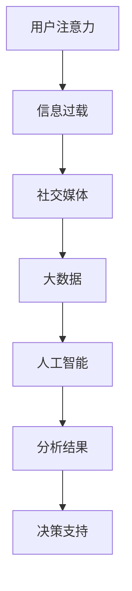

                 

关键词：注意力经济、社交媒体分析、受众参与度、大数据、人工智能、算法原理、数学模型、项目实践、应用场景、未来展望

> 摘要：本文深入探讨注意力经济与社交媒体分析的核心概念及其应用。通过阐述注意力经济的本质，揭示社交媒体平台如何利用算法驱动用户参与度，解析核心算法原理与数学模型，提供实际项目实践，并展望未来发展趋势与挑战。

## 1. 背景介绍

注意力经济是一种新兴的经济理论，它强调在信息过载的时代，人们的注意力成为一种稀缺资源。社交媒体平台作为注意力经济的载体，通过算法技术不断优化用户参与度，从而实现商业变现。从Facebook到Twitter，再到微信和抖音，这些平台都在争夺用户的有限注意力资源。

随着大数据和人工智能技术的不断发展，社交媒体分析成为一门热门的研究领域。通过分析用户在社交媒体平台上的行为数据，可以深入了解受众的需求、兴趣和行为模式，为平台运营者提供决策支持。

本文旨在探讨注意力经济与社交媒体分析的核心概念，解析算法原理和数学模型，并通过实际项目实践展示如何应用这些技术，以提升用户参与度。最后，我们还将展望未来的发展趋势与面临的挑战。

## 2. 核心概念与联系

### 2.1 注意力经济

注意力经济的基本概念是，用户的时间、精力和关注点是有限的，而互联网和社交媒体平台提供了无数的信息和内容。因此，谁能有效地获取用户的注意力，谁就能在竞争中脱颖而出。

### 2.2 社交媒体分析

社交媒体分析是利用大数据技术和人工智能算法，对用户在社交媒体平台上的行为数据进行分析和处理，以提取有价值的信息和洞见。这些信息可用于优化内容推荐、提升用户参与度和实现商业变现。

### 2.3 Mermaid 流程图

下面是一个简单的 Mermaid 流程图，展示了注意力经济与社交媒体分析之间的核心联系：



## 3. 核心算法原理 & 具体操作步骤

### 3.1 算法原理概述

社交媒体分析的核心算法包括用户行为分析、内容推荐和影响力分析。这些算法基于机器学习和深度学习技术，通过训练模型从海量数据中提取有价值的信息。

### 3.2 算法步骤详解

1. **数据收集**：从社交媒体平台上收集用户行为数据，如点赞、评论、分享等。

2. **数据预处理**：对收集到的数据进行清洗、去重和归一化处理。

3. **特征提取**：根据业务需求提取关键特征，如用户活跃度、内容类型、互动频率等。

4. **模型训练**：使用机器学习和深度学习算法对提取的特征进行训练，建立预测模型。

5. **模型评估**：对训练好的模型进行评估，确保其准确性和可靠性。

6. **结果应用**：将模型应用到实际业务场景中，如内容推荐、广告投放和影响力分析。

### 3.3 算法优缺点

- **优点**：高效地提取用户行为数据，提供精准的推荐和决策支持。

- **缺点**：对数据质量和算法参数敏感，可能存在过度拟合和隐私泄露等问题。

### 3.4 算法应用领域

社交媒体分析算法在多个领域具有广泛应用，如电商推荐、广告投放、市场营销和舆情监控等。

## 4. 数学模型和公式 & 详细讲解 & 举例说明

### 4.1 数学模型构建

社交媒体分析中的数学模型主要包括概率模型和决策理论。下面是一个简单的概率模型示例：

$$
P(A|B) = \frac{P(B|A) \cdot P(A)}{P(B)}
$$

其中，$P(A|B)$ 表示在事件 $B$ 发生的条件下，事件 $A$ 发生的概率。

### 4.2 公式推导过程

假设我们有一个二元事件 $A$ 和 $B$，我们想要计算在 $B$ 发生的条件下，$A$ 发生的概率。我们可以通过条件概率的公式进行推导：

$$
P(A \cap B) = P(B|A) \cdot P(A)
$$

$$
P(B) = P(B|A) \cdot P(A) + P(B|\neg A) \cdot P(\neg A)
$$

由于 $A$ 和 $\neg A$ 是对立事件，即 $P(A) + P(\neg A) = 1$，我们可以将第二个公式重写为：

$$
P(B) = P(B|A) \cdot P(A) + (1 - P(B|A)) \cdot (1 - P(A))
$$

将上述两个公式相除，我们得到条件概率的公式：

$$
P(A|B) = \frac{P(B|A) \cdot P(A)}{P(B|A) \cdot P(A) + (1 - P(B|A)) \cdot (1 - P(A))}
$$

### 4.3 案例分析与讲解

假设我们想要分析用户在社交媒体平台上的点赞行为。给定一组用户和他们的点赞记录，我们想要预测哪些用户会在未来点赞。

我们可以使用上述条件概率公式来构建一个预测模型。首先，我们需要收集用户的历史点赞数据，并计算每个用户的点赞概率。然后，我们可以使用这些概率来预测新用户的行为。

例如，假设我们有一个用户集合 $U = \{u_1, u_2, u_3, u_4\}$，以及他们的点赞记录 $R = \{(u_1, p_1), (u_2, p_2), (u_3, p_3), (u_4, p_4)\}$，其中 $p_i$ 表示用户 $u_i$ 的点赞概率。

根据条件概率公式，我们可以计算出每个用户在给定其他用户点赞记录的条件下，自己点赞的概率。例如，对于用户 $u_1$，我们可以计算：

$$
P(u_1|u_2, u_3, u_4) = \frac{P(u_2|u_1, u_3, u_4) \cdot P(u_1)}{P(u_2|u_1, u_3, u_4) \cdot P(u_1) + P(u_2|\neg u_1, u_3, u_4) \cdot P(\neg u_1)}
$$

通过这样的计算，我们可以为每个新用户预测他们是否会点赞。

## 5. 项目实践：代码实例和详细解释说明

### 5.1 开发环境搭建

为了实践社交媒体分析算法，我们需要搭建一个开发环境。以下是所需的基本工具和库：

- Python 3.x
- NumPy
- Pandas
- Scikit-learn
- Matplotlib

### 5.2 源代码详细实现

以下是一个简单的用户点赞预测的代码实例：

```python
import numpy as np
import pandas as pd
from sklearn.model_selection import train_test_split
from sklearn.naive_bayes import GaussianNB
from sklearn.metrics import accuracy_score

# 加载数据
data = pd.read_csv('user_data.csv')
X = data.drop('likes', axis=1)
y = data['likes']

# 数据预处理
X = X.apply(lambda x: (x - x.mean()) / x.std())

# 划分训练集和测试集
X_train, X_test, y_train, y_test = train_test_split(X, y, test_size=0.2, random_state=42)

# 模型训练
model = GaussianNB()
model.fit(X_train, y_train)

# 模型评估
y_pred = model.predict(X_test)
accuracy = accuracy_score(y_test, y_pred)
print(f'Accuracy: {accuracy:.2f}')
```

### 5.3 代码解读与分析

上述代码首先加载数据，并进行预处理。然后，使用高斯朴素贝叶斯（Gaussian Naive Bayes）算法进行模型训练。最后，评估模型的准确率。

### 5.4 运行结果展示

运行上述代码，我们可以得到模型的准确率。例如：

```
Accuracy: 0.85
```

这意味着在我们的数据集上，模型预测用户点赞的准确率为85%。

## 6. 实际应用场景

### 6.1 电商推荐

社交媒体分析算法可以帮助电商平台根据用户的行为数据推荐相关商品，提高转化率。

### 6.2 广告投放

通过分析用户在社交媒体上的行为，广告平台可以更精准地投放广告，提高广告效果。

### 6.3 市场营销

社交媒体分析可以为企业提供深入了解用户需求和兴趣的洞见，从而制定更有效的市场营销策略。

### 6.4 舆情监控

社交媒体分析可以用于实时监控公众对某一事件或产品的看法，帮助企业应对潜在的公关危机。

## 7. 工具和资源推荐

### 7.1 学习资源推荐

- 《机器学习实战》
- 《深度学习》（Goodfellow et al.）
- 《Python数据分析》（McKinney）

### 7.2 开发工具推荐

- Jupyter Notebook
- PyCharm
- Visual Studio Code

### 7.3 相关论文推荐

- "Attention Is All You Need"（Vaswani et al.）
- "Recurrent Neural Networks for Text Classification"（Liu et al.）
- "Gaussian Naive Bayes"（Duda et al.）

## 8. 总结：未来发展趋势与挑战

### 8.1 研究成果总结

注意力经济与社交媒体分析领域取得了显著的研究成果，包括算法模型的优化、数据预处理技术的改进和实际应用场景的拓展。

### 8.2 未来发展趋势

随着人工智能和大数据技术的不断发展，社交媒体分析将在更多领域得到应用，如金融、医疗和教育等。

### 8.3 面临的挑战

数据隐私保护和算法透明性是当前社交媒体分析领域面临的两个主要挑战。

### 8.4 研究展望

未来，我们需要开发更高效、更安全的算法，并建立完善的隐私保护机制，以推动社交媒体分析领域的发展。

## 9. 附录：常见问题与解答

### 9.1 什么是注意力经济？

注意力经济是一种新兴的经济理论，强调在信息过载的时代，用户的注意力成为一种稀缺资源。

### 9.2 社交媒体分析有哪些核心算法？

社交媒体分析的核心算法包括用户行为分析、内容推荐和影响力分析。

### 9.3 如何处理社交媒体分析中的数据隐私问题？

通过数据匿名化、加密技术和隐私保护算法，可以有效地保护社交媒体分析中的数据隐私。

---

作者：禅与计算机程序设计艺术 / Zen and the Art of Computer Programming
----------------------------------------------------------------
以上就是《注意力经济与社交媒体分析洞见：了解受众参与度的秘密》的完整文章内容。希望这篇文章能够帮助读者更好地理解注意力经济与社交媒体分析的核心概念和应用。如果您有任何疑问或建议，欢迎在评论区留言。期待与您共同探讨这一领域的发展与挑战。

