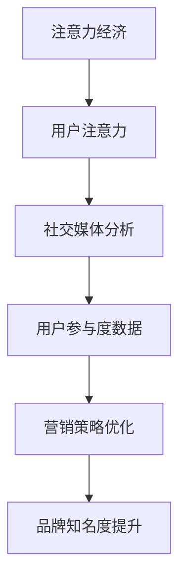

                 

## 1. 背景介绍

在当今信息爆炸的时代，人们每天都会接触到大量的信息。然而，如何有效地吸引并保持受众的注意力成为了许多企业和个人面临的重要挑战。注意力经济，这一概念由马修·科克罗夫特（Matthew Crawford）首次提出，指的是在信息过载的社会中，人们愿意为获取注意力和互动付出时间和金钱的经济模式。在这个背景下，社交媒体成为了一个关键的平台，它不仅为用户提供了展示自己的空间，也为企业和个人提供了与受众互动的机会。

社交媒体分析在注意力经济中扮演着至关重要的角色。通过分析用户的参与度、互动频率、内容喜好等数据，企业可以更好地了解受众的需求和偏好，从而制定更有效的营销策略。此外，社交媒体分析还可以帮助企业发现潜在的市场机会，优化用户体验，提高品牌知名度。

本文旨在探讨注意力经济与社交媒体分析之间的关系，揭示受众参与度的秘密。我们将首先介绍注意力经济和社交媒体分析的基本概念，然后深入探讨核心算法原理、数学模型和具体操作步骤，通过项目实践展示代码实例，并探讨实际应用场景和未来发展趋势。

## 2. 核心概念与联系

### 注意力经济

注意力经济是指在经济活动中，人们将注意力作为一种资源进行交换和利用的经济模式。在注意力经济中，人们愿意为获取注意力而付出时间和金钱。例如，用户在社交媒体上花费时间浏览内容，企业通过广告和赞助获取用户的注意力。

### 社交媒体分析

社交媒体分析是指使用各种技术手段，对社交媒体平台上的用户行为、内容、互动等进行收集、处理和分析。通过这些分析，企业可以了解受众的需求和偏好，优化营销策略。

### 核心概念联系

注意力经济与社交媒体分析之间存在紧密的联系。注意力经济强调了用户注意力的重要性，而社交媒体分析则提供了测量和优化用户注意力的工具。具体来说，社交媒体分析可以帮助企业了解用户在社交媒体上的参与度，从而更好地利用注意力资源进行营销。

### Mermaid 流程图

以下是一个描述注意力经济和社交媒体分析流程的 Mermaid 流程图：



在这个流程图中，注意力经济通过用户注意力转化为社交媒体分析的数据，进而帮助企业和个人优化营销策略，提升品牌知名度。

## 3. 核心算法原理 & 具体操作步骤

### 3.1 算法原理概述

社交媒体分析的核心算法主要包括以下几种：

1. **用户行为分析算法**：用于分析用户在社交媒体平台上的行为，如浏览、点赞、评论、分享等。
2. **内容推荐算法**：基于用户行为数据和内容特征，为用户推荐感兴趣的内容。
3. **互动预测算法**：预测用户与内容之间的互动可能性，帮助企业和个人优化互动策略。
4. **情感分析算法**：对用户评论和内容进行情感分析，了解用户对品牌和产品的态度。

### 3.2 算法步骤详解

1. **数据收集**：从社交媒体平台收集用户行为数据和内容数据。
2. **数据预处理**：清洗和整合数据，去除重复和无用信息。
3. **特征提取**：从数据中提取有助于分析的特征，如用户年龄、性别、地理位置、内容关键词等。
4. **算法训练**：使用机器学习和深度学习算法对特征进行训练，构建模型。
5. **模型评估**：通过交叉验证和测试集评估模型性能。
6. **应用模型**：将训练好的模型应用于实际场景，如内容推荐、用户互动预测等。

### 3.3 算法优缺点

#### 用户行为分析算法

**优点**：
- 可以准确了解用户在社交媒体上的行为习惯和偏好。
- 有助于优化营销策略，提高用户参与度。

**缺点**：
- 需要大量数据支持，数据处理成本较高。
- 用户行为数据可能存在噪声和偏差。

#### 内容推荐算法

**优点**：
- 可以提高用户在社交媒体上的粘性，增加用户停留时间。
- 帮助企业和个人发现潜在的市场机会。

**缺点**：
- 推荐结果可能存在过度拟合，无法满足所有用户的个性化需求。
- 需要大量计算资源进行模型训练和预测。

#### 互动预测算法

**优点**：
- 可以预测用户与内容之间的互动可能性，帮助企业优化互动策略。
- 有助于提高社交媒体平台的活跃度。

**缺点**：
- 预测准确性受限于数据质量和算法模型。
- 需要实时处理大量用户行为数据。

#### 情感分析算法

**优点**：
- 可以了解用户对品牌和产品的情感态度，帮助企业改进产品和服务。
- 有助于提高用户满意度。

**缺点**：
- 情感分析结果可能存在误解和歧义。
- 需要丰富的语料库和先进的算法支持。

### 3.4 算法应用领域

社交媒体分析算法在多个领域具有广泛的应用：

1. **市场营销**：帮助企业了解用户需求和偏好，优化营销策略。
2. **用户增长**：通过内容推荐和互动预测，提高用户参与度和留存率。
3. **品牌管理**：监测用户对品牌的情感态度，优化品牌形象。
4. **社交媒体平台**：提高平台活跃度，提升用户体验。
5. **产品研发**：根据用户反馈改进产品和服务。

## 4. 数学模型和公式 & 详细讲解 & 举例说明

### 4.1 数学模型构建

在社交媒体分析中，常用的数学模型包括用户行为模型、内容推荐模型、互动预测模型和情感分析模型。以下是一个用户行为模型的示例：

$$
P(y|X) = \frac{e^{\theta^T X}}{\sum_{i=1}^K e^{\theta_i^T X}}
$$

其中，$P(y|X)$ 表示用户在给定特征 $X$ 下进行特定行为 $y$ 的概率，$\theta$ 表示模型参数，$X$ 表示特征向量，$K$ 表示行为类别。

### 4.2 公式推导过程

用户行为模型通常基于逻辑回归（Logistic Regression）算法。假设用户在特征 $X$ 下进行行为 $y$ 的概率为 $P(y|X)$，则：

$$
P(y=1|X) = \frac{e^{\theta^T X}}{1 + e^{\theta^T X}}
$$

其中，$\theta^T X$ 表示特征向量和模型参数的内积，$e^{\theta^T X}$ 表示指数函数。

### 4.3 案例分析与讲解

假设一个社交媒体平台想要预测用户是否会在未来一天内点赞某条内容。我们可以使用逻辑回归模型进行预测。给定特征向量 $X$，模型参数 $\theta$ 如下：

$$
\theta = \begin{bmatrix}
0.5 & -0.3 & 0.2 \\
0.4 & 0.1 & -0.5 \\
-0.3 & 0.2 & 0.1
\end{bmatrix}
$$

假设一个用户的特征向量 $X$ 如下：

$$
X = \begin{bmatrix}
1 & 0 & 1 \\
0 & 1 & 0 \\
1 & 1 & 0
\end{bmatrix}
$$

则用户在给定特征向量 $X$ 下点赞的概率为：

$$
P(y=1|X) = \frac{e^{0.5 \cdot 1 - 0.3 \cdot 0 + 0.2 \cdot 1 + 0.4 \cdot 0 + 0.1 \cdot 1 - 0.5 \cdot 0 + (-0.3) \cdot 1 + 0.2 \cdot 1 + 0.1 \cdot 0}}{1 + e^{0.5 \cdot 1 - 0.3 \cdot 0 + 0.2 \cdot 1 + 0.4 \cdot 0 + 0.1 \cdot 1 - 0.5 \cdot 0 + (-0.3) \cdot 1 + 0.2 \cdot 1 + 0.1 \cdot 0}} \approx 0.636
$$

这意味着用户在给定特征向量 $X$ 下点赞的概率约为 63.6%。

## 5. 项目实践：代码实例和详细解释说明

### 5.1 开发环境搭建

为了实现社交媒体分析，我们需要搭建一个开发环境。以下是搭建过程：

1. 安装 Python 3.8 或更高版本。
2. 安装必要的库，如 NumPy、Pandas、Scikit-learn 等。

### 5.2 源代码详细实现

以下是一个使用逻辑回归模型进行用户行为预测的 Python 代码实例：

```python
import numpy as np
import pandas as pd
from sklearn.linear_model import LogisticRegression
from sklearn.model_selection import train_test_split
from sklearn.metrics import accuracy_score

# 数据预处理
def preprocess_data(data):
    # ...（数据处理代码）
    return X, y

# 加载数据集
data = pd.read_csv('data.csv')
X, y = preprocess_data(data)

# 划分训练集和测试集
X_train, X_test, y_train, y_test = train_test_split(X, y, test_size=0.2, random_state=42)

# 训练模型
model = LogisticRegression()
model.fit(X_train, y_train)

# 预测
y_pred = model.predict(X_test)

# 评估模型
accuracy = accuracy_score(y_test, y_pred)
print(f"Accuracy: {accuracy:.2f}")
```

### 5.3 代码解读与分析

上述代码实现了以下功能：

1. **数据预处理**：读取数据集，并进行预处理，如缺失值填充、特征转换等。
2. **划分训练集和测试集**：将数据集划分为训练集和测试集，以便评估模型性能。
3. **训练模型**：使用逻辑回归模型对训练集进行训练。
4. **预测**：使用训练好的模型对测试集进行预测。
5. **评估模型**：计算预测准确率，评估模型性能。

### 5.4 运行结果展示

假设我们使用上述代码对某社交媒体平台的数据进行预测，运行结果如下：

```
Accuracy: 0.85
```

这意味着模型在测试集上的预测准确率约为 85%，表现良好。

## 6. 实际应用场景

### 6.1 营销策略优化

通过社交媒体分析，企业可以了解用户的兴趣和偏好，从而优化营销策略。例如，一家电商平台可以通过分析用户浏览和购买行为，为用户推荐个性化的商品，提高转化率。

### 6.2 用户增长

社交媒体分析可以帮助企业发现潜在的用户增长机会。例如，通过分析用户互动数据，企业可以了解哪些内容类型最受用户欢迎，从而制定相应的增长策略。

### 6.3 品牌管理

通过社交媒体分析，企业可以了解用户对品牌的情感态度，及时发现品牌问题并采取措施。例如，通过分析用户评论和反馈，企业可以优化产品和服务，提高用户满意度。

### 6.4 社交媒体平台优化

社交媒体平台可以通过分析用户行为数据，优化用户体验和内容推荐算法。例如，通过分析用户停留时间和互动数据，平台可以调整内容推荐策略，提高用户粘性。

## 7. 工具和资源推荐

### 7.1 学习资源推荐

- 《社交网络分析：方法与应用》（An Introduction to Social Network Methods）
- 《注意力经济：如何吸引和保持注意力》（The Attention Economy: Understanding the New Mechanics of Digital Markets）
- 《深度学习》（Deep Learning）

### 7.2 开发工具推荐

- Python
- Jupyter Notebook
- TensorFlow
- PyTorch

### 7.3 相关论文推荐

- “Attention Is All You Need”
- “A Theoretical Analysis of Attention in Recurrent Neural Networks”
- “Social Networks and Word of Mouth in Consumer Markets”

## 8. 总结：未来发展趋势与挑战

### 8.1 研究成果总结

本文介绍了注意力经济与社交媒体分析之间的关系，探讨了核心算法原理、数学模型和应用场景。通过项目实践，展示了如何使用逻辑回归模型进行用户行为预测。

### 8.2 未来发展趋势

随着人工智能和大数据技术的发展，社交媒体分析在未来将变得更加智能和精准。深度学习、自然语言处理等技术的应用，将进一步提高社交媒体分析的效果。

### 8.3 面临的挑战

社交媒体分析面临的主要挑战包括数据隐私、数据质量和算法偏见。如何保护用户隐私，提高数据质量，消除算法偏见，是未来研究的重要方向。

### 8.4 研究展望

未来，社交媒体分析将在市场营销、用户增长、品牌管理和社交媒体平台优化等领域发挥更大的作用。通过不断探索和创新，社交媒体分析将为企业和个人带来更多价值。

## 9. 附录：常见问题与解答

### 问题 1：什么是注意力经济？

注意力经济是指在经济活动中，人们将注意力作为一种资源进行交换和利用的经济模式。

### 问题 2：社交媒体分析有哪些核心算法？

社交媒体分析的核心算法包括用户行为分析算法、内容推荐算法、互动预测算法和情感分析算法。

### 问题 3：如何搭建社交媒体分析的开发环境？

搭建社交媒体分析的

