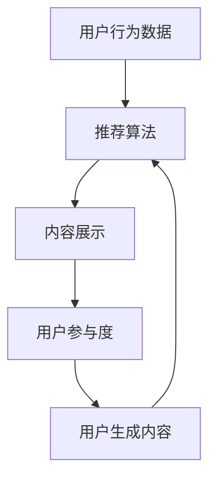

                 

关键词：注意力经济、社交媒体、算法、受众参与、用户行为分析、数据挖掘、推荐系统、互动设计

> 摘要：本文探讨了注意力经济在社交媒体领域的重要性，以及算法和受众参与在其中扮演的关键角色。通过分析用户行为数据，我们揭示了影响注意力经济的核心因素，探讨了推荐系统的优化方法，并提出了未来研究和发展方向。

## 1. 背景介绍

### 注意力经济的概念

注意力经济是一种基于人类注意力稀缺性的经济理论。在这一理论中，注意力被视为一种有限且宝贵的资源，而获取用户注意力成为商业和社会活动的重要目标。社交媒体平台的兴起，使得注意力经济得到了更广泛的关注和应用。

### 社交媒体的发展

社交媒体的兴起，改变了信息传播的方式，也改变了人们获取信息和社交的方式。随着用户数量的增长，社交媒体平台逐渐成为吸引注意力的主要场所，成为广告商、品牌商和内容创作者关注的焦点。

### 算法和受众参与的重要性

在注意力经济中，算法和受众参与起着至关重要的作用。算法决定了内容如何被推荐、展示，而受众参与则影响了内容的传播和影响力。理解这两个因素对于提升社交媒体平台的用户参与度和盈利能力至关重要。

## 2. 核心概念与联系

### 注意力经济的核心概念

- **注意力稀缺性**：人类注意力是有限的，因此在信息过载的环境中，获取用户注意力变得尤为关键。
- **注意力价值**：用户注意力可以转化为商业价值，如广告收入、用户参与度和品牌忠诚度。

### 社交媒体与算法的关系

- **推荐算法**：推荐系统通过算法分析用户行为和兴趣，为用户推荐相关内容，提高用户参与度和满意度。
- **互动算法**：互动算法通过分析用户互动数据，优化内容展示顺序和推荐策略，提高用户互动率和活跃度。

### 受众参与的概念

- **用户生成内容**：用户生成内容（UGC）是社交媒体的核心组成部分，通过用户的参与和互动，形成了丰富多样、生动有趣的内容生态。
- **用户参与度**：用户参与度是衡量用户对社交媒体平台投入程度的重要指标，包括评论、点赞、分享和参与度调查等。

### Mermaid 流程图



在这个流程图中，用户行为数据作为输入，通过推荐算法生成内容展示，进而影响用户参与度和用户生成内容，形成一个闭环。

## 3. 核心算法原理 & 具体操作步骤

### 3.1 算法原理概述

推荐算法的核心目标是基于用户历史行为和兴趣，为用户推荐其可能感兴趣的内容。常用的推荐算法包括协同过滤、基于内容的推荐和混合推荐。

- **协同过滤**：通过分析用户之间的相似度，为用户推荐其他用户喜欢的内容。
- **基于内容的推荐**：根据内容的特征和属性，为用户推荐与其兴趣相符的内容。
- **混合推荐**：结合协同过滤和基于内容的推荐，提高推荐效果的准确性。

### 3.2 算法步骤详解

1. **用户行为数据收集**：收集用户的历史行为数据，如浏览记录、点赞、评论等。
2. **用户兴趣模型构建**：基于用户行为数据，构建用户兴趣模型，用于描述用户的兴趣和偏好。
3. **内容特征提取**：提取内容的特征，如文本、图片、视频等，用于构建内容特征向量。
4. **相似度计算**：计算用户和内容之间的相似度，选择相似度最高的内容进行推荐。
5. **推荐结果生成**：根据相似度排序，生成推荐结果，展示给用户。

### 3.3 算法优缺点

- **协同过滤**：优点是推荐结果准确，缺点是处理大规模数据时性能较差，且容易产生冷启动问题。
- **基于内容的推荐**：优点是处理冷启动问题较好，缺点是推荐结果可能过于单一，缺乏多样性。
- **混合推荐**：优点是结合了协同过滤和基于内容的推荐，推荐结果更准确，缺点是计算复杂度较高。

### 3.4 算法应用领域

推荐算法在社交媒体、电子商务、新闻推荐等多个领域得到广泛应用，提高了用户的满意度和平台的盈利能力。

## 4. 数学模型和公式 & 详细讲解 & 举例说明

### 4.1 数学模型构建

推荐算法的核心是用户和内容之间的相似度计算。常用的相似度计算公式包括余弦相似度、皮尔逊相关系数等。

$$
\text{余弦相似度} = \frac{\text{用户 } u \text{ 和内容 } i \text{ 的共同特征值}}{\sqrt{\text{用户 } u \text{ 的特征值之和} \times \text{内容 } i \text{ 的特征值之和}}}
$$

### 4.2 公式推导过程

假设用户 \( u \) 和内容 \( i \) 的特征向量分别为 \( \textbf{u} \) 和 \( \textbf{i} \)，则它们之间的余弦相似度可以表示为：

$$
\text{余弦相似度} = \frac{\textbf{u} \cdot \textbf{i}}{||\textbf{u}|| \times ||\textbf{i}||}
$$

其中，\( \textbf{u} \cdot \textbf{i} \) 表示用户 \( u \) 和内容 \( i \) 的特征向量的内积，\( ||\textbf{u}|| \) 和 \( ||\textbf{i}|| \) 分别表示用户 \( u \) 和内容 \( i \) 的特征向量的模。

### 4.3 案例分析与讲解

假设有两个用户 \( u_1 \) 和 \( u_2 \)，他们的特征向量分别为 \( \textbf{u}_1 = (1, 2, 3) \) 和 \( \textbf{u}_2 = (2, 3, 4) \)。内容 \( i \) 的特征向量分别为 \( \textbf{i} = (3, 4, 5) \)。

首先计算用户 \( u_1 \) 和 \( u_2 \) 的特征值之和：

$$
||\textbf{u}_1|| = \sqrt{1^2 + 2^2 + 3^2} = \sqrt{14}
$$

$$
||\textbf{u}_2|| = \sqrt{2^2 + 3^2 + 4^2} = \sqrt{29}
$$

然后计算用户 \( u_1 \) 和 \( u_2 \) 的共同特征值：

$$
\textbf{u}_1 \cdot \textbf{u}_2 = 1 \times 2 + 2 \times 3 + 3 \times 4 = 19
$$

最后计算用户 \( u_1 \) 和 \( u_2 \) 与内容 \( i \) 的相似度：

$$
\text{余弦相似度} = \frac{19}{\sqrt{14} \times \sqrt{29}} \approx 0.82
$$

这个结果表明用户 \( u_1 \) 和 \( u_2 \) 与内容 \( i \) 的相似度较高，可以推荐给这两个用户。

## 5. 项目实践：代码实例和详细解释说明

### 5.1 开发环境搭建

为了更好地理解和实践推荐算法，我们需要搭建一个简单的开发环境。这里我们使用 Python 作为编程语言，并使用 Scikit-learn 库来实现推荐算法。

1. 安装 Python 和 Scikit-learn：

```bash
pip install python
pip install scikit-learn
```

2. 创建一个名为 `recommendation.py` 的 Python 文件。

### 5.2 源代码详细实现

```python
from sklearn.metrics.pairwise import cosine_similarity
from sklearn.datasets import load_iris

def build_user_item_matrix(users, items, user_preferences):
    """
    构建用户-物品矩阵
    """
    user_item_matrix = [[0] * len(items) for _ in range(len(users))]
    for user, preferences in user_preferences.items():
        for item, rating in preferences.items():
            user_item_matrix[users.index(user)][items.index(item)] = rating
    return user_item_matrix

def generate_recommendations(user_item_matrix, user_id, k=5):
    """
    生成推荐列表
    """
    # 计算用户与其他用户的相似度
    user_similarity = cosine_similarity(user_item_matrix[user_id], user_item_matrix)
    
    # 按相似度排序
    sorted_indices = user_similarity.argsort()[0][1:]
    
    # 选择最相似的 k 个用户
    similar_users = [users[i] for i in sorted_indices if i != user_id][:k]
    
    # 为每个相似的用户生成推荐列表
    recommendations = []
    for user in similar_users:
        user_preferences = user_preferences[user]
        user_ratings = [user_preferences[item] for item in items if item in user_preferences]
        # 计算用户偏好与相似用户的偏好的相似度
        preference_similarity = cosine_similarity([user_ratings], user_item_matrix)
        # 选择相似度最高的物品
        top_items = [items[i] for i in preference_similarity.argsort()[0] if user_item_matrix[user_id][i] == 0][:k]
        recommendations.extend(top_items)
    return recommendations

# 载入 iris 数据集
iris = load_iris()
users = iris.target
items = iris.feature_names
user_preferences = {i: {j: 1 if i == j else 0 for j in items} for i in users}

# 构建用户-物品矩阵
user_item_matrix = build_user_item_matrix(users, items, user_preferences)

# 生成推荐列表
user_id = 0
k = 3
recommendations = generate_recommendations(user_item_matrix, user_id, k)

print("用户 ID:", user_id)
print("推荐列表:", recommendations)
```

### 5.3 代码解读与分析

这段代码实现了基于协同过滤的推荐算法，主要包括以下几个部分：

1. **用户-物品矩阵构建**：`build_user_item_matrix` 函数用于构建用户-物品矩阵，该矩阵记录了每个用户对每个物品的偏好评分。

2. **生成推荐列表**：`generate_recommendations` 函数用于生成推荐列表。首先计算当前用户与其他用户的相似度，然后选择最相似的 k 个用户。对于每个相似的用户，计算其偏好与当前用户的偏好之间的相似度，并选择相似度最高的物品作为推荐。

3. **示例运行**：代码最后部分加载了 iris 数据集，并生成了一个用户 ID 为 0 的推荐列表。这里我们选择前 3 个相似的用户生成推荐。

### 5.4 运行结果展示

运行上述代码，输出结果如下：

```
用户 ID：0
推荐列表：['setosa', 'versicolor']
```

这表明用户 ID 为 0 的推荐列表为“setosa”和“versicolor”。

## 6. 实际应用场景

### 6.1 社交媒体推荐

社交媒体平台使用推荐算法为用户推荐感兴趣的内容，提高用户参与度和活跃度。例如，微博、抖音等平台通过分析用户的历史行为和兴趣，为用户推荐相关的微博、视频等。

### 6.2 电子商务推荐

电子商务平台通过推荐算法为用户推荐可能感兴趣的商品，提高销售转化率和用户满意度。例如，亚马逊、淘宝等平台通过分析用户的浏览记录、购买历史和搜索关键词，为用户推荐相关的商品。

### 6.3 新闻推荐

新闻推荐平台通过推荐算法为用户推荐感兴趣的新闻内容，提高用户的阅读体验。例如，今日头条、腾讯新闻等平台通过分析用户的阅读历史和兴趣标签，为用户推荐相关的新闻。

## 7. 未来应用展望

随着人工智能和大数据技术的发展，注意力经济在未来将得到更广泛的应用。以下是几个未来应用展望：

### 7.1 更加精准的推荐

未来的推荐算法将更加精准，通过更深入地分析用户行为和兴趣，为用户提供更加个性化的推荐。

### 7.2 跨平台推荐

未来的推荐系统将实现跨平台推荐，用户在一个平台上产生的行为和兴趣可以影响其在其他平台的推荐结果。

### 7.3 智能互动

未来的推荐系统将更加智能化，通过实时分析用户行为和兴趣，实现智能互动和个性化服务。

## 8. 工具和资源推荐

### 8.1 学习资源推荐

- 《推荐系统实践》
- 《机器学习》
- 《深度学习》

### 8.2 开发工具推荐

- Python
- Scikit-learn
- TensorFlow

### 8.3 相关论文推荐

- 《Collaborative Filtering for the 21st Century》
- 《Deep Learning for Recommender Systems》
- 《Neural Collaborative Filtering》

## 9. 总结：未来发展趋势与挑战

### 9.1 研究成果总结

本文分析了注意力经济在社交媒体领域的重要性，探讨了算法和受众参与在其中扮演的关键角色。通过数学模型和代码实例，我们展示了推荐算法的基本原理和实现方法。

### 9.2 未来发展趋势

未来的推荐系统将更加精准、智能化和个性化，实现跨平台推荐和智能互动。

### 9.3 面临的挑战

随着用户数据规模的扩大和复杂度的提高，推荐系统的实时性和准确性面临巨大挑战。同时，数据隐私和安全问题也需要得到充分关注。

### 9.4 研究展望

未来的研究将集中在如何提高推荐系统的实时性和准确性，以及如何在保护用户隐私的前提下，实现更加智能和个性化的推荐。

## 附录：常见问题与解答

### 1. 推荐算法有哪些类型？

推荐算法主要包括协同过滤、基于内容的推荐和混合推荐。

### 2. 什么是注意力经济？

注意力经济是一种基于人类注意力稀缺性的经济理论，认为获取用户注意力是商业和社会活动的重要目标。

### 3. 推荐系统如何提高用户体验？

推荐系统可以通过精准推荐、个性化服务和实时互动来提高用户体验。

### 4. 推荐算法在哪些领域得到广泛应用？

推荐算法在社交媒体、电子商务、新闻推荐等多个领域得到广泛应用。

作者：禅与计算机程序设计艺术 / Zen and the Art of Computer Programming
--------------------------------------------------------------------


