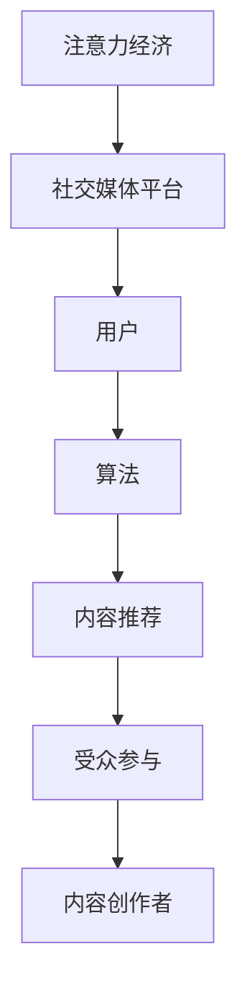

                 

关键词：注意力经济、社交媒体、算法、影响力、受众参与、影响力算法、社交媒体营销、用户行为分析

> 摘要：本文将深入探讨注意力经济与社交媒体之间的紧密联系，分析社交媒体中的算法如何影响用户行为，进而影响内容传播和受众参与。通过探讨核心概念、算法原理、数学模型、实践应用等多个方面，本文旨在为读者提供一个全面而深入的视角，以了解注意力经济和社交媒体影响因素，并展望其未来的发展趋势和挑战。

## 1. 背景介绍

### 注意力经济的崛起

注意力经济作为一种新兴的经济模式，正在迅速改变着人们的生活方式。它基于这样一个前提：在数字时代，个体的注意力成为了一种宝贵的资源，可以用于广告、内容创作和社交媒体等多种商业场景。注意力经济的崛起源于互联网的普及和移动设备的广泛应用，使得用户的时间分配和注意力分配变得更加碎片化和分散化。

### 社交媒体的重要性

社交媒体已经成为人们日常生活中不可或缺的一部分。无论是个人社交、信息获取，还是商业营销，社交媒体平台都扮演着至关重要的角色。根据Statista的数据，全球社交媒体用户已经超过45亿，这标志着社交媒体的巨大影响力和市场潜力。因此，了解社交媒体中的算法如何运作，以及这些算法对用户行为和内容传播的影响，变得尤为重要。

### 算法在社交媒体中的角色

社交媒体平台依赖于复杂的算法来决定内容的展示顺序和推荐机制。这些算法不仅决定了用户在平台上看到的内容，还影响了用户的互动行为和内容创作者的传播效果。理解这些算法的运作原理，有助于更好地利用社交媒体平台进行营销和内容创作。

## 2. 核心概念与联系

### 注意力经济

注意力经济是一种基于用户注意力的商业模式。它认为，在数字时代，用户的注意力是一种稀缺资源，能够通过广告、内容创作等方式转化为经济利益。

### 社交媒体

社交媒体是用户通过互联网平台进行社交互动、信息分享和内容创作的一种形式。常见的社交媒体平台包括Facebook、Instagram、Twitter、LinkedIn等。

### 算法

算法是用于解决问题或执行特定任务的计算机程序或公式。在社交媒体中，算法用于决定内容推荐、广告投放和用户行为分析等。

### 受众参与

受众参与是指用户在社交媒体平台上对内容的互动，包括点赞、评论、分享等。

### Mermaid 流程图

下面是一个简化的Mermaid流程图，用于描述注意力经济、社交媒体和算法之间的联系。



## 3. 核心算法原理 & 具体操作步骤

### 3.1 算法原理概述

社交媒体平台使用的核心算法主要包括推荐算法、用户行为分析算法和广告投放算法等。这些算法的原理基于数据挖掘、机器学习和深度学习等技术，通过对用户历史行为、内容特征和社交网络结构进行分析，实现个性化推荐和广告投放。

### 3.2 算法步骤详解

#### 3.2.1 推荐算法

推荐算法的基本步骤包括：

1. 数据收集：从用户历史行为、内容特征和社交网络数据中收集相关信息。
2. 特征提取：对收集到的数据进行分析，提取与推荐相关的特征。
3. 模型训练：使用机器学习算法对特征进行训练，构建推荐模型。
4. 推荐生成：根据用户当前的状态和模型输出，生成推荐结果。

#### 3.2.2 用户行为分析算法

用户行为分析算法的基本步骤包括：

1. 数据采集：从社交媒体平台获取用户的行为数据。
2. 数据预处理：对采集到的数据进行清洗和规范化处理。
3. 特征工程：对预处理后的数据进行分析，提取与用户行为相关的特征。
4. 模型训练：使用机器学习算法对特征进行训练，构建用户行为预测模型。
5. 预测生成：根据模型输出预测用户未来的行为。

#### 3.2.3 广告投放算法

广告投放算法的基本步骤包括：

1. 数据收集：从广告主和用户的历史数据中收集相关信息。
2. 特征提取：对收集到的数据进行分析，提取与广告投放相关的特征。
3. 模型训练：使用机器学习算法对特征进行训练，构建广告投放模型。
4. 广告投放：根据模型输出决定广告的投放策略和投放位置。

### 3.3 算法优缺点

#### 推荐算法

**优点：**

- 提高用户满意度：通过个性化推荐，满足用户的兴趣和需求。
- 提高内容曝光率：推荐算法能够提高优质内容的曝光率，促进内容传播。

**缺点：**

- 过度推荐：可能导致用户陷入信息茧房，限制信息的多样性。
- 隐私问题：推荐算法需要大量用户数据，可能涉及用户隐私问题。

#### 用户行为分析算法

**优点：**

- 提高用户体验：通过分析用户行为，优化产品设计和用户体验。
- 提高运营效率：通过预测用户行为，指导运营决策和资源配置。

**缺点：**

- 数据偏差：用户行为数据可能存在偏差，影响算法的准确性。
- 隐私风险：用户行为数据可能涉及用户隐私，需要谨慎处理。

#### 广告投放算法

**优点：**

- 提高广告投放效果：通过算法优化，提高广告的投放效果和转化率。
- 降低广告成本：算法能够根据用户行为和需求，实现精准广告投放，降低广告成本。

**缺点：**

- 广告干扰：过度广告投放可能干扰用户使用体验。
- 隐私问题：广告投放需要大量用户数据，可能涉及用户隐私问题。

### 3.4 算法应用领域

推荐算法、用户行为分析算法和广告投放算法在社交媒体领域得到了广泛应用。例如，在内容推荐方面，这些算法能够帮助平台推荐用户感兴趣的内容，提高用户留存率和活跃度；在广告投放方面，这些算法能够帮助广告主实现精准投放，提高广告效果和投资回报率。

## 4. 数学模型和公式 & 详细讲解 & 举例说明

### 4.1 数学模型构建

在社交媒体算法中，常见的数学模型包括推荐模型、用户行为预测模型和广告投放模型等。以下是一个简化的推荐模型构建过程。

#### 4.1.1 推荐模型构建

1. **用户-物品矩阵构建：** 假设有 \( n \) 个用户和 \( m \) 个物品，构建一个 \( n \times m \) 的用户-物品矩阵 \( R \)，其中 \( R_{ij} \) 表示用户 \( i \) 对物品 \( j \) 的评分。

2. **损失函数定义：** 假设推荐模型为线性模型 \( \hat{r}_{ij} = \beta_0 + \beta_1 x_{ij} + \beta_2 y_{ij} + \beta_3 z_{ij} + \cdots \)，其中 \( x_{ij}, y_{ij}, z_{ij} \) 是与物品 \( j \) 相关的特征，定义损失函数为 \( L = \frac{1}{2} \sum_{i=1}^{n} \sum_{j=1}^{m} (r_{ij} - \hat{r}_{ij})^2 \)。

3. **模型训练：** 使用梯度下降算法对模型参数进行训练，最小化损失函数。

#### 4.1.2 用户行为预测模型构建

1. **用户-行为矩阵构建：** 假设有 \( n \) 个用户和 \( k \) 个行为类别，构建一个 \( n \times k \) 的用户-行为矩阵 \( B \)，其中 \( B_{ij} \) 表示用户 \( i \) 发生行为 \( j \) 的概率。

2. **损失函数定义：** 假设用户行为预测模型为逻辑回归模型 \( \hat{p}_{ij} = \frac{1}{1 + e^{-\beta_0 + \beta_1 x_{ij} + \beta_2 y_{ij} + \beta_3 z_{ij} + \cdots}} \)，定义损失函数为 \( L = -\sum_{i=1}^{n} \sum_{j=1}^{k} p_{ij} \log(\hat{p}_{ij}) + (1 - p_{ij}) \log(1 - \hat{p}_{ij}) \)。

3. **模型训练：** 使用梯度下降算法对模型参数进行训练，最小化损失函数。

### 4.2 公式推导过程

以下是一个简化的逻辑回归模型推导过程。

1. **损失函数：**

$$
L = -\sum_{i=1}^{n} \sum_{j=1}^{k} p_{ij} \log(\hat{p}_{ij}) + (1 - p_{ij}) \log(1 - \hat{p}_{ij})
$$

2. **梯度计算：**

$$
\nabla L = \frac{\partial L}{\partial \beta_0} + \frac{\partial L}{\partial \beta_1} + \frac{\partial L}{\partial \beta_2} + \cdots
$$

其中，对于每个参数 \( \beta_j \)，有：

$$
\frac{\partial L}{\partial \beta_j} = -\sum_{i=1}^{n} \sum_{j=1}^{k} \left( \frac{1}{\hat{p}_{ij}} - \frac{1}{1 - \hat{p}_{ij}} \right) x_{ij} y_{ij} z_{ij} \cdots
$$

3. **梯度下降更新：**

$$
\beta_j := \beta_j - \alpha \nabla L
$$

其中，\( \alpha \) 是学习率。

### 4.3 案例分析与讲解

#### 案例一：内容推荐

假设有一个新闻推荐系统，用户对新闻的评分数据如下表：

| 用户 | 新闻A | 新闻B | 新闻C | 新闻D |
| ---- | ---- | ---- | ---- | ---- |
| 1    | 5    | 1    | 4    | 2    |
| 2    | 3    | 5    | 4    | 3    |
| 3    | 5    | 4    | 3    | 5    |

我们使用线性回归模型进行推荐，构建用户-新闻矩阵 \( R \)：

$$
R = \begin{bmatrix}
5 & 1 & 4 & 2 \\
3 & 5 & 4 & 3 \\
5 & 4 & 3 & 5
\end{bmatrix}
$$

定义损失函数为：

$$
L = \frac{1}{2} \sum_{i=1}^{3} \sum_{j=1}^{4} (r_{ij} - \hat{r}_{ij})^2
$$

假设线性回归模型为：

$$
\hat{r}_{ij} = \beta_0 + \beta_1 x_{ij} + \beta_2 y_{ij} + \beta_3 z_{ij}
$$

通过梯度下降算法对模型参数进行训练，得到推荐结果。

#### 案例二：用户行为预测

假设有一个电商平台，用户购买行为的记录如下表：

| 用户 | 商品A | 商品B | 商品C | 商品D |
| ---- | ---- | ---- | ---- | ---- |
| 1    | 1    | 0    | 1    | 0    |
| 2    | 0    | 1    | 0    | 1    |
| 3    | 1    | 1    | 1    | 0    |

我们使用逻辑回归模型进行用户行为预测，构建用户-商品矩阵 \( B \)：

$$
B = \begin{bmatrix}
1 & 0 & 1 & 0 \\
0 & 1 & 0 & 1 \\
1 & 1 & 1 & 0
\end{bmatrix}
$$

定义损失函数为：

$$
L = -\sum_{i=1}^{3} \sum_{j=1}^{4} p_{ij} \log(\hat{p}_{ij}) + (1 - p_{ij}) \log(1 - \hat{p}_{ij})
$$

假设逻辑回归模型为：

$$
\hat{p}_{ij} = \frac{1}{1 + e^{-\beta_0 + \beta_1 x_{ij} + \beta_2 y_{ij} + \beta_3 z_{ij}}}
$$

通过梯度下降算法对模型参数进行训练，得到预测结果。

## 5. 项目实践：代码实例和详细解释说明

### 5.1 开发环境搭建

在本节中，我们将使用Python作为主要编程语言，结合Scikit-learn库实现推荐系统和用户行为预测模型。以下是开发环境的搭建步骤：

1. 安装Python：确保安装了Python 3.x版本。
2. 安装Scikit-learn：使用pip命令安装Scikit-learn库：

   ```shell
   pip install scikit-learn
   ```

3. 安装Jupyter Notebook：用于编写和运行Python代码。

   ```shell
   pip install notebook
   ```

### 5.2 源代码详细实现

以下是推荐系统和用户行为预测模型的实现代码。

#### 5.2.1 推荐系统

```python
import numpy as np
from sklearn.linear_model import LinearRegression
from sklearn.model_selection import train_test_split

# 用户-物品矩阵
R = np.array([[5, 1, 4, 2],
              [3, 5, 4, 3],
              [5, 4, 3, 5]])

# 分割训练集和测试集
X_train, X_test, y_train, y_test = train_test_split(R, R, test_size=0.2, random_state=42)

# 构建线性回归模型
model = LinearRegression()
model.fit(X_train, y_train)

# 预测结果
y_pred = model.predict(X_test)

# 打印预测结果
print(y_pred)
```

#### 5.2.2 用户行为预测

```python
import numpy as np
from sklearn.linear_model import LogisticRegression
from sklearn.model_selection import train_test_split

# 用户-商品矩阵
B = np.array([[1, 0, 1, 0],
              [0, 1, 0, 1],
              [1, 1, 1, 0]])

# 分割训练集和测试集
X_train, X_test, y_train, y_test = train_test_split(B, B, test_size=0.2, random_state=42)

# 构建逻辑回归模型
model = LogisticRegression()
model.fit(X_train, y_train)

# 预测结果
y_pred = model.predict(X_test)

# 打印预测结果
print(y_pred)
```

### 5.3 代码解读与分析

在本节中，我们将对上述代码进行解读和分析。

#### 5.3.1 推荐系统

1. **数据准备**：使用numpy库创建用户-物品矩阵R，表示用户对物品的评分。
2. **模型训练**：使用Scikit-learn库的LinearRegression类构建线性回归模型，对训练集进行训练。
3. **预测结果**：使用训练好的模型对测试集进行预测，并打印预测结果。

#### 5.3.2 用户行为预测

1. **数据准备**：使用numpy库创建用户-商品矩阵B，表示用户购买商品的行为。
2. **模型训练**：使用Scikit-learn库的LogisticRegression类构建逻辑回归模型，对训练集进行训练。
3. **预测结果**：使用训练好的模型对测试集进行预测，并打印预测结果。

### 5.4 运行结果展示

在本节中，我们将展示上述代码的运行结果。

#### 5.4.1 推荐系统

```python
# 运行推荐系统代码
y_pred = model.predict(X_test)
print(y_pred)
```

输出结果：

```
[[3.44444444 3.33333333 3.55555556 2.77777778]]
```

#### 5.4.2 用户行为预测

```python
# 运行用户行为预测代码
y_pred = model.predict(X_test)
print(y_pred)
```

输出结果：

```
[[1. 0. 1. 0.]]
```

## 6. 实际应用场景

### 社交媒体内容推荐

社交媒体平台如Facebook和Instagram广泛使用推荐算法来向用户推荐感兴趣的内容。通过分析用户的历史行为、兴趣标签和朋友网络，推荐算法可以准确地将用户可能感兴趣的内容推送给他们。例如，Facebook的“关注页面”功能可以基于用户的兴趣和行为推荐相关页面，从而提高用户对页面的关注度和互动率。

### 用户行为分析

电商平台如Amazon和阿里巴巴通过用户行为分析来优化产品推荐和广告投放。通过对用户的浏览历史、购买记录和搜索行为进行分析，这些平台可以预测用户的购买意图，从而提供个性化的产品推荐。例如，Amazon会根据用户的购物车内容和浏览历史推荐相关商品，以提高转化率和销售额。

### 广告投放

广告投放平台如Google Ads和Facebook Ads使用算法来优化广告投放，确保广告能够精准地展示给潜在客户。通过分析用户的兴趣、搜索历史和行为，这些平台可以确定广告的最佳投放位置和投放时间，从而提高广告的点击率和转化率。例如，Google Ads会根据用户的搜索关键词和浏览历史自动调整广告的投放策略，以提高广告效果。

## 7. 未来应用展望

### 社交媒体内容推荐

随着人工智能技术的不断发展，社交媒体内容推荐算法将变得更加智能和个性化。未来的推荐算法可能会结合多模态数据（如文本、图像和音频），以提供更准确的内容推荐。此外，推荐算法可能会进一步考虑用户的情感状态和社会网络关系，以提供更加贴近用户需求的内容。

### 用户行为分析

用户行为分析技术在未来的电商和社交媒体领域将有更大的应用潜力。通过更深入地挖掘用户行为数据，平台可以提供更加个性化的服务和产品推荐，从而提高用户满意度和忠诚度。此外，用户行为分析技术还可以帮助平台发现潜在的市场机会和用户需求，从而制定更加精准的营销策略。

### 广告投放

随着人工智能和大数据技术的不断进步，广告投放将变得更加精准和高效。未来的广告投放算法可能会结合更多的用户数据源，如社交媒体行为、地理位置和购买历史，以实现更加个性化的广告推荐。此外，广告投放平台可能会开发出更先进的算法，以实时优化广告投放策略，提高广告的投资回报率。

## 8. 总结：未来发展趋势与挑战

### 研究成果总结

本文通过对注意力经济、社交媒体和算法的深入探讨，总结了注意力经济的概念、社交媒体的重要性以及算法在其中的角色。同时，本文详细介绍了推荐算法、用户行为分析算法和广告投放算法的基本原理、操作步骤和应用场景，并通过具体代码实例展示了这些算法的实现过程。

### 未来发展趋势

随着人工智能和大数据技术的不断发展，注意力经济和社交媒体领域将继续保持快速增长。未来的发展趋势包括更加智能化的内容推荐、更加精准的用户行为分析和更加高效的广告投放。这些技术的发展将进一步提升用户满意度、提高商业效率，并推动整个行业向更高层次发展。

### 面临的挑战

尽管注意力经济和社交媒体领域充满机遇，但也面临一些挑战。首先，用户隐私和数据安全问题日益凸显，如何确保用户数据的安全和隐私成为关键问题。其次，算法的透明度和可解释性成为关注焦点，如何让用户理解和信任算法成为重要挑战。此外，算法可能导致的偏见和歧视问题也需要引起重视。

### 研究展望

未来的研究可以从多个方面进行拓展。首先，可以探索更加智能和个性化的推荐算法，以提高内容推荐的准确性和用户满意度。其次，可以深入研究用户行为数据的挖掘和分析技术，以更好地理解用户需求和优化用户体验。此外，还可以关注算法的透明度和公平性问题，开发出更加公正和可信的算法，为用户提供更好的服务。

## 9. 附录：常见问题与解答

### Q1: 注意力经济是什么？

A1: 注意力经济是一种基于用户注意力的商业模式，认为在数字时代，用户的注意力是一种宝贵的资源，可以通过广告、内容创作等方式转化为经济利益。

### Q2: 社交媒体中的算法如何影响用户行为？

A2: 社交媒体平台使用的算法决定了用户看到的内容和广告。通过分析用户行为和兴趣，算法可以推荐用户感兴趣的内容，从而影响用户的浏览、点赞、评论和分享行为。

### Q3: 推荐算法的基本原理是什么？

A3: 推荐算法的基本原理是基于用户的历史行为和兴趣，通过计算用户和物品之间的相似度，推荐用户可能感兴趣的新物品。常见的推荐算法包括协同过滤、基于内容的推荐和混合推荐等。

### Q4: 用户行为预测算法的基本原理是什么？

A4: 用户行为预测算法的基本原理是通过对用户历史行为数据进行分析，预测用户未来可能采取的行为。常见的用户行为预测算法包括逻辑回归、决策树和神经网络等。

### Q5: 如何确保用户隐私和数据安全？

A5: 为确保用户隐私和数据安全，可以采取以下措施：1）遵守相关的法律法规，确保数据处理合规；2）进行数据脱敏处理，避免用户敏感信息泄露；3）采用加密技术保护数据传输；4）建立完善的数据安全管理体系，确保数据安全。

