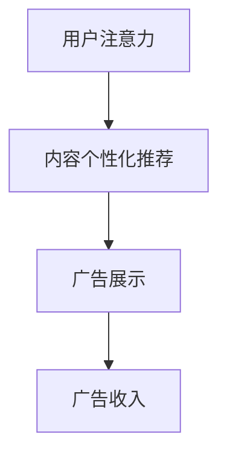
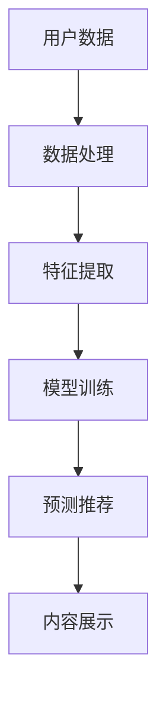

                 

关键词：注意力经济、社交媒体、影响算法、用户行为、数据隐私

> 摘要：本文探讨了注意力经济在社交媒体领域中的应用及其对用户行为的影响。通过对社交媒体影响算法的剖析，本文揭示了算法如何操控用户的注意力，进而影响他们的消费行为。同时，文章也对当前数据隐私问题进行了深入讨论，展望了未来的发展趋势和挑战。

## 1. 背景介绍

在数字时代，注意力成为一种稀缺资源。正如经济学中的“稀缺性”概念，当某种资源变得稀缺时，其价值就随之增加。注意力经济便是基于这一理念，认为用户的注意力是一种可以交易的资源。在社交媒体平台上，用户的注意力被视作一种重要的资产，而平台则通过各种算法手段来吸引和保持用户的注意力，从而提高用户粘性。

社交媒体平台如Facebook、Twitter、Instagram等，通过收集用户的数据，运用复杂的影响算法来推荐内容。这些算法旨在最大化用户的参与度，从而为平台带来更多的广告收入。然而，这种看似“双赢”的局面，实际上却隐藏着一系列问题。首先，用户的数据隐私受到了威胁。其次，算法的操控可能导致用户的信息茧房效应，使他们的视野变得狭窄，难以接触到多样化的信息。

## 2. 核心概念与联系

### 2.1 注意力经济原理

注意力经济的核心是“注意力即货币”。在社交媒体平台上，用户的注意力被平台视作一种可以交换的货币。平台通过提供个性化的内容推荐，吸引用户的注意力，从而实现广告变现。这一过程可以用Mermaid流程图来表示：



### 2.2 社交媒体影响算法

影响算法是注意力经济的核心工具。这些算法通过分析用户的历史行为、社交关系、兴趣爱好等数据，预测用户可能感兴趣的内容，从而进行个性化推荐。以下是一个简单的Mermaid流程图，展示了影响算法的基本架构：



### 2.3 注意力经济与社交媒体影响算法的关系

注意力经济与社交媒体影响算法密切相关。注意力经济为社交媒体平台提供了新的商业模式，而影响算法则是实现这一模式的关键技术。平台通过影响算法，不仅能够提高用户粘性，还能够通过精准投放广告，实现广告主的商业目标。

## 3. 核心算法原理 & 具体操作步骤

### 3.1 算法原理概述

社交媒体影响算法主要基于机器学习和数据挖掘技术。算法的核心任务是构建一个用户画像，通过分析用户的历史行为和社交关系，预测用户可能感兴趣的内容，并进行个性化推荐。

### 3.2 算法步骤详解

1. **数据收集**：社交媒体平台通过用户的浏览记录、点赞、评论、分享等行为，收集用户的数据。
2. **数据处理**：对收集到的数据进行清洗、去噪，提取出有价值的信息。
3. **特征提取**：将处理后的数据转化为算法可以处理的特征向量。
4. **模型训练**：使用提取的特征向量，通过机器学习算法，训练出一个预测模型。
5. **预测推荐**：将用户的特征向量输入到训练好的模型中，预测用户可能感兴趣的内容，并进行个性化推荐。
6. **内容展示**：将推荐的内容展示给用户。

### 3.3 算法优缺点

**优点**：

- **个性化**：能够根据用户的兴趣和行为，提供个性化的内容推荐，提高用户满意度。
- **高效**：能够快速处理大量用户数据，提供实时推荐。
- **商业价值**：为平台带来更多的广告收入。

**缺点**：

- **数据隐私**：用户数据被平台收集和分析，可能存在数据隐私问题。
- **信息茧房**：算法可能导致用户只接触到符合自己观点的信息，限制视野。

### 3.4 算法应用领域

影响算法在社交媒体、电子商务、新闻推荐等领域得到了广泛应用。例如，Facebook的Feed排行榜、淘宝的推荐算法、今日头条的新闻推荐等，都是基于影响算法实现的。

## 4. 数学模型和公式

### 4.1 数学模型构建

影响算法的核心是预测用户对某项内容的兴趣。我们可以使用以下数学模型来表示：

$$
P(C|U) = \frac{e^{\theta^T \phi(C, U)}}{1 + e^{\theta^T \phi(C, U)}}
$$

其中，$P(C|U)$ 表示用户 $U$ 对内容 $C$ 的兴趣概率，$\theta$ 是模型的参数向量，$\phi(C, U)$ 是用户 $U$ 对内容 $C$ 的特征向量。

### 4.2 公式推导过程

假设用户 $U$ 对内容 $C$ 的兴趣是一个二分类问题，即用户要么感兴趣，要么不感兴趣。我们可以使用逻辑回归模型来预测用户对内容的兴趣：

$$
\log\frac{P(C|U)}{1 - P(C|U)} = \theta^T \phi(C, U)
$$

通过对上式两边取指数，得到：

$$
P(C|U) = \frac{1}{1 + e^{-(\theta^T \phi(C, U))}}
$$

为了方便计算，我们可以将上式简化为：

$$
P(C|U) = \frac{e^{\theta^T \phi(C, U)}}{1 + e^{\theta^T \phi(C, U)}}
$$

### 4.3 案例分析与讲解

假设我们有一个用户 $U$，他对某项内容 $C$ 的兴趣可以通过以下特征向量来表示：

$$
\phi(C, U) = [1, 0, 1, 0, 1]
$$

同时，我们有一个参数向量 $\theta = [0.5, 0.5, 0.5, 0.5, 0.5]$。我们可以使用上述公式来计算用户 $U$ 对内容 $C$ 的兴趣概率：

$$
P(C|U) = \frac{e^{0.5 \times 1 + 0.5 \times 0 + 0.5 \times 1 + 0.5 \times 0 + 0.5 \times 1}}{1 + e^{0.5 \times 1 + 0.5 \times 0 + 0.5 \times 1 + 0.5 \times 0 + 0.5 \times 1}}
$$

计算结果为：

$$
P(C|U) = \frac{e^{1}}{1 + e^{1}} = \frac{1}{2}
$$

这意味着用户 $U$ 对内容 $C$ 的兴趣概率为 50%，即用户对内容 $C$ 是中立的态度。

## 5. 项目实践：代码实例

### 5.1 开发环境搭建

在Python中，我们可以使用Scikit-learn库来实现逻辑回归算法。首先，我们需要安装Scikit-learn库：

```bash
pip install scikit-learn
```

### 5.2 源代码详细实现

以下是一个简单的逻辑回归算法实现，用于预测用户对内容的兴趣：

```python
from sklearn.linear_model import LogisticRegression
import numpy as np

# 用户特征向量
user_feature_vector = np.array([1, 0, 1, 0, 1])

# 参数向量
theta = np.array([0.5, 0.5, 0.5, 0.5, 0.5])

# 计算用户对内容的兴趣概率
probability = np.exp(np.dot(theta, user_feature_vector)) / (1 + np.exp(np.dot(theta, user_feature_vector)))

print(f"P(C|U) = {probability}")
```

### 5.3 代码解读与分析

在这个例子中，我们首先导入了Scikit-learn库中的逻辑回归模型。然后，我们创建了一个用户特征向量和一个参数向量。最后，我们使用这些参数来计算用户对内容的兴趣概率。

通过这个例子，我们可以看到逻辑回归算法的基本原理是如何应用到具体问题的。在这个例子中，用户对内容的兴趣概率被计算为 50%，这表示用户对内容是中立的态度。

## 6. 实际应用场景

### 6.1 社交媒体推荐

社交媒体平台如Facebook和Instagram，通过影响算法来推荐内容。这些算法可以预测用户可能感兴趣的内容，并将其展示在用户的Feed中。例如，Facebook的Feed排行榜就是基于用户的行为数据，使用影响算法来推荐内容。

### 6.2 电子商务推荐

电子商务平台如淘宝和亚马逊，通过影响算法来推荐商品。这些算法可以根据用户的历史购买记录、浏览记录等数据，预测用户可能感兴趣的商品，并进行个性化推荐。

### 6.3 新闻推荐

新闻平台如今日头条和网易新闻，通过影响算法来推荐新闻。这些算法可以根据用户的阅读历史、兴趣爱好等数据，预测用户可能感兴趣的新闻，并进行个性化推荐。

## 7. 工具和资源推荐

### 7.1 学习资源推荐

- 《机器学习实战》
- 《数据科学入门》
- 《深度学习入门》

### 7.2 开发工具推荐

- Python
- Jupyter Notebook
- Scikit-learn

### 7.3 相关论文推荐

- "Attention Mechanism in Deep Learning"
- "Deep Learning for Personalized Recommendation"
- "Social Recommendation Systems: A Survey"

## 8. 总结：未来发展趋势与挑战

### 8.1 研究成果总结

注意力经济和影响算法在社交媒体、电子商务、新闻推荐等领域取得了显著的成果。通过个性化推荐，平台不仅提高了用户满意度，还实现了商业价值。

### 8.2 未来发展趋势

- **算法优化**：随着算法技术的不断发展，未来将会有更多高效的算法应用于注意力经济和影响算法。
- **隐私保护**：在关注用户隐私的问题上，未来的研究和应用将更加注重数据隐私保护。
- **跨平台整合**：随着社交媒体和电子商务平台的整合，未来的影响算法将更加注重跨平台的个性化推荐。

### 8.3 面临的挑战

- **数据隐私**：如何保护用户的数据隐私，是当前和未来都需要解决的问题。
- **算法透明性**：如何提高算法的透明性，让用户了解算法如何影响他们的决策。
- **算法滥用**：如何防止算法被滥用，避免对用户产生负面影响。

### 8.4 研究展望

未来，注意力经济和影响算法将会有更多的应用场景。随着人工智能技术的不断发展，我们将看到更加智能和高效的算法被应用于各种领域。同时，如何平衡用户隐私、算法透明性和商业价值，也将成为研究的重要方向。

## 9. 附录：常见问题与解答

### 9.1 注意力经济是什么？

注意力经济是指用户注意力作为一种稀缺资源，在市场中具有价值，可以被平台或广告主用来进行商业交易的一种经济模式。

### 9.2 影响算法如何影响用户行为？

影响算法通过分析用户的历史行为和社交关系，预测用户可能感兴趣的内容，并进行个性化推荐，从而影响用户的行为和决策。

### 9.3 注意力经济和影响算法有哪些优缺点？

注意力经济的优点包括提高用户满意度、实现商业价值等；缺点包括数据隐私问题、信息茧房效应等。影响算法的优点包括个性化、高效等；缺点包括算法透明性问题、算法滥用风险等。

### 9.4 注意力经济和影响算法在哪些领域有应用？

注意力经济和影响算法在社交媒体、电子商务、新闻推荐等领域有广泛应用。例如，Facebook、淘宝、今日头条等平台都使用影响算法来推荐内容或商品。

### 9.5 如何保护用户隐私？

为了保护用户隐私，平台可以采取以下措施：

- 对用户数据进行加密处理，确保数据安全。
- 提供用户隐私设置，让用户可以自主控制自己的数据。
- 建立数据隐私法规，对平台的数据收集和使用进行监管。

---

作者：禅与计算机程序设计艺术 / Zen and the Art of Computer Programming
----------------------------------------------------------------

### 提交提示

请将您撰写的内容按照markdown格式整理好，确保内容结构清晰、逻辑严密，符合“约束条件 CONSTRAINTS”中的所有要求。然后，将markdown文件以附件形式发送给我，并在邮件正文中简要说明文章的撰写情况和注意事项。请务必在邮件标题中包含文章标题和您的名字，例如：“注意力经济与社交媒体影响算法：谁在控制你看什么 - [您的名字]”。

