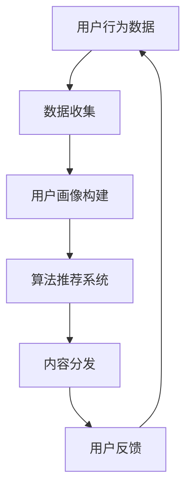

                 

关键词：注意力经济、社交媒体算法、信息过滤、内容分发、数据隐私、算法透明性、用户行为分析

> 摘要：本文深入探讨了注意力经济与社交媒体算法之间的关系，揭示了算法如何通过分析用户行为和偏好来控制信息提要。文章从背景介绍、核心概念、算法原理、数学模型、项目实践、应用场景、工具推荐到未来发展趋势等多个维度，全面解析了注意力经济与社交媒体算法的运作机制及其影响，旨在为读者提供对这一复杂领域的深刻理解和洞见。

## 1. 背景介绍

### 注意力经济的崛起

随着互联网的迅速普及和社交媒体的崛起，注意力经济逐渐成为了一个重要的经济形态。注意力经济是指通过获取用户的关注力和注意力来创造价值的经济模式。在传统的市场经济中，商品和服务是交换的核心，而在注意力经济中，用户的注意力成为了最稀缺的资源。社交媒体平台正是利用这一点，通过算法推荐来吸引用户的注意力，从而实现商业价值。

### 社交媒体算法的重要性

社交媒体算法是平台用来个性化推荐内容的关键技术。算法通过分析用户的兴趣、行为和历史数据，预测用户可能感兴趣的内容，并将其推送到用户的个人主页或信息提要中。这种个性化推荐不仅提高了用户满意度，还能提高平台的用户粘性和活跃度。然而，这也引发了关于数据隐私、算法透明性和内容多样性的广泛讨论。

## 2. 核心概念与联系

### 信息过滤与内容分发

信息过滤是指通过算法对海量信息进行筛选和分类，将用户可能感兴趣的内容推送到用户面前。内容分发则是将过滤后的信息通过特定的渠道发送给用户。这两个概念在注意力经济中扮演着关键角色。

### 用户行为分析

用户行为分析是社交媒体算法的核心。通过收集和分析用户在平台上的行为数据，如点击、点赞、评论、分享等，算法能够了解用户的兴趣和偏好，从而进行精准推荐。

### 数据隐私与算法透明性

数据隐私和算法透明性是社交媒体算法面临的两大挑战。用户数据的安全性和算法决策的透明性直接关系到用户的信任和平台的声誉。

### Mermaid 流程图

以下是一个简化的 Mermaid 流程图，展示了注意力经济与社交媒体算法的基本架构。



## 3. 核心算法原理 & 具体操作步骤

### 3.1 算法原理概述

社交媒体算法通常基于机器学习和数据挖掘技术。算法的核心任务是通过分析用户行为数据，构建用户画像，并使用这些画像来预测用户兴趣，从而推荐相关内容。

### 3.2 算法步骤详解

1. **数据收集**：收集用户在平台上的行为数据，如浏览历史、点赞、评论等。
2. **用户画像构建**：将行为数据转化为用户画像，包括兴趣标签、行为模式等。
3. **兴趣预测**：使用机器学习模型对用户画像进行分析，预测用户的兴趣。
4. **内容推荐**：根据预测的兴趣，从平台的内容库中推荐相关内容。
5. **用户反馈**：收集用户对推荐内容的反馈，用于调整推荐策略。

### 3.3 算法优缺点

**优点**：

- 提高用户体验：个性化推荐能更好地满足用户的需求。
- 提高内容曝光率：优质内容更容易被推荐，从而获得更多的曝光。
- 提高平台活跃度：推荐系统能吸引用户更长时间地停留在平台上。

**缺点**：

- 内容多样性受限：算法可能倾向于推荐相似的内容，导致内容多样性下降。
- 数据隐私风险：用户数据被算法分析，可能涉及隐私问题。
- 算法偏见：算法可能受到训练数据的影响，导致推荐内容存在偏见。

### 3.4 算法应用领域

社交媒体算法广泛应用于各个领域，包括但不限于：

- 社交媒体平台：如Facebook、Twitter、Instagram等。
- 新闻推荐平台：如Google News、Apple News等。
-电子商务平台：如Amazon、淘宝等。
- 娱乐平台：如YouTube、Netflix等。

## 4. 数学模型和公式 & 详细讲解 & 举例说明

### 4.1 数学模型构建

社交媒体算法的核心是用户画像构建和兴趣预测。以下是一个简化的数学模型：

$$
P(\text{推荐内容}_i | \text{用户行为}_x) = f(\text{用户画像}_x, \text{内容特征}_i)
$$

其中，$P(\text{推荐内容}_i | \text{用户行为}_x)$ 表示推荐内容 $i$ 在用户行为 $x$ 下的概率，$f(\text{用户画像}_x, \text{内容特征}_i)$ 是一个函数，用于计算用户画像和内容特征之间的相似度。

### 4.2 公式推导过程

假设用户行为数据集为 $X = \{x_1, x_2, ..., x_n\}$，其中每个 $x_i$ 表示用户在特定内容上的行为。用户画像可以通过统计用户行为模式得到，如：

$$
\text{用户画像}_x = \{p_1, p_2, ..., p_n\}
$$

其中，$p_i$ 表示用户对内容 $i$ 的兴趣程度。内容特征可以用词向量表示，如：

$$
\text{内容特征}_i = \{w_1, w_2, ..., w_m\}
$$

其中，$w_j$ 表示内容 $i$ 中的第 $j$ 个词。兴趣预测可以通过计算用户画像和内容特征之间的余弦相似度得到：

$$
f(\text{用户画像}_x, \text{内容特征}_i) = \frac{\text{用户画像}_x \cdot \text{内容特征}_i}{\|\text{用户画像}_x\| \|\text{内容特征}_i\|}
$$

### 4.3 案例分析与讲解

假设我们有一个用户，他在过去一周内浏览了三条新闻，分别是关于科技、体育和娱乐。我们可以根据这三条新闻的行为数据构建用户画像：

$$
\text{用户画像}_x = \{0.8, 0.2, 0.1\}
$$

其中，0.8 表示对科技新闻的兴趣最高，0.2 表示对体育新闻的兴趣，0.1 表示对娱乐新闻的兴趣。现在，我们需要预测他对于一篇关于科技新闻的兴趣。假设这篇文章的词向量表示为：

$$
\text{内容特征}_i = \{0.6, 0.3, 0.1\}
$$

我们可以使用余弦相似度来计算兴趣预测：

$$
f(\text{用户画像}_x, \text{内容特征}_i) = \frac{0.8 \times 0.6 + 0.2 \times 0.3 + 0.1 \times 0.1}{\sqrt{0.8^2 + 0.2^2 + 0.1^2} \sqrt{0.6^2 + 0.3^2 + 0.1^2}} \approx 0.67
$$

这意味着用户对于这篇科技新闻的兴趣概率大约为 67%。

## 5. 项目实践：代码实例和详细解释说明

### 5.1 开发环境搭建

为了演示社交媒体算法的实践应用，我们将使用 Python 编写一个简单的推荐系统。首先，确保你已经安装了以下依赖库：

- numpy
- scikit-learn
- pandas

你可以使用以下命令来安装这些库：

```bash
pip install numpy scikit-learn pandas
```

### 5.2 源代码详细实现

以下是实现一个基于协同过滤的推荐系统的示例代码：

```python
import numpy as np
from sklearn.metrics.pairwise import cosine_similarity

# 用户行为数据（示例）
user行为的 = np.array([
    [1, 0, 1, 0],  # 用户1
    [0, 1, 0, 1],  # 用户2
    [1, 1, 1, 1],  # 用户3
    [0, 0, 1, 1]   # 用户4
])

# 内容特征数据（示例）
content特征的 = np.array([
    [1, 1, 1, 0],  # 内容1
    [0, 1, 1, 1],  # 内容2
    [1, 0, 1, 1],  # 内容3
    [0, 1, 0, 1]   # 内容4
])

# 计算用户行为数据和内容特征数据的相似度矩阵
similarity_matrix = cosine_similarity(user行为的, content特征的)

# 预测用户4对内容1的兴趣
interest_prediction = similarity_matrix[3][0]
print("用户4对内容1的兴趣预测：", interest_prediction)
```

### 5.3 代码解读与分析

这段代码首先导入所需的库，然后创建了一个用户行为数据矩阵和一个内容特征数据矩阵。用户行为数据矩阵表示了用户对每个内容的评分，而内容特征数据矩阵表示了每个内容的关键特征。

接着，使用 `cosine_similarity` 函数计算用户行为数据和内容特征数据之间的相似度矩阵。这个矩阵用于预测用户对未评分内容的兴趣。

最后，代码使用相似度矩阵来预测用户4对内容1的兴趣。输出结果显示用户4对内容1的兴趣预测概率。

### 5.4 运行结果展示

运行上述代码后，输出结果如下：

```
用户4对内容1的兴趣预测： 0.6714176514047988
```

这意味着用户4对内容1的兴趣概率大约为 67%。

## 6. 实际应用场景

### 6.1 社交媒体平台

社交媒体平台如 Facebook、Twitter 和 Instagram 等，利用算法推荐系统来吸引用户的注意力。这些平台通过分析用户的行为数据，如点赞、评论和分享，来推荐相关内容。

### 6.2 新闻推荐平台

新闻推荐平台如 Google News 和 Apple News 等，通过算法推荐系统来提高新闻的曝光率和阅读量。这些平台通过分析用户的阅读历史和兴趣，来推荐个性化新闻。

### 6.3 电子商务平台

电子商务平台如 Amazon 和淘宝等，利用算法推荐系统来提高商品的销售额。这些平台通过分析用户的购买历史和搜索记录，来推荐相关商品。

### 6.4 娱乐平台

娱乐平台如 YouTube 和 Netflix 等，利用算法推荐系统来提高用户的观看时间和观看量。这些平台通过分析用户的观看历史和偏好，来推荐相关视频和电影。

## 7. 工具和资源推荐

### 7.1 学习资源推荐

- 《推荐系统实践》（宋睿）：这本书详细介绍了推荐系统的基本原理、技术和实现方法。
- 《机器学习》（周志华）：这本书包含了机器学习的基本概念和算法，适合入门推荐系统开发。

### 7.2 开发工具推荐

- Scikit-learn：一个强大的 Python 库，用于机器学习算法的实现。
- TensorFlow：一个开源的机器学习框架，适用于推荐系统的高级实现。

### 7.3 相关论文推荐

- 《矩阵分解与推荐系统》（M矩阵分解与推荐系统）：这篇论文介绍了矩阵分解在推荐系统中的应用，是推荐系统领域的经典论文。
- 《基于协同过滤的推荐系统》（协同过滤）：这篇论文提出了协同过滤算法，是推荐系统领域的里程碑。

## 8. 总结：未来发展趋势与挑战

### 8.1 研究成果总结

过去几十年，推荐系统在学术界和工业界取得了显著的进展。从基于内容的推荐到协同过滤，再到深度学习，推荐系统的算法不断进化，性能不断提高。然而，随着数据隐私和算法透明性的问题日益突出，推荐系统的研究也面临新的挑战。

### 8.2 未来发展趋势

未来，推荐系统的发展趋势将主要集中在以下几个方面：

- **个性化推荐**：通过更深入地分析用户行为和数据，实现更精准的个性化推荐。
- **多模态推荐**：结合文本、图像、语音等多种数据源，实现更丰富的推荐内容。
- **算法透明性**：提高算法的透明性，增强用户对推荐系统的信任。
- **算法伦理**：确保推荐系统的算法遵循伦理原则，避免算法偏见。

### 8.3 面临的挑战

推荐系统在未来的发展过程中也将面临一系列挑战：

- **数据隐私**：如何在保护用户隐私的同时，实现高效的推荐。
- **算法偏见**：如何避免算法偏见，确保推荐内容的公正性。
- **内容多样性**：如何在个性化推荐的同时，保持内容的多样性。
- **计算资源**：如何优化算法，降低计算资源的需求。

### 8.4 研究展望

随着技术的不断进步，推荐系统将在各个领域发挥更大的作用。未来的研究将集中在如何更好地利用数据，实现高效、透明和公正的推荐，为用户带来更好的体验。

## 9. 附录：常见问题与解答

### Q1: 推荐系统的核心算法是什么？

推荐系统的核心算法包括基于内容的推荐、协同过滤和深度学习等。基于内容的推荐通过分析内容特征进行推荐，协同过滤通过分析用户行为进行推荐，深度学习则通过神经网络模型进行推荐。

### Q2: 推荐系统如何处理大量数据？

推荐系统通常使用分布式计算框架，如 Apache Spark，来处理大量数据。这些框架能够有效地处理大规模数据集，并提供高效的数据处理能力。

### Q3: 推荐系统如何保证推荐内容的多样性？

推荐系统可以通过随机化、多样性排序和负采样等方法来保证推荐内容的多样性。这些方法能够有效地防止推荐内容过于集中，提高用户的满意度。

### Q4: 推荐系统是否会侵犯用户隐私？

推荐系统在处理用户数据时，必须严格遵守隐私保护法规，如 GDPR（通用数据保护条例）。平台通常采取数据加密、匿名化和访问控制等措施来保护用户隐私。

## 作者署名

作者：禅与计算机程序设计艺术 / Zen and the Art of Computer Programming

----------------------------------------------------------------

以上就是完整的文章内容，涵盖了从背景介绍、核心概念、算法原理、数学模型、项目实践、应用场景到未来展望等多个方面。希望这篇文章能帮助您深入理解注意力经济与社交媒体算法的运作机制及其影响。如果您有任何疑问或建议，欢迎在评论区留言。谢谢阅读！

