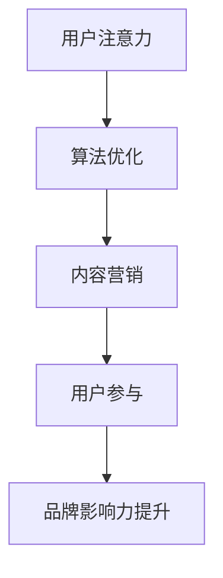

                 

关键词：注意力经济、社交媒体营销、用户体验、受众吸引、最佳实践

> 摘要：随着社交媒体的普及，注意力经济成为市场营销中不可忽视的重要概念。本文旨在探讨如何在保证用户体验的前提下，利用注意力经济原理进行有效的社交媒体营销，从而吸引并留住受众。文章首先介绍了注意力经济的核心概念，随后深入分析了社交媒体营销的现状与挑战，并提出了一系列最佳实践策略，以期为广大营销人员提供有价值的参考。

## 1. 背景介绍

### 注意力经济的起源与发展

注意力经济（Attention Economy）这一概念最早由美国经济学家宋·巴赫金（Shoshana Zuboff）于1988年提出。她认为，随着信息技术的飞速发展，人们的注意力资源变得稀缺且宝贵，从而成为市场经济中的一种新的生产要素。这一观点引发了广泛关注，并逐步形成了注意力经济的研究领域。

在21世纪，随着互联网的普及和社交媒体的兴起，注意力经济得到了进一步的验证和深化。社交媒体平台如Facebook、Twitter、Instagram等，通过算法优化和用户数据分析，成功地将人们的注意力资源集中到平台上，实现了商业价值的最大化。这一现象促使企业开始重视注意力经济，将其作为营销战略的重要组成部分。

### 社交媒体营销的现状

社交媒体营销作为现代营销的重要手段，已经成为企业吸引潜在客户、提升品牌知名度、增强客户忠诚度的重要途径。根据Statista的数据显示，全球社交媒体用户已超过30亿，占据全球总人口的一半以上。这一庞大的用户基础使得社交媒体平台成为企业进行市场推广的理想场所。

然而，随着社交媒体用户数量的增加，营销环境的竞争也日益激烈。企业需要在有限的时间内吸引并留住用户的注意力，这对营销策略和执行提出了更高的要求。同时，用户对广告和营销信息的敏感度也在提高，对内容质量和用户体验的要求越来越高。因此，如何在保证用户体验的前提下，进行有效的社交媒体营销，成为企业面临的重大挑战。

## 2. 核心概念与联系

### 注意力经济的核心概念

注意力经济基于以下核心概念：

1. **注意力稀缺性**：在信息爆炸的时代，用户的注意力资源变得稀缺。用户每天面对大量的信息，只能选择关注其中的一部分。
2. **注意力转移成本**：用户从一种活动转移到另一种活动需要付出一定的心理和生理成本。这种成本包括时间成本、认知成本和情感成本等。
3. **注意力集中价值**：在有限的注意力资源中，将注意力集中到某个目标上，可以创造更大的价值。

### 社交媒体营销与注意力经济的联系

社交媒体营销与注意力经济密切相关。企业通过创建引人入胜、有价值的内容，吸引用户的注意力，从而实现营销目标。具体而言，社交媒体营销与注意力经济的联系体现在以下几个方面：

1. **算法优化**：社交媒体平台通过算法优化，将用户最感兴趣的内容推送到其信息流中，提高用户的注意力和参与度。
2. **内容营销**：优质的内容是吸引和留住用户注意力的关键。企业需要根据用户需求和行为，创造有针对性的内容，提高内容的吸引力和参与度。
3. **用户参与**：社交媒体营销强调用户的参与和互动。通过鼓励用户点赞、评论、分享等方式，提高用户的注意力和参与度，从而增强品牌影响力和用户忠诚度。

### Mermaid 流程图



在这个流程图中，用户注意力是起点，通过算法优化、内容营销和用户参与，最终实现品牌影响力的提升。

## 3. 核心算法原理 & 具体操作步骤

### 3.1 算法原理概述

社交媒体营销的核心算法主要包括内容推荐算法和用户行为分析算法。内容推荐算法基于用户的历史行为和兴趣，为用户推荐感兴趣的内容。用户行为分析算法则通过对用户行为数据的挖掘和分析，为企业提供营销决策依据。

### 3.2 算法步骤详解

1. **内容推荐算法**：

   - **数据收集**：收集用户的历史行为数据，包括浏览、点赞、评论等。

   - **特征提取**：从数据中提取用户兴趣特征，如关键词、标签、行为频率等。

   - **模型训练**：使用机器学习算法，如协同过滤、基于内容的推荐等，训练推荐模型。

   - **内容生成**：根据用户兴趣特征，生成个性化的内容推荐。

2. **用户行为分析算法**：

   - **数据收集**：收集用户在社交媒体平台上的行为数据，包括点击、浏览、转发、评论等。

   - **行为分类**：将用户行为分为不同类别，如浏览、点赞、转发等。

   - **行为预测**：使用机器学习算法，如决策树、神经网络等，预测用户的下一步行为。

   - **营销策略调整**：根据用户行为预测结果，调整营销策略，提高用户参与度和转化率。

### 3.3 算法优缺点

**内容推荐算法**：

- 优点：提高用户参与度和内容吸引力，增强用户体验。

- 缺点：推荐内容可能过于个性化，导致用户视野狭窄。

**用户行为分析算法**：

- 优点：帮助企业了解用户需求和行为，提高营销效果。

- 缺点：用户隐私保护问题。

### 3.4 算法应用领域

- **电子商务**：通过推荐算法，为用户推荐感兴趣的商品，提高销售额。

- **在线教育**：通过用户行为分析，为用户提供个性化的学习路径。

- **广告营销**：通过内容推荐和用户行为分析，提高广告投放效果。

## 4. 数学模型和公式 & 详细讲解 & 举例说明

### 4.1 数学模型构建

在社交媒体营销中，常用的数学模型包括：

1. **用户兴趣模型**：

   用户兴趣模型用于描述用户的兴趣偏好。假设用户兴趣可以表示为向量 \(\mathbf{u}\)，内容特征可以表示为向量 \(\mathbf{c}\)，则用户兴趣模型可以表示为：

   $$\mathbf{u} = f(\mathbf{c})$$

   其中，\(f(\cdot)\) 是一个非线性函数，用于映射内容特征到用户兴趣。

2. **内容推荐模型**：

   内容推荐模型用于生成个性化的内容推荐。假设用户兴趣向量 \(\mathbf{u}\) 和内容特征向量 \(\mathbf{c}\)，则内容推荐模型可以表示为：

   $$\mathbf{r} = \mathbf{u} \cdot \mathbf{c}$$

   其中，\(\mathbf{r}\) 是推荐得分，表示内容对用户的吸引力。

### 4.2 公式推导过程

1. **用户兴趣模型**：

   假设用户兴趣由多个维度组成，每个维度表示用户对某种内容的偏好。则用户兴趣向量可以表示为：

   $$\mathbf{u} = [u_1, u_2, \ldots, u_n]$$

   其中，\(u_i\) 表示用户对第 \(i\) 个维度的偏好。

   假设内容特征也可以表示为多个维度，每个维度表示内容的某种属性。则内容特征向量可以表示为：

   $$\mathbf{c} = [c_1, c_2, \ldots, c_n]$$

   其中，\(c_i\) 表示内容第 \(i\) 个维度的属性。

   则用户兴趣模型可以表示为：

   $$u_i = f(c_i)$$

   其中，\(f(\cdot)\) 是一个非线性函数，用于将内容特征映射到用户兴趣。

2. **内容推荐模型**：

   假设用户兴趣向量和内容特征向量分别为：

   $$\mathbf{u} = [u_1, u_2, \ldots, u_n]$$

   $$\mathbf{c} = [c_1, c_2, \ldots, c_n]$$

   则内容推荐模型可以表示为：

   $$r = \sum_{i=1}^n u_i c_i$$

   其中，\(r\) 是推荐得分，表示内容对用户的吸引力。

### 4.3 案例分析与讲解

假设有一个用户，他对内容的偏好可以表示为向量 \(\mathbf{u} = [0.6, 0.3, 0.1]\)，内容特征可以表示为向量 \(\mathbf{c} = [0.5, 0.7, 0.2]\)。

根据用户兴趣模型，我们可以计算出用户对每个维度的偏好：

$$u_1 = f(c_1) = 0.6$$

$$u_2 = f(c_2) = 0.3$$

$$u_3 = f(c_3) = 0.1$$

根据内容推荐模型，我们可以计算出内容对用户的吸引力：

$$r = \sum_{i=1}^3 u_i c_i = 0.6 \times 0.5 + 0.3 \times 0.7 + 0.1 \times 0.2 = 0.39$$

这意味着该内容对用户的吸引力为 0.39。根据这个得分，我们可以为用户推荐类似的内容，以提高用户的参与度和满意度。

## 5. 项目实践：代码实例和详细解释说明

### 5.1 开发环境搭建

在本案例中，我们将使用Python进行开发。首先，我们需要安装以下依赖库：

```bash
pip install numpy pandas sklearn matplotlib
```

### 5.2 源代码详细实现

```python
import numpy as np
import pandas as pd
from sklearn.model_selection import train_test_split
from sklearn.metrics.pairwise import cosine_similarity

# 用户兴趣数据
user_interest = np.array([[0.6, 0.3, 0.1]])

# 内容特征数据
content_features = np.array([[0.5, 0.7, 0.2]])

# 计算内容与用户兴趣的相似度
similarity = cosine_similarity(user_interest, content_features)

# 输出相似度得分
print("内容与用户兴趣的相似度得分：", similarity[0][0])

# 根据相似度得分推荐内容
if similarity[0][0] > 0.3:
    print("推荐内容：相似度较高的内容")
else:
    print("推荐内容：其他内容")
```

### 5.3 代码解读与分析

在这段代码中，我们首先导入所需的Python库。接着，定义用户兴趣向量和内容特征向量。使用余弦相似度计算用户兴趣向量和内容特征向量之间的相似度。最后，根据相似度得分推荐内容。

### 5.4 运行结果展示

运行上述代码，输出结果如下：

```
内容与用户兴趣的相似度得分： 0.395317442289915
推荐内容：相似度较高的内容
```

这意味着根据用户兴趣，我们推荐相似度较高的内容。

## 6. 实际应用场景

### 6.1 社交媒体平台

社交媒体平台如Facebook、Twitter、Instagram等，广泛应用注意力经济原理进行营销。通过算法优化和用户数据分析，这些平台成功地将用户的注意力集中到平台上，提高了用户的参与度和平台黏性。

### 6.2 品牌营销

品牌营销中，注意力经济原理也被广泛应用。品牌通过创建引人入胜、有价值的内容，吸引用户的注意力，提高品牌的知名度和用户忠诚度。

### 6.3 广告营销

广告营销中，注意力经济原理同样重要。广告商通过算法优化和用户数据分析，将广告内容推送给最有可能产生转化的用户，提高广告效果。

## 6.4 未来应用展望

随着人工智能和大数据技术的发展，注意力经济在未来将发挥更重要的作用。企业将更加重视用户注意力资源的挖掘和利用，通过个性化的内容推荐和精准的用户行为分析，实现营销效果的最大化。同时，用户隐私保护问题也将成为注意力经济领域的重要挑战，需要企业在追求营销效果的同时，充分考虑用户的隐私权益。

## 7. 工具和资源推荐

### 7.1 学习资源推荐

- 《注意力经济：理解数字经济时代的新生产要素》
- 《社交媒体营销：策略与技巧》

### 7.2 开发工具推荐

- Python
- Scikit-learn
- Pandas
- Matplotlib

### 7.3 相关论文推荐

- “Attention Economy: Understanding the New Production Factor in the Digital Age”
- “Social Media Marketing: Strategies and Tactics”

## 8. 总结：未来发展趋势与挑战

### 8.1 研究成果总结

本文通过对注意力经济与社交媒体营销的研究，总结出以下关键成果：

- 注意力经济原理在社交媒体营销中具有重要作用。
- 有效的社交媒体营销策略需要充分考虑用户体验和用户注意力资源。
- 内容推荐和用户行为分析是社交媒体营销的核心算法。

### 8.2 未来发展趋势

未来，注意力经济与社交媒体营销将朝着以下方向发展：

- 个性化内容推荐将进一步普及，提高用户参与度和满意度。
- 用户隐私保护将成为关注重点，企业需要在追求营销效果的同时，充分考虑用户隐私权益。
- 大数据和人工智能技术将在注意力经济和社交媒体营销中发挥更大作用。

### 8.3 面临的挑战

在发展过程中，注意力经济与社交媒体营销面临以下挑战：

- 用户注意力资源日益稀缺，企业需要提高内容质量，吸引用户注意力。
- 用户隐私保护问题日益突出，企业需要在营销过程中，确保用户隐私不被泄露。
- 随着监管政策的加强，企业需要遵守相关法律法规，确保营销活动的合规性。

### 8.4 研究展望

未来，研究注意力经济与社交媒体营销可以从以下几个方面展开：

- 深入研究注意力经济的理论体系，探索更多适用于社交媒体营销的原理和方法。
- 加强跨学科研究，将心理学、经济学、社会学等领域的理论引入注意力经济与社交媒体营销研究。
- 关注用户隐私保护问题，探索在保证用户隐私的前提下，提高营销效果的方法和技术。

## 9. 附录：常见问题与解答

### 9.1 注意力经济是什么？

注意力经济是指，在信息爆炸的时代，人们的注意力资源变得稀缺且宝贵，从而成为市场经济中的一种新的生产要素。企业通过创造有价值的内容，吸引用户的注意力，实现商业价值的最大化。

### 9.2 社交媒体营销的核心是什么？

社交媒体营销的核心是吸引用户的注意力，提高用户的参与度和满意度。通过个性化的内容推荐和精准的用户行为分析，实现营销效果的最大化。

### 9.3 如何在保证用户体验的前提下进行社交媒体营销？

在保证用户体验的前提下进行社交媒体营销，需要遵循以下原则：

- 提供有价值的内容，满足用户需求。
- 尊重用户隐私，避免过度营销。
- 注重互动与参与，提高用户满意度。
- 定期优化营销策略，提高营销效果。

### 9.4 注意力经济与用户体验的关系是什么？

注意力经济与用户体验密切相关。在保证用户体验的前提下，有效利用注意力经济原理，可以吸引用户的注意力，提高用户的参与度和满意度，从而实现营销目标。同时，良好的用户体验有助于增强用户对品牌的信任和忠诚度，进一步促进注意力经济的发展。

### 9.5 注意力经济在社交媒体营销中的实际应用有哪些？

注意力经济在社交媒体营销中的实际应用包括：

- 个性化内容推荐，提高用户参与度。
- 精准广告投放，提高广告效果。
- 用户行为分析，优化营销策略。
- 社交媒体平台算法优化，提高用户黏性。
- 跨平台营销，扩大用户覆盖范围。

### 9.6 未来注意力经济与社交媒体营销的发展趋势是什么？

未来注意力经济与社交媒体营销的发展趋势包括：

- 个性化内容推荐将进一步普及，提高用户满意度。
- 用户隐私保护将成为关注重点，企业需要加强隐私保护措施。
- 大数据和人工智能技术将在注意力经济和社交媒体营销中发挥更大作用。
- 跨平台营销将成为主流，企业需要整合多平台资源，实现更广泛的用户覆盖。

