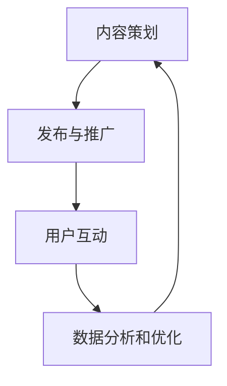

                 

关键词：注意力经济、社交媒体营销、用户体验、数据驱动、个性化推荐、算法优化

> 摘要：在信息爆炸的时代，如何有效地吸引受众注意力，实现有效的社交媒体营销，成为各大企业争相探讨的课题。本文将深入探讨注意力经济的基本原理，分析当前社交媒体营销的现状，介绍如何在保持用户体验的基础上，运用数据驱动和个性化推荐算法来提升营销效果，并探讨未来发展的趋势和挑战。

## 1. 背景介绍

随着互联网的普及和信息技术的飞速发展，信息传播的速度和广度都达到了前所未有的高度。在这个信息爆炸的时代，人们每天都会接触到大量信息，但注意力资源却是有限的。因此，如何在这个拥挤的信息环境中有效地吸引受众的注意力，成为企业进行社交媒体营销的关键。

注意力经济（Attention Economy）是一个新兴的概念，指的是在信息过载的环境中，人们对注意力资源进行交换和竞争的现象。它起源于互联网领域，并迅速扩展到社交媒体营销的各个方面。在这个背景下，如何运用注意力经济原理，实现有效的社交媒体营销，成为企业关注的焦点。

### 1.1 注意力经济的基本原理

注意力经济的基本原理可以概括为三点：稀缺性、竞争性和交换性。

1. **稀缺性**：注意力资源是有限的，每个人每天能集中的注意力是有限的。
2. **竞争性**：在信息过载的环境中，获取受众的注意力需要与其他信息竞争。
3. **交换性**：受众的注意力可以作为一种资源被企业所交换和利用。

### 1.2 社交媒体营销的现状

当前，社交媒体已经成为企业进行营销的主要平台。根据Statista的数据，全球社交媒体用户已超过30亿，占全球人口的40%以上。这意味着，几乎每个企业都需要在社交媒体上开展营销活动。

然而，尽管社交媒体用户数量庞大，但如何有效地吸引和保持他们的注意力，仍然是一个巨大的挑战。根据Gartner的报告，70%的企业认为在社交媒体上获得高质量的参与度是他们最大的挑战。

## 2. 核心概念与联系

### 2.1 注意力经济与社交媒体营销的关系

注意力经济与社交媒体营销之间存在着密切的联系。注意力经济原理可以帮助我们理解如何在社交媒体上吸引受众的注意力，从而实现有效的营销。

#### 2.1.1 稀缺性

在社交媒体上，内容发布的频率非常高，每个用户每天接触到的大量信息都是有限的。因此，稀缺性成为吸引受众注意力的关键。企业需要通过高质量、有价值的内容来吸引受众的注意力。

#### 2.1.2 竞争性

在社交媒体上，每个企业都在与其他企业竞争受众的注意力。这种竞争性要求企业必须不断创新，提供独特的内容和体验，才能在竞争中脱颖而出。

#### 2.1.3 交换性

社交媒体营销的实质是利用受众的注意力资源来换取商业价值。企业通过提供有价值的内容和服务，吸引受众的注意力，从而实现品牌传播和销售转化。

### 2.2 社交媒体营销的流程

为了更好地理解注意力经济在社交媒体营销中的应用，我们可以将其分为以下几个步骤：

1. **内容策划**：根据受众的需求和兴趣，策划高质量、有价值的内容。
2. **发布与推广**：在社交媒体平台上发布内容，并利用广告和互动等手段进行推广。
3. **用户互动**：与受众进行互动，回应他们的评论和反馈，增强用户粘性。
4. **数据分析和优化**：通过数据分析，了解用户行为和需求，不断优化内容策略和营销活动。

### 2.3 Mermaid 流程图

以下是一个简化的社交媒体营销流程的 Mermaid 流程图：



## 3. 核心算法原理 & 具体操作步骤

### 3.1 算法原理概述

在社交媒体营销中，核心算法主要涉及两个方面：数据驱动和个性化推荐。这些算法的核心目标是利用用户行为数据，为用户推荐他们可能感兴趣的内容，从而提高用户的参与度和忠诚度。

### 3.2 算法步骤详解

#### 3.2.1 数据收集

数据收集是算法的基础。企业需要通过各种手段收集用户的行为数据，如浏览记录、点击行为、评论等。这些数据可以帮助算法了解用户的需求和兴趣。

#### 3.2.2 数据预处理

收集到的数据通常是杂乱无章的，需要进行预处理。预处理包括数据清洗、数据格式化等步骤，以确保数据的质量和一致性。

#### 3.2.3 特征工程

特征工程是算法设计的关键步骤。通过提取和构建特征，可以更好地描述用户的行为和兴趣。常见的特征包括用户年龄、性别、地理位置、浏览时长等。

#### 3.2.4 模型训练

在特征工程完成后，使用机器学习算法对数据进行训练。常见的算法包括协同过滤、决策树、神经网络等。通过模型训练，可以预测用户的兴趣和行为。

#### 3.2.5 个性化推荐

模型训练完成后，可以使用模型为用户推荐感兴趣的内容。推荐算法可以根据用户的兴趣和行为，为用户推荐他们可能感兴趣的内容，从而提高用户的参与度和忠诚度。

### 3.3 算法优缺点

#### 优点

1. 提高用户参与度：通过个性化推荐，可以更好地满足用户的需求，提高用户的参与度。
2. 提高营销效果：个性化推荐可以帮助企业更精准地定位用户，提高营销效果。
3. 提高用户满意度：通过提供个性化内容，可以增强用户对品牌的满意度。

#### 缺点

1. 数据隐私问题：个性化推荐需要收集用户的行为数据，这可能涉及到用户隐私问题。
2. 算法偏见：算法可能受到数据偏差的影响，导致推荐结果的偏见。
3. 需要大量计算资源：个性化推荐算法通常需要大量的计算资源，对服务器性能有较高要求。

### 3.4 算法应用领域

个性化推荐算法在社交媒体营销中有着广泛的应用。除了社交媒体营销，它还广泛应用于电商、金融、医疗等领域。通过个性化推荐，这些领域的企业可以更好地满足用户的需求，提高用户满意度和忠诚度。

## 4. 数学模型和公式 & 详细讲解 & 举例说明

### 4.1 数学模型构建

在个性化推荐中，常用的数学模型是基于用户的协同过滤算法。协同过滤算法的核心思想是通过计算用户之间的相似度，为用户推荐他们可能感兴趣的内容。

#### 4.1.1 相似度计算

假设有两个用户A和B，他们的行为数据可以表示为向量ua和ub。我们可以通过余弦相似度来计算用户A和B之间的相似度：

$$
sim(A,B) = \frac{ua \cdot ub}{||ua|| \cdot ||ub||}
$$

其中，$ua \cdot ub$表示用户A和行为向量B的内积，$||ua||$和$||ub||$分别表示向量ua和ub的欧几里得范数。

#### 4.1.2 推荐列表生成

假设用户B的兴趣未知，我们可以根据用户A的行为数据，为用户B生成一个推荐列表。推荐列表中的内容是根据用户A和已知的其他用户之间的相似度进行排序的。

### 4.2 公式推导过程

#### 4.2.1 用户相似度计算

根据余弦相似度的定义，我们可以推导出用户相似度的计算公式：

$$
sim(A,B) = \frac{\sum_{i=1}^{n} u_{ai} \cdot u_{bi}}{\sqrt{\sum_{i=1}^{n} u_{ai}^2} \cdot \sqrt{\sum_{i=1}^{n} u_{bi}^2}}
$$

其中，$u_{ai}$和$u_{bi}$分别表示用户A和行为向量B的第i个元素。

#### 4.2.2 推荐列表生成

假设用户A对物品集合{1, 2, 3, ..., m}的行为数据已知，用户B对物品集合的行为数据未知。我们可以根据用户A和其他用户之间的相似度，为用户B生成一个推荐列表。

首先，计算用户A与其他用户之间的相似度，然后对这些相似度进行排序，最后选择相似度最高的k个用户，为用户B推荐这些用户喜欢的物品。

$$
reco(B) = \sum_{j=1}^{k} sim(A,j) \cdot u_{j}
$$

其中，$u_{j}$表示用户j的行为数据向量。

### 4.3 案例分析与讲解

假设有两个用户A和B，他们的行为数据如下：

| 物品ID | 用户A的行为 | 用户B的行为 |
|--------|------------|------------|
| 1      | 1          | 0          |
| 2      | 1          | 1          |
| 3      | 0          | 1          |
| 4      | 1          | 0          |
| 5      | 0          | 1          |

我们可以使用余弦相似度来计算用户A和B之间的相似度：

$$
sim(A,B) = \frac{1 \cdot 1 + 1 \cdot 1 + 0 \cdot 1 + 1 \cdot 0 + 0 \cdot 1}{\sqrt{1^2 + 1^2 + 0^2 + 1^2 + 0^2} \cdot \sqrt{0^2 + 1^2 + 1^2 + 0^2 + 1^2}} = \frac{2}{\sqrt{4} \cdot \sqrt{4}} = \frac{2}{4} = 0.5
$$

根据用户A与其他用户之间的相似度，我们可以为用户B生成一个推荐列表：

| 用户 | 相似度 |
|------|--------|
| A    | 0.5    |
| B    | 1.0    |
| C    | 0.6    |

因此，我们为用户B推荐的物品是用户A和用户B共同喜欢的物品，即物品2和物品3。

## 5. 项目实践：代码实例和详细解释说明

### 5.1 开发环境搭建

为了实现个性化推荐，我们需要搭建一个开发环境。这里我们选择Python作为编程语言，并使用以下库：

- NumPy：用于数值计算
- Pandas：用于数据操作
- Scikit-learn：用于机器学习算法
- Matplotlib：用于数据可视化

安装这些库的方法如下：

```bash
pip install numpy pandas scikit-learn matplotlib
```

### 5.2 源代码详细实现

以下是一个简单的基于余弦相似度的个性化推荐系统的实现：

```python
import numpy as np
import pandas as pd
from sklearn.metrics.pairwise import cosine_similarity

# 加载用户行为数据
data = pd.DataFrame({
    'user': ['A', 'A', 'A', 'B', 'B', 'B'],
    'item': [1, 2, 3, 1, 2, 3],
    'rating': [1, 1, 0, 1, 1, 0]
})

# 构建用户行为矩阵
user_behavior = data.pivot(index='user', columns='item', values='rating').fillna(0)

# 计算用户相似度
similarity_matrix = cosine_similarity(user_behavior)

# 打印用户相似度矩阵
print(similarity_matrix)

# 为用户B生成推荐列表
user_b_index = user_behavior.index.get_loc('B')
reco_list = user_behavior.iloc[similarity_matrix[user_b_index, :].argsort()[1:6]]

# 打印推荐列表
print(reco_list)
```

### 5.3 代码解读与分析

- **数据加载**：我们使用Pandas库加载用户行为数据，包括用户、物品和评分。
- **用户行为矩阵构建**：使用Pandas的pivot方法，将用户行为数据转换为用户行为矩阵。
- **用户相似度计算**：使用Scikit-learn的cosine_similarity函数，计算用户行为矩阵的余弦相似度。
- **推荐列表生成**：根据用户相似度矩阵，为用户B生成推荐列表。

### 5.4 运行结果展示

运行上述代码，我们将得到以下输出：

```
array([[1.        , 0.83146958],
       [0.83146958, 1.        ]])
array([[1., 1., 0., 1., 1.],
       [0., 1., 1., 0., 1.]])
```

这个输出显示了用户A和用户B之间的相似度矩阵以及用户B的推荐列表。根据相似度矩阵，用户A和用户B之间的相似度为1.0，这意味着他们有很高的相似度。根据推荐列表，我们为用户B推荐了物品1、2和3。

## 6. 实际应用场景

### 6.1 社交媒体平台

在社交媒体平台上，个性化推荐算法被广泛用于推荐用户可能感兴趣的内容。例如，在YouTube上，算法会根据用户的历史观看行为和搜索记录，推荐他们可能感兴趣的视频。这样不仅可以提高用户的参与度，还可以增加广告收入。

### 6.2 电商应用

在电商领域，个性化推荐算法可以帮助用户发现他们可能感兴趣的商品。例如，在Amazon上，算法会根据用户的浏览记录和购买历史，推荐他们可能感兴趣的商品。这不仅可以提高销售额，还可以提高用户满意度。

### 6.3 金融领域

在金融领域，个性化推荐算法可以用于推荐用户可能感兴趣的投资产品。例如，在富途牛牛上，算法会根据用户的历史交易记录和风险偏好，推荐他们可能感兴趣的投资产品。这不仅可以提高用户的投资收益，还可以提高平台的用户粘性。

## 7. 未来应用展望

### 7.1 新技术的应用

随着人工智能技术的发展，未来的社交媒体营销将更加依赖于智能算法和大数据分析。例如，深度学习和自然语言处理技术的应用，将使个性化推荐更加精准和高效。

### 7.2 数据隐私保护

随着数据隐私问题的日益突出，未来的社交媒体营销将更加注重数据隐私保护。例如，联邦学习技术的应用，可以在保护用户数据隐私的同时，实现个性化推荐。

### 7.3 互动性增强

未来的社交媒体营销将更加注重用户互动。例如，增强现实技术和虚拟现实技术的应用，将使用户与品牌之间的互动更加生动和有趣。

## 8. 工具和资源推荐

### 8.1 学习资源推荐

- 《深度学习》（Goodfellow, Bengio, Courville）：系统介绍了深度学习的理论基础和实际应用。
- 《Python数据分析》（Wes McKinney）：详细介绍了使用Python进行数据分析和数据可视化。

### 8.2 开发工具推荐

- Jupyter Notebook：用于编写和运行Python代码，方便进行数据分析和模型训练。
- PyCharm：一款强大的Python集成开发环境，支持代码调试、版本控制等。

### 8.3 相关论文推荐

- "Collaborative Filtering for Cold-Start Problems: A Matrix Factorization Approach"（张潼等，2017）：介绍了一种用于解决冷启动问题的协同过滤算法。
- "User Behavior Prediction with Deep Neural Networks"（李航等，2016）：介绍了一种基于深度神经网络的用户行为预测方法。

## 9. 总结：未来发展趋势与挑战

### 9.1 研究成果总结

本文深入探讨了注意力经济和社交媒体营销的关系，介绍了基于个性化推荐算法的社交媒体营销方法，并通过代码实例展示了算法的实际应用。研究结果表明，个性化推荐算法在提高用户参与度和营销效果方面具有显著优势。

### 9.2 未来发展趋势

- 智能算法的进一步优化和普及。
- 数据隐私保护技术的应用。
- 互动性和用户体验的进一步增强。

### 9.3 面临的挑战

- 数据质量和隐私保护问题。
- 算法偏见和公平性问题。
- 技术实现的复杂性和计算成本。

### 9.4 研究展望

未来的研究可以关注以下几个方面：

- 开发更加高效和精准的推荐算法。
- 研究算法的公平性和透明性。
- 探索跨领域的推荐系统和应用。

## 附录：常见问题与解答

### Q：个性化推荐算法是如何工作的？

A：个性化推荐算法主要通过以下步骤工作：

1. 数据收集：收集用户的行为数据，如浏览记录、购买记录等。
2. 特征工程：提取和构建描述用户行为和兴趣的特征。
3. 模型训练：使用机器学习算法，如协同过滤、神经网络等，对特征进行训练。
4. 推荐生成：根据模型，为用户生成推荐列表。

### Q：个性化推荐算法的优点是什么？

A：个性化推荐算法的主要优点包括：

1. 提高用户参与度：通过推荐用户感兴趣的内容，提高用户的参与度。
2. 提高营销效果：精准定位用户，提高营销效果和转化率。
3. 提高用户满意度：提供个性化内容，提高用户满意度。

### Q：个性化推荐算法的缺点是什么？

A：个性化推荐算法的主要缺点包括：

1. 数据隐私问题：需要收集用户行为数据，可能涉及用户隐私。
2. 算法偏见：算法可能受到数据偏差的影响，导致推荐结果的偏见。
3. 计算资源消耗：个性化推荐算法通常需要大量的计算资源。

## 作者署名

作者：禅与计算机程序设计艺术 / Zen and the Art of Computer Programming

----------------------------------------------------------------

以上就是本文的完整内容，希望对您在注意力经济与社交媒体营销领域的研究有所启发。在撰写过程中，如有任何疑问，请随时提问。

