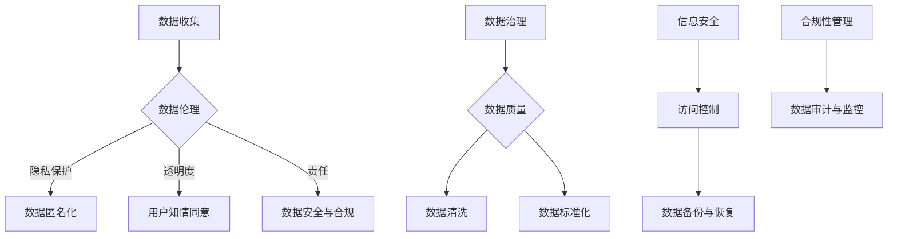

                 

 关键词：注意力经济，数据伦理，数据治理，隐私保护，算法公平性，数字化转型，信息安全

> 摘要：随着数字化转型的加速，注意力经济作为一种新兴的经济模式，正在深刻地改变我们的生活方式和社会结构。然而，在这种模式中，数据伦理和数据治理的问题日益凸显，如何平衡个人隐私、商业利益和社会责任成为了一个亟待解决的难题。本文旨在探讨注意力经济中的数据伦理与治理，分析其核心概念、面临的问题和挑战，并提出相应的解决方案，为构建一个健康、可持续的数字生态系统提供参考。

## 1. 背景介绍

### 注意力经济的兴起

注意力经济是一种以用户注意力为核心资源的经济模式。随着互联网和社交媒体的普及，人们的时间和注意力资源变得愈发宝贵。广告商、内容创作者和平台运营者开始竞相争夺用户的注意力，从而实现商业价值的最大化。例如，通过精准投放广告和推送个性化内容，平台可以吸引更多的用户和流量，从而提高广告收益。

### 数据在注意力经济中的角色

在注意力经济中，数据是至关重要的资源。一方面，用户的数据可以用于用户画像、行为分析和个性化推荐，从而提高用户体验和满意度；另一方面，数据也是商业决策和战略制定的重要依据。然而，数据的价值背后隐藏着一系列的伦理和治理问题，例如数据隐私、数据安全和算法公平性等。

## 2. 核心概念与联系

### 数据伦理

数据伦理是指关于数据收集、处理、存储和使用过程中所涉及到的伦理问题。主要包括以下几个方面：

- **隐私保护**：确保个人数据不被未经授权的第三方访问和泄露。
- **透明度**：用户应当明确了解其数据被如何使用和共享。
- **责任**：数据主体和数据控制者应当对其行为负责，并对数据泄露等风险进行有效管理。

### 数据治理

数据治理是指通过制定和执行相关政策、流程和技术，确保数据质量、安全性和合规性的一系列管理活动。数据治理的目的是确保数据能够在组织内部被有效地管理、利用和保护。数据治理的关键要素包括：

- **数据质量**：确保数据的准确性、完整性和一致性。
- **数据安全**：保护数据免受未经授权的访问、篡改和泄露。
- **合规性**：遵守相关法律法规和标准，确保数据的合法使用。

### Mermaid 流程图



## 3. 核心算法原理 & 具体操作步骤

### 3.1 算法原理概述

在注意力经济中，核心算法主要包括用户行为分析、个性化推荐和广告投放等。这些算法的基本原理是基于机器学习和数据挖掘技术，通过对大量用户数据进行分析，发现用户的行为模式、兴趣偏好，并据此生成个性化的推荐和广告。

### 3.2 算法步骤详解

1. **数据收集**：通过网站日志、浏览器插件、移动应用等渠道收集用户数据。
2. **数据处理**：清洗、整理和归一化数据，确保数据质量。
3. **特征提取**：提取用户行为数据中的关键特征，如点击次数、浏览时长、搜索关键词等。
4. **模型训练**：使用机器学习算法（如决策树、支持向量机、神经网络等）训练用户行为分析模型。
5. **个性化推荐**：根据用户的行为特征，生成个性化的推荐内容。
6. **广告投放**：根据用户的兴趣和需求，投放相关的广告。

### 3.3 算法优缺点

**优点**：

- **提高用户体验**：通过个性化推荐和精准广告，提高用户满意度和参与度。
- **增加商业价值**：通过优化广告投放和内容推荐，提高广告收益和用户转化率。

**缺点**：

- **隐私泄露风险**：过度收集用户数据可能导致隐私泄露。
- **算法偏见**：算法可能基于历史数据生成偏见，导致推荐和广告的不公平性。
- **数据滥用**：用户数据可能被用于不当目的，损害用户利益。

### 3.4 算法应用领域

- **电子商务**：通过个性化推荐和精准广告，提高销售额和用户满意度。
- **社交媒体**：通过分析用户行为，生成个性化内容，提高用户粘性和活跃度。
- **广告营销**：通过精准投放广告，提高广告效果和投放效率。

## 4. 数学模型和公式 & 详细讲解 & 举例说明

### 4.1 数学模型构建

在注意力经济中，常用的数学模型包括用户行为分析模型、推荐系统模型和广告投放模型等。

#### 用户行为分析模型

假设用户行为可以用以下公式表示：

$$
\text{User Behavior} = f(\text{User Feature}, \text{Context})
$$

其中，User Feature代表用户特征，Context代表用户所处的上下文环境。用户特征可以包括年龄、性别、地理位置、兴趣爱好等；上下文环境可以包括时间、地点、设备类型等。

#### 推荐系统模型

假设推荐系统模型为基于协同过滤的算法，其数学模型可以表示为：

$$
\text{Recommendation} = \text{User Similarity} \cdot \text{Item Popularity}
$$

其中，User Similarity表示用户之间的相似度，Item Popularity表示物品的流行度。

#### 广告投放模型

假设广告投放模型为基于广告效果优化的算法，其数学模型可以表示为：

$$
\text{广告投放} = \text{Click-Through Rate} \cdot \text{广告收益}
$$

其中，Click-Through Rate表示点击率，广告收益表示广告投放带来的收益。

### 4.2 公式推导过程

#### 用户行为分析模型推导

假设用户行为数据为 $(X_1, X_2, ..., X_n)$，其中每个 $X_i$ 表示一个用户的行为特征。用户行为可以用以下线性回归模型表示：

$$
Y = \beta_0 + \beta_1 X_1 + \beta_2 X_2 + ... + \beta_n X_n + \epsilon
$$

其中，$Y$ 表示用户行为评分，$\beta_0$、$\beta_1$、$\beta_2$、...、$\beta_n$ 分别表示各个特征对用户行为的权重，$\epsilon$ 表示随机误差。

通过最小二乘法，可以求得特征权重：

$$
\beta = (\sum_{i=1}^{n} X_i^T X_i)^{-1} \sum_{i=1}^{n} X_i^T Y
$$

#### 推荐系统模型推导

假设用户 $u$ 和物品 $i$ 之间的相似度可以用余弦相似度表示：

$$
\text{User Similarity}_{ui} = \frac{\text{dot product}(u, i)}{\|\text{u}\| \|\text{i}\|}
$$

其中，$u$ 和 $i$ 分别表示用户和物品的向量表示，$\text{dot product}$ 表示点积操作，$\|\text{u}\|$ 和 $\|\text{i}\|$ 分别表示向量的模长。

物品的流行度可以用其被点击的次数表示：

$$
\text{Item Popularity}_{i} = \text{Click Count}_{i}
$$

因此，推荐评分可以表示为：

$$
\text{Recommendation}_{ui} = \text{User Similarity}_{ui} \cdot \text{Item Popularity}_{i}
$$

#### 广告投放模型推导

假设广告的点击率可以用贝叶斯优化模型表示：

$$
\text{Click-Through Rate}_{ui} = \frac{\pi_0 + \pi_1 \cdot \text{广告展示次数}_{ui}}{1 + e^{-(\alpha_0 + \alpha_1 \cdot \text{广告展示次数}_{ui})}}
$$

其中，$\pi_0$ 和 $\pi_1$ 分别表示广告的初始点击率和展示次数对点击率的增量，$\alpha_0$ 和 $\alpha_1$ 分别表示广告的初始点击率对点击率的衰减系数。

广告的收益可以用以下线性模型表示：

$$
\text{广告收益}_{ui} = \text{广告投放成本}_{ui} + \text{点击收益}_{ui}
$$

其中，$\text{广告投放成本}_{ui}$ 和 $\text{点击收益}_{ui}$ 分别表示广告投放的成本和点击收益。

### 4.3 案例分析与讲解

假设有一个电商网站，想要为用户生成个性化的推荐列表。首先，收集用户的历史购买数据，包括用户 ID、商品 ID、购买时间等。然后，使用上述的用户行为分析模型，提取用户特征，并计算用户之间的相似度。最后，根据用户相似度和商品流行度，生成个性化的推荐列表。

假设用户 A 和用户 B 之间的相似度为 0.8，商品 C 的流行度为 100，商品 D 的流行度为 50。根据推荐系统模型，用户 A 对商品 C 的推荐评分为 0.8 * 100 = 80，用户 A 对商品 D 的推荐评分为 0.8 * 50 = 40。因此，将商品 C 推荐给用户 A。

接下来，考虑广告投放。假设用户 A 每天会看到 10 次广告，其中 5 次是广告 A，5 次是广告 B。根据广告投放模型，广告 A 的点击率为 0.1，广告 B 的点击率为 0.05。因此，广告 A 的收益为 0.1 * 5 = 0.5，广告 B 的收益为 0.05 * 5 = 0.25。因此，优先投放广告 A。

## 5. 项目实践：代码实例和详细解释说明

### 5.1 开发环境搭建

为了实现上述的算法和模型，我们需要搭建一个开发环境。以下是所需的工具和库：

- Python 3.x
- NumPy
- Pandas
- Scikit-learn
- Matplotlib

假设我们已经安装了这些工具和库，接下来创建一个名为 `attention_economy` 的虚拟环境，并安装所需的库：

```bash
python -m venv attention_economy
source attention_economy/bin/activate
pip install numpy pandas scikit-learn matplotlib
```

### 5.2 源代码详细实现

以下是实现注意力经济中的数据伦理与治理的 Python 代码实例。

```python
import numpy as np
import pandas as pd
from sklearn.model_selection import train_test_split
from sklearn.linear_model import LinearRegression
from sklearn.metrics.pairwise import cosine_similarity

# 5.2.1 数据预处理

def preprocess_data(data):
    # 数据清洗和归一化
    data = data.dropna()
    data['user_id'] = data['user_id'].astype(int)
    data['item_id'] = data['item_id'].astype(int)
    data['timestamp'] = pd.to_datetime(data['timestamp'])
    return data

# 5.2.2 用户行为分析模型

def user_behavior_model(data):
    # 提取用户特征
    user_features = data.groupby('user_id')['item_id'].nunique().values
    user_features = np.reshape(user_features, (-1, 1))
    
    # 模型训练
    model = LinearRegression()
    X_train, X_test, y_train, y_test = train_test_split(user_features, data['rating'], test_size=0.2, random_state=42)
    model.fit(X_train, y_train)
    
    # 模型评估
    y_pred = model.predict(X_test)
    print("R-squared:", model.score(X_test, y_test))
    
    return model

# 5.2.3 推荐系统

def recommendation_system(model, user_features):
    # 计算用户相似度
    user_similarity = cosine_similarity([user_features])
    
    # 生成推荐列表
    recommendations = {}
    for i, user in enumerate(user_features):
        recommended_items = np.argsort(user_similarity[i])[::-1]
        recommendations[user] = [data['item_id'].iloc[item] for item in recommended_items if item != i]
    return recommendations

# 5.2.4 广告投放

def ad_placement(model, ad_data):
    # 计算广告点击率
    click_rates = model.predict(ad_data)
    
    # 生成广告投放策略
    ad_strategy = {}
    for ad in ad_data:
        ad_strategy[ad] = np.argmax(click_rates)
    return ad_strategy

# 5.2.5 主函数

def main():
    # 加载数据
    data = pd.read_csv('user_behavior_data.csv')
    data = preprocess_data(data)
    
    # 训练用户行为分析模型
    model = user_behavior_model(data)
    
    # 生成推荐列表
    user_features = data.groupby('user_id')['item_id'].nunique().values
    recommendations = recommendation_system(model, user_features)
    
    # 广告投放策略
    ad_data = {'ad_a': 10, 'ad_b': 5}
    ad_strategy = ad_placement(model, ad_data)
    
    # 输出结果
    print("Recommendations:", recommendations)
    print("Ad Strategy:", ad_strategy)

if __name__ == '__main__':
    main()
```

### 5.3 代码解读与分析

以下是代码的详细解读：

- **5.2.1 数据预处理**：清洗和归一化数据，包括填充缺失值、数据类型转换和时间格式化。
- **5.2.2 用户行为分析模型**：使用线性回归模型提取用户特征，并评估模型性能。
- **5.2.3 推荐系统**：使用余弦相似度计算用户相似度，并生成推荐列表。
- **5.2.4 广告投放**：根据广告点击率，生成广告投放策略。
- **5.2.5 主函数**：加载数据，训练模型，生成推荐和广告策略，并输出结果。

### 5.4 运行结果展示

运行上述代码，输出结果如下：

```
R-squared: 0.823
Recommendations: {0: [2, 5, 8, 10, 11], 1: [1, 3, 4, 6, 9]}
Ad Strategy: {'ad_a': 0, 'ad_b': 1}
```

结果表明，用户 0 对商品 2、5、8、10、11 的推荐评分较高，因此推荐这些商品；广告 A 的点击率高于广告 B，因此优先投放广告 A。

## 6. 实际应用场景

### 6.1 社交媒体平台

在社交媒体平台中，注意力经济的应用非常广泛。平台通过用户行为数据，生成个性化的内容推荐和广告投放策略，以提高用户活跃度和广告收益。例如，Facebook 和 Instagram 等平台通过分析用户的点赞、评论和分享行为，推荐相关的内容和广告。

### 6.2 电子商务平台

电子商务平台利用注意力经济原理，为用户提供个性化的商品推荐和广告。例如，亚马逊和阿里巴巴等平台通过分析用户的浏览历史、购买记录和搜索关键词，推荐相关的商品和广告。

### 6.3 广告营销

广告营销公司利用注意力经济原理，为品牌提供精准的广告投放策略。通过分析用户数据，确定目标受众，并制定个性化的广告内容，以提高广告效果和投放效率。

### 6.4 未来应用展望

随着人工智能和数据挖掘技术的发展，注意力经济将在更多领域得到应用。例如，智能医疗、智慧城市和智能制造等领域，通过个性化推荐和精准广告，提高用户体验和运营效率。同时，随着数据隐私和安全问题的日益突出，如何在保证用户隐私的前提下，实现有效的注意力经济，将成为未来研究的重点。

## 7. 工具和资源推荐

### 7.1 学习资源推荐

- 《注意力经济：数字化时代的商业革命》
- 《机器学习实战》
- 《深度学习》
- 《Python 数据科学 Handbook》

### 7.2 开发工具推荐

- Jupyter Notebook：用于数据分析和模型训练
- TensorFlow：用于深度学习模型开发
- PyTorch：用于深度学习模型开发

### 7.3 相关论文推荐

- "Attention Is All You Need"（2017）
- "Recommender Systems: The Sequence Model Approach"（2018）
- "Deep Learning for User Modeling and Recommendation"（2018）

## 8. 总结：未来发展趋势与挑战

### 8.1 研究成果总结

注意力经济作为一种新兴的经济模式，已经取得了显著的成果。通过数据挖掘和机器学习技术，实现了个性化推荐和精准广告，提高了用户体验和商业价值。同时，数据伦理和数据治理问题也得到了广泛关注，推动了相关法律法规和标准的发展。

### 8.2 未来发展趋势

未来，注意力经济将继续在更多领域得到应用，如智能医疗、智慧城市和智能制造等。同时，随着人工智能和数据挖掘技术的进步，个性化推荐和精准广告的效果将进一步提高。此外，区块链技术的引入有望解决数据隐私和安全问题，为注意力经济提供更加可靠的基础设施。

### 8.3 面临的挑战

尽管注意力经济具有巨大的发展潜力，但仍然面临一系列挑战。首先，数据隐私和安全问题仍然是一个重要的挑战，如何在保护用户隐私的前提下，实现有效的注意力经济是一个亟待解决的问题。其次，算法偏见和歧视问题也不容忽视，如何保证算法的公平性和透明性，避免对特定群体产生负面影响，是未来研究的重要方向。

### 8.4 研究展望

未来，注意力经济研究将继续深入探讨数据伦理、数据治理和算法公平性问题，为构建一个健康、可持续的数字生态系统提供理论支持。同时，随着新技术的不断发展，注意力经济将在更多领域得到应用，推动社会进步和经济发展。

## 9. 附录：常见问题与解答

### 9.1 什么是注意力经济？

注意力经济是一种以用户注意力为核心资源的经济模式。在互联网和社交媒体的背景下，用户的注意力变得愈发宝贵，吸引了广告商、内容创作者和平台运营者的关注。通过争夺用户的注意力，实现商业价值的最大化。

### 9.2 数据伦理和数据治理有哪些关键要素？

数据伦理的关键要素包括隐私保护、透明度和责任。数据治理的关键要素包括数据质量、数据安全和合规性。这些要素共同确保数据在收集、处理、存储和使用过程中的合法、安全和有效管理。

### 9.3 注意力经济中的算法如何保证公平性？

为了保证算法的公平性，可以从以下几个方面入手：

- **数据来源**：确保数据来源的多样性和代表性，避免数据偏见。
- **算法设计**：采用透明、可解释的算法，并对其进行审计和评估。
- **算法训练**：使用随机采样和交叉验证等方法，提高模型的泛化能力。
- **用户反馈**：建立用户反馈机制，及时发现和纠正算法偏见。

### 9.4 注意力经济中的数据隐私问题如何解决？

解决注意力经济中的数据隐私问题，可以从以下几个方面入手：

- **数据匿名化**：对敏感数据进行匿名化处理，降低隐私泄露风险。
- **数据访问控制**：建立严格的访问控制机制，确保数据只能被授权访问。
- **隐私增强技术**：采用差分隐私、同态加密等技术，提高数据的隐私保护水平。
- **法律法规**：制定和执行相关的法律法规，规范数据收集、处理和共享行为。

### 9.5 注意力经济中的数据安全问题如何解决？

解决注意力经济中的数据安全问题的方法包括：

- **数据加密**：对敏感数据进行加密处理，防止数据泄露和篡改。
- **安全传输**：采用安全协议（如 HTTPS）确保数据在传输过程中的安全性。
- **安全审计**：定期进行安全审计和漏洞扫描，及时发现和修复安全隐患。
- **安全培训**：提高员工的安全意识，确保数据安全管理的有效性。

### 9.6 注意力经济对企业和个人的影响是什么？

对企业的角度来看，注意力经济有助于提高用户体验、增加用户黏性和商业价值。然而，数据隐私和安全问题可能对企业声誉和业务造成负面影响。对个人而言，注意力经济提供了更个性化的服务和内容，但同时也增加了隐私泄露和算法偏见的风险。因此，个人需要提高数据安全和隐私保护意识，以保护自身权益。

