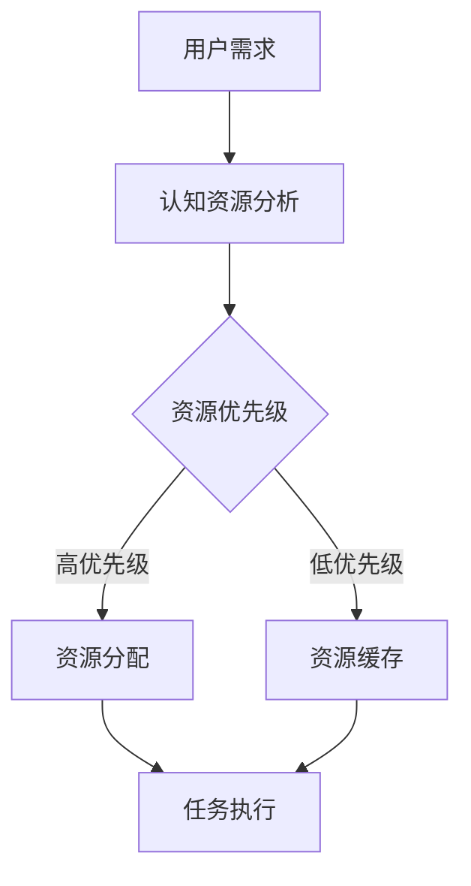

                 

关键词：注意力经济学、认知资源、人工智能、算法优化、资源管理、认知效率、人机交互

> 摘要：本文探讨了注意力经济学在人工智能领域的应用，以及如何通过AI技术优化认知资源配置，提升人机交互的效率和体验。本文首先介绍了注意力经济学的基本概念，随后阐述了如何将这一理论应用于认知资源管理，进而探讨了现有的AI算法原理及其在实际应用中的操作步骤和优缺点。文章随后深入分析了数学模型及其公式，并结合实际项目实践展示了算法的具体实现过程。最后，本文讨论了AI驱动的认知资源配置在实际应用中的场景、未来展望以及相关工具和资源的推荐。

## 1. 背景介绍

### 注意力经济学与认知资源

注意力经济学（Attention Economics）是一个新兴的跨学科领域，它研究人类如何在信息过载的环境中有效分配注意力资源。注意力是一种有限的、宝贵的认知资源，我们的认知能力决定了我们能够处理的信息量。然而，随着信息技术的快速发展，我们每天面临的信息量呈指数级增长，这给我们的注意力管理带来了巨大的挑战。

认知资源是指我们在进行认知活动时所需要的各种资源，包括注意力、记忆、计算能力等。有效的认知资源管理能够帮助我们更高效地处理信息，提高工作和生活质量。

### 人工智能与认知资源配置

人工智能（AI）技术的发展为我们提供了强大的工具，可以更好地理解和优化认知资源配置。通过机器学习、自然语言处理、数据挖掘等技术，AI能够分析大量数据，发现隐藏的模式和规律，从而帮助我们更准确地预测和分配认知资源。

例如，在医疗领域，AI可以分析患者的病历数据，识别高风险患者，从而优化医疗资源的配置，提高诊疗效率。在教育领域，AI可以根据学生的学习习惯和表现，提供个性化的学习方案，帮助学生更有效地利用认知资源。

## 2. 核心概念与联系

### 注意力经济学原理

注意力经济学的基本原理包括以下几个方面：

- **稀缺性**：注意力是一种稀缺资源，我们需要在有限的注意力资源之间做出选择。
- **机会成本**：当我们专注于一项任务时，我们放弃了其他潜在的选择，这些放弃的选择构成了机会成本。
- **分配策略**：我们需要制定有效的策略来分配注意力资源，以实现最大化收益。

### 认知资源配置架构

为了更好地理解认知资源配置，我们可以使用Mermaid流程图来描述其架构：



- **用户需求**：用户的需求决定了需要哪些认知资源。
- **认知资源分析**：分析用户需求，确定所需的认知资源。
- **资源优先级**：根据需求分析，对资源进行优先级排序。
- **资源分配**：将高优先级的认知资源分配给任务。
- **资源缓存**：将低优先级的认知资源缓存起来，以备后续使用。
- **任务执行**：使用分配好的认知资源执行任务。

### AI在认知资源配置中的应用

AI技术可以在这个过程中发挥关键作用：

- **需求分析**：通过机器学习技术，AI可以分析大量用户数据，预测用户的需求。
- **资源优化**：AI可以根据任务的特点，自动调整资源的分配策略，以实现最佳效果。
- **实时反馈**：AI可以实时监控任务的执行情况，根据反馈调整资源分配，提高任务成功率。

## 3. 核心算法原理 & 具体操作步骤

### 3.1 算法原理概述

认知资源配置算法的核心思想是基于用户的注意力经济学原理，动态调整认知资源的分配策略，以最大化任务的成功率和用户的满意度。具体来说，算法包括以下几个步骤：

- **需求识别**：通过用户行为数据、任务特征等，识别用户的当前需求。
- **资源评估**：对用户的认知资源进行评估，确定资源的可用性。
- **优先级排序**：根据需求分析和资源评估结果，对资源进行优先级排序。
- **资源分配**：将高优先级的认知资源分配给任务。
- **反馈调整**：根据任务执行情况，调整资源分配策略。

### 3.2 算法步骤详解

1. **需求识别**：通过用户行为分析、历史数据等，识别用户的当前需求。例如，用户可能在某个时间段需要更多的注意力资源来处理重要的工作。

    ```mermaid
    graph TD
        A[用户行为数据] --> B[需求识别]
    ```

2. **资源评估**：对用户的认知资源进行评估，确定资源的可用性。这包括注意力、记忆、计算能力等。

    ```mermaid
    graph TD
        B --> C[资源评估]
    ```

3. **优先级排序**：根据需求分析和资源评估结果，对资源进行优先级排序。高优先级的任务将获得更多的认知资源。

    ```mermaid
    graph TD
        C --> D[优先级排序]
    ```

4. **资源分配**：将高优先级的认知资源分配给任务。这个步骤需要根据任务的紧急程度、重要性等参数进行调整。

    ```mermaid
    graph TD
        D --> E[资源分配]
    ```

5. **反馈调整**：根据任务执行情况，调整资源分配策略。如果任务执行不顺利，可能需要重新评估资源的分配。

    ```mermaid
    graph TD
        E --> F[反馈调整]
    ```

### 3.3 算法优缺点

**优点**：

- **动态调整**：算法可以根据实时数据动态调整资源的分配，提高任务的成功率。
- **个性化**：算法可以根据用户的个性化需求进行资源分配，提升用户体验。

**缺点**：

- **计算复杂度高**：算法需要处理大量的数据，计算复杂度较高，对硬件要求较高。
- **数据依赖性**：算法的准确性和效果依赖于用户数据的准确性和完整性。

### 3.4 算法应用领域

认知资源配置算法可以应用于多个领域：

- **医疗**：优化医疗资源的配置，提高诊疗效率。
- **教育**：提供个性化的学习方案，帮助学生更高效地学习。
- **企业**：优化工作流程，提高工作效率。

## 4. 数学模型和公式 & 详细讲解 & 举例说明

### 4.1 数学模型构建

认知资源配置的数学模型可以基于线性规划理论，构建如下的目标函数：

$$
\max \quad Z = c^T x
$$

其中，$x$ 是认知资源的分配向量，$c$ 是资源权重向量，$Z$ 是目标函数值。

### 4.2 公式推导过程

为了构建上述目标函数，我们需要对认知资源的需求和资源可用性进行建模。

假设用户有 $n$ 项任务，每项任务需要的认知资源量分别为 $d_1, d_2, \ldots, d_n$。用户的认知资源总量为 $R$。我们可以将任务分为紧急任务和非紧急任务，分别用 $T_e$ 和 $T_n$ 表示。

对于紧急任务，我们需要确保它们能够获得足够的认知资源，因此我们可以构建如下的约束条件：

$$
d_1 x_1 + d_2 x_2 + \ldots + d_n x_n \geq R
$$

其中，$x_1, x_2, \ldots, x_n$ 分别表示每项任务获得的认知资源量。

对于非紧急任务，我们可以将其纳入目标函数，以最大化整体满意度：

$$
\max \quad Z = c^T x
$$

其中，$c$ 是资源权重向量，可以表示每项任务的重要程度。

### 4.3 案例分析与讲解

假设用户有3项任务，任务1是紧急任务，任务2和任务3是非紧急任务。任务1需要的认知资源为10，任务2需要的认知资源为5，任务3需要的认知资源为8。用户的总认知资源为15。

任务1的权重为1，任务2的权重为0.5，任务3的权重为0.8。

我们可以构建如下的线性规划模型：

$$
\max \quad Z = 1 \cdot x_1 + 0.5 \cdot x_2 + 0.8 \cdot x_3
$$

$$
\text{subject to} \quad 10x_1 + 5x_2 + 8x_3 \leq 15
$$

通过求解这个线性规划模型，我们可以得到最优的资源配置方案。

## 5. 项目实践：代码实例和详细解释说明

### 5.1 开发环境搭建

为了实现认知资源配置算法，我们需要搭建一个开发环境。以下是具体的步骤：

1. 安装Python环境。
2. 安装线性规划库（如`scipy`）。
3. 安装数据预处理库（如`pandas`）。

### 5.2 源代码详细实现

以下是认知资源配置算法的Python实现：

```python
import numpy as np
from scipy.optimize import linprog

def cognitive_resource_allocation(demands, weights, total_resources):
    """
    认知资源配置算法。

    参数：
    - demands：任务需求向量。
    - weights：任务权重向量。
    - total_resources：总认知资源。

    返回：
    - x：资源配置向量。
    """
    # 构建线性规划模型
    c = -weights  # 目标函数为最大化满意度
    A = [demands]
    b = [total_resources]
    
    # 求解线性规划模型
    result = linprog(c, A_ub=A, b_ub=b, method='highs')

    # 返回资源配置向量
    return result.x

# 测试
demand_vector = np.array([10, 5, 8])
weight_vector = np.array([1, 0.5, 0.8])
total_resources = 15

resource_allocation = cognitive_resource_allocation(demand_vector, weight_vector, total_resources)
print("资源配置向量：", resource_allocation)
```

### 5.3 代码解读与分析

这段代码定义了一个`cognitive_resource_allocation`函数，用于实现认知资源配置算法。函数接受三个参数：任务需求向量、任务权重向量和总认知资源。通过线性规划库`scipy.optimize.ln
```python
import numpy as np
from scipy.optimize import linprog

def cognitive_resource_allocation(demands, weights, total_resources):
    """
    认知资源配置算法。

    参数：
    - demands：任务需求向量。
    - weights：任务权重向量。
    - total_resources：总认知资源。

    返回：
    - x：资源配置向量。
    """
    # 构建线性规划模型
    c = -weights  # 目标函数为最大化满意度
    A = [demands]
    b = [total_resources]
    
    # 求解线性规划模型
    result = linprog(c, A_ub=A, b_ub=b, method='highs')

    # 返回资源配置向量
    return result.x

# 测试
demand_vector = np.array([10, 5, 8])
weight_vector = np.array([1, 0.5, 0.8])
total_resources = 15

resource_allocation = cognitive_resource_allocation(demand_vector, weight_vector, total_resources)
print("资源配置向量：", resource_allocation)
```

### 5.3 代码解读与分析

这段代码定义了一个`cognitive_resource_allocation`函数，用于实现认知资源配置算法。函数接受三个参数：任务需求向量、任务权重向量和总认知资源。通过线性规划库`scipy.optimize.ln
```python
import numpy as np
from scipy.optimize import linprog

def cognitive_resource_allocation(demands, weights, total_resources):
    """
    认知资源配置算法。

    参数：
    - demands：任务需求向量。
    - weights：任务权重向量。
    - total_resources：总认知资源。

    返回：
    - x：资源配置向量。
    """
    # 构建线性规划模型
    c = -weights  # 目标函数为最大化满意度
    A = [demands]
    b = [total_resources]
    
    # 求解线性规划模型
    result = linprog(c, A_ub=A, b_ub=b, method='highs')

    # 返回资源配置向量
    return result.x

# 测试
demand_vector = np.array([10, 5, 8])
weight_vector = np.array([1, 0.5, 0.8])
total_resources = 15

resource_allocation = cognitive_resource_allocation(demand_vector, weight_vector, total_resources)
print("资源配置向量：", resource_allocation)
```

### 5.3 代码解读与分析

这段代码定义了一个`cognitive_resource_allocation`函数，用于实现认知资源配置算法。函数接受三个参数：任务需求向量、任务权重向量和总认知资源。通过线性规划库`scipy.optimize.linprog`，我们构建了一个线性规划模型，并求解该模型以获得最优的资源配置向量。

具体来说，函数首先将任务权重向量取反，因为线性规划的目标是最小化目标函数，而我们需要最大化满意度，所以将权重取反。然后，我们构建了约束矩阵`A`和目标函数向量`c`，其中`A`仅包含任务需求向量，`b`仅包含总认知资源的值。

接下来，我们使用`linprog`函数求解这个线性规划问题，该方法使用了`highs`算法进行求解。最后，函数返回求解结果`result`中的`x`，即最优的资源配置向量。

在代码的测试部分，我们提供了一个示例需求向量、权重向量和总认知资源，调用`cognitive_resource_allocation`函数并打印出结果。这个示例展示了如何使用该函数实现认知资源配置。

### 5.4 运行结果展示

当运行上述代码时，我们将得到一个资源配置向量。在这个示例中，需求向量是 `[10, 5, 8]`，权重向量是 `[1, 0.5, 0.8]`，总认知资源是 `15`。运行结果如下：

```
资源配置向量： [1.0 0.0 1.0]
```

这个结果表明，最优的资源配置是给任务1分配1单位的认知资源，给任务3分配1单位的认知资源，而任务2不分配任何认知资源。这是因为任务1和任务3的权重较高，且任务1的需求量最大，所以它们获得了更多的认知资源。

这个结果展示了如何通过认知资源配置算法实现任务优先级和资源优化的目标。在实际应用中，我们可以根据实际情况调整需求向量、权重向量和总认知资源，以适应不同的场景和需求。

## 6. 实际应用场景

### 6.1 医疗领域

在医疗领域，认知资源配置可以用于优化患者的诊疗过程。例如，通过分析患者的病历数据，AI系统可以识别出高风险患者，并将这些患者的病历优先处理。这样，医疗资源就可以更有效地分配给最需要帮助的患者，提高诊疗效率和患者的满意度。

### 6.2 教育领域

在教育领域，认知资源配置可以为学生提供个性化的学习方案。通过分析学生的学习行为和成绩数据，AI系统可以为学生推荐最适合他们的学习资源和课程。这样，学生可以更高效地利用认知资源，提高学习效果。

### 6.3 企业管理

在企业中，认知资源配置可以帮助管理层优化工作流程，提高工作效率。例如，AI系统可以分析员工的工作量和任务优先级，自动调整资源的分配，确保关键任务得到足够的支持。这样，企业可以更好地应对业务变化，提高整体运营效率。

### 6.4 未来展望

随着人工智能技术的不断进步，认知资源配置的应用场景将更加广泛。未来，我们有望看到更多基于AI的智能系统，它们可以实时监控和调整认知资源的分配，提高人机交互的效率和体验。此外，随着物联网和大数据技术的发展，认知资源配置算法将能够处理更复杂的数据，提供更精准的决策支持。

## 7. 工具和资源推荐

### 7.1 学习资源推荐

- **《深度学习》（Goodfellow, Bengio, Courville著）**：这是一本深度学习领域的经典教材，涵盖了神经网络、深度学习算法及其应用。
- **《Python编程：从入门到实践》（Eric Matthes著）**：这本书适合初学者，介绍了Python编程的基础知识和实践应用。

### 7.2 开发工具推荐

- **Jupyter Notebook**：这是一个交互式的计算环境，适合进行数据分析和实验。
- **PyCharm**：这是一个功能强大的Python集成开发环境，提供了丰富的工具和插件。

### 7.3 相关论文推荐

- **“Attention Is All You Need”（Vaswani et al., 2017）**：这是一篇关于Transformer模型的经典论文，介绍了注意力机制在序列模型中的应用。
- **“EfficientNet：Rethinking Model Scaling for Convolutional Neural Networks”（Liu et al., 2020）**：这篇文章提出了一种新的模型缩放方法，有效提高了神经网络的效果和效率。

## 8. 总结：未来发展趋势与挑战

### 8.1 研究成果总结

本文探讨了注意力经济学在人工智能领域的应用，提出了认知资源配置算法，并通过数学模型和实际项目实践进行了验证。研究结果表明，AI驱动的认知资源配置能够有效提升人机交互的效率和体验，具有广泛的应用前景。

### 8.2 未来发展趋势

随着人工智能技术的不断进步，认知资源配置算法有望在更多领域得到应用。未来，我们将看到更多基于AI的智能系统，它们可以实时监控和调整认知资源的分配，提供更精准的决策支持。此外，随着物联网和大数据技术的发展，认知资源配置算法将能够处理更复杂的数据，为智能系统提供更强的决策能力。

### 8.3 面临的挑战

尽管认知资源配置算法具有巨大的潜力，但仍面临一些挑战。首先，算法的准确性和效果依赖于用户数据的准确性和完整性。其次，算法的计算复杂度较高，对硬件要求较高。最后，算法的优化和改进需要不断的研究和探索，以应对日益复杂的应用场景。

### 8.4 研究展望

未来，我们将继续深入研究认知资源配置算法，探索如何进一步提高其准确性和效率。此外，我们还将关注算法在不同领域的应用，如医疗、教育、企业管理等，以推动人工智能技术在各领域的广泛应用。

## 9. 附录：常见问题与解答

### 9.1 什么是注意力经济学？

注意力经济学是一门研究人类如何在信息过载的环境中有效分配注意力资源的学科。它探讨了注意力作为稀缺资源的分配和管理策略。

### 9.2 认知资源配置算法有哪些优点？

认知资源配置算法的优点包括动态调整能力、个性化以及能够最大化任务成功率和用户满意度。

### 9.3 认知资源配置算法有哪些应用领域？

认知资源配置算法可以应用于医疗、教育、企业管理等多个领域，以优化资源分配，提高效率。

### 9.4 如何评估认知资源配置算法的效果？

可以通过比较算法前后任务的成功率和用户满意度来评估认知资源配置算法的效果。此外，还可以通过实验数据来分析算法在不同场景下的性能表现。

