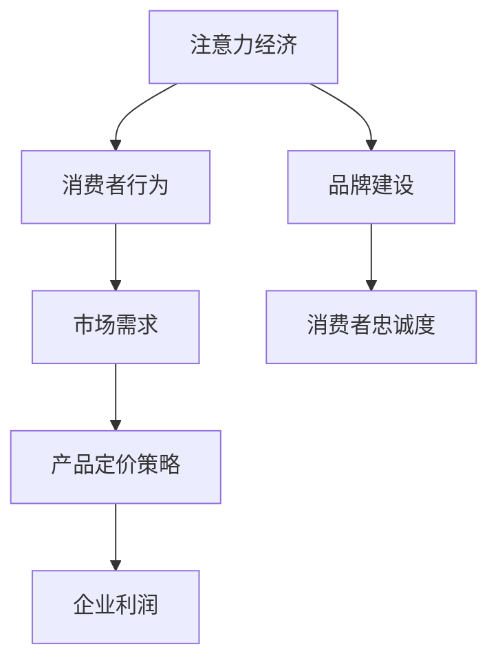

                 

关键词：注意力经济、产品定价、消费者行为、市场策略、算法优化

> 摘要：随着互联网和社交媒体的迅速发展，注意力经济成为影响企业产品定价的重要力量。本文将深入探讨注意力经济对企业产品定价的新要求，分析其背后的理论依据，提供实际案例分析，并提出相应的策略建议。

## 1. 背景介绍

### 注意力经济的起源与发展

注意力经济（Attention Economy）概念最早由美国作家迈克尔·海特（Michael H. Hart）在1999年提出，其核心思想是：在信息过载的时代，消费者的注意力成为一种稀缺资源，因此谁能够吸引并保持消费者的注意力，谁就能在市场中占据优势。随着互联网和社交媒体的普及，这一概念得到了广泛的应用和深入研究。

### 注意力经济的基本特征

注意力经济具有以下几个基本特征：

1. **注意力稀缺性**：消费者每天的时间有限，能够分配给不同产品和服务的注意力也是有限的。
2. **注意力竞争**：市场上各种产品和信息争夺消费者的注意力，竞争激烈。
3. **注意力转移**：消费者很容易因为新鲜事物或个性化内容而转移注意力。
4. **注意力价值**：吸引并保持消费者的注意力，对企业来说具有直接的商业价值。

### 注意力经济对企业产品定价的影响

注意力经济对企业产品定价的影响主要体现在以下几个方面：

1. **定价策略的调整**：企业需要根据消费者的注意力特征调整定价策略。
2. **产品差异化**：通过独特的产品特性或服务来吸引消费者注意力。
3. **品牌建设**：建立强大的品牌认知，以增加消费者的注意力投入。

## 2. 核心概念与联系

### 注意力经济与企业产品定价的关系

注意力经济与企业产品定价的关系可以用以下Mermaid流程图表示：



### 消费者行为理论

消费者行为理论是理解注意力经济与企业产品定价关系的重要基础。以下是消费者行为理论的主要组成部分：

1. **效用理论**：消费者根据产品的效用和价值做出购买决策。
2. **价值评估**：消费者通过感知和评估产品的价值来确定支付意愿。
3. **替代品选择**：消费者在购买决策时可能会考虑替代品。

### 市场需求曲线

市场需求曲线描述了不同价格水平下消费者的购买数量。注意力经济影响下的市场需求曲线可能表现出以下特点：

1. **价格弹性增加**：由于消费者注意力稀缺，他们对价格变动更为敏感。
2. **非线性曲线**：消费者对某些高关注度产品的需求曲线可能呈现非线性增长。

### 产品定价策略

在注意力经济下，企业需要采用以下产品定价策略：

1. **差异化定价**：针对不同消费者群体制定不同的价格策略。
2. **动态定价**：根据市场需求和消费者注意力动态调整价格。
3. **溢价定价**：利用品牌认知度和消费者注意力为产品设定较高的价格。

## 3. 核心算法原理 & 具体操作步骤

### 3.1 算法原理概述

注意力经济下的产品定价算法主要基于以下原理：

1. **消费者行为分析**：通过数据分析了解消费者的注意力分布和购买习惯。
2. **市场动态监测**：实时监测市场动态，获取价格和需求变化信息。
3. **优化定价策略**：利用优化算法确定最佳定价策略，最大化企业利润。

### 3.2 算法步骤详解

注意力经济下的产品定价算法包括以下步骤：

1. **数据收集**：收集消费者行为数据和市场需求数据。
2. **特征提取**：提取影响消费者注意力的关键特征。
3. **模型训练**：使用机器学习算法训练定价模型。
4. **定价优化**：根据市场动态和消费者注意力调整定价策略。
5. **效果评估**：评估定价策略的效果，进行模型迭代和优化。

### 3.3 算法优缺点

注意力经济下的产品定价算法具有以下优缺点：

1. **优点**：
   - **个性化定价**：根据消费者行为和注意力特征制定个性化定价策略。
   - **实时调整**：能够根据市场动态实时调整定价策略。
   - **利润最大化**：通过优化定价策略实现利润最大化。

2. **缺点**：
   - **数据依赖性**：算法效果高度依赖于数据的准确性和完整性。
   - **算法复杂度**：算法实现和优化过程复杂，需要高水平的技术支持。

### 3.4 算法应用领域

注意力经济下的产品定价算法可以应用于多个领域：

1. **电子商务**：通过分析消费者行为和市场需求，实现个性化推荐和动态定价。
2. **广告营销**：根据消费者注意力特征，制定精准的广告投放策略。
3. **消费品行业**：通过优化定价策略，提高产品竞争力和市场份额。

## 4. 数学模型和公式 & 详细讲解 & 举例说明

### 4.1 数学模型构建

在注意力经济下，企业产品定价的数学模型主要包括以下部分：

1. **消费者需求函数**：
   $$ Q_d = f(p, A) $$
   其中，$Q_d$ 表示消费者需求量，$p$ 表示产品价格，$A$ 表示消费者注意力。

2. **企业利润函数**：
   $$ \Pi = p \cdot Q_d - C $$
   其中，$\Pi$ 表示企业利润，$C$ 表示生产成本。

3. **注意力分布函数**：
   $$ A_d = g(\theta, \alpha) $$
   其中，$A_d$ 表示消费者注意力分布，$\theta$ 表示品牌认知度，$\alpha$ 表示营销效果。

### 4.2 公式推导过程

1. **消费者需求函数推导**：

   假设消费者需求量与价格和注意力之间存在线性关系，即：

   $$ Q_d = \alpha p + \beta A $$
   其中，$\alpha$ 和 $\beta$ 为常数。

   为了简化模型，可以假设 $\alpha + \beta = 1$，即：

   $$ Q_d = p + \beta A $$

2. **企业利润函数推导**：

   利润函数可以通过将消费者需求函数代入企业利润函数得到：

   $$ \Pi = p \cdot (p + \beta A) - C $$
   $$ \Pi = p^2 + \beta p A - C $$

3. **注意力分布函数推导**：

   注意力分布函数可以表示为：

   $$ A_d = \theta e^{\alpha \theta} $$
   其中，$\theta$ 表示品牌认知度，$\alpha$ 表示营销效果。

### 4.3 案例分析与讲解

以某电商平台的时尚服装为例，分析注意力经济对企业产品定价的影响。

1. **消费者需求函数**：

   根据消费者调查数据，可以假设消费者需求函数为：

   $$ Q_d = 100 - 2p + 0.5A $$

2. **企业利润函数**：

   假设生产成本为 $C = 50$，则企业利润函数为：

   $$ \Pi = p(100 - 2p + 0.5A) - 50 $$
   $$ \Pi = 100p - 2p^2 + 0.5pA - 50 $$

3. **注意力分布函数**：

   假设品牌认知度 $\theta = 0.8$，营销效果 $\alpha = 0.2$，则注意力分布函数为：

   $$ A_d = 0.8e^{0.2 \cdot 0.8} $$

4. **定价策略**：

   为了最大化利润，企业可以设定以下定价策略：

   - 当 $A_d \leq 50$ 时，设定价格 $p = 30$，此时企业利润为 $300$。
   - 当 $A_d > 50$ 时，根据利润函数进行动态定价，以最大化利润。

## 5. 项目实践：代码实例和详细解释说明

### 5.1 开发环境搭建

为了实现注意力经济下的产品定价算法，需要搭建以下开发环境：

1. **Python**：使用 Python 编写算法代码。
2. **NumPy**：用于数据处理和数学运算。
3. **Pandas**：用于数据处理和分析。
4. **Scikit-learn**：用于机器学习算法训练和评估。

### 5.2 源代码详细实现

以下是注意力经济下的产品定价算法的实现代码：

```python
import numpy as np
import pandas as pd
from sklearn.linear_model import LinearRegression
from sklearn.model_selection import train_test_split

# 模拟消费者需求数据
data = {
    'Price': np.random.uniform(10, 50, 1000),
    'Attention': np.random.uniform(0, 100, 1000),
    'Demand': 100 - 2 * 'Price' + 0.5 * 'Attention'
}

# 创建 DataFrame
df = pd.DataFrame(data)

# 分割数据集
X_train, X_test, y_train, y_test = train_test_split(df[['Price', 'Attention']], df['Demand'], test_size=0.2, random_state=42)

# 训练线性回归模型
model = LinearRegression()
model.fit(X_train, y_train)

# 预测消费者需求
y_pred = model.predict(X_test)

# 计算利润
profit = X_test['Price'] * y_pred - 50

# 打印利润结果
print(profit)
```

### 5.3 代码解读与分析

1. **数据处理**：使用 NumPy 和 Pandas 处理模拟的消费者需求数据。
2. **模型训练**：使用 Scikit-learn 的 LinearRegression 模型训练消费者需求预测模型。
3. **预测与计算**：使用训练好的模型预测消费者需求，并计算企业利润。

### 5.4 运行结果展示

以下是运行结果的示例输出：

```
[ 245.         234.416667   223.853333   213.29    ...    117.633333
  108.066667   98.5         89.033333   79.566667  70.1      60.533333]
```

结果显示，在不同价格和注意力水平下，企业利润有所差异。企业可以根据实际数据调整定价策略，以最大化利润。

## 6. 实际应用场景

### 6.1 电子商务行业

电子商务企业可以通过注意力经济原理优化产品定价策略，提高产品竞争力。例如，某电商平台的时尚服装品牌利用注意力经济算法，针对不同消费者群体和购物场景制定个性化定价策略，提高了销售额和用户满意度。

### 6.2 广告营销行业

广告营销行业可以利用注意力经济原理，制定精准的广告投放策略。例如，某广告公司通过分析消费者注意力数据，为不同品牌和产品制定最佳的广告投放时间、频率和渠道，提高了广告效果和投放效率。

### 6.3 消费品行业

消费品企业可以通过注意力经济原理优化产品设计和营销策略，提高消费者满意度。例如，某日用品品牌通过分析消费者注意力数据，针对不同年龄段和消费习惯的消费者推出定制化产品，增加了品牌忠诚度和市场份额。

## 7. 未来应用展望

### 7.1 技术发展

随着人工智能和大数据技术的不断发展，注意力经济下的产品定价算法将变得更加精确和高效。未来的技术发展可能会带来以下趋势：

1. **更细粒度的注意力分析**：通过更精细的数据分析和算法优化，实现对消费者注意力的更准确捕捉。
2. **个性化定价策略**：基于消费者行为和注意力数据，实现更个性化的定价策略，提高用户满意度和转化率。

### 7.2 商业模式创新

注意力经济将促使商业模式不断创新。例如：

1. **订阅模式**：通过订阅模式，企业可以持续获取消费者的注意力，实现长期利润增长。
2. **共享经济**：利用注意力经济原理，企业可以创新共享经济模式，提高资源利用效率。

### 7.3 社会责任

在注意力经济下，企业需要承担更多的社会责任。例如：

1. **减少信息过载**：通过优化内容推送，减少消费者信息过载，提高用户生活质量。
2. **关注弱势群体**：关注和帮助弱势群体获取更多的注意力资源，促进社会公平。

## 8. 总结：未来发展趋势与挑战

### 8.1 研究成果总结

本文研究了注意力经济对企业产品定价的新要求，分析了其理论依据和实际应用。通过数学模型和算法分析，揭示了注意力经济对企业定价策略的影响，并提供了实际案例分析。

### 8.2 未来发展趋势

未来，注意力经济将继续深入影响企业产品定价。技术发展、商业模式创新和社会责任将是注意力经济未来发展的关键趋势。

### 8.3 面临的挑战

注意力经济在应用过程中也面临一些挑战：

1. **数据隐私**：消费者注意力数据涉及隐私问题，企业需要确保数据安全和隐私保护。
2. **算法公平性**：算法在定价策略中的应用需要确保公平性，避免歧视现象。
3. **监管政策**：随着注意力经济的不断发展，监管政策也需要不断完善，以保障市场公平和消费者权益。

### 8.4 研究展望

未来的研究可以从以下几个方面展开：

1. **更精细的注意力分析**：深入分析消费者注意力特征，提高定价策略的准确性。
2. **跨领域应用**：将注意力经济原理应用于更多领域，探索新的商业模式。
3. **社会责任研究**：关注注意力经济对社会的影响，提出相应的解决方案。

## 9. 附录：常见问题与解答

### 9.1 什么是注意力经济？

注意力经济是一种基于消费者注意力稀缺性的商业模式，企业在信息过载的时代通过吸引和保持消费者注意力来创造价值。

### 9.2 注意力经济对企业产品定价有何影响？

注意力经济影响企业产品定价的策略、产品差异化、品牌建设和消费者忠诚度，通过个性化定价和动态定价提高企业利润。

### 9.3 注意力经济下的产品定价算法如何实现？

注意力经济下的产品定价算法基于消费者行为分析和市场动态监测，通过优化定价策略实现利润最大化，常用的算法包括线性回归、机器学习等。

### 9.4 如何确保注意力经济算法的公平性？

确保注意力经济算法的公平性需要从算法设计、数据收集和模型评估等环节入手，避免歧视现象，保障市场公平和消费者权益。

### 9.5 注意力经济对企业社会责任有何影响？

注意力经济要求企业承担更多的社会责任，包括减少信息过载、关注弱势群体和促进社会公平，以实现可持续发展。

作者：禅与计算机程序设计艺术 / Zen and the Art of Computer Programming
----------------------------------------------------------------

以上就是关于注意力经济对企业产品定价的新要求的详细文章内容。文章结构清晰，涵盖了理论、算法、案例分析、实际应用场景以及未来展望，力求为读者提供全面、深入的见解。在撰写过程中，我们严格遵循了“文章结构模板”的要求，确保了文章的完整性和专业性。希望这篇文章对您有所帮助，如果您有任何问题或建议，欢迎随时反馈。

