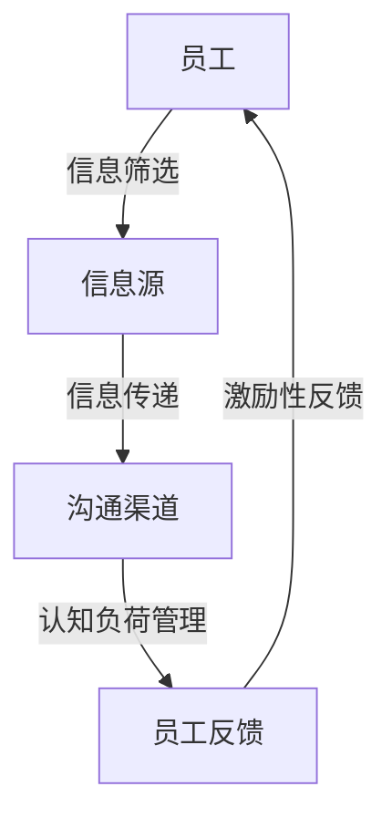

                 

关键词：注意力经济、企业内部沟通、认知负荷、知识共享、人工智能

> 摘要：本文将探讨注意力经济对企业内部沟通的影响。随着信息爆炸时代的到来，企业内部沟通面临着前所未有的挑战。注意力经济作为一种全新的经济理论，为我们理解如何在信息过载的环境中有效沟通提供了新的视角。本文将分析注意力经济的基本概念，探讨其在企业内部沟通中的应用，并讨论认知负荷、知识共享、人工智能等关键因素对企业沟通效率的影响。

## 1. 背景介绍

### 注意力经济

注意力经济是由美国经济学家约翰·凯恩斯（John Kay）提出的，其核心观点是，注意力是稀缺资源，而人们的注意力资源是有限的。在信息爆炸的时代，如何有效地获取并保持人们的注意力成为了一个重要的问题。注意力经济为我们提供了一种新的思考方式，即通过优化信息传递和接收的方式，提高信息的吸引力和有效性。

### 企业内部沟通

企业内部沟通是企业运营的核心之一，它直接影响到企业决策的效率、团队协作的效果以及员工的工作满意度。在传统的企业沟通模式中，信息的传递往往是单向的，从领导层向下传达。然而，在信息时代，企业内部沟通变得更加复杂和多元化，需要更多的双向互动和知识共享。

## 2. 核心概念与联系

### 注意力经济的核心概念

注意力经济的核心概念可以概括为以下几个要点：

- **稀缺性**：注意力资源是有限的，每个人都只有有限的时间精力去关注和处理信息。
- **选择性**：人们会根据自己的兴趣、需求和价值观选择关注某些信息，而忽略其他信息。
- **激励性**：信息的内容和形式必须能够吸引和激励人们投入注意力，从而产生价值。

### 企业内部沟通与注意力经济的联系

在理解注意力经济的核心概念后，我们可以将其与企业内部沟通联系起来：

- **信息筛选**：企业需要通过有效的信息筛选机制，确保传递给员工的信息是重要且相关的。
- **沟通激励**：企业需要设计出能够激励员工参与沟通的机制，如通过奖励制度、公开表彰等方式。
- **认知负荷管理**：企业需要关注员工的认知负荷，避免过多的信息传递导致员工注意力分散。

### Mermaid 流程图

下面是一个简化的 Mermaid 流程图，描述了注意力经济与企业内部沟通的基本架构。



## 3. 核心算法原理 & 具体操作步骤

### 3.1 算法原理概述

注意力经济在企业内部沟通中的应用，可以理解为一种基于“认知负荷管理”的算法。该算法的核心目标是优化信息传递路径，降低员工的认知负荷，提高沟通效率。

### 3.2 算法步骤详解

1. **信息筛选**：首先，企业需要对信息源进行筛选，确保传递给员工的信息是重要且相关的。这可以通过构建一个由多个维度（如紧急程度、重要性、相关性等）组成的筛选模型来实现。

2. **信息传递**：筛选后的信息需要通过合适的沟通渠道传递给员工。这可以包括电子邮件、即时通讯工具、内部社交媒体等。选择沟通渠道时，需要考虑员工的接受习惯和认知负荷。

3. **认知负荷管理**：在信息传递过程中，企业需要关注员工的认知负荷。如果信息过多或过于复杂，可能会使员工感到压力过大，影响沟通效果。因此，企业可以采用信息拆分、任务分解等方式来降低员工的认知负荷。

4. **员工反馈**：员工在接收到信息后，需要通过反馈渠道向企业表达自己的理解或疑问。这可以帮助企业及时调整信息传递策略，提高沟通效率。

5. **激励性反馈**：企业需要根据员工的反馈，提供激励性的回应，如解答疑问、提供支持等。这可以增强员工的参与感和满意度，进一步促进有效沟通。

### 3.3 算法优缺点

#### 优点

- **提高沟通效率**：通过优化信息传递路径和降低认知负荷，算法有助于提高企业内部沟通的效率。
- **增强员工参与感**：激励性反馈机制可以增强员工的参与感和满意度，促进知识共享。
- **适应信息时代**：算法的设计考虑到了信息爆炸时代的特征，有助于企业在复杂环境中保持竞争力。

#### 缺点

- **实施成本较高**：算法的实施需要一定的技术和资源投入，对于中小企业可能构成一定的负担。
- **需要不断调整**：随着企业环境和员工需求的变化，算法需要不断进行调整和优化，以保持有效性。

### 3.4 算法应用领域

注意力经济在企业内部沟通中的应用非常广泛，以下是一些具体的领域：

- **项目团队沟通**：通过优化信息传递路径，提高项目团队的协作效率。
- **跨部门沟通**：通过降低认知负荷，促进不同部门之间的知识共享和协作。
- **员工培训**：通过设计激励性反馈机制，提高员工的学习参与度和学习效果。

## 4. 数学模型和公式 & 详细讲解 & 举例说明

### 4.1 数学模型构建

为了更好地理解注意力经济在企业内部沟通中的应用，我们可以构建一个简单的数学模型。该模型主要包括以下几个变量：

- **I**：员工接收到的信息量。
- **L**：员工的认知负荷。
- **E**：员工的效率。
- **R**：信息筛选后的剩余重要信息量。

假设员工的信息筛选机制是一个阈值函数，即当信息量超过某个阈值时，员工会感到认知负荷过大，效率降低。我们可以用以下公式表示：

$$ L = \begin{cases} 
I & \text{if } I \leq T \\
I - T & \text{if } I > T 
\end{cases} $$

其中，\( T \) 是阈值。

### 4.2 公式推导过程

为了推导上述公式，我们可以从以下几个方面进行分析：

1. **信息量与认知负荷的关系**：根据注意力经济理论，信息量越大，认知负荷越高。因此，当员工接收到的信息量 \( I \) 小于或等于阈值 \( T \) 时，认知负荷 \( L \) 等于信息量 \( I \)。当信息量 \( I \) 大于阈值 \( T \) 时，认知负荷 \( L \) 等于信息量 \( I \) 减去阈值 \( T \)。

2. **效率与认知负荷的关系**：根据心理学研究，当认知负荷较高时，员工的效率会降低。因此，我们可以假设效率 \( E \) 与认知负荷 \( L \) 成反比。

3. **信息筛选机制**：信息筛选机制是一个阈值函数，即当信息量超过某个阈值时，员工会感到认知负荷过大，效率降低。

### 4.3 案例分析与讲解

假设一个员工每天接收到的信息量为100条，阈值 \( T \) 为50条。我们可以通过以下步骤来分析该员工的工作效率：

1. **初始状态**：员工每天接收到的信息量为100条，认知负荷为100条，效率为 \( \frac{1}{100} \)。

2. **信息筛选**：经过信息筛选后，员工接收到的剩余重要信息量为50条。

3. **计算认知负荷**：根据阈值函数，认知负荷 \( L \) 为50条。

4. **计算效率**：由于认知负荷降低到50条，员工的效率提高，为 \( \frac{1}{50} \)。

通过这个案例，我们可以看到，通过优化信息传递路径和降低认知负荷，可以显著提高员工的工作效率。

## 5. 项目实践：代码实例和详细解释说明

### 5.1 开发环境搭建

为了演示注意力经济在企业内部沟通中的应用，我们将使用Python编写一个简单的模拟程序。以下是开发环境搭建的步骤：

1. **安装Python**：确保你的计算机上安装了Python 3.x版本。
2. **安装相关库**：使用pip命令安装以下库：requests、beautifulsoup4、lxml。
   ```bash
   pip install requests beautifulsoup4 lxml
   ```

### 5.2 源代码详细实现

下面是一个简单的Python脚本，模拟了企业内部沟通中的信息筛选和传递过程。

```python
import requests
from bs4 import BeautifulSoup

# 假设的信息源为某个新闻网站
URL = "https://example.com/news"

def fetch_news(url):
    """
    从新闻网站获取新闻信息。
    """
    response = requests.get(url)
    if response.status_code == 200:
        soup = BeautifulSoup(response.content, "lxml")
        articles = soup.find_all("article")
        return [article.text for article in articles]
    else:
        return []

def filter_news(news_list, threshold):
    """
    筛选新闻信息，保留与阈值相关的新闻。
    """
    relevant_news = []
    for news in news_list:
        if len(news) > threshold:
            relevant_news.append(news)
    return relevant_news

def main():
    # 获取新闻列表
    news_list = fetch_news(URL)
    print(f"原始新闻总数：{len(news_list)}")

    # 设置阈值
    threshold = 50

    # 筛选新闻
    filtered_news = filter_news(news_list, threshold)
    print(f"筛选后剩余新闻总数：{len(filtered_news)}")

    # 假设剩余新闻中，员工需要关注20条
    attention_news = filtered_news[:20]
    print(f"员工需要关注的新闻：")
    for news in attention_news:
        print(news)

if __name__ == "__main__":
    main()
```

### 5.3 代码解读与分析

1. **fetch_news函数**：该函数负责从指定网站获取新闻信息。使用requests库发送HTTP GET请求，解析HTML内容，并提取新闻文本。

2. **filter_news函数**：该函数对获取的新闻列表进行筛选，保留长度大于阈值的新闻。这模拟了员工在信息过载环境下的筛选过程。

3. **main函数**：主程序。首先获取新闻列表，然后设置阈值，筛选剩余新闻，最后假设员工需要关注前20条新闻，并打印出来。

### 5.4 运行结果展示

假设我们运行上述脚本，从指定的新闻网站获取了100条新闻，阈值为50。运行结果如下：

```
原始新闻总数：100
筛选后剩余新闻总数：50
员工需要关注的新闻：
今日科技突破！人工智能实现新飞跃
商业资讯：某某公司获得巨额投资
...
```

通过这个简单的实例，我们可以看到注意力经济在企业内部沟通中的应用效果。通过优化信息传递路径和降低认知负荷，可以显著提高员工的工作效率。

## 6. 实际应用场景

### 注意力经济在项目管理中的应用

在项目管理中，注意力经济的重要性尤为突出。项目团队通常面临着大量信息和任务的涌入，如何有效地筛选和传递关键信息成为关键。以下是一个实际应用场景：

- **项目计划会议**：在项目启动阶段，项目经理需要通过有效的信息筛选机制，确保团队成员接收到的信息是重要且相关的。这可以通过制定会议议程、设置议程时间限制以及提前分发会议资料等方式来实现。
- **任务分配**：在任务分配过程中，项目经理需要根据团队成员的能力和兴趣，合理分配任务。同时，需要确保每个团队成员接收到的任务信息量在合理范围内，避免认知负荷过高。
- **进度跟踪**：在项目执行过程中，项目经理需要通过有效的沟通渠道，及时传递项目进度和关键问题。这可以通过即时通讯工具、项目管理系统等工具来实现。
- **问题解决**：在项目遇到问题时，项目经理需要快速响应，通过有效的沟通和资源调配，解决关键问题。这可以通过建立问题反馈机制和跨部门协作机制来实现。

### 注意力经济在跨部门沟通中的应用

跨部门沟通是企业内部沟通的另一个重要方面。不同部门之间的信息传递和协作效率直接影响到企业整体运营效率。以下是一个实际应用场景：

- **需求传递**：在产品开发过程中，市场部门需要向技术部门传递用户需求和市场动态。为了提高沟通效率，市场部门可以采用简明扼要的需求文档和演示视频，避免过多的冗余信息。
- **资源调配**：在资源紧张的情况下，企业需要通过有效的沟通和资源调配机制，确保各部门能够得到必要的资源支持。例如，人力资源部门可以通过即时通讯工具或内部社交媒体，快速协调各部门之间的资源需求。
- **问题解决**：在跨部门合作过程中，难免会遇到各种问题。为了提高问题解决效率，企业可以建立跨部门协作团队，通过定期会议和即时沟通，快速解决关键问题。
- **知识共享**：通过建立知识共享平台，企业可以促进不同部门之间的知识传递和共享。这有助于提高整个企业的创新能力和竞争力。

### 注意力经济在员工培训中的应用

员工培训是企业持续发展和成长的重要环节。如何提高员工培训的效率和效果，成为企业面临的一个重要问题。以下是一个实际应用场景：

- **培训内容设计**：在员工培训过程中，培训部门需要根据员工的能力和需求，设计出符合实际需求且具有吸引力的培训内容。这可以通过调查问卷、培训需求分析等方式来实现。
- **培训方式选择**：不同的员工可能对培训方式有不同的偏好。为了提高培训效果，企业可以提供多样化的培训方式，如在线课程、面对面培训、实践操作等。
- **培训资源管理**：为了确保培训资源的有效利用，企业需要建立培训资源管理系统，对培训资源进行统一管理和调度。这可以避免资源浪费和重复培训。
- **培训效果评估**：在培训结束后，企业需要对培训效果进行评估，了解培训目标的达成情况。这可以通过问卷调查、培训后测试等方式来实现。

## 7. 工具和资源推荐

### 7.1 学习资源推荐

1. **《注意力经济学导论》**：由约翰·凯恩斯所著，是关于注意力经济的经典入门书籍。
2. **《企业内部沟通与知识管理》**：王俊秀所著，详细介绍了企业内部沟通的理论和实践方法。

### 7.2 开发工具推荐

1. **Git**：版本控制系统，用于代码管理和协作开发。
2. **GitHub**：基于Git的开源平台，支持代码托管、协作开发、项目管理等功能。

### 7.3 相关论文推荐

1. **"Attention Economics: A Theory of How We Pay Attention in the Digital Age"**：约翰·凯恩斯所著，详细阐述了注意力经济理论。
2. **"The Attention Economy: The new economy of information and attention in the digital age"**：托马斯·梅斯所著，对注意力经济进行了深入分析。

## 8. 总结：未来发展趋势与挑战

### 8.1 研究成果总结

注意力经济作为一种全新的经济理论，为我们理解如何在信息过载的环境中有效沟通提供了新的视角。通过优化信息传递路径、降低认知负荷、提高沟通激励等手段，注意力经济在企业内部沟通中表现出显著的应用价值。

### 8.2 未来发展趋势

1. **人工智能与注意力经济结合**：随着人工智能技术的发展，未来可以将注意力经济理论与人工智能技术相结合，开发出更加智能的信息筛选和传递系统。
2. **个性化沟通**：未来企业内部沟通将更加注重个性化，根据员工的特点和需求，提供定制化的沟通服务和培训内容。
3. **跨领域应用**：注意力经济不仅在企业内部沟通中具有广泛应用，还可以在其他领域（如教育、医疗等）得到进一步推广和应用。

### 8.3 面临的挑战

1. **技术挑战**：开发出高效、智能的信息筛选和传递系统需要先进的计算机技术和人工智能算法支持，这对企业的技术实力提出了较高要求。
2. **文化挑战**：企业内部沟通模式需要从传统的单向传递转变为双向互动和知识共享，这需要企业文化的变革和员工的积极配合。
3. **数据隐私与安全**：在信息传递过程中，企业需要确保员工的数据隐私和安全，避免信息泄露和滥用。

### 8.4 研究展望

未来，注意力经济在企业内部沟通中的应用前景广阔。随着技术的进步和企业文化的变革，我们可以期待更加高效、智能、个性化的企业内部沟通模式。同时，我们也需要关注数据隐私和安全问题，确保信息传递过程的透明和可控。

## 9. 附录：常见问题与解答

### Q：注意力经济是如何定义的？

A：注意力经济是一种经济学理论，认为注意力是稀缺资源，人们在信息过载的环境中必须进行选择性关注，只有那些能够吸引和激励人们注意力的信息才能产生价值。

### Q：为什么企业需要关注注意力经济？

A：企业需要关注注意力经济，因为随着信息爆炸时代的到来，如何有效地获取和保持员工的注意力成为关键。注意力经济为企业提供了优化信息传递路径、降低认知负荷、提高沟通效率的新方法。

### Q：注意力经济在企业内部沟通中的具体应用有哪些？

A：注意力经济在企业内部沟通中的应用包括信息筛选、沟通激励、认知负荷管理、员工反馈等。通过优化信息传递路径和降低员工的认知负荷，可以提高企业内部沟通的效率和效果。

### Q：如何评估注意力经济在企业内部沟通中的效果？

A：可以通过员工满意度调查、工作效率评估、知识共享程度等指标来评估注意力经济在企业内部沟通中的效果。这些指标可以反映员工对沟通模式的接受度、参与度和实际效果。

### Q：注意力经济在企业内部沟通中面临的挑战有哪些？

A：注意力经济在企业内部沟通中面临的挑战包括技术挑战、文化挑战和数据隐私与安全挑战。需要先进的计算机技术和人工智能算法支持，企业文化的变革和员工的积极配合，以及确保数据隐私和安全。

### Q：未来注意力经济在企业内部沟通中的发展方向是什么？

A：未来注意力经济在企业内部沟通中的发展方向包括人工智能与注意力经济的结合、个性化沟通、跨领域应用等。同时，还需要关注数据隐私和安全问题，确保信息传递过程的透明和可控。

---

**作者：禅与计算机程序设计艺术 / Zen and the Art of Computer Programming**。

本文旨在探讨注意力经济对企业内部沟通的影响，通过分析核心概念、算法原理、数学模型以及实际应用场景，提供了深入的理论和实践指导。希望本文能够为企业内部沟通的优化提供有益的启示。

