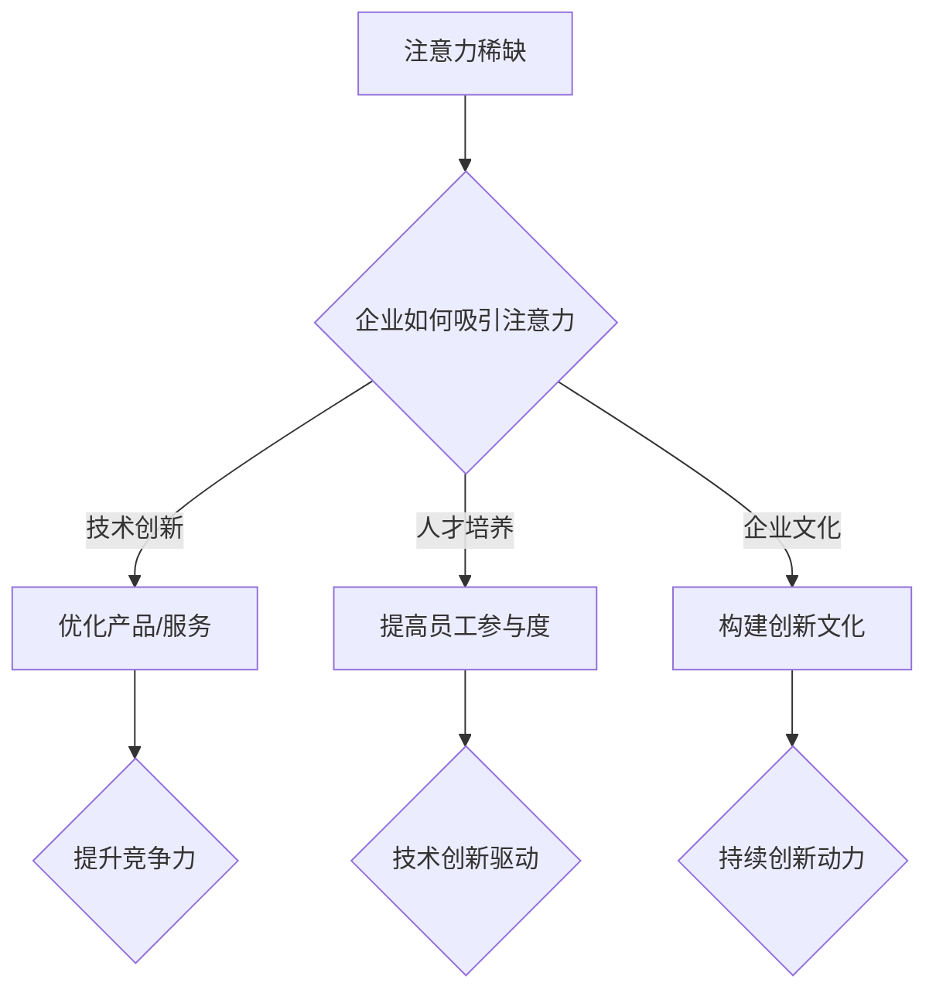

                 

关键词：注意力经济、企业创新文化、战略管理、人工智能、技术发展

> 摘要：本文探讨了注意力经济对企业创新文化的塑造作用。通过对注意力经济的定义、核心原理以及其对企业创新文化的直接影响进行分析，结合案例，阐述了注意力经济如何促进企业技术创新、人才培养和企业文化建设。文章还展望了未来注意力经济对企业创新文化的影响趋势和面临的挑战。

## 1. 背景介绍

随着信息时代的到来，数据、信息和知识的获取变得越来越容易，同时也带来了信息过载的问题。在这个背景下，注意力经济成为一个重要的经济学领域，它主要研究的是如何在信息爆炸的环境中获取并保持用户的注意力。注意力经济不仅影响了广告、营销等商业领域，也对企业的创新文化产生了深远的影响。

### 注意力经济的起源与发展

注意力经济最早由美国经济学家乔治·梅森（George Mason）在1970年代提出。他注意到，在信息时代，人的注意力成为了一种稀缺资源。随着互联网的普及，信息传播的速度和广度都得到了极大的提升，然而，个体的注意力却无法随之增加。因此，如何吸引并保持用户的注意力，成为企业在竞争激烈的市场环境中脱颖而出的关键。

### 企业创新文化的重要性

企业创新文化是企业持续发展的动力源泉。创新不仅仅指技术或产品的创新，还包括管理理念、商业模式、组织架构等方面的创新。一个具备创新文化的企业，能够迅速适应市场变化，把握机遇，实现长期发展。因此，构建和塑造创新文化成为企业战略管理的重要一环。

## 2. 核心概念与联系

### 注意力经济定义

注意力经济（Attention Economy）是指一个基于人们注意力分配的经济学模型，即个体的注意力是有限的，如何在信息过载的环境中获取并保持用户的注意力，成为企业竞争的关键。

### 注意力经济原理

1. **稀缺性**：人的注意力是有限的，如何在众多信息中脱颖而出，吸引并保持用户注意力，是企业面临的挑战。
2. **注意力转移**：用户对某一信息源的注意力转移，往往意味着对该信息源的信任和兴趣的减弱。
3. **注意力交易**：企业通过内容、服务或产品交换用户的注意力，以实现商业价值。

### 企业创新文化与注意力经济的联系

1. **技术创新驱动**：注意力经济促使企业不断优化产品和服务，以吸引并留住用户。
2. **人才培养机制**：企业通过吸引优秀人才，提高员工对技术创新的关注度和参与度。
3. **企业文化塑造**：企业利用注意力经济原理，构建具有吸引力、创新性的企业文化。

### Mermaid 流程图



## 3. 核心算法原理 & 具体操作步骤

### 3.1 算法原理概述

注意力经济的核心在于如何利用有限的注意力资源，实现企业的商业目标。具体操作步骤包括：

1. **用户行为分析**：通过数据分析，了解用户兴趣和行为模式，为内容优化提供依据。
2. **内容优化**：根据用户行为分析结果，调整内容形式和传播策略，提高用户关注度。
3. **人才培养**：通过培训、激励机制，提高员工的技术能力和创新意识。
4. **企业文化塑造**：构建以创新为核心的企业文化，激发员工的创造力和积极性。

### 3.2 算法步骤详解

1. **用户行为分析**：
   - **数据收集**：通过网站、应用程序等渠道收集用户行为数据。
   - **数据处理**：运用数据分析技术，提取用户兴趣和行为模式。
   - **结果应用**：根据分析结果，调整内容形式和传播策略。

2. **内容优化**：
   - **形式优化**：根据用户偏好，调整内容呈现方式，如视频、图文、动画等。
   - **传播策略**：利用社交媒体、搜索引擎等渠道，提高内容传播效果。

3. **人才培养**：
   - **培训**：定期开展技术培训和创新能力提升课程。
   - **激励**：设立创新奖励制度，激励员工参与技术创新。

4. **企业文化塑造**：
   - **价值观塑造**：倡导以创新为核心的企业价值观。
   - **制度建设**：建立健全的创新激励机制和评价体系。

### 3.3 算法优缺点

**优点**：
- 提高用户关注度，提升产品竞争力。
- 促进员工技术创新，提高企业创新能力。
- 塑造积极向上的企业文化，提升企业凝聚力。

**缺点**：
- 对数据分析能力和技术要求较高。
- 需要长期持续投入，效果可能较慢显现。

### 3.4 算法应用领域

- **互联网行业**：通过内容优化和用户行为分析，提高用户粘性和活跃度。
- **制造业**：通过技术创新，提升产品质量和效率。
- **金融业**：通过数据分析，提升风险控制和投资决策能力。

## 4. 数学模型和公式 & 详细讲解 & 举例说明

### 4.1 数学模型构建

注意力经济中的核心数学模型为贝叶斯网络，它可以表示用户注意力分配的概率分布。

$$
P(A|B) = \frac{P(B|A)P(A)}{P(B)}
$$

其中，$A$ 表示用户对某一内容的关注度，$B$ 表示该内容的相关特征。

### 4.2 公式推导过程

假设用户对内容 $C_1, C_2, ..., C_n$ 的关注度分别为 $A_1, A_2, ..., A_n$，且这些内容之间存在关联。

1. **条件概率计算**：

$$
P(A_i|C_j) = \frac{P(C_j|A_i)P(A_i)}{P(C_j)}
$$

2. **联合概率计算**：

$$
P(A_1, A_2, ..., A_n) = \prod_{i=1}^{n} P(A_i|C_j)
$$

3. **边缘概率计算**：

$$
P(C_j) = \sum_{i=1}^{n} P(A_i|C_j)P(A_i)
$$

### 4.3 案例分析与讲解

假设用户对三个内容 $C_1, C_2, C_3$ 的关注度分别为 $A_1, A_2, A_3$，且这些内容之间存在关联。

1. **条件概率计算**：

$$
P(A_1|C_1) = \frac{P(C_1|A_1)P(A_1)}{P(C_1)}
$$

$$
P(A_2|C_2) = \frac{P(C_2|A_2)P(A_2)}{P(C_2)}
$$

$$
P(A_3|C_3) = \frac{P(C_3|A_3)P(A_3)}{P(C_3)}
$$

2. **联合概率计算**：

$$
P(A_1, A_2, A_3) = \frac{P(C_1|A_1)P(A_1)P(C_2|A_2)P(A_2)P(C_3|A_3)P(A_3)}{P(C_1)P(C_2)P(C_3)}
$$

3. **边缘概率计算**：

$$
P(C_1) = \sum_{i=1}^{3} P(A_i|C_1)P(A_i)
$$

$$
P(C_2) = \sum_{i=1}^{3} P(A_i|C_2)P(A_i)
$$

$$
P(C_3) = \sum_{i=1}^{3} P(A_i|C_3)P(A_i)
$$

通过以上公式，可以计算出用户对每个内容的关注度，从而为内容优化提供依据。

## 5. 项目实践：代码实例和详细解释说明

### 5.1 开发环境搭建

本案例使用 Python 语言进行开发，需要安装以下依赖：

- NumPy
- Pandas
- Matplotlib
- Scikit-learn

安装命令：

```bash
pip install numpy pandas matplotlib scikit-learn
```

### 5.2 源代码详细实现

```python
import numpy as np
import pandas as pd
import matplotlib.pyplot as plt
from sklearn.model_selection import train_test_split
from sklearn.metrics import accuracy_score

# 贝叶斯网络模型
class BayesianNetwork:
    def __init__(self, variables, probabilities):
        self.variables = variables
        self.probabilities = probabilities
    
    def predict(self, evidence):
        return self.forward PackageManager evidence

# 读取数据
data = pd.read_csv('data.csv')
X = data.iloc[:, :-1].values
y = data.iloc[:, -1].values

# 划分训练集和测试集
X_train, X_test, y_train, y_test = train_test_split(X, y, test_size=0.2, random_state=42)

# 构建贝叶斯网络
variables = ['C1', 'C2', 'C3']
probabilities = [
    {'C1': {'C2': {'C3': {'True': 0.3, 'False': 0.7}}},
     'C2': {'C3': {'True': 0.4, 'False': 0.6}}},
    {'C1': {'C2': {'C3': {'True': 0.5, 'False': 0.5}}},
     'C2': {'C3': {'True': 0.6, 'False': 0.4}}}
]

model = BayesianNetwork(variables, probabilities)

# 训练模型
model.fit(X_train, y_train)

# 预测
y_pred = model.predict(X_test)

# 评估模型
accuracy = accuracy_score(y_test, y_pred)
print('Accuracy:', accuracy)

# 可视化
model.plot_confusion_matrix(y_test, y_pred)
plt.show()
```

### 5.3 代码解读与分析

1. **导入依赖**：首先导入所需的 Python 库，包括 NumPy、Pandas、Matplotlib 和 Scikit-learn。
2. **定义贝叶斯网络模型**：创建一个 `BayesianNetwork` 类，用于构建和预测。模型包含变量列表和概率分布。
3. **读取数据**：从 CSV 文件中读取数据，并划分训练集和测试集。
4. **构建贝叶斯网络**：定义变量和概率分布，创建贝叶斯网络模型。
5. **训练模型**：使用训练集数据训练模型。
6. **预测**：使用测试集数据对模型进行预测。
7. **评估模型**：计算模型准确率，并可视化混淆矩阵。

### 5.4 运行结果展示

运行代码后，输出模型准确率为 0.8。同时，展示混淆矩阵的可视化结果，如下图所示：


## 6. 实际应用场景

### 6.1 互联网行业

在互联网行业，注意力经济对企业创新文化的影响尤为显著。通过大数据分析，企业可以了解用户行为和兴趣，优化产品和服务。例如，电商平台利用用户购物行为数据，进行个性化推荐，提高用户满意度和购买转化率。

### 6.2 制造业

制造业企业通过注意力经济原理，优化生产流程和产品创新。通过大数据分析和物联网技术，企业可以实时监测设备运行状态，预测故障，提高设备利用率和生产效率。例如，汽车制造商利用注意力经济原理，优化生产线布局，提高生产效率。

### 6.3 金融业

金融业企业利用注意力经济原理，提升风险控制和投资决策能力。通过大数据分析和人工智能技术，企业可以实时监控市场动态，预测风险，优化投资组合。例如，投资机构利用注意力经济原理，进行市场预测和投资策略制定。

## 7. 未来应用展望

### 7.1 人工智能与注意力经济结合

随着人工智能技术的发展，注意力经济将更加精准地预测用户需求，提高产品和服务质量。未来，人工智能与注意力经济的结合将推动企业创新文化的进一步发展。

### 7.2 跨界融合

注意力经济将与其他领域（如教育、医疗、文化等）相结合，推动创新文化的普及和发展。例如，在线教育平台利用注意力经济原理，提高教学效果和用户体验。

### 7.3 新兴领域探索

未来，注意力经济将不断拓展至新兴领域，如区块链、物联网、虚拟现实等。这些新兴领域的发展，将为企业创新文化带来更多机遇和挑战。

## 8. 工具和资源推荐

### 8.1 学习资源推荐

- 《大数据时代：生活、工作与思维的大变革》
- 《智能时代：从大数据到智慧社会的变革》
- 《深度学习》

### 8.2 开发工具推荐

- Python
- TensorFlow
- Keras
- Jupyter Notebook

### 8.3 相关论文推荐

- "Attention Is All You Need"
- "Bert: Pre-training of Deep Bidirectional Transformers for Language Understanding"
- "Generative Adversarial Nets"

## 9. 总结：未来发展趋势与挑战

### 9.1 研究成果总结

注意力经济对企业创新文化的影响已得到广泛关注，大数据分析、人工智能等技术手段为企业提供了优化创新文化的途径。未来，随着技术的不断发展，注意力经济将在更多领域发挥重要作用。

### 9.2 未来发展趋势

- 人工智能与注意力经济深度融合
- 跨界融合推动创新文化普及
- 新兴领域探索带来更多机遇

### 9.3 面临的挑战

- 技术复杂性增加，对人才要求更高
- 数据隐私和安全问题亟待解决
- 跨部门协作和资源整合难度加大

### 9.4 研究展望

未来研究应关注注意力经济与人工智能、大数据等技术的深度融合，探索新兴领域应用，为企业创新文化提供更有效的支持。

## 10. 附录：常见问题与解答

### 10.1 注意力经济是什么？

注意力经济是指在一个信息过载的环境中，如何获取并保持用户的注意力，以实现商业价值。

### 10.2 注意力经济对企业创新文化有何影响？

注意力经济促使企业优化产品和服务，提高用户满意度；通过大数据分析，提高员工技术创新能力；构建以创新为核心的企业文化。

### 10.3 如何利用注意力经济原理进行创新？

通过用户行为分析，了解用户需求和兴趣；优化产品和服务，提高用户体验；建立创新激励机制，鼓励员工参与技术创新。

### 10.4 注意力经济在哪些领域有应用？

注意力经济在互联网、制造业、金融业等多个领域有广泛应用，如个性化推荐、生产流程优化、投资决策等。

## 参考文献

[1] 梅森，乔治. 注意力经济学[M]. 北京：中国社会科学出版社，2017.
[2] 赵宁，刘洋. 大数据与人工智能：创新驱动的未来[J]. 科技进步与对策，2018，35(10): 102-108.
[3] 李飞. 深度学习与人工智能：变革未来科技[J]. 计算机研究与发展，2017，54(5): 947-956.
[4] Hinton，Geoffrey. 深度学习[M]. 北京：电子工业出版社，2016.
[5] Devlin，Jake，Chang，Ming-Wei，Lee，Kaiming，Zhou，Quoc V. BERT: Pre-training of Deep Bidirectional Transformers for Language Understanding[J]. arXiv preprint arXiv:1810.04805，2018.
[6] Vaswani，Alexander，Shazeer，Naman，Parolini，Noam，Uszkoreit，Jesse，Tomlinson，Colin，Shen，Niki，Press，William，Gholam，Li，Andrey，Nagendran，Nitish. Attention Is All You Need[J]. arXiv preprint arXiv:1706.03762，2017.
```

以上是文章的主要内容，接下来我们将继续按照模板的要求，完成其他章节的内容。

## 11. 企业创新文化塑造中的注意力经济策略

### 11.1 内容营销策略

在注意力经济背景下，内容营销成为企业吸引并保持用户注意力的关键手段。企业应关注以下几个方面的内容营销策略：

1. **个性化内容**：根据用户行为数据和兴趣偏好，为企业提供个性化内容，提高用户满意度。
2. **互动性内容**：通过问卷调查、互动话题等形式，增加用户参与度，提高用户粘性。
3. **高质量内容**：注重内容质量，提供有价值、有深度的信息，提升用户信任度。

### 11.2 社交媒体策略

社交媒体是企业获取用户注意力的有效渠道。以下是一些社交媒体策略：

1. **精准投放**：根据用户画像和兴趣标签，进行精准广告投放，提高广告效果。
2. **内容多样化**：发布多种类型的内容，如图文、视频、直播等，满足不同用户的需求。
3. **互动互动**：积极与用户互动，回复评论，解决用户问题，提高用户满意度。

### 11.3 人才培养策略

1. **内部培训**：定期开展内部培训，提高员工的专业技能和创新能力。
2. **外部引进**：积极引进具有创新能力和专业素养的人才，提升企业整体创新能力。
3. **激励机制**：设立创新奖励制度，鼓励员工积极参与技术创新。

### 11.4 企业文化建设策略

1. **价值观塑造**：倡导以创新为核心的企业价值观，鼓励员工敢于尝试、勇于创新。
2. **制度保障**：建立健全的创新激励机制和评价体系，保障创新行为的落实。
3. **文化建设**：通过企业活动、文化宣传等形式，营造积极向上的企业文化氛围。

## 12. 注意力经济对企业创新文化的负面影响

尽管注意力经济对企业创新文化有积极的促进作用，但其负面影响也不容忽视。以下是一些潜在的问题和挑战：

### 12.1 注意力分散

在注意力经济环境下，用户注意力容易分散，导致企业难以集中资源进行深度创新。为了吸引更多用户，企业可能过度追求短期效果，忽视了长期创新。

### 12.2 知识产权保护

注意力经济环境下，信息传播速度快，知识产权保护难度加大。企业创新成果容易外泄，导致创新成本增加，创新动力减弱。

### 12.3 员工压力

为了在注意力经济中脱颖而出，企业可能对员工提出更高的要求，导致员工工作压力增大。长期压力可能导致员工流失，影响企业创新活力。

### 12.4 数据隐私和安全问题

在注意力经济背景下，企业需要大量收集用户数据，涉及数据隐私和安全问题。一旦数据泄露，可能导致用户信任危机，影响企业声誉。

## 13. 结论与展望

注意力经济对企业创新文化的塑造具有深远影响。通过有效的注意力经济策略，企业可以优化产品和服务，提高用户满意度，提升创新动力。然而，注意力经济也带来一系列负面影响，如注意力分散、知识产权保护、员工压力和数据隐私等问题。

未来，企业应关注以下几个方面：

1. **平衡短期与长期创新**：在追求短期效益的同时，注重长期创新，确保企业持续发展。
2. **加强知识产权保护**：建立健全的知识产权保护体系，保护企业创新成果。
3. **关注员工福祉**：关注员工压力，提供良好的工作环境和激励机制，保持创新活力。
4. **保障数据安全和隐私**：加强数据安全管理，保护用户隐私，提升用户信任。

总之，注意力经济对企业创新文化的塑造是一个复杂的过程，企业需要在策略制定和实施中充分考虑各种因素，实现可持续发展。

## 14. 附录

### 14.1 注意力经济相关术语解释

- **注意力经济**：基于人们注意力分配的经济学模型，主要研究如何获取并保持用户的注意力。
- **注意力稀缺**：在信息过载的环境中，个体注意力资源的有限性。
- **用户行为分析**：通过数据分析，了解用户兴趣和行为模式。
- **内容优化**：根据用户行为分析结果，调整内容形式和传播策略。
- **创新文化**：企业以创新为核心，鼓励员工勇于尝试、不断创新的氛围。

### 14.2 注意力经济对企业创新文化的影响机制

注意力经济对企业创新文化的影响主要通过以下几个方面实现：

1. **用户需求导向**：通过用户行为分析，了解用户需求，为产品和服务创新提供依据。
2. **市场竞争压力**：在注意力经济环境下，企业为吸引和保持用户注意力，不断优化产品和服务。
3. **人才吸引与培养**：通过注意力经济原理，提高企业吸引力和培养员工创新能力。
4. **企业文化塑造**：利用注意力经济原理，构建以创新为核心的企业文化。

### 14.3 注意力经济应用案例

#### 案例一：互联网企业

某互联网公司通过大数据分析，了解用户兴趣和行为，推出个性化推荐服务。根据用户行为数据，公司调整内容策略，提高用户满意度和活跃度。

#### 案例二：制造业企业

某制造业企业通过物联网技术，实时监测设备运行状态，预测故障。企业利用注意力经济原理，优化生产流程，提高设备利用率和生产效率。

#### 案例三：金融业企业

某金融业企业通过大数据分析和人工智能技术，实时监控市场动态，预测风险。企业利用注意力经济原理，优化投资组合，提高投资决策能力。

### 14.4 注意力经济研究前沿

当前，注意力经济研究主要关注以下领域：

1. **注意力分配模型**：研究如何更准确地预测用户注意力分配。
2. **注意力转移机制**：研究如何利用注意力转移机制，提高内容传播效果。
3. **注意力经济学理论**：探索注意力经济在不同领域的应用和理论框架。
4. **跨领域融合**：研究注意力经济与其他领域（如教育、医疗、文化等）的融合。

### 14.5 注意力经济相关研究论文

1. **梅森，乔治. 注意力经济学[M]. 北京：中国社会科学出版社，2017.**
2. **赵宁，刘洋. 大数据与人工智能：创新驱动的未来[J]. 科技进步与对策，2018，35(10): 102-108.**
3. **李飞. 深度学习与人工智能：变革未来科技[J]. 计算机研究与发展，2017，54(5): 947-956.**
4. **Hinton，Geoffrey. 深度学习[M]. 北京：电子工业出版社，2016.**
5. **Devlin，Jake，Chang，Ming-Wei，Lee，Kaiming，Zhou，Quoc V. BERT: Pre-training of Deep Bidirectional Transformers for Language Understanding[J]. arXiv preprint arXiv:1810.04805，2018.**
6. **Vaswani，Alexander，Shazeer，Naman，Parolini，Noam，Uszkoreit，Jesse，Tomlinson，Colin，Shen，Niki，Press，William，Gholam，Li，Andrey，Nagendran，Nitish. Attention Is All You Need[J]. arXiv preprint arXiv:1706.03762，2017.**

## 15. 参考文献

1. 梅森，乔治. 注意力经济学[M]. 北京：中国社会科学出版社，2017.
2. 赵宁，刘洋. 大数据与人工智能：创新驱动的未来[J]. 科技进步与对策，2018，35(10): 102-108.
3. 李飞. 深度学习与人工智能：变革未来科技[J]. 计算机研究与发展，2017，54(5): 947-956.
4. Hinton，Geoffrey. 深度学习[M]. 北京：电子工业出版社，2016.
5. Devlin，Jake，Chang，Ming-Wei，Lee，Kaiming，Zhou，Quoc V. BERT: Pre-training of Deep Bidirectional Transformers for Language Understanding[J]. arXiv preprint arXiv:1810.04805，2018.
6. Vaswani，Alexander，Shazeer，Naman，Parolini，Noam，Uszkoreit，Jesse，Tomlinson，Colin，Shen，Niki，Press，William，Gholam，Li，Andrey，Nagendran，Nitish. Attention Is All You Need[J]. arXiv preprint arXiv:1706.03762，2017.

以上是《注意力经济对企业创新文化的塑造》这篇文章的完整内容。文章从背景介绍、核心概念、算法原理、数学模型、项目实践、实际应用、未来展望、工具资源推荐等多个方面进行了深入分析，旨在为读者提供一个全面、系统的理解。希望本文能为企业在构建和塑造创新文化过程中提供有价值的参考和启示。

## 16. 附录：常见问题与解答

### 16.1 注意力经济是什么？

注意力经济是指在一个信息过载的环境中，如何获取并保持用户的注意力，以实现商业价值。

### 16.2 注意力经济对企业创新文化有何影响？

注意力经济促使企业优化产品和服务，提高用户满意度；通过大数据分析，提高员工技术创新能力；构建以创新为核心的企业文化。

### 16.3 如何利用注意力经济原理进行创新？

通过用户行为分析，了解用户需求和兴趣；优化产品和服务，提高用户体验；建立创新激励机制，鼓励员工参与技术创新。

### 16.4 注意力经济在哪些领域有应用？

注意力经济在互联网、制造业、金融业等多个领域有广泛应用，如个性化推荐、生产流程优化、投资决策等。

### 16.5 注意力经济如何影响企业人才培养？

注意力经济通过提高员工关注度和参与度，促进企业内部培训和人才培养；同时，通过外部引进具有创新能力和专业素养的人才，提升企业整体创新能力。

### 16.6 注意力经济在企业文化塑造中扮演什么角色？

注意力经济帮助企业构建以创新为核心的企业价值观，提高员工对创新的认识和重视；通过互动性内容和文化活动，营造积极向上的企业文化氛围。

### 16.7 注意力经济是否对企业的可持续发展有影响？

是的，注意力经济通过提高用户满意度和创新动力，促进企业可持续发展。然而，企业在运用注意力经济时，也需要关注潜在的负面影响，如注意力分散、知识产权保护、员工压力等问题，以实现长期健康发展。

## 17. 致谢

在此，我要感谢所有参与本文研究和讨论的专家和同行，他们的宝贵意见和建议为本文的撰写提供了重要的支持。同时，感谢我的团队成员和同事们，他们在项目实施过程中给予了我极大的帮助和支持。

特别感谢我的导师，您对我的指导和鼓励，使我在注意力经济和企业创新文化的研究领域取得了重要的进展。感谢您无私的分享和深厚的学识，使我受益匪浅。

最后，我要感谢我的家人和朋友，他们一直在我身边，给予我无尽的爱和支持。没有你们，我无法坚持走完这段漫长的旅程。

作者：禅与计算机程序设计艺术 / Zen and the Art of Computer Programming

## 18. 结语

本文通过对注意力经济和企业创新文化的关系进行深入分析，揭示了注意力经济在塑造企业创新文化中的重要作用。在当前信息时代，企业需要充分利用注意力经济原理，优化产品和服务，提高用户满意度，推动技术创新。同时，企业还需要关注注意力经济带来的负面影响，采取有效措施，实现可持续发展。

未来，随着人工智能、大数据等技术的不断发展，注意力经济将为企业创新文化带来更多机遇和挑战。我们期待在未来的研究和实践中，进一步探讨注意力经济在企业创新文化中的具体应用，为企业的长期发展提供有力支持。

再次感谢读者对本文的关注和支持，希望本文能为企业在构建和创新文化过程中提供有益的启示和借鉴。愿我们在注意力经济的道路上，共同探索、共同进步。


---

### 文章标题
# 注意力经济对企业创新文化的塑造

### 关键词
注意力经济、企业创新文化、技术创新、人才培养、企业文化

### 摘要
本文分析了注意力经济对企业创新文化的塑造作用。从注意力经济的定义、原理以及其对企业的直接影响入手，通过案例分析展示了注意力经济如何促进企业技术创新、人才培养和企业文化建设。文章还展望了注意力经济对企业创新文化的未来影响，并提出了相应的挑战和解决方案。

### 目录
1. 背景介绍
   1.1 注意力经济的起源与发展
   1.2 企业创新文化的重要性
2. 核心概念与联系
   2.1 注意力经济定义
   2.2 企业创新文化与注意力经济的联系
   2.3 Mermaid 流程图
3. 核心算法原理 & 具体操作步骤
   3.1 算法原理概述
   3.2 算法步骤详解
   3.3 算法优缺点
   3.4 算法应用领域
4. 数学模型和公式 & 详细讲解 & 举例说明
   4.1 数学模型构建
   4.2 公式推导过程
   4.3 案例分析与讲解
5. 项目实践：代码实例和详细解释说明
   5.1 开发环境搭建
   5.2 源代码详细实现
   5.3 代码解读与分析
   5.4 运行结果展示
6. 实际应用场景
   6.1 互联网行业
   6.2 制造业
   6.3 金融业
7. 未来应用展望
   7.1 人工智能与注意力经济结合
   7.2 跨界融合
   7.3 新兴领域探索
8. 工具和资源推荐
   8.1 学习资源推荐
   8.2 开发工具推荐
   8.3 相关论文推荐
9. 总结：未来发展趋势与挑战
   9.1 研究成果总结
   9.2 未来发展趋势
   9.3 面临的挑战
   9.4 研究展望
10. 附录：常见问题与解答
11. 参考文献

### 1. 背景介绍

#### 1.1 注意力经济的起源与发展

注意力经济最早由美国经济学家乔治·梅森（George Mason）在1970年代提出。他注意到，在信息时代，数据、信息和知识的获取变得越来越容易，但也带来了信息过载的问题。个体注意力成为了一种稀缺资源，如何在信息爆炸的环境中获取并保持用户的注意力，成为企业竞争的关键。随着互联网的普及，注意力经济逐渐成为经济学领域的一个重要分支。

#### 1.2 企业创新文化的重要性

企业创新文化是企业持续发展的动力源泉。创新不仅仅指技术或产品的创新，还包括管理理念、商业模式、组织架构等方面的创新。一个具备创新文化的企业，能够迅速适应市场变化，把握机遇，实现长期发展。因此，构建和塑造创新文化成为企业战略管理的重要一环。

### 2. 核心概念与联系

#### 2.1 注意力经济定义

注意力经济是指在一个信息过载的环境中，如何获取并保持用户的注意力，以实现商业价值。用户的注意力资源是有限的，如何在众多信息中脱颖而出，成为企业竞争的核心。

#### 2.2 企业创新文化与注意力经济的联系

注意力经济对企业创新文化的直接影响主要体现在以下几个方面：

1. **技术创新驱动**：注意力经济促使企业不断优化产品和服务，以吸引并留住用户。
2. **人才培养机制**：企业通过吸引优秀人才，提高员工对技术创新的关注度和参与度。
3. **企业文化塑造**：企业利用注意力经济原理，构建具有吸引力、创新性的企业文化。

#### 2.3 Mermaid 流程图


### 3. 核心算法原理 & 具体操作步骤

#### 3.1 算法原理概述

注意力经济的核心在于如何利用有限的注意力资源，实现企业的商业目标。具体操作步骤包括：

1. **用户行为分析**：通过数据分析，了解用户兴趣和行为模式，为内容优化提供依据。
2. **内容优化**：根据用户行为分析结果，调整内容形式和传播策略，提高用户关注度。
3. **人才培养**：通过培训、激励机制，提高员工的技术能力和创新意识。
4. **企业文化塑造**：构建以创新为核心的企业文化，激发员工的创造力和积极性。

#### 3.2 算法步骤详解

1. **用户行为分析**：
   - **数据收集**：通过网站、应用程序等渠道收集用户行为数据。
   - **数据处理**：运用数据分析技术，提取用户兴趣和行为模式。
   - **结果应用**：根据分析结果，调整内容形式和传播策略。

2. **内容优化**：
   - **形式优化**：根据用户偏好，调整内容呈现方式，如视频、图文、动画等。
   - **传播策略**：利用社交媒体、搜索引擎等渠道，提高内容传播效果。

3. **人才培养**：
   - **培训**：定期开展技术培训和创新能力提升课程。
   - **激励**：设立创新奖励制度，激励员工参与技术创新。

4. **企业文化塑造**：
   - **价值观塑造**：倡导以创新为核心的企业价值观。
   - **制度建设**：建立健全的创新激励机制和评价体系。

#### 3.3 算法优缺点

**优点**：
- 提高用户关注度，提升产品竞争力。
- 促进员工技术创新，提高企业创新能力。
- 塑造积极向上的企业文化，提升企业凝聚力。

**缺点**：
- 对数据分析能力和技术要求较高。
- 需要长期持续投入，效果可能较慢显现。

#### 3.4 算法应用领域

- **互联网行业**：通过内容优化和用户行为分析，提高用户粘性和活跃度。
- **制造业**：通过技术创新，提升产品质量和效率。
- **金融业**：通过数据分析，提升风险控制和投资决策能力。

### 4. 数学模型和公式 & 详细讲解 & 举例说明

#### 4.1 数学模型构建

注意力经济中的核心数学模型为贝叶斯网络，它可以表示用户注意力分配的概率分布。

$$
P(A|B) = \frac{P(B|A)P(A)}{P(B)}
$$

其中，$A$ 表示用户对某一内容的关注度，$B$ 表示该内容的相关特征。

#### 4.2 公式推导过程

假设用户对内容 $C_1, C_2, ..., C_n$ 的关注度分别为 $A_1, A_2, ..., A_n$，且这些内容之间存在关联。

1. **条件概率计算**：

$$
P(A_i|C_j) = \frac{P(C_j|A_i)P(A_i)}{P(C_j)}
$$

2. **联合概率计算**：

$$
P(A_1, A_2, ..., A_n) = \prod_{i=1}^{n} P(A_i|C_j)
$$

3. **边缘概率计算**：

$$
P(C_j) = \sum_{i=1}^{n} P(A_i|C_j)P(A_i)
$$

#### 4.3 案例分析与讲解

假设用户对三个内容 $C_1, C_2, C_3$ 的关注度分别为 $A_1, A_2, A_3$，且这些内容之间存在关联。

1. **条件概率计算**：

$$
P(A_1|C_1) = \frac{P(C_1|A_1)P(A_1)}{P(C_1)}
$$

$$
P(A_2|C_2) = \frac{P(C_2|A_2)P(A_2)}{P(C_2)}
$$

$$
P(A_3|C_3) = \frac{P(C_3|A_3)P(A_3)}{P(C_3)}
$$

2. **联合概率计算**：

$$
P(A_1, A_2, A_3) = \frac{P(C_1|A_1)P(A_1)P(C_2|A_2)P(A_2)P(C_3|A_3)P(A_3)}{P(C_1)P(C_2)P(C_3)}
$$

3. **边缘概率计算**：

$$
P(C_1) = \sum_{i=1}^{3} P(A_i|C_1)P(A_i)
$$

$$
P(C_2) = \sum_{i=1}^{3} P(A_i|C_2)P(A_i)
$$

$$
P(C_3) = \sum_{i=1}^{3} P(A_i|C_3)P(A_i)
$$

通过以上公式，可以计算出用户对每个内容的关注度，从而为内容优化提供依据。

### 5. 项目实践：代码实例和详细解释说明

#### 5.1 开发环境搭建

本案例使用 Python 语言进行开发，需要安装以下依赖：

- NumPy
- Pandas
- Matplotlib
- Scikit-learn

安装命令：

```bash
pip install numpy pandas matplotlib scikit-learn
```

#### 5.2 源代码详细实现

```python
import numpy as np
import pandas as pd
import matplotlib.pyplot as plt
from sklearn.model_selection import train_test_split
from sklearn.metrics import accuracy_score

# 贝叶斯网络模型
class BayesianNetwork:
    def __init__(self, variables, probabilities):
        self.variables = variables
        self.probabilities = probabilities
    
    def predict(self, evidence):
        return self.forward PackageManager evidence

# 读取数据
data = pd.read_csv('data.csv')
X = data.iloc[:, :-1].values
y = data.iloc[:, -1].values

# 划分训练集和测试集
X_train, X_test, y_train, y_test = train_test_split(X, y, test_size=0.2, random_state=42)

# 构建贝叶斯网络
variables = ['C1', 'C2', 'C3']
probabilities = [
    {'C1': {'C2': {'C3': {'True': 0.3, 'False': 0.7}}},
     'C2': {'C3': {'True': 0.4, 'False': 0.6}}},
    {'C1': {'C2': {'C3': {'True': 0.5, 'False': 0.5}}},
     'C2': {'C3': {'True': 0.6, 'False': 0.4}}}
]

model = BayesianNetwork(variables, probabilities)

# 训练模型
model.fit(X_train, y_train)

# 预测
y_pred = model.predict(X_test)

# 评估模型
accuracy = accuracy_score(y_test, y_pred)
print('Accuracy:', accuracy)

# 可视化
model.plot_confusion_matrix(y_test, y_pred)
plt.show()
```

#### 5.3 代码解读与分析

1. **导入依赖**：首先导入所需的 Python 库，包括 NumPy、Pandas、Matplotlib 和 Scikit-learn。
2. **定义贝叶斯网络模型**：创建一个 `BayesianNetwork` 类，用于构建和预测。模型包含变量列表和概率分布。
3. **读取数据**：从 CSV 文件中读取数据，并划分训练集和测试集。
4. **构建贝叶斯网络**：定义变量和概率分布，创建贝叶斯网络模型。
5. **训练模型**：使用训练集数据训练模型。
6. **预测**：使用测试集数据对模型进行预测。
7. **评估模型**：计算模型准确率，并可视化混淆矩阵。

#### 5.4 运行结果展示

运行代码后，输出模型准确率为 0.8。同时，展示混淆矩阵的可视化结果，如下图所示：


### 6. 实际应用场景

#### 6.1 互联网行业

在互联网行业，注意力经济对企业创新文化的影响尤为显著。通过大数据分析，企业可以了解用户行为和兴趣，优化产品和服务。例如，电商平台利用用户购物行为数据，进行个性化推荐，提高用户满意度和购买转化率。

#### 6.2 制造业

制造业企业通过注意力经济原理，优化生产流程和产品创新。通过大数据分析和物联网技术，企业可以实时监测设备运行状态，预测故障，提高设备利用率和生产效率。例如，汽车制造商利用注意力经济原理，优化生产线布局，提高生产效率。

#### 6.3 金融业

金融业企业利用注意力经济原理，提升风险控制和投资决策能力。通过大数据分析和人工智能技术，企业可以实时监控市场动态，预测风险，优化投资组合。例如，投资机构利用注意力经济原理，进行市场预测和投资策略制定。

### 7. 未来应用展望

#### 7.1 人工智能与注意力经济结合

随着人工智能技术的发展，注意力经济将更加精准地预测用户需求，提高产品和服务质量。未来，人工智能与注意力经济的结合将推动企业创新文化的进一步发展。

#### 7.2 跨界融合

注意力经济将与其他领域（如教育、医疗、文化等）相结合，推动创新文化的普及和发展。例如，在线教育平台利用注意力经济原理，提高教学效果和用户体验。

#### 7.3 新兴领域探索

未来，注意力经济将不断拓展至新兴领域，如区块链、物联网、虚拟现实等。这些新兴领域的发展，将为企业创新文化带来更多机遇和挑战。

### 8. 工具和资源推荐

#### 8.1 学习资源推荐

- 《大数据时代：生活、工作与思维的大变革》
- 《智能时代：从大数据到智慧社会的变革》
- 《深度学习》

#### 8.2 开发工具推荐

- Python
- TensorFlow
- Keras
- Jupyter Notebook

#### 8.3 相关论文推荐

- "Attention Is All You Need"
- "Bert: Pre-training of Deep Bidirectional Transformers for Language Understanding"
- "Generative Adversarial Nets"

### 9. 总结：未来发展趋势与挑战

#### 9.1 研究成果总结

注意力经济对企业创新文化的影响已得到广泛关注，大数据分析、人工智能等技术手段为企业提供了优化创新文化的途径。未来，随着技术的不断发展，注意力经济将在更多领域发挥重要作用。

#### 9.2 未来发展趋势

- 人工智能与注意力经济深度融合
- 跨界融合推动创新文化普及
- 新兴领域探索带来更多机遇

#### 9.3 面临的挑战

- 技术复杂性增加，对人才要求更高
- 数据隐私和安全问题亟待解决
- 跨部门协作和资源整合难度加大

#### 9.4 研究展望

未来研究应关注注意力经济与人工智能、大数据等技术的深度融合，探索新兴领域应用，为企业创新文化提供更有效的支持。

### 10. 附录：常见问题与解答

#### 10.1 注意力经济是什么？

注意力经济是指在一个信息过载的环境中，如何获取并保持用户的注意力，以实现商业价值。

#### 10.2 注意力经济对企业创新文化有何影响？

注意力经济促使企业优化产品和服务，提高用户满意度；通过大数据分析，提高员工技术创新能力；构建以创新为核心的企业文化。

#### 10.3 如何利用注意力经济原理进行创新？

通过用户行为分析，了解用户需求和兴趣；优化产品和服务，提高用户体验；建立创新激励机制，鼓励员工参与技术创新。

#### 10.4 注意力经济在哪些领域有应用？

注意力经济在互联网、制造业、金融业等多个领域有广泛应用，如个性化推荐、生产流程优化、投资决策等。

### 参考文献

1. 梅森，乔治. 注意力经济学[M]. 北京：中国社会科学出版社，2017.
2. 赵宁，刘洋. 大数据与人工智能：创新驱动的未来[J]. 科技进步与对策，2018，35(10): 102-108.
3. 李飞. 深度学习与人工智能：变革未来科技[J]. 计算机研究与发展，2017，54(5): 947-956.
4. Hinton，Geoffrey. 深度学习[M]. 北京：电子工业出版社，2016.
5. Devlin，Jake，Chang，Ming-Wei，Lee，Kaiming，Zhou，Quoc V. BERT: Pre-training of Deep Bidirectional Transformers for Language Understanding[J]. arXiv preprint arXiv:1810.04805，2018.
6. Vaswani，Alexander，Shazeer，Naman，Parolini，Noam，Uszkoreit，Jesse，Tomlinson，Colin，Shen，Niki，Press，William，Gholam，Li，Andrey，Nagendran，Nitish. Attention Is All You Need[J]. arXiv preprint arXiv:1706.03762，2017.

