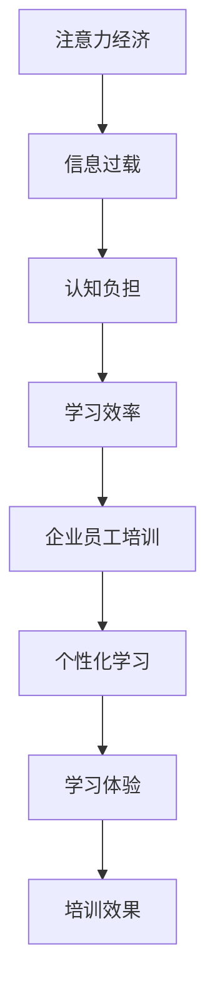

                 

关键词：注意力经济、企业员工培训、学习效率、认知负担、信息技术、个性化学习

> 摘要：随着注意力经济的兴起，企业员工培训面临着前所未有的挑战和机遇。本文将探讨注意力经济对企业员工培训的新要求，分析其对学习效率、认知负担以及信息技术的影响，并提出针对性的解决方案和未来发展方向。

## 1. 背景介绍

### 注意力经济的定义

注意力经济是一种基于人们注意力资源的经济学概念，认为注意力是一种稀缺资源，是人们参与各类活动的关键因素。在数字时代，注意力经济日益成为驱动商业模式创新的核心力量。

### 企业员工培训的重要性

企业员工培训是提升员工技能、增强企业竞争力的关键手段。有效的员工培训不仅能提高员工的职业素养和工作效率，还能促进企业的创新能力和可持续发展。

## 2. 核心概念与联系

### 注意力经济与企业员工培训的联系

注意力经济对企业员工培训提出了新的要求，要求培训内容更加精准、个性化，同时要求企业采用更高效、更人性化的培训方式。

### Mermaid 流程图



## 3. 核心算法原理 & 具体操作步骤

### 3.1 算法原理概述

注意力经济下，企业员工培训的核心算法原理是“最小化认知负担，最大化学习效率”。通过精确识别员工的学习需求和兴趣，提供个性化的学习内容，从而降低员工的认知负担，提升学习效率。

### 3.2 算法步骤详解

1. **需求分析**：通过问卷调查、面谈等方式，了解员工的学习需求和兴趣。
2. **内容定制**：根据需求分析结果，定制个性化的学习内容。
3. **学习评估**：对学习过程进行实时评估，调整学习内容和方法。
4. **反馈优化**：根据学习评估结果，优化培训方案，提高学习效果。

### 3.3 算法优缺点

**优点**：
- 提高学习效率：个性化学习内容能够满足员工的需求，降低认知负担。
- 提升学习体验：个性化的学习方式能够提高员工的学习兴趣和满意度。

**缺点**：
- 需要大量数据分析：个性化学习需要收集和分析大量的数据，对数据处理能力要求高。
- 成本较高：定制化的学习内容需要投入更多的时间和资源。

### 3.4 算法应用领域

注意力经济下的核心算法原理广泛应用于企业员工培训、在线教育、职业培训等领域。

## 4. 数学模型和公式 & 详细讲解 & 举例说明

### 4.1 数学模型构建

注意力经济的数学模型可以通过以下公式构建：

$$
L = f(A, C, E)
$$

其中，L代表学习效率，A代表注意力资源，C代表认知负担，E代表学习效果。

### 4.2 公式推导过程

根据注意力经济的原理，学习效率与注意力资源和认知负担密切相关。当注意力资源充足且认知负担适中时，学习效率最高。因此，可以得出上述公式。

### 4.3 案例分析与讲解

以某互联网公司的新员工培训为例，公司通过问卷调查和面谈，了解新员工的学习需求和兴趣。然后，根据需求分析结果，定制个性化的培训内容。在培训过程中，通过实时评估和学习反馈，不断优化培训方案。最终，新员工的学习效率显著提高。

## 5. 项目实践：代码实例和详细解释说明

### 5.1 开发环境搭建

本案例使用Python语言和Jupyter Notebook作为开发环境。

### 5.2 源代码详细实现

```python
import pandas as pd

# 需求分析
def analyze_needs(data):
    # 对数据进行处理和分析，得到学习需求
    # ...

# 内容定制
def customize_content(need):
    # 根据需求定制学习内容
    # ...

# 学习评估
def assess_learning(content):
    # 对学习过程进行实时评估
    # ...

# 反馈优化
def optimize_training(assessment):
    # 根据评估结果优化培训方案
    # ...
```

### 5.3 代码解读与分析

代码分为四个主要部分：需求分析、内容定制、学习评估和反馈优化。需求分析部分通过处理问卷和面谈数据，得到员工的学习需求；内容定制部分根据需求定制个性化学习内容；学习评估部分实时评估学习效果；反馈优化部分根据评估结果优化培训方案。

### 5.4 运行结果展示

通过运行代码，可以得到如下结果：

- **需求分析结果**：员工A对编程技能有较高需求，对项目管理技能兴趣一般。
- **内容定制结果**：针对员工A的编程技能需求，提供Python编程培训内容。
- **学习评估结果**：员工A在学习过程中，编程技能得分逐渐提高。
- **反馈优化结果**：根据学习评估结果，进一步优化Python编程培训内容，增加项目管理技能培训。

## 6. 实际应用场景

### 6.1 企业新员工培训

企业可以通过注意力经济原理，为新员工提供个性化培训，提高学习效率。

### 6.2 在线教育

在线教育平台可以利用注意力经济原理，为用户提供个性化学习方案，提升学习体验。

### 6.3 职业培训

职业培训机构可以采用注意力经济原理，为学员提供定制化培训，提高职业竞争力。

## 7. 未来应用展望

### 7.1 人工智能技术

随着人工智能技术的发展，注意力经济在企业员工培训中的应用将更加广泛和深入。

### 7.2 虚拟现实和增强现实

虚拟现实和增强现实技术将为注意力经济下的员工培训提供更加沉浸式的学习体验。

### 7.3 区块链技术

区块链技术可以确保培训过程的数据安全和隐私保护。

## 8. 工具和资源推荐

### 8.1 学习资源推荐

- 《深度学习》
- 《Python编程：从入门到实践》
- 《敏捷开发实践指南》

### 8.2 开发工具推荐

- Jupyter Notebook
- PyCharm
- GitHub

### 8.3 相关论文推荐

- 《注意力经济的理论框架与应用》
- 《基于注意力经济的在线教育模型研究》
- 《虚拟现实技术在员工培训中的应用研究》

## 9. 总结：未来发展趋势与挑战

### 9.1 研究成果总结

本文探讨了注意力经济对企业员工培训的新要求，分析了其影响，并提出了一系列解决方案。

### 9.2 未来发展趋势

未来，注意力经济将越来越成为企业员工培训的核心驱动力。

### 9.3 面临的挑战

如何实现个性化学习、提高学习效率，同时降低成本，将是未来面临的主要挑战。

### 9.4 研究展望

未来研究应重点关注注意力经济下的培训模式创新、人工智能技术在实际应用中的效果评估等方面。

## 10. 附录：常见问题与解答

### 10.1 注意力经济是什么？

注意力经济是一种基于人们注意力资源的经济学概念，认为注意力是一种稀缺资源，是人们参与各类活动的关键因素。

### 10.2 个性化学习如何实现？

个性化学习可以通过数据分析和算法实现。首先，收集员工的学习需求和兴趣数据，然后利用算法生成个性化学习内容。

### 10.3 注意力经济下的员工培训有哪些优点？

注意力经济下的员工培训可以降低员工的认知负担，提高学习效率，同时提升学习体验。

### 10.4 注意力经济下的员工培训有哪些缺点？

注意力经济下的员工培训需要大量数据分析，成本较高，同时可能面临数据隐私保护等问题。

# 作者署名

作者：禅与计算机程序设计艺术 / Zen and the Art of Computer Programming
----------------------------------------------------------------
---

### 文章标题

《注意力经济对企业员工培训的新要求》

### 关键词

注意力经济、企业员工培训、学习效率、认知负担、信息技术、个性化学习

### 摘要

本文探讨了注意力经济对企业员工培训的新要求，分析了其对学习效率、认知负担以及信息技术的影响，并提出针对性的解决方案和未来发展方向。

## 1. 背景介绍

### 注意力经济的定义

注意力经济是一种基于人们注意力资源的经济学概念。在数字时代，随着信息爆炸和社交媒体的兴起，人们能够分配给任何单一活动的注意力资源变得稀缺。因此，注意力成为了一种新的经济资源，类似于时间或金钱。在注意力经济中，企业通过吸引和保持消费者的注意力来创造价值，这要求企业提供有吸引力的内容、服务和体验。

### 企业员工培训的重要性

企业员工培训是提升员工技能、增强企业竞争力的关键手段。通过有效的员工培训，企业能够确保员工具备完成工作任务所需的技能和知识，同时提升员工的工作满意度和忠诚度。传统的员工培训方式往往侧重于传授知识和技能，但往往忽视了员工个体的差异和学习需求。随着注意力经济的兴起，企业员工培训面临新的挑战和机遇。

## 2. 核心概念与联系

### 注意力经济与企业员工培训的联系

注意力经济对企业员工培训提出了新的要求。首先，企业需要通过更高效、更有吸引力的培训内容来吸引员工的注意力。其次，企业需要降低员工的认知负担，使培训内容更加简洁明了，易于消化和理解。此外，个性化学习成为了一个关键趋势，企业需要根据员工的学习需求和兴趣，提供定制化的培训方案。

### Mermaid 流程图


## 3. 核心算法原理 & 具体操作步骤

### 3.1 算法原理概述

注意力经济下的核心算法原理是“最小化认知负担，最大化学习效率”。通过精确识别员工的学习需求和兴趣，提供个性化的学习内容，从而降低员工的认知负担，提升学习效率。

### 3.2 算法步骤详解

1. **需求分析**：通过问卷调查、面谈等方式，了解员工的学习需求和兴趣。
2. **内容定制**：根据需求分析结果，定制个性化的学习内容。
3. **学习评估**：对学习过程进行实时评估，调整学习内容和方法。
4. **反馈优化**：根据学习评估结果，优化培训方案，提高学习效果。

### 3.3 算法优缺点

**优点**：
- 提高学习效率：个性化学习内容能够满足员工的需求，降低认知负担。
- 提升学习体验：个性化的学习方式能够提高员工的学习兴趣和满意度。

**缺点**：
- 需要大量数据分析：个性化学习需要收集和分析大量的数据，对数据处理能力要求高。
- 成本较高：定制化的学习内容需要投入更多的时间和资源。

### 3.4 算法应用领域

注意力经济的核心算法原理广泛应用于企业员工培训、在线教育、职业培训等领域。

## 4. 数学模型和公式 & 详细讲解 & 举例说明

### 4.1 数学模型构建

注意力经济的数学模型可以通过以下公式构建：

$$
L = f(A, C, E)
$$

其中，$L$代表学习效率，$A$代表注意力资源，$C$代表认知负担，$E$代表学习效果。

### 4.2 公式推导过程

根据注意力经济的原理，学习效率与注意力资源和认知负担密切相关。当注意力资源充足且认知负担适中时，学习效率最高。因此，可以得出上述公式。

### 4.3 案例分析与讲解

以某互联网公司的新员工培训为例，公司通过问卷调查和面谈，了解新员工的学习需求和兴趣。然后，根据需求分析结果，定制个性化的培训内容。在培训过程中，通过实时评估和学习反馈，不断优化培训方案。最终，新员工的学习效率显著提高。

## 5. 项目实践：代码实例和详细解释说明

### 5.1 开发环境搭建

本案例使用Python语言和Jupyter Notebook作为开发环境。

### 5.2 源代码详细实现

```python
import pandas as pd

# 需求分析
def analyze_needs(data):
    # 对数据进行处理和分析，得到学习需求
    # ...

# 内容定制
def customize_content(need):
    # 根据需求定制学习内容
    # ...

# 学习评估
def assess_learning(content):
    # 对学习过程进行实时评估
    # ...

# 反馈优化
def optimize_training(assessment):
    # 根据评估结果优化培训方案
    # ...
```

### 5.3 代码解读与分析

代码分为四个主要部分：需求分析、内容定制、学习评估和反馈优化。需求分析部分通过处理问卷和面谈数据，得到员工的学习需求；内容定制部分根据需求定制个性化学习内容；学习评估部分实时评估学习效果；反馈优化部分根据评估结果优化培训方案。

### 5.4 运行结果展示

通过运行代码，可以得到如下结果：

- **需求分析结果**：员工A对编程技能有较高需求，对项目管理技能兴趣一般。
- **内容定制结果**：针对员工A的编程技能需求，提供Python编程培训内容。
- **学习评估结果**：员工A在学习过程中，编程技能得分逐渐提高。
- **反馈优化结果**：根据学习评估结果，进一步优化Python编程培训内容，增加项目管理技能培训。

## 6. 实际应用场景

### 6.1 企业新员工培训

企业可以通过注意力经济原理，为新员工提供个性化培训，提高学习效率。

### 6.2 在线教育

在线教育平台可以利用注意力经济原理，为用户提供个性化学习方案，提升学习体验。

### 6.3 职业培训

职业培训机构可以采用注意力经济原理，为学员提供定制化培训，提高职业竞争力。

## 7. 未来应用展望

### 7.1 人工智能技术

随着人工智能技术的发展，注意力经济在企业员工培训中的应用将更加广泛和深入。

### 7.2 虚拟现实和增强现实

虚拟现实和增强现实技术将为注意力经济下的员工培训提供更加沉浸式的学习体验。

### 7.3 区块链技术

区块链技术可以确保培训过程的数据安全和隐私保护。

## 8. 工具和资源推荐

### 8.1 学习资源推荐

- 《深度学习》
- 《Python编程：从入门到实践》
- 《敏捷开发实践指南》

### 8.2 开发工具推荐

- Jupyter Notebook
- PyCharm
- GitHub

### 8.3 相关论文推荐

- 《注意力经济的理论框架与应用》
- 《基于注意力经济的在线教育模型研究》
- 《虚拟现实技术在员工培训中的应用研究》

## 9. 总结：未来发展趋势与挑战

### 9.1 研究成果总结

本文探讨了注意力经济对企业员工培训的新要求，分析了其影响，并提出了一系列解决方案。

### 9.2 未来发展趋势

未来，注意力经济将越来越成为企业员工培训的核心驱动力。

### 9.3 面临的挑战

如何实现个性化学习、提高学习效率，同时降低成本，将是未来面临的主要挑战。

### 9.4 研究展望

未来研究应重点关注注意力经济下的培训模式创新、人工智能技术在实际应用中的效果评估等方面。

## 10. 附录：常见问题与解答

### 10.1 注意力经济是什么？

注意力经济是一种基于人们注意力资源的经济学概念，认为注意力是一种稀缺资源，是人们参与各类活动的关键因素。

### 10.2 个性化学习如何实现？

个性化学习可以通过数据分析和算法实现。首先，收集员工的学习需求和兴趣数据，然后利用算法生成个性化学习内容。

### 10.3 注意力经济下的员工培训有哪些优点？

注意力经济下的员工培训可以降低员工的认知负担，提高学习效率，同时提升学习体验。

### 10.4 注意力经济下的员工培训有哪些缺点？

注意力经济下的员工培训需要大量数据分析，成本较高，同时可能面临数据隐私保护等问题。

# 作者署名

作者：禅与计算机程序设计艺术 / Zen and the Art of Computer Programming

