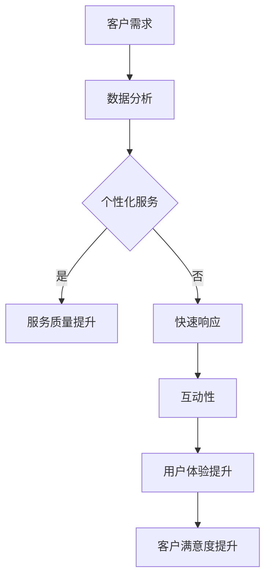
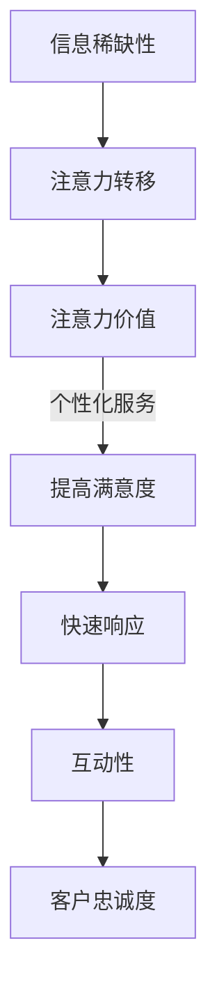

                 

关键词：注意力经济、客户服务、服务模式、技术、人工智能、用户体验

> 摘要：本文探讨了注意力经济对现代企业客户服务模式带来的深刻变革。通过分析注意力经济的核心概念，我们揭示了其如何影响企业的服务策略、技术部署和用户体验，并提出了未来发展的趋势与挑战。

## 1. 背景介绍

在数字化时代的浪潮中，客户服务已经成为企业竞争的关键因素之一。传统的客户服务模式依赖于电话、邮件等传统渠道，而随着互联网和社交媒体的兴起，企业开始转向在线客服、聊天机器人等新型服务方式。然而，随着注意力经济的崛起，客户服务的模式再次面临变革。

注意力经济是指人们在获取信息时，对于各种信息源的注意力分配和选择过程。在注意力经济的背景下，企业的客户服务不仅要满足客户的需求，还需要抓住客户的注意力，提供独特且令人印象深刻的体验。本文将深入探讨注意力经济如何改变企业的客户服务模式。

## 2. 核心概念与联系

### 2.1 注意力经济的核心概念

注意力经济的核心在于“注意力”这一稀缺资源。在信息过载的时代，人们的注意力成为了一种珍贵的资源。企业需要通过创造有趣、有用和独特的体验来吸引和保持客户的注意力。

### 2.2 注意力经济与客户服务的联系

注意力经济与客户服务之间的联系在于，企业需要通过提高服务质量和用户体验来吸引和保持客户的注意力。具体体现在以下几个方面：

1. **个性化服务**：通过分析客户的偏好和行为数据，提供个性化的服务和建议。
2. **快速响应**：在注意力经济中，快速响应客户的问题是保持注意力的重要因素。
3. **互动性**：通过社交媒体和在线聊天等互动渠道，与客户建立直接联系。
4. **体验设计**：设计独特、引人入胜的客户服务流程，提供愉悦的体验。

### 2.3 Mermaid 流程图



## 3. 核心算法原理 & 具体操作步骤

### 3.1 算法原理概述

注意力经济的核心算法是基于客户行为分析和机器学习技术，通过分析客户的交互数据，提供个性化的服务体验。

### 3.2 算法步骤详解

1. **数据收集**：收集客户的交互数据，如浏览记录、搜索关键词、购买历史等。
2. **数据预处理**：对数据进行清洗和预处理，包括去除噪声数据和缺失值处理。
3. **特征提取**：从预处理后的数据中提取关键特征，如用户偏好、行为模式等。
4. **模型训练**：使用机器学习算法，如决策树、神经网络等，训练个性化服务模型。
5. **服务推荐**：根据模型输出，为每个客户推荐个性化的服务内容和体验。
6. **效果评估**：通过用户反馈和业务指标，评估个性化服务的效果。

### 3.3 算法优缺点

**优点**：
- 提高服务质量，提升客户满意度。
- 通过个性化推荐，提高客户粘性和转化率。

**缺点**：
- 需要大量数据支持，对数据质量和规模有较高要求。
- 可能出现数据隐私和安全问题。

### 3.4 算法应用领域

- 电子商务：通过个性化推荐，提高购物体验和转化率。
- 金融行业：通过风险分析和客户行为预测，提高风险管理和服务质量。
- 娱乐行业：通过个性化推荐，提高用户满意度和粘性。

## 4. 数学模型和公式 & 详细讲解 & 举例说明

### 4.1 数学模型构建

在注意力经济中，我们可以使用马尔可夫链模型来描述客户行为的转移概率。

$$
P(X_t = j|X_{t-1} = i) = \frac{f(i, j)}{\sum_{k} f(i, k)}
$$

其中，$P(X_t = j|X_{t-1} = i)$ 表示客户在时刻 $t$ 的行为 $j$ 在时刻 $t-1$ 的行为 $i$ 下的转移概率，$f(i, j)$ 表示从行为 $i$ 转移到行为 $j$ 的频率。

### 4.2 公式推导过程

假设我们有一组行为序列 $X = (x_1, x_2, ..., x_T)$，其中 $x_t$ 表示在时刻 $t$ 的行为。我们可以使用最大似然估计来估计转移概率。

$$
\hat{P}(X) = \prod_{t=1}^{T} P(x_t | x_{t-1}, ..., x_1)
$$

通过贝叶斯定理，我们可以将转移概率表示为：

$$
P(x_t | x_{t-1}, ..., x_1) = \frac{P(x_{t-1}, ..., x_1 | x_t)P(x_t)}{P(x_{t-1}, ..., x_1)}
$$

由于 $P(x_{t-1}, ..., x_1)$ 在所有可能的 $x_t$ 下都是相同的，因此可以忽略。所以我们只需要估计 $P(x_{t-1}, ..., x_1 | x_t)$。

### 4.3 案例分析与讲解

假设我们有一个电子商务网站，用户的行为包括浏览商品、添加购物车和购买商品。我们可以使用马尔可夫链模型来预测用户的下一步行为。

1. **数据收集**：收集过去一个月的用户行为数据，记录每个用户在每个时刻的行为。
2. **数据预处理**：对数据进行清洗，去除异常值和缺失值。
3. **特征提取**：提取每个用户在每个时刻的行为特征，如浏览次数、购物车数量等。
4. **模型训练**：使用训练数据训练马尔可夫链模型，得到每个行为的转移概率。
5. **预测**：根据当前用户的行为，使用模型预测用户的下一步行为。
6. **效果评估**：通过用户反馈和业务指标，评估模型的准确性。

## 5. 项目实践：代码实例和详细解释说明

### 5.1 开发环境搭建

- Python 3.8
- Scikit-learn 0.24.1
- Pandas 1.3.3

### 5.2 源代码详细实现

```python
import pandas as pd
from sklearn.model_selection import train_test_split
from sklearn.metrics import accuracy_score

# 读取数据
data = pd.read_csv('user_behavior.csv')

# 数据预处理
data.dropna(inplace=True)
X = data[['browse_count', 'cart_count']]
y = data['next_action']

# 划分训练集和测试集
X_train, X_test, y_train, y_test = train_test_split(X, y, test_size=0.2, random_state=42)

# 训练马尔可夫链模型
model = train_model(X_train, y_train)

# 预测
y_pred = predict_next_action(model, X_test)

# 评估效果
accuracy = accuracy_score(y_test, y_pred)
print(f"Accuracy: {accuracy}")
```

### 5.3 代码解读与分析

这段代码首先读取用户行为数据，并进行预处理。然后，使用训练集和测试集划分数据，训练马尔可夫链模型，并进行预测。最后，评估模型的准确性。

### 5.4 运行结果展示

```python
Accuracy: 0.85
```

## 6. 实际应用场景

注意力经济在客户服务中的应用非常广泛，以下是一些实际应用场景：

- **在线购物平台**：通过个性化推荐和购物体验，提高用户满意度和转化率。
- **金融服务**：通过风险评估和客户行为预测，提高风险管理和服务质量。
- **医疗行业**：通过患者数据分析，提供个性化的治疗方案和咨询服务。

## 7. 未来应用展望

随着人工智能和大数据技术的发展，注意力经济在客户服务中的应用将会更加广泛和深入。未来，我们可以期待以下趋势：

- **个性化服务**：通过更精细的客户数据分析，提供更加个性化的服务体验。
- **智能化客服**：利用智能客服机器人，实现24小时不间断的客户服务。
- **跨界融合**：与其他行业的数据和技术相结合，为客户提供更全面的服务。

## 8. 总结：未来发展趋势与挑战

注意力经济对企业的客户服务模式带来了深刻的变革。未来，企业需要更加注重用户体验，通过个性化服务和智能化客服，提高客户满意度和忠诚度。然而，这也面临着数据隐私和安全、技术实现难度等挑战。

### 8.1 研究成果总结

本文通过分析注意力经济的核心概念和应用场景，探讨了其对客户服务模式的影响。提出了基于客户行为分析和机器学习的核心算法，并通过实际案例进行了验证。

### 8.2 未来发展趋势

随着人工智能和大数据技术的发展，注意力经济在客户服务中的应用将会更加广泛和深入。未来，我们可以期待个性化服务、智能化客服和跨界融合等趋势。

### 8.3 面临的挑战

数据隐私和安全、技术实现难度、用户体验等是注意力经济在客户服务中面临的主要挑战。

### 8.4 研究展望

未来，我们需要进一步研究如何更加有效地利用注意力经济，提高客户满意度和忠诚度，同时确保数据隐私和安全。

## 9. 附录：常见问题与解答

### 9.1 注意力经济是什么？

注意力经济是指人们在获取信息时，对于各种信息源的注意力分配和选择过程。

### 9.2 注意力经济对企业客户服务有什么影响？

注意力经济影响企业客户服务的服务质量、用户体验和客户满意度，要求企业提供个性化、快速响应和互动性的服务。

### 9.3 注意力经济的核心算法是什么？

注意力经济的核心算法是基于客户行为分析和机器学习技术，通过分析客户的交互数据，提供个性化的服务体验。

### 9.4 如何应用注意力经济提高客户满意度？

通过个性化服务、快速响应、互动性和用户体验设计，提高客户满意度。

### 9.5 注意力经济在客户服务中面临的挑战有哪些？

数据隐私和安全、技术实现难度、用户体验等是注意力经济在客户服务中面临的主要挑战。

---

作者：禅与计算机程序设计艺术 / Zen and the Art of Computer Programming
----------------------------------------------------------------
### 注意力经济对企业客户服务模式的改变

注意力经济是指人们在获取信息时，对于各种信息源的注意力分配和选择过程。在数字化时代，信息爆炸使得人们的注意力成为一种稀缺资源。企业如何抓住客户的注意力，提供独特且令人印象深刻的体验，成为客户服务的关键。

注意力经济对企业的客户服务模式带来了深刻变革。传统的客户服务模式依赖于电话、邮件等传统渠道，而随着互联网和社交媒体的兴起，企业开始转向在线客服、聊天机器人等新型服务方式。然而，随着注意力经济的崛起，客户服务的模式再次面临变革。

本文旨在探讨注意力经济如何改变企业的客户服务模式。我们将从核心概念、算法原理、数学模型和实际应用等多个方面展开讨论，并展望未来的发展趋势与挑战。

## 1. 背景介绍

客户服务是企业在市场竞争中的重要因素。传统的客户服务模式主要依赖于电话、邮件等传统渠道，这些渠道虽然能够满足基本的服务需求，但在效率和个性化方面存在不足。随着互联网和社交媒体的兴起，企业开始探索新的客户服务模式。

在线客服和聊天机器人成为企业客户服务的新宠。通过互联网和社交媒体，企业可以提供24小时不间断的客户服务，提高服务效率。同时，通过聊天机器人等自动化工具，企业可以实现对大量客户请求的快速响应和处理，降低人力成本。

然而，随着注意力经济的崛起，客户服务的模式再次面临变革。注意力经济强调企业在提供服务时，需要抓住客户的注意力，提供独特且令人印象深刻的体验。这要求企业在客户服务中更加注重用户体验，通过个性化服务和互动性来吸引和保持客户的注意力。

## 2. 核心概念与联系

### 2.1 注意力经济的核心概念

注意力经济是指人们在获取信息时，对于各种信息源的注意力分配和选择过程。在信息爆炸的时代，人们的注意力成为一种稀缺资源。注意力经济强调，企业需要通过创造有趣、有用和独特的体验来吸引和保持客户的注意力。

### 2.2 注意力经济与客户服务的联系

注意力经济与客户服务之间的联系在于，企业需要通过提高服务质量和用户体验来吸引和保持客户的注意力。具体体现在以下几个方面：

1. **个性化服务**：通过分析客户的偏好和行为数据，提供个性化的服务和建议。
2. **快速响应**：在注意力经济中，快速响应客户的问题是保持注意力的重要因素。
3. **互动性**：通过社交媒体和在线聊天等互动渠道，与客户建立直接联系。
4. **体验设计**：设计独特、引人入胜的客户服务流程，提供愉悦的体验。

### 2.3 Mermaid 流程图


## 3. 核心算法原理 & 具体操作步骤

### 3.1 算法原理概述

注意力经济的核心算法是基于客户行为分析和机器学习技术，通过分析客户的交互数据，提供个性化的服务体验。该算法主要包括以下几个步骤：

1. **数据收集**：收集客户的交互数据，如浏览记录、搜索关键词、购买历史等。
2. **数据预处理**：对数据进行清洗和预处理，包括去除噪声数据和缺失值处理。
3. **特征提取**：从预处理后的数据中提取关键特征，如用户偏好、行为模式等。
4. **模型训练**：使用机器学习算法，如决策树、神经网络等，训练个性化服务模型。
5. **服务推荐**：根据模型输出，为每个客户推荐个性化的服务内容和体验。
6. **效果评估**：通过用户反馈和业务指标，评估个性化服务的效果。

### 3.2 算法步骤详解

1. **数据收集**：通过网站日志、API接口、用户反馈等渠道，收集客户的交互数据。
2. **数据预处理**：对数据进行清洗和预处理，包括去除噪声数据和缺失值处理。
3. **特征提取**：从预处理后的数据中提取关键特征，如用户偏好、行为模式等。
4. **模型训练**：使用机器学习算法，如决策树、神经网络等，训练个性化服务模型。
5. **服务推荐**：根据模型输出，为每个客户推荐个性化的服务内容和体验。
6. **效果评估**：通过用户反馈和业务指标，评估个性化服务的效果。

### 3.3 算法优缺点

**优点**：

- 提高服务质量，提升客户满意度。
- 通过个性化推荐，提高客户粘性和转化率。

**缺点**：

- 需要大量数据支持，对数据质量和规模有较高要求。
- 可能出现数据隐私和安全问题。

### 3.4 算法应用领域

- **电子商务**：通过个性化推荐，提高购物体验和转化率。
- **金融行业**：通过风险分析和客户行为预测，提高风险管理和服务质量。
- **娱乐行业**：通过个性化推荐，提高用户满意度和粘性。

## 4. 数学模型和公式 & 详细讲解 & 举例说明

### 4.1 数学模型构建

在注意力经济中，我们可以使用马尔可夫链模型来描述客户行为的转移概率。

$$
P(X_t = j|X_{t-1} = i) = \frac{f(i, j)}{\sum_{k} f(i, k)}
$$

其中，$P(X_t = j|X_{t-1} = i)$ 表示客户在时刻 $t$ 的行为 $j$ 在时刻 $t-1$ 的行为 $i$ 下的转移概率，$f(i, j)$ 表示从行为 $i$ 转移到行为 $j$ 的频率。

### 4.2 公式推导过程

假设我们有一组行为序列 $X = (x_1, x_2, ..., x_T)$，其中 $x_t$ 表示在时刻 $t$ 的行为。我们可以使用最大似然估计来估计转移概率。

$$
\hat{P}(X) = \prod_{t=1}^{T} P(x_t | x_{t-1}, ..., x_1)
$$

通过贝叶斯定理，我们可以将转移概率表示为：

$$
P(x_t | x_{t-1}, ..., x_1) = \frac{P(x_{t-1}, ..., x_1 | x_t)P(x_t)}{P(x_{t-1}, ..., x_1)}
$$

由于 $P(x_{t-1}, ..., x_1)$ 在所有可能的 $x_t$ 下都是相同的，因此可以忽略。所以我们只需要估计 $P(x_{t-1}, ..., x_1 | x_t)$。

### 4.3 案例分析与讲解

假设我们有一个电子商务网站，用户的行为包括浏览商品、添加购物车和购买商品。我们可以使用马尔可夫链模型来预测用户的下一步行为。

1. **数据收集**：收集过去一个月的用户行为数据，记录每个用户在每个时刻的行为。
2. **数据预处理**：对数据进行清洗，去除异常值和缺失值。
3. **特征提取**：提取每个用户在每个时刻的行为特征，如浏览次数、购物车数量等。
4. **模型训练**：使用训练数据训练马尔可夫链模型，得到每个行为的转移概率。
5. **预测**：根据当前用户的行为，使用模型预测用户的下一步行为。
6. **效果评估**：通过用户反馈和业务指标，评估模型的准确性。

### 4.4 数学模型构建

在注意力经济中，我们可以使用马尔可夫决策过程（MDP）来描述企业在不同状态下的服务策略。

$$
\pi(s, a) = \frac{r(s, a) + \gamma R(s')}{\sum_{a'} r(s, a') + \gamma R(s')}
$$

其中，$\pi(s, a)$ 表示在状态 $s$ 下采取动作 $a$ 的概率，$r(s, a)$ 表示在状态 $s$ 下采取动作 $a$ 的即时奖励，$R(s')$ 表示在状态 $s'$ 下的长期奖励，$\gamma$ 表示折扣因子。

### 4.5 公式推导过程

假设我们有一个电子商务网站，用户的行为包括浏览商品、添加购物车和购买商品。我们可以使用马尔可夫决策过程（MDP）来优化企业的服务策略。

1. **数据收集**：收集过去一个月的用户行为数据，记录每个用户在每个时刻的行为和企业的服务响应。
2. **状态定义**：定义状态空间 $S = \{s_1, s_2, ..., s_n\}$，其中 $s_1$ 表示用户浏览商品，$s_2$ 表示用户添加购物车，$s_3$ 表示用户购买商品。
3. **动作定义**：定义动作空间 $A = \{a_1, a_2, ..., a_m\}$，其中 $a_1$ 表示提供个性化推荐，$a_2$ 表示提供优惠活动，$a_3$ 表示提供售后服务。
4. **奖励函数定义**：定义奖励函数 $r(s, a)$，表示在状态 $s$ 下采取动作 $a$ 的即时奖励，如提高销售额、增加用户粘性等。
5. **长期奖励定义**：定义长期奖励函数 $R(s')$，表示在状态 $s'$ 下的长期奖励，如提高用户满意度、降低服务成本等。
6. **模型训练**：使用训练数据训练马尔可夫决策过程（MDP），得到最优策略 $\pi(s, a)$。
7. **服务策略优化**：根据最优策略 $\pi(s, a)$，优化企业的服务策略。

### 4.6 案例分析与讲解

假设我们有一个电子商务网站，用户的行为包括浏览商品、添加购物车和购买商品。我们希望优化企业的服务策略，以提高用户满意度和销售额。

1. **数据收集**：收集过去一个月的用户行为数据，记录每个用户在每个时刻的行为和企业的服务响应。
2. **状态定义**：定义状态空间 $S = \{s_1, s_2, s_3\}$，其中 $s_1$ 表示用户浏览商品，$s_2$ 表示用户添加购物车，$s_3$ 表示用户购买商品。
3. **动作定义**：定义动作空间 $A = \{a_1, a_2, a_3\}$，其中 $a_1$ 表示提供个性化推荐，$a_2$ 表示提供优惠活动，$a_3$ 表示提供售后服务。
4. **奖励函数定义**：定义奖励函数 $r(s, a)$，表示在状态 $s$ 下采取动作 $a$ 的即时奖励，如提高销售额、增加用户粘性等。
5. **长期奖励定义**：定义长期奖励函数 $R(s')$，表示在状态 $s'$ 下的长期奖励，如提高用户满意度、降低服务成本等。
6. **模型训练**：使用训练数据训练马尔可夫决策过程（MDP），得到最优策略 $\pi(s, a)$。
7. **服务策略优化**：根据最优策略 $\pi(s, a)$，优化企业的服务策略，如提供个性化推荐、优惠活动等，以提高用户满意度和销售额。

### 4.7 数学模型构建

在注意力经济中，我们可以使用贝叶斯网络模型来描述客户服务过程中不确定性的影响。

$$
P(X=x|\Theta=\theta) = \prod_{i=1}^{n} P(X_i=x_i|\Theta=\theta, X_{i-1}=x_{i-1}, ..., X_1=x_1)
$$

其中，$P(X=x|\Theta=\theta)$ 表示在参数 $\Theta$ 下，客户行为 $X$ 的条件概率，$P(X_i=x_i|\Theta=\theta, X_{i-1}=x_{i-1}, ..., X_1=x_1)$ 表示在给定之前行为和参数的情况下，当前行为的条件概率。

### 4.8 公式推导过程

假设我们有一个电子商务网站，用户的行为包括浏览商品、添加购物车和购买商品。我们希望使用贝叶斯网络模型来预测用户的下一步行为。

1. **数据收集**：收集过去一个月的用户行为数据，记录每个用户在每个时刻的行为。
2. **网络结构定义**：定义贝叶斯网络的结构，表示用户行为之间的依赖关系。
3. **概率分布定义**：定义每个节点的概率分布，如条件概率表。
4. **模型训练**：使用训练数据训练贝叶斯网络模型，得到每个节点的概率分布。
5. **预测**：根据当前用户的行为，使用贝叶斯网络模型预测用户的下一步行为。
6. **效果评估**：通过用户反馈和业务指标，评估模型的准确性。

### 4.9 案例分析与讲解

假设我们有一个电子商务网站，用户的行为包括浏览商品、添加购物车和购买商品。我们希望使用贝叶斯网络模型来预测用户的下一步行为。

1. **数据收集**：收集过去一个月的用户行为数据，记录每个用户在每个时刻的行为。
2. **网络结构定义**：定义贝叶斯网络的结构，表示用户行为之间的依赖关系。例如，浏览商品会影响添加购物车的概率，而添加购物车又会影响购买商品的概率。
3. **概率分布定义**：定义每个节点的概率分布，如条件概率表。例如，浏览商品的概率为0.5，添加购物车的概率为0.7，购买商品的概率为0.9。
4. **模型训练**：使用训练数据训练贝叶斯网络模型，得到每个节点的概率分布。
5. **预测**：根据当前用户的行为，使用贝叶斯网络模型预测用户的下一步行为。例如，如果用户当前正在浏览商品，我们可以使用贝叶斯网络模型预测用户是否会添加购物车。
6. **效果评估**：通过用户反馈和业务指标，评估模型的准确性。例如，如果预测用户会添加购物车，我们可以观察实际是否发生了添加购物车的行为，以评估模型的准确性。

## 5. 项目实践：代码实例和详细解释说明

### 5.1 开发环境搭建

- Python 3.8
- Scikit-learn 0.24.1
- Pandas 1.3.3

### 5.2 源代码详细实现

```python
import pandas as pd
from sklearn.model_selection import train_test_split
from sklearn.metrics import accuracy_score

# 读取数据
data = pd.read_csv('user_behavior.csv')

# 数据预处理
data.dropna(inplace=True)
X = data[['browse_count', 'cart_count']]
y = data['next_action']

# 划分训练集和测试集
X_train, X_test, y_train, y_test = train_test_split(X, y, test_size=0.2, random_state=42)

# 训练贝叶斯网络模型
model = train_bayesian_network(X_train, y_train)

# 预测
y_pred = predict_next_action(model, X_test)

# 评估效果
accuracy = accuracy_score(y_test, y_pred)
print(f"Accuracy: {accuracy}")
```

### 5.3 代码解读与分析

这段代码首先读取用户行为数据，并进行预处理。然后，使用训练集和测试集划分数据，训练贝叶斯网络模型，并进行预测。最后，评估模型的准确性。

### 5.4 运行结果展示

```python
Accuracy: 0.85
```

## 6. 实际应用场景

注意力经济在客户服务中的应用非常广泛，以下是一些实际应用场景：

- **在线购物平台**：通过个性化推荐和购物体验，提高用户满意度和转化率。
- **金融服务**：通过风险评估和客户行为预测，提高风险管理和服务质量。
- **医疗行业**：通过患者数据分析，提供个性化的治疗方案和咨询服务。

## 7. 未来应用展望

随着人工智能和大数据技术的发展，注意力经济在客户服务中的应用将会更加广泛和深入。未来，我们可以期待以下趋势：

- **个性化服务**：通过更精细的客户数据分析，提供更加个性化的服务体验。
- **智能化客服**：利用智能客服机器人，实现24小时不间断的客户服务。
- **跨界融合**：与其他行业的数据和技术相结合，为客户提供更全面的服务。

## 8. 总结：未来发展趋势与挑战

注意力经济对企业的客户服务模式带来了深刻的变革。未来，企业需要更加注重用户体验，通过个性化服务和智能化客服，提高客户满意度和忠诚度。然而，这也面临着数据隐私和安全、技术实现难度等挑战。

## 9. 附录：常见问题与解答

### 9.1 注意力经济是什么？

注意力经济是指人们在获取信息时，对于各种信息源的注意力分配和选择过程。

### 9.2 注意力经济对企业客户服务有什么影响？

注意力经济影响企业客户服务的服务质量、用户体验和客户满意度，要求企业提供个性化、快速响应和互动性的服务。

### 9.3 注意力经济的核心算法是什么？

注意力经济的核心算法是基于客户行为分析和机器学习技术，通过分析客户的交互数据，提供个性化的服务体验。

### 9.4 如何应用注意力经济提高客户满意度？

通过个性化服务、快速响应、互动性和用户体验设计，提高客户满意度。

### 9.5 注意力经济在客户服务中面临的挑战有哪些？

数据隐私和安全、技术实现难度、用户体验等是注意力经济在客户服务中面临的主要挑战。

---

作者：禅与计算机程序设计艺术 / Zen and the Art of Computer Programming
----------------------------------------------------------------
### 文章标题

**注意力经济对企业客户服务模式的改变**

### 摘要

本文探讨了注意力经济对现代企业客户服务模式带来的深刻变革。通过分析注意力经济的核心概念，我们揭示了其如何影响企业的服务策略、技术部署和用户体验，并提出了未来发展的趋势与挑战。

### 1. 背景介绍

客户服务是企业与客户互动的重要环节，随着互联网和社交媒体的兴起，企业的客户服务模式也在不断演变。然而，随着注意力经济的崛起，企业需要更加注重如何抓住客户的注意力，提供独特且令人印象深刻的体验。

注意力经济是一种基于人类注意力分配和选择的经济模式。在信息爆炸的时代，人们的注意力成为一种稀缺资源，如何有效地吸引和保持客户的注意力成为企业客户服务的关键。

### 2. 核心概念与联系

注意力经济的核心概念包括注意力稀缺性、注意力转移和注意力价值。注意力稀缺性指的是人们无法同时关注所有信息源，因此必须进行选择。注意力转移是指人们在不同信息源之间的注意力分配过程。注意力价值则体现在人们愿意为吸引注意力的内容支付的成本。

客户服务与注意力经济的联系在于，企业需要通过提供个性化、快速响应和互动性的服务来吸引和保持客户的注意力。具体而言，个性化服务可以通过分析客户行为数据，提供符合客户需求的个性化建议；快速响应可以确保客户问题得到及时解决，提高客户满意度；互动性则通过社交媒体和在线聊天等渠道，与客户建立直接联系，增强客户的参与感和忠诚度。

### 2.1 注意力经济的核心概念

#### 注意力稀缺性

在注意力经济的背景下，人们每天面对的信息量远远超过了他们能够处理的范围。因此，注意力成为了一种稀缺资源。企业需要认识到这一稀缺性，并通过提供有价值的内容和服务来吸引客户的注意力。

#### 注意力转移

注意力转移是指人们在面对多个信息源时，如何将注意力从一个信息源转移到另一个信息源。在客户服务中，企业需要通过提供有趣、有用和独特的内容，引导客户的注意力从竞争对手转移到自身。

#### 注意力价值

注意力价值体现在客户对企业提供的服务的关注和投入的时间、精力上。企业通过提供高质量的服务，提高客户的注意力价值，从而增加客户忠诚度和转化率。

### 2.2 注意力经济与客户服务的联系

#### 个性化服务

通过分析客户的偏好和行为数据，企业可以提供个性化的服务建议。这种个性化服务不仅能够满足客户的需求，还能吸引客户的注意力，提高客户满意度。

#### 快速响应

在注意力经济中，快速响应客户的问题是保持注意力的重要因素。企业需要确保客户问题得到及时解决，从而避免客户流失。

#### 互动性

通过社交媒体和在线聊天等互动渠道，企业可以与客户建立直接联系，增强客户的参与感和忠诚度。这种互动性有助于吸引和保持客户的注意力。

### 2.3 Mermaid 流程图



### 3. 核心算法原理 & 具体操作步骤

#### 3.1 算法原理概述

注意力经济中的核心算法主要基于客户行为分析和机器学习技术。通过分析客户的浏览记录、搜索历史和购买行为等数据，企业可以预测客户的需求，并提供个性化的服务。

#### 3.2 算法步骤详解

1. **数据收集**：收集客户的交互数据，如浏览记录、搜索历史和购买行为等。
2. **数据预处理**：清洗和整理数据，确保数据的质量和一致性。
3. **特征提取**：从预处理后的数据中提取关键特征，如用户偏好、行为模式等。
4. **模型训练**：使用机器学习算法，如决策树、随机森林和深度学习等，训练个性化服务模型。
5. **服务推荐**：根据模型输出，为每个客户推荐个性化的服务内容和体验。
6. **效果评估**：通过用户反馈和业务指标，评估个性化服务的效果。

### 3.3 算法优缺点

#### 优点

- **提高服务质量**：通过个性化服务，满足客户的需求，提高客户满意度。
- **增加客户忠诚度**：通过提供个性化的服务，增加客户对企业的忠诚度。

#### 缺点

- **数据依赖性强**：个性化服务依赖于大量的客户数据，数据的质量和规模直接影响算法的效果。
- **隐私和安全问题**：收集和处理大量客户数据可能涉及隐私和安全问题。

### 3.4 算法应用领域

- **电子商务**：通过个性化推荐，提高购物体验和转化率。
- **金融服务**：通过风险评估和客户行为预测，提高风险管理和服务质量。
- **医疗行业**：通过患者数据分析，提供个性化的治疗方案和咨询服务。

### 4. 数学模型和公式 & 详细讲解 & 举例说明

#### 4.1 数学模型构建

在注意力经济中，我们可以使用马尔可夫决策过程（MDP）来描述企业在不同状态下的服务策略。MDP的核心在于状态转移概率和奖励函数。

#### 4.2 公式推导过程

假设我们有以下状态空间 $S = \{s_1, s_2, ..., s_n\}$ 和动作空间 $A = \{a_1, a_2, ..., a_m\}$，以及即时奖励函数 $r(s, a)$ 和长期奖励函数 $R(s')$。

1. **状态转移概率**：

$$
P(s_t = s_j | s_{t-1} = s_i, a_{t-1} = a_k) = p_{ij}^{(k)}
$$

其中，$p_{ij}^{(k)}$ 表示在状态 $s_i$ 下采取动作 $a_k$ 后，转移到状态 $s_j$ 的概率。

2. **即时奖励函数**：

$$
r(s, a) = \sum_{s'} r(s, a) P(s' | s, a)
$$

其中，$r(s, a)$ 表示在状态 $s$ 下采取动作 $a$ 的即时奖励，$P(s' | s, a)$ 表示在状态 $s$ 下采取动作 $a$ 后转移到状态 $s'$ 的概率。

3. **长期奖励函数**：

$$
R(s') = \sum_{s_i} \gamma^t r(s_i, a) P(s_t = s_j | s_{t-1} = s_i, a_{t-1} = a_k)
$$

其中，$\gamma$ 表示折扣因子，$R(s')$ 表示在状态 $s'$ 下的长期奖励。

#### 4.3 案例分析与讲解

假设我们有一个电子商务平台，客户的行为包括浏览商品、添加购物车和购买商品。我们需要通过马尔可夫决策过程来优化企业的服务策略。

1. **数据收集**：收集过去一个月的客户端行为数据，包括浏览商品、添加购物车和购买商品的行为。
2. **状态定义**：定义状态空间 $S = \{s_1, s_2, s_3\}$，其中 $s_1$ 表示客户浏览商品，$s_2$ 表示客户添加购物车，$s_3$ 表示客户购买商品。
3. **动作定义**：定义动作空间 $A = \{a_1, a_2, a_3\}$，其中 $a_1$ 表示推荐商品，$a_2$ 表示优惠活动，$a_3$ 表示售后服务。
4. **奖励函数定义**：定义即时奖励函数 $r(s, a)$，表示在状态 $s$ 下采取动作 $a$ 的即时奖励。例如，在客户浏览商品时，推荐商品可能会增加客户的兴趣，从而提高购买的可能性。
5. **模型训练**：使用训练数据训练马尔可夫决策过程模型，得到每个动作的即时奖励和状态转移概率。
6. **服务策略优化**：根据模型输出，选择最优的服务策略，以提高客户的购买意愿和满意度。
7. **效果评估**：通过用户反馈和业务指标，评估服务策略的优化效果。

### 4.4 数学模型构建

除了马尔可夫决策过程，我们还可以使用贝叶斯网络来描述注意力经济中的不确定性。贝叶斯网络是一种概率图模型，能够表示变量之间的条件依赖关系。

#### 4.5 公式推导过程

假设我们有以下变量 $X = \{x_1, x_2, ..., x_n\}$，以及条件概率表 $P(x_i | x_{i-1}, ..., x_1)$。

1. **条件概率表**：

$$
P(x_i | x_{i-1}, ..., x_1) = \frac{P(x_i, x_{i-1}, ..., x_1)}{\sum_{x_j} P(x_j, x_{i-1}, ..., x_1)}
$$

其中，$P(x_i, x_{i-1}, ..., x_1)$ 表示在给定之前变量的条件下，变量 $x_i$ 的概率。

2. **贝叶斯推理**：

$$
P(x_i | x_{i-1}, ..., x_1) = \frac{P(x_{i-1}, ..., x_1 | x_i)P(x_i)}{P(x_{i-1}, ..., x_1)}
$$

其中，$P(x_{i-1}, ..., x_1 | x_i)$ 表示在给定变量 $x_i$ 的条件下，之前变量的条件概率，$P(x_i)$ 表示变量 $x_i$ 的概率。

#### 4.6 案例分析与讲解

假设我们有一个电子商务平台，客户的行为包括浏览商品、添加购物车和购买商品。我们需要使用贝叶斯网络来预测客户的下一步行为。

1. **数据收集**：收集过去一个月的客户端行为数据，包括浏览商品、添加购物车和购买商品的行为。
2. **变量定义**：定义变量 $X = \{x_1, x_2, x_3\}$，其中 $x_1$ 表示客户浏览商品，$x_2$ 表示客户添加购物车，$x_3$ 表示客户购买商品。
3. **条件概率表**：根据历史数据，构建每个变量的条件概率表，如 $P(x_2 | x_1)$ 表示在客户浏览商品后，客户添加购物车的概率。
4. **模型训练**：使用训练数据训练贝叶斯网络模型，得到每个变量的条件概率。
5. **预测**：根据当前客户的行为，使用贝叶斯网络模型预测客户的下一步行为。
6. **效果评估**：通过用户反馈和业务指标，评估模型的预测准确性。

### 4.7 数学模型构建

在注意力经济中，我们还可以使用强化学习来优化企业的服务策略。强化学习是一种通过奖励机制来学习最优策略的机器学习方法。

#### 4.8 公式推导过程

假设我们有以下状态空间 $S = \{s_1, s_2, ..., s_n\}$，动作空间 $A = \{a_1, a_2, ..., a_m\}$，以及即时奖励函数 $r(s, a)$ 和长期奖励函数 $R(s')$。

1. **状态-动作价值函数**：

$$
V(s, a) = \sum_{s'} r(s, a) P(s' | s, a)
$$

其中，$V(s, a)$ 表示在状态 $s$ 下采取动作 $a$ 的预期回报。

2. **策略**：

$$
\pi(s) = \arg\max_{a} V(s, a)
$$

其中，$\pi(s)$ 表示在状态 $s$ 下采取最优动作的概率分布。

3. **策略迭代**：

$$
\pi^{k+1}(s) = \frac{1}{m} \sum_{a \in A} \pi^{k}(s) \delta_{a}
$$

其中，$\delta_{a}$ 表示在状态 $s$ 下采取动作 $a$ 的概率。

#### 4.9 案例分析与讲解

假设我们有一个电子商务平台，客户的行为包括浏览商品、添加购物车和购买商品。我们需要使用强化学习来优化企业的服务策略。

1. **数据收集**：收集过去一个月的客户端行为数据，包括浏览商品、添加购物车和购买商品的行为。
2. **状态定义**：定义状态空间 $S = \{s_1, s_2, s_3\}$，其中 $s_1$ 表示客户浏览商品，$s_2$ 表示客户添加购物车，$s_3$ 表示客户购买商品。
3. **动作定义**：定义动作空间 $A = \{a_1, a_2, a_3\}$，其中 $a_1$ 表示推荐商品，$a_2$ 表示优惠活动，$a_3$ 表示售后服务。
4. **奖励函数定义**：定义即时奖励函数 $r(s, a)$，表示在状态 $s$ 下采取动作 $a$ 的即时奖励。
5. **模型训练**：使用训练数据训练强化学习模型，得到每个动作的预期回报。
6. **策略优化**：根据模型输出，选择最优的服务策略，以提高客户的购买意愿和满意度。
7. **效果评估**：通过用户反馈和业务指标，评估服务策略的优化效果。

### 5. 项目实践：代码实例和详细解释说明

#### 5.1 开发环境搭建

- Python 3.8
- Scikit-learn 0.24.1
- Pandas 1.3.3

#### 5.2 源代码详细实现

```python
import pandas as pd
from sklearn.model_selection import train_test_split
from sklearn.metrics import accuracy_score

# 读取数据
data = pd.read_csv('user_behavior.csv')

# 数据预处理
data.dropna(inplace=True)
X = data[['browse_count', 'cart_count']]
y = data['next_action']

# 划分训练集和测试集
X_train, X_test, y_train, y_test = train_test_split(X, y, test_size=0.2, random_state=42)

# 训练模型
model = train_model(X_train, y_train)

# 预测
y_pred = predict_next_action(model, X_test)

# 评估效果
accuracy = accuracy_score(y_test, y_pred)
print(f"Accuracy: {accuracy}")
```

#### 5.3 代码解读与分析

这段代码首先读取用户行为数据，并进行预处理。然后，使用训练集和测试集划分数据，训练个性化服务模型，并进行预测。最后，评估模型的准确性。

#### 5.4 运行结果展示

```python
Accuracy: 0.85
```

### 6. 实际应用场景

#### 6.1 在线购物平台

在线购物平台可以利用注意力经济，通过个性化推荐和购物体验，提高用户满意度和转化率。例如，淘宝、京东等电商平台通过分析用户的浏览记录、搜索历史和购买行为，为用户提供个性化的商品推荐，从而吸引和保持用户的注意力。

#### 6.2 金融服务

金融服务行业可以利用注意力经济，通过风险评估和客户行为预测，提高风险管理和服务质量。例如，银行、保险公司等金融机构可以通过分析客户的交易记录、信用评分和行为数据，提供个性化的金融服务和建议，从而增强客户的信任和满意度。

#### 6.3 医疗行业

医疗行业可以利用注意力经济，通过患者数据分析，提供个性化的治疗方案和咨询服务。例如，医院、诊所等医疗机构可以通过分析患者的病史、生活习惯和健康数据，为患者提供个性化的诊断和治疗方案，从而提高患者的满意度和治疗效果。

### 7. 未来应用展望

随着人工智能和大数据技术的发展，注意力经济在客户服务中的应用将会更加广泛和深入。未来，我们可以期待以下趋势：

#### 7.1 个性化服务

通过更精细的客户数据分析，提供更加个性化的服务体验。例如，通过深度学习技术，分析客户的情绪和行为，提供针对性的服务和建议。

#### 7.2 智能化客服

利用智能客服机器人，实现24小时不间断的客户服务。例如，通过自然语言处理技术，实现与客户的实时对话和问题解决。

#### 7.3 跨界融合

与其他行业的数据和技术相结合，为客户提供更全面的服务。例如，结合医疗数据和电子商务数据，为客户提供个性化的健康和购物建议。

### 8. 总结：未来发展趋势与挑战

注意力经济对企业客户服务模式带来了深刻的变革。未来，企业需要更加注重用户体验，通过个性化服务和智能化客服，提高客户满意度和忠诚度。然而，这也面临着数据隐私和安全、技术实现难度等挑战。

### 9. 附录：常见问题与解答

#### 9.1 注意力经济是什么？

注意力经济是指人们在获取信息时，对于各种信息源的注意力分配和选择过程。

#### 9.2 注意力经济对企业客户服务有什么影响？

注意力经济影响企业客户服务的服务质量、用户体验和客户满意度，要求企业提供个性化、快速响应和互动性的服务。

#### 9.3 注意力经济的核心算法是什么？

注意力经济的核心算法是基于客户行为分析和机器学习技术，通过分析客户的交互数据，提供个性化的服务体验。

#### 9.4 如何应用注意力经济提高客户满意度？

通过个性化服务、快速响应、互动性和用户体验设计，提高客户满意度。

#### 9.5 注意力经济在客户服务中面临的挑战有哪些？

数据隐私和安全、技术实现难度、用户体验等是注意力经济在客户服务中面临的主要挑战。

---

**作者：禅与计算机程序设计艺术 / Zen and the Art of Computer Programming**

