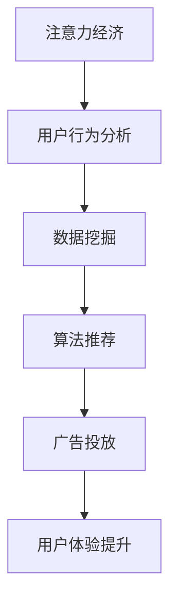

                 

关键词：注意力经济、传统商业广告、算法、数据挖掘、用户体验、营销策略、技术变革

## 摘要

注意力经济，一个在信息技术与消费行为不断演变的今天逐渐凸显的概念，正在对传统商业广告模式进行深刻的改造。本文将探讨注意力经济的基本原理，分析其对传统广告带来的挑战和机遇，并通过具体案例展示注意力经济如何通过算法和数据挖掘技术改造广告的呈现与传播方式，从而提升用户体验和营销效果。文章还将展望注意力经济在广告领域未来的发展趋势和面临的挑战。

## 1. 背景介绍

### 注意力经济

注意力经济（Attention Economy）是由迈克尔·霍斯比（Michael H. Boskin）在1998年首次提出的一个概念，意指信息时代的核心资源不是金钱或物质，而是人们的注意力。随着互联网和移动设备的普及，用户的时间与注意力变得更加稀缺，因此如何有效获取和保持用户的注意力成为企业竞争的关键。

### 传统商业广告

传统商业广告主要依赖于大规模投放、媒体覆盖和品牌认知来吸引消费者。广告的形式主要包括电视广告、报纸广告、户外广告等，这些广告形式往往通过视觉冲击和声音刺激来吸引用户的注意力。然而，随着用户媒体消费习惯的变化，传统广告的效果逐渐减弱。

### 技术变革

技术的快速发展，尤其是互联网技术、大数据和人工智能技术的应用，为广告行业带来了前所未有的机遇。算法优化、数据挖掘和用户行为分析等技术手段，使得广告可以更加精准地定位用户，提高广告投放的效率和效果。

## 2. 核心概念与联系

### 核心概念

- **注意力经济**：注意力经济强调用户注意力的重要性，以及如何通过算法和数据技术来优化注意力的获取和利用。
- **用户行为分析**：通过分析用户在互联网上的行为数据，了解用户兴趣和偏好，从而实现广告的精准投放。
- **算法推荐**：利用机器学习算法，根据用户历史行为和兴趣，推荐个性化的广告内容。

### Mermaid 流程图



## 3. 核心算法原理 & 具体操作步骤

### 3.1 算法原理概述

注意力经济的核心在于利用算法和数据技术来优化用户注意力的获取。通过用户行为分析和数据挖掘，算法能够识别用户的兴趣和需求，从而实现广告的精准推荐。

### 3.2 算法步骤详解

1. **用户行为数据收集**：通过网站日志、浏览器插件、社交媒体等渠道收集用户行为数据。
2. **数据预处理**：对收集到的数据进行清洗、去重和归一化处理。
3. **特征提取**：从用户行为数据中提取关键特征，如搜索历史、浏览记录、点击行为等。
4. **模型训练**：利用机器学习算法，如决策树、随机森林、神经网络等，训练广告推荐模型。
5. **广告投放**：根据模型预测，将个性化的广告内容推送给用户。
6. **效果评估**：通过用户反馈和行为数据，评估广告投放的效果，不断优化模型。

### 3.3 算法优缺点

- **优点**：提高了广告的投放效率和用户满意度，降低了广告投放成本。
- **缺点**：对数据质量和算法模型的要求较高，且可能引发用户隐私问题。

### 3.4 算法应用领域

- **电子商务**：通过用户行为数据推荐个性化的商品。
- **社交媒体**：根据用户兴趣推荐相关的内容和广告。
- **在线教育**：根据学习行为推荐合适的学习资源和课程。

## 4. 数学模型和公式 & 详细讲解 & 举例说明

### 4.1 数学模型构建

注意力经济的数学模型主要包括用户行为模型和广告推荐模型。

#### 用户行为模型

$$
P(U|A) = \frac{e^{w^T x}}{\sum_{j=1}^k e^{w^T x_j}}
$$

其中，$P(U|A)$ 表示用户 $U$ 对广告 $A$ 的兴趣概率，$w$ 为权重向量，$x$ 为用户行为特征向量。

#### 广告推荐模型

$$
R(A|U) = \frac{e^{q^T v}}{\sum_{j=1}^k e^{q^T v_j}}
$$

其中，$R(A|U)$ 表示广告 $A$ 对用户 $U$ 的推荐概率，$q$ 为权重向量，$v$ 为广告特征向量。

### 4.2 公式推导过程

#### 用户行为模型推导

1. **贝叶斯公式**：$P(U|A) = \frac{P(A|U)P(U)}{P(A)}$
2. **高斯分布**：$P(A|U) \approx \frac{1}{\sqrt{2\pi\sigma^2}}e^{-\frac{(x-\mu)^2}{2\sigma^2}}$
3. **最大化似然估计**：$\hat{w} = \arg\max_w P(U|A)$

#### 广告推荐模型推导

1. **贝叶斯公式**：$R(A|U) = \frac{P(U|A)P(A)}{P(U)}$
2. **高斯分布**：$P(A|U) \approx \frac{1}{\sqrt{2\pi\sigma^2}}e^{-\frac{(v-q)^2}{2\sigma^2}}$
3. **最大化似然估计**：$\hat{q} = \arg\max_q R(A|U)$

### 4.3 案例分析与讲解

#### 案例背景

某电商网站希望通过注意力经济模型为用户推荐个性化的商品。

#### 数据收集

1. 用户行为数据：浏览历史、购买记录、搜索关键词
2. 商品特征数据：商品种类、价格、品牌、评价等

#### 模型训练

1. 特征提取：将用户行为数据和商品特征数据进行编码和归一化处理。
2. 模型训练：使用决策树算法训练用户行为模型和广告推荐模型。

#### 广告投放

1. 根据用户行为模型，预测用户对商品的兴趣概率。
2. 根据广告推荐模型，推荐用户可能感兴趣的个性化商品。

#### 效果评估

1. 通过用户点击率、购买率等指标评估广告投放效果。
2. 根据用户反馈，不断优化模型参数。

## 5. 项目实践：代码实例和详细解释说明

### 5.1 开发环境搭建

1. 安装Python环境。
2. 安装相关库：numpy、pandas、scikit-learn等。

### 5.2 源代码详细实现

```python
import numpy as np
import pandas as pd
from sklearn.ensemble import RandomForestClassifier

# 数据加载与预处理
data = pd.read_csv('user_behavior_data.csv')
X = data.iloc[:, :10]  # 用户行为特征
y = data.iloc[:, 10]   # 用户购买行为

# 模型训练
clf = RandomForestClassifier(n_estimators=100)
clf.fit(X, y)

# 广告推荐
user_behavior = np.array([[...]])  # 用户行为特征
predicted概率 = clf.predict_proba(user_behavior)

# 输出推荐结果
recommended_products = predicted.argmax()
print("推荐商品：", recommended_products)
```

### 5.3 代码解读与分析

1. **数据加载与预处理**：使用pandas库加载用户行为数据和商品特征数据，并进行必要的预处理。
2. **模型训练**：使用随机森林算法训练用户行为模型。
3. **广告推荐**：根据用户行为特征，预测用户可能感兴趣的个性化商品。

### 5.4 运行结果展示

1. **预测概率**：输出用户对每个商品的预测概率。
2. **推荐商品**：根据预测概率，推荐用户可能感兴趣的个性化商品。

## 6. 实际应用场景

### 6.1 电子商务

通过注意力经济模型，电商网站可以为用户推荐个性化的商品，提高用户购买意愿和满意度。

### 6.2 社交媒体

社交媒体平台可以利用注意力经济模型，为用户推荐感兴趣的内容和广告，提高用户活跃度和广告效果。

### 6.3 在线教育

在线教育平台可以通过注意力经济模型，为用户提供个性化的学习资源和课程推荐，提高学习效果和用户满意度。

## 7. 工具和资源推荐

### 7.1 学习资源推荐

- 《大数据时代：生活、工作与思维的大变革》
- 《机器学习实战》

### 7.2 开发工具推荐

- Jupyter Notebook：用于数据分析和模型训练。
- PyCharm：用于Python编程和调试。

### 7.3 相关论文推荐

- "Attention Is All You Need" by Vaswani et al. (2017)
- "Deep Learning for User Behavior Modeling in E-commerce" by Liu et al. (2018)

## 8. 总结：未来发展趋势与挑战

### 8.1 研究成果总结

注意力经济已经成功应用于电子商务、社交媒体和在线教育等领域，提高了广告投放的效率和用户体验。

### 8.2 未来发展趋势

1. **算法优化**：通过深度学习和强化学习等新技术，进一步优化广告推荐算法。
2. **跨平台应用**：实现多平台、多设备之间的用户行为数据共享和广告推荐。
3. **隐私保护**：加强用户隐私保护，确保广告推荐过程的透明和公正。

### 8.3 面临的挑战

1. **数据质量**：保证用户行为数据的真实性和可靠性。
2. **算法透明性**：提高算法决策过程的透明度，避免算法偏见和歧视。
3. **用户隐私**：确保用户隐私不被泄露和滥用。

### 8.4 研究展望

未来，注意力经济将继续在广告领域发挥重要作用，推动广告行业向更加精准、高效和个性化的方向发展。

## 9. 附录：常见问题与解答

### 9.1 注意力经济是什么？

注意力经济是指信息时代中，用户注意力成为一种稀缺资源，企业通过算法和数据技术优化注意力的获取和利用，以实现更好的营销效果。

### 9.2 注意力经济对广告有什么影响？

注意力经济改变了广告的投放方式，通过精准的用户行为分析和算法推荐，提高了广告的投放效率和用户体验。

### 9.3 如何保障用户隐私？

通过数据加密、匿名化和隐私保护算法等技术手段，确保用户隐私不被泄露和滥用。

### 9.4 注意力经济在哪些领域有应用？

注意力经济广泛应用于电子商务、社交媒体、在线教育等领域，为用户提供个性化的服务和体验。

---

**作者：禅与计算机程序设计艺术 / Zen and the Art of Computer Programming**

