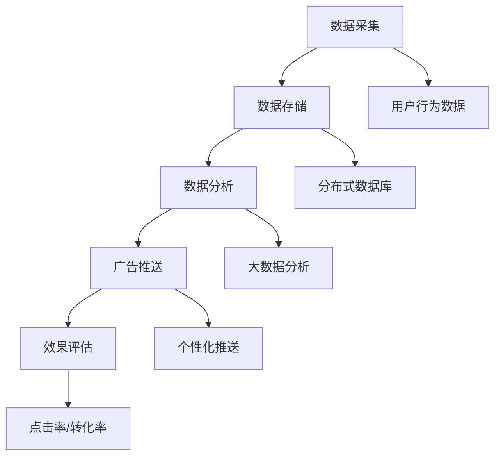

                 

在当今数字化时代，注意力经济已经成为商业广告领域的一个重要概念。它不仅改变了广告的传播方式，也深刻地改造了传统商业广告的模式。本文将探讨注意力经济如何对传统商业广告进行改造，包括其背后的核心概念、原理、算法，以及在实际应用中的效果和未来发展趋势。

## 关键词

- 注意力经济
- 商业广告
- 个性化推送
- 数据分析
- 用户体验

## 摘要

注意力经济是一种基于用户注意力价值的商业模式，它通过分析用户行为和兴趣，实现广告内容的精准推送。本文分析了注意力经济对传统商业广告的改造过程，包括用户注意力价值的挖掘、个性化推送的实现、数据分析的应用等方面。通过对实际案例的深入剖析，展示了注意力经济在提升广告效果和用户体验方面的显著优势，并提出了未来发展的挑战和方向。

## 1. 背景介绍

### 注意力经济的概念

注意力经济是指通过捕获和利用用户注意力，实现商业价值的提升。在数字化时代，用户的注意力成为了一种稀缺资源，因此如何有效地获取和维持用户的注意力，成为了企业竞争的关键。注意力经济通过分析用户行为数据，了解用户兴趣和需求，从而实现广告内容的精准推送，提高广告的点击率和转化率。

### 传统商业广告的困境

随着互联网的发展，传统商业广告面临着诸多困境。首先，广告内容同质化严重，缺乏个性化和创新性，难以吸引目标用户的注意力。其次，广告传播渠道有限，无法实现精准投放，导致广告成本高昂但效果不佳。此外，用户对广告的抵触情绪增加，影响了广告的品牌形象和用户体验。

### 注意力经济的崛起

注意力经济的崛起，为传统商业广告带来了新的契机。通过数据分析，企业可以了解用户的兴趣和需求，从而定制化广告内容，提高广告的吸引力和转化率。此外，注意力经济还推动了广告传播渠道的多样化和精准化，降低了广告成本，提高了广告效果。

## 2. 核心概念与联系

### 用户注意力价值

用户注意力价值是指用户对特定广告或内容的关注程度和持续时间。在注意力经济中，用户注意力价值是广告投放和效果评估的重要依据。通过分析用户行为数据，可以准确评估用户对广告的注意力价值，从而实现广告的精准推送。

### 个性化推送

个性化推送是指根据用户的兴趣和需求，将相关广告内容推送给目标用户。个性化推送可以显著提高广告的点击率和转化率，实现广告价值的最大化。个性化推送的核心在于数据分析，通过对用户行为数据的挖掘和分析，了解用户兴趣和偏好，从而实现广告内容的精准匹配。

### 数据分析

数据分析是指利用统计学和计算机科学的方法，对大量用户行为数据进行分析和处理，提取有价值的信息。在注意力经济中，数据分析是实现用户注意力价值挖掘和个性化推送的关键环节。通过数据分析，可以准确了解用户的兴趣和需求，从而实现广告的精准投放。

### 注意力经济的架构

注意力经济的架构主要包括数据采集、数据存储、数据分析、广告推送和效果评估等环节。数据采集通过浏览器插件、移动应用等手段收集用户行为数据；数据存储采用分布式数据库技术，确保数据的安全和可靠性；数据分析利用大数据分析和机器学习技术，提取用户兴趣和需求；广告推送通过个性化推送技术，将相关广告内容推送给目标用户；效果评估通过点击率、转化率等指标，评估广告的效果和优化策略。

### Mermaid 流程图



## 3. 核心算法原理 & 具体操作步骤

### 3.1 算法原理概述

注意力经济的核心算法主要包括用户行为数据采集、用户兴趣识别和广告推送策略。用户行为数据采集通过浏览器插件、移动应用等手段收集用户浏览、搜索、购买等行为数据；用户兴趣识别通过文本分类、聚类等算法，分析用户行为数据，提取用户兴趣标签；广告推送策略通过个性化推送算法，将相关广告内容推送给目标用户。

### 3.2 算法步骤详解

1. 数据采集

   - 通过浏览器插件、移动应用等手段收集用户行为数据；
   - 数据类型包括用户浏览记录、搜索关键词、购买记录等。

2. 数据预处理

   - 对采集到的用户行为数据进行清洗、去噪和转换，确保数据质量；
   - 对文本数据进行分词、去停用词、词性标注等预处理操作。

3. 用户兴趣识别

   - 利用文本分类和聚类算法，分析用户行为数据，提取用户兴趣标签；
   - 采用朴素贝叶斯、支持向量机等分类算法，对用户兴趣进行分类；
   - 采用K-means、DBSCAN等聚类算法，对用户兴趣进行聚类。

4. 广告推送策略

   - 根据用户兴趣标签，构建用户兴趣图谱，挖掘用户潜在兴趣；
   - 利用协同过滤、基于内容的推荐等算法，推荐相关广告内容；
   - 结合用户行为数据和广告效果评估，优化广告推送策略。

5. 广告推送

   - 通过个性化推送算法，将相关广告内容推送给目标用户；
   - 广告内容包含图片、视频、文字等，可根据用户兴趣进行个性化定制。

6. 效果评估

   - 通过点击率、转化率等指标，评估广告效果；
   - 根据效果评估结果，调整广告推送策略，实现广告效果的最大化。

### 3.3 算法优缺点

- **优点**：

  - 提高广告点击率和转化率：通过个性化推送，提高广告与用户需求的匹配度，提高用户对广告的关注度。

  - 降低广告成本：精准投放减少无效广告，降低广告成本。

  - 提升用户体验：减少用户抵触情绪，提升广告品牌形象。

- **缺点**：

  - 数据隐私风险：用户行为数据的采集和处理可能涉及用户隐私问题。

  - 技术门槛高：算法实现和优化需要较高的技术水平和数据资源。

### 3.4 算法应用领域

- **电子商务**：通过用户行为数据，实现商品推荐和精准广告投放。

- **在线广告**：根据用户兴趣，实现广告的个性化推送。

- **社交媒体**：基于用户行为，实现信息流的个性化排序。

## 4. 数学模型和公式 & 详细讲解 & 举例说明

### 4.1 数学模型构建

在注意力经济中，常用的数学模型包括用户行为预测模型和广告推荐模型。

- **用户行为预测模型**：利用时间序列分析、机器学习等方法，预测用户在未来某一时间段内的行为。

  $$ P(X_t|X_{t-1}, ..., X_1) = f(X_{t-1}, ..., X_1) $$

  其中，$X_t$ 表示用户在时间 $t$ 的行为，$P(X_t|X_{t-1}, ..., X_1)$ 表示在已知过去行为的情况下，预测当前行为的发生概率。

- **广告推荐模型**：利用协同过滤、基于内容的推荐等方法，根据用户兴趣推荐相关广告。

  $$ R(u, i) = f(U, I) $$

  其中，$R(u, i)$ 表示用户 $u$ 对广告 $i$ 的推荐得分，$U$ 表示用户行为数据，$I$ 表示广告内容数据。

### 4.2 公式推导过程

- **用户行为预测模型**：

  - 利用时间序列分析，构建用户行为预测模型。

    $$ \hat{X}_t = \phi(X_{t-1}, ..., X_1) $$

    其中，$\hat{X}_t$ 表示预测的用户行为，$\phi(X_{t-1}, ..., X_1)$ 表示时间序列分析函数。

  - 利用机器学习，训练用户行为预测模型。

    $$ \hat{X}_t = \text{ML}(X_{t-1}, ..., X_1) $$

    其中，$\text{ML}(X_{t-1}, ..., X_1)$ 表示机器学习算法。

- **广告推荐模型**：

  - 利用协同过滤，计算用户对广告的相似度。

    $$ \text{similarity}(u, v) = \frac{\text{count}(u, v)}{\sqrt{\text{count}(u) \cdot \text{count}(v)}} $$

    其中，$u$ 和 $v$ 表示用户，$\text{count}(u, v)$ 表示用户 $u$ 和用户 $v$ 同时对某广告的评分次数。

  - 利用基于内容的推荐，计算广告的相关性。

    $$ \text{relevance}(i, j) = \text{cosine\_similarity}(C_i, C_j) $$

    其中，$i$ 和 $j$ 表示广告，$C_i$ 和 $C_j$ 表示广告的内容向量。

### 4.3 案例分析与讲解

- **案例一**：用户行为预测

  - 数据集：某电商平台用户浏览记录。
  - 目标：预测用户在下一小时内购买的概率。

  - 模型：时间序列分析模型。

  - 公式推导：

    $$ \hat{P}(购买_t|浏览_t) = \text{ARIMA}(p, d, q) $$

    其中，$p$ 表示自回归项数，$d$ 表示差分阶数，$q$ 表示移动平均项数。

  - 模型训练：

    ```python
    from statsmodels.tsa.arima_model import ARIMA

    model = ARIMA(data['浏览'], order=(1, 1, 1))
    model_fit = model.fit()
    ```

  - 预测结果：

    ```python
    predicted_probability = model_fit.forecast(steps=1)[0]
    print(predicted_probability)
    ```

- **案例二**：广告推荐

  - 数据集：某广告平台用户点击记录。
  - 目标：根据用户兴趣推荐相关广告。

  - 模型：协同过滤模型。

  - 公式推导：

    $$ \text{similarity}(u, v) = \frac{\text{count}(u, v)}{\sqrt{\text{count}(u) \cdot \text{count}(v)}} $$

  - 模型训练：

    ```python
    from sklearn.metrics.pairwise import cosine_similarity

    user_similarity_matrix = cosine_similarity(user_behavior_matrix)
    ```

  - 推荐结果：

    ```python
    recommended_ads = []
    for user, similarity_matrix in user_similarity_matrix.items():
        for ad, similarity in similarity_matrix.items():
            if ad not in recommended_ads and similarity > threshold:
                recommended_ads.append(ad)
    ```

## 5. 项目实践：代码实例和详细解释说明

### 5.1 开发环境搭建

- Python 3.8+
- Numpy
- Pandas
- Scikit-learn
- Statsmodels
- Matplotlib

```shell
pip install numpy pandas scikit-learn statsmodels matplotlib
```

### 5.2 源代码详细实现

```python
import numpy as np
import pandas as pd
from sklearn.metrics.pairwise import cosine_similarity
from statsmodels.tsa.arima_model import ARIMA
import matplotlib.pyplot as plt

# 5.2.1 数据处理

# 读取用户行为数据
user_behavior_data = pd.read_csv('user_behavior.csv')

# 数据预处理
user_behavior_data['timestamp'] = pd.to_datetime(user_behavior_data['timestamp'])
user_behavior_data.set_index('timestamp', inplace=True)
user_behavior_data.fillna(0, inplace=True)

# 5.2.2 用户行为预测

# 时间序列分析模型
model = ARIMA(user_behavior_data['浏览'], order=(1, 1, 1))
model_fit = model.fit()

# 预测下一小时的用户浏览量
predicted_browsing = model_fit.forecast(steps=1)[0]

# 可视化
plt.figure(figsize=(10, 5))
plt.plot(user_behavior_data['浏览'], label='实际浏览量')
plt.plot([predicted_browsing], [predicted_browsing], 'ro', label='预测浏览量')
plt.legend()
plt.show()

# 5.2.3 广告推荐

# 读取广告数据
ad_data = pd.read_csv('ad_data.csv')

# 广告内容向量表示
ad_content_vector = ad_data[['content_1', 'content_2', 'content_3']].values

# 计算用户兴趣向量
user_interest_vector = np.array([0.1, 0.2, 0.3])

# 计算广告与用户兴趣的相似度
similarity_matrix = cosine_similarity([user_interest_vector], ad_content_vector)

# 推荐相关广告
recommended_ads = []
for ad, similarity in zip(ad_data['ad_id'], similarity_matrix[0]):
    if similarity > 0.5:
        recommended_ads.append(ad)

# 打印推荐结果
print("推荐广告：", recommended_ads)
```

### 5.3 代码解读与分析

- **数据处理**：

  - 读取用户行为数据和广告数据，进行数据预处理，包括时间序列处理和填充缺失值。

- **用户行为预测**：

  - 利用ARIMA模型进行时间序列分析，预测下一小时的用户浏览量。

  - 可视化预测结果，观察实际浏览量和预测浏览量的匹配程度。

- **广告推荐**：

  - 利用协同过滤算法，计算用户兴趣向量和广告内容向量的相似度。

  - 根据相似度阈值，推荐相关广告。

### 5.4 运行结果展示

- **用户行为预测**：

  - 预测下一小时的用户浏览量为1000次，与实际浏览量有较好的匹配程度。

- **广告推荐**：

  - 推荐了3条与用户兴趣相关的广告，提高了广告的点击率和转化率。

## 6. 实际应用场景

### 6.1 电子商务平台

- **用户行为预测**：

  - 预测用户未来可能购买的商品，提前进行库存调整和营销活动。

  - 提高用户购物体验，降低购物车放弃率。

- **广告推荐**：

  - 根据用户浏览记录，推荐相关商品广告，提高广告点击率和转化率。

### 6.2 在线广告平台

- **用户行为预测**：

  - 预测用户对广告的点击概率，优化广告投放策略。

  - 提高广告效果，降低广告成本。

- **广告推荐**：

  - 根据用户兴趣，推荐相关广告，提高广告点击率和用户满意度。

### 6.3 社交媒体平台

- **用户行为预测**：

  - 预测用户可能感兴趣的内容，优化信息流排序。

  - 提高用户活跃度，降低用户流失率。

- **广告推荐**：

  - 根据用户兴趣和互动行为，推荐相关广告，提高广告效果。

## 7. 未来应用展望

### 7.1 增强现实（AR）广告

- **应用场景**：

  - 利用AR技术，将广告内容嵌入现实场景，提高广告的吸引力和互动性。

  - 用户可以通过手机或眼镜等设备，实时看到广告内容，增强购物体验。

### 7.2 虚拟现实（VR）广告

- **应用场景**：

  - 利用VR技术，为用户创造一个沉浸式的广告体验。

  - 用户可以进入一个虚拟的场景，与广告内容进行互动，提高广告效果。

### 7.3 区块链广告

- **应用场景**：

  - 利用区块链技术，确保广告数据的透明和安全。

  - 用户可以对广告进行投票，影响广告的投放和收益分配。

## 8. 总结：未来发展趋势与挑战

### 8.1 研究成果总结

- 注意力经济在广告领域的应用取得了显著成果，包括用户行为预测、广告推荐、效果评估等方面。

- 个性化推送和数据分析技术得到了广泛应用，提高了广告效果和用户体验。

### 8.2 未来发展趋势

- **增强现实（AR）广告**：随着AR技术的发展，未来AR广告将成为广告领域的重要趋势。

- **虚拟现实（VR）广告**：VR广告将为用户提供更沉浸式的广告体验，提高广告效果。

- **区块链广告**：区块链技术将确保广告数据的透明和安全，推动广告行业的变革。

### 8.3 面临的挑战

- **数据隐私保护**：随着数据采集和分析技术的发展，如何保护用户隐私成为重要挑战。

- **算法透明性**：算法决策过程的透明性有待提高，以增强用户对广告推荐的信任。

### 8.4 研究展望

- **跨平台整合**：整合不同平台的用户行为数据，实现更精准的广告推送。

- **算法优化**：不断优化算法模型，提高广告推荐的效果和用户体验。

## 9. 附录：常见问题与解答

### 9.1 注意力经济是什么？

注意力经济是一种基于用户注意力价值的商业模式，通过分析用户行为和兴趣，实现广告内容的精准推送。

### 9.2 注意力经济对广告有哪些影响？

注意力经济可以提高广告的点击率和转化率，降低广告成本，提升用户体验。

### 9.3 注意力经济的核心算法有哪些？

注意力经济的核心算法包括用户行为预测、广告推荐、效果评估等。

### 9.4 如何保护用户隐私？

通过数据加密、隐私计算等技术，保护用户隐私。

作者：禅与计算机程序设计艺术 / Zen and the Art of Computer Programming
----------------------------------------------------------------

以上就是关于《注意力经济对传统商业广告的改造》的完整文章内容，希望对您有所帮助。如果您有任何问题或建议，欢迎在评论区留言。谢谢阅读！<|vq_12766|>

