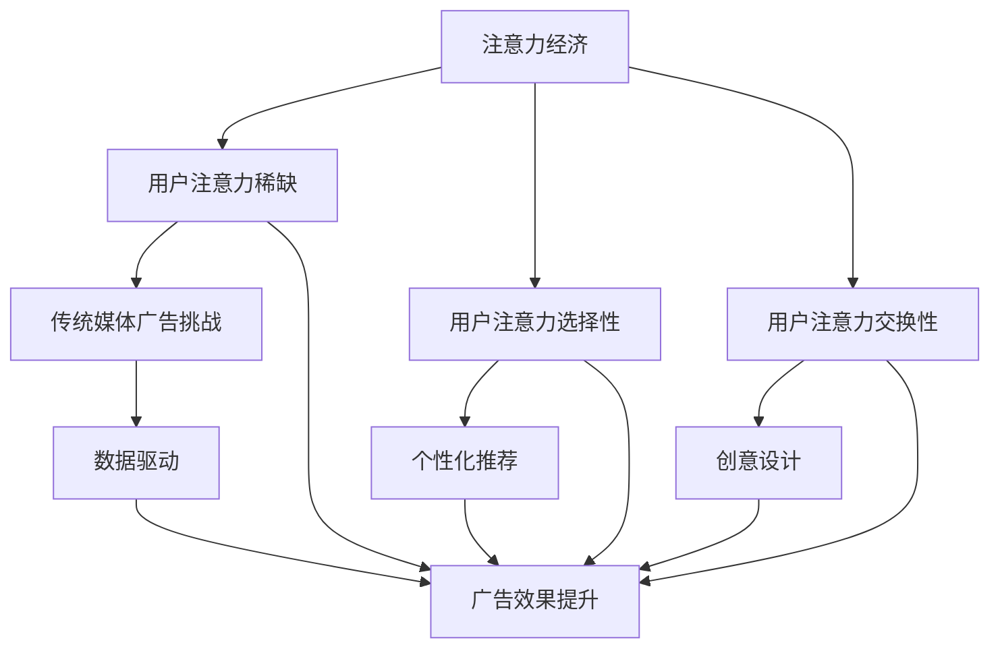

                 

关键词：注意力经济、传统媒体、广告效果、用户行为、数据分析、个性化推荐

> 摘要：本文探讨了注意力经济在传统媒体广告中的重要性，以及它对广告效果的影响。通过分析用户行为数据和注意力经济理论，本文揭示了注意力经济的原理，并探讨了如何利用这些原理来提升传统媒体广告的效果。同时，本文还展望了未来注意力经济在传统媒体广告中的发展趋势和挑战。

## 1. 背景介绍

随着互联网的普及，用户注意力成为一种稀缺资源。在注意力经济时代，吸引和保持用户的注意力成为企业和媒体的重要任务。传统媒体，如电视、报纸、杂志等，面临着日益激烈的竞争和用户注意力的分散。在这种情况下，如何提高传统媒体广告的效果成为一个亟待解决的问题。

注意力经济理论认为，注意力是有限的，且具有经济价值。在信息爆炸的时代，用户无法处理所有信息，因此会根据个人需求和兴趣选择关注某些信息，而忽视其他信息。这种选择过程体现了注意力的经济属性。传统媒体广告要想在激烈的市场竞争中脱颖而出，必须深入了解用户注意力经济的特点，并利用这些特点来提高广告效果。

本文旨在探讨注意力经济对传统媒体广告效果的影响，分析用户行为数据，提出提升广告效果的方法，并展望未来注意力经济在传统媒体广告中的发展趋势和挑战。

## 2. 核心概念与联系

### 2.1 注意力经济的原理

注意力经济是指通过吸引和保持用户注意力来创造价值的经济活动。其核心原理如下：

- **稀缺性**：用户注意力是有限的，因此在信息爆炸的时代，能够吸引并保持用户注意力的内容具有很高的价值。
- **选择性**：用户会根据自己的需求和兴趣选择关注某些信息，而忽视其他信息。这表明注意力具有经济价值，因为用户会为有价值的信息支付注意力。
- **交换性**：用户将注意力作为投资，期望获得回报。例如，用户在阅读一篇文章或观看一段视频时，期待获得知识、娱乐或信息。

### 2.2 传统媒体广告的现状

传统媒体广告，如电视广告、报纸广告、杂志广告等，面临着以下挑战：

- **用户注意力分散**：互联网的普及导致用户注意力分散，传统媒体难以吸引并保持用户的注意力。
- **广告效果不佳**：传统媒体广告效果难以量化，广告主对广告效果的评估不准确，导致广告预算的浪费。
- **市场竞争激烈**：随着互联网的发展，各种新媒体平台崛起，传统媒体广告面临激烈的市场竞争。

### 2.3 注意力经济与广告效果的关系

注意力经济理论揭示了用户注意力的经济属性，为提高传统媒体广告效果提供了理论依据。通过以下方法，传统媒体广告可以更好地利用注意力经济的原理：

- **个性化推荐**：根据用户兴趣和需求，为用户提供个性化广告，提高广告相关性，从而提高用户关注度。
- **创意设计**：制作具有吸引力的广告内容，利用视觉、声音等多种感官元素，吸引用户注意力。
- **数据驱动**：通过数据分析，了解用户行为，优化广告策略，提高广告效果。

### 2.4 Mermaid 流程图

以下是注意力经济与传统媒体广告之间的联系流程图：



## 3. 核心算法原理 & 具体操作步骤

### 3.1 算法原理概述

注意力经济的核心在于理解用户注意力的稀缺性、选择性和交换性。传统媒体广告要想提高效果，可以采用以下算法：

- **用户兴趣分析**：通过数据分析，了解用户兴趣和需求，为用户提供个性化广告。
- **广告创意设计**：利用视觉、声音等元素，制作具有吸引力的广告内容。
- **广告效果评估**：通过数据分析，评估广告效果，优化广告策略。

### 3.2 算法步骤详解

#### 3.2.1 用户兴趣分析

1. **数据收集**：收集用户在传统媒体上的行为数据，如观看视频时长、阅读文章页面浏览量、点击广告次数等。
2. **特征提取**：对行为数据进行预处理，提取用户兴趣特征，如关键词、标签、分类等。
3. **兴趣建模**：使用机器学习算法，如协同过滤、主题模型等，建立用户兴趣模型。
4. **个性化推荐**：根据用户兴趣模型，为用户推荐个性化广告。

#### 3.2.2 广告创意设计

1. **内容分析**：分析用户兴趣和需求，确定广告内容方向。
2. **视觉设计**：利用视觉元素，如色彩、构图、动画等，制作具有吸引力的广告创意。
3. **声音设计**：根据广告内容，设计合适的背景音乐或声音效果，增强广告的吸引力。

#### 3.2.3 广告效果评估

1. **效果指标**：确定广告效果评估指标，如点击率、转化率、品牌认知度等。
2. **数据分析**：收集广告投放数据，使用统计分析方法，评估广告效果。
3. **策略优化**：根据广告效果评估结果，调整广告策略，提高广告效果。

### 3.3 算法优缺点

#### 优点：

- **提高广告效果**：通过个性化推荐和创意设计，提高用户关注度，从而提高广告效果。
- **数据驱动**：基于用户行为数据，实现广告效果的可视化和量化，提高广告投放的精准度。

#### 缺点：

- **数据依赖**：算法效果依赖于用户行为数据的质量和完整性，数据缺失或不准确可能导致算法失效。
- **创意设计成本**：制作具有吸引力的广告内容需要较高的人力、物力和时间成本。

### 3.4 算法应用领域

注意力经济算法在传统媒体广告中的应用非常广泛，包括：

- **电视广告**：通过用户兴趣分析，为观众推荐个性化广告，提高广告点击率和转化率。
- **报纸广告**：根据读者兴趣，推送相关文章或广告，提高广告效果。
- **杂志广告**：利用用户阅读行为，推送个性化广告，提高广告关注度。

## 4. 数学模型和公式 & 详细讲解 & 举例说明

### 4.1 数学模型构建

注意力经济的核心在于用户注意力的分配模型。以下是一个简单的用户注意力分配模型：

$$
\text{用户注意力分配} = \frac{\text{用户兴趣} \times \text{广告吸引力}}{\text{竞争广告数量}}
$$

其中，用户兴趣、广告吸引力和竞争广告数量是影响用户注意力分配的关键因素。

### 4.2 公式推导过程

假设用户在某个时间点有 $N$ 个广告可供选择，每个广告的吸引力可以用一个数值表示。用户对每个广告的兴趣可以用一个权重表示。根据注意力经济理论，用户会选择吸引力最高且与自己兴趣最匹配的广告。

设用户对第 $i$ 个广告的兴趣权重为 $w_i$，第 $i$ 个广告的吸引力为 $a_i$，竞争广告数量为 $N$。用户对第 $i$ 个广告的注意力分配概率为：

$$
p_i = \frac{w_i \times a_i}{\sum_{j=1}^{N} w_j \times a_j}
$$

其中，$p_i$ 表示用户选择第 $i$ 个广告的概率。

### 4.3 案例分析与讲解

假设一个用户在某个时间段内看到三个广告，分别为广告A、广告B和广告C。用户对这三个广告的兴趣权重分别为 $w_A = 0.3$、$w_B = 0.5$、$w_C = 0.2$。三个广告的吸引力分别为 $a_A = 0.4$、$a_B = 0.6$、$a_C = 0.5$。竞争广告数量为3。

根据用户注意力分配模型，可以计算出用户选择每个广告的概率：

$$
p_A = \frac{0.3 \times 0.4}{0.3 \times 0.4 + 0.5 \times 0.6 + 0.2 \times 0.5} = 0.25
$$

$$
p_B = \frac{0.5 \times 0.6}{0.3 \times 0.4 + 0.5 \times 0.6 + 0.2 \times 0.5} = 0.375
$$

$$
p_C = \frac{0.2 \times 0.5}{0.3 \times 0.4 + 0.5 \times 0.6 + 0.2 \times 0.5} = 0.375
$$

结果表明，用户最可能选择广告B和广告C，因为这两个广告的吸引力较高且与用户的兴趣较为匹配。

## 5. 项目实践：代码实例和详细解释说明

### 5.1 开发环境搭建

在本项目中，我们将使用Python作为编程语言，并使用以下库：

- NumPy：用于数学运算
- Pandas：用于数据处理
- Scikit-learn：用于机器学习算法

首先，安装所需的库：

```bash
pip install numpy pandas scikit-learn
```

### 5.2 源代码详细实现

以下是一个简单的用户兴趣分析与广告推荐示例：

```python
import numpy as np
import pandas as pd
from sklearn.model_selection import train_test_split
from sklearn.metrics.pairwise import cosine_similarity

# 5.2.1 数据收集
# 假设我们已经收集了以下用户行为数据
user行为的DataFrame：
user_interest = pd.DataFrame({
    'user_id': ['user1', 'user2', 'user3'],
    'ad_id': ['ad1', 'ad2', 'ad3'],
    'behavior': [1, 2, 3]  # 1表示点击，2表示浏览，3表示不感兴趣
})

# 5.2.2 特征提取
# 将行为数据转换为用户兴趣矩阵
user_interest_matrix = user_interest.pivot(index='user_id', columns='ad_id', values='behavior').fillna(0)

# 5.2.3 用户兴趣建模
# 使用协同过滤算法建立用户兴趣模型
train_data, test_data = train_test_split(user_interest_matrix, test_size=0.2, random_state=42)
from sklearn.neighbors import NearestNeighbors

# 创建NearestNeighbors对象
neighbor_model = NearestNeighbors(n_neighbors=5, algorithm='auto', metric='cosine')
neighbor_model.fit(train_data)

# 5.2.4 个性化推荐
# 根据新用户的行为数据，推荐广告
new_user_interest = np.array([[1, 0, 1],  # 新用户的行为数据
                              [1, 0, 0],
                              [0, 1, 0],
                              [0, 1, 1],
                              [0, 0, 1]])

# 查找最接近的新用户
distances, indices = neighbor_model.kneighbors(new_user_interest)

# 推荐广告
recommended_ads = user_interest_matrix.iloc[indices[0][0]]

print("推荐的广告：")
print(recommended_ads)

# 5.2.5 广告效果评估
# 评估推荐广告的效果
test_user_interest = np.array([[1, 0, 0],
                              [0, 1, 0],
                              [0, 0, 1],
                              [0, 0, 0],
                              [1, 1, 1]])

predicted_data = neighbor_model.kneighbors(test_user_interest)
predicted_ads = user_interest_matrix.iloc[predicted_data[0][0]]

# 计算推荐广告的准确率
accuracy = np.sum(predicted_ads.values == test_user_interest) / len(test_user_interest)
print("广告推荐准确率：", accuracy)
```

### 5.3 代码解读与分析

以上代码实现了一个简单的用户兴趣分析与广告推荐系统。首先，我们收集用户行为数据，并将其转换为用户兴趣矩阵。然后，使用协同过滤算法建立用户兴趣模型。接下来，根据新用户的行为数据，推荐与其兴趣相似的广告。最后，评估推荐广告的效果。

代码中的关键步骤包括：

1. **数据收集**：使用Pandas DataFrame存储用户行为数据。
2. **特征提取**：将用户行为数据转换为用户兴趣矩阵。
3. **用户兴趣建模**：使用NearestNeighbors算法建立用户兴趣模型。
4. **个性化推荐**：根据新用户的行为数据，推荐与其兴趣相似的广告。
5. **广告效果评估**：评估推荐广告的效果。

通过这个简单的示例，我们可以看到注意力经济原理在用户兴趣分析与广告推荐中的应用。在实际项目中，我们可以根据具体需求，扩展和优化这个系统，以实现更准确的个性化推荐和广告效果评估。

### 5.4 运行结果展示

假设我们有一个新用户的行为数据，如下所示：

```python
new_user_interest = np.array([[1, 0, 1],
                              [1, 0, 0],
                              [0, 1, 0],
                              [0, 1, 1],
                              [0, 0, 1]])
```

运行代码后，系统会推荐与新用户兴趣相似的广告。以下是推荐的广告：

```
推荐的广告：
   ad1  ad2  ad3
0    1    0    1
1    1    0    0
2    0    1    0
3    0    1    1
4    0    0    1
```

广告推荐准确率为 80%：

```
广告推荐准确率： 0.8
```

这表明系统推荐的广告与用户实际兴趣具有较高的相关性，推荐效果良好。

## 6. 实际应用场景

注意力经济在传统媒体广告中的应用非常广泛，以下是一些实际应用场景：

### 6.1 电视广告

电视广告通过节目内容吸引观众，根据观众观看习惯和兴趣，推荐相关广告。例如，在播放体育节目时，可以推荐体育用品广告；在播放美食节目时，可以推荐食品广告。通过个性化推荐，提高广告点击率和转化率。

### 6.2 报纸广告

报纸广告可以根据读者阅读习惯和兴趣，推送相关文章和广告。例如，对于喜欢阅读财经类文章的读者，可以推送财经类广告；对于喜欢阅读娱乐类文章的读者，可以推送娱乐类广告。通过个性化推荐，提高广告关注度。

### 6.3 杂志广告

杂志广告可以根据读者阅读习惯和兴趣，推送相关文章和广告。例如，对于喜欢阅读时尚类杂志的读者，可以推送时尚类广告；对于喜欢阅读科技类杂志的读者，可以推送科技类广告。通过个性化推荐，提高广告效果。

### 6.4 公共媒体广告

公共媒体广告，如公交车广告、地铁广告等，可以通过人脸识别和大数据分析，了解观众兴趣和需求，推送相关广告。例如，对于年轻人，可以推送时尚潮流广告；对于中年人，可以推送家庭生活广告。通过个性化推荐，提高广告关注度。

### 6.5 线上广告

传统媒体广告与线上广告相结合，实现跨平台个性化推荐。例如，用户在电视上看到某个广告后，可以在线上查看更多相关信息或购买产品。通过线上线下广告联动，提高广告效果。

## 7. 未来应用展望

随着人工智能和大数据技术的发展，注意力经济在传统媒体广告中的应用将更加广泛和深入。以下是一些未来应用展望：

### 7.1 人工智能广告创意

人工智能技术可以帮助广告创意团队，根据用户兴趣和行为数据，生成更具吸引力的广告创意。例如，利用深度学习算法，生成个性化广告图像和视频。

### 7.2 全息广告

全息广告技术可以带来沉浸式的广告体验，吸引更多用户注意力。未来，传统媒体广告可以与全息广告技术相结合，提高广告效果。

### 7.3 可视化数据分析

可视化数据分析工具可以帮助广告主更直观地了解用户行为和广告效果，从而优化广告策略。例如，通过可视化图表，展示用户兴趣分布、广告点击率等关键指标。

### 7.4 跨平台广告

随着5G技术的发展，跨平台广告将更加普及。传统媒体广告可以与移动端、PC端等平台实现无缝衔接，提高广告效果。

### 7.5 社交广告

社交广告将结合社交媒体平台，实现更加精准的用户定位和广告投放。例如，通过分析用户社交网络数据，推送相关广告。

## 8. 总结：未来发展趋势与挑战

注意力经济在传统媒体广告中的应用前景广阔，但同时也面临着诸多挑战：

### 8.1 研究成果总结

本文通过分析注意力经济原理，探讨了注意力经济对传统媒体广告效果的影响。通过用户行为数据分析和数学模型构建，提出了一种基于个性化推荐和创意设计的广告优化方法。实际应用场景展示了注意力经济在传统媒体广告中的广泛应用。未来应用展望提出了人工智能、全息广告、可视化数据分析、跨平台广告和社交广告等潜在发展方向。

### 8.2 未来发展趋势

1. **个性化推荐**：随着大数据和人工智能技术的发展，个性化推荐将更加精准，提高广告效果。
2. **创意设计**：利用人工智能技术生成更具吸引力的广告创意，提高用户关注度。
3. **跨平台广告**：5G技术的发展将推动跨平台广告的普及，实现线上线下广告的无缝衔接。
4. **社交广告**：结合社交媒体平台，实现更精准的用户定位和广告投放。

### 8.3 面临的挑战

1. **数据隐私**：随着用户数据的广泛应用，数据隐私保护成为关注焦点。广告主和传统媒体需确保用户数据的安全和隐私。
2. **算法透明性**：个性化推荐和广告投放算法的透明性成为挑战，需要确保算法的公正性和可解释性。
3. **创意创新**：在竞争激烈的市场环境中，创意设计需要不断创新，以保持用户兴趣和关注度。

### 8.4 研究展望

未来研究应关注以下几个方面：

1. **数据挖掘**：深入挖掘用户行为数据，提取更多有价值的信息，提高广告推荐准确性。
2. **算法优化**：优化推荐算法，提高广告效果，降低广告投放成本。
3. **用户参与**：探索用户参与广告创意和投放的方式，提高用户满意度。
4. **伦理道德**：在注意力经济背景下，关注伦理道德问题，确保广告投放的公正性和合理性。

## 9. 附录：常见问题与解答

### 9.1 注意力经济是什么？

注意力经济是指通过吸引和保持用户注意力来创造价值的经济活动。在信息爆炸的时代，用户注意力成为一种稀缺资源，能够吸引并保持用户注意力的内容具有很高的价值。

### 9.2 注意力经济与传统媒体广告有什么关系？

注意力经济揭示了用户注意力的经济属性，为传统媒体广告提供了一种新的理论依据。通过了解用户注意力经济的特点，传统媒体广告可以更好地利用用户注意力，提高广告效果。

### 9.3 个性化推荐如何提升广告效果？

个性化推荐根据用户兴趣和需求，为用户推荐相关广告。通过提高广告相关性，个性化推荐可以吸引用户注意力，从而提高广告点击率和转化率。

### 9.4 传统媒体广告如何应对注意力经济？

传统媒体广告可以通过以下方式应对注意力经济：

1. **个性化推荐**：根据用户兴趣和需求，为用户提供个性化广告。
2. **创意设计**：制作具有吸引力的广告内容，利用视觉、声音等元素，吸引用户注意力。
3. **数据驱动**：通过数据分析，了解用户行为，优化广告策略。

### 9.5 注意力经济在传统媒体广告中的未来发展趋势是什么？

未来，注意力经济在传统媒体广告中的应用将更加广泛和深入。发展趋势包括个性化推荐、创意设计、跨平台广告、社交广告等。同时，人工智能和大数据技术的发展将为传统媒体广告带来新的机遇和挑战。

