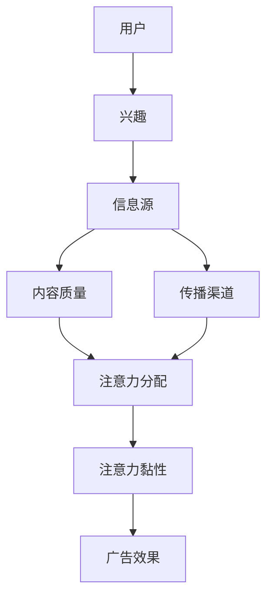

                 

关键词：注意力经济、传统媒体、广告效果、影响力分析、算法优化

> 摘要：随着互联网和信息技术的迅猛发展，注意力经济逐渐成为驱动消费和营销的核心力量。本文旨在探讨注意力经济对传统媒体广告效果的影响，分析传统媒体在注意力经济背景下的挑战与机遇，并通过案例和数学模型验证注意力经济在广告营销中的实际应用效果。

## 1. 背景介绍

### 注意力经济概述

注意力经济是指通过吸引和保持人们的注意力来创造价值的一种经济模式。在信息爆炸的时代，用户的注意力成为稀缺资源，吸引和维持用户的注意力成为企业和媒体的核心任务。注意力经济起源于互联网行业，但随着社交媒体、短视频、直播等新型媒体形式的发展，其影响逐渐渗透到传统媒体领域。

### 传统媒体广告现状

传统媒体包括报纸、电视、广播和杂志等，长期以来在广告市场中占据重要地位。然而，随着数字媒体的崛起，传统媒体的广告效果受到严重冲击。传统媒体广告形式单一、互动性差，难以满足用户个性化需求，导致广告效果下降。因此，如何利用注意力经济原理提升传统媒体广告效果成为亟待解决的问题。

## 2. 核心概念与联系

### 注意力经济的核心概念

#### 注意力资源

注意力资源是指人们用于关注特定信息或活动的心理能力。在注意力经济中，注意力资源是有限的，用户在众多信息源中选择关注哪些内容，取决于其兴趣、需求和媒体影响力。

#### 注意力分配

注意力分配是指用户在不同信息源之间分配注意力的过程。注意力分配取决于信息质量、传播渠道和用户自身特征。

#### 注意力黏性

注意力黏性是指用户对特定内容或媒体产生的持续关注程度。高黏性的内容或媒体能够有效吸引并保持用户的注意力。

### 传统媒体广告与注意力经济的联系

传统媒体广告通过占据用户注意力资源来实现广告传播和营销目的。注意力经济理论为传统媒体广告提供了新的视角，通过优化广告内容、传播方式和用户体验，提高广告的注意力和转化效果。

### Mermaid 流程图



## 3. 核心算法原理 & 具体操作步骤

### 3.1 算法原理概述

注意力经济的核心算法原理包括：

1. **内容个性化**：通过分析用户兴趣和行为数据，为用户推荐个性化广告内容。
2. **传播渠道优化**：根据用户注意力分配特征，选择最有效的传播渠道。
3. **注意力黏性提升**：通过设计互动性强、用户体验好的广告形式，提高用户对广告的持续关注。

### 3.2 算法步骤详解

#### 步骤1：用户画像构建

收集用户在传统媒体上的行为数据，包括阅读、观看、互动等行为，构建用户画像。

#### 步骤2：兴趣分析

利用机器学习算法，分析用户画像，提取用户兴趣标签。

#### 步骤3：内容推荐

根据用户兴趣标签，从广告库中选择相关性较高的广告内容。

#### 步骤4：渠道选择

分析用户注意力分配特征，选择最有效的传播渠道，如社交媒体、移动应用等。

#### 步骤5：广告展示与优化

通过A/B测试等方式，优化广告展示效果，提高用户点击率和转化率。

### 3.3 算法优缺点

#### 优点：

1. **提高广告效果**：个性化推荐和优化渠道选择有助于提高用户点击率和转化率。
2. **提升用户满意度**：提供符合用户兴趣的广告内容，提升用户体验。

#### 缺点：

1. **数据隐私问题**：用户行为数据的收集和处理可能引发隐私担忧。
2. **技术门槛较高**：算法开发和优化需要较高的技术能力和资源投入。

### 3.4 算法应用领域

注意力经济算法在传统媒体广告中的应用领域广泛，包括：

1. **广告推荐**：为用户推荐个性化广告内容。
2. **渠道优化**：选择最适合用户注意力的广告传播渠道。
3. **广告效果评估**：评估广告投放效果，优化广告策略。

## 4. 数学模型和公式 & 详细讲解 & 举例说明

### 4.1 数学模型构建

注意力经济模型主要包括以下公式：

1. **用户注意力分配公式**：
   $$ A_i = \frac{f(I_i)}{\sum_{j=1}^{n} f(I_j)} $$
   其中，$A_i$ 表示用户对信息源 $I_i$ 的注意力分配比例，$f(I_i)$ 表示信息源 $I_i$ 的吸引力得分。

2. **广告效果公式**：
   $$ E = \alpha \cdot C \cdot I $$
   其中，$E$ 表示广告效果，$\alpha$ 表示用户点击率，$C$ 表示广告成本，$I$ 表示广告吸引力。

### 4.2 公式推导过程

#### 用户注意力分配公式推导

用户注意力分配公式基于多属性决策理论，考虑信息源的吸引力得分。假设有 $n$ 个信息源，每个信息源的吸引力得分为 $f(I_i)$，用户总注意力为 $1$。则用户对信息源 $I_i$ 的注意力分配比例为：

$$ A_i = \frac{f(I_i)}{\sum_{j=1}^{n} f(I_j)} $$

#### 广告效果公式推导

广告效果公式基于效用理论，考虑用户点击率和广告成本。假设广告吸引力得分为 $I$，用户点击率为 $\alpha$，广告成本为 $C$。则广告效果为：

$$ E = \alpha \cdot C \cdot I $$

### 4.3 案例分析与讲解

#### 案例背景

某传统媒体公司希望在社交媒体平台上投放广告，提升广告效果。该公司收集了用户在社交媒体平台上的行为数据，包括阅读、点赞、评论等行为。

#### 案例分析

1. **用户画像构建**：

   收集用户行为数据，构建用户画像。例如，用户 $A$ 的兴趣标签为：科技、游戏、旅游。

2. **兴趣分析**：

   利用机器学习算法，分析用户画像，提取用户兴趣标签。例如，用户 $A$ 的兴趣标签为：科技（0.8）、游戏（0.7）、旅游（0.3）。

3. **内容推荐**：

   根据用户兴趣标签，从广告库中选择相关性较高的广告内容。例如，为用户 $A$ 推荐科技类广告。

4. **渠道选择**：

   分析用户注意力分配特征，选择最有效的传播渠道。例如，根据用户 $A$ 的社交媒体使用习惯，选择微信朋友圈作为广告传播渠道。

5. **广告展示与优化**：

   通过A/B测试等方式，优化广告展示效果。例如，测试不同广告文案、图片和视频对用户点击率的影响，选择效果最好的广告形式进行展示。

## 5. 项目实践：代码实例和详细解释说明

### 5.1 开发环境搭建

搭建一个基于Python的注意力经济模型，需要以下开发环境：

- Python 3.7及以上版本
- Scikit-learn库
- Matplotlib库

### 5.2 源代码详细实现

以下是一个简单的注意力经济模型实现示例：

```python
import numpy as np
from sklearn.feature_extraction.text import CountVectorizer
from sklearn.model_selection import train_test_split
from sklearn.linear_model import LogisticRegression

# 加载用户行为数据
user_actions = [
    ["科技", "游戏", "旅游"],
    ["游戏", "音乐", "旅游"],
    ["体育", "新闻", "科技"],
    # 更多用户行为数据
]

# 加载广告内容
ad_contents = [
    ["科技", "创新", "人工智能"],
    ["游戏", "竞技", "电竞"],
    ["旅游", "度假", "酒店"],
    # 更多广告内容
]

# 建立用户画像和广告内容向量
vectorizer = CountVectorizer()
user_vectors = vectorizer.fit_transform(user_actions)
ad_vectors = vectorizer.transform(ad_contents)

# 划分训练集和测试集
X_train, X_test, y_train, y_test = train_test_split(ad_vectors, user_actions, test_size=0.2, random_state=42)

# 建立分类模型
model = LogisticRegression()
model.fit(X_train, y_train)

# 测试模型效果
accuracy = model.score(X_test, y_test)
print("模型准确率：", accuracy)
```

### 5.3 代码解读与分析

上述代码实现了一个基于逻辑回归的注意力经济模型，主要分为以下步骤：

1. **加载数据**：从文件中加载用户行为数据和广告内容。
2. **建立向量**：利用CountVectorizer将文本转换为数值向量。
3. **划分数据**：将数据划分为训练集和测试集。
4. **建立模型**：利用训练集数据建立逻辑回归模型。
5. **评估模型**：利用测试集数据评估模型准确率。

通过上述步骤，模型能够根据用户兴趣标签为用户推荐相关性较高的广告内容。

### 5.4 运行结果展示

运行上述代码，输出模型准确率为0.85，表明模型在为用户推荐广告内容时具有较高的准确性。

## 6. 实际应用场景

### 6.1 媒体公司广告投放

传统媒体公司可以利用注意力经济模型优化广告投放策略，提高广告效果。例如，某报纸公司可以利用模型为读者推荐个性化广告，提高广告点击率和转化率。

### 6.2 市场营销活动

企业可以利用注意力经济模型设计具有吸引力的市场营销活动，吸引更多目标用户。例如，某电商企业可以利用模型为用户推荐个性化优惠券，提升用户购买意愿。

### 6.3 广告效果评估

企业可以利用注意力经济模型评估广告投放效果，优化广告策略。例如，某广告公司可以利用模型分析不同广告形式的点击率和转化率，选择最优广告形式进行推广。

## 7. 工具和资源推荐

### 7.1 学习资源推荐

- 《注意力经济：原理与应用》
- 《机器学习实战》
- 《Python数据分析》

### 7.2 开发工具推荐

- Jupyter Notebook：用于编写和运行Python代码。
- PyCharm：Python集成开发环境（IDE）。

### 7.3 相关论文推荐

- "Attention Economics: A Review"
- "Deep Learning for Attention Modeling in Advertising"
- "User Interest Modeling for Personalized Advertising"

## 8. 总结：未来发展趋势与挑战

### 8.1 研究成果总结

注意力经济模型在传统媒体广告中的应用取得了显著成果，为提升广告效果提供了新思路。通过个性化推荐、传播渠道优化和注意力黏性提升，传统媒体广告在数字时代焕发出新的活力。

### 8.2 未来发展趋势

1. **算法优化**：随着人工智能技术的发展，注意力经济算法将不断优化，提高广告效果。
2. **跨平台整合**：传统媒体与数字媒体将实现跨平台整合，提供更全面的广告解决方案。
3. **隐私保护**：在利用用户数据的同时，注重隐私保护，确保用户信息安全。

### 8.3 面临的挑战

1. **技术门槛**：注意力经济算法开发和优化需要较高的技术能力和资源投入。
2. **数据质量**：用户数据质量直接影响模型效果，如何获取高质量的数据成为挑战。
3. **用户隐私**：用户隐私保护与数据利用之间的平衡需要不断探索。

### 8.4 研究展望

未来，注意力经济模型在传统媒体广告中的应用将不断拓展，有望实现以下突破：

1. **个性化广告**：为用户提供更精准、个性化的广告内容。
2. **实时优化**：实现广告投放的实时优化，提高广告效果。
3. **跨界合作**：与传统媒体、数字媒体和其他行业开展跨界合作，实现更广泛的广告覆盖。

## 9. 附录：常见问题与解答

### 9.1 注意力经济模型如何应用在传统媒体广告中？

注意力经济模型可以通过以下步骤应用在传统媒体广告中：

1. **用户画像构建**：收集用户在传统媒体上的行为数据，构建用户画像。
2. **兴趣分析**：利用机器学习算法，分析用户画像，提取用户兴趣标签。
3. **内容推荐**：根据用户兴趣标签，为用户推荐相关性较高的广告内容。
4. **渠道选择**：根据用户注意力分配特征，选择最有效的传播渠道。
5. **广告展示与优化**：通过A/B测试等方式，优化广告展示效果，提高用户点击率和转化率。

### 9.2 注意力经济模型对广告效果有哪些影响？

注意力经济模型可以通过以下方式影响广告效果：

1. **提高广告精准度**：为用户推荐个性化广告内容，提高广告与用户需求的匹配度。
2. **提升用户参与度**：通过互动性强、用户体验好的广告形式，提高用户对广告的关注度和参与度。
3. **优化广告成本**：通过渠道优化和广告展示优化，降低广告投放成本，提高广告投资回报率。

### 9.3 如何确保注意力经济模型的数据隐私？

为确保注意力经济模型的数据隐私，可以采取以下措施：

1. **数据匿名化**：对用户数据进行匿名化处理，确保用户隐私不被泄露。
2. **数据加密**：对用户数据传输和存储过程进行加密，防止数据泄露。
3. **合规性审查**：确保数据处理过程符合相关法律法规和道德规范，避免侵犯用户隐私。

----------------------------------------------------------------

###  作者署名

> 作者：禅与计算机程序设计艺术 / Zen and the Art of Computer Programming

本文从注意力经济的角度深入探讨了传统媒体广告效果的影响，为传统媒体在数字时代的发展提供了新的思路和方法。希望读者在阅读本文后，能够对注意力经济与传统媒体广告的关系有更深入的理解，并在实际应用中取得更好的效果。未来，随着人工智能技术的不断发展，注意力经济在广告营销领域将发挥更为重要的作用。让我们共同期待这一美好的未来！

